> **⚠ SUPERSEDED in part (Phase 9, 2026-05-27): no project imagery → no asset copy.** Briggsy cut imagery entirely. `copy-editorial-assets.ts` and the `heroImage`/`gallery` path-rewrite step are **DELETED**; `refresh-stats.ts` now goes straight from `buildMultiProjectReport` → `stripForPublish` → guard → write. The asset-copy pipeline, the `public/assets/<projectName>/` generated dirs, and the heroImage path-rewrite notes below are historical. The strip/guard/stable-write data path still stands. See TODO's "no imagery" landmine.

> **EXECUTED 2026-05-25 — ATC decisions + build-time corrections (code is now truth):**
> 1. **Privacy guard = API-key SHAPES, not the english-word list (ATC).** HARD path/PII patterns still scan every string (the real vector). The SECOND tier is now real key fingerprints (`sk-ant-`, `sk-`/`sk-proj-`, Google `AIza`, GitHub `gh*_`, AWS `AKIA`, Slack `xox*`, PEM blocks) — NOT secret/password/username/email words. Key-shapes never false-positive on prose, so the `.editorial.` carve-out (Open decision #1 / Decision 5) is **GONE**. Catches actual leaked keys; the pipeline never touches `.env` anyway.
> 2. **~~`commitsByAuthor` KEPT in the published JSON~~ — REVERSED 2026-05-26 (ATC):** `commitsByAuthor` AND `linesByAuthor` are now STRIPPED from the published JSON (`stripForPublish` DROP_KEYS) — unused by the site (authorship is silent, ideation §11) and thesis-inverting on a public/scrapeable JSON. `warnings[]` is also dropped. (The tool still COMPUTES both internally; only publish drops them. Open decision #4 below is thus RESOLVED → drop.)
> 3. **EAGER module-load fetch promise**, not lazy `getStatsPromise()`-in-render. The plan's lazy pattern tripped React 19's "component suspended by an uncached promise" warning; creating the promise at module load fixes it (and `resetStatsPromise()` recreates eagerly so retry is warning-free). Decision 3 / §2.3a updated in spirit.
> 4. **Error boundary needs `override` on `state` + `componentDidCatch`** (Phase 1's `noImplicitOverride`); `getDerivedStateFromError` must NOT have it (not a base member in @types/react 19). §2.3c code lacked these.
>
> **FINDINGS (carry forward):**
> - **★ editorial is `null` for ALL projects** — the locked `docs/editorial.md` worksheet was never transcribed into `~/.project-metrics-projects.yaml` per-project `editorial:` blocks (schema: `tools/project-metrics/src/config.ts:41`; absent ⇒ null). **Prescription:** add an `editorial:` block per project entry in the yaml (oneLiner, description, hookStat, liveUrl, repoUrl; heroImage when captures land), then `pnpm refresh`. **BLOCKER for Phase 4 tiles + Phase 5 detail; NOT Phase 3 hero** (hero reads combined token/line totals only).
> - **ai-journey-stats self-counts:** its committed `public/data/stats.json` (~3.6k lines) is counted into the `meta` totals on the next refresh (~0.7% of combined authoredLines, converges). A "count everything" wrinkle, deterministic once stable.

# Phase 2 — Data wiring

**Prereq:** Read [README.md](README.md) first — the bar, locked decisions, and visual system live there. Read [phase-0-data-gaps.md](phase-0-data-gaps.md) "Cascade → phase-2" and [phase-1-scaffold.md](phase-1-scaffold.md) Decision 9 — both lock contracts this phase consumes. This file is the decisions-not-code recipe for the bridge between the `project-metrics` data contract and the React components Phases 3–9 build.

Phase 2 lands the **data spine of the site** — no *feature* pixels, no animation (the loading-hold and error surfaces in Commit 3 are data-layer infrastructure, not Phase 3+ design work). Two halves that meet at one file (`public/data/stats.json`):

1. **Build-time generation** — a `pnpm refresh` script that runs `project-metrics`'s `buildMultiProjectReport` in-process, copies each project's editorial hero/gallery images into `public/assets/<projectName>/`, rewrites the editorial paths to public-relative URLs, strips `projectPath` (and asserts no PII leaked), and writes a deterministically-ordered `public/data/stats.json`.
2. **Runtime consumption** — a React 19 data layer (`use(promise)` + Suspense + a context provider) that fetches `stats.json` once and hands every component a **non-null** `MultiProjectReport`, so no component ever renders against `undefined`/`NaN`.

The bar for "Phase 2 done": `pnpm refresh` produces a clean `stats.json` with **zero** `projectPath` keys and rewritten asset paths; `pnpm dev` renders all three routes against real data with no `NaN`/`undefined`; deleting `stats.json` degrades to an honest error surface (not a crash); `pnpm typecheck` is green with `scripts/` now in scope; the publish-guard unit tests pass.

Getting this right matters because **every** Phase 3–9 component reads through `useStats()`. A null-unsafe data layer would push defensive `?.` / `NaN`-guards into every surface. The design here makes data **non-null by construction** at the consumer, so component code stays clean.

---

## Decisions locked at this deepening (read before executing)

1. **Consume the BUILT `dist/`, not `src/`, of `project-metrics` — via relative path.** The monorepo is not a pnpm workspace (Phase 1 Decision 8), and `project-metrics`'s `package.json` `exports` map only exposes `.` and `./log` — so a bare package-name import of `multi-report`/`strip-for-publish` would be **blocked** by Node's exports gate. Relative *file* imports bypass the exports map entirely. So all cross-package imports are `../../../tools/project-metrics/dist/<file>.js`. Phase 0 §0.7 runs `pnpm build` (and Phase 8's Action builds it before refresh), guaranteeing `dist/` is current with all five new types + `strip-for-publish.js` + `multi-report.js`. `refresh-stats.ts` adds a dist-existence guard that errors helpfully if the build is missing. *(Considered: importing `src/*.ts` via `tsx`'s `.js→.ts` resolution to dodge the build step — rejected. It couples the site to `project-metrics`'s internal source layout instead of its published artifact, and contradicts the doc-reviewed Phase 0/1 decision that Phase 2 consumes `dist/`. The whole point of Phase 0 §0.7's build step is this consumer.)*

2. **TYPE imports MUST use `export type` / `import type`.** Two reasons, both load-bearing: (a) `isolatedModules: true` (Phase 1 tsconfig) makes a bare `export { MultiProjectReport }` of a type a compile error; (b) — critical — a *value* import of anything from `dist/` would pull `project-metrics`'s **Node-targeted code** (`node:fs`, `node:child_process`, git subprocess calls) into the **browser bundle** and explode at build/runtime. `import type` / `export type` is erased by esbuild → zero runtime import → the node code never reaches the client. Value imports of `dist/` are allowed **only** in `scripts/` (run by `tsx`, never bundled by Vite).

3. **Runtime data layer = React 19 `use(promise)` + Suspense + a context provider — not `useEffect`+`useState`.** Sourced from react.dev: `use(promise)` suspends until resolution and integrates with `<Suspense>`; the canonical caching pattern is a **module-level promise** created once. This buys three things the effect-based provider can't: (a) data is **guaranteed present** when a consumer renders — `useStats()` returns a non-null `MultiProjectReport`, so the entire `NaN`/`undefined`-flash class of bugs is impossible by construction; (b) one fetch, **StrictMode-safe** (React 19 double-invokes effects/renders in dev — a module-level promise is created once regardless); (c) loading state lives in **one** Suspense boundary, not scattered across consumers. Cost: a ~15-line Error Boundary class component (React still requires a class for `getDerivedStateFromError`/`componentDidCatch` — no hook equivalent). Worth it. *(Considered: a `useEffect`+`useState`+`AbortController` provider exposing `{status,data,error}` — rejected; it pushes loading/null-awareness into every consumer and re-opens the NaN-flash surface.)*

4. **`stats.json` is runtime-fetched from `public/data/`, NOT build-time-imported.** This is **locked upstream** (README "Data source" row + Phase 1's `vercel.json` `/data/` cache headers + `connect-src 'self'` CSP that exists specifically for this fetch). The fetch path is therefore the coherent design. *(Considered: writing to `src/data/stats.json` and `import`-ing it to eliminate the fetch + loading state entirely — since every data refresh triggers a Vercel rebuild anyway, the "needs rebuild" downside is zero here. Rejected for v1: it contradicts a doc-reviewed lock and would cascade-invalidate Phase 1's already-reviewed vercel/CSP scaffold. Flagged as a possible Phase 9 first-paint optimization if the fetch ever costs us on the bar — not now.)*

5. **The privacy guard runs IN-PROCESS in `refresh-stats`, not only in CI.** Phase 0 scoped a pre-publish grep-guard to the Phase 8 GitHub Action. This deepening pulls an equivalent guard **into the refresh script** (`scripts/publish-guard.ts` → `assertPublishSafe`), so `pnpm refresh` run **locally** (Briggsy's autonomy: Claude runs it during dev) refuses to write poisoned JSON — not just CI. This **subsumes** the Phase 8 bash grep (cascade note below). The guard is the one piece of Phase 2 logic that can't be validated by running it on clean data (a broken guard passes clean data too) → it gets a real unit test with poisoned fixtures.

6. **Phase 2 stands up `vitest@^4.1.7` in `ai-journey-stats` — NOT the sibling's `^2.1.8`.** Sourced (gemini-grounding, 2026-05-24): Vitest **4.1** is the line that added Vite 8 support; `project-metrics`'s `vitest@^2.1.8` predates Vite 8 and would break here. Phase 2's tests are **pure Node functions** (the publish guard + stable-stringify) → `environment: 'node'`, **no jsdom**. jsdom + `@testing-library/react` defer to Phase 3 (first component tests). This mirrors how Phase 0 first lit up its vitest harness.

7. **`refresh-stats` reads NO environment variables.** It is pure git + filesystem + JSONL parsing (via `buildMultiProjectReport`). It does **not** need the Gemini key — do not `source .env` for it. Restated Phase 1 landmine: `GEMINI_API_KEY` must **never** be `VITE_`-prefixed (Vite only inlines `VITE_*` into the client bundle); it stays server-side for future scripts, and no `src/` component may read it.

---

## Current state (verified at deepening, 2026-05-24)

Read of `tools/project-metrics/src/multi-report.ts`:
- `buildMultiProjectReport(opts: BuildMultiOptions = {})` returns `Promise<{ report: MultiProjectReport; configPath: string | null; configCreated: boolean }>` (line 64). `BuildMultiOptions = { homeDir?, projectPaths?, includeIgnored? }` (lines 9-14).
- Called with **no args**, it reads `~/.project-metrics-projects.yaml` and uses the real `os.homedir()` for session-token slugs — i.e. the exact production path `project-metrics --all` takes. This is what `refresh-stats` calls.

Read of `tools/project-metrics/src/cli.ts`:
- The `--all --json` path (lines 106-115) is literally `JSON.stringify(report, null, 2)` over `buildMultiProjectReport({}).report`. `refresh-stats` reproduces this **plus** the asset-rewrite + strip + guard + stable-ordering steps the public deploy needs.

Read of `tools/project-metrics/package.json` + `tsconfig.json`:
- `"type": "module"`; `build` = `tsc -p .`; `outDir: ./dist`, `rootDir: ./src`, `declaration: true` → every `src/<f>.ts` emits `dist/<f>.js` **and** `dist/<f>.d.ts` (1:1). So `dist/multi-report.js`, `dist/strip-for-publish.js` (Phase 0), `dist/taxonomy.d.ts` all exist after Phase 0's build.
- `exports` map exposes only `.` (`dist/index.js`) and `./log` — confirms package-name subpath imports are gated; relative-file imports are the route (Decision 1).

Read of `tools/project-metrics/src/taxonomy.ts` (post-Phase-0 shape, per [phase-0-data-gaps.md](phase-0-data-gaps.md) Batch A):
- `MultiProjectReport = { projects: ProjectReport[]; meta: ProjectReport[]; archiveCollective: ArchiveCollective | null; combined: {…token aggregates…}; scannedAt: string }`. (`meta[]` = the tool + this site — **totals-only**: summed into `combined`, `editorial: null`, NO tile/detail/asset-copy. ideation §7.)
- `ProjectReport` carries `projectPath` (**the PII to strip**), plus `editorial: EditorialContent | null` whose `heroImage`/`gallery` are **project-relative paths** (the files to copy + rewrite), `tokens: TokenStats | null`, `assetBytesByKind`, `topSubcategories`. (No `kind` field — the `projects[]` / `meta[]` arrays are the separation, ideation §7.)
- New exported types this phase re-exports: `TokenStats`, `EditorialContent`, `ArchiveCollective` (added by Phase 0 Batch A).

Read of `projects/ai-journey-stats/` (Phase 1 scaffold target):
- Phase 1 creates `package.json` with a `refresh` script (`tsx scripts/refresh-stats.ts`) + `tsx@^4.21.0` already installed — but `scripts/refresh-stats.ts` does **not** exist until this phase. `src/types.ts` is **deferred to this phase** (Phase 1 Decision 9 — it re-exports types Phase 0 hadn't created at Phase 1 time).
- Phase 1 `tsconfig.json` `include: ["src", "vite.config.ts"]` — **`scripts/` is NOT in scope** → this phase must amend the include (Unit 1) or `refresh-stats.ts` goes un-typechecked.
- Phase 1 `public/assets/fonts/` holds hand-placed woff2 files. The refresh script's asset cleanup MUST never touch `fonts/` (Unit 2).
- Phase 1 `main.tsx` = `<StrictMode><BrowserRouter><App/></BrowserRouter></StrictMode>` — this phase inserts the data gate between `BrowserRouter` and `App`.

---

## Output structure (what this phase adds to the Phase 1 scaffold)

```
projects/ai-journey-stats/
├── scripts/
│   ├── refresh-stats.ts          # orchestrator: freshness → build → drop warnings → copy assets → strip → guard → stable-write
│   ├── copy-editorial-assets.ts  # copy + path-rewrite hero/gallery into public/assets/<name>/ (collision + traversal guards)
│   ├── publish-guard.ts          # HARD (everywhere) + SOFT (skip .editorial.) patterns + assertPublishSafe()
│   ├── stable-stringify.ts       # side-effect-free deterministic stringify (importable by tests)
│   └── publish-guard.test.ts     # poison-catch + editorial exemption + stableStringify determinism (vitest, node env)
├── src/
│   ├── types.ts                  # `export type` re-exports from project-metrics dist (DEFERRED here from Phase 1)
│   ├── data/
│   │   ├── stats-resource.ts     # module-level promise cache + getStatsPromise()
│   │   ├── StatsProvider.tsx     # use(promise) → StatsContext.Provider
│   │   ├── StatsErrorBoundary.tsx# class boundary → honest error surface
│   │   └── StatsGate.tsx         # ErrorBoundary > Suspense(hold) > StatsProvider wrapper
│   ├── hooks/
│   │   └── useStats.ts           # useContext → non-null MultiProjectReport
│   └── main.tsx                  # MODIFIED — wrap <App/> in <StatsGate>
├── public/
│   ├── data/
│   │   └── stats.json            # GENERATED by `pnpm refresh` (gitignored? NO — committed, see note)
│   └── assets/
│       ├── fonts/                # Phase 1 — NEVER touched by refresh
│       └── <projectName>/        # GENERATED — hero/gallery copies (cleaned + rewritten each refresh)
├── tsconfig.json                 # MODIFIED — add "scripts" to include
├── vitest.config.ts              # NEW — environment: 'node'
└── package.json                  # MODIFIED — add vitest@^4.1.7 + "test" script
```

Scope declaration, not a constraint — per-unit `Files:` lists below are authoritative.

> **`stats.json` is committed, not gitignored.** The README locks "static JSON committed at build time"; Vercel serves the committed file. Phase 1's `.gitignore` does NOT ignore `public/` — confirm `public/data/stats.json` + `public/assets/<name>/` are staged. (The committed file is regenerated by a LOCAL refresh — the dedicated `refresh-credits` skill or manual `pnpm refresh` — never in CI; see Phase 8 Decisions 1–2.)

---

## High-level data flow

> *Directional — illustrates how the two halves meet at `stats.json`. Not implementation specification.*

```mermaid
flowchart LR
  subgraph build["BUILD TIME — pnpm refresh (tsx, node)"]
    BMR["buildMultiProjectReport({})\n(dist/multi-report.js)"] --> RPT["report: MultiProjectReport\n(has projectPath + project-relative\neditorial.heroImage/gallery)"]
    RPT --> CEA["copyEditorialAssets(report)\ncopy files → public/assets/<name>/\nrewrite editorial paths → /assets/<name>/<base>\nwalk projects[] · skip archiveCollective\nnuke public/assets/* except fonts/"]
    CEA --> STRIP["stripForPublish(report)\n(dist/strip-for-publish.js — SHARED w/ Phase 0 test)\ndeep-clone + delete every projectPath"]
    STRIP --> GUARD["assertPublishSafe(safe)\n(publish-guard.ts) — throws on PII string leak"]
    GUARD --> SS["stableStringify(safe)\nrecursive object-key sort · arrays preserve order"]
    SS --> JSON[("public/data/stats.json")]
  end
  subgraph runtime["RUNTIME — browser (Vite bundle)"]
    JSON -. "fetch /data/stats.json (once, module-level promise)" .-> RES["stats-resource.ts"]
    RES --> PROV["StatsProvider — use(promise) + Suspense"]
    PROV --> CTX["StatsContext (non-null MultiProjectReport)"]
    CTX --> HOOK["useStats() → consumers (Phase 3–9)"]
  end
```



---

## Dependency additions (exact — lift into `package.json`)

**Dev (add to the Phase 1 devDependencies):**
- `vitest@^4.1.7` — Vite-8-compatible line (Decision 6). Do **not** copy `project-metrics`'s `^2.1.8`.

**No runtime deps added.** `tsx` is already installed (Phase 1). `clsx` stays deferred to Phase 3. No `json-stable-stringify` (hand-rolled — Decision in Unit 2). No `jsdom` (Phase 2 tests are node-env; defer to Phase 3).

`package.json` `scripts` gains: `"test": "vitest run"` (and the `refresh` script already exists from Phase 1).

---

## Execution — three commits, ordered

Each commit has a verification gate. Don't proceed past a red gate (manifesto: runtime truth > "it compiles").

### Commit 1 — type contract (`src/types.ts` + tsconfig `scripts` include)

**2.1a — confirm `project-metrics/dist/` is current.** Phase 0 §0.7 builds it; verify before importing against it:
```
cd C:/Users/brigg/ai-learning-journey/tools/project-metrics
test -f dist/taxonomy.d.ts && test -f dist/multi-report.js && test -f dist/strip-for-publish.js && echo "dist OK" || pnpm build
```
If any file is missing, run `pnpm build` (Phase 0 should have left it built; this is the guard, not a routine rebuild). Confirm `dist/taxonomy.d.ts` exports all five types (`MultiProjectReport`, `ProjectReport`, `TokenStats`, `EditorialContent`, `ArchiveCollective`).

**2.1b — `src/types.ts`** (type-only re-export; the single import surface every `src/` file uses for data types):

```ts
// Re-export the project-metrics data contract for the site. TYPE-ONLY (`export type`):
//   1. isolatedModules (tsconfig) forbids re-exporting a type as a value.
//   2. CRITICAL: a value import from dist/ would drag project-metrics's node code
//      (fs, child_process, git) into the browser bundle. `export type` is erased
//      by esbuild → zero runtime import. NEVER change `export type` to `export`.
// Relative path: ai-journey-stats/src/ → ../../.. = monorepo root → tools/project-metrics/dist.
export type {
  MultiProjectReport,
  ProjectReport,
  ArchiveCollective,
  TokenStats,
  EditorialContent,
  GitStats,
  ProxyStats,
  GrandTotals,
  TierReport,
  CategoryReport,
  SubcategoryStats,
  Tier,
} from '../../../tools/project-metrics/dist/taxonomy.js'
```

(The `.js` extension is correct — it's the real emitted file; bundler resolution reads the sibling `.d.ts`. `skipLibCheck: true` keeps the dist `.d.ts` internals from deep-checking. UI-only view-model types like `ProjectCardData` are deferred to Phase 4, where the grid first needs one — don't invent them here.)

**2.1c — amend `tsconfig.json` `include`** so `scripts/` is typechecked (it's a Phase-2 artifact; Phase 1 didn't scope it):
```jsonc
"include": ["src", "scripts", "vite.config.ts"],
```
(Node scripts under the DOM-lib tsconfig is acceptable — `@types/node` is installed, and Phase 1 already put `vite.config.ts` in the main include, so this is consistent. `vite build` ignores `scripts/` because nothing in the module graph imports it.)

**Verify gate:**
```
cd C:/Users/brigg/ai-learning-journey/projects/ai-journey-stats
pnpm typecheck
```
Expected: clean. `src/types.ts` resolves against `dist/taxonomy.d.ts`; `scripts/` is now in scope (empty of `.ts` files still — that's fine). Smoke-test the type resolves: temporarily add `import type { MultiProjectReport } from '@/types'` in `App.tsx`, confirm no `TS2307`, revert.

**Commit:** `feat(ai-journey-stats): data-contract type re-exports + scripts in tsconfig scope`

---

### Commit 2 — build-time refresh pipeline (`scripts/` + vitest)

**2.2a — `scripts/publish-guard.ts`** (the in-process PII guard — Decision 5; pattern list mirrors Phase 0's Privacy-by-Construction enumeration):

```ts
// Defense-in-depth: refuse to publish stats.json if a string leaks PII. Two tiers, because
// the leak vector and the false-positive surface differ:
//   HARD — unambiguous path / PII leaks. Scanned on EVERY string value, EVERYWHERE.
//   SOFT — English words + the author's own username/email shape. These are real leak
//          signals in MACHINE-derived fields, but FALSE-POSITIVE on AUTHOR-controlled
//          editorial copy: it's Briggsy's personal showcase — his name ("brigg"), a blurb
//          with "secret"/"password", or a contact handle legitimately appear in editorial
//          text. SOFT is therefore SKIPPED for key-paths under `.editorial.`. Leak coverage
//          is intact: the actual vector (machine-derived absolute paths / usernames-in-paths)
//          is caught by HARD everywhere (incl. editorial), and SOFT still scans every
//          non-editorial field. (See "Open decisions" — this scoping is a privacy-guard
//          design choice flagged for ATC sign-off.)
// Field NAMES are never checked, only string VALUES. ASSUMPTION: every object key in the
// published JSON is a statically-defined schema field, never derived from path/user input.
// If a future schema adds a dynamically-keyed object, this assumption must be revisited.
export const HARD_PATTERNS: ReadonlyArray<{ name: string; re: RegExp }> = [
  { name: 'win-abs-backslash', re: /C:\\/i },
  { name: 'win-abs-forwardslash', re: /C:\//i },          // FIX: no space before the flag (was a parse error)
  { name: 'posix-home', re: /\/Users\// },
  { name: 'linux-home', re: /\/home\// },                  // Phase 8 GH Action runs on a Linux runner
  { name: 'win-users-fragment', re: /\\Users\\/i },
  { name: 'appdata', re: /AppData/i },
  { name: 'node-modules', re: /node_modules/ },
  { name: 'private-path', re: /[\/\\]private[\/\\]/i },
  { name: 'drive-letter-slug', re: /^[A-Za-z]--[A-Za-z]/ }, // c--Users-..., C--Development-...
  { name: 'uuid', re: /[0-9a-f]{8}-[0-9a-f]{4}-[0-9a-f]{4}-[0-9a-f]{4}-[0-9a-f]{12}/i },
]
export const SOFT_PATTERNS: ReadonlyArray<{ name: string; re: RegExp }> = [
  { name: 'username', re: /brigg/i },
  { name: 'secret-word', re: /secret/i },
  { name: 'password-word', re: /password/i },
  { name: 'email', re: /[a-z0-9._%+-]+@[a-z0-9.-]+\.[a-z]{2,}/i },
]

export function assertPublishSafe(value: unknown, path = '$'): void {
  if (typeof value === 'string') {
    const inEditorial = path.includes('.editorial.')   // author-controlled copy → HARD only
    const patterns = inEditorial ? HARD_PATTERNS : [...HARD_PATTERNS, ...SOFT_PATTERNS]
    for (const { name, re } of patterns) {
      if (re.test(value)) {
        throw new Error(
          `publish-guard: forbidden pattern "${name}" at ${path}: ` +
            `${value.slice(0, 60)}${value.length > 60 ? '…' : ''}`,
        )
      }
    }
    return
  }
  if (Array.isArray(value)) {
    value.forEach((v, i) => assertPublishSafe(v, `${path}[${i}]`))
    return
  }
  if (value && typeof value === 'object') {
    for (const [k, v] of Object.entries(value)) assertPublishSafe(v, `${path}.${k}`)
  }
  // numbers / booleans / null — safe leaves
}
```

(`token` is deliberately NOT in either list — it would match every model name + the "TOKENS CONSUMED" label class. The HARD/SOFT split replaces the original single aggressive list, which would have wedged `pnpm refresh` on the author's own name or a "secret sauce" blurb — see Open decisions / ATC.)

**2.2b — `scripts/copy-editorial-assets.ts`** (copy + rewrite; runs **before** strip because it needs `projectPath`):

```ts
import { promises as fs } from 'node:fs'
import path from 'node:path'
import type { MultiProjectReport, ProjectReport } from '../src/types.js'

const PUBLIC_ASSETS = path.resolve('public/assets')

// Mutates report.projects[*] editorial paths in place, copies the
// referenced files into public/assets/<projectName>/, and cleans stale project dirs.
// Skips archiveCollective (no projectPath, no editorial). NEVER touches public/assets/fonts/.
// (report.meta exists for totals, but meta entries have editorial:null → nothing to copy; we walk projects only.)
export async function copyEditorialAssets(report: MultiProjectReport): Promise<void> {
  const all = report.projects

  // 0. Collision guard: projectName is path.basename(rootDir) (verified report.ts:77) — NOT
  //    unique. Two configured paths with the same leaf dir name (e.g. projects/burned + a
  //    future tools/burned) would map to the same public/assets/<name>/ dir and silently
  //    overwrite each other's hero image + cross-wire the editorial URLs. Fail LOUD (manifesto:
  //    contradictions = STOP) so it's renamed/slugged deliberately, not corrupted silently.
  const seen = new Set<string>()
  for (const p of all) {
    if (seen.has(p.projectName)) {
      throw new Error(
        `copy-editorial-assets: duplicate projectName "${p.projectName}" across projects[]. ` +
          `Asset dirs are keyed on basename — rename one project or slug the asset dir before publishing.`,
      )
    }
    seen.add(p.projectName)
  }

  // 1. Idempotent cleanup: remove every public/assets/* dir EXCEPT fonts/ (hand-placed in Phase 1).
  //    Guarantees the asset tree mirrors the current report — zero orphan accumulation.
  const existing = await fs.readdir(PUBLIC_ASSETS, { withFileTypes: true }).catch(() => [])
  for (const entry of existing) {
    if (entry.isDirectory() && entry.name !== 'fonts') {
      await fs.rm(path.join(PUBLIC_ASSETS, entry.name), { recursive: true, force: true })
    }
  }

  // 2. Walk active projects (archive + meta have no editorial → nothing to copy).
  for (const project of all) {
    await rewriteOne(project)
  }
}

async function rewriteOne(project: ProjectReport): Promise<void> {
  const ed = project.editorial
  if (!ed) return
  const destDir = path.join(PUBLIC_ASSETS, project.projectName)
  let made = false

  const ensureDir = async () => { if (!made) { await fs.mkdir(destDir, { recursive: true }); made = true } }

  // heroImage: project-relative → /assets/<name>/<basename>
  if (ed.heroImage) {
    ed.heroImage = await copyAndUrl(project, ed.heroImage, destDir, ensureDir)
  }
  // gallery[]: same treatment, preserve order. On a missing source, SKIP the entry — never
  // fall back to the project-relative path (that would leak a relative path into the public
  // JSON + ship a broken ; the HARD guard patterns don't catch a bare `docs/x.png`).
  if (ed.gallery?.length) {
    const next: string[] = []
    for (const rel of ed.gallery) {
      const url = await copyAndUrl(project, rel, destDir, ensureDir)
      if (url) next.push(url)
    }
    ed.gallery = next
  }
}

// Resolves source via project.projectPath (still present pre-strip), copies, returns the
// public URL. On missing source: warn to stderr, return null (so heroImage degrades to null).
async function copyAndUrl(
  project: ProjectReport, rel: string, destDir: string, ensureDir: () => Promise<void>,
): Promise<string | null> {
  // Traversal guard: editorial paths are author-controlled, but a stray `../` (Phase 0's
  // validateEditorial rejects absolute/`~`/drive-letter paths, NOT `..`) would resolve OUTSIDE
  // the project and copy an arbitrary file into public/. Reject anything escaping the root.
  const root = path.resolve(project.projectPath)
  const src = path.resolve(root, rel)
  if (src !== root && !src.startsWith(root + path.sep)) {
    process.stderr.write(`refresh: rejected out-of-project asset for ${project.projectName}: ${rel}\n`)
    return null
  }
  const base = path.basename(rel)
  try {
    await fs.access(src)
  } catch {
    process.stderr.write(`refresh: missing asset for ${project.projectName}: ${rel}\n`)
    return null
  }
  await ensureDir()
  await fs.copyFile(src, path.join(destDir, base))
  return `/assets/${project.projectName}/${base}`
}
```

(Basename-collision note: two gallery entries in one project sharing a filename would overwrite. No project has this today; if it arises, suffix with an index. Not worth pre-building. The `?? rel` fallback on gallery is defensive — a missing gallery image yields `null` → filtered out — but heroImage staying as a relative path would leak into the public JSON, so a missing heroImage becomes `null`, never the relative string.)

**2.2c — `scripts/stable-stringify.ts`** (side-effect-free — so the test can import it without running the orchestrator):

```ts
// Recursive key-sorted stringify for deterministic diffs. Sorts OBJECT keys only;
// arrays keep their order (projects[], byModel[], commitsByDay[] are ordered data).
// Hand-rolled — no json-stable-stringify dep (monorepo dep-light discipline).
// SEPARATE MODULE (not inside refresh-stats.ts) because refresh-stats.ts runs main() at
// import — a test importing stableStringify from there would execute the whole pipeline.
export function stableStringify(value: unknown): string {
  return JSON.stringify(sortDeep(value), null, 2) + '\n'
}
function sortDeep(value: unknown): unknown {
  if (Array.isArray(value)) return value.map(sortDeep)
  if (value && typeof value === 'object') {
    return Object.fromEntries(
      Object.keys(value as Record<string, unknown>).sort().map((k) => [k, sortDeep((value as Record<string, unknown>)[k])]),
    )
  }
  return value
}
```

**2.2d — `scripts/refresh-stats.ts`** (the orchestrator):

```ts
import { promises as fs } from 'node:fs'
import path from 'node:path'
import { buildMultiProjectReport } from '../../../tools/project-metrics/dist/multi-report.js'
import { stripForPublish } from '../../../tools/project-metrics/dist/strip-for-publish.js'
import { copyEditorialAssets } from './copy-editorial-assets.js'
import { assertPublishSafe } from './publish-guard.js'
import { stableStringify } from './stable-stringify.js'

const OUT = path.resolve('public/data/stats.json')
const CC_DIR = path.resolve('../../tools/project-metrics')   // cwd = projects/ai-journey-stats → 2 hops to root

// Dist-FRESHNESS guard. The static imports above already fail loud if dist/*.js is MISSING
// (ERR_MODULE_NOT_FOUND at load). The latent failure this catches is STALE dist: src edited
// without a rebuild → we import an old contract and ship stale data while `tsc` stays green
// against the old .d.ts. Compare newest src/*.ts mtime against the imported dist bundle.
async function assertDistFresh(): Promise<void> {
  const distMtime = (await fs.stat(path.join(CC_DIR, 'dist/multi-report.js'))).mtimeMs
  const srcDir = path.join(CC_DIR, 'src')
  for (const rel of await fs.readdir(srcDir, { recursive: true })) {
    const f = String(rel)
    if (!f.endsWith('.ts') || f.endsWith('.test.ts')) continue
    if ((await fs.stat(path.join(srcDir, f))).mtimeMs > distMtime) {
      throw new Error(`project-metrics dist is STALE (src/${f} newer than dist) — run \`pnpm build\` in tools/project-metrics.`)
    }
  }
}

async function main(): Promise<void> {
  await assertDistFresh()

  // Production path: no opts → reads ~/.project-metrics-projects.yaml + real homeDir for tokens.
  const { report } = await buildMultiProjectReport({})

  // Drop the diagnostic `warnings[]` from every project — no site component consumes it,
  // and it carries free-text path strings (e.g. heroImage-not-found messages). Removing it
  // before publish takes that leak surface to zero. (`delete` needs a cast: warnings is required.)
  for (const p of report.projects) {
    delete (p as { warnings?: unknown }).warnings
  }

  // ORDER IS LOAD-BEARING:
  await copyEditorialAssets(report)        // 1. needs projectPath (still present) to resolve sources
  const safe = stripForPublish(report)     // 2. shared fn: deep-clone + delete every projectPath
  assertPublishSafe(safe)                  // 3. throw before writing if any PII string slipped through
  await fs.mkdir(path.dirname(OUT), { recursive: true })
  await fs.writeFile(OUT, stableStringify(safe), 'utf8')  // 4. deterministic write

  process.stdout.write(`refresh: wrote ${OUT}\n`)
}

main().catch((err) => {
  process.stderr.write(`refresh failed: ${(err as Error).message}\n`)
  process.exit(1)
})
```

(Two relative depths, kept straight on purpose: the top-of-file `import` specifiers are `../../../tools/...` — file-relative from `scripts/`, three hops to the monorepo root. The `CC_DIR` runtime path is `../../tools/...` — `process.cwd()`-relative, and `pnpm refresh` runs with cwd = the `ai-journey-stats` project dir, two hops below root.)

**2.2e — `vitest.config.ts`** (node env — Phase 2 tests are pure functions):
```ts
import { defineConfig } from 'vitest/config'
export default defineConfig({
  test: { environment: 'node', include: ['scripts/**/*.test.ts'] },
})
```

**2.2f — `scripts/publish-guard.test.ts`** (the guard is unverifiable on clean data → poison it; also pins the editorial exemption + stableStringify determinism):
```ts
import { describe, it, expect } from 'vitest'
import { assertPublishSafe } from './publish-guard.js'
import { stableStringify } from './stable-stringify.js'

describe('assertPublishSafe — HARD patterns (scanned everywhere)', () => {
  it('passes clean stats-like data', () => {
    expect(() => assertPublishSafe({
      combined: { totalTokensProcessed: 1234, tokenWindowStartISO: '2026-05-01T00:00:00Z' },
      projects: [{ projectName: 'burned', editorial: { liveUrl: 'https://burned.vercel.app' } }],
    })).not.toThrow()
  })
  it('catches a Windows path', () => expect(() => assertPublishSafe({ a: 'C:\\Users\\brigg\\x' })).toThrow(/win-abs/))
  it('catches a forward-slash Windows path (regex-flag fix)', () => expect(() => assertPublishSafe({ a: 'C:/Users/x' })).toThrow(/win-abs-forwardslash/))
  it('catches a POSIX home path', () => expect(() => assertPublishSafe({ a: '/Users/brigg/x' })).toThrow(/posix-home/))
  it('catches a Linux home path (CI runner)', () => expect(() => assertPublishSafe({ a: '/home/runner/x' })).toThrow(/linux-home/))
  it('catches a drive-letter slug', () => expect(() => assertPublishSafe(['C--Users-foo'])).toThrow(/drive-letter/))
  it('catches a UUID', () => expect(() => assertPublishSafe({ id: '550e8400-e29b-41d4-a716-446655440000' })).toThrow(/uuid/))
  it('catches a Windows path even INSIDE editorial (HARD applies everywhere)', () =>
    expect(() => assertPublishSafe({ projects: [{ editorial: { description: 'see C:\\Users\\brigg' } }] })).toThrow(/win-abs/))
  it('reports the path of the offending leaf', () =>
    expect(() => assertPublishSafe({ projects: [{ p: 'C:/x' }] })).toThrow(/\$\.projects\[0\]\.p/))
  it('ignores forbidden patterns in KEYS, only checks VALUES', () =>
    expect(() => assertPublishSafe({ 'C:\\fake-key': 'clean value' })).not.toThrow())
})

describe('assertPublishSafe — SOFT patterns (skipped for author-controlled .editorial.)', () => {
  // Machine-derived fields: SOFT applies → throw.
  it('catches the username in a non-editorial field', () =>
    expect(() => assertPublishSafe({ git: { linesByAuthor: [{ author: 'briggsy' }] } })).toThrow(/username/))
  it('catches "secret" in a non-editorial field', () =>
    expect(() => assertPublishSafe({ topSubcategories: [{ subcategory: 'secret' }] })).toThrow(/secret/))
  // Author-controlled editorial copy: SOFT skipped → the author's own name / words / handle pass.
  it('allows the author name in editorial copy', () =>
    expect(() => assertPublishSafe({ projects: [{ editorial: { description: 'Built by Briggsy.' } }] })).not.toThrow())
  it('allows "secret"/"password" words in an editorial blurb', () =>
    expect(() => assertPublishSafe({ projects: [{ editorial: { oneLiner: 'the secret sauce, no shared passwords' } }] })).not.toThrow())
  it('allows an SSH-style repoUrl (@) in editorial', () =>
    expect(() => assertPublishSafe({ projects: [{ editorial: { repoUrl: 'git@github.com:mbriggsy/x.git' } }] })).not.toThrow())
})

describe('stableStringify', () => {
  it('is key-order-independent (deterministic)', () => {
    expect(stableStringify({ b: 1, a: 2 })).toBe(stableStringify({ a: 2, b: 1 }))
  })
  it('preserves array order (ordered data must not be sorted)', () => {
    expect(stableStringify({ xs: [3, 1, 2] })).toContain('3')   // and order check below
    expect(JSON.parse(stableStringify({ xs: [3, 1, 2] })).xs).toEqual([3, 1, 2])
  })
})
```

**Verify gate (runtime truth — the real gate, not just the unit tests):**
```
cd C:/Users/brigg/ai-learning-journey/projects/ai-journey-stats
pnpm install            # picks up vitest@^4.1.7
pnpm test               # publish-guard.test.ts green: HARD-everywhere + SOFT-skips-editorial + stableStringify determinism
pnpm refresh            # runs the real pipeline against the live monorepo
```
Then **inspect the output** (eye on the artifact, not faith):
```
node -e "const j=require('./public/data/stats.json'); console.log(JSON.stringify(j).match(/projectPath/g))"   # → null (zero matches)
node -e "const j=require('./public/data/stats.json'); console.log(j.projects[0].editorial?.heroImage)"          # → /assets/<name>/... (or null), never a project-relative path
ls public/assets        # fonts/ still present + one dir per project with editorial images
pnpm refresh            # run AGAIN → git diff public/data/stats.json shows ONLY scannedAt changed (determinism)
```
- `grep -c projectPath public/data/stats.json` → **0**.
- Every `editorial.heroImage` is `/assets/...` or `null` — never `docs/...` or an absolute path.
- `public/assets/fonts/` untouched; stale project dirs gone; `archiveCollective` present with no path fields.
- Second `pnpm refresh` diff = scannedAt-only churn (proves stable ordering).
- (Negative check) temporarily inject a `'C:\\Users\\brigg'` string into an editorial field in a scratch run → `pnpm refresh` **throws** and writes nothing. Revert.

**Commit:** `feat(ai-journey-stats): pnpm refresh — generate public stats.json (strip + asset-rewrite + PII guard + stable order)`

---

### Commit 3 — runtime data layer (`src/data/` + `src/hooks/` + `main.tsx`)

**2.3a — `src/data/stats-resource.ts`** (module-level promise — created once, StrictMode-safe):
```ts
import type { MultiProjectReport } from '@/types'

// Module-level cache: the promise is created ONCE at first call, never in render.
// LANDMINE: never call fetch() inside a component body — a new promise per render
// makes use() suspend forever. Always go through getStatsPromise().
let statsPromise: Promise<MultiProjectReport> | undefined

export function getStatsPromise(): Promise<MultiProjectReport> {
  if (!statsPromise) {
    statsPromise = fetch('/data/stats.json')
      .then(async (res) => {
        if (!res.ok) throw new Error(`stats.json fetch failed: ${res.status} ${res.statusText}`)
        const data = (await res.json()) as MultiProjectReport
        // Shape assertion: a well-formed-but-wrong-shape payload would otherwise sail past
        // use() and crash a consumer with NaN/undefined. Route it to the error boundary instead.
        if (!data || typeof data.combined !== 'object' || !Array.isArray(data.projects)) {
          throw new Error('stats.json has an unexpected shape')
        }
        return data
      })
      .catch((err) => {
        // CRITICAL (P0): clear the cache on rejection so the NEXT call REFETCHES. Without this,
        // a transient failure (deploy blip, offline, 404 mid-deploy) caches a REJECTED promise
        // forever — every later getStatsPromise() returns it, permanently wedging the site with
        // no recovery but a hard reload. resetStatsPromise() + the error-boundary retry rely on this.
        statsPromise = undefined
        throw err
      })
  }
  return statsPromise
}

// Lets the error boundary's "Try again" force a fresh fetch on the next render.
export function resetStatsPromise(): void {
  statsPromise = undefined
}
```

**2.3b — `src/data/StatsProvider.tsx`** (`use(promise)` → context; data is resolved before children mount):
```tsx
import { use, createContext, type ReactNode } from 'react'
import type { MultiProjectReport } from '@/types'
import { getStatsPromise } from './stats-resource'

// null only before the provider mounts; useStats() guards it so consumers get non-null.
export const StatsContext = createContext<MultiProjectReport | null>(null)

export function StatsProvider({ children }: { children: ReactNode }) {
  // use() suspends until the module-level promise resolves; the nearest <Suspense>
  // shows its fallback meanwhile. Children mount only AFTER data is present.
  const stats = use(getStatsPromise())
  return <StatsContext.Provider value={stats}>{children}</StatsContext.Provider>
}
```
(Use `.Provider` — universally correct across React versions. `use(getStatsPromise())` references the cached promise, so re-renders don't re-trigger.)

**2.3c — `src/data/StatsErrorBoundary.tsx`** (class — required for error boundaries; honest surface, no stack trace):
```tsx
import { Component, type ErrorInfo, type ReactNode } from 'react'
import { resetStatsPromise } from './stats-resource'

export class StatsErrorBoundary extends Component<{ children: ReactNode }, { error: Error | null }> {
  state = { error: null as Error | null }
  static getDerivedStateFromError(error: Error) { return { error } }
  componentDidCatch(error: Error, info: ErrorInfo) {
    // Dev aid only — never shown to a public visitor. In dev a 404 here usually means
    // stats.json hasn't been generated yet: run `pnpm refresh`.
    console.error('Stats failed to load (run `pnpm refresh` if the data file is missing):', error.message, info.componentStack)
  }
  private retry = () => {
    resetStatsPromise()            // drop the cached (rejected) promise so use() refetches
    this.setState({ error: null }) // re-render children → StatsProvider re-suspends on a fresh fetch
  }
  override render() {
    if (this.state.error) {
      // Public-appropriate copy — a visitor can't "run pnpm refresh" (that hint lives in the
      // console for dev). Offer a real recovery path (retry works because resetStatsPromise
      // clears the cached rejection — see stats-resource.ts).
      return (
        <main style={{ minHeight: '100svh', display: 'grid', placeItems: 'center', padding: 'var(--space-8)' }}>
          <div style={{ maxWidth: '40ch', textAlign: 'center' }}>
            <p style={{ fontFamily: 'var(--font-display)', fontSize: 'var(--text-display-md)', color: 'var(--text-primary)' }}>
              Couldn’t load the stats right now.
            </p>
            <button type="button" onClick={this.retry} style={{
              marginTop: 'var(--space-4)', padding: 'var(--space-2) var(--space-6)',
              fontFamily: 'var(--font-body)', color: 'var(--text-on-accent)',
              background: 'var(--accent-primary)', border: 'none',
              borderRadius: 'var(--radius-button)', cursor: 'pointer',
            }}>
              Try again
            </button>
          </div>
        </main>
      )
    }
    return this.props.children
  }
}
```

**2.3d — `src/data/StatsGate.tsx`** (one wrapper: ErrorBoundary → Suspense(surface-matched hold) → Provider):
```tsx
import { Suspense, type ReactNode } from 'react'
import { StatsErrorBoundary } from './StatsErrorBoundary'
import { StatsProvider } from './StatsProvider'

// Loading fallback = bare page surface (no spinner — a spinner is a slop signal).
// body bg paints from global.css immediately; this guards against any flash.
function PageHold() {
  return <div aria-hidden style={{ minHeight: '100svh', background: 'var(--surface-page)' }} />
}

export function StatsGate({ children }: { children: ReactNode }) {
  return (
    <StatsErrorBoundary>
      <Suspense fallback={<PageHold />}>
        <StatsProvider>{children}</StatsProvider>
      </Suspense>
    </StatsErrorBoundary>
  )
}
```

**2.3e — `src/hooks/useStats.ts`** (the ergonomic API — returns non-null):
```ts
import { useContext } from 'react'
import { StatsContext } from '@/data/StatsProvider'
import type { MultiProjectReport } from '@/types'

// Returns a NON-NULL report: StatsProvider only renders children after use() resolved,
// so any consumer under <StatsGate> is guaranteed live data.
export function useStats(): MultiProjectReport {
  const stats = useContext(StatsContext)
  if (stats === null) throw new Error('useStats() must be used within <StatsGate>')
  return stats
}
```

**2.3f — modify `src/main.tsx`** — insert the gate between `BrowserRouter` and `App` (one import + one wrapper; everything else from Phase 1 stays):
```tsx
// ...existing Phase 1 imports + style/side-effect imports unchanged...
import { StatsGate } from './data/StatsGate'
import App from './App'

createRoot(document.getElementById('root')!).render(
  <StrictMode>
    <BrowserRouter>
      <StatsGate>
        <App />
      </StatsGate>
    </BrowserRouter>
  </StrictMode>,
)
```

**Verify gate (eye on the browser — runtime truth):**
```
pnpm typecheck                 # clean (scripts + src both in scope)
pnpm dev
```
- With `public/data/stats.json` present (from Commit 2): all three routes render; no `NaN`/`undefined` in the placeholder pages (they don't read stats yet, but `useStats()` resolves — smoke-test by logging `useStats().combined.projectCount` from `Landing`, confirm a real number, revert).
- **Network tab: exactly ONE request** to `/data/stats.json` — proves the module-level promise defeats StrictMode's double-invoke.
- **Delete `public/data/stats.json`** (or rename it) → reload → the **error surface** renders ("Couldn't load the stats… run `pnpm refresh`"), NOT a white-screen crash or console-only failure. Restore the file.
- Brief load: the `PageHold` surface (correct bg, no spinner) shows for the fetch duration, then content. No white flash.
```
pnpm build && pnpm preview     # built bundle serves identically; confirm no project-metrics node code leaked into the bundle
```
- (Bundle-purity check) `grep -rl "child_process\|node:fs" dist/assets/*.js` → **no matches** — proves `export type` kept project-metrics's node code out of the client (Decision 2).

**Commit:** `feat(ai-journey-stats): runtime data layer — use(promise) Suspense provider + useStats() + error boundary`

---

## Landmines

| Landmine | Guard |
|---|---|
| **Value import from `dist/` drags node code (fs/git) into the browser bundle** | `src/types.ts` is `export type` ONLY (Decision 2). Value imports of `dist/` live ONLY in `scripts/` (tsx, never bundled). Commit 3's bundle-purity grep is the gate. |
| **`exports` map blocks `project-metrics/multi-report`** | Don't import by package name — use the relative path `../../../tools/project-metrics/dist/<file>.js` (Decision 1). The exports map gates package-name subpaths, not relative file imports. |
| **`use(getStatsPromise())` suspends forever** | The promise MUST be module-level (created once). NEVER call `fetch()`/create the promise inside a component body — a new promise per render re-suspends infinitely. `stats-resource.ts` lazy-inits a module `let`. |
| **StrictMode double-fetches in dev** | Module-level promise cache means one fetch regardless of React 19's dev double-invoke. Network-tab single-request check is the gate. |
| **`asset copy` runs after `strip` → can't resolve sources** | ORDER: `copyEditorialAssets(report)` BEFORE `stripForPublish(report)`. The copy resolves `path.join(project.projectPath, heroImage)`; strip deletes `projectPath`. Reversing leaks relative paths into public JSON or fails to copy. |
| **Refresh wipes hand-placed fonts** | The asset cleanup removes every `public/assets/*` dir EXCEPT `fonts/`. Never `rm -rf public/assets` wholesale. |
| **Missing heroImage source leaves a relative path in public JSON** | `copyAndUrl` returns `null` on missing source; heroImage degrades to `null` (null discipline). It never falls back to the relative string (which would be a path leak + a broken ``). |
| **`scripts/` un-typechecked** | Phase 1's tsconfig `include` omitted `scripts/`. Unit 1 adds it. Without it, `refresh-stats.ts` ships untype-checked. |
| **scannedAt churns every refresh → noisy commits** | `report.scannedAt` + `projects[].scannedAt` are wall-clock → always differ. Stable ordering makes ALL other diffs data-driven. Phase 8's change-detection must normalize scannedAt OR accept commit-on-every-run (acceptable; Vercel rebuilds regardless). Cascade note below. |
| **Stale `dist/` → site shows stale data silently** | `refresh-stats` guards `dist/` existence + errors helpfully. Phase 0 §0.7 builds it; Phase 8's Action builds project-metrics before `pnpm refresh`. |
| **`vitest@^2` (sibling pin) breaks on Vite 8** | Pin `vitest@^4.1.7` (Decision 6 — sourced). |
| **`GEMINI_API_KEY` leaks into the client** | `refresh-stats` reads NO env; never `VITE_`-prefix the key. No `src/` component reads `import.meta.env.GEMINI_API_KEY`. |
| **`stats.json` accidentally gitignored** | It must be committed (Vercel serves the committed file). Phase 1's `.gitignore` doesn't ignore `public/` — confirm it stages. |
| **Cached REJECTED promise wedges the app forever** | `getStatsPromise()` clears `statsPromise` in `.catch` so the next call refetches; the error boundary's "Try again" calls `resetStatsPromise()`. A transient deploy blip must be recoverable without a hard reload. |
| **`projectName` is not unique (basename collision)** | `copyEditorialAssets` throws loud on a duplicate `projectName` in `projects[]` — two same-basename paths would silently overwrite each other's hero image. Rename or slug before publishing. |
| **Guard false-blocks the author's own copy** | HARD path/PII patterns scan everywhere; SOFT patterns (`brigg`/`secret`/`password`/email) skip `.editorial.` paths so a blurb with the author's name or an SSH repoUrl doesn't wedge `pnpm refresh`. (ATC-flagged design choice.) |
| **Regex literal needs no space before the flag** | `/C:\//i` not `/C:\// i` — a space before the flag is an esbuild/tsc parse error that takes down the whole guard module. |
| **Stale (not just missing) `dist/`** | `assertDistFresh()` compares newest `src/*.ts` mtime vs `dist/multi-report.js` and refuses if src is newer. Missing dist already fails at the static import; staleness is the silent one. |
| **Importing `refresh-stats.ts` runs `main()`** | `stableStringify` lives in its own side-effect-free `stable-stringify.ts` so the test imports it without executing the orchestrator (which hits the filesystem + `process.exit`). |
| **Out-of-project asset path (`../`) in editorial** | `copyAndUrl` rejects any `rel` that resolves outside the project root. Phase 0's validator blocks absolute/`~`/drive-letter paths but not `..`. |
| **Diagnostic `warnings[]` leaks free-text paths** | `refresh-stats` deletes `warnings` from every project/meta before publish — no site component consumes it, and it can carry heroImage-not-found path strings. |

---

## System-wide impact

- **Interaction graph:** `useStats()` becomes the single read-point for every Phase 3–9 component. It returns a non-null `MultiProjectReport`, so consumers never write null-guards for the top-level shape (they still honor per-field null discipline — `tokens`/`editorial`/`firstCommitISO` can be null per Phase 0).
- **Error propagation:** a failed fetch (404 / malformed JSON) bubbles to `StatsErrorBoundary` → honest surface. A field-level null is handled at the component, not the boundary.
- **Bundle boundary:** `export type` is the wall between the node-targeted `project-metrics` package and the browser bundle. The Commit 3 grep is the enforcement.
- **Unchanged invariants:** Phase 1's `main.tsx` style/side-effect import order, the `BrowserRouter`+`<Routes>` shape, the token/motion/font foundation — all untouched. This phase inserts exactly one wrapper (`StatsGate`) and adds files; it changes no Phase 1 primitive except the tsconfig `include` and `package.json` deps/scripts.

---

## Open decisions (ATC — Briggsy's call)

Surfaced by the doc-review. These are genuine judgment calls, not mechanical fixes — flagged rather than silently decided. Claude's lean is noted; none block writing the plan, but the starred one is security-sensitive.

1. **★ Privacy-guard scoping (security-sensitive — please bless).** The guard now applies HARD path/PII patterns (`C:\`, `/Users/`, `/home/`, drive-letter slug, UUID, …) to **every** string, and the false-positive-prone SOFT patterns (`brigg`, `secret`, `password`, email) to **everything except author-controlled `.editorial.` copy**. Rationale: the leak vector is machine-derived paths/usernames (still fully scanned); your name + words like "secret" + an SSH repoUrl legitimately appear in editorial copy on your own showcase, and the original always-on list would wedge `pnpm refresh` on them. **Lean: ship the HARD/SOFT split.** Alternative if you want it tighter: drop the English-word SOFT patterns entirely and add real secret-token shapes (`sk-ant-`, `ghp_`, …) instead. Your call on the privacy posture.

2. **Refresh runs on a machine with NO session data? — RESOLVED in Phase 8 (Decisions 1–2): option (a), local-only.** `refresh-stats` calls `buildMultiProjectReport({})`, which reads `~/.project-metrics-projects.yaml` + `~/.claude/projects/*.jsonl` from the **runner's** home — neither exists on a clean CI runner → published `tokens` would be **null**. So refresh is **local-only**, triggered by a **dedicated `refresh-credits` skill** (not squeaky, not CI), which commits `stats.json`; Vercel git-integration deploys the committed file. (Rejected: (b) CI git-only refresh with null tokens — kills the hero; (c) ship JSONLs to the runner — that's the PII we strip.) The README's old "Action refreshes on every push" cadence is reconciled to this.

3. **`scannedAt` churn — accept commit-on-every-run, or stabilize?** Wall-clock `scannedAt` (top-level + per-project) makes every refresh diff non-empty, so "commit if changed" effectively commits every run. **Options: (a)** accept it (Vercel rebuilds regardless; the churn is honest "the refresh ran" signal); **(b)** write `scannedAt` to a sidecar `public/data/scanned-at.json` so `stats.json` is byte-stable across no-data-change refreshes; **(c)** round to date granularity. **Lean: (a)** for v1 simplicity. Decide in Phase 8 (the layer that owns the commit logic).

4. **~~Drop `commitsByAuthor`…?~~ — RESOLVED 2026-05-26 (ATC): DROPPED both `commitsByAuthor` AND `linesByAuthor`.** (The premise here — "`linesByAuthor` which the site reads for AUTHORED BY" — is itself stale: §11 cut the AUTHORED BY surface, so NOTHING reads either field. Both are now removed from the published JSON via `stripForPublish` DROP_KEYS + `ALLOWED_KEY_PATHS` — unused + thesis-inverting. Tool still computes them internally.)

5. **`export type` boundary enforcement.** Today it's a one-shot grep in the Commit-3 gate. A future value-import of `dist/` from `src/` would silently re-bloat the bundle. **Lean: promote the grep to a standing check** (a `pnpm build` post-step or an ESLint `no-restricted-imports` rule banning non-type imports of `tools/project-metrics/dist/*` from `src/`) — but that's arguably Phase 8/9 CI work. Noted, not built here.

## Cascade (corrections this deepening implies elsewhere)

Land in the deepen commit or a follow-up before the affected phase executes.

### `phase-8-deploy.md`
- **★ Where `pnpm refresh` runs — RESOLVED in Phase 8 (Decisions 1–2):** refresh is **local-only** (a clean GH-Action runner has no `~/.claude/projects/` session data → null tokens). The trigger is a **dedicated `refresh-credits` skill** (not a global squeaky edit, not CI) that regenerates `stats.json` locally and commits it; Vercel git-integration deploys the committed file. README line 71 reconciled to match.
- **Build `tools/project-metrics` BEFORE `pnpm refresh`** wherever refresh runs (`dist/` must be current — `assertDistFresh` enforces it but build-first avoids the hard stop). Sequence: build project-metrics → `pnpm install` (ai-journey-stats) → `pnpm refresh` → commit if changed → Vercel auto-deploys.
- **The pre-publish grep-guard is now satisfied IN-PROCESS** by `refresh-stats` via `assertPublishSafe` (Decision 5). Running `pnpm refresh` inherits it (the script exits non-zero + writes nothing on a match). The separate bash grep step Phase 0 envisioned is now **redundant** — keep it only as optional belt-and-suspenders, not the primary guard.
- **`scannedAt` churn decision** (Open decisions #3): accept commit-on-every-run (lean) OR stabilize via a sidecar file / date-rounding. Stable ordering makes every other diff meaningful; `scannedAt` is the only wall-clock churn. Decide here.

### `phase-3-hero.md` / README — verify Phase 0's cascade actually landed (precondition)
- Phase 0's cascade **owns** rewriting `phase-3-hero.md`'s stale `combined.totalTokens` reference (the field never existed post-Phase-0; it's now `totalTokensProcessed` + `totalTokensFresh`). At this deepening, `phase-3-hero.md` still shows the stale name and its `doc-reviewed:` is empty — so Phase 0's cascade commit may not have landed yet. **Before Phase 3 executes, confirm `phase-3-hero.md` reads the canonical dual-token field names.** Also reconcile README verification gate 8b ("tokens primary … lines secondary") with Phase 0's dual-number treatment so Phase 3 inherits one contract, not two. (Cross-phase loose end — not editable from this Phase 2 deepening.)

### `phase-3-hero.md` / `phase-4-grid.md` / `phase-5-detail.md`
- These consume data via `useStats()` (non-null `MultiProjectReport`) and types via `@/types`. No data-layer work remains for them — they read fields directly.
- **Field-name reminder (the contract Phase 2 exposes):** the hero/token surfaces read `combined.totalTokensProcessed` + `combined.totalTokensFresh` + `combined.tokenWindowDays` — NOT a `totalTokens` field (that name never existed post-Phase-0). Phase 0's own cascade owns rewriting `phase-3-hero.md`'s stale `combined.totalTokens` reference; Phase 2 does not edit Phase 3, it just guarantees the layer exposes the canonical names.

---

## Out of scope for Phase 2 (explicit "later")

- Any visual component, animation, or layout → Phase 3+.
- UI view-model types (`ProjectCardData` etc.) → Phase 4, where the grid first needs one.
- jsdom / `@testing-library/react` / component tests → Phase 3 (Phase 2 tests are pure node functions).
- The GitHub Action that runs `pnpm refresh` on push + the deploy → Phase 8.
- A manual "last updated" UI surfacing `scannedAt` → a Phase 3/6 content decision (the data is available; whether/where to show it is a display call).
- Build-time JSON import (`src/data/stats.json`) as a fetch-elimination optimization → possible Phase 9 first-paint tuning only if the runtime fetch ever costs us on the bar; locked to runtime-fetch for v1.

---

## Verification (Phase 2 done gate)

1. ✅ `pnpm typecheck` clean — `src/` AND `scripts/` both in scope, `src/types.ts` resolves against `dist/taxonomy.d.ts`.
2. ✅ `pnpm refresh` writes `public/data/stats.json` with **zero** `projectPath` keys (`grep -c projectPath` → 0).
3. ✅ Every `editorial.heroImage`/`gallery` entry is `/assets/<name>/...` or `null` — never project-relative or absolute. Source files copied into `public/assets/<name>/`.
4. ✅ `public/assets/fonts/` untouched by refresh; stale per-project dirs cleaned; `archiveCollective` present, path-free.
5. ✅ Second `pnpm refresh` → `git diff` shows only `scannedAt` changed (stable ordering proven).
6. ✅ `pnpm test` green — HARD patterns caught everywhere (incl. inside editorial), SOFT patterns skip `.editorial.` (author name / "secret" blurb / SSH repoUrl pass), values-not-keys, stableStringify deterministic + array-order preserved.
7. ✅ Negative guard check: a temporarily-injected forbidden string in a NON-editorial field makes `pnpm refresh` throw + write nothing.
8. ✅ `pnpm dev`: all three routes render against real data; `useStats()` returns a non-null report (smoke-logged then reverted); no `NaN`/`undefined`.
9. ✅ Network tab: exactly one `/data/stats.json` request (StrictMode-safe).
10. ✅ Delete `stats.json` → error surface renders with a working "Try again" (not a crash, not "run pnpm refresh" to a visitor); restore the file and confirm "Try again" recovers without a hard reload.
11. ✅ `pnpm build && pnpm preview` clean; bundle-purity grep finds no `child_process`/`node:fs` in `dist/assets/*.js` (no node code leaked).
12. ✅ Stale-dist guard: `touch` a `tools/project-metrics/src/*.ts` without rebuilding → `pnpm refresh` refuses with the "dist is STALE" message; rebuild → passes.

Then open [phase-3-hero.md](phase-3-hero.md) and start.

---

← [Phase 1 — Scaffold](phase-1-scaffold.md) | [Index](README.md) | Next → [Phase 3 — Hero](phase-3-hero.md)
