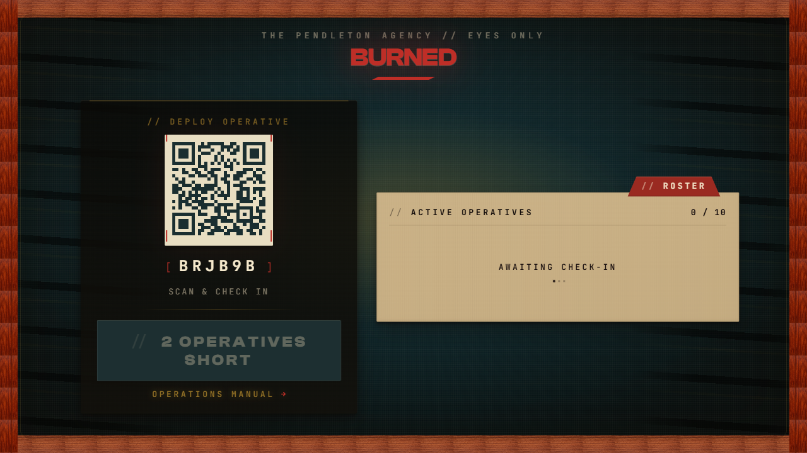

  

<h1 align="center">BURNED</h1>

  <em>The Pendleton Agency is now hiring.</em> 
  A spy-comedy party game in the key of <strong>Archer</strong> — one screen on the TV, a phone in every hand.

  <a href="https://burnedgame.pages.dev/board"><strong>▶ Play live</strong></a> ·
  <a href="https://youtu.be/c-QTDREcIzI">Watch the trailer</a> ·
  <a href="#built-by-machines-directed-by-one-human">How it was built</a>

---

BURNED is a Jackbox-style party game for **2–10 players**. The shared screen — a TV or a laptop — is the agency briefing table. Everyone else plays from their **phone**, where their hand stays secret. Recruit, sabotage, bluff, and try not to get… *burned.*

It's a spy-comedy reskin of *Exploding Kittens: Party Pack* (the [rules reference](docs/RULES-REFERENCE.md) maps the lineage), rebuilt from the felt up into the world of The Pendleton Agency.

## ▶ Watch the trailer

## Play it now

**[burnedgame.pages.dev/board](https://burnedgame.pages.dev/board)** — open `/board` on a TV or laptop to host, then everyone scans the QR code to check in. No installs, no app store. New recruit? The [Operations Manual](https://burnedgame.pages.dev/howtoplay) walks through every move.

## Built by machines, directed by one human

Here's the part that makes this repo unusual.

A guy who builds data pipelines wanted his favorite card game on a screen — and had no idea how to build it. So he didn't. He handed it to an AI and *directed.* Not one image, not one sound, not one line of the application code was written by his hand.

The human leverage was in the planning, not the typing:

| | |
|--:|:--|
| **~43,000** | lines of code |
| **~29,000** | lines of tests |
| **~62,000** | lines of planning docs |

*More planning than code.* The human's job was taste and direction; the machines did the build. BURNED is, first and foremost, an **engineering proving ground** for that thesis — a real, polished, shipping multiplayer product, made end to end that way.

## How it plays

- **2–10 players**, one **120-card** deck.
- The **shared screen** shows the draw pile, the discards, the operative roster, and all the drama.
- **Phones** are private controllers — your hand, your plays, your secrets. Card identities never touch the board.
- A flat **10-second Intercept window** at every player count — breathing room over twitch reflex.
- **Archer visual language**, taken literally: bold line illustration, flat color fills, a warm teal/orange/cream palette, color-blind safe. Every screen has to answer one question — *could this be a frame from an Archer episode?*

## Built with

| Layer | Choice |
|---|---|
| Server | `partyserver` on Cloudflare Workers + Durable Objects — one authoritative room per game |
| Client | React 19 · TypeScript · Vite 8 |
| Motion | Framer Motion (LazyMotion) |
| Validation | Zod, at the WebSocket boundary (server-side) |
| Tests | Vitest · fast-check · Playwright |

**One codebase, two front doors.** `board.html` is the landscape TV view; `player.html` is the portrait phone controller. The Durable Object room is the single source of truth — clients send intents, the server validates, dispatches, and broadcasts a tailored projection to each viewer (so your cards never leak to the shared screen).

## Dig deeper

- **[CLAUDE.md](CLAUDE.md)** — the orientation hub: conventions, guardrails, and the full document index.
- **[Product Specification](docs/PRODUCT-SPECIFICATION.md)** — the locked contract; every product decision traces here.
- **[Rules Reference](docs/RULES-REFERENCE.md)** — canonical rules, audited against the official rulebook.
- **[Architecture](docs/ARCHITECTURE.md)** · **[Deploy](docs/DEPLOY.md)** · **[Setup](docs/SETUP.md)** · **[Contributing](CONTRIBUTING.md)**
- **[Domain conventions](docs/conventions/)** — motion, engine, server, client, dev-environment, assets.
