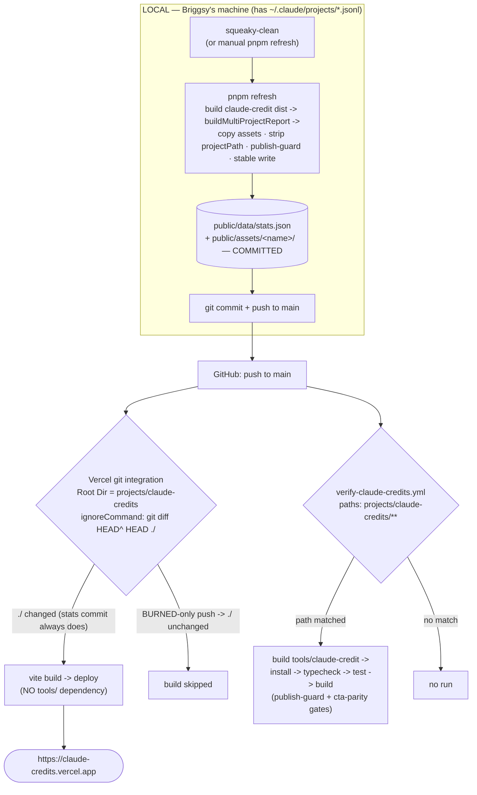

# Phase 8 — Deploy

**Prereq:** Read [README.md](README.md) first — the bar, locked decisions, and visual system live there. Read [phase-2-data-wiring.md](phase-2-data-wiring.md) (the `pnpm refresh` pipeline this phase ships behind — `scripts/refresh-stats.ts`, the in-process publish guard, the `../../../tools/claude-credit/dist/*.js` relative imports, and the **Open decision #2** this phase RESOLVES), [phase-3-hero.md](phase-3-hero.md) (the Null-degrade path — why null tokens are not acceptable on the deployed hero), [phase-1-scaffold.md](phase-1-scaffold.md) (the `vercel.json` + self-hosted fonts + `connect-src 'self'` CSP scaffold this phase finalizes), and [phase-6-about.md](phase-6-about.md) Decision 5 (the cadence copy already written Phase-8-safe — "do not mirror README line 71"). This file is the decisions-not-code recipe for getting the site live and keeping its numbers honest.

Phase 8 lands **deploy + the freshness model**. It is the phase that finally answers the question the README locked wrong and Phase 2 flagged open: **where do the numbers come from on a server that has none of Briggsy's session history.** The answer reshapes the cadence the README assumed. Mechanically the phase is small — a Vercel link, a `vercel.json`, one CI workflow, one global-skill edit — but it owns one real architecture decision (local-vs-CI refresh) and a single-source reconciliation across four documents.

The bar for "Phase 8 done": the site is live at `https://claude-credits.vercel.app` (or the fallback) in **both** color modes with **real, non-null** token numbers on the hero; an unrelated monorepo push (a BURNED-only commit) does **not** rebuild claude-credits; a `pnpm refresh` + commit + push **does** redeploy with fresh numbers; the verify workflow goes green on a claude-credits push; and the word "lifetime" appears nowhere — every token surface still carries its retention window. **Eye-on-the-live-site, both modes, is the gate** (manifesto: runtime truth > a green workflow).

---

## Decisions locked at this deepening (read before executing)

1. **`pnpm refresh` runs LOCALLY, never on a CI runner — this is the architecture decision Phase 8 owns, and it resolves the README/§8.3 contradiction (Phase 2 Open decision #2).** Verified at deepening: `claude-credit` derives token figures by parsing `~/.claude/projects/*.jsonl` and the project roster from `~/.claude-credit-projects.yaml` — **both live only on a developer's machine**. `buildMultiProjectReport({})` on a clean Linux GitHub-Action runner finds neither → every project's `tokens` is `null` → `combined.totalTokensProcessed === 0` → the hero's dominant number (Phase 3 Option A, locked) renders empty. So regeneration **must** run where the session history lives. `public/data/stats.json` is committed; CI and Vercel only ever **consume** the committed file.
   - **Rejected (b) — regenerate git/asset data in CI, accept null tokens:** kills the hero, violates the bar. To be precise about what's *forced* vs *chosen*: **only the token figures are technically forced local** (no JSONLs on a clean runner); the git-derived stats (authored lines, commit counts, cadence, asset bytes) live in the repo and *could* refresh in CI. We deliberately keep the **whole** `stats.json` local-only anyway — one source of truth, one regeneration moment, one "as-of" date — rather than split it into a CI-refreshed git half + a local token half (two refresh paths racing on one file, two cadences to reason about). So this is a simplicity/honesty choice on top of a hard constraint, not a pure necessity.
   - **Rejected (c) — ship session JSONLs to the runner:** that is exactly the PII `stripForPublish` exists to remove. Non-starter.
   - This is the model phases **2** (line 763), **3** (Null-degrade discipline), **5** (data-sparse content floor), and **6** (About §5) already assume. Phase 8 only makes it official and cleans up the surfaces that predate the Phase 0 discovery that tokens are local-only.

2. **A dedicated standalone refresh skill is the trigger — NOT a global `squeaky-clean` edit (locked with Briggsy 2026-05-24).** Under Decision 1 there is no automated regeneration; the site updates only when the refresh runs locally. Rather than bolt that onto the global `squeaky-clean` skill (which would add weight to a skill that runs in *every* project, and — since claude-credits is rarely *worked in* after launch — would mostly never fire anyway), the trigger is a **standalone project skill/command** (e.g. `refresh-credits`) invoked deliberately when you want to update the showcase: before sharing it, after notable work. It (1) builds `tools/claude-credit` first so `assertDistFresh` can't hard-stop (see Decision 5 + the `dist` landmine), (2) runs `pnpm refresh`, (3) commits + pushes → Vercel auto-deploys. **No global skill is modified → zero cross-project blast radius** (this is what the reviewers' "bare `refresh` name is an overloaded footgun" finding pushed us away from). Honesty between runs is carried by the as-of-date (Decision 9), so a deliberate manual cadence is fine for a showcase. Plain `pnpm refresh` + commit by hand stays the always-available path; the skill is just the ergonomic wrapper.

3. **Deploy is Vercel Git integration (the GitHub app), NO deploy Action — claude-credits links exactly like UMB.** Verified: `projects/undercover-mob-boss/.vercel/project.json` exists (gitignored — `projectId`/`orgId`/`projectName`) with **no** workflow file. The repo's established Vercel pattern is per-project CLI link + git integration. (BURNED's `deploy-burned.yml` deploys to **Cloudflare** via `wrangler-action` — it is not a Vercel precedent.) claude-credits runs `vercel link` from `projects/claude-credits/`, **Root Directory = `projects/claude-credits`**, framework preset **Vite** (zero-config: build `vite build`, output `dist`, install `pnpm install`). The push that carries the committed `stats.json` IS the deploy trigger. README "Host" row already says this — aligned, no change.

4. **Monorepo build-skip via `vercel.json` `ignoreCommand` — unrelated pushes must not rebuild claude-credits.** Verified (Vercel docs, `vercel.json` `ignoreCommand`): `"git diff --quiet HEAD^ HEAD ./"` exits **0 → skip build** when the Root Directory had no change in the diff, **1 → build** when it did. A BURNED-only push → claude-credits build skipped; the local stats commit always touches `projects/claude-credits/public/data/stats.json` → always within `./` → always rebuilds.
   - **Caveat (locked, accepted):** `HEAD^ HEAD` compares only the **last** commit of a push. A claude-credits change buried in an *earlier* commit of a multi-commit push could be skipped — it self-heals on the next push that touches the dir. Acceptable for a showcase; the alternative (`turbo-ignore`) drags in Turborepo for no other benefit. The dashboard "Skip deployment" toggle is the equivalent of the ignoreCommand; the **in-repo `ignoreCommand` is preferred** (versioned, declarative, survives a project re-import).
   - **Fail-safe direction:** on Vercel's default shallow clone, `HEAD^` may not resolve (e.g. the very first commit, or a fetch depth that excludes the parent); `git diff` then exits with an *error* code (neither 0 nor 1), which Vercel treats as **build** (the safe direction — it builds when uncertain, never falsely skips). The skip path fires only when `HEAD^` resolves AND `./` is unchanged. The first production deploy therefore uses `vercel --prod` (§8.5), which bypasses the ignore step entirely — the skip behavior is validated on the *second* relevant push, not the first.
   - **No `[skip ci]` / commit-message magic anywhere.** Deploy gating is purely the git-diff above. (This deliberately drops §8.3's original `[skip ci]` advice, which only existed to break the Action-commit loop that Decision 1 deletes — and which would have *also* told Vercel to skip the very deploy we want.)

5. **The deployed site has ZERO build-time dependency on `tools/claude-credit`.** Verified: the runtime site `fetch`es the committed `stats.json` (Phase 2 Decision 4) and never imports `claude-credit`. The only couplings to `claude-credit/dist` are the LOCAL `scripts/refresh-stats.ts` and the vitest publish-guard/type imports — **neither runs on Vercel**. So Vercel's `vite build` (Root Directory `projects/claude-credits`) needs nothing from `tools/`. This clean separation is *why* option (a) is sound: Vercel needs neither the tool, its `dist`, nor the JSONLs.

6. **The only CI is a LIGHT path-filtered verify workflow (`verify-claude-credits.yml`), replacing §8.3's refresh-Action (light posture locked with Briggsy 2026-05-24).** Path-filtered to `paths: ['projects/claude-credits/**']`, it confirms **the site still bundles into a deployable `dist/` on a clean runner** and nothing more. It does **NOT** deploy (Vercel does), **NOT** regenerate data, **NOT** build the sibling `tools/claude-credit`, and **NOT** run the test suite. Rationale: the local pre-push checks already run the full typecheck + tests, and the in-process publish guard already blocks bad data *before* commit — so CI is a backup, and the light shape deliberately **avoids the one cross-package dependency** (the `tools/claude-credit` build) that would otherwise false-alarm red on a tool-only change. Because it never touches `tools/claude-credit`, it has no gitignored-`dist` dependency and no false-alarm surface.
   - **Typecheck nuance (resolve at execution against Phase 1's `build` script):** a *full* typecheck pulls in `scripts/refresh-stats.ts`, which imports `tools/claude-credit/dist` types — that would re-introduce the tool dependency. So the light workflow either runs `vite build` directly, or scopes typecheck to `src/` only. Pick whichever Phase 1's actual `build` script makes clean; the invariant is "no sibling-tool build in CI."
   - **Deliberately deferred (trivial future upgrades, NOT v1):** the *full* posture would add the publish-guard + cta-parity test run (which needs the sibling-tool build) and a `grep -r GEMINI dist/` secret-leak check. Both are near-free to add later if the backup ever feels thin; v1 stays light. Reconciles README verification #11 (renamed from `refresh-claude-credits.yml`).

7. **`vercel.json` is INHERITED from Phase 1 §1.11 — Phase 8 ADDS the deploy-only pieces, it does NOT redefine the headers/CSP/rewrites.** Verified: Phase 1 §1.11 already ships a full `vercel.json` with a **stricter CSP than UMB's** — `default-src 'none'; script-src 'self'` (**NO `'unsafe-inline'` on scripts**), `style-src 'self' 'unsafe-inline'` (required for React inline `style={{}}` + GSAP transform mutations — keep it), `font-src 'self'` (self-hosted, Phase 1 §1.9c), `connect-src 'self'`, `img-src 'self' data:` — plus an **explicit `/data/(.*) → /data/$1` identity rewrite ordered BEFORE the SPA `/(.*) → /index.html` catch-all** so the JSON file is served directly, never swallowed (belt-and-suspenders on top of Vercel's filesystem-before-rewrite precedence). **Do NOT loosen any of this** (an earlier draft of this phase wrongly proposed `default-src 'self'` + `script-src 'unsafe-inline'` — rejected; Phase 1's is correct and tighter). Phase 8's ONLY additions to that file: (a) `ignoreCommand` (Decision 4), (b) a long `max-age=31536000, immutable` cache rule for Vite-fingerprinted `/assets/*` JS/CSS, (c) `X-Content-Type-Options: nosniff` on the `/assets/(.*)` route (Vercel header matching is most-specific-wins, so the catch-all's `nosniff` does NOT apply there — add it explicitly), and (d) confirm `/data/stats.json` is `max-age=0, must-revalidate` (it changes per refresh).

8. **Subdomain `claude-credits.vercel.app`, fall back to `claude-credits-briggsy.vercel.app`** (README lock — if the primary is taken at link time, take the fallback **without stopping to ask**; it's already the locked choice). The `.vercel/` link dir stays **gitignored** (per-machine), matching UMB. **Auth is a pre-execution go/no-go gate, not a mid-run manual step:** before §8.1, check `vercel whoami`. It should pass (the CLI is already authed on this machine — UMB's org `team_RqsnFOyhteXwI6i0UbGQOMAz`). If it does NOT, that is a hard blocker surfaced up front (autonomy rule: an un-automatable auth step is flagged as a blocker before work begins, never injected as a silent manual step mid-execution).

9. **Freshness is HONEST, not hidden — render a visitor-facing "as of <date>" from the EXISTING `scannedAt` (locked with Briggsy 2026-05-24).** Because the trigger is manual (Decision 2), the numbers can sit unchanged for weeks. Every guard the plan/phases wrote checks for *null/empty* tokens — none catches *stale-but-real* data, so a months-old hero would otherwise pass every gate and silently imply liveness (the counter animation reads "live" even when the value is frozen). Fix: render **"numbers as of <month/date>"** near the hero (and in About §5). **No new field is needed** — `MultiProjectReport.scannedAt` already exists (Phase 0 data contract) and is written every refresh; Phase 2 line 783 already flagged surfacing it as "a Phase 3/6 content decision." Paired with the already-committed window line ("across the last ~30 days of session retention, never lifetime" — README 8c), the site is honestly dated on both axes: *when last measured* (`scannedAt`) and *how far back the data reaches* (window). This is a **cross-phase render decision Phase 8 owns but does not build**: surface the existing `scannedAt` in Phase 3 (hero) + Phase 6 (About §5) — see Cascade.

---

## Source facts (verified at deepening, 2026-05-24)

**Token data is local-only (the fact that forces Decision 1):**
- `claude-credit` token figures parse `~/.claude/projects/*.jsonl`; the roster comes from `~/.claude-credit-projects.yaml`. Both are developer-machine state, absent on a clean checkout. (`phase-2-data-wiring.md` lines 44–47, 750, 763; `phase-0-data-gaps.md` line 65.)
- Session JSONLs rotate ~30 days → any tally is a **window-bounded floor, never lifetime** (`phase-0-data-gaps.md` line 591). The window footnote is mandatory on every token surface (README gates 8b/8c).

**Established repo deploy patterns (verified by reading the files):**
- `projects/undercover-mob-boss/.vercel/project.json` — gitignored Vercel link, no workflow → the Vercel git-integration pattern this phase copies.
- `.github/workflows/deploy-burned.yml` — path-filtered (`paths: ['projects/burned/**']`), `verify` job (typecheck/test/build) gating deploy, pnpm v10 + node 22 + `--frozen-lockfile`. **Cloudflare**, not Vercel — the shape to mirror for `verify-claude-credits.yml`, not the target.
- `projects/undercover-mob-boss/vercel.json` — the headers/CSP/rewrites template (§8.2 trims it).
- `tools/claude-credit/dist` — **gitignored** (`tools/claude-credit/.gitignore`: `node_modules/`, `dist/`, …; `git check-ignore` confirms) → never present on a fresh clone or CI runner → CI must build it (Decision 6). `tools/claude-credit` HAS a `pnpm-lock.yaml` but **no `packageManager` field**.
- Repo remote: `github.com/mbriggsy/ai-learning-journey` (Vercel git-integration target). Not a pnpm workspace (Phase 1 Decision 8) → cross-package imports are relative file paths, and each package installs independently.

**Vercel behavior (verified via Context7 / Vercel docs, not memory):**
- `vercel.json` `ignoreCommand` overrides the Ignored Build Step; exit 1 = build, exit 0 = skip (`/docs/project-configuration/vercel-json`).
- Monorepo "Skip deployment" / Ignored Build Step skips unaffected projects (`/docs/monorepos`, `/docs/builds/configure-a-build`).
- Vite SPA deep-linking = `rewrites: [{ source: "/(.*)", destination: "/index.html" }]` (`/docs/frameworks/frontend/vite`).
- pnpm install is supported zero-config; Vite is a first-class framework preset.

---

## The deploy model (locked)

> *Directional — illustrates how a local refresh reaches the live site and what each push does. Not implementation specification.*



Two independent consumers of the same push (Vercel deploy, CI verify); **neither regenerates data**. The data is born on the local machine and travels as a committed file.

---

## Output structure (what this phase adds)

```text
projects/claude-credits/
├── vercel.json                       # AUGMENT — Phase 1 §1.11 authored headers/CSP/rewrites; §8.2 ONLY adds ignoreCommand + /assets cache + nosniff
└── .vercel/                          # CREATED by `vercel link` — GITIGNORED (per-machine, like UMB)
    └── project.json

.github/workflows/
└── verify-claude-credits.yml         # NEW — LIGHT verify (vite build only); NO deploy, NO data refresh, NO sibling-tool build, NO tests

<dedicated refresh skill>             # NEW — standalone `refresh-credits`: build tool → pnpm refresh → commit → push.
                                      #       NO global skill edited (squeaky-clean untouched).
```

No `src/` changes in this phase. No new package dependencies. (Decision 9's `generatedAt` field is a Phase 0/2/3/6 cascade, not authored here.)

---

## Dependencies

- **Phases 0–7 complete and the site building locally** — `pnpm build` + `pnpm refresh` both clean (README verification 3 + 5). Phase 8 deploys what exists; it does not author site code.
- **`tools/claude-credit` builds** (`tsc -p .` → `dist/`) — needed by the LOCAL refresh skill (`assertDistFresh`); **not** by the light verify workflow (Decision 6) and **not** by Vercel (Decision 5).
- **Vercel CLI authed** on the deploy machine (Decision 8) — else a `vercel whoami` go/no-go blocker.
- **No new npm deps.** GitHub-Action `uses:` pins (`checkout@v4`, `pnpm/action-setup@v4`, `setup-node@v4`) match the existing sibling workflows.
- **Cross-phase dependency — pnpm-version parity (Phase 1 owns the artifact, Phase 8 depends on it):** Vercel auto-detects the package manager from the lockfile, and the verify workflow pins pnpm **v10**. For Vercel, CI, and local to resolve identically, Phase 1's `package.json` must carry `"packageManager": "pnpm@10.x"`. If Phase 1 didn't add it, that is a Phase-1 fix this phase requires — not a Phase 8 task, but a go/no-go gate (below).
- **Cross-phase render — "as of <date>" (Decision 9):** uses the EXISTING `MultiProjectReport.scannedAt` (no new field); Phase 3 (hero) + Phase 6 (About §5) render it. Phase 8 owns the *decision*, not the render (see Cascade).

---

## Execution — five steps, ordered

### 8.1 — Link the Vercel project
Pre-gate: `vercel whoami` must succeed (Decision 8) — if not, stop and surface the auth blocker before proceeding. Then run `vercel link` from `projects/claude-credits/`. Set **Root Directory = `projects/claude-credits`**, framework preset **Vite**, build `vite build`, output `dist`, install `pnpm install`. Confirm `.vercel/` is gitignored (mirror UMB; add to `projects/claude-credits/.gitignore` if Phase 1 didn't).

**Verify:** `vercel link` writes `.vercel/project.json`; `git status` shows it ignored, not staged.

### 8.2 — Augment Phase 1's `vercel.json` (Decisions 4 + 7) — do NOT rewrite it
Phase 1 §1.11 already authored the headers, the stricter CSP (`default-src 'none'; script-src 'self'`), and the `/data/(.*) → /data/$1` + SPA rewrites. This step makes ONLY four additive edits (Decision 7): (a) add `"ignoreCommand": "git diff --quiet HEAD^ HEAD ./"`; (b) add a `/assets/(.*)` header block with `Cache-Control: public, max-age=31536000, immutable` **and** `X-Content-Type-Options: nosniff`; (c) confirm `/data/stats.json` (or the `/data/(.*)` block) carries `Cache-Control: public, max-age=0, must-revalidate`; (d) leave the CSP **untouched** — do not add `'unsafe-inline'` to `script-src`, do not relax `default-src`.

**Verify:** `pnpm build && pnpm preview` — `/about` deep-link resolves (SPA rewrite), `/data/stats.json` returns JSON (not `index.html`), no CSP console violations in either mode. **This is a preview check only — the production filesystem-vs-rewrite ordering differs from `vite preview` and is re-checked as a blocking go/no-go at first deploy (Operational notes).**

### 8.3 — Add `verify-claude-credits.yml` (Decision 6 — LIGHT)
At `.github/workflows/verify-claude-credits.yml`. Path-filtered to `projects/claude-credits/**`. Single job: checkout → pnpm v10 → node 22 → `pnpm install --frozen-lockfile` (claude-credits only) → **bundle build only** (`vite build`; if Phase 1's `build` script chains a full cross-package `tsc`, run `vite build` directly or scope typecheck to `src/` — Decision 6 nuance — so the sibling tool is never required). No `tools/claude-credit` build, no test run, no deploy, no commit-back.

**Verify:** push a trivial claude-credits change → workflow runs green; push a BURNED-only change → it does **not** trigger (path filter); it never goes red over a `tools/claude-credit`-only change (no cross-package dependency).

### 8.4 — Create the dedicated refresh skill/command (Decision 2)
A standalone `refresh-credits` skill/command (no global skill is edited). It: (1) builds `tools/claude-credit` (`pnpm install` + `tsc -p .`) so `assertDistFresh` can't hard-stop; (2) runs `pnpm refresh` in `projects/claude-credits/`; (3) commits the `stats.json` + asset delta and pushes (Vercel auto-deploys). Invoked deliberately when updating the showcase. Home (project-local `.claude/skills/` vs global `~/.claude/skills/refresh-credits/`) is an execution-time choice — it must NOT modify `squeaky-clean`.

**Verify:** invoke it → `tools/claude-credit` builds, `pnpm refresh` regenerates `stats.json`, the delta is committed + pushed, Vercel redeploys with fresh numbers + an updated `generatedAt`. `squeaky-clean` is unchanged (diff `~/.claude/skills/squeaky-clean/SKILL.md` → no change).

### 8.5 — First deploy, subdomain, smoke
Trigger the first production deploy with **`vercel --prod`** (NOT a git push) — this bypasses the `ignoreCommand` uncertainty on push #1 (Decision 4 fail-safe note). Claim `claude-credits.vercel.app`; fall back to `claude-credits-briggsy` if taken (Decision 8). Smoke the live URL, then validate the build-skip on the next BURNED-only push.

**Verify:** the live site loads in **both** modes with **real, non-null** hero token numbers + the retention-window sub-line; no console/network/404 errors; the full README verification checklist (10, 11, 17 at minimum) passes on the deployed URL, not just locally.

---

## Landmines

- **A clean runner cannot make the numbers.** If anyone ever "moves refresh to CI for convenience," tokens silently go null and the hero empties. The local-refresh model (Decision 1) is load-bearing, not a preference. Guard: README gate 8b + the hero Null-degrade path make an empty hero visible, but the *fix* is always "refresh locally and commit."
- **Stale-but-real data passes every null-check.** Guards catch empty tokens, not *old* ones — a months-old hero looks fine and the counter animation implies liveness. The only defense is Decision 9's `generatedAt` "as of <date>"; if that field/render is dropped in the Phase 0/2/3/6 cascade, the staleness gap reopens silently. The freshness honesty is the mitigation, not an empty-check.
- **`ignoreCommand` only sees the last commit of a push** (Decision 4 caveat). A claude-credits change in an earlier commit of a multi-commit push can skip the build until the next dir-touching push. Don't "fix" this by removing the ignoreCommand — that reintroduces a full rebuild on every BURNED push.
- **`dist` is gitignored** (Decision 6). Any CI or fresh clone that runs claude-credits `typecheck`/`test` MUST build `tools/claude-credit` first, or imports of `dist/*.js` / `*.d.ts` fail. Build-first is also the local rule (Phase 2 line 764) — and `pnpm refresh` itself hard-stops via `assertDistFresh` if `dist` is stale, so the refresh script must build the tool first (see Decision 2 / §8.4).
- **Self-hosted fonts mean the CSP must NOT carry Google-Font origins** (Decision 7). Copying UMB's CSP verbatim re-opens `fonts.gstatic.com` and the realtime `ws:`/`wss:` we don't use — a needless attack surface. Trim it.
- **`.vercel/` is per-machine and gitignored.** It is not a deploy artifact to commit; the deploy lives in Vercel's project config, keyed by the link.
- **The refresh trigger is a STANDALONE skill — do not bolt it onto `squeaky-clean`** (Decision 2). A global-skill hook keyed on a bare `refresh` script name is an overloaded footgun across future projects; the dedicated skill avoids it. Keep `squeaky-clean` untouched.

---

## System-wide impact

- **Interaction graph:** one push to `main` fans out to (a) Vercel git integration and (b) `verify-claude-credits.yml`, independently. Neither writes data. The squeaky hook is the only writer, and it runs before the push.
- **The deploy is genuinely UNGATED — name the compensating controls (do not imply CI protects production).** A push that ships bad data or a stale `CURRENT_CTA_STATE` **still goes live** — and under the *light* verify workflow (Decision 6) CI doesn't even run the publish-guard / cta-parity tests; they run only in the **local pre-push checks**. So the load-bearing guards are, precisely: (1) the **only** thing that stops bad *data* reaching prod is the **in-process publish guard inside `pnpm refresh`** (runs locally, before commit, refuses to write poisoned JSON); (2) the **only** automated thing that stops bad *code/data* in CI is the light bundle build (catches "doesn't build"); (3) the backstop for everything else is **the human eye on the live site**. Operational consequence: the post-deploy live smoke (Operational notes below) is **mandatory, part of the deploy**, not optional. (Upgrading CI to the full posture — tests + secret grep — or gating Vercel's build on `pnpm test` are the escape hatches if this ever bites; both deferred, see below.)
- **API surface parity:** the cadence story now lives in three honest places — README "Update cadence" row, About §5, and this phase. All three must say "regenerated locally via a dedicated refresh skill where session history lives; the site auto-deploys the committed file from `main`" — and the visitor sees an "as of <date>" (Decision 9). The Cascade below enforces it.
- **Unchanged invariants:** the data contract (Phase 0), the `stats.json` fetch path (Phase 2 Decision 4), and the strip-for-publish guarantee are untouched — Phase 8 changes *where refresh runs and how the site deploys*, not *what the data is*.
- **Invariant — Vercel needs ZERO environment variables.** Verified: the only secret is `GEMINI_API_KEY` (gitignored `.env`), consumed by the *local* asset/refresh pipeline, never at Vercel build or runtime (the site fetches a static `stats.json`). State this as a positive assertion: **if the Vercel build ever asks for an env var, something leaked a build-time dependency on the tool** (a Decision-5 violation) — investigate, don't paper over it with a Vercel env var.

---

## Operational notes (rollback · go/no-go · monitoring)

A deploy phase needs a recovery path written down *before* it's live, not improvised when it breaks. Plain-language for the git-simplicity rule (no jargon, work on main, roll back if needed).

**Rollback — three tiers, pick by failure type:**
1. **Broken UI/CSS/JS, data fine → Vercel Instant Rollback (primary).** In the Vercel dashboard: Deployments → pick the last good one → **Promote to Production**. Re-points the live alias at an already-built deployment in seconds — **no rebuild, no git**. Works even if the dev machine is offline.
2. **Bad data committed (empty/poisoned `stats.json`) → promote-old is only a stopgap.** The bad data is baked into the artifact *and* sitting in git, so promoting an old deployment hides it temporarily; the real fix is the local-refresh model this phase owns — regenerate `stats.json` locally, commit, push → fresh deploy.
3. **A code change must leave `main` permanently → revert the commit and push** (plain: "undo the last commit and push it"). Vercel rebuilds from the reverted tree.

**First-deploy go/no-go (must be TRUE or STOP — these are *before-you-push* gates, distinct from the done-gate below):**
- [ ] `pnpm refresh` ran **on this machine** and `public/data/stats.json` has **real, non-null** tokens + the retention-window field. (Null → JSONLs/roster not found → that's the whole point of Decision 1; never deploy an empty hero.)
- [ ] `pnpm build && pnpm preview` clean locally in **both** color modes (the last gate before an ungated production deploy).
- [ ] **pnpm v10 parity** — `package.json` carries `"packageManager": "pnpm@10.x"` so Vercel + CI + local agree (cross-phase dep on Phase 1 — fix there if absent).
- [ ] **Root Directory = `projects/claude-credits`** confirmed in the Vercel *project settings*, not just assumed from `vercel link`. A wrong Root Directory is the #1 first-deploy monorepo failure (builds the repo root, finds no Vite app).
- [ ] **Zero env vars on Vercel** (invariant above) — if the build asks for one, stop and find the leaked dependency.
- [ ] **Don't misread push #1.** The `ignoreCommand` can't be validated on the first deploy (no prior production deployment; `HEAD^` undefined behavior) — expect it to build regardless. Verify the *skip* behavior on the **second** relevant push (a BURNED-only push after claude-credits is live), not the first.
- [ ] **Subdomain race is auto-resolved, not a blocker.** If `claude-credits.vercel.app` is taken at link time, take `claude-credits-briggsy` **without stopping to ask** (locked fallback, Decision 8) and update any doc hardcoding the primary URL.

**The multi-commit `ignoreCommand` operational rule (makes Decision 4's caveat a known two-second fix):** keep the refresh/stats commit as the **last** commit of any push meant to update the live numbers — otherwise a buried stats commit can be skipped. If the hero ever looks stale after a push, that's the cause: push any claude-credits change to trigger a rebuild. The smoke check below is what catches it.

**Monitoring posture ("no analytics" ≠ "no monitoring"):**
- **Enable Vercel deployment-failure notifications** (email/dashboard) — free, no analytics, the single highest-value signal: it tells you a push didn't go live.
- **The per-deploy live smoke IS the health check** — once per production-affecting deploy, both modes: real non-null hero number, the live `/data/stats.json` matches the just-committed file (a stale CDN copy = old numbers = looks like the refresh didn't deploy), `/data/stats.json` and `/assets/*` resolve to **real files** not the SPA `index.html` fallback (the filesystem-before-rewrite ordering is platform behavior — prove it in *production*, not just `vite preview`), no console/network/404. Nothing continuous is warranted for a no-traffic static site; Vercel Web Analytics stays out of scope.
- **Light verify keeps signal clean.** Because the workflow only bundles the site (no sibling-tool build, no tests — Decision 6), a red here means the site genuinely doesn't build — it won't false-alarm on a `tools/claude-credit`-only change. A red verify still does NOT mean the live site is down (Vercel deploys independently), but it does mean the *next* build would break.

## Cascade (corrections this deepening forces elsewhere — applied in the deepen commit)

The single-source sweep the TODO landmine calls for (`feedback-stats-single-source`). Every surface that predates the Phase 0 "tokens are local-only" discovery. **Legend:** **APPLY** = edited in THIS deepen commit; **VERIFY** = already corrected in a prior phase's deepen, confirmed consistent here (no edit); **STRIKE** = obsolete content removed.

### `README.md` (this folder) — line 71 "Update cadence" row — APPLY
Rewrite from *"GitHub Action on every push to main, runs claude-credit…"* to: regeneration runs locally via a **dedicated `refresh-credits` skill** (Decision 2) where session history lives; `stats.json` is committed; Vercel auto-deploys the committed file on push; the only CI is a **light** verify workflow; the site shows an **"as of <date>"** (Decision 9). The "Host" row already says "no GitHub Action for the deploy itself" — keep it (now fully consistent).

### `README.md` (this folder) — verification #11 — APPLY
Rename `refresh-claude-credits.yml` → `verify-claude-credits.yml` and reframe from "regenerates the numbers" to **"runs a light bundle build on a claude-credits push (no deploy, no data refresh, no sibling-tool build, no tests)."**

### `README.md` (this folder) — verification 8b/8c + hero gates — APPLY (Decision 9)
Add a `generatedAt` "as of <date>" expectation alongside the existing window-footnote gates (8c), so the freshness-honesty surface is part of the done-check, not just the window.

### `phase-3-hero.md` + `phase-6-about.md` — render "as of <date>" — APPLY (Decision 9, cross-phase)
**No new field** — render the EXISTING `MultiProjectReport.scannedAt` (Phase 2 line 783 already flagged this as "a Phase 3/6 content decision; the data is available"). Hero: a quiet "numbers as of <date>" near the retention-window sub-line. About §5: same, woven into the cadence prose. This is the staleness mitigation (the only thing that catches stale-but-real data).

### `phase-2-data-wiring.md` — line 99 parenthetical — APPLY
*"(The Phase 8 GitHub Action commits the regenerated file on each push.)"* → *"(stats.json is committed by the local refresh — the dedicated `refresh-credits` skill or manual `pnpm refresh` — never regenerated in CI; see Phase 8 Decision 1.)"* (Phase 2's line 763 already flagged this open; this closes it.)

### `phase-2-data-wiring.md` — publish-guard HARD patterns — APPLY (security finding, deferred to Phase 2 execution)
Add XSS-injection signals to the HARD (scan-everywhere) tier: `/<script/i` and `/javascript\s*:/i`. Zero false-positive risk in any schema field (including `.editorial.` copy), and they close the gap where a malicious editorial/string value could reach the DOM. (Phase 2 owns the guard; noted here so the security finding isn't lost.)

### `phase-6-about.md` — §5 (Decision 5) — VERIFY + light touch
Already Phase-8-safe ("regeneration runs where session history lives — a developer's machine, not a stateless CI runner"; "Do not mirror README line 71"). Confirm consistent; if it names a trigger, align it to the dedicated skill and add the "as of <date>" (Decision 9). No structural change.

### `TODO.md` (project root) — cadence landmine — APPLY after the above
The "Cadence copy is Phase-8-stale in TWO places" landmine is resolved once the README + Phase 2 edits land; strike it. The "where does `pnpm refresh` run" open question is now answered (Decision 1, dedicated skill) — fold into the executed-decision record.

---

## Out of scope for Phase 8 (explicit "later")

- **Custom domain** (`briggsy.dev/credits`) — README out-of-scope; `*.vercel.app` ships v1.
- **A daily/cron refresh** — pointless under Decision 1 (a cron runner has no JSONLs). Dropped from §8.3's original design.
- **Full verify-CI posture** — the test run + sibling-tool build + `grep -r GEMINI dist/` secret-leak check are deferred (Decision 6); v1 ships the light bundle-build-only workflow. Trivial to upgrade later.
- **Global `squeaky-clean` integration** — explicitly NOT done (Decision 2). The dedicated `refresh-credits` skill replaces it; `squeaky-clean` stays untouched.
- **Gating Vercel's build on the test suite** — possible hardening (build command `pnpm test && vite build`), but it drags the cross-package `tools/claude-credit` build into Vercel's install step. Not v1; the local in-process guard covers it.
- **Open Graph / preview cards, analytics (incl. Vercel Web Analytics), SSR** — all README out-of-scope.
- *(CSP note: there is nothing to "tighten later" — Phase 1's inherited `script-src 'self'` already carries no `'unsafe-inline'`; the only `'unsafe-inline'` is on `style-src`, which React inline styles + GSAP transforms genuinely require. Leave it.)*

---

## Verification (Phase 8 done gate)

1. ✅ `vercel link` done; `.vercel/` gitignored, not staged; Root Directory = `projects/claude-credits`, preset Vite.
2. ✅ `vercel.json` AUGMENTED (not rewritten): `ignoreCommand` + `/assets` immutable cache + `X-Content-Type-Options: nosniff` on `/assets` added; Phase 1's CSP **unchanged** (`default-src 'none'`, `script-src 'self'` — no `unsafe-inline` on scripts); `/data/stats.json` deep-links to JSON (not `index.html`) in preview AND production.
3. ✅ `verify-claude-credits.yml` path-filtered to `projects/claude-credits/**`; **light** (bundle build only — no sibling-tool build, no tests); green on a claude-credits push; does **not** trigger on a BURNED-only push; does **not** go red on a `tools/claude-credit`-only change.
4. ✅ Dedicated `refresh-credits` skill works: builds the tool → `pnpm refresh` → commits + pushes → Vercel redeploys with fresh numbers + updated `generatedAt`. `squeaky-clean` is **unchanged**.
5. ✅ Live at `https://claude-credits.vercel.app` (or fallback) — loads in **both** modes; hero shows **real, non-null** token numbers + the retention-window sub-line + an **"as of <date>"** (Decision 9); no "lifetime" anywhere.
6. ✅ A refresh + commit + push redeploys with fresh numbers; a BURNED-only push leaves claude-credits' last deploy untouched (build skipped on push ≥2).
7. ✅ No console errors, no network errors, no 404s on the live URL (README #17).
8. ✅ Cascade applied — README line 71 + #11 + 8d, Phase 2 line 99 + Open-decision-#2 marked resolved, the "as of <date>" render of existing `scannedAt` (Phase 3 hero + Phase 6 §5), the publish-guard XSS patterns (Phase 2), Phase 0's in-process-guard reference, TODO landmine struck; About §5 + its dep/risk tables reconciled. Grep the repo for "GitHub Action … every push" / "refresh-claude-credits.yml" → zero stale hits.
9. ✅ Operational readiness: first-deploy go/no-go ran (`vercel whoami` passed, pnpm v10 parity, Root Directory set, zero Vercel env vars, real non-null local stats); the three-tier rollback path is understood; Vercel build-failure notifications enabled; production smoke (real files not SPA fallback, live `stats.json` matches committed) passed; first deploy via `vercel --prod`.

---

← [Phase 7 — Bottom CTA](phase-7-cta.md) | [Index](README.md) | Next → [Phase 9 — Visual polish](phase-9-polish.md)
