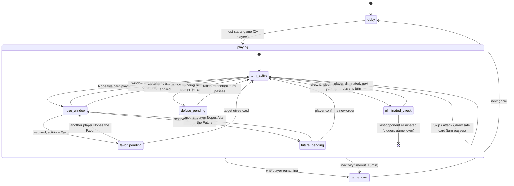

# Exploding Kittens Digital — Implementation Plan

## Enhancement Summary

**Deepened on:** 2026-04-05
**Agents used (round 1):** architecture-strategist, kieran-typescript-reviewer, performance-oracle, security-sentinel, julik-frontend-races-reviewer, framework-docs-researcher, code-simplicity-reviewer
**Agents used (round 2):** best-practices-researcher (testing), best-practices-researcher (mobile UX), Plan (state machine), Context7 (PartyKit + Framer Motion docs)
**Institutional learnings applied:** 6 (singleton state, ReadonlyDeep, dual computation, same-frame mutation, initial-state-no-event, JSON Infinity)

### Key Improvements
1. **Race condition primitives** — serial action queue, monotonic stateVersion, requestId on interactive prompts, absolute deadline timestamps
2. **Anti-cheat hardening** — server-side playerId injection, Zod validation at WebSocket boundary, card ownership verification
3. **Performance architecture** — selector-based state hooks, LazyMotion, canvas particles, layout="position"
4. **Testing architecture** — property-based testing with fast-check for engine + projection security, two-layer time testing, multi-client Playwright E2E
5. **Mobile UX** — 48dp touch targets, snap-to-card scroll, bottom-sheet modals, haptic patterns, accessibility (icon badges + contrast)
6. **State machine formalized** — Mermaid diagram, all sub-phases and transitions mapped
7. **Scope cuts** — removed PWA, ambient particle effects, slider Defuse UI, card fan rotation, swappable art abstraction

### Scope Cuts Applied
| Cut | Reason |
|-----|--------|
| PWA (service worker + manifest) | Game is inherently online. No meaningful offline state. |
| Background particle drift | Decoration with zero gameplay value. |
| Draw pile glow scaling | Nobody watches the draw pile glow. |
| Deck count color shift | The number itself is sufficient. |
| Card fan rotation | Painful to tap on small phones. Horizontal scroll is more usable. |
| Swappable art direction props | YAGNI — one art direction exists. Refactor if a second materializes. |
| Defuse slider component | Over-engineered. Numbered button row is simpler and more reliable. |

---

## Context

Digital adaptation of Exploding Kittens Party Pack. Jackbox-style: shared screen (TV) shows the game table, phones are private controllers. 2-10 players, full 120-card Party Pack, dark + premium visual direction, full theatrical animations.

**Origin:** [docs/ideation/2026-04-05-exploding-kittens-digital-brainstorm.md](../ideation/2026-04-05-exploding-kittens-digital-brainstorm.md)
*Note: Brainstorm decision #4 lists Socket.IO — superseded by PartyKit in this plan.*

**Reference architecture:** UMB (`projects/undercover-mob-boss/`) already solves multi-device Jackbox-style with PartyKit, typed protocol, dispatch engine, state projection, session reconnection, QR codes, and Vite multi-page. We steal those patterns wholesale and swap the game engine + UI framework.

## Tech Stack

| Layer | Choice | Why |
|-------|--------|-----|
| **Networking** | PartyKit (`partyserver` package, Cloudflare Workers) | Proven in UMB. Cloud-native rooms, no hosting question, deploy pipeline exists. |
| **UI Framework** | React 19 + TypeScript 5.9 | Card game needs component model. Each card = component. State management via useSyncExternalStore with selector hooks. |
| **Animation** | Framer Motion (LazyMotion + async domMax) | AnimatePresence for hand management, layoutId for card morphing, useAnimate for imperative sequences, spring physics for feel. |
| **Validation** | Zod | Runtime validation at WebSocket trust boundary. Types inferred from schemas — single source of truth. |
| **Build** | Vite 8 + pnpm | Multi-page app (board.html + player.html). **Note:** Vite 8 uses `rolldownOptions`, not `rollupOptions` (breaking change from UMB's config). |
| **Testing** | Vitest (unit) + Playwright (E2E) | Same as UMB. V8 coverage, globals: false, restoreMocks: true. |
| **QR Code** | qrcode (same as UMB) | Proven, lightweight. |

## Project Structure

```
src/
  server/
    room.ts              # PartyKit room handler (extends Server from partyserver)
    game/
      engine.ts          # dispatch(state, action) → newState + all card effect handlers
      cards.ts           # Card effect implementations (extracted from engine if >500 lines)
      types.ts           # GameState, GameAction (ActionMap pattern), GameEvent
    projection.ts        # State projection: board public, player private, getPrivateData
    validation.ts        # Zod schemas for all ClientMessage types
  client/
    board/               # TV/shared screen React app
      Board.tsx          # Main board component
      Lobby.tsx          # QR code, room code, player list, Start Game
      GameTable.tsx      # Draw pile, discard, player ring
      PlayerRing.tsx     # 2-10 player layout
      NopeWindow.tsx     # Countdown overlay
      RevealSequence.tsx # Theatrical Exploding Kitten reveal (useAnimate)
    player/              # Phone controller React app
      Player.tsx         # Main player component
      JoinScreen.tsx     # Name, color picker, room code
      Hand.tsx           # Card display with AnimatePresence
      CardPlay.tsx       # Select + confirm interaction
      DefusePlacement.tsx # Numbered button row (1 = top, N = bottom)
      TargetSelect.tsx   # Simple player/card list
      FutureView.tsx     # See the Future / Alter the Future
      GameOver.tsx       # "YOU EXPLODED" + rank
    shared/
      Card.tsx           # Card component (dark premium typographic design)
      useGameState.ts    # Selector-based useSyncExternalStore hooks (hand, turn, nope, etc.)
      connection.ts      # PartySocket wrapper (adapt from UMB)
      theme.ts           # Dark + premium color system
  shared/
    protocol.ts          # ClientMessage / ServerMessage discriminated unions (Zod-inferred)
    card-defs.ts         # All 120 card definitions with paw-print metadata
    types.ts             # Shared types — all derived from card-defs.ts, no parallel enums
board.html               # TV entry point
player.html              # Phone entry point
vite.config.ts           # Multi-page (rolldownOptions, @vitejs/plugin-react)
partykit.json            # PartyKit config
```

**Import boundary rule (enforce in CLAUDE.md):**
- `src/shared/` — types, constants, Zod schemas, pure functions ONLY. Imported by server AND client. No DOM, no side effects.
- `src/client/shared/` — React hooks, components. Client only.
- `src/server/` — PartyKit room, game engine. Server only.

## UMB Reference Files

| Pattern | UMB File | Adapt For |
|---------|----------|-----------|
| Protocol types | `src/shared/protocol.ts` | Card game messages. Add Zod schemas (UMB casts without validation — security hole). |
| Dispatch engine | `src/server/game/phases.ts` | Card effects. Use ActionMap pattern instead of switch. |
| State projection | `src/server/projection.ts` | Board + player projections. Add `getPrivateData` as separate channel. |
| Room handler | `src/server/room.ts` | Same join/reconnect/broadcast. Add serial action queue + stateVersion. |
| Vite config | `vite.config.ts` | Change `rollupOptions` → `rolldownOptions`. Add React plugin. |
| Connection client | `src/client/connection.ts` | Use `usePartySocket` hook. Selector-based state hooks. |

## Race Condition Primitives

These five primitives prevent the race conditions identified during deepening. All are under 20 lines each but without them, game night features phantom Nopes, ghost card plays, and haunted Favor screens.

| Primitive | What It Solves | Where |
|-----------|---------------|-------|
| **Serial action queue** | Two players Nope simultaneously → interleaved dispatch | `room.ts` — enqueue actions, processNext drains one at a time |
| **Monotonic `stateVersion`** | Player acts on stale state (turn already changed) | `GameState` field, required on all `ClientMessage`, server rejects mismatches |
| **`requestId` on prompts** | Favor/Future gets Noped while victim is choosing → ghost UI | Each interactive prompt carries ID, cancellation event tears down UI |
| **Absolute deadline timestamps** | Reconnecting player sees full timer bar with 1s left | Send `remainingMs` computed at send time, 200ms server-side grace |
| **Batch-then-broadcast** | Attack stacking flickers intermediate states | Dispatch resolves full chain before any broadcast |

## Institutional Learnings

- **No module-level singleton state** — per-room state on room objects only
- **No ReadonlyDeep on objects with methods** — keep state as plain data
- **Single source of timing** — Framer Motion duration config feeds game logic timer constants, not two separate values
- **Watch for same-tick mutation** — use if/else if in socket event handler chains
- **Initial state has no transition event** — game starts in 'lobby'. Systems needing lobby initialization must init explicitly, not subscribe to phase-change events.
- **No Infinity in serialized state** — `JSON.stringify({x: Infinity})` silently produces `{x: null}`. Use numeric sentinels (-1) for "no data" fields in WebSocket-transmitted state.

## Game State Machine

All phases, sub-phases, and transitions. The serial action queue guarantees exactly one sub-phase at a time. Elimination only happens on your own turn (drawing an Exploding Kitten without Defuse).



**Notes:**
- `eliminated_check` is transient — resolves synchronously within a single dispatch
- See the Future: decide during Phase 2 whether it needs `see-future-pending` sub-phase (requires player to dismiss) or is fire-and-forget (private event, no blocking)
- No simultaneous sub-phases — Nope during `favor_pending` tears down the pending state first via `requestId` cancellation

## Testing Architecture

Three independently testable units. Time-dependent logic uses injected clocks. No flaky tests anywhere.

### Game Engine: Property-Based Testing (fast-check)

`fc.commands()` model-based testing auto-generates action sequences and auto-shrinks failures to the minimal breaking case. Key invariant: **card conservation** — total cards across deck + discard + all hands always equals the starting total.

```ts
// Example: fast-check generates random action sequences, checks invariants after each
test.prop([fc.commands(gameCommands, { maxCommands: 50 })])(
  'invariants hold through any action sequence', (cmds) => {
    const state = createInitialState(4);
    fc.modelRun(() => ({ model: state, real: state }), cmds);
  }
);
```

### PartyKit Server: Mocked Connections

Engine is pure functions; room handler is thin glue. Mock `Party.Room` and `Party.Connection` objects, test routing and per-player projection.

### Nope Timing: Two-Layer Approach

- **Engine layer:** receives timestamps as parameters. `resolveNopeWindow(window, now)` is pure — zero timers, zero flakes.
- **Server layer:** uses `vi.useFakeTimers()` + `vi.advanceTimersByTime()` for the actual setTimeout scheduling.

### Projection Security: PBT

fast-check throws hundreds of random game states at `projectState`. Verify: own hand visible, opponent hands never serialized (only cardCount), drawPile contents never exposed, private data (See the Future, Defuse position) only sent to acting player.

### Multi-Client E2E: Playwright Contexts

Each player is a `browser.newContext({ viewport: { width: 390, height: 844 } })`. Board is another context. Coordinate via auto-waiting `expect().toHaveText()` — no manual sleeps. Use `page.routeWebSocket()` for message assertion.

---

## Phase 1: Foundation

**Goal:** Scaffold the project with all shared types, card definitions, and infrastructure so every subsequent phase builds on solid ground.

**Tasks:**
1. Init project: `pnpm init`, install React 19, TypeScript 5.9, Vite 8, Framer Motion, PartyKit (`partyserver`), Vitest, Zod, fast-check + @fast-check/vitest
2. Vite multi-page config: `board.html` + `player.html` entry points. **Use `rolldownOptions`** (not `rollupOptions` — Vite 8 breaking change from UMB's config)
3. React scaffold with **LazyMotion** and async `domMax` import — cuts initial Framer bundle from ~33KB to ~17KB
4. PartyKit server skeleton: `partykit.json` + empty `src/server/room.ts` extending `Server` from `partyserver`
5. Shared types in `src/shared/`:
   - `card-defs.ts` — all 120 cards: name, type, effect description, paw-print flag, count. Typed with `as const satisfies`
   - `types.ts` — **derive `CardType` from `card-defs.ts`** (never maintain a parallel enum). Also: `PlayerInfo`, `GamePhase`, `DeckConfig`
   - `protocol.ts` — `ClientMessage` / `ServerMessage` as Zod schemas with `z.infer<>` for TypeScript types (skeleton, add messages per phase)
6. `CLAUDE.md` — project conventions including **import boundary rule** (shared = types/pure only, no DOM, no side effects)
7. Vitest config: `globals: false`, `restoreMocks: true`, V8 coverage
8. Minimal React shells: Board shows "Exploding Kittens Digital", Player shows "Join" — verify both entry points load

**Key files:** `vite.config.ts`, `partykit.json`, `src/shared/card-defs.ts`, `src/shared/protocol.ts`, `CLAUDE.md`

**Tests:** Card definitions validate (correct counts per paw-print rules, N-1 Kittens per player count). Both entry points render.

**Done when:** `pnpm dev` serves both board and player pages. `pnpm test` passes. Card definitions match Party Pack rules PDF exactly.

---

## Phase 2: Game Engine

**Goal:** Complete, tested game logic with zero UI or network dependencies. Pure functions in, state out.

**Tasks:**
1. `src/server/game/types.ts`:
   - `GameState` interface: phase, subPhase, players, drawPile, discardPile, currentTurn, **nopeWindow** `{active, chainDepth, deadlineMs}`, **stateVersion** (monotonic counter), events
   - **`ActionMap` interface** mapping each action type to its payload. Handlers typed as `ActionHandlers` — exhaustive, narrowed payloads per handler, zero switch statements
   - Sub-phases: `'favor-pending'`, `'future-rearrange-pending'`, `'defuse-pending'` — async states where the engine waits for a specific player's response
   - **`requestId`** on all interactive prompt states (Favor, Future, Defuse) — enables cancellation if Noped mid-interaction
   - No `Infinity` sentinels in any state field (JSON serialization)

2. `src/server/game/engine.ts`:
   - `dispatch(state, action) → GameState` using handler registry (not switch)
   - Validate: reject actions against wrong stateVersion, wrong player, cards not in hand, off-turn plays (except Nope during active window)
   - **`isNopeable(action): boolean`** — draws, Defuse placements, and Exploding Kitten reveals are NOT Nopeable
   - **Batch resolution:** Attack chains, Nope chains resolve fully before returning. No intermediate states broadcast.
   - Deck builder: `buildDeck(playerCount)` auto-selects cards by paw-print rules, inserts N-1 Exploding Kittens, deals 7 + 1 Defuse per player
   - Nope window: open after Nopeable card plays, track chain depth. Odd Nopes = cancelled, even = allowed.
   - Smart timing config: `{5+: 3000, 3-4: 5000, 2: 7000}` — one lookup by player count
   - **Initial lobby state:** explicit initialization in `createGameState()`. No transition event fires for the starting phase — systems must not rely on phase-change events for lobby setup.

3. `src/server/game/cards.ts` — effect handler per card type:
   - Skip: end turn, no draw
   - Attack: end turn, next player gets 2 turns. Stack: victim's Attack → transfers remaining + 2
   - Targeted Attack: same but choose target, play continues from target
   - See the Future: peek top 3 → sets sub-phase, generates private event
   - Alter the Future: peek + rearrange top 3 → `future-rearrange-pending` sub-phase with `requestId`
   - Shuffle: randomize draw pile
   - Draw from Bottom: draw bottom instead of top
   - Favor: target gives 1 card → `favor-pending` sub-phase with `requestId`. **If Noped, broadcast `favor-cancelled` with matching requestId.**
   - Nope: cancel pending action. Nope-on-Nope = Yup. Only accepted when `nopeWindow.active === true`.
   - Defuse: reinsert Kitten at chosen position → `defuse-pending` sub-phase
   - Cat Cards: powerless alone
   - Feral Cat: wild, counts as any cat type
   - Special combos: Two of a Kind (any matching pair → steal random), Three of a Kind (any matching triple → name and steal)

4. `src/server/projection.ts`:
   - `projectForBoard(state)` — public: player names/colors/card counts, turn state, discard top, deck count (NOT deck contents), events, nopeWindow state with remainingMs
   - `projectForPlayer(state, playerId)` — public + hand
   - **`getPrivateData(state, playerId)`** — separate channel for ephemeral secrets: See the Future results, Alter the Future cards, Defuse position NEVER included. Only the acting player receives private data.

5. `src/server/validation.ts` — Zod schemas for every `ClientMessage` type. **Runtime validation at WebSocket ingress.** A crafted `defuse-place` with `position: -1` or `position: 999` must be caught here, not in the engine.

**Tests:**
- **Scenario tests:** Every card type with multiple scenarios. Attack stacking (2→4→3 turn chains). Nope chains (1 deep, 2 deep, 3 deep). Combos with Feral Cat. Deck composition for 2, 5, 7, 10 players. stateVersion increments correctly. requestId cancellation. isNopeable guard for all action types. Edge cases: empty hand, last Defuse.
- **Property-based (fast-check):** `fc.commands()` model-based testing with card conservation invariant (total cards always equals starting total). Auto-generates random action sequences up to 50 steps, auto-shrinks failures to minimal breaking case.
- **Projection PBT:** fast-check throws random game states at `projectForBoard` and `projectForPlayer`. Verify: drawPile contents never in board projection, opponent hands never serialized (only cardCount), private data only to acting player.
- **Time testing:** Nope window resolution tested with injected timestamps. `resolveNopeWindow(window, now)` is pure — no timers in engine tests.

**Done when:** Full game can be simulated in tests from start to single winner. Every card type exercised. Zero UI code touched.

---

## Phase 3: Networking + Lobby

**Goal:** Phones connect to a game room, see their name on the TV, host starts the game. First tangible "it works" moment.

**Tasks:**
1. `src/server/room.ts` — PartyKit room handler (extends `Server` from `partyserver`):
   - **`static options = { hibernate: true }`** — sleeps when idle, wakes on connection. `onStart()` rehydrates state from `this.ctx.storage`.
   - **Serial action queue:** all incoming game actions enqueued, `processNext()` drains one at a time. Prevents simultaneous Nope interleaving.
   - `onConnect`: tag connection as host or player. **Host = observer, not a player** (host connection excluded from player list, same as UMB).
   - `onMessage`: parse with Zod validation (`validation.ts`), **inject playerId from connection state** (never trust client-sent playerId), route to handlers
   - `onClose`: record disconnect time, broadcast updated status
   - Join flow: validate name, generate playerId + sessionToken (UUID), assign color
   - Reconnection: match sessionToken, restore player state, latest-wins for duplicate tabs. Grace period: 30s prod, 0ms dev
   - Start game: host-only action, calls `dispatch({type: 'start-game'})`
   - Broadcasting: `broadcastState()` sends projected state to each connection. Board gets `projectForBoard`, players get `projectForPlayer` + `getPrivateData`. **Nope windows include `remainingMs` computed at send time** (absolute deadline for reconnecting clients).
   - **Reject connections to non-existent rooms** (host must create first — prevents room code brute force)

2. `src/shared/protocol.ts` — flesh out all Zod-validated messages:
   - Client: `join`, `start-game`, `play-card` (includes **stateVersion**), `draw-card`, `nope`, `defuse-place`, `favor-give`, `future-rearrange`, `select-target`, `name-card`, `ping`
   - Server: `state-update`, `private-update`, `joined`, `error`, `pong`, **`prompt-cancelled`** (requestId)
   - **All client actions carry `stateVersion`** — server rejects stale-version actions

3. `src/client/shared/connection.ts` — use `usePartySocket({ host, room, onMessage })` hook from PartyKit client

4. `src/client/shared/useGameState.ts` — **multiple selector-based `useSyncExternalStore` hooks:**
   - `useHand()` — returns player's card array (stable reference until hand changes)
   - `useTurnState()` — whose turn, action required
   - `useNopeWindow()` — active, remainingMs, chainDepth
   - `usePlayers()` — player list with status
   - `useBoardState()` — draw pile count, discard top, events
   - Each returns the **same reference** when its slice hasn't changed — prevents cascade re-renders

5. `src/client/board/Lobby.tsx` — QR code (via `qrcode` package), room code display, player list (name + color), "Start Game" button

6. `src/client/player/JoinScreen.tsx` — Room code input (or auto-from-URL), name input, color picker (available colors), join button, waiting state

7. Room code: 4-letter code from URL path (PartyKit room ID)

**Tests:** Unit: room handler join/leave/reconnect, serial queue ordering, stateVersion rejection. Integration: simulate multi-client game start. E2E: phone joins room, name appears on board.

**Done when:** Open board.html → see QR + room code. Scan with phone → enter name + color → appear on board. Host clicks Start → game begins (state updates flow to all clients).

---

## Phase 4: Core Game UI

**Goal:** Fully playable game — all card types work, all interactions functional. Ugly but correct.

**Tasks:**
1. **Board — Game Table:**
   - `GameTable.tsx` — draw pile (card count), discard pile (top card), turn indicator
   - `PlayerRing.tsx` — player positions arranged for 2-10 (circular layout). Each shows: name, color, card count, alive/dead, active turn highlight
   - `NopeWindow.tsx` — countdown bar/timer overlay during Nope windows (renders from `remainingMs`)
   - Card play announcement: "[Player] played [Card]" with brief display
   - "Waiting on [Player]..." nudge after 30s inactivity

2. **Phone — Hand & Interactions:**
   - `Hand.tsx` — **horizontal scroll with snap-to-card** using `layout="position"`. **48dp minimum touch targets** (satisfies Apple HIG 44pt + Material Design 48dp). Card count badge visible (e.g., "7 cards"). Show partial card edges at scroll boundaries as overflow indicators. Tap to select, tap again to deselect.
   - `CardPlay.tsx` — selected card(s) + "Play" confirm button. Two-tap pattern (select + confirm) prevents accidental plays — critical for Defuse/Nope. Validates combos (two matching = steal, three = name). **`useOptimistic`** for instant visual feedback before server confirms.
   - Draw button to draw and end turn
   - `TargetSelect.tsx` — **bottom-sheet modal** sliding up from phone bottom edge (thumb-reachable). Simple list of player names. One decision per screen.
   - `DefusePlacement.tsx` — **bottom-sheet** with numbered button row (1 = top, N = bottom). Tap position, confirm. Simple, reliable.
   - `FutureView.tsx` — **bottom-sheet** showing top 3 cards privately. For Alter the Future: draggable to reorder, then confirm. **Listens for `prompt-cancelled` event** — tears down immediately if Noped.
   - Favor response: **bottom-sheet** — "Give a card to [Player]" with hand displayed. Tap to choose. **Also listens for `prompt-cancelled`.**
   - Card type naming for Three of a Kind: list of all card types, tap to select
   - Nope button: **floats persistently** at bottom of screen outside any modal flow. Always one tap away, even off-turn, even during modals.
   - **Disable interactions immediately on turn change**, before animating. Users tolerate a brief frozen state; they won't tolerate playing into the void.
   - **Haptic feedback:** light tap (card select), medium impact (card played), sharp medium (Nope), heavy + error pattern (Exploding Kitten drawn), success (Defuse save). Include haptics toggle in settings.

3. **Game Flow States:**
   - Turn phase indicators on both screens
   - Eliminated: phone shows `GameOver.tsx` with rank
   - Victory: board shows winner, all phones show result

4. **End-to-end wire-up:** Every card type triggers correct server action → state update → UI update on all screens

**Tests:** E2E: full game from lobby to winner with 3-4 simulated players exercising every card type. Verify Favor cancellation flow. Verify stale-action rejection shows user feedback.

**Done when:** You can play a complete, rules-correct game of Exploding Kittens Party Pack on your phone while watching the board on a TV. It looks like a developer prototype — functional, not pretty.

---

## Phase 5: Visual Design & Animation (**THE Phase**)

**Goal:** Water beads off it. Dark + premium, full theatrical drama. This is 40%+ of total effort.

**Tasks:**
1. **Theme System:**
   - `theme.ts` — dark premium palette: near-black background (#0a0a0f), accent colors per card type (neon red for Kitten, electric blue for Defuse, toxic green for Nope, amber for Attack, etc.), glow effects, typography (modern sans-serif, bold weights)
   - CSS custom properties for consistent theming across board + player
   - Card type color coding (edge glow, subtle background gradient)

2. **Card Component:**
   - `Card.tsx` — typographic dark premium design: card name in bold, subtle icon, glowing edge color per type. Dark card face, light text. Feels like a premium poker card.
   - Hover/selected states with glow intensification
   - Back design (for draw pile, face-down cards)
   - Wrap in `React.memo` (cards are pure — same data, same render)

3. **Framer Motion — Card Animations:**
   - Hand entry: new cards slide in with spring (`stiffness: 300, damping: 24` = snappy)
   - Hand exit: played cards fly toward discard with `exit` animation
   - `AnimatePresence mode="popLayout"` on hand — remaining cards close gap smoothly
   - **`LayoutGroup`** wrapper for cross-container `layoutId` morphing (hand → discard within same view)
   - Card flip: `rotateY` spring with front/back faces (`backfaceVisibility: hidden`)
   - Hand reorganization: `layout="position"` auto-animates when cards reorder
   - Staggered card deal: `variants` with `{ delayChildren: 0.3, staggerChildren: 0.1 }`

4. **Board — Dramatic Moments (using `useAnimate` for imperative sequences):**
   - **Exploding Kitten reveal sequence:**
     1. Draw pile card lifts slightly (anticipation, 0.5s)
     2. Slow flip (rotateY, 1.5s spring)
     3. Screen flashes red (CSS background transition)
     4. **Canvas particle explosion** (single `<canvas>` overlay, requestAnimationFrame, pre-allocated particle pool — NOT CSS particles). Destroy canvas after animation completes.
     5. Screen shake (CSS transform with spring damping)
     6. If Defuse: particles reverse, screen fades to calm blue, relief animation
     7. If no Defuse: explosion intensifies, player avatar shatters, fade to elimination
   - **Nope chain drama:** each Nope slams onto screen with impact shake. Chain counter. Yup/Nope alternating colors
   - **Normal card play:** card slides from player position to center, brief display, slides to discard
   - **Turn transitions:** subtle pulse on active player's ring position

5. **Board Layout Polish:**
   - Player ring: responsive circular layout for 2-10. Smooth add/remove when players eliminated
   - Draw pile: stacked cards with slight offset (depth illusion). Count overlay
   - Discard pile: top card visible, slight fan of recent cards beneath
   - Typography hierarchy: player names, card counts, turn state all visually distinct

6. **Phone UI Polish:**
   - Smooth scrolling for large hands
   - Color-coded action buttons per card type
   - **Accessibility:** unique icon badge per card type (bomb, crosshairs, crystal ball, shield, etc.) — never rely on color alone (WCAG 1.4.1). 4.5:1 contrast ratio for text, 3:1 for non-text (borders, icons). Card names always visible as text labels. High-contrast mode option.

7. **Profiling (mandatory before sign-off):**
   - Chrome DevTools with **CPU 4x slowdown** throttle
   - Profile Framer Motion animations on mid-range phone simulation
   - Verify canvas particle system doesn't drop frames
   - Fix any jank found before declaring Phase 5 done

**Tests:** Visual regression snapshots for card components. Animation timing tests (verify durations match game logic — single source of truth). Responsive layout tests for 2, 5, 10 player counts.

**Done when:** Every interaction feels premium. The Exploding Kitten reveal makes people go "holy shit." Cards feel satisfying to play. The dark theme is cohesive. Profiling passes on simulated mid-range device.

---

## Phase 6: Hardening & Deploy

**Goal:** Bulletproof game night experience. No crashes, no weirdness, deploys cleanly.

**Tasks:**
1. **Reconnection edge cases:**
   - Disconnect during Nope window: reconnect shows current Nope state with correct `remainingMs`, timer continues server-side
   - Disconnect during Defuse placement: server waits (with timeout), reconnect shows button row
   - Disconnect during Favor response: same — server waits, reconnect restores. If Noped meanwhile, `prompt-cancelled` sent on reconnect.
   - Tab close + reopen with session token: full state restore
   - Multiple tabs: latest-wins, old tab gets SESSION_REPLACED error

2. **Mobile browser hardening:**
   - Wake Lock API: prevent screen lock during game. Re-acquire on `visibilitychange`. Requires HTTPS (PartyKit provides this)
   - `100dvh` for viewport height (no address bar clipping)
   - `touch-action: manipulation` on all interactive elements (kill 300ms tap delay)
   - `user-scalable=no` meta tag (prevent accidental zoom)
   - Test on Mobile Safari + Chrome Android specifically

3. **Performance:**
   - Minimize re-renders: memo card components, stable selector hooks
   - Verify canvas particles clean up properly (no GPU memory leak)

4. **Security:**
   - Room code rate limiting or host-creates-first enforcement
   - Verify no drawPile contents leak in any projection path
   - Reject Nope actions when `nopeWindow.active === false`

5. **Deployment:**
   - PartyKit deploy (adapt UMB's GitHub Actions workflow)
   - Vercel for client (or Cloudflare Pages)
   - Environment config (PartyKit host URL)

6. **E2E test suite:**
   - Playwright multi-context: simulate board + 3-4 phone browsers
   - Full game flow: join → play → explode → win
   - Reconnection scenario
   - Nope chain scenario
   - Favor-cancelled-by-Nope scenario
   - Stale stateVersion rejection scenario

7. **Inactivity timeout:** 15min no-action → game ends. 30min empty room → cleanup (same as UMB)

**Tests:** E2E suite covers all critical paths. Manual multi-device testing on real phones.

**Done when:** You can play a full game night — multiple games, phones locking and unlocking, someone's WiFi dropping momentarily — and nothing breaks. Deploy is one push to main.

---

## Verification Plan

1. **Per-phase:** each phase has its own test suite that must pass before moving to next
2. **Game logic (PBT):** fast-check `fc.commands()` model-based testing — auto-generated action sequences with card conservation invariant. Plus scenario tests for every card type.
3. **Race conditions:** serial queue ordering, stateVersion rejection, requestId cancellation all tested
4. **Security (PBT):** fast-check throws random game states at projection functions — verify no private data leaks (drawPile, opponent hands, private data)
5. **Time testing:** engine tests use injected timestamps (pure). Server tests use `vi.useFakeTimers()` — zero flakes.
6. **Multi-device E2E:** Playwright multi-context — board + 3-4 phone viewports (390x844). Auto-wait coordination, no sleeps. `page.routeWebSocket()` for message assertion.
7. **Manual playtest:** real phones on real WiFi before declaring any phase complete
8. **Visual:** screenshot comparison for card components and board layouts
9. **Performance:** CPU 4x throttle profiling passes in Phase 5
10. **Mobile:** test specifically on iOS Safari + Android Chrome
11. **Accessibility:** verify 4.5:1 text contrast, 3:1 non-text, icon badges per card type
