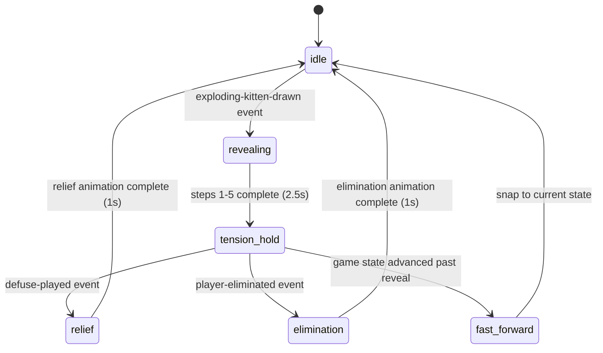

# Phase 5: Visual Design & Animation

**THE Phase.** 40%+ of total effort. Water beads off it.

**Goal:** Dark + premium, full theatrical drama. Every interaction feels premium.

## Enhancement Summary

**Deepened on:** 2026-04-05
**Research agents used:** 16 (Architecture Strategist, Performance Oracle, Kieran TypeScript Reviewer, Pattern Recognition Specialist, Code Simplicity Reviewer, Frontend Races Reviewer, Security Sentinel, Spec Flow Analyzer, Frontend Design Skill Agent, Canvas Particle Systems Researcher, Dark Premium Card UI Researcher, WCAG Accessibility Researcher, Animation Profiling Researcher, Responsive Player Ring Researcher, Web-Haptics Researcher, Visual Testing Researcher)
**Context7 docs queried:** Motion (motion.dev) — AnimatePresence/LayoutGroup/layoutId/useAnimate, spring/variants/staggerChildren, timeline sequencing/performance

### Key Improvements

1. **Design direction crystallized: "Neo-Noir Casino"** — restrained darkness that EXPLODES at the right moments. Three motion tiers (Ambient, Action, Theatrical). Only 4 card types get neon. Board default state is near-monochromatic.
2. **AnimationSequencer state machine for EK reveal** — `idle → revealing → tension-hold → relief|elimination → idle`. Steps 1-5 play in 2.5s, then TENSION HOLD waits for server resolution. Drama scales with real decision time.
3. **"State leads, animation is cosmetic" contract** — phones update instantly, TV animations are visual overlays. Animation completion NEVER gates game logic or UI routing.
4. **LayoutGroup CANNOT cross devices** — TV and phones are separate React trees. Cross-device card movement uses coordinated AnimatePresence enter/exit illusions. layoutId is board-internal only.
5. **`box-shadow` glow WILL FAIL profiling** — replaced with pseudo-element `::after` opacity trick. Static box-shadow painted once, animate ONLY `opacity` (GPU-composited).
6. **Canvas particle system: TypedArray SoA pool** — 300 pre-allocated particles, `drawImage()` with pre-rendered sprites, `useParticles` hook. Spring attraction for Defuse reversal. `useLayoutEffect` cleanup with cancellation token.
7. **`prefers-reduced-motion` was MISSING from ALL plans** — full animation-to-fallback mapping table added. Every effect has a non-motion alternative.
8. **Seizure safety for screen flash** — WCAG 2.3.1. Semi-transparent overlay (30% opacity), single transition, vignette not full-screen. Constrained parameters prevent photosensitive risk.
9. **25 visual flows identified, 19 were unspecified** — comprehensive Visual Flow Specifications table maps every game action to TV animation, phone animation, triggering event, and duration budget.
10. **Elliptical player ring** (not circular) — 16:9 TV demands ellipse. JS-calculated positions for Motion spring interpolation. CSS @keyframes for infinite active pulse (compositor thread).
11. **web-haptics added** — 6KB, zero deps, 4 user-initiated events (card play, EK drawn, Defuse, Nope). Progressive enhancement. iOS 18+ via Taptic Engine workaround. **CONTRADICTION FIXED**: "phone vibrates on turn notification" is IMPOSSIBLE (requires user gesture) — struck from Phase 1 and brainstorm docs.
12. **Profiling pass/fail thresholds defined** — TV: 60fps during EK reveal. Phone: <4ms unthrottled per frame. Canvas: <4ms for 300 particles. Frame budget: React 2-4ms, Motion 1-3ms, Canvas 3-6ms, headroom 3-5ms.

### New Considerations Discovered

- Staggered deal + `layout="position"` conflict — must disable layout during deal, enable after completion.
- Screen shake wrapper must sit OUTSIDE LayoutGroup to prevent children's layout recalculation.
- `color-mix(in srgb, ...)` enables CSS custom properties with opacity (no rgba() limitation). Supported all modern browsers since 2023.
- `layoutScroll` prop required on scroll containers with layout-animated children (Phase 4 documented conflict).
- Nope chain rapid-fire: single animation controller per effect type, snap-to-rest on resolve.
- Arena/staging zone missing — cards need a place to LAND between play and discard where Nope window plays out.
- Reconnection during animation: store needs `skipNextAnimation` flag, render current state immediately.
- Draw animation (most common action) had ZERO specification.
- Game over ceremony had ZERO specification.
- `OffscreenCanvas` in Web Worker now safe everywhere (Safari 18+) — evaluate if main-thread Canvas budget is tight.

---

## Design Direction: Neo-Noir Casino

### Aesthetic Philosophy

The feeling of a high-stakes poker night shot through a cinematographer's lens. Pools of colored light in deep darkness. The tension of a drawn card. Restrained darkness that EXPLODES at the right moments. The quiet is the setup; the drama is the punchline.

This is NOT cyberpunk (oversaturated neon-on-dark is dead), NOT luxury/refined (too quiet for a party game), NOT maximalist (fights readability at 3m). It IS: **controlled darkness with theatrical eruptions of color.**

### Color Restraint Strategy

**Only 4 card types get neon accents.** Everything else is muted slate.

| Category | Card Types | Accent | Hex |
|----------|-----------|--------|-----|
| **Death** | Exploding Kitten | Neon red | `hsl(0, 80%, 58%)` → `#e03535` |
| **Safety** | Defuse | Electric blue | `hsl(210, 85%, 60%)` → `#3b82f6` |
| **Disruption** | Nope | Toxic green | `hsl(150, 80%, 55%)` → `#2dd885` |
| **Aggression** | Attack, Targeted Attack | Amber | `hsl(35, 90%, 58%)` → `#e8922a` |
| **Supporting** | All other types | Muted slate | `hsl(220, 15%, 55%)` |

**Only ONE neon at high intensity at a time.** When a card is played or selected, other cards' glows dim to 30% opacity. The board's default state is near-monochromatic. Color ERUPTS during actions and fades after.

### Three Motion Tiers

**Tier 1 — Ambient (subliminal, always running):**
- Draw pile breathing: `scale` 1.0 → 1.02, 3s, infinite ease-in-out (CSS @keyframes, compositor thread)
- Active player spotlight: opacity pulse 0.7 → 1.0, 1.5s ease (CSS @keyframes)
- Nope countdown bar: CSS `scaleX` transition (Phase 4, zero JS per frame)

**Tier 2 — Action (deliberate, NOT bouncy):**
- Card play: hand → arena. Firm, no overshoot. Placing a bet.
- Card draw: reach toward pile → flip → settle into hand. ~900ms total.
- **Nope SLAM:** NOT a spring. `cubic-bezier(0.22, 1, 0.36, 1)` — fast in, HARD stop. Impact shake ±3px, 2 cycles, 200ms.
- Turn transition: outgoing dims (200ms), incoming illuminates (300ms with 100ms delay).

**Tier 3 — Theatrical (the money shots, rare):**
- EK Reveal: 2.5s build + tension hold + resolution. The centerpiece.
- Elimination: grey out + scale down. Final. Clean.
- Game Over: winner spotlight, ranking reveal.

### Typography

| Role | Font | Weight | Usage |
|------|------|--------|-------|
| **Display** | Clash Display (Fontshare, free, variable) | Bold/Extrabold | Card names (uppercase, +0.05em tracking), TV announcements |
| **Body** | General Sans (Fontshare, free, variable) | Medium/Semibold | UI text, player names, descriptions |
| **Mono accent** | JetBrains Mono | Regular | Nope countdown, card counts (`font-variant-numeric: tabular-nums`) |

**Font loading:** `font-display: swap` with size-adjusted fallbacks. Preload Clash Display Bold (above the fold on every screen). Alternative: Syne (display) + Plus Jakarta Sans (body) if Clash Display doesn't work at phone sizes.

**Dark-background adjustments:** `font-weight: 500` for body (bright-on-dark appears optically thinner). `line-height: 1.4-1.6` minimum. Never below 11px for readable text.

---

## Animation Architecture

### Animation Contract (MANDATORY)

> All Phase 5 animations are **decorative**. Server SubPhase drives UI routing and component visibility. Animation completion **NEVER** triggers game state transitions, UI navigation, or gates interactive elements. If animation and state desync, **state wins** and the animation fast-forwards or terminates.

- Phones reflect state changes **instantly**. The Nope button is always reactive.
- TV dramatic animations are **visual overlays** that delay rendering of state changes, not the state changes themselves.
- The DefusePlacement sheet opens on the phone the moment `defuse-pending` SubPhase arrives, regardless of where the TV's EK reveal sequence is.

### AnimationSequencer (Board TV Only)

The sequencer owns all dramatic animations on the TV board. It receives `GameEvent` arrays from the store, enqueues animation commands, and plays them as an async loop with step-level state guards.

```
src/client/board/
  animation/
    AnimationSequencer.ts   — Event queue + async dequeue + state machine
    RevealSequence.ts       — EK reveal: stateful async function
    NopeChainSequence.ts    — Per-Nope shake + counter
    CardPlaySequence.ts     — Slide from edge → arena → discard
    types.ts                — AnimationTrigger, SequenceRefs
```

**EK Reveal State Machine:**



**Step-level state guards:** Between each async animation step, `checkState()` reads the CURRENT store snapshot. If the game has moved past the reveal, `snapToFinalState()` jumps to the end position. The reveal gracefully compresses rather than playing stale content.

### Event-to-Animation Mapping

```typescript
// src/client/board/animation/types.ts
type AnimationTrigger =
  | { kind: 'ek-reveal'; playerId: string }
  | { kind: 'nope-impact'; playerId: string; chainDepth: number }
  | { kind: 'card-play'; playerId: string; cardType: CardType }
  | { kind: 'card-draw'; playerId: string }
  | { kind: 'turn-change'; playerId: string }
  | { kind: 'elimination'; playerId: string }
  | { kind: 'victory'; winnerId: string }
  | { kind: 'shuffle'; }
  | { kind: 'favor-transfer'; fromId: string; toId: string }
  | { kind: 'defuse-relief'; playerId: string }

function deriveAnimationTrigger(event: GameEvent): AnimationTrigger | null
// Exhaustive switch with `never` default — adding a GameEvent type
// without handling it here causes a compile error.
```

Events that are NOT animated on TV (text announcement only): `nope-window-opened`, `nope-window-resolved`, `favor-requested`, `future-peeked`, `future-rearranged`, `combo-steal` (result shown via favor-transfer).

### LayoutGroup Scoping Rules

- **Board:** Separate LayoutGroups for (1) arena + discard pile, (2) player ring. NEVER wrap the entire board in one LayoutGroup.
- **Phone hand:** No LayoutGroup needed — `layout="position"` on cards + `AnimatePresence` for entry/exit.
- **Cross-device:** No shared layout context. Phone removes card (exit animation). TV shows card appearing from player's direction (enter animation). Two independent animations creating an ILLUSION of cross-device morph.
- **layoutId convention:** `card-${CardInstance.id}` — tied to unique instance ID, never card type.

### Reconnection Handling

Store tracks `isReconnecting` flag. When a state-update arrives after WebSocket reconnection:
- `skipNextAnimation = true` — components render final state without transitions.
- No staggered deal replay, no EK reveal replay.
- Flag auto-clears after first render that consumes it.

---

## Tasks (Dependency-Ordered)

### Task 1: Theme System

Single source of truth. `theme.ts` exports typed constants. CSS custom properties injected at runtime.

#### `src/client/shared/theme.ts`

**Three-tier architecture:**

```typescript
// TIER 1: PRIMITIVES — raw values, never referenced by components
const PRIMITIVES = {
  // Surfaces (3-4% lightness steps to avoid "dark grey blob")
  black: '#0c0a12',        // hsl(250, 20%, 4%) — warm purple-black, NOT pure #000
  surface1: '#12121f',     // card face
  surface2: '#1a1a2e',     // dialog/sheet
  surface3: '#222240',     // hover surface
  border: '#2a2a4a',

  // Text (off-white, NOT pure #fff — avoids halation)
  textBright: '#e8e8f0',   // ~16.8:1 on black — AAA
  textMuted: '#9999bb',    // ~6.5:1 on black — AA (bumped from #8888aa for headroom)
  textDim: '#555570',

  // Accents (only 4 neon types)
  red: '#e03535',           redGlow: '#ff0000',
  blue: '#3b82f6',          blueGlow: '#1a6bff',
  green: '#2dd885',         greenGlow: '#00e673',
  amber: '#e8922a',         amberGlow: '#ff8c00',
  slate: '#7788aa',         slateGlow: '#556688',
} as const

// TIER 2: SEMANTIC — role-based, what components reference
const SEMANTIC = {
  bgApp: PRIMITIVES.black,
  bgCard: PRIMITIVES.surface1,
  bgElevated: PRIMITIVES.surface2,
  bgHover: PRIMITIVES.surface3,
  borderSubtle: PRIMITIVES.border,
  textPrimary: PRIMITIVES.textBright,
  textSecondary: PRIMITIVES.textMuted,
  textDisabled: PRIMITIVES.textDim,
  focusRing: '#33ffff',
} as const

// TIER 3: PER-CARD-TYPE — typed lookup, compile-time exhaustive
const CARD_TYPE_ACCENTS = {
  'exploding-kitten': { fill: PRIMITIVES.red, glow: PRIMITIVES.redGlow },
  'defuse': { fill: PRIMITIVES.blue, glow: PRIMITIVES.blueGlow },
  'nope': { fill: PRIMITIVES.green, glow: PRIMITIVES.greenGlow },
  'attack': { fill: PRIMITIVES.amber, glow: PRIMITIVES.amberGlow },
  'targeted-attack': { fill: PRIMITIVES.amber, glow: PRIMITIVES.amberGlow },
  // All others: muted slate
  'skip': { fill: PRIMITIVES.slate, glow: PRIMITIVES.slateGlow },
  // ... all 17 card types mapped
} as const satisfies Record<CardType, { fill: string; glow: string }>

export function cardAccent(type: CardType): { fill: string; glow: string }
```

**`applyTheme()` injection** — called once in both `board/main.tsx` and `player/main.tsx`. Sets CSS custom properties on `document.documentElement` from SEMANTIC constants. Per-card-type colors flow through `cardAccent()` into inline styles, NOT via CSS custom properties (preserves compile-time exhaustiveness).

Phase 4's `theme.css` becomes a fallback (`:root` block with Phase 4 values, overridden by JS injection) or is deleted.

#### Background Layers (bottom to top)

Applied to the board's outermost container:

1. **Base color:** `#0c0a12` — warm purple-black. On OLED phones: true black. On TVs: velvet, not void.
2. **Radial gradient:** Center `hsl(250, 12%, 7%)` → edge: base. Radius ~60%. "Spotlight on the table" — felt, not seen.
3. **Noise texture:** 100x100px noise PNG tiled at 3-5% opacity. **MANDATORY** for dark themes — prevents gradient banding on TVs, adds physicality. ~1KB.
4. **Vignette:** `radial-gradient(ellipse at center, transparent 50%, rgba(0,0,0,0.4) 100%)`. Cinematic framing.

### Task 2: Card Component

Phase 4's `MinimalCard` → Phase 5's `Card.tsx`. Component swap, same base prop API.

#### `src/client/shared/Card.tsx`

**Prop extension via intersection (Phase 4 interface UNCHANGED):**

```typescript
interface CardVisualProps {
  readonly isFaceDown?: boolean    // draw pile back design
  readonly layoutId?: string       // board-internal morphing (card-${id})
  readonly exitVariant?: 'discard' | 'steal' | 'fade'
}

type PremiumCardProps = CardProps & CardVisualProps
```

All Phase 5 additions are optional. Existing Phase 4 call sites work without modification.

**Glow technique — pseudo-element `::after` opacity trick:**

```css
.card {
  position: relative;
  box-shadow: /* static resting glow, painted once */
    0 0 4px color-mix(in srgb, var(--card-glow-color) 30%, transparent),
    0 0 8px color-mix(in srgb, var(--card-glow-color) 15%, transparent);
}

.card::after {
  content: '';
  position: absolute;
  inset: -2px;
  border-radius: inherit;
  box-shadow: /* intense glow, pre-computed */
    0 0 4px color-mix(in srgb, var(--card-glow-color) 80%, transparent),
    0 0 8px color-mix(in srgb, var(--card-glow-color) 60%, transparent),
    0 0 20px color-mix(in srgb, var(--card-glow-color) 40%, transparent),
    0 0 40px color-mix(in srgb, var(--card-glow-color) 20%, transparent);
  opacity: 0;
  transition: opacity var(--duration-normal) ease-out;
  pointer-events: none;
  z-index: -1;
}

.card:hover { transform: translateY(-4px); }  /* GPU-composited lift */
.card:hover::after { opacity: 1; }             /* GPU-composited glow reveal */
.card[data-selected="true"]::after { opacity: 1; }
```

NEVER animate `box-shadow` values directly. Static shadow painted once, only `opacity` transitions on hover. Both `transform` and `opacity` run on the GPU compositor — zero main-thread paint per frame.

**`--card-glow-color` is set as an inline style** from `cardAccent(type).glow`, NOT from a CSS custom property cascade. This preserves TypeScript exhaustiveness checking.

**Card face (dark premium poker feel):**
- `aspect-ratio: 5/7` (standard poker ratio)
- Background: `linear-gradient(180deg, color-mix(in srgb, var(--accent) 8%, var(--bg-card)) 0%, var(--bg-card) 40%)` — subtle accent-tinted gradient at top
- Border: `1px solid color-mix(in srgb, var(--accent) 25%, var(--border-subtle))`
- Top edge highlight: `border-top: 1px solid color-mix(in srgb, white 5%, transparent)` — perceived light source from above
- Card name in Clash Display Bold, uppercase, +0.05em tracking, accent-colored
- Subtle icon in center area
- Description in General Sans Medium, 11px, secondary text color

**Card back (draw pile, hidden cards) — diamond crosshatch CSS:**

```css
.card-back {
  background-color: var(--bg-card);
  background-image:
    repeating-linear-gradient(45deg, transparent, transparent 10px,
      color-mix(in srgb, var(--red) 6%, transparent) 10px,
      color-mix(in srgb, var(--red) 6%, transparent) 11px),
    repeating-linear-gradient(-45deg, transparent, transparent 10px,
      color-mix(in srgb, var(--red) 6%, transparent) 10px,
      color-mix(in srgb, var(--red) 6%, transparent) 11px);
}
.card-back::before { /* inner border frame */
  content: '';
  position: absolute;
  inset: 6px;
  border: 1px solid color-mix(in srgb, var(--red) 20%, transparent);
  border-radius: calc(var(--radius-card) - 4px);
}
```

**Icon badges — WCAG 1.4.1 (never color alone):**
- Inline SVG, `aria-hidden="true"` (parent card's `aria-label` covers it)
- Placed in **top-left corner** (visible on peeking edges in scroll-snap layout)
- 20x20px phone, 24x24px TV. Filled shapes (not outlines) for small-size visibility.
- 7 shape categories for 17 card types: Skull (EK), Shield (Defuse), Lightning variants (Attack/Skip), Eye variants (Future/Shuffle), Hand (Favor/Feral), Cancel-X (Nope), Cat face variants (5 cat types)

### Task 3: Animation Config + Timing

#### Named Motion Presets

```typescript
// src/client/shared/animation-config.ts
export const MOTION = {
  // Tier 2 — Action animations
  DELIBERATE: { type: 'spring', stiffness: 250, damping: 25 } as const,  // placing a bet
  IMPACT: { duration: 0.15, ease: [0.22, 1, 0.36, 1] } as const,        // Nope SLAM — hard stop
  SNAPPY: { type: 'spring', stiffness: 300, damping: 24 } as const,      // hand entry/exit

  // Tier 3 — Theatrical animations
  TENSION: { type: 'spring', stiffness: 100, damping: 12 } as const,     // EK flip — heavy, inevitable
  RELIEF: { type: 'spring', stiffness: 200, damping: 30 } as const,      // Defuse — overdamped exhale
  ANTICIPATION: { type: 'spring', stiffness: 400, damping: 15 } as const, // EK lift — taut

  // Utility
  INSTANT: { duration: 0 } as const,  // reduced motion / reconnection
} as const
```

Exact stiffness/damping values tuned during execution. These are starting points, not requirements.

#### `src/shared/timing.ts` (Single Source of Truth)

Created in Phase 1. Consumed by Phase 2 engine (Nope window timeout) AND Phase 5 animations. Phase 5 adds:

```typescript
export const TIMING = {
  // ... Phase 2 values (NOPE_WINDOW_MS, etc.)

  // Phase 5 — animation durations
  EK_REVEAL_MS: 2500,          // steps 1-5 (tension hold is open-ended)
  EK_RELIEF_MS: 1000,          // Defuse relief animation
  EK_ELIMINATION_MS: 1000,     // elimination animation
  CARD_PLAY_FLY_MS: 400,       // card → arena → discard
  CARD_DRAW_MS: 600,           // draw pile → reveal
  STAGGER_CHILDREN_MS: 100,    // deal stagger per card
  DEAL_DELAY_MS: 300,          // delay before deal starts
  TURN_PULSE_MS: 800,          // turn change animation
  NOPE_SHAKE_MS: 350,          // per-Nope impact
  SCREEN_FLASH_MS: 300,        // semi-transparent overlay
} as const
```

#### `prefers-reduced-motion` — Full Fallback Table

| Full Animation | Reduced Motion Fallback |
|----------------|------------------------|
| Canvas particle explosion | Single static radial gradient burst, 200ms fade |
| Screen shake (spring) | 200ms red border pulse, no motion |
| Screen flash (red overlay) | Static red border glow, no transition |
| Card flip (rotateY spring) | Instant crossfade (opacity, 150ms) |
| Card play fly animation | Instant position change with 100ms opacity crossfade |
| Staggered deal | All cards appear simultaneously, 150ms fade |
| Hand entry/exit springs | Instant appear/disappear, 100ms opacity |
| Turn pulse | Static highlighted border, no animation |
| Nope impact shake | Static accent border color change |
| Active player glow pulse | Static bright border (no @keyframes) |
| Draw pile breathing | Static (no scale animation) |

**Implementation:** `useReducedMotion()` from `motion/react` reads the OS preference. Wrap with an in-game toggle stored in localStorage. Check once in a context provider near the root. Canvas particle system needs a separate check (runs outside React).

#### Test Environment Config

```typescript
// MotionConfig with duration: 0 for visual regression snapshots
<MotionConfig transition={isTest ? { duration: 0, delay: 0 } : undefined}>
```

### Task 4: Board Layout (TV)

#### Elliptical Player Ring

**JS-calculated positions, NOT CSS rotate+translate** — required for Motion spring interpolation between old/new positions when players are eliminated.

```typescript
// src/client/board/layout/ringLayout.ts
function calculateRingPositions(
  playerCount: number, radiusX: number, radiusY: number,
  startAngle?: number, // default -PI/2 (12 o'clock)
): readonly RingPosition[]

function getAvatarSize(playerCount: number): number
// 120px (2 players) → 64px (10 players). 64px absolute floor for 3m TV viewing.

function getRingRadii(
  playerCount: number, containerWidth: number, containerHeight: number,
): { rx: number; ry: number }
```

**2-player special case:** Side by side (9 and 3 o'clock), not top/bottom.

**Elimination:** `AnimatePresence mode="sync"` with explicit x,y coordinates. Eliminated player: exit animation (scale 0, opacity 0, filter grayscale). Remaining players spring to recalculated positions. NO `layout` prop needed — explicit coordinates, not CSS layout.

**Active player indicator:** CSS `@keyframes` for infinite pulse (compositor thread, zero main-thread cost). Glow uses the PLAYER'S assigned color, not a fixed accent. `scale(1.06)` + 24px outer glow readable from 3m.

**Inactive players:** 60% opacity, scale 0.92. Eliminated: grayscale, 40% opacity, strikethrough on name.

#### Arena / Staging Zone

The CENTER of the board between draw pile and player ring. Cards LAND here when played. During the Nope window, the card sits in the arena — visible, waiting. This is the "are you going to Nope it?" tension space. After the Nope window resolves, the card moves to the discard pile (or gets rejected).

- RevealZone component: spatial anchor for dramatic card reveals (EK flip happens here)
- Card flies from the playing player's ring position → arena center → discard pile
- During EK reveal, the arena becomes full-screen dramatic stage

#### Draw Pile

3-4 visible card edges with staggered `translate` offsets (2px per layer). Count badge bottom-right (32px, JetBrains Mono Bold, `tabular-nums`). Draw pile breathing: `scale` 1.0 → 1.02, 3s, CSS @keyframes (compositor thread).

**Constraint:** Single composite visual + count badge. Individual `Card` components are NEVER rendered for draw pile cards. Back design is static CSS applied identically to all stack layers.

#### Discard Fan

Top card face-up + 1 peek card behind at slight rotation (-5deg, 4px offset). Under-card shows card BACK, not face (information leak prevention). `transform-origin: bottom center`.

#### TV Typography Scale

| Element | Size | Weight | Font |
|---------|------|--------|------|
| Announcement text | 32px | Semibold | Clash Display |
| Nope countdown | 36px | Regular | JetBrains Mono |
| Player names | 28px | Semibold | General Sans |
| Card count badges | 24px | Bold | JetBrains Mono |
| "Waiting for..." | 28px | Medium | General Sans |
| Non-essential labels | 20px (FLOOR) | Regular | General Sans |

**5% TV safe zone:** `padding: 5vh 5vw` on outermost board container. All content inside.

### Task 5: Card Animations

#### Hand Entry/Exit (Phone)

`AnimatePresence mode="popLayout"` — exiting card becomes `position: absolute`, gap closes immediately, remaining cards fill in via springs.

**Parent container:** `position: relative` (required by popLayout).

**Entry:** opacity 0 → 1, y 50 → 0, scale 0.8 → 1. Spring: SNAPPY preset.
**Exit:** opacity 1 → 0, y 0 → -200. Duration: 300ms ease-out.

#### `layout="position"` with Guards

Cards in hand use `layout="position"` for auto-animate reorder. NOT `layout={true}` (saves ~50% FLIP measurement by skipping size correction — cards don't change size).

**`layoutDependency` guard:** Set to `hand.map(c => c.id).join(',')`. Prevents unnecessary layout measurements on unrelated re-renders.

**Deal guard:** Disable `layout="position"` during the staggered deal. Enable after completion:

```typescript
const [dealComplete, setDealComplete] = useState(false)
// layout={dealComplete ? "position" : false}
```

Without this, each card entering during the stagger triggers layout measurement on all previously-entered cards — 45 cumulative measurements for a 10-card deal.

#### `layoutScroll` on Scroll Containers

Phase 4 documented: CSS `scroll-snap-type` and Motion `layout` animations conflict. Add `layoutScroll` prop to any scrollable container with layout-animated children.

#### Staggered Deal

`variants` with `delayChildren: 0.3, staggerChildren: 0.1`. Cards animate via explicit variants (initial/animate), not via layout. After deal completes, `dealComplete` flag enables `layout="position"`.

Only plays on initial game start (`wasInLobby && currentPhase === 'playing'`). Reconnection: instant appear, no stagger.

### Task 6: Dramatic Moments (Board TV)

All orchestrated by the AnimationSequencer. Zero React re-renders during sequences — pure `useAnimate` + CSS class toggles.

#### Exploding Kitten Reveal

**Steps 1-5 (2.5s total, sequential):**

1. Card lifts in arena (y: -40, 0.3s, ANTICIPATION spring) — taut, pulled upward
2. Card flips (rotateY: 180, 0.6s, TENSION spring) — `backfaceVisibility: hidden`, card identity hidden until midpoint
3. Screen flash — semi-transparent red overlay, `rgba(229, 53, 53, 0.3)`, vignette (edges darken, center stays clear), single fade-in 100ms + fade-out 200ms. WCAG 2.3.1 compliant: single transition, <25% viewport at peak, <3 flashes/second.
4. Canvas particles explode from card center (200 particles, red/orange hues)
5. Screen shake via board shake wrapper (±6-8px, 0.3s, decreasing amplitude keyframes NOT spring — shakes RATTLE, they don't bounce)

**Tension Hold (open-ended):**
Particles hover at low velocity. Red glow sustains on arena border. Waiting for server resolution. `checkState()` polls for defuse-played or player-eliminated.

**Resolution Branch:**

- **Defuse (relief, 1s):** Particles spring-attract toward center (spring force, not timeline reversal). Overlay color shifts red → blue. RELIEF spring on card (overdamped, smooth exhale). Arena glow shifts to blue.
- **No Defuse (elimination, 1s):** Particles intensify (more spawned, higher velocity). Avatar greys out + scales to 0 (NOT shatter — explosion was the moment). Player ring closes gap with spring animation.
- **Fast forward:** If `checkState()` finds game already past reveal (reconnection, rapid resolution), snap to final state immediately.

**Draw animation timing constraint:** Identical shared prefix (lift + flip start) regardless of card type. Branching ONLY after face is visible at flip midpoint. No pre-reveal branching in timing or easing.

#### Nope Chain

**Single animation controller per effect type.** Each new Nope:
1. Cancels any in-progress shake (`controls.stop()`)
2. Resets board to rest position (duration: 0)
3. Starts new shake from rest (±3px, IMPACT preset — hard stop, NOT spring)
4. Flash overlay: alternating Nope green / Yup amber per chain depth
5. Chain counter: `AnimatePresence mode="popLayout"` with 50ms exit, 80ms enter

**On nope-window-resolved:** Cancel ALL Nope animations. Snap to rest (duration: 0). No phantom shakes.

#### Normal Card Play

Card flies from player's ring direction → arena center (DELIBERATE spring, ~400ms) → holds during Nope window → settles to discard pile (200ms ease-out). Card carries player's border color for identification (by the time it arrives, the turn indicator has already moved).

#### Turn Transitions

Active player: illuminates (opacity + spotlight). Previous: dims (60% opacity, 200ms). Attack-induced extra-turn: counter badge appears on attacked player's ring slot with SNAPPY spring entry.

#### Elimination

After EK reveal step resolves to elimination:
- Avatar: grayscale filter + scale 0.8 + opacity 0.4, 500ms transition
- Player ring: remaining players spring to recalculated elliptical positions (DELIBERATE spring)
- Phone: transitions to spectator view ("You exploded! Rank #N")
- No shatter effect, no second particle burst

#### Game Over

Winner: spotlight effect (radial gradient behind avatar), scale 1.1, gold glow border. "WINS!" in Clash Display Extrabold, 48px. Rankings reveal: bottom-to-first, staggered entry (SNAPPY spring, 200ms stagger). TV announcement expands to full overlay. Phones show personal result + "New Game" button.

### Task 7: Particle System (Board TV Only)

#### TypedArray Structure-of-Arrays Pool

```typescript
// src/client/board/particles/ParticlePool.ts
const MAX_PARTICLES = 300
const x = new Float32Array(MAX_PARTICLES)
const y = new Float32Array(MAX_PARTICLES)
const vx = new Float32Array(MAX_PARTICLES)
const vy = new Float32Array(MAX_PARTICLES)
const life = new Float32Array(MAX_PARTICLES)   // 0.0-1.0
const size = new Float32Array(MAX_PARTICLES)
const hue = new Float32Array(MAX_PARTICLES)
const active = new Uint8Array(MAX_PARTICLES)   // 0 or 1
```

SoA layout: contiguous memory per property, cache-friendly iteration. Pool acquisition: linear scan for `active[i] === 0` with `nextFree` hint. Removal: set `active[i] = 0` (no array shift). Total memory: ~30KB. Zero GC pressure.

#### Pre-rendered Particle Sprites

`drawImage()` of pre-rendered sprites is significantly faster than `arc() + fill()` per particle. Create 4-6 sprite variations at init time on tiny offscreen canvases (different sizes, soft radial gradient for glow). During the loop: just `drawImage()` to position.

NEVER use `shadowBlur` (10-30ms per frame cost). NEVER change `fillStyle` per particle (string parsing 300 times). NEVER use `save()`/`restore()` in the particle loop.

#### `useParticles` Hook

```typescript
// src/client/board/hooks/useParticles.ts
interface ParticleControls {
  explode(origin: { x: number; y: number }, count: number, hue: number): void
  reverse(target: { x: number; y: number }): void
  intensify(): void
  clear(): void
}

function useParticles(canvasRef: RefObject<HTMLCanvasElement>): ParticleControls
```

Canvas element lives in the JSX tree of `GameTable.tsx`:
```tsx
<canvas ref={canvasRef} aria-hidden="true" role="presentation"
  style={{ position: 'absolute', inset: 0, pointerEvents: 'none', zIndex: 10 }} />
```

**Canvas resolution:** `canvas.width = rect.width * Math.min(devicePixelRatio, 2)`. Cap DPR at 2 (DPR 3 = 2.25x cost for negligible visual gain).

**rAF loop runs ONLY when particles are active.** When pool exhausted, loop stops. No CPU between dramatic moments.

**Cleanup: `useLayoutEffect`** (not `useEffect`) with cancellation token. `useLayoutEffect` cleanup runs before paint, catching the rAF callback before it can execute on a detached canvas. `useEffect` allows one leaked frame.

**Deltatime capping:** `dt = Math.min(dt, 1/30)` — prevents particles teleporting after tab switch.

#### Screen Shake (Trauma-Based)

Dedicated shake wrapper element **OUTSIDE** LayoutGroup. Static `will-change: transform` (pre-promote to compositor layer).

```tsx
<m.div ref={shakeRef} style={{ willChange: 'transform' }}>
  <LayoutGroup> {/* player ring, draw pile, discard — all layout-animated */} </LayoutGroup>
</m.div>
```

Shake uses keyframes with decreasing amplitude (`±8px → ±4px → ±2px → 0`), NOT springs. Springs bounce — shakes RATTLE. `Math.round()` all offsets (prevents sub-pixel jitter).

#### Z-Index Scale

```typescript
export const Z = {
  card: 1,
  drawPile: 2,
  arena: 5,
  particleLayer: 10,
  screenFlash: 20,
  announcement: 30,
  nopeButton: 100,  // MUST remain on top, always
} as const
```

### Task 8: Phone UI Polish

#### Preserve CSS Scroll-Snap

Phase 5 "smooth scrolling" = `scroll-behavior: smooth` for programmatic scrolls (auto-scroll to newly drawn card). Do NOT replace `scroll-snap-type` with Motion-powered scroll. The `layoutScroll` prop is added to the scroll container to prevent the scroll-snap/layout conflict Phase 4 documented.

#### Action Buttons

Minimum touch target: 44x44 CSS px for all interactive elements. 8px gap between adjacent targets. Nope FAB: 56x56 CSS px (time-critical action). `touch-action: manipulation` (Phase 4, removes 300ms delay).

Color-coded by card type accent. Dark text on bright neon backgrounds (white on neon = catastrophic contrast fail).

#### Bottom Sheet Animations

Spring-based entry (from bottom, SNAPPY preset). Backdrop: semi-transparent solid color (NOT `backdrop-filter: blur()` — recalculates every frame animated content moves behind it). Exit: slide down, 200ms ease-out. All 5 sheet types share identical container motion.

#### "Your Turn" Signal

When it becomes the player's turn, the phone signals from peripheral vision (player is watching TV):
- Glow border pulse in player's color (CSS @keyframes, 2 cycles)
- Slight background warmth shift (surface brightens 3%)
- Haptic tick (if available)

#### Haptics (`web-haptics`)

6KB, zero dependencies. Progressive enhancement — silent no-op when unsupported.

| Event | Preset | Trigger |
|-------|--------|---------|
| Play any card | `light` | On play tap (user-initiated) |
| Draw Exploding Kitten | `heavy` | On draw tap (user-initiated) |
| Play Defuse | `success` | On defuse tap (user-initiated) |
| Play Nope | `medium` | On Nope tap (user-initiated) |

**IMPOSSIBLE without user gesture:** "Your turn" notification, timer expiry, opponent actions. The Vibration API requires a user tap/click to trigger. (See Cross-Plan Notes — Phase 1 and brainstorm docs claim "phone vibrates" on turn notification. This is false.)

Settings toggle: "Haptic Feedback: On/Off" (default On, localStorage).

#### Nope FAB Entry/Exit

Scale-up from 0, 150ms, SNAPPY spring. **Must be tappable from frame 1** — no blocking animation. The button is interactive during the scale animation. A 300ms entry on a 3-5s window eats 6-10% of reaction time. Keep it fast.

### Task 9: Accessibility

#### Seizure Safety (WCAG 2.3.1 — Level A)

The red screen flash on EK reveal is the highest photosensitive seizure risk:
- **Single transition only.** One fade-in, one fade-out. No pulsing, no strobe.
- **Semi-transparent overlay:** `rgba(229, 53, 53, 0.3)` — reduces luminance delta from ~14:1 to ~2:1.
- **Vignette, not full-screen:** Edges darken red, center stays clear. Under 25% of 10-degree visual field.
- **Duration:** 100ms fade-in, 200ms fade-out. Total cycle well under 333ms (3Hz boundary).
- **`prefers-reduced-motion` fallback:** Replace flash with static red border glow (no transition).
- **User toggle:** "Reduce visual effects" setting, localStorage, independent of OS preference.

#### `aria-live` Regions

Two persistent regions mounted ONCE at each entry point (never dynamically):

```tsx
<div id="sr-polite" aria-live="polite" aria-atomic="true" className="sr-only" />
<div id="sr-assertive" aria-live="assertive" aria-atomic="true" className="sr-only" />
```

| Event | Priority | Announcement |
|-------|----------|-------------|
| exploding-kitten-drawn | assertive | "[Player] drew an Exploding Kitten! They must defuse or be eliminated." |
| player-eliminated | assertive | "[Player] eliminated, finishing position N of M." |
| game-over | assertive | "Game over. [Player] wins!" |
| nope-played | polite | "Nope by [Player]. Chain count: N." |
| card-played | polite | "[Player] played [Card]." |
| turn-started | polite | "[Player]'s turn. N turns remaining." |

Phone-specific: "Your turn" and "Nope on your action" use `assertive` on the player's phone.

#### High-Contrast Mode

**`@media (prefers-contrast: more)`** — 10 lines CSS, automatic:
- Kill glow effects (`opacity: 0` on `::after`)
- Add 2px solid borders in accent color (replacing glow)
- Solid flat backgrounds (no gradients)
- 3px+ focus ring
- Opaque overlays (no semi-transparency)

**Optional in-game toggle** (stretch goal): `data-contrast="high"` on `<html>`, localStorage. Same CSS overrides. Catches users who want high contrast in-game but not system-wide.

**`@media (forced-colors: active)`** — Windows High Contrast Mode. Use system color keywords (`ButtonText`, `Highlight`).

#### Focus Management

**Roving tabindex** for card hand (phone):
- ArrowRight/ArrowLeft: navigate between cards
- Home/End: jump to first/last
- Enter/Space: select/deselect
- Escape: deselect all
- Tab: move focus into/out of hand

**Two-ring focus indicator:**
```css
:focus-visible {
  outline: 2px solid #33ffff;
  outline-offset: 2px;
  box-shadow: 0 0 0 5px rgba(0, 0, 0, 0.9); /* dark halo for contrast on any background */
}
```

#### Canvas Accessibility

```tsx
<canvas aria-hidden="true" role="presentation" style={{ pointerEvents: 'none' }} />
```

All game announcements come from `aria-live` DOM regions, never from canvas content.

### Task 10: Profiling (MANDATORY)

#### Pass/Fail Thresholds

| Metric | Target | Where |
|--------|--------|-------|
| TV board: sustained FPS during EK reveal | 60fps (no CPU throttle — desktop hardware) | Chrome DevTools Performance |
| Phone hand: layout animation frame budget | <16ms at 4x CPU slowdown with 15 cards | Chrome DevTools Performance |
| Canvas particle system per-frame | <4ms for 300 particles on TV | Chrome DevTools Performance |
| Phone initial JS bundle | <100KB gzipped | Vite build output |
| TV initial JS bundle | <150KB gzipped | Vite build output |
| INP (Interaction to Next Paint) | <200ms | Lighthouse |
| CLS (Cumulative Layout Shift) | <0.1 | Lighthouse |

**Frame budget (steady-state during particle explosion, TV):**

| Component | Normal | 4x Slowdown |
|-----------|--------|-------------|
| React reconciliation | 0ms (no state changes) | 0ms |
| Motion WAAPI animations | 0ms (compositor) | 0ms |
| Canvas particle update (300) | 0.3ms | 1.2ms |
| Canvas draw calls | 1.5ms | 1.5ms (GPU) |
| Browser overhead | 2ms | 3ms |
| **Total** | **3.8ms** | **5.7ms** |
| **Headroom** | **12.9ms (77%)** | **11ms (66%)** |

**Adaptive particle count:** If frames consistently exceed 20ms, reduce target particle count by 10 per frame until stable. Minimum floor: 50 particles.

#### 5-Step Profiling Playbook

1. **Paint flashing.** Enable "Paint flashing" in DevTools. Play a card from a 10-card hand. Cards flashing green during shift = `box-shadow` is the culprit. Switch to `drop-shadow` or pseudo-element opacity.
2. **Explosion sequence.** CPU 4x slowdown. Draw an EK. Frame timeline: zero long tasks (>50ms) during animation. State-change frame: single isolated spike, not sustained jank.
3. **Canvas profiling.** Enable "Advanced painting instrumentation." During explosion: canvas draw calls <4ms/frame at 300 particles.
4. **Phone card play.** CPU 4x slowdown, phone viewport. Select and play from 15-card hand. Expect ONE dropped frame on play action. Subsequent spring animation: consistent 16ms frame spacing.
5. **Staggered deal.** CPU 4x slowdown. Start 10-player game. During deal: no layout measurement spikes (`layout="position"` disabled). After deal: play a card to verify layout animations activate.

---

## Visual Flow Specifications

Every distinct visual flow, mapped to TV animation, phone animation, triggering GameEvent, and duration budget. **TV/Phone Ownership** is explicit — no ambiguity about which screen runs which animation.

| # | Flow | TV Board | Acting Player Phone | Other Phones | Trigger Event | Budget |
|---|------|----------|---------------------|--------------|---------------|--------|
| F1 | EK Reveal | Full 7-step sequence (2.5s + hold + resolution) | "You drew an EK!" red flash. If Defuse: DefusePlacement sheet opens immediately. If not: Elimination view. | Watch TV. Nope not applicable to EK draw. | `exploding-kitten-drawn` | 2.5s + variable |
| F2 | Normal Card Play | Card flies from player direction → arena → (Nope window) → discard | Card exits hand (popLayout). Confirm bar dismisses. | See card arrive in arena on TV. Nope button appears if applicable. | `card-played` | 400ms + Nope window |
| F3 | Nope Chain | Per-Nope: shake ±3px + flash. Counter updates. | Nope button tapped → IMPACT animation. | Nope button appears/disappears per window state. | `nope-played` | 350ms per Nope |
| F4 | Turn Change | Active player illuminates, previous dims. | "Your turn" glow + haptic (if your turn). | Updated turn indicator. | `turn-started` | 500ms |
| F5 | Staggered Deal | N/A (board shows player ring, no hand) | Cards arrive one-by-one (staggerChildren: 100ms). | Same as acting player. | First `card-drawn` batch | ~1.5s for 10 cards |
| F6 | Card Selection | N/A (phone only) | Lift (translateY: -20px) + glow intensification. Multi-select for combos. | N/A | User interaction | Instant |
| F7 | Favor Resolution | Announcement: "A demands favor from B." Card-back flies from B's slot → A's slot. | Waiting state → card appears in hand from target's direction. | Target: FavorResponse sheet opens. Others: watch TV. | `favor-given` | 600ms |
| F8 | See the Future | "[Player] peeked" announcement. Deck glows briefly (300ms). | 3 cards fan out from deck icon. Auto-close countdown. Cards fold away on dismiss. | See announcement on TV. | `future-peeked` | Phone: until dismissed |
| F9 | Alter the Future | "[Player] rearranged" announcement. | 3 cards revealed. Reorder via drag or tap-swap. Confirm button. | See announcement on TV. | `future-rearranged` | Phone: until confirmed |
| F10 | Combo (Pair) | Two cards fan from player → arena. Then steal: card-back from target → player. | Two cards exit hand together. TargetSelect sheet. Card appears. | Target: card exits hand. Others: watch TV. | `card-played` (combo) | 800ms |
| F11 | Combo (Triple) | Three cards fan from player → arena. Then: card transfers or "miss" visual. | Three cards exit. TargetSelect → NameCard sheet. Result feedback. | Target: may lose named card. Others: watch TV. | `card-played` (combo) | 1000ms |
| F12 | Defuse Reinsertion | Card slides into deck from above. Deck briefly pulses. Count increments. Position NOT revealed. | DefusePlacement sheet (numbered buttons). Sheet dismisses with "Kitten hidden" confirmation. | See deck pulse on TV. | `defuse-played` | 500ms |
| F13 | Skip | Turn indicator jumps to next player with whoosh accent. | Card exits hand. Turn changes. | See turn change on TV. | `card-played` (Skip) | 400ms |
| F14 | Attack | Turn indicator flies to attacked player. "2 turns" counter appears on their slot. | Card exits. For Targeted: TargetSelect sheet. | Attacked player: "Your turn! 2 remaining." | `card-played` (Attack) | 600ms |
| F15 | Shuffle | Deck: cards scatter/riffle, reform. 0.5-1s visual shuffle. | Card exits hand. Watch TV. | Watch TV. | `deck-shuffled` | 700ms |
| F16 | Draw (Safe) | Card-back lifts from pile, travels toward player's ring slot, disappears. Count decrements. | New card slides in from top, face-up, brief glow. | See card-back travel on TV. | `card-drawn` | 600ms |
| F17 | Draw from Bottom | Same as F16 but card lifts from BOTTOM of stack. Visually distinct origin. | Same as F16. | Same as F16. | `card-drawn` | 600ms |
| F18 | Game Over | Winner spotlight, "WINS!" Clash Display 48px. Rankings stagger bottom-to-first. Full overlay. | "You won!" or "Rank #N." New Game button. | Personal result + New Game. | `game-over` | 3s ceremony |
| F19 | Elimination | Avatar greys out + scales 0.8. Ring closes gap (spring). | Spectator view: "You exploded! Rank #N." | Ring adjusts on TV. | `player-eliminated` | 1s |
| F20 | Lobby → Game | Crossfade lobby → board. Player positions in lobby list don't animate to ring (too complex, YAGNI). | Lobby phone → playing phone crossfade. Then deal animation. | Same. | `game-started` | 500ms + deal |
| F21 | Reconnection | Render current state immediately. No animation replay. | ConnectionOverlay dismisses. Current state, no deal replay. | Same. | WebSocket reconnect | 0ms |
| F22 | Optimistic Rejection | N/A (server rejection, not a board event). | Card flies BACK from discard direction into hand. ErrorToast appears. | N/A | `action-rejected` | 400ms |
| F23 | Noped Card | Cancelled card settles to discard with muted visual (lower opacity, no glow). | Card already exited (optimistic). Goes to discard per game rules. | See cancellation on TV. | `nope-window-resolved` (cancelled) | 300ms |
| F24 | Bottom Sheets | N/A (phone only). | Spring entry from bottom (SNAPPY), solid backdrop, slide-down exit. All 5 types identical motion. | N/A | SubPhase change | 300ms |
| F25 | Nope Button | N/A (phone only via Portal). | Scale-up 0→1, 150ms, tappable immediately. Exit: scale-down, 100ms. | Same on all alive players' phones. | `nope-window-opened` | 150ms |

---

## Tests

### Visual Regression

- **Tool:** Playwright `toHaveScreenshot()` for E2E, Vitest Browser Mode `toMatchScreenshot()` for components.
- **Freeze animations:** `MotionConfig transition={{ duration: 0, delay: 0 }}` via `VITE_VRT=true` env flag.
- **Deterministic particles:** Seed the RNG in test mode (`seed={42}`). Same positions every run.
- **Specific animation frames:** Playwright Clock API (`page.clock.fastForward()`) to snapshot EK reveal at key moments.
- **Baselines:** Generate in CI (Linux Docker) ONLY. Never on Windows (font rendering differs). Commit `__snapshots__/`.

### Animation Timing (Single Source of Truth)

```typescript
// Verify animation code imports from shared timing
test('card play uses shared CARD_PLAY_FLY_MS', () => {
  expect(cardPlayTransition.duration).toBe(toSeconds('CARD_PLAY_FLY_MS'))
})
// Verify engine uses same timing
test('Nope window uses shared NOPE_WINDOW_MS', () => {
  expect(result.nopeWindow.deadlineMs).toBe(timestamp + TIMING.NOPE_WINDOW_MS)
})
```

### Responsive Layout

Playwright viewport projects: `board-tv` (1920x1080), `phone-small` (375x812), `phone-large` (390x844). Player ring snapshots at 2, 5, 10 players.

### Accessibility

- `@axe-core/playwright` integrated into E2E tests. Targets: `wcag2a`, `wcag2aa`, `wcag21a`, `wcag21aa`.
- Canvas excluded from axe scan (decorative, `aria-hidden`).
- Programmatic `contrastRatio()` function: unit tests verify all text/background pairs meet WCAG AA.
- Icon badge presence: every card has visible `[data-testid="card-type-badge"]`.

### Performance

- Lighthouse CI: performance score >= 0.9, CLS < 0.1, INP < 200ms.
- Custom FPS measurement during particle explosion: >= 30fps minimum.
- CLS during card play: < 0.1 (PerformanceObserver in Playwright).

---

## Cross-Plan Notes

### Phase 1 Corrections

1. **`framer-motion` → `motion/react`:** All imports in Phase 1's `MotionProvider.tsx` (line 466) and `motion-features.ts` use `'framer-motion'`. Must be corrected to `'motion/react'` and `'motion/react-m'`. Package.json dep: `motion` not `framer-motion`.
2. **"Phone vibrates" on turn notification is IMPOSSIBLE.** Phase 1 (line 406) and brainstorm doc (line 51) both claim "Phone vibrates + board shows 'waiting on...'". The Vibration API requires a user gesture (tap/click). Server-push events CANNOT trigger vibration. Strike the "phone vibrates" claim from both documents.
3. **`src/shared/timing.ts` creation:** Should be created in Phase 1 (foundation) since Phase 2's engine needs `NOPE_WINDOW_MS`. Phase 5 adds animation timing constants to the same file.

### Phase 4 Corrections

4. **`aria-live` regions:** Phase 4's `AnnouncementFeed.tsx` needs `aria-live="assertive"` for critical events and `aria-live="polite"` for others. Currently text-only, no screen reader support.
5. **Icon badge placeholder:** Phase 4's `MinimalCard.tsx` should include a text abbreviation in the top-left corner (e.g., "EK", "DEF", "NP") to establish the badge position before Phase 5 replaces with SVG.
6. **Keyboard navigation:** Phase 4's `Hand.tsx` has scroll-snap CSS but no `onKeyDown` handler or roving tabindex. Add before Phase 5.
7. **`--text-secondary: #8888aa` on `--bg-surface: #14141f`** — passes AA (~5.3:1) but is tight. Phase 5 bumps to `#9999bb` (~6.5:1).

### Phase 6 Notes

8. **Draw pile rendering constraint:** Verify Phase 5's draw pile visual never renders individual `Card` components. Cards in the draw pile are server-side only.
9. **Playwright viewport projects** defined in Phase 5 testing should be shared with Phase 6's multi-context E2E suite.

### Roadmap Notes

10. **Scope cuts confirmed:** Drag reorder (CONFIRMED CUT — hand order meaningless in EK), card fan rotation (CUT in roadmap — horizontal scroll wins), swappable art direction (YAGNI), Defuse slider (numbered buttons).
11. **Avatar shatter CUT** — replaced with grey out + scale. The explosion IS the dramatic moment. A second particle effect after the climax is noise.

---

## Done When

The Exploding Kitten reveal makes people go "holy shit." Cards feel satisfying. Dark theme is cohesive. Profiling passes on mid-range simulation. **Every animation has a `prefers-reduced-motion` fallback.** The board's default state is calm — color erupts only during drama.
