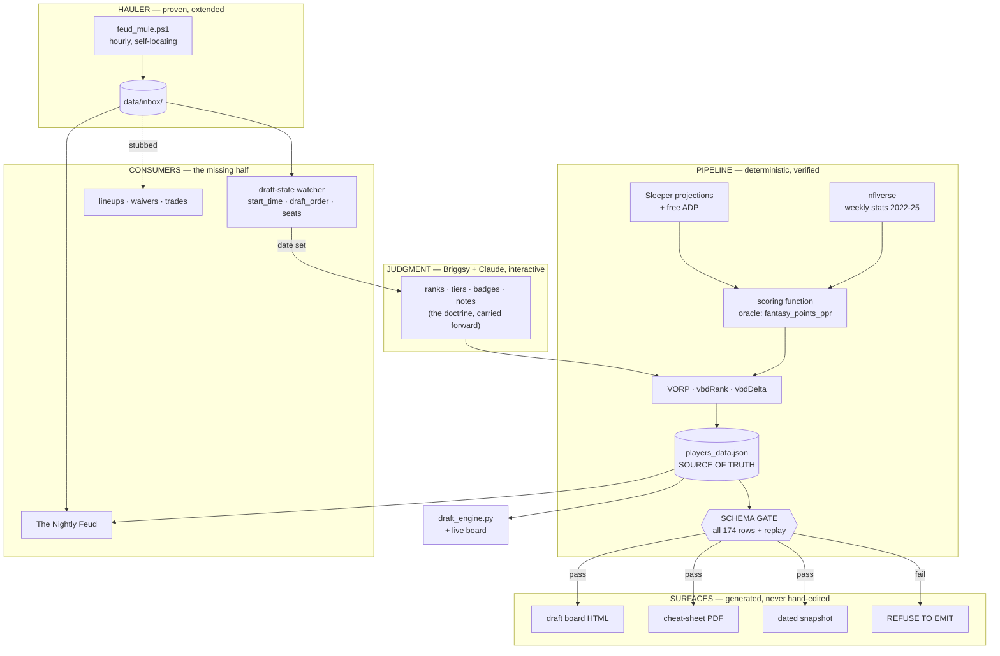

# refactor: Rebuild the machinery

> **Scope decision (Briggsy, 2026-08-07):** *"Baselines and rankings can stay — with the caveat
> that you and I will interactively refresh that several more times before draft day. Rebuild the
> machinery fo sho."*
>
> The ranking **doctrine and content** carry forward as input. Everything that **computes,
> propagates, and verifies** it gets rebuilt.

---

## Summary

The project has four hand-maintained copies of the board and no generator, plus one proven
scheduled hauler with no consumers. Every open item in the old TODO is a symptom of those two
facts. This plan replaces both: **one source of truth that generates every surface**, and **one
hauler feeding many consumers**.

It covers all four of the original jobs — draft prep, live draft assist, lineup automation, roster
management — sequenced so draft-critical work lands first and nothing roster-dependent is built
before rosters exist.

**The load-bearing requirement is repetition.** The board will be refreshed interactively several
times before the draft. A refresh must be one command that regenerates every surface and *refuses
to emit a board the engine cannot eat*. Today a refresh is a four-file hand-copy with no
verification — which is precisely how two of the four surfaces silently drifted.

---

## Problem Frame

### What is actually broken

**Two surfaces are wrong right now.** Not "will go stale" — wrong today.

| Surface | State (verified 2026-08-07) |
|---|---|
| `draft-kit/players_data.json` | Correct. `meta.updated: 2026-08-05`, 174 players (48 RB / 59 WR / 20 TE / 23 QB / 14 DEF / 10 K) + 8 `dst` |
| `draft-kit/family-feud-draft-board.html` | Full ~49.9 KB duplicate at line 200 (`const DATA = …`). Currently deep-equal to the source. No `fetch`, no reference — a copy, not a viewer |
| `draft-kit/draft_rankings_data_2026-08-05.json` | **Drifted.** `dst[6]` Jaguars (board says Vikings), `dst[8]` Vikings (board says Steelers), and `strategy` forked in **two** keys — `kickers` still reads *"No kicker board needed in August"*, and `rules` also diverged (the original text named only `kickers`). `players` and `meta` are equal. **Zero readers in the repo.** Deleted by KTD-2 |
| `draft-kit/family-feud-cheat-sheet.pdf` | **Drifted and incomplete.** Generated Aug 5 18:54, pre-audit. **150 of 174 rows — all 14 DEF and all 10 K absent** (re-verified by extraction; the PDF is ASCII85-then-Flate, and a zlib-only read yields zero text, which reads as "empty PDF" rather than "broken reader"). Its DST prose line — `1 Texans 2 Broncos 3 Seahawks 4 Rams 5 Eagles 6 Jaguars` — follows the **drifted twin's** ordering, not the source's, so the PDF was generated from the snapshot rather than from `players_data.json`. **Correction to the original text:** the retired *"I'll call the kicker live"* string is **not** in the PDF; that is a `strategy.kickers` defect in the twin. The PDF's only kicker line states current doctrine correctly (*"K + DEF in Rds 15-16. NO exceptions."*) |

The runbook asserts the dated copy is "kept in sync." It is not. Carrying it forward by rename —
which the old TODO instructed — would have resurrected three fixed bugs.

**There is no generator.** The repo contains exactly two Python files (`draft_engine.py`,
`merge_picks.py`) and zero build source. Nothing computes `vorp`/`vbdRank`/`vbdDelta`, emits the
HTML blob, or renders the PDF. The ReportLab script that made the PDF died with the Cowork
migration.

**The mule hauls into a void.** `newsletter/feud_mule.ps1` runs hourly, self-locating, 10 sources
with independent failure — verified alive (cargo stamped `2026-08-07 14:29:01`). It is the proven
pattern in this project. It has **no consumer**. The newsletter HTML is sha256-identical to its
template; both archive folders hold only `.gitkeep`.

It already hauls `sleeper_draft.json` hourly, carrying `status`, `start_time`, and `draft_order` —
the exact fields that signal the draft is real. **Nothing reads them.**

### Three ways to lose the draft, none of which anything currently guards

**1. Cross-draft contamination — reproduced end to end.** `merge_picks.py` keys its merge purely on
`pick_no` and never reads `draft_id`, though every Sleeper pick object carries one. Seeding
`picks.json` with a spent mock's picks and merging against the real draft yields *"no gaps, no
duplicates — engine will accept this file"*, exit 0; the engine then reports 120 phantom picks and
*"YOUR next pick: #126"* with every elite player marked drafted. `picks.json` is gitignored, so
`git status` never shows it — and the old TODO instructed developing against exactly that feed.

**2. Silent name-mismatch.** `taken_keys` is built from `norm(sleeper_name)`; availability filters on
`norm(board_name)`. When those diverge for the same player, **he stays on BEST AVAILABLE after being
drafted.** Demonstrated. The integrity gate cannot catch it — pick numbers stay perfectly
contiguous — and the engine reports unmatched names nowhere, at any severity. Same outcome as the
documented landmine, reached by an unguarded route. Current matcher is empirically good (4 of 120
lab picks unmatched, all genuinely off-board; 0 collisions across 174 entries), but the failure is
silent by construction.

**3. Latent schema breaks.** `draft_engine.py` hard-indexes eleven keys with no defaults. Both known
break modes are **latent, not immediate**:

- missing `badges` at rank 5 crashes instantly; **at rank 40 it runs clean**
- `vbdDelta` as float ran **clean at 0 picks** and died at **exactly three picks in**, when r=15
  Drake London (−9) entered the top-12 window

**A pre-draft smoke run against an empty `picks.json` proves nothing.** Both breaks survive it.

### What the research settled

- **VORP is fully reverse-engineered.** Mean season points by finish rank, 2022-2025, this league's
  scoring, mapped onto the board's own `pr`. Reproduced to **0.1 points MAD across 150 players**
  (Gibbs 268.4 → 268.4, Chase 242.7 → 242.8).
- **nflverse is trivial to reach.** `stats_player_week_{year}.csv`, ~8.3 MB/season, all four years
  in ~6 seconds. Pure stdlib `csv` — nothing to install on Python 3.14.
- **A free test oracle exists.** nflverse ships `fantasy_points_ppr`; our scoring reproduces it
  **1997/1997 exact** once offensive-only fumbles are used. It already caught a real bug.
- **Sleeper ships undocumented 2026 projections** (2.9 MB, refreshed daily) *and* free ADP
  (`adp_ppr`, `adp_half_ppr`, …) that can feed Layer 1.
- **Waiver timing is closed.** 111 completed waiver transactions across two of Briggsy's 2025
  leagues; 101 cluster Wednesday ~03:10 ET. Tuesday-report doctrine is correct. No live cycle needed.
- **CORS is open**, `Origin: null` → `access-control-allow-origin: *`. Live drafts carry
  `s-maxage=30`, so polling needs cache-busting.
- **Sleeper's public API is read-only** — no create endpoints. Mock setup happens through **Chrome
  automation** (verified connected, logged in), not by hand.

### The finding that changes doctrine

`vbdRank` is **strictly monotone in `pr` within every position** — 0 order violations across 150
skill players (QB 23, RB 48, WR 59, TE 20). Verified independently.

Because the curve is a rank→points lookup and `pr` is its input, **within a position `vbdDelta` is a
mechanical restatement of the board rank.** Tiers on this board are per-position, so "same tier"
means "same position" — and `ranking-methodology.md`'s rule *"VBD is the tie-breaker… when two
players sit in the same tier"* is invoked exactly where VBD has **no independent information**. The
rule cannot change a decision.

Everything **cross-positional** survives intact and is the real value: `RB41 = 117.5` vs
`WR47 = 144.7` is the arithmetic behind the rounds 3-5 RB-over-WR tie-breaker; QB-in-6-9 and
K/DEF-last hold. Real per-player projections break the circularity and make `vbdDelta` mean
something within a position for the first time.

**Two factual errors in `ranking-methodology.md` about its own pipeline**, found by reproducing it:
line 53 claims the scoring included 40+/50+ yard TD bonuses (the reproduction matched to 0.1 pts
*without* them — never applied) and claims the curves came from play-by-play (they came from weekly
stats; pbp was never used).

---

## The Spine



The two structural moves: **one source generates every surface** (killing the drift class of bug),
and **one hauler feeds many consumers** (killing the "hauls into a void" problem). The watcher
closes the loop — when the draft becomes real, it tells us to refresh.

---

## Key Technical Decisions

**KTD-1 — `players_data.json` is the single source, and no field inside it may duplicate another.**
The HTML `const DATA` blob and the PDF become build outputs. None is ever hand-edited again.

The original wording stopped at the file boundary, and that is where the deepening found the drift
actually living. Two duplications sit *inside* the source:

- **`dst` is a projection of `players`.** All 8 entries are the DEF rows with `pr` 1-8 — `rank == pr`,
  same teams, verified across all eight. It is rendered (`draft-kit/family-feud-draft-board.html:284`),
  so it is live. **The verified drift in the dated twin was in `dst`.** Same-file replication means no
  cross-*surface* check can ever catch it. The generator derives `dst` from the DEF rows; it is never
  carried forward. This needs a committed 32-entry team-code→name table, because the DEF rows carry
  codes (`"HOU"`) while `dst` carries full names (`"Houston Texans"`) and **that mapping exists
  nowhere in the repo** — it lives only in whoever typed the array.
- **`strategy` is prose carrying live facts, with zero validation.** It asserts a count ("Kickers are
  ON the board now — 10 of them"), names three `(player, team)` pairs a single trade invalidates
  (Aubrey/DAL, Fairbairn/HOU, Dicker/LAC), and hardcodes league shape throughout — `Picks 1-3`,
  `Picks 4-6`, `picks 17-24`, `rounds 15-16`, `rounds 3-5`, `rounds 6-9`, `6 of 8`, `Bench = 6`.
  That last set makes **KTD-7 violated inside the source of truth**, not just in the HTML.

**KTD-2 — DECIDED (Briggsy, 2026-08-07): delete the dated snapshot.**
`draft-kit/draft_rankings_data_2026-08-05.json` is removed and never regenerated.

Rationale: **git is already the dated archive.** Every historical `players_data.json` is addressable
by commit, carries a date, and cannot drift. A byte-identical copy has only two reachable states —
redundant or wrong — so it carries no information by construction. And the plan's own load-bearing
requirement is *repeated* refresh: keeping the twin means a pile of ~50 KB near-twins in `draft-kit/`
and a "which one is live?" question on draft morning, which is a fresh instance of the failure class
this rebuild exists to kill.

**Consequence:** U4 drops its dated-snapshot cross-surface check, and U6 asserts no
`draft_rankings_data_*.json` can reappear at `draft-kit/` root. Recovery is
`git checkout <sha> -- draft-kit/` (all four surfaces are git-tracked — verified).

**KTD-3 — One normalizer, one spec, generated — not hand-ported.** The original wording,
*"generated from **or** tested against the same vectors,"* is an ambiguity rather than a boundary:
two implementations sharing golden vectors are still two implementations, and vectors only catch
divergence on inputs someone thought of. The traps this plan itself lists (`/g`, `.filter(Boolean)`,
non-decomposable non-ASCII) are precisely the class a 20-vector suite passes and a real August
waiver-wire name fails. **Resolved: "generated from" only.**

"Three consumers" also undercounts, and it undercounts a second *function*. Actual surfaces:

1. `draft-kit/draft_engine.py` — `norm()`
2. `draft-kit/draft_engine.py` — **`tokens()`, an already-forked second normalizer in the same
   file.** It repeats three of `norm()`'s four steps verbatim, deliberately skips the alias map, and
   returns `{first, last}`. It differs in one more detail: `tokens()` coerces via `str(s)` and
   `norm()` does not, so a non-string board `name` fails loudly today.
3. the JS port (U7) · 4. the gate's uniqueness check (U4) · 5. U11's Wire matching, which the plan
   requires to use "normalized tokens" — that is `tokens()`, not `norm()` · 6. U14's resolver

**The spec owns both functions.** `norm_spec.json` holds the 17-entry `ALIASES` table, the ordered
transformation steps with their regex parameters, and the golden vectors. All four current steps are
expressible in syntax identical across Python `re` and JS `RegExp`; if a future rule is not portable,
that is a signal to reject the rule rather than fork. `normalize.py` is a thin **interpreter** of the
spec, so Python holds no independent copy of the rules either. U6 emits `const NORM_SPEC` into the
HTML beside `const DATA` plus a small generic JS interpreter.

**The equivalence assertion belongs in the gate, not only in U3's tests** — the gate runs before
every emit; a test suite runs when someone remembers. `node` is installed, so the gate runs the
emitted JS over all 174 board names and diffs against Python.

**Extracting `tokens()` forces one decision that must be stated in U14's acceptance criteria:** if
the shared cleaning helper adopts `str(s)`, today's loud `TypeError` on a malformed name becomes a
silent coercion. This project's standing preference is loud.

**KTD-4 — Resolve and freeze `sleeperId` on every board entry. Owned by U14.**

*This is the highest-leverage single change in the plan, and in the original draft no unit
implemented it* — while the Risks section made the permanence of the name join conditional on it
landing. That gap is now closed by U14.

Verified premises: every pick in the live lab feed carries `player_id` at top level **and** in
`metadata`, string-equal in 120/120. Skill ids are numeric strings (`"7564"` = Chase); **DEF ids are
team abbreviations** (`"HOU"`, `"LAR"`), so the schema check must accept both namespaces. The 14 DEF
rows **already hold their Sleeper id** in the `team` field, making the resolver's real surface
**160 rows, not 174** — but that convention must be asserted against the dump, not trusted.

**The join is not a simple fallback chain, and getting this wrong re-opens the bug the KTD exists to
close:**

```
attribution (which board row is this pick?):   id first, then norm   — ordered fallback
removal     (is this man off the board?):      id  OR  norm         — set UNION
```

If *removal* were a fallback chain, a board row holding id A and a pick holding id B for the same man
— Sleeper id churn, a DEF re-key, a bad resolve — would match neither branch, and **the drafted
player stays on BEST AVAILABLE.** Keep both keys live for removal.

This also creates a third severity that does not exist today: **matched by name but the ids
disagree.** That means the primary key is rotting and the operator is silently running on the
fallback. It must be loud, alongside U2's shipped unmatched block.

**KTD-5 — The gate validates all rows and replays real picks.** Static checks over every one of the
174 entries, then an execution gate replaying the lab feed at increasing prefix lengths so every
player passes through the top-12 window. Justified by the latency finding: neither known break mode
fires on an empty picks file.

**KTD-6 — DECIDED (Briggsy, 2026-08-07): the curve and projections are each correct in a different
place, and the board uses both.** His instruction was explicit: *"I want the action to be the most
accurate and correct — level of change/effort is not in our decision tree. Accuracy wins the day."*

The two methods measure different quantities, and the original "v1 now, v2 later" sequencing quietly
treated them as the same quantity at different fidelities. They are not:

| Region | Method | Why |
|---|---|---|
| **Replacement baselines** (QB12, RB41, WR47, TE12) | **historical curve** | An average over *ordinary* players. No order-statistic distortion. Sound as-is. |
| **Player values** (elite tier especially) | **projections** | An expectation, which is the quantity that answers "what will this player score." |
| **K and DEF** | **historical curve**, flagged | Sleeper ships no FG-distance splits and no points-allowed distribution — most of DST scoring. Projections are structurally incomplete here. |

The finding that forces this ([`005`](../insights/005-the-tie-breaker-agreed-with-the-board-by-construction.md)):
the curve is an **order statistic on realized outcomes**. "The player who finished RB1" is a slot
filled each year by whoever's variance broke best — reigning RB1 finished RB26, RB68, and RB3 in
following years; top-5 retention is 1.3/5 for RBs. So `RB1 = 385.9` describes no identifiable player,
and mapping it onto a preseason rank inflates the **elite-to-replacement gap** — which is exactly the
number that says how hard to pay up in rounds 1-2. Measured against real 2026 projections scored
identically: **Chase 242.7 → 145.1**, mean |diff| 26.4 points.

**Sequencing is unchanged — v1 still ships first** — but its role changes. v1 is the *reproduction
check* that proves the pipeline is arithmetically correct (0.1 MAD against today's board), and it
permanently owns replacement baselines and K/DEF. v2 then becomes the number the board ranks on for
skill players. v1 is no longer a lesser version of v2; it is a component of the final answer.

**Mixed provenance passes every check the plan currently has, and that must be fixed here.** The
stated invariant is `{vorp, vbdRank, vbdDelta}` all-present-or-all-absent — that is **presence, not
provenance**. A partial projections pull (the endpoint returned 3,111 records with only 559 carrying
`pts_ppr`) would leave half the board curve-derived and half projection-derived, every field present,
gate green — and cross-positional comparison, the plan's stated real value, silently meaningless.
Therefore: **each row records which method produced its `vorp`, and the gate enforces which method is
permitted in which region.** Never fall back silently to a stale cache — that is
[`007`](../insights/007-presence-is-not-health-the-third-instance-of-one-pattern.md)'s shape exactly.

**KTD-7 — Nothing hardcodes league shape.** Not 120, 128, 15, 16, or 8.

Two corrections to the original statement. First, it named **two** sources for one fact — *"the
generator templates shape from `meta` / live draft settings"* — which is the drift generator this
plan exists to remove. **Resolved: the draft object is the origin.** `meta.shape` is a copy the
generator stamps at build time along with the `draft_id` it came from; the HTML reads `meta`; the
gate asserts `meta.shape` still matches the draft object it claims to descend from.

Second, the claim that *"`draft_engine.py` already gets this right"* **is false**, and it mattered —
it excused the engine from a rule it violates in four places:

| Anchor | Hardcoded |
|---|---|
| `draft-kit/draft_engine.py:45` | `STARTERS = {"QB":1,"RB":2,"WR":2,"TE":1,"K":1,"DEF":1}` — roster shape |
| `draft-kit/draft_engine.py:174-175` | the FLEX count `2`, twice |
| `slot_of()` / `my_picks()` | pure snake assumed |
| `draft-kit/players_data.json` → `strategy` | `Picks 1-3`, `picks 17-24`, `rounds 15-16`, `6 of 8`, `Bench = 6` (see KTD-1) |

The live draft object carries all of it: `slots_qb:1, slots_rb:2, slots_wr:2, slots_te:1, slots_k:1,
slots_def:1, slots_flex:2, slots_bn:6, teams:8, rounds:16`, plus `type:"snake"` and
`reversal_round:0`. These drive the ROSTERS/NEEDS block *and* "their open needs" — the engine's read
on what opponents will take. A settings change makes that advice confidently wrong with no error, and
a third-round-reversal draft silently invalidates every pick-slot computation.

The four verified HTML defects (anchors re-checked against the unmodified file):

| Anchor | Defect |
|---|---|
| `family-feud-draft-board.html:252` — `Round ${Math.floor(i/8)+1} range` | renders **"Round 22 range"** at 174 rows |
| `:233` — `Math.ceil(p.r/8)` | renders r=129-150 as **Rd 17/18/19** — 22 skill players in rounds that do not exist |
| `:233` — `(p.pos==='K'\|\|p.pos==='DEF')?'15-16'` | hardcoded round string |
| `:283` — `<h2>Defenses (rounds 15-16 only)</h2>` | **second** hardcoded round string, which "stop hardcoding 8" would never catch |

**These belong to U6, not U7.** Under KTD-1 the HTML is a generated artifact; if U7 fixed the round
math it would be hand-editing a generated file, reversing KTD-1 in the first unit after the generator
lands. U7 already depends on U6, so this is a scope correction, not a resequencing.

**KTD-8 — Read shape from the draft object, not from typed arguments. Owned by U15.**

Running `draft_engine.py 3 8 15` against a 16-round draft makes `my_next` `None`, so the engine goes
**silent about your own pick in round 16** — the K/DEF round. Like KTD-4, this was stated, agreed
with, and **owned by no unit**; U15 closes it. The wrapper reads `settings` from the already-hauled
`newsletter/data/inbox/sleeper_draft.json` (hourly, no new fetch) and feeds `teams`, `rounds`,
`STARTERS`, and the flex count; argv becomes an override. It hard-refuses on `type != "snake"` or
`reversal_round != 0` rather than computing a wrong pick order.

**KTD-9 — The Nightly Feud: Jinja2 template, deterministic facts, LLM prose.** The current template
has zero placeholder tokens and needs variable-length sections, so string substitution can't express
it without emitting HTML from Python (which is how the CSS rots). Hard rule: **deterministic code
owns every fact and number; the LLM owns only connective prose.** The voice is the asset — it cannot
be produced by f-strings, and canned rotations read as canned by week two over ~365 nights.

**Dependency policy, because two installs were about to be discovered in draft week.** Verified on
this machine: **neither `jinja2` nor `reportlab` is installed.** Both resolve on Python 3.14.3 and
both ship pure-Python `py3-none-any` wheels (`reportlab-5.0.0`, `jinja2-3.1.6`), so no compiler is
involved — the risk is real but bounded. U6 correctly vetted reportlab's wheel; KTD-9 got no
equivalent check. **Install and verify both now, not in draft week**, and pin them. Keep Jinja2:
variable-length sections and autoescaping are exactly its job, and the argument against f-strings
holds.

**KTD-10 — Mule health means parseability, not bytes — and validation happens *before* the write.**

Re-measured live at the mule's actual URL
(`https://www.nbcsports.com/fantasy/football/player-news?rss=1`), which is the one that matters:

```
HTTP 200 · 803,573 bytes · Content-Type: text/html · <html class="SectionPage"> · 0 <item> elements
```

It fails on content-type, on parse, and on item count, while passing the only check the mule runs
(`size > 50`). **Content-Type is the cheapest of the three guards** — one string compare, before any
parsing — and the plan did not name it. Validate all four: status, content-type, parse, item count.

Parseability audit of today's cargo, for contrast with `mule_status.json`'s 10/10:

| Feed | Bytes | Parses | Items | Mule says |
|---|---|---|---|---|
| yahoo_nfl | 283,191 | yes | 50 | ok |
| cbs_nfl | 35,787 | yes | 36 | ok |
| espn_nfl | 14,033 | yes | 23 | ok |
| rotowire | 3,322 | yes | 5 | ok |
| **nbc_edge** | **801,412** | **no** (line 11) | **0** | **ok** |

**The missing decision is the write policy.** `Fetch-Source` overwrites the inbox file, so validation
as originally specified turns silent-wrong into loud-empty — better, but the previous good cargo is
still destroyed by a bad fetch. **Fetch to a temp name, validate, replace only on pass.** A failed
source then leaves the last good cargo in place, and `mule_status.json` records both the failure
*and the age of what is still on disk*. That is
[`007`](../insights/007-presence-is-not-health-the-third-instance-of-one-pattern.md) applied to the
write path, not only to the report.

**Parse with `defusedxml`, not stdlib ElementTree.** These payloads arrive off the public internet
and stdlib is vulnerable to entity-expansion by default. `defusedxml` is **already installed on this
machine** — the hardening is free.

**Open Question 3 is resolved: replace `rss_nbc_edge` with ProFootballTalk**
(`https://profootballtalk.nbcsports.com/feed/`). Measured: HTTP 200, parses, **30 items, 9 naming
board players**. It is NBC's own property, so it fills the same editorial slot the broken feed was
chosen for, at six times Rotowire's volume. Candidates rejected by measurement: FantasyPros RSS
(404), CBS fantasy RSS (404). Rotowire stays (5 items, all 5 on-board — dense but thin). This takes
the wire from 4 working feeds to 5 and from 114 items to ~144.

---

## Scope Boundaries

**In scope:** the generator and its gate; the VORP pipeline; the shared normalizer; the two P0
guards; the live board poll loop; the draft-state watcher; mule hardening; The Nightly Feud
end to end; doc corrections.

**Deferred to follow-up work:**
- **Jobs 3 and 4 (lineups, waivers, trades)** — stubbed by decision. League is `pre_draft`; no
  rosters, matchups, or transactions exist. Un-stub trigger is below.
- **Long-TD bonus from play-by-play** — measured worth: max 19 pts/season, median 3. Never applied
  in the original numbers either.
- **Projection-based VORP (v2)** — sequenced after v1 ships.

**Explicitly not doing:**
- Simplifying `draft_engine.py`'s integrity gate. It is deliberately defensive and has a live catch
  on record (Mock #3, picks 78-82). What this plan adds is orthogonal.
- Creating a throwaway league for roster data. Native MOCK DRAFTS covers draft rehearsal; the
  roster question only matters when jobs 3/4 un-stub.

**Un-stub trigger for jobs 3 and 4:** real rosters exist AND the mule hauls `/rosters`,
`/matchups/<week>`, `/transactions/<week>`. Neither is true today.

---

## Implementation Units

> **Deepening amendments (2026-08-07).** Four corrections apply across every unit below; they are
> stated once here rather than repeated thirteen times.
>
> **1 — Tests live in `tests/`, never in `draft-kit/`.** Every unit's `Files:` list named
> `draft-kit/test_*.py`. `python -m unittest discover -s tests` **will never find those**, and a
> suite that is never discovered is green because it never ran — [`006`](../insights/006-four-verification-steps-that-could-silently-do-nothing.md)
> at the plan level. The shipped tests already live in `tests/`; U1 and U2's file lists were
> simply wrong. All new suites go to `tests/test_<unit>.py`.
>
> **2 — Placement rule.** Anything the engine imports lives beside the engine in `draft-kit/`;
> everything else lives in `scripts/` and derives its paths from `__file__`. **No new file opens
> anything by literal name from cwd** — `draft_engine.py` is the sole grandfathered exception, and it
> is exactly why the runbook's Step 3.1/3.3 cwd contradiction exists. Note `draft-kit` is not a valid
> Python identifier, so nothing under it can ever be imported as a package; importers do a single
> `sys.path.insert`, as `tests/test_merge_picks.py` already does for `scripts/`.
>
> **3 — Corrected sequencing.** U9 moves to Phase 0 and U5 is unblocked from U4:
>
> ```
> U9  →  U3  →  U14  →  { U4  ∥  U5 }  →  U6  →  { U7 ∥ U15 }  →  U8  →  U10 → U11 → U12 → U13
> ```
>
> *U9 first:* it has **Dependencies: none**, reads cargo that already arrives hourly, and is small.
> The Risks section claimed it was "deliberately early" while it sat in Phase 3 behind nine units.
> The asymmetry is one-sided — shipping it first costs an alert that cannot yet trigger a one-command
> rebuild; shipping it last risks never getting the alert while the board silently expires. The room
> went **4 → 6 of 8 seats in a single day** (2026-08-07) and `start_time` is still null.
> *U5 unblocked:* the scoring pipeline never touches the gate — the gate consumes its output. U4's
> listed dependency was a verification preference, not a build dependency. U4's own dependency on U3
> is soft: only the `norm()`-uniqueness check needs it.
>
> **4 — A verification step that cannot fail loudly is not a verification.** Every acceptance
> criterion below must be able to go red. Concretely, for any unit whose tests assert "the gate
> rejects X": **a gate that rejects everything passes all of them.** Each such suite must also keep a
> clean-board positive control, assert the rejection message *names the offending row or field*, and
> assert the mutation actually altered the fixture before the gate saw it — without that last one it
> reproduces 006's patch script, whose `str.replace` silently did not apply.

### Phase 0 — Gates (block everything downstream)

> **U1, U2 and U9 are SHIPPED** (2026-08-07 — U1/U2 in `519e4bb3` and `21c22ce7` with 46 tests;
> U9 in `0b907a13` adding 26). The suite now reports **72 passing, 0 skipped** via
> `python -m unittest discover -s tests` from the repo root. Their `Files:` lists below name
> `draft-kit/test_*.py`; the real suites live in `tests/test_merge_picks.py` and
> `tests/test_engine_matching.py`. **U9 joined this phase and was built first** (see amendment 3
> above); its own section is further down under the old Phase 3 heading and is marked accordingly.
> U1 has one reopened item: the `slot_names.json` guard recorded in Risks.

#### U1. Close cross-draft contamination

**Goal:** make it impossible to advise off another draft's picks.
**Files:** `scripts/merge_picks.py`, `tests/test_merge_picks.py`
**Approach:** Read `draft_id` off every incoming pick and off every pick already in `picks.json`.
Refuse the merge — loudly, non-zero exit — if any pick's `draft_id` differs from the requested
draft. Also resolve `--check`: it is advertised in both the docstring and the usage string but
`sys.argv[2]` is never read, so a session that types it believing the run is read-only gets a write.
Implement it or delete both mentions; do not leave a documented flag that lies.

**Test scenarios:**
- `picks.json` holding lab-room picks + a real draft id → non-zero exit, no write, message names both ids
- clean merge of same-draft picks → succeeds, count correct
- empty `picks.json` + real draft → succeeds
- `picks.json` containing `null` (raw curl of a bogus id) → rejected with a message, not a traceback
- `--check` → either performs no write (if implemented) or is absent from help (if removed)
- mixed `draft_id` values *within* an existing file → rejected

**Verification:** the reproduction that produced "120 picks in, YOUR next pick: #126" against an
empty real draft now fails closed.

#### U2. Report unmatched picks

**Goal:** kill the silent name-mismatch path to advising a drafted player.
**Files:** `draft-kit/draft_engine.py`, `tests/test_engine_matching.py`
**Approach:** The engine already computes `b = board_by_name.get(key)` and stores `None` when a pick
fails to match. Surface it. Any pick that does not resolve to a board entry gets printed in a
warning block. Off-board picks are normal (4 of 120 in the lab feed) so this is informational, not
fatal — but an on-board player who fails to match is the same "recommend a drafted player" outcome
the landmine warns about, and today nothing says a word.

**Execution note:** characterization-first — capture current output against the lab feed before
touching anything, so the diff is provably additive.

**Test scenarios:**
- lab feed replay → exactly 4 unmatched reported, named, and advisory otherwise byte-identical to baseline
- constructed pick whose norm diverges from a top-12 board name → warning fires and names the player
- zero unmatched → no warning block at all
- integrity gate still fires on interior gaps and duplicates (regression: do not disturb)

**Verification:** the demonstrated case (drafted player still on BEST AVAILABLE) now announces itself.

---

### Phase 1 — One source, generated surfaces

#### U3. Shared name normalizer + golden vectors

**Goal:** one spec, three runtimes, provable equivalence.
**Dependencies:** none
**Files:** `draft-kit/normalize.py` (runtime source of truth), `draft-kit/norm_spec.json` (**generated
from** `normalize.py`, consumed by the JS — never read by the engine at runtime),
`tests/test_normalize.py`
**Approach:** Lift the 17-entry ALIASES table and the four normalization steps out of
`draft_engine.py` into one spec plus golden vectors. Python imports it; the JS port in the live
board is generated from or tested against the same vectors. Known equivalence traps: Python's
`re.sub` replaces all occurrences so the JS regex needs `/g`; Python's `.split()` drops empties so
JS needs `.filter(Boolean)`; non-decomposable non-ASCII is deleted outright, not transliterated.

**Test scenarios:** the golden vectors, run identically in both runtimes —
`Ja'Marr Chase`/`Ja’Marr Chase` → `jamarrchase` · `Amon-Ra St. Brown` → `amonrastbrown` ·
`Kenneth Walker III` → `kennethwalker` · `Marvin Harrison Jr.` → `marvinharrison` ·
`A.J. Brown`/`AJ Brown` → `ajbrown` · `Kenny Gainwell` → `kennethgainwell` (alias) ·
full 174-name board sweep asserting zero collisions.

**Verification:** identical output from Python and JS across every vector.

**Deepening amendment — extract the shared cleaning prefix, not just `norm()`.** `draft_engine.py`
holds a *second* normalizer, `tokens()`, which repeats three of `norm()`'s four steps verbatim in the
same file. Lifting only `norm()` leaves it holding a private copy, free to drift — the exact bug class
U3 exists to kill. The extraction forces one decision that must be **stated in the acceptance
criteria**: `tokens()` coerces via `str(s)` and `norm()` does not, so a non-string board `name` fails
loudly today. If the shared helper adopts `str(s)`, that loud failure becomes a silent coercion. The
project's standing preference is loud. Per KTD-3 the spec owns **both** functions, `normalize.py`
interprets the spec rather than re-implementing it, and the JS is generated — not hand-ported.

**Placement correction:** `norm_spec.json` must not be a runtime input read by literal name — that
would kill the engine from any cwd but `draft-kit/`, and the subprocess test harness (cwd = tmpdir)
would fail on test #1. `normalize.py` is the runtime source of truth; the spec JSON and golden vectors
are emitted from it, verified by U4, and consumed by the generated JS.

---

#### U14. Resolve and freeze `sleeperId` — the join key

**Goal:** replace a drifting name join with a stable id, once, under human adjudication.
**Dependencies:** U3. **Blocks U4 and U6.**
**Files:** `scripts/resolve_sleeper_ids.py`, `draft-kit/sleeper_ids.json`, `draft-kit/cache/`,
`tests/test_resolve_sleeper_ids.py`

**Why this unit exists:** KTD-4 calls this the highest-leverage single change in the plan and the
Risks section makes the permanence of the name join conditional on it — and in the original draft
**no unit implemented it.** U4's names check ("every board name resolves against the live Sleeper
dump under `norm()`") *is* the name join it was supposed to replace, performed at generation time and
then thrown away.

**Approach.** Resolution and validation are different responsibilities and must not share a unit: a
gate that mutates its input is not a gate. Resolution is non-deterministic against an external corpus,
needs a pinned snapshot, and needs one-time human adjudication for the ambiguous residue.

Candidate generation per [`004`](../insights/004-name-similarity-could-not-separate-the-two-populations-at-any-threshold.md):
**`(team, position)` intersected with at least one shared normalized name token.** Never a similarity
threshold — the floors are inverted (0.800 for genuinely different players, 0.370 for the same man),
so no threshold exists. A preference rule ("prefer active", "prefer higher `years_exp`") is that same
threshold in a new costume; 004 retired the *class*, not one instance.

The id is an **input, not an output**: a separate committed ledger `draft-kit/sleeper_ids.json` keyed
by board name, carrying `{sleeperId, resolved_on, dump_fetched_at, evidence:{team, pos, matched_token}}`.
The generator **reads and only appends**. A row that already has an id and would now resolve to a
different one is a hard stop naming both ids — never an overwrite. The effect is that an id change
becomes a one-line diff in a small file instead of an invisible byte inside a regenerated 53 KB board.

Resolve against a **pinned cached dump** in `draft-kit/cache/` with a recorded fetch timestamp, never
a live pull at generation time — a live dump moves the candidate set between two runs on the same
day. This also closes a gap the original plan left open: **U4 as written required the network on
draft morning**, because the mule hauls league/users/draft/trending, not `/players/nfl`.

**Scope note:** the 14 DEF rows already carry their Sleeper id in the `team` field (`"HOU"`, `"LAR"`),
so the real surface is **160 rows** — but that convention is asserted against the dump, not trusted.

**Test scenarios:**
- exactly one candidate → resolved, ledger entry written with its evidence
- **zero candidates → non-zero exit naming the row and the searched key** `(team, pos, tokens)`
- **multiple candidates → non-zero exit printing every candidate's `player_id`/`team`/`years_exp`/`status`; never auto-select**
- post-resolution re-assertion: dump `position` == row `pos` **and** dump `team` == row `team`; a flip on either is a different man or a stale dump
- bijection: 174 rows → 174 distinct ids (a duplicate id is the documented "one pick removes two rows" failure by a new road)
- all 14 DEF rows: assert `dump[TEAMCODE].position == "DEF"` rather than trusting the convention
- a row badged `R` resolving to `years_exp > 0` fails — cheap, and catches the rookie/veteran collision that matters
- re-running against an unchanged ledger is a no-op (no rewrites, no reordering)
- a row whose stored id would now resolve differently → hard stop naming both ids
- an explicit `unresolved: [{name, reason, approved_on}]` block the gate requires, so skipping a
  genuinely unresolvable row (a retired player on draft morning) becomes a *recorded decision* rather
  than a silent gap — and any unresolved row is flagged by the engine as name-matched-only, wired into
  U2's shipped warning block

**Verification:** all 174 rows carry an id or appear in `unresolved` with an approval; re-running
changes no bytes; the lab feed's 120 picks attribute by id with zero name fallbacks.

#### U4. The board schema gate

**Goal:** make it impossible to ship a board the engine cannot eat.
**Dependencies:** U3, U14 (soft on U3 — only the `norm()`-uniqueness check needs it)
**Files:** `scripts/validate_board.py`, `tests/test_validate_board.py`, `tests/fixtures/lab_feed_120.json`
**Approach:** Static checks across **all 174 rows** (not a top-N sample — that is what the latency
finding forbids), then an execution gate. Checks, each traceable to a reproduced failure:

*Structure* — top level is a dict with exactly `{meta, players, dst, strategy}`; `players` is a
non-empty list of dicts (an empty list exits 0 with a complete-looking empty advisory).

*Types* — `name` non-empty str · `r`/`pr`/`tier`/`vbdRank` int (not bool) · **`vbdDelta` int and not
float** (`:+d` raises on float) · `vorp` numeric, and a *missing* `vorp` must be caught here because
the engine silently prints a row without it · `badges` list of single-char str · `team`/`note` str.

*Values* — `pos` in exactly `{RB, WR, TE, QB, K, DEF}`; any other spelling makes the whole position
vanish from TIER CLIFFS at exit 0 and, if not literally `K`/`DEF`, floods VBD LEANS with +45..+68
defense deltas.

*Invariants* — `r` unique and contiguous `1..n` · `vbdRank` unique and contiguous · `pr` unique and
contiguous within each position · `vbdDelta == r - vbdRank` · tiers contiguous from 1 within each
position · `{vorp, vbdRank, vbdDelta}` all-present-or-all-absent, uniform board-wide.

*Names* — `norm(name)` unique board-wide (a duplicate makes one pick remove two rows from
availability) · every board name resolves against the live Sleeper player dump under `norm()`
(currently 174/174) — **run this at generation time, not draft time**.

*Cross-surface* — dated snapshot deep-equals the source (**fails today**) · the object extracted
from the HTML's `const DATA = ` line deep-equals the source · the PDF contains a row for every
player (**150 of 174 today**) with matching numbers.

*Execution gate* — run the real engine against the new board with the lab feed replayed at
increasing prefix lengths, asserting exit 0 each time.

**Test scenarios:** one mutation per check, each asserting the gate rejects with a message naming
the offending player — missing `badges` at rank 40 (passes an empty-picks run, must still fail) ·
`vbdDelta` float board-wide (passes at 0 picks, must still fail) · `pos: "DST"` · duplicate `r` ·
`vbdDelta` inconsistent with `r - vbdRank` · a name that collides under `norm()` · `players: []` ·
and a clean board passing every check.

**Verification:** every mutation the research reproduced is caught before emit.

**Deepening amendments.** Dependencies become **U3, U14**. The gate runs **offline**, against the
pinned dump U14 caches — never a live pull.

*The gate is born red, and that is correct.* Two of its cross-surface checks fail the moment they are
written, because the surfaces are drifted today. Acceptance is therefore **"the gate correctly reports
the known-drifted surfaces as failing"**, not "the gate passes." A gate that must be born green is a
gate someone weakens until it is.

*Checks the original list did not have, each traceable to a verified defect:*

- **`dst`** — a list of `{rank:int, team:str}`, `rank` unique and contiguous, `len == 8`, entries
  exactly the top-8 DEF rows by `pr`, and `dst[i].team == NAME[row.team]` through the committed
  code→name table. The verified drift was **entirely in `dst` and `strategy`** — the two sections a
  row-level gate never inspects. The truncation rule (14 DEF rows → 8 `dst`) is asserted, not
  inherited.
- **`strategy`** — exactly `{rules, roundPlan, slotNotes, kickers}`, each non-empty; every player name
  in it resolves to a board row through the shared normalizer and any `(name, team)` pair matches that
  row's team; every count asserted in prose matches a computed count ("10 of them" vs the actual K
  count); every round/pick number falls within `teams × rounds` from `meta`.
- **Prose outside the `DATA` blob.** The original cross-surface check inspects only the extracted
  object, so a refresh on Aug 20 passes deep-equal while shipping a board whose visible header still
  reads Aug 5. Verified literals: `family-feud-draft-board.html:177` (`Draft ~Aug 29, 2026`), `:195`
  (`Rankings synthesized Aug 5, 2026` — **the only human-visible date on the board**), and `:275`,
  which guards on `DATA.meta.vbd` existing and then prints `waiver QB12 · RB41 · WR47 · TE12; last
  starters QB8 · RB21 · WR27 · TE8` as **literals** while those exact values sit in
  `meta.vbd.baselineWaiver` / `meta.vbd.lastStarter` as data. It looks data-driven, which is why it
  survived review — and U5 is licensed to change precisely those numbers. **No number appearing in
  `meta` may exist as a literal in generated prose; line 275 is the test fixture.**
- **`meta.updated`** — currently has **zero readers anywhere in the repo** (grepped `.py`/`.html`/`.ps1`).
  It is a self-reported claim nothing checks and nothing displays. The gate rejects a board whose
  `meta.updated` predates its newest input (curve cache, dump, ledger): *"claims Aug 5, built from
  Aug 20 inputs"* is the drift signature and is mechanically detectable. Every generated surface
  renders it from data.
- **Badge key-set identity.** Every code in every row's `badges` must be a key of `meta.badges`.
  `draft_engine.py:280` hardcodes the glyph table with `.get(b,"")`, so an unknown code renders as
  **nothing, silently**, while the HTML renders `undefined`. "All three renderings agree" must mean
  *identical key sets*, not agreement on the intersection.
- **`sleeperId`** present, well-formed in either namespace (numeric string or team code), unique, and
  resolvable against the pinned dump.
- **Python↔JS normalizer equivalence** run over all 174 board names (per KTD-3 this belongs in the
  gate, which runs before every emit, not only in a test suite someone remembers to run).

*Two modes, because the checks have incompatible runtime profiles.* Static row and cross-surface
checks are milliseconds and offline — safe to run on draft morning. The execution replay is up to 120
subprocess invocations. The plan never said when the gate runs: **`--fast`** (static + cross-surface)
and **`--full`** (adds the replay, pre-commit).

*The lab feed does not exist and must be captured.* No fixture exists anywhere in the repo — tracked,
untracked, or gitignored — so "replay the lab feed" currently has nothing to replay. The spent room
(`1390923383440424960`) is still live and verified: `status: complete`, 8 teams × 15 rounds, 120
picks, `pick_no` contiguous 1-120, single `draft_id`, every pick carrying `player_id`. Capture it to
`tests/fixtures/lab_feed_120.json` (49.5 KB) as a committed fixture. It is a spent mock with
`league_id: null` and nothing stops Sleeper reaping it.

*Specify the prefix schedule, don't say "increasing."* The reproduced `vbdDelta` break fired at
**exactly three picks**; deciles would have missed it. The schedule must include 1, 2, **3**, 4, then
widen.

#### U5. VORP pipeline v1 — historical curve

**Goal:** replace prose with reproducible code; make the refresh arithmetic free.
**Dependencies:** none — runs in parallel with U4 (the gate consumes U5's output; it does not gate it)
**Files:** `scripts/scoring.py`, `scripts/build_curves.py`, `tests/test_scoring.py`, `draft-kit/cache/`
(add a `.gitignore` entry for the cache in the file's existing commented style — 4 nflverse seasons
is ~33 MB)
**Approach:** Fetch and cache `stats_player_week_{2022..2025}.csv`. One pure scoring function
encoding `league.md`. Aggregate to season totals per player, sort within position, average each
finish rank across the four years → the curve. Board players map in through `pr`. Baselines
QB12/RB41/WR47/TE12 are league-structural and unchanged.

**Patterns to follow:** `draft_engine.py`'s encoding guard — `encoding="utf-8"` on every read *and*
forced UTF-8 stdout. `mule_status.json` additionally needs `utf-8-sig` (it carries a BOM from
PowerShell 5.1, so the literal remedy in CLAUDE.md raises on that one file).

**Test scenarios:**
- **oracle**: recomputed standard PPR equals nflverse's `fantasy_points_ppr` for every scored player
  (baseline established: 1997/1997 exact, using offensive fumbles only — `fumbles_lost_total`
  includes special-teams fumbles and is wrong)
- **reproduction**: regenerated VORP matches the current board within 0.1 MAD across 150 players
- curve values land at the measured figures (QB12 282.6 · RB41 117.5 · WR47 144.7 · TE12 148.8)
- `vbdDelta` emitted as `int`, never float — asserted at the type level
- a season file missing from cache → refetched, not crashed
- 2026 actuals (404 today) → handled as absent, not as an error

**Verification:** pipeline regenerates today's board from scratch and the gate passes it.

**Deepening amendments.** Dependencies: **none on U4** — the scoring pipeline never touches the gate;
the gate consumes its output. U4 and U5 run in parallel.

- **Read the baselines, don't re-hardcode them.** `meta.vbd.baselineWaiver` already holds
  `{QB:12, RB:41, WR:47, TE:12}` and `meta.vbd.lastStarter` holds `{QB:8, RB:21, WR:27, TE:8}`. U5
  reads them from the board; U4 validates their presence. Re-typing them creates a fourth copy of
  numbers that already appear in `meta`, in the HTML prose at `:275`, and in the methodology doc.
- **Protect v1's no-name-join property.** Per KTD-6 the curve keys off `pr`, which is already present.
  Do not fold U14's resolution into U5 — that would import the join risk into the one component
  designed to be free of it.
- **Record `vorp` provenance per row** (curve vs projection), per KTD-6. The stated invariant
  `{vorp, vbdRank, vbdDelta}` all-present-or-all-absent is **presence, not provenance**: a partial
  projections pull yields a half-curve, half-projection board with every field present and the gate
  green, silently voiding cross-positional comparison. The gate enforces which method is permitted in
  which region — projections for skill-player values, curve for replacement baselines and for K/DEF
  where Sleeper ships no FG-distance splits and no points-allowed distribution.
- **Coverage ratchet.** Record the covered fraction of the 174 rows per projections pull and refuse a
  v2 regeneration if coverage falls below the last accepted pull. Never fall back silently to a stale
  cache — that is [`007`](../insights/007-presence-is-not-health-the-third-instance-of-one-pattern.md)'s
  shape.
- **`utf-8-sig` does not belong here.** The original text filed that note under U5, which has no reason
  to read `mule_status.json`. It belongs to U10/U11. The blanket rule: anything reading a
  PowerShell-written file uses `utf-8-sig`; everything else `utf-8`.

#### U6. The generator — one command, every surface

**Goal:** make "refresh the board" a single verified command.
**Dependencies:** U3, U14, U4, U5
**Files:** `scripts/build_board.py`, `scripts/render_html.py`, `scripts/render_pdf.py`,
`tests/test_build_board.py`, `draft-kit/build_manifest.json`, `draft-kit/.last_good/` (gitignored),
and **`draft-kit/draft_engine.py`** — the glyph-table edit at `:280` belongs to this unit, or a
fourth glyph source survives
**Approach:** Read the source, recompute VORP, run the gate, and only on pass emit the dated
snapshot, the HTML (preserving the `const DATA = ` line convention — single line, no trailing
semicolon), and the PDF. **On gate failure, emit nothing and exit non-zero.** Template league shape
from `meta` rather than hardcoding 8. Add `meta.badges[code].glyph` so the engine and PDF stop
hardcoding their own glyph tables, and assert all three renderings agree.

`reportlab` publishes a pure-Python wheel (`py3-none-any`, requires_python >=3.9) so the PDF path
needs no compiler on 3.14.

**Test scenarios:**
- all four surfaces regenerate and the gate's cross-surface checks pass
- **PDF contains all 174 rows** including the 24 K/DEF entries missing today
- HTML round headers stop at the real round count (no "Round 22 range"; no "Rd 17-19")
- badge glyphs bound for the PDF are Latin-1 encodable — Helvetica cannot print the emoji
- gate failure → zero files written, non-zero exit
- regenerating an unchanged board is byte-stable (no spurious diffs)

**Verification:** delete all three derived surfaces, run one command, gate passes, engine runs.

**Deepening amendments.** Dependencies become **U3, U14, U4, U5**.

*The emit is not atomic, and the plan predicts its own crash.* "On gate failure, emit nothing" covers
the gate — **not a crash during emit**. The plan itself forecasts that crash: a badge glyph Helvetica
cannot encode kills the PDF renderer *after* the HTML has been written. Outcome: new HTML, old PDF,
gate green, a non-zero exit nobody reads. That is today's drift, reproduced by the machine built to
prevent it.

**Invariant: write-all-or-write-none.** Generate every surface into a staging directory, run all
cross-surface checks **against the staged set**, then `os.replace` each into place. Windows gives
atomic per-file replace but no atomic multi-file move, so step 0 is an unconditional copy of the
current surfaces into a gitignored `draft-kit/.last_good/`; any replace failure restores from it.
**Acceptance test: inject a raise inside the PDF renderer and assert zero on-disk files changed
byte-for-byte.**

*Recovery, which the plan had none of.* All four surfaces are git-tracked (verified), so git is the
mechanism — it just was never written down:
- Refuse to run if `git status --porcelain draft-kit/` is non-empty, unless `--allow-dirty`, which
  stamps `meta.build.dirty: true` so provenance stays honest.
- **One refresh = one commit** containing every surface plus the id ledger and the curve-cache
  manifest. Partial commits destroy "roll back one commit," which is the only recovery a person can
  execute at 7am.
- `meta.build = {generator_sha, source_sha256, curve_cache_sha, sleeper_dump_fetched_at, built_at}`.
  Without it, *"which board made this PDF?"* is unanswerable — the exact question that produced the
  current mess.
- **`--verify-only` mode**, running every gate check against the on-disk surfaces and writing nothing.
  This is the draft-morning "is my board sane?" command. It must exist, because otherwise the only way
  to check the board is to regenerate it — making the risky operation the only diagnostic.
- `draft-kit/build_manifest.json` carrying a sha256 per generated surface, so `--verify-only` names
  any file that no longer matches. This is the **only** detector for the plan's central assertion that
  surfaces are never hand-edited — and it covers the PDF, which has no comment channel. Wire
  `--verify-only` against the real on-disk surfaces into the test suite, so the suite goes red the
  moment a surface drifts; a gate invoked only by a human who already suspects a problem is
  `size > 50` in a lab coat.

*Emit corrections:*
- **Derive `dst` from the DEF rows** (KTD-1); ship the committed 32-entry team-code→name table it
  needs. Never carry `dst` forward.
- **Delete `draft-kit/draft_rankings_data_2026-08-05.json`** (KTD-2) and assert the filename class
  cannot reappear at `draft-kit/` root.
- Emit `meta.shape` stamped with the `draft_id` it came from; rewrite `:233` and `:252` to read it;
  **kill both `'15-16'` strings, including the `<h2>` at `:283`** — naming only "hardcoding 8" leaves
  that one alive.
- Emit `const NORM_SPEC` plus the generic JS interpreter (KTD-3); carry `sleeperId` into the HTML blob
  and the PDF.
- **Edit `draft-kit/draft_engine.py:280` in this unit** to read `meta.badges[code].glyph`. U6's stated
  approach names the fix but its `Files:` list contains only generator files, so the engine's
  hardcoded table would survive as a fourth glyph source. The Latin-1 assertion runs against the
  `glyph` values (`» † ° §` are safe; the emoji `icon` values are not).

*Completeness, because a refresh must be provably complete and not merely apparently complete:*
- **Old-value sweep.** The generator holds both the previous and new value of every board-derived
  quantity. Grep the whole repo — `docs/`, `README.md`, `TODO.md`, HTML prose, newsletter templates —
  for each *previous* value and fail on any survivor. This is the mechanical form of the
  stats-single-source rule, and it is only possible because the generator holds both sides.
- **Generate the worked examples.** `docs/ranking-methodology.md` hardcodes Gibbs 268.4, Chase 242.7,
  Allen 129.6 and the scoring formula. Wrap its example table in a `BEGIN/END GENERATED` block the
  generator rewrites; date-stamp any figure the generator cannot own so a stale number reads as
  history rather than current fact.
- **One-page refresh diff report** — rows whose `r` changed, rows added or removed, ids that *would*
  have changed (must be zero), max |Δvorp|, per-position counts before and after. Briggsy reviews that
  instead of a 53 KB diff. **Without it the interactive refresh loop is unreviewable by construction**,
  which contradicts the plan's own load-bearing requirement. Ships in U6, not later.
- The completeness proof is a **round trip**: on a fresh checkout of the refresh commit,
  `--verify-only` passes *and* the engine exits 0 against the lab feed at every prefix length.

---

### Phase 2 — Draft-day instruments

#### U7. Live board poll loop

**Goal:** the wall display greys players out as picks land.
**Dependencies:** U3, U6
**Files:** `draft-kit/family-feud-draft-board.html`
**Approach:** Poll `/draft/<id>/picks` with **cache-busting** — live drafts return
`s-maxage=30, stale-while-revalidate=300`, so plain polling at 10-15s buys nothing. Plain `fetch`,
**never** `credentials: 'include'` (the wildcard-origin + allow-credentials pair is exactly what
browsers reject). Introduce a **separate `drafted` collection** — `taken` is a `Set<int>` doing
double duty as the user's manual toggle, and feeding polled picks into it means the user un-crosses
a player and the next poll re-adds him. Preserve scroll position across `renderAll()`.

Sub-30s latency is the design target and is fine: the board tracks *other* people's picks and the
clock is 120 seconds.

**Test scenarios:**
- replay against the spent lab room (frozen, `s-maxage=86400`) → drafted players grey out, counts
  and tier cliffs update
- manual toggle survives a poll cycle (the dual-duty bug)
- scroll position preserved across cycles; search text survives
- network failure mid-poll → last good state retained, failure surfaced, no blank board
- on-the-clock highlight (the lab room exposes `draft_order: {'1390750540631150592': 3}`)
- name matching uses the shared normalizer and agrees with the engine on the same feed

**Verification:** replay the lab feed in the browser and confirm the board's availability set matches
the engine's, pick for pick.

#### U8. Correct the docs that would mislead under time pressure

**Goal:** remove instructions that are false.
**Dependencies:** U1, U6
**Files:** `docs/draft-day-runbook.md`, `docs/league.md`, `docs/ranking-methodology.md`, `README.md`, `TODO.md`, `CLAUDE.md`
**Approach:** The runbook contradicts itself on working directory — Step 3.1 only runs from repo
root, Step 3.3 only from `draft-kit/`; **the draft loop cannot be executed as written**. Step 2 still
teaches `metadata.slot_name_<N>` as a live source; the real draft's metadata has exactly four keys
and zero `slot_name_*`. `README.md` never mentions `merge_picks.py` and calls `picks.json`
hand-maintained. `league.md` should record waivers as **confirmed** (Wednesday ~03:10 ET, 111
transactions, two leagues) while keeping the honest note that the integer's *label* stays ambiguous;
also note `waiver_budget: 100` is inert under `waiver_type: 0`. `ranking-methodology.md` needs both
factual errors corrected and the circularity finding recorded. `TODO.md` must stop asserting the
draft date "does not move" — `start_time` is null and Sleeper's own UI says *"Draft time has not yet
set."*

Add to landmines: the `slot_to_roster_id` trap (identity map `{1:1…8:8}` while `draft_order` is
null — three unrelated "3"s), and `mule_status.json`'s BOM.

**Test scenarios:** `Test expectation: none — documentation.` Verify by executing the runbook's draft
loop start to finish from a single stated directory.

**Deepening amendment — the runbook carries zero rollback content, and must.** Add a section giving
the literal restore: resolve the last green build sha, `git checkout <sha> -- draft-kit/`, then run
`--verify-only` to prove the restored set is self-consistent. Do not make someone browse git history
under a clock. Also record the two new landmines this plan creates: `draft-kit` is not a valid Python
identifier so nothing under it is importable as a package, and `normalize.py` locates its spec by
`__file__` while `draft_engine.py` deliberately opens its inputs relative to **cwd** — two path
conventions in one directory, the same family as the "absolute paths in scheduled tasks" landmine.

---

#### U15. Engine shape wrapper — read the draft, don't type it

**Goal:** stop the engine trusting muscle memory for league shape.
**Dependencies:** none (cargo already arrives). Sequence alongside U7.
**Files:** `scripts/run_engine.py`, `tests/test_run_engine.py`

**Why this unit exists:** KTD-8 was stated, agreed with, and **owned by no unit** — the same defect as
KTD-4. Nothing in U1-U13 contains an engine wrapper.

**Approach.** Read `settings` from the already-hauled `newsletter/data/inbox/sleeper_draft.json` — no
new fetch, the mule refreshes it hourly — and feed `teams`, `rounds`, `STARTERS`, and the flex count
to the engine. Argv becomes an override, not the source. Verified available in that object:
`slots_qb:1, slots_rb:2, slots_wr:2, slots_te:1, slots_k:1, slots_def:1, slots_flex:2, slots_bn:6,
teams:8, rounds:16, type:"snake", reversal_round:0`.

**Test scenarios:**
- `rounds: 16` in cargo, no argv → engine sees 16; the round-16 K/DEF pick is not silent
- argv override disagrees with cargo → override wins **and says so on stdout**
- `type != "snake"` or `reversal_round != 0` → **hard refusal**, non-zero exit, naming the value. Every
  pick-slot computation in `slot_of()` and `my_picks()` assumes pure snake; a third-round-reversal
  draft silently invalidates all of them — the same failure signature as the integrity-gate landmine,
  reached by an unguarded route
- roster shape from cargo differs from the engine's hardcoded `STARTERS` → the wrapper's values win,
  and the difference is reported
- cargo missing or stale → degrades to argv **with a stated reason**, never silently

**Verification:** the engine's ROSTERS/NEEDS block and "their open needs" reflect the live draft
settings, not `draft_engine.py:45`.

---

### Phase 3 — The hauler grows consumers

#### U9. Draft-state watcher — the first consumer  ⟵ **BUILT FIRST (moved to Phase 0)**

**Goal:** notice when the draft becomes real, without depending on anyone remembering.
**Dependencies:** none (cargo already arrives)
**Files:** `scripts/watch_draft_state.py`, `scripts/install-watcher.ps1`, `newsletter/data/state/`, `tests/test_watch_draft_state.py`
**Approach:** Diff the current `sleeper_draft.json` / `sleeper_users.json` against the last seen
snapshot. Fire on: `start_time` going non-null (**the starting gun — rebuild the board**),
`draft_order` populating (your slot exists), `status` leaving `pre_draft`, and user count changing
toward 8. Output is a **file**, never a notification — Anthropic push and email are broken
account-wide. Installer derives every path from `$PSScriptRoot`; absolute paths have broken this
project twice.

This replaces the dead Cowork `REFRESH_BRIEF`, which fired on a hardcoded Aug 26 — the wrong shape,
because the date is a handshake and can move earlier.

**Test scenarios:**
- synthetic `start_time` null → non-null → alert file written naming the date
- `draft_order` null → populated → alert states Briggsy's slot from
  `draft_order["1390750540631150592"]` and explicitly **not** from `slot_to_roster_id`
- user count 4 → 8 → alert lists the new managers
- no change → no alert, no file churn
- missing/corrupt cargo → degrades with a stated reason, does not crash
- first run with no prior snapshot → establishes baseline silently

**Verification:** replay a synthetic sequence and confirm each transition fires exactly once.

**Deepening amendments. This unit moves to Phase 0 and is built first.** It has `Dependencies: none`,
it consumes cargo that already arrives hourly, and it is small. The Risks section called it "the
mitigation… deliberately early in the plan" while it sat in Phase 3 behind nine units. Shipping it
first costs an alert that cannot yet trigger a one-command rebuild; shipping it last risks never
getting the alert at all, while the board silently expires. The room went **4 → 6 of 8 seats in a
single day** and `start_time` is still null.

**The guard the plan does not have: stale cargo reads as a quiet league.** The watcher diffs current
cargo against the last-seen snapshot, so a frozen mule produces *"no change"* forever — indistinguishable
from a genuinely uneventful day. That is this project's signature failure for the fourth recorded time
([`002`](../insights/002-a-frozen-success-code-is-indistinguishable-from-a-healthy-one.md),
[`007`](../insights/007-presence-is-not-health-the-third-instance-of-one-pattern.md)). **Before
trusting any diff, the watcher reads `run_at` from `mule_status.json` (with `utf-8-sig` — it carries a
BOM) and treats cargo older than a threshold as its own alert condition.** Freshness is the only
signal that has survived every instance of this bug in this project. A "no change" verdict computed
over stale cargo is not a verdict.

Two more unhappy paths to specify: **`start_time` set and then changed** (fire again, naming both the
old and new datetime — a moved draft is exactly the scenario the unit exists for), and **an alert
nobody reads for two days** (the alert file is append-only and carries its own age, so the next thing
to open it sees when the gun actually went off, not just that it did).

#### U10. Harden the mule — validate parseability, not bytes

**Goal:** stop `mule_status.json` reporting green for garbage.
**Dependencies:** none
**Files:** `newsletter/feud_mule.ps1`, `scripts/install-mule.ps1`
**Approach:** `Fetch-Source` accepts anything over 50 bytes, so an 813 KB HTML error page passes as
RSS. Add per-source **content validation** — XML feeds must parse and contain `<item>` elements;
JSON sources must parse. Record the validated result in `mule_status.json` so a consumer can trust
it. Replace or drop `rss_nbc_edge` (the NBC Edge URL returns a `SectionPage`, not a feed) — Rotowire
is the most fantasy-dense of the working four but ships only 5 items, so a replacement matters.

**Test scenarios:**
- current NBC payload → recorded as FAILED, not ok
- the four working feeds → recorded ok with item counts (cbs 36, yahoo 50, espn 23, rotowire 5)
- valid JSON sources → ok; truncated JSON → failed
- one source failing does not affect the other nine (preserve independent failure)
- `mule_status.json` stays readable by the existing PowerShell reader

**Verification:** run against today's cargo and confirm the status file reports 9/10, not 10/10.

**Deepening amendments** (full reasoning in KTD-10): validate **status, content-type, parse, and item
count** — content-type is the cheapest guard and the original list omitted it (the live payload is
`Content-Type: text/html`). **Validate before writing**: fetch to a temp name, replace only on pass, so
a failed source leaves the last good cargo in place instead of destroying it; record both the failure
and the age of what remains on disk. Parse with **`defusedxml`**, already installed, since these
payloads arrive off the public internet. Replace `rss_nbc_edge` with **ProFootballTalk**
(`https://profootballtalk.nbcsports.com/feed/` — 30 items, 9 naming board players), taking the wire to
5 working feeds and ~144 items.

#### U11. The Nightly Feud — build the half that never existed

**Goal:** ship the thing Briggsy actually loves.
**Dependencies:** U3, U10
**Files:** `newsletter/templates/edition.html.j2`, `scripts/build_newsletter.py`, `tests/test_build_newsletter.py`
**Approach:** Jinja2, with the `<style>` block carried over byte-for-byte and a build-time assertion
that it still hashes to the original — the design is the asset. Keep `newsletter-template.html`
frozen in git as the design reference. **Deterministic code owns every fact and number; the LLM owns
only connective prose.**

Section sources, per research: League Desk and both verified tiles (`4/8 Seats`, `Aug 5 Board`) have
full cargo. **Days to Draft and Your Slot have no source** — `start_time` and `draft_order` are null
— and must render honestly (`—`, asterisked estimate) and switch automatically the night they
populate. The Wire is the strongest section (114 parseable items tonight, 27 board-player mentions).
Market Watch resolves trending IDs through the per-player endpoint (~1 KB each, 48 IDs in 3.7s — not
the 14 MB dump) and will routinely show **2-4 material rows of 25**, which is on-voice: *"Material
moves get named; noise gets ignored."* Edition number = `len(glob('newsletter/archive/*.html')) + 1`
— self-healing, no state file. Delete the `.preview-banner`. Fix the colophon's dead
`newsletter_archive\` path.

**Voice to preserve:** mock-institutional setup, deadpan puncture. Zero exclamation marks. Long
declarative sentence, then a colon or em-dash pivot into a short aphoristic kicker that lands last.
Second person to the owner. Hunter named as the antagonist.

**Test scenarios:**
- rendered `<style>` block hash-identical to the frozen template
- a missing feed → that section degrades with a stated reason; the edition still publishes
- `start_time` null → asterisked estimate; synthetic non-null → real countdown, asterisk gone
- `draft_order` null → `—` for slot, and **never** `slot_to_roster_id`
- Wire matching excludes `pos == 'DEF'` (board DEF names substring-matched ordinary team articles:
  a Gibbs story matched "Detroit Lions") and matches normalized tokens, not raw board strings (naive
  matching on `Michael Pittman Jr.` found DK Metcalf and missed Pittman)
- zero material trending rows → renders the one-line dismissal, not an empty section
- `mule_status.json` read with `utf-8-sig` (BOM)
- consumed cargo archived to `newsletter/data/archive/<date>/`
- LLM unavailable → edition still publishes with facts and no prose, rather than failing

**Verification:** produce a real Edition #1 from tonight's cargo and read it cold against the voice.

#### U12. Schedule the newsletter

**Goal:** a real job, not a trigger that no-ops when an app isn't open.
**Dependencies:** U11
**Files:** `scripts/install-newsletter.ps1`
**Approach:** Mirror `install-mule.ps1` — derive from `$PSScriptRoot`, register, force a run, verify,
throw if not green. Daily 19:00 ET, `-StartWhenAvailable` so a run missed while the laptop sleeps
fires on wake (the mule dropped its 11:29 and 12:29 runs during the folder rename).

**Test scenarios:** registers and fires · verify step throws on a bad path · re-running is idempotent
· a run missed while asleep fires on wake · **health is proven by output freshness, never by
`Last Result` or `NumberOfMissedRuns`** — both are demonstrably frozen signals.

---

### Phase 4 — Stubs

#### U13. Stub the in-season cadence

**Goal:** record the shape without building against imagined data.
**Dependencies:** U9, U11
**Files:** `docs/in-season-plan.md`
**Approach:** Document the three deliverables (Tuesday waiver report, Thursday/Sunday lineup checks,
trade evaluation on demand), the confirmed waiver timing, and the mule extension they need
(`/rosters`, `/matchups/<week>`, `/transactions/<week>` — none hauled today). Record the un-stub
trigger. They share U11's machinery, so building the newsletter first is what makes them cheap.

**Test scenarios:** `Test expectation: none — planning document.`

---

## Risks

**The top of the board may be inflated.** The finish-rank curve is an order statistic on realized
outcomes — the player who finishes WR1 is the one whose variance broke best, and nobody can be
*forecast* to do that. Measured against real 2026 projections scored identically: mean |diff| 26.4
pts, Chase 145.1 vs 242.7. If *"Gibbs clears his replacement bar by twice as much as Allen"* rests
on inflated spread, some round-1-2 conviction is a method artifact. **This is a doctrine question,
not a bug** — it deserves a decision, not a silent correction.

**The join is permanently name-based unless KTD-4 lands.** Neither `players_data.json` nor Sleeper's
projection payload carries a stable player id. Auto-match hits ~99%, but the seam rots on team
changes, suffixes, and rookies sharing a name — and fails silently.

**Sleeper's projection endpoint is undocumented** and can change without notice. Cache every pull
with a timestamp so a draft-morning outage cannot leave the board with no projections. It returned
3,111 records but only 559 carried `pts_ppr` — filter on presence, not count.

**Kicker and DST projections are structurally incomplete.** Sleeper gives no total FG made and no
0-39 split (this league pays 3 for 0-39), and no points-allowed distribution for DST at all — the
largest component of DST scoring. The board has an explicit elite-K tier, so this inaccuracy lands
somewhere that actually gets read.

**Stat fanout on every refresh.** Changing VORP changes three fields on 174 players, every worked
example and case study in the methodology doc, the HTML blob, and the PDF. The generator is the
mitigation; until it exists, every refresh is the risk.

**The draft date can move earlier.** `start_time` is null and the target is a handshake. U9 is the
mitigation — and as of the deepening it is **actually early**, moved to Phase 0 and built first. The
original text asserted it was "deliberately early" while it sat in Phase 3 behind nine units. The room
went 4 → 6 of 8 seats on 2026-08-07; the leading indicator is already moving.

**A team change between refreshes moves the join key.** `(team, position)` is U14's candidate key, and
a trade relocates it. On the next refresh the board says DET, the dump says NYJ, zero candidates, hard
stop — correct *if loud*. The gate additionally checks that every row's `team` matches the cached
dump's team for that `sleeperId`. Because picks carry `metadata.team_changed_at`, the engine should
flag a pick whose player changed team after `meta.updated` as "board team stale" — Briggsy reads the
team code while deciding. **Sequencing consequence: do not run a second interactive refresh before
`sleeperId` exists.**

**`slot_names.json` is U1's bug one file over.** `draft_engine.py:49-52` reads it inside a bare
`except Exception`, so a corrupt file silently degrades to no seat names — and **a stale file from a
spent mock silently labels the wrong humans** in the advisory. It is gitignored, so `git status` never
shows it: the identical invisibility that made `picks.json` dangerous. U8 establishes the real draft's
metadata has zero `slot_name_*` keys, so this file is hand-made — a hand-edited, untracked,
unvalidated surface inside a plan whose thesis is that no surface is hand-edited. **Fold into U1:** the
file carries the `draft_id` it was built for, and the engine ignores a mismatched file **with a
warning**, never silently.

**The gate could have needed the network on draft morning.** U4 as originally written validated
against "the live Sleeper player dump" with no cache and no owner. U14's pinned corpus closes this;
the risk is recorded because the failure mode — an outage or rate-limit making the gate unrunnable at
exactly the moment it matters — is not obvious from U4's text alone.

---

## Open Questions

**All four are resolved as of the 2026-08-07 deepening.** Kept here with their answers rather than
deleted, so the reasoning survives.

1. **Does the dated snapshot survive?** → **RESOLVED — delete it** (Briggsy, 2026-08-07). Git is
   already the dated archive; a byte-identical copy's only reachable states are redundant or wrong;
   and repeated refreshes would pile up near-twins to choose between on draft morning. See KTD-2.
2. **How hard should we lean on elite-tier spread?** → **RESOLVED — the curve and projections are each
   correct in a different place** (Briggsy, 2026-08-07: *"accuracy wins the day"*). Replacement
   baselines and K/DEF keep the historical curve; skill-player values move to projections; per-row
   provenance is recorded and gate-enforced. See KTD-6.
3. **Replacement for `rss_nbc_edge`?** → **RESOLVED by measurement — ProFootballTalk**
   (`https://profootballtalk.nbcsports.com/feed/`): HTTP 200, parses, 30 items, 9 naming board
   players. NBC's own property, so it fills the same editorial slot at six times Rotowire's volume.
   FantasyPros and CBS-fantasy RSS both 404. See KTD-10.
4. **Per-section or per-edition LLM prose?** → **RESOLVED — per-section.** The plan already requires
   sections to degrade independently ("a missing feed → that section degrades with a stated reason;
   the edition still publishes"), and a single per-edition call cannot honor that: one failure takes
   the whole edition's prose with it. Per-section also bounds each prompt to the facts that section
   owns, which is the cheapest structural guard on KTD-9's hard rule that the LLM never touches a
   number. Cost and latency are irrelevant at one edition a night. **Degradation:** the edition
   publishes with facts and no connective prose rather than failing — already an acceptance criterion
   in U11.

**New question raised by the deepening, and it is a real fork:** should shared code move to an
importable, hyphen-free package at repo root (e.g. `feud/`) holding `normalize.py`, `norm_spec.json`,
`scoring.py`, and `validate_board.py`, leaving `draft-kit/` for draft-day-facing artifacts and the
engine? `draft-kit` cannot be imported as a package, so U9, U11, U14 and U15 all need `sys.path`
manipulation in production code to reach the shared normalizer. *Recommendation: defer.* The cheaper
fallback — keep it in `draft-kit/`, put the `sys.path` bootstrap in exactly one shared place, and
record the `__file__`-vs-cwd rule as a landmine — is reversible, and a directory move before a draft
is not the risk to take. Revisit after the draft.

---

## Sources & Research

All findings verified this session against live sources; several reproduced by execution.

- **Live Sleeper API** — league, draft, users, rosters, traded picks, the spent lab room
  (`1390923383440424960`, 120 picks, 15 rounds, `league_id: null`), the undocumented per-player
  endpoint, and the undocumented 2026 projections endpoint.
- **Sleeper API docs via Context7** (`/websites/sleeper`) — confirmed read-only; every documented
  endpoint is a GET.
- **Sleeper web app via Chrome automation** — confirmed logged in; *"Draft time has not yet set."*
- **nflverse** — release index and `stats_player_week_{2022..2025}.csv`; scoring validated
  1997/1997 exact against `fantasy_points_ppr`; RB curve computed (RB1 362.9 → RB41 115.0).
- **The repo itself** — `draft_engine.py` read end to end; every schema failure reproduced by running
  the real engine against mutated copies of the real board; VBD circularity confirmed at 0 violations
  across 150 players; the twin's drift confirmed by direct diff.
- **2025 transaction history** via `copy_from_league_id` — 111 completed waivers across two leagues.
