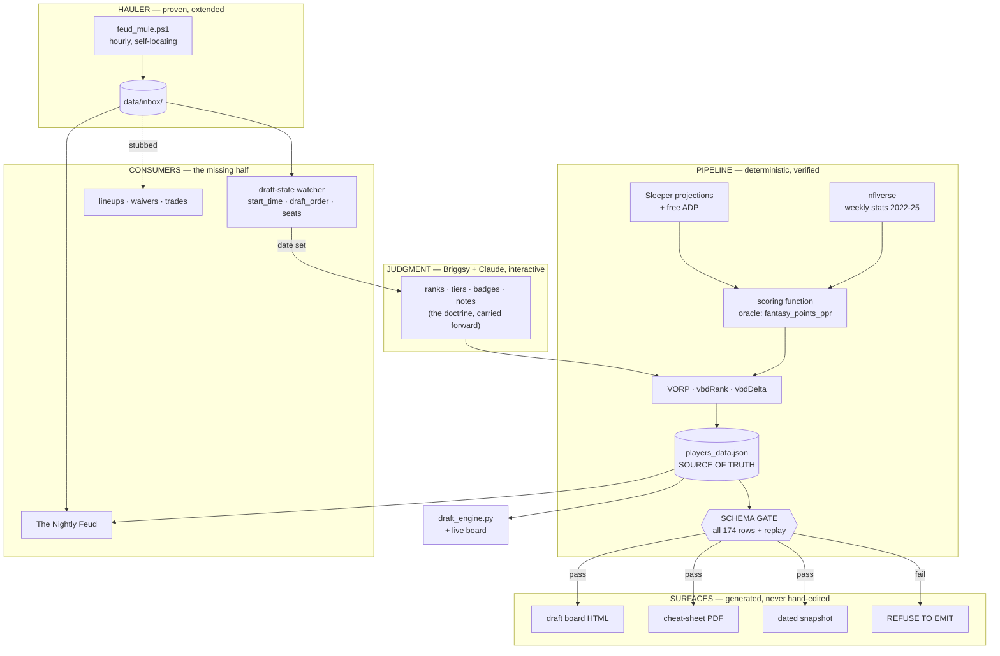

# refactor: Rebuild the machinery

> **Scope decision (Briggsy, 2026-08-07):** *"Baselines and rankings can stay — with the caveat
> that you and I will interactively refresh that several more times before draft day. Rebuild the
> machinery fo sho."*
>
> The ranking **doctrine and content** carry forward as input. Everything that **computes,
> propagates, and verifies** it gets rebuilt.

---

## Summary

The project has four hand-maintained copies of the board and no generator, plus one proven
scheduled hauler with no consumers. Every open item in the old TODO is a symptom of those two
facts. This plan replaces both: **one source of truth that generates every surface**, and **one
hauler feeding many consumers**.

It covers all four of the original jobs — draft prep, live draft assist, lineup automation, roster
management — sequenced so draft-critical work lands first and nothing roster-dependent is built
before rosters exist.

**The load-bearing requirement is repetition.** The board will be refreshed interactively several
times before the draft. A refresh must be one command that regenerates every surface and *refuses
to emit a board the engine cannot eat*. Today a refresh is a four-file hand-copy with no
verification — which is precisely how two of the four surfaces silently drifted.

---

## Problem Frame

### What is actually broken

**Two surfaces are wrong right now.** Not "will go stale" — wrong today.

| Surface | State (verified 2026-08-07) |
|---|---|
| `draft-kit/players_data.json` | Correct. `meta.updated: 2026-08-05`, 174 players (48 RB / 59 WR / 20 TE / 23 QB / 14 DEF / 10 K) + 8 `dst` |
| `draft-kit/family-feud-draft-board.html` | Full ~49.9 KB duplicate at line 200 (`const DATA = …`). Currently deep-equal to the source. No `fetch`, no reference — a copy, not a viewer |
| `draft-kit/draft_rankings_data_2026-08-05.json` | **Drifted.** `dst[6]` Jaguars (board says Vikings), `dst[8]` Vikings (board says Steelers), `strategy.kickers` still reads *"No kicker board needed in August"*. **Zero readers in the repo** |
| `draft-kit/family-feud-cheat-sheet.pdf` | **Drifted and incomplete.** Generated Aug 5 18:54, pre-audit. Prints *"6 Jaguars"* and the retired *"I'll call the kicker live"*. **Missing all 24 K/DEF entries** — 150 of 174 rows |

The runbook asserts the dated copy is "kept in sync." It is not. Carrying it forward by rename —
which the old TODO instructed — would have resurrected three fixed bugs.

**There is no generator.** The repo contains exactly two Python files (`draft_engine.py`,
`merge_picks.py`) and zero build source. Nothing computes `vorp`/`vbdRank`/`vbdDelta`, emits the
HTML blob, or renders the PDF. The ReportLab script that made the PDF died with the Cowork
migration.

**The mule hauls into a void.** `newsletter/feud_mule.ps1` runs hourly, self-locating, 10 sources
with independent failure — verified alive (cargo stamped `2026-08-07 14:29:01`). It is the proven
pattern in this project. It has **no consumer**. The newsletter HTML is sha256-identical to its
template; both archive folders hold only `.gitkeep`.

It already hauls `sleeper_draft.json` hourly, carrying `status`, `start_time`, and `draft_order` —
the exact fields that signal the draft is real. **Nothing reads them.**

### Three ways to lose the draft, none of which anything currently guards

**1. Cross-draft contamination — reproduced end to end.** `merge_picks.py` keys its merge purely on
`pick_no` and never reads `draft_id`, though every Sleeper pick object carries one. Seeding
`picks.json` with a spent mock's picks and merging against the real draft yields *"no gaps, no
duplicates — engine will accept this file"*, exit 0; the engine then reports 120 phantom picks and
*"YOUR next pick: #126"* with every elite player marked drafted. `picks.json` is gitignored, so
`git status` never shows it — and the old TODO instructed developing against exactly that feed.

**2. Silent name-mismatch.** `taken_keys` is built from `norm(sleeper_name)`; availability filters on
`norm(board_name)`. When those diverge for the same player, **he stays on BEST AVAILABLE after being
drafted.** Demonstrated. The integrity gate cannot catch it — pick numbers stay perfectly
contiguous — and the engine reports unmatched names nowhere, at any severity. Same outcome as the
documented landmine, reached by an unguarded route. Current matcher is empirically good (4 of 120
lab picks unmatched, all genuinely off-board; 0 collisions across 174 entries), but the failure is
silent by construction.

**3. Latent schema breaks.** `draft_engine.py` hard-indexes eleven keys with no defaults. Both known
break modes are **latent, not immediate**:

- missing `badges` at rank 5 crashes instantly; **at rank 40 it runs clean**
- `vbdDelta` as float ran **clean at 0 picks** and died at **exactly three picks in**, when r=15
  Drake London (−9) entered the top-12 window

**A pre-draft smoke run against an empty `picks.json` proves nothing.** Both breaks survive it.

### What the research settled

- **VORP is fully reverse-engineered.** Mean season points by finish rank, 2022-2025, this league's
  scoring, mapped onto the board's own `pr`. Reproduced to **0.1 points MAD across 150 players**
  (Gibbs 268.4 → 268.4, Chase 242.7 → 242.8).
- **nflverse is trivial to reach.** `stats_player_week_{year}.csv`, ~8.3 MB/season, all four years
  in ~6 seconds. Pure stdlib `csv` — nothing to install on Python 3.14.
- **A free test oracle exists.** nflverse ships `fantasy_points_ppr`; our scoring reproduces it
  **1997/1997 exact** once offensive-only fumbles are used. It already caught a real bug.
- **Sleeper ships undocumented 2026 projections** (2.9 MB, refreshed daily) *and* free ADP
  (`adp_ppr`, `adp_half_ppr`, …) that can feed Layer 1.
- **Waiver timing is closed.** 111 completed waiver transactions across two of Briggsy's 2025
  leagues; 101 cluster Wednesday ~03:10 ET. Tuesday-report doctrine is correct. No live cycle needed.
- **CORS is open**, `Origin: null` → `access-control-allow-origin: *`. Live drafts carry
  `s-maxage=30`, so polling needs cache-busting.
- **Sleeper's public API is read-only** — no create endpoints. Mock setup happens through **Chrome
  automation** (verified connected, logged in), not by hand.

### The finding that changes doctrine

`vbdRank` is **strictly monotone in `pr` within every position** — 0 order violations across 150
skill players (QB 23, RB 48, WR 59, TE 20). Verified independently.

Because the curve is a rank→points lookup and `pr` is its input, **within a position `vbdDelta` is a
mechanical restatement of the board rank.** Tiers on this board are per-position, so "same tier"
means "same position" — and `ranking-methodology.md`'s rule *"VBD is the tie-breaker… when two
players sit in the same tier"* is invoked exactly where VBD has **no independent information**. The
rule cannot change a decision.

Everything **cross-positional** survives intact and is the real value: `RB41 = 117.5` vs
`WR47 = 144.7` is the arithmetic behind the rounds 3-5 RB-over-WR tie-breaker; QB-in-6-9 and
K/DEF-last hold. Real per-player projections break the circularity and make `vbdDelta` mean
something within a position for the first time.

**Two factual errors in `ranking-methodology.md` about its own pipeline**, found by reproducing it:
line 53 claims the scoring included 40+/50+ yard TD bonuses (the reproduction matched to 0.1 pts
*without* them — never applied) and claims the curves came from play-by-play (they came from weekly
stats; pbp was never used).

---

## The Spine

The two structural moves: **one source generates every surface** (killing the drift class of bug),
and **one hauler feeds many consumers** (killing the "hauls into a void" problem). The watcher
closes the loop — when the draft becomes real, it tells us to refresh.

---

## Key Technical Decisions

**KTD-1 — `players_data.json` is the single source; all other surfaces are generated artifacts.**
The dated snapshot, the HTML `const DATA` blob, and the PDF become build outputs. None is ever
hand-edited again. This eliminates the mechanism that produced the current drift.

**KTD-2 — The dated twin becomes a true snapshot, or dies.** It has zero readers today and has
already forked. Recommendation: keep it as a **generated, byte-identical** archival copy written by
the generator. If it cannot be byte-identical, delete it — a copy that can disagree is worse than
no copy.

**KTD-3 — One normalizer, one spec, three consumers.** `norm()` currently exists once in Python;
the live board plan commits to a second JS implementation and the newsletter needs a third. Extract
one spec with **golden test vectors** that Python, JS, and the gate all run. Divergence would show
up live, mid-draft, as the board and the advisory disagreeing about who is available.

**KTD-4 — Add `sleeperId` to every board entry, validated at generation time.** Sleeper picks carry
`player_id` at both the top level and inside `metadata`. Joining on a stable ID rather than a name
kills the entire name-mismatch bug class at the root. `norm()` becomes the fallback, not the primary
key. *This is the highest-leverage single change in the plan.*

**KTD-5 — The gate validates all rows and replays real picks.** Static checks over every one of the
174 entries, then an execution gate replaying the lab feed at increasing prefix lengths so every
player passes through the top-12 window. Justified by the latency finding: neither known break mode
fires on an empty picks file.

**KTD-6 — VORP v1 = historical curve; v2 = projections.** The curve reproduces the current board
exactly, needs no name join (it keys off `pr`, already present), and is ~80 lines of stdlib. Ship it
first to get the pipeline into version control. Projections are the better answer — they break the
circularity — but they carry the join work and a systematic level shift that requires rewriting
every worked example in the methodology doc. Sequence, don't skip.

**KTD-7 — Nothing hardcodes league shape.** Not 120, 128, 15, 16, or 8. `draft_engine.py` already
gets this right (argv-driven, defaults 8/16). The HTML does **not** — line 252 emits round headers up
to "Round 22 range" and line 233 renders 22 skill players as rounds 17-19, which do not exist. The
generator templates shape from `meta` / live draft settings.

**KTD-8 — Prefer reading shape from the draft object over typed arguments.** Running
`draft_engine.py 3 8 15` against a 16-round draft makes `my_next` `None`, so the engine goes
**silent about your own pick in round 16** — the K/DEF round. A wrapper should read `teams`/`rounds`
from `/draft/<id>` rather than trusting muscle memory.

**KTD-9 — The Nightly Feud: Jinja2 template, deterministic facts, LLM prose.** The current template
has zero placeholder tokens and needs variable-length sections, so string substitution can't express
it without emitting HTML from Python (which is how the CSS rots). Hard rule: **deterministic code
owns every fact and number; the LLM owns only connective prose.** The voice is the asset — it cannot
be produced by f-strings, and canned rotations read as canned by week two over ~365 nights.

**KTD-10 — Mule health means parseability, not bytes.** `rss_nbc_edge.xml` is an 813 KB HTML page
that fails XML parse, yet the mule reports `ok (799632 bytes)` because `Fetch-Source` only checks
`size > 50`. `mule_status.json` reads 10/10 green while the feed chosen for player news is garbage.
This is the third instance of this project's signature failure — a health signal reporting success
for something it never checked (`Last Result: 0`, `NumberOfMissedRuns`, now this).

---

## Scope Boundaries

**In scope:** the generator and its gate; the VORP pipeline; the shared normalizer; the two P0
guards; the live board poll loop; the draft-state watcher; mule hardening; The Nightly Feud
end to end; doc corrections.

**Deferred to follow-up work:**
- **Jobs 3 and 4 (lineups, waivers, trades)** — stubbed by decision. League is `pre_draft`; no
  rosters, matchups, or transactions exist. Un-stub trigger is below.
- **Long-TD bonus from play-by-play** — measured worth: max 19 pts/season, median 3. Never applied
  in the original numbers either.
- **Projection-based VORP (v2)** — sequenced after v1 ships.

**Explicitly not doing:**
- Simplifying `draft_engine.py`'s integrity gate. It is deliberately defensive and has a live catch
  on record (Mock #3, picks 78-82). What this plan adds is orthogonal.
- Creating a throwaway league for roster data. Native MOCK DRAFTS covers draft rehearsal; the
  roster question only matters when jobs 3/4 un-stub.

**Un-stub trigger for jobs 3 and 4:** real rosters exist AND the mule hauls `/rosters`,
`/matchups/<week>`, `/transactions/<week>`. Neither is true today.

---

## Implementation Units

### Phase 0 — Gates (block everything downstream)

#### U1. Close cross-draft contamination

**Goal:** make it impossible to advise off another draft's picks.
**Files:** `scripts/merge_picks.py`, `draft-kit/test_merge_picks.py`
**Approach:** Read `draft_id` off every incoming pick and off every pick already in `picks.json`.
Refuse the merge — loudly, non-zero exit — if any pick's `draft_id` differs from the requested
draft. Also resolve `--check`: it is advertised in both the docstring and the usage string but
`sys.argv[2]` is never read, so a session that types it believing the run is read-only gets a write.
Implement it or delete both mentions; do not leave a documented flag that lies.

**Test scenarios:**
- `picks.json` holding lab-room picks + a real draft id → non-zero exit, no write, message names both ids
- clean merge of same-draft picks → succeeds, count correct
- empty `picks.json` + real draft → succeeds
- `picks.json` containing `null` (raw curl of a bogus id) → rejected with a message, not a traceback
- `--check` → either performs no write (if implemented) or is absent from help (if removed)
- mixed `draft_id` values *within* an existing file → rejected

**Verification:** the reproduction that produced "120 picks in, YOUR next pick: #126" against an
empty real draft now fails closed.

#### U2. Report unmatched picks

**Goal:** kill the silent name-mismatch path to advising a drafted player.
**Files:** `draft-kit/draft_engine.py`, `draft-kit/test_engine_matching.py`
**Approach:** The engine already computes `b = board_by_name.get(key)` and stores `None` when a pick
fails to match. Surface it. Any pick that does not resolve to a board entry gets printed in a
warning block. Off-board picks are normal (4 of 120 in the lab feed) so this is informational, not
fatal — but an on-board player who fails to match is the same "recommend a drafted player" outcome
the landmine warns about, and today nothing says a word.

**Execution note:** characterization-first — capture current output against the lab feed before
touching anything, so the diff is provably additive.

**Test scenarios:**
- lab feed replay → exactly 4 unmatched reported, named, and advisory otherwise byte-identical to baseline
- constructed pick whose norm diverges from a top-12 board name → warning fires and names the player
- zero unmatched → no warning block at all
- integrity gate still fires on interior gaps and duplicates (regression: do not disturb)

**Verification:** the demonstrated case (drafted player still on BEST AVAILABLE) now announces itself.

---

### Phase 1 — One source, generated surfaces

#### U3. Shared name normalizer + golden vectors

**Goal:** one spec, three runtimes, provable equivalence.
**Dependencies:** none
**Files:** `draft-kit/norm_spec.json`, `draft-kit/normalize.py`, `draft-kit/test_normalize.py`
**Approach:** Lift the 17-entry ALIASES table and the four normalization steps out of
`draft_engine.py` into one spec plus golden vectors. Python imports it; the JS port in the live
board is generated from or tested against the same vectors. Known equivalence traps: Python's
`re.sub` replaces all occurrences so the JS regex needs `/g`; Python's `.split()` drops empties so
JS needs `.filter(Boolean)`; non-decomposable non-ASCII is deleted outright, not transliterated.

**Test scenarios:** the golden vectors, run identically in both runtimes —
`Ja'Marr Chase`/`Ja’Marr Chase` → `jamarrchase` · `Amon-Ra St. Brown` → `amonrastbrown` ·
`Kenneth Walker III` → `kennethwalker` · `Marvin Harrison Jr.` → `marvinharrison` ·
`A.J. Brown`/`AJ Brown` → `ajbrown` · `Kenny Gainwell` → `kennethgainwell` (alias) ·
full 174-name board sweep asserting zero collisions.

**Verification:** identical output from Python and JS across every vector.

#### U4. The board schema gate

**Goal:** make it impossible to ship a board the engine cannot eat.
**Dependencies:** U3
**Files:** `draft-kit/validate_board.py`, `draft-kit/test_validate_board.py`
**Approach:** Static checks across **all 174 rows** (not a top-N sample — that is what the latency
finding forbids), then an execution gate. Checks, each traceable to a reproduced failure:

*Structure* — top level is a dict with exactly `{meta, players, dst, strategy}`; `players` is a
non-empty list of dicts (an empty list exits 0 with a complete-looking empty advisory).

*Types* — `name` non-empty str · `r`/`pr`/`tier`/`vbdRank` int (not bool) · **`vbdDelta` int and not
float** (`:+d` raises on float) · `vorp` numeric, and a *missing* `vorp` must be caught here because
the engine silently prints a row without it · `badges` list of single-char str · `team`/`note` str.

*Values* — `pos` in exactly `{RB, WR, TE, QB, K, DEF}`; any other spelling makes the whole position
vanish from TIER CLIFFS at exit 0 and, if not literally `K`/`DEF`, floods VBD LEANS with +45..+68
defense deltas.

*Invariants* — `r` unique and contiguous `1..n` · `vbdRank` unique and contiguous · `pr` unique and
contiguous within each position · `vbdDelta == r - vbdRank` · tiers contiguous from 1 within each
position · `{vorp, vbdRank, vbdDelta}` all-present-or-all-absent, uniform board-wide.

*Names* — `norm(name)` unique board-wide (a duplicate makes one pick remove two rows from
availability) · every board name resolves against the live Sleeper player dump under `norm()`
(currently 174/174) — **run this at generation time, not draft time**.

*Cross-surface* — dated snapshot deep-equals the source (**fails today**) · the object extracted
from the HTML's `const DATA = ` line deep-equals the source · the PDF contains a row for every
player (**150 of 174 today**) with matching numbers.

*Execution gate* — run the real engine against the new board with the lab feed replayed at
increasing prefix lengths, asserting exit 0 each time.

**Test scenarios:** one mutation per check, each asserting the gate rejects with a message naming
the offending player — missing `badges` at rank 40 (passes an empty-picks run, must still fail) ·
`vbdDelta` float board-wide (passes at 0 picks, must still fail) · `pos: "DST"` · duplicate `r` ·
`vbdDelta` inconsistent with `r - vbdRank` · a name that collides under `norm()` · `players: []` ·
and a clean board passing every check.

**Verification:** every mutation the research reproduced is caught before emit.

#### U5. VORP pipeline v1 — historical curve

**Goal:** replace prose with reproducible code; make the refresh arithmetic free.
**Dependencies:** U4
**Files:** `draft-kit/scoring.py`, `draft-kit/build_curves.py`, `draft-kit/test_scoring.py`, `draft-kit/cache/`
**Approach:** Fetch and cache `stats_player_week_{2022..2025}.csv`. One pure scoring function
encoding `league.md`. Aggregate to season totals per player, sort within position, average each
finish rank across the four years → the curve. Board players map in through `pr`. Baselines
QB12/RB41/WR47/TE12 are league-structural and unchanged.

**Patterns to follow:** `draft_engine.py`'s encoding guard — `encoding="utf-8"` on every read *and*
forced UTF-8 stdout. `mule_status.json` additionally needs `utf-8-sig` (it carries a BOM from
PowerShell 5.1, so the literal remedy in CLAUDE.md raises on that one file).

**Test scenarios:**
- **oracle**: recomputed standard PPR equals nflverse's `fantasy_points_ppr` for every scored player
  (baseline established: 1997/1997 exact, using offensive fumbles only — `fumbles_lost_total`
  includes special-teams fumbles and is wrong)
- **reproduction**: regenerated VORP matches the current board within 0.1 MAD across 150 players
- curve values land at the measured figures (QB12 282.6 · RB41 117.5 · WR47 144.7 · TE12 148.8)
- `vbdDelta` emitted as `int`, never float — asserted at the type level
- a season file missing from cache → refetched, not crashed
- 2026 actuals (404 today) → handled as absent, not as an error

**Verification:** pipeline regenerates today's board from scratch and the gate passes it.

#### U6. The generator — one command, every surface

**Goal:** make "refresh the board" a single verified command.
**Dependencies:** U4, U5
**Files:** `draft-kit/build_board.py`, `draft-kit/render_html.py`, `draft-kit/render_pdf.py`, `draft-kit/test_build_board.py`
**Approach:** Read the source, recompute VORP, run the gate, and only on pass emit the dated
snapshot, the HTML (preserving the `const DATA = ` line convention — single line, no trailing
semicolon), and the PDF. **On gate failure, emit nothing and exit non-zero.** Template league shape
from `meta` rather than hardcoding 8. Add `meta.badges[code].glyph` so the engine and PDF stop
hardcoding their own glyph tables, and assert all three renderings agree.

`reportlab` publishes a pure-Python wheel (`py3-none-any`, requires_python >=3.9) so the PDF path
needs no compiler on 3.14.

**Test scenarios:**
- all four surfaces regenerate and the gate's cross-surface checks pass
- **PDF contains all 174 rows** including the 24 K/DEF entries missing today
- HTML round headers stop at the real round count (no "Round 22 range"; no "Rd 17-19")
- badge glyphs bound for the PDF are Latin-1 encodable — Helvetica cannot print the emoji
- gate failure → zero files written, non-zero exit
- regenerating an unchanged board is byte-stable (no spurious diffs)

**Verification:** delete all three derived surfaces, run one command, gate passes, engine runs.

---

### Phase 2 — Draft-day instruments

#### U7. Live board poll loop

**Goal:** the wall display greys players out as picks land.
**Dependencies:** U3, U6
**Files:** `draft-kit/family-feud-draft-board.html`
**Approach:** Poll `/draft/<id>/picks` with **cache-busting** — live drafts return
`s-maxage=30, stale-while-revalidate=300`, so plain polling at 10-15s buys nothing. Plain `fetch`,
**never** `credentials: 'include'` (the wildcard-origin + allow-credentials pair is exactly what
browsers reject). Introduce a **separate `drafted` collection** — `taken` is a `Set<int>` doing
double duty as the user's manual toggle, and feeding polled picks into it means the user un-crosses
a player and the next poll re-adds him. Preserve scroll position across `renderAll()`.

Sub-30s latency is the design target and is fine: the board tracks *other* people's picks and the
clock is 120 seconds.

**Test scenarios:**
- replay against the spent lab room (frozen, `s-maxage=86400`) → drafted players grey out, counts
  and tier cliffs update
- manual toggle survives a poll cycle (the dual-duty bug)
- scroll position preserved across cycles; search text survives
- network failure mid-poll → last good state retained, failure surfaced, no blank board
- on-the-clock highlight (the lab room exposes `draft_order: {'1390750540631150592': 3}`)
- name matching uses the shared normalizer and agrees with the engine on the same feed

**Verification:** replay the lab feed in the browser and confirm the board's availability set matches
the engine's, pick for pick.

#### U8. Correct the docs that would mislead under time pressure

**Goal:** remove instructions that are false.
**Dependencies:** U1, U6
**Files:** `docs/draft-day-runbook.md`, `docs/league.md`, `docs/ranking-methodology.md`, `README.md`, `TODO.md`, `CLAUDE.md`
**Approach:** The runbook contradicts itself on working directory — Step 3.1 only runs from repo
root, Step 3.3 only from `draft-kit/`; **the draft loop cannot be executed as written**. Step 2 still
teaches `metadata.slot_name_<N>` as a live source; the real draft's metadata has exactly four keys
and zero `slot_name_*`. `README.md` never mentions `merge_picks.py` and calls `picks.json`
hand-maintained. `league.md` should record waivers as **confirmed** (Wednesday ~03:10 ET, 111
transactions, two leagues) while keeping the honest note that the integer's *label* stays ambiguous;
also note `waiver_budget: 100` is inert under `waiver_type: 0`. `ranking-methodology.md` needs both
factual errors corrected and the circularity finding recorded. `TODO.md` must stop asserting the
draft date "does not move" — `start_time` is null and Sleeper's own UI says *"Draft time has not yet
set."*

Add to landmines: the `slot_to_roster_id` trap (identity map `{1:1…8:8}` while `draft_order` is
null — three unrelated "3"s), and `mule_status.json`'s BOM.

**Test scenarios:** `Test expectation: none — documentation.` Verify by executing the runbook's draft
loop start to finish from a single stated directory.

---

### Phase 3 — The hauler grows consumers

#### U9. Draft-state watcher — the first consumer

**Goal:** notice when the draft becomes real, without depending on anyone remembering.
**Dependencies:** none (cargo already arrives)
**Files:** `scripts/watch_draft_state.py`, `scripts/install-watcher.ps1`, `newsletter/data/state/`, `scripts/test_watch_draft_state.py`
**Approach:** Diff the current `sleeper_draft.json` / `sleeper_users.json` against the last seen
snapshot. Fire on: `start_time` going non-null (**the starting gun — rebuild the board**),
`draft_order` populating (your slot exists), `status` leaving `pre_draft`, and user count changing
toward 8. Output is a **file**, never a notification — Anthropic push and email are broken
account-wide. Installer derives every path from `$PSScriptRoot`; absolute paths have broken this
project twice.

This replaces the dead Cowork `REFRESH_BRIEF`, which fired on a hardcoded Aug 26 — the wrong shape,
because the date is a handshake and can move earlier.

**Test scenarios:**
- synthetic `start_time` null → non-null → alert file written naming the date
- `draft_order` null → populated → alert states Briggsy's slot from
  `draft_order["1390750540631150592"]` and explicitly **not** from `slot_to_roster_id`
- user count 4 → 8 → alert lists the new managers
- no change → no alert, no file churn
- missing/corrupt cargo → degrades with a stated reason, does not crash
- first run with no prior snapshot → establishes baseline silently

**Verification:** replay a synthetic sequence and confirm each transition fires exactly once.

#### U10. Harden the mule — validate parseability, not bytes

**Goal:** stop `mule_status.json` reporting green for garbage.
**Dependencies:** none
**Files:** `newsletter/feud_mule.ps1`, `scripts/install-mule.ps1`
**Approach:** `Fetch-Source` accepts anything over 50 bytes, so an 813 KB HTML error page passes as
RSS. Add per-source **content validation** — XML feeds must parse and contain `<item>` elements;
JSON sources must parse. Record the validated result in `mule_status.json` so a consumer can trust
it. Replace or drop `rss_nbc_edge` (the NBC Edge URL returns a `SectionPage`, not a feed) — Rotowire
is the most fantasy-dense of the working four but ships only 5 items, so a replacement matters.

**Test scenarios:**
- current NBC payload → recorded as FAILED, not ok
- the four working feeds → recorded ok with item counts (cbs 36, yahoo 50, espn 23, rotowire 5)
- valid JSON sources → ok; truncated JSON → failed
- one source failing does not affect the other nine (preserve independent failure)
- `mule_status.json` stays readable by the existing PowerShell reader

**Verification:** run against today's cargo and confirm the status file reports 9/10, not 10/10.

#### U11. The Nightly Feud — build the half that never existed

**Goal:** ship the thing Briggsy actually loves.
**Dependencies:** U3, U10
**Files:** `newsletter/templates/edition.html.j2`, `scripts/build_newsletter.py`, `scripts/test_build_newsletter.py`
**Approach:** Jinja2, with the `<style>` block carried over byte-for-byte and a build-time assertion
that it still hashes to the original — the design is the asset. Keep `newsletter-template.html`
frozen in git as the design reference. **Deterministic code owns every fact and number; the LLM owns
only connective prose.**

Section sources, per research: League Desk and both verified tiles (`4/8 Seats`, `Aug 5 Board`) have
full cargo. **Days to Draft and Your Slot have no source** — `start_time` and `draft_order` are null
— and must render honestly (`—`, asterisked estimate) and switch automatically the night they
populate. The Wire is the strongest section (114 parseable items tonight, 27 board-player mentions).
Market Watch resolves trending IDs through the per-player endpoint (~1 KB each, 48 IDs in 3.7s — not
the 14 MB dump) and will routinely show **2-4 material rows of 25**, which is on-voice: *"Material
moves get named; noise gets ignored."* Edition number = `len(glob('newsletter/archive/*.html')) + 1`
— self-healing, no state file. Delete the `.preview-banner`. Fix the colophon's dead
`newsletter_archive\` path.

**Voice to preserve:** mock-institutional setup, deadpan puncture. Zero exclamation marks. Long
declarative sentence, then a colon or em-dash pivot into a short aphoristic kicker that lands last.
Second person to the owner. Hunter named as the antagonist.

**Test scenarios:**
- rendered `<style>` block hash-identical to the frozen template
- a missing feed → that section degrades with a stated reason; the edition still publishes
- `start_time` null → asterisked estimate; synthetic non-null → real countdown, asterisk gone
- `draft_order` null → `—` for slot, and **never** `slot_to_roster_id`
- Wire matching excludes `pos == 'DEF'` (board DEF names substring-matched ordinary team articles:
  a Gibbs story matched "Detroit Lions") and matches normalized tokens, not raw board strings (naive
  matching on `Michael Pittman Jr.` found DK Metcalf and missed Pittman)
- zero material trending rows → renders the one-line dismissal, not an empty section
- `mule_status.json` read with `utf-8-sig` (BOM)
- consumed cargo archived to `newsletter/data/archive/<date>/`
- LLM unavailable → edition still publishes with facts and no prose, rather than failing

**Verification:** produce a real Edition #1 from tonight's cargo and read it cold against the voice.

#### U12. Schedule the newsletter

**Goal:** a real job, not a trigger that no-ops when an app isn't open.
**Dependencies:** U11
**Files:** `scripts/install-newsletter.ps1`
**Approach:** Mirror `install-mule.ps1` — derive from `$PSScriptRoot`, register, force a run, verify,
throw if not green. Daily 19:00 ET, `-StartWhenAvailable` so a run missed while the laptop sleeps
fires on wake (the mule dropped its 11:29 and 12:29 runs during the folder rename).

**Test scenarios:** registers and fires · verify step throws on a bad path · re-running is idempotent
· a run missed while asleep fires on wake · **health is proven by output freshness, never by
`Last Result` or `NumberOfMissedRuns`** — both are demonstrably frozen signals.

---

### Phase 4 — Stubs

#### U13. Stub the in-season cadence

**Goal:** record the shape without building against imagined data.
**Dependencies:** U9, U11
**Files:** `docs/in-season-plan.md`
**Approach:** Document the three deliverables (Tuesday waiver report, Thursday/Sunday lineup checks,
trade evaluation on demand), the confirmed waiver timing, and the mule extension they need
(`/rosters`, `/matchups/<week>`, `/transactions/<week>` — none hauled today). Record the un-stub
trigger. They share U11's machinery, so building the newsletter first is what makes them cheap.

**Test scenarios:** `Test expectation: none — planning document.`

---

## Risks

**The top of the board may be inflated.** The finish-rank curve is an order statistic on realized
outcomes — the player who finishes WR1 is the one whose variance broke best, and nobody can be
*forecast* to do that. Measured against real 2026 projections scored identically: mean |diff| 26.4
pts, Chase 145.1 vs 242.7. If *"Gibbs clears his replacement bar by twice as much as Allen"* rests
on inflated spread, some round-1-2 conviction is a method artifact. **This is a doctrine question,
not a bug** — it deserves a decision, not a silent correction.

**The join is permanently name-based unless KTD-4 lands.** Neither `players_data.json` nor Sleeper's
projection payload carries a stable player id. Auto-match hits ~99%, but the seam rots on team
changes, suffixes, and rookies sharing a name — and fails silently.

**Sleeper's projection endpoint is undocumented** and can change without notice. Cache every pull
with a timestamp so a draft-morning outage cannot leave the board with no projections. It returned
3,111 records but only 559 carried `pts_ppr` — filter on presence, not count.

**Kicker and DST projections are structurally incomplete.** Sleeper gives no total FG made and no
0-39 split (this league pays 3 for 0-39), and no points-allowed distribution for DST at all — the
largest component of DST scoring. The board has an explicit elite-K tier, so this inaccuracy lands
somewhere that actually gets read.

**Stat fanout on every refresh.** Changing VORP changes three fields on 174 players, every worked
example and case study in the methodology doc, the HTML blob, and the PDF. The generator is the
mitigation; until it exists, every refresh is the risk.

**The draft date can move earlier.** `start_time` is null and the target is a handshake. U9 is the
mitigation, and it is deliberately early in the plan.

---

## Open Questions

1. **Does the dated snapshot survive?** It has zero readers and has already drifted. Generated
   byte-identical copy, or delete it? *Recommendation: generate it; delete if it can't be exact.*
2. **How hard should we lean on elite-tier spread** given the order-statistic finding? A doctrine
   call, not an engineering one.
3. **Replacement for `rss_nbc_edge`** — the feed chosen for player news is the broken one, and the
   most fantasy-dense working feed ships 5 items.
4. **Does the newsletter's LLM prose run per-section or per-edition?** Affects cost, latency, and how
   gracefully it degrades unattended.

---

## Sources & Research

All findings verified this session against live sources; several reproduced by execution.

- **Live Sleeper API** — league, draft, users, rosters, traded picks, the spent lab room
  (`1390923383440424960`, 120 picks, 15 rounds, `league_id: null`), the undocumented per-player
  endpoint, and the undocumented 2026 projections endpoint.
- **Sleeper API docs via Context7** (`/websites/sleeper`) — confirmed read-only; every documented
  endpoint is a GET.
- **Sleeper web app via Chrome automation** — confirmed logged in; *"Draft time has not yet set."*
- **nflverse** — release index and `stats_player_week_{2022..2025}.csv`; scoring validated
  1997/1997 exact against `fantasy_points_ppr`; RB curve computed (RB1 362.9 → RB41 115.0).
- **The repo itself** — `draft_engine.py` read end to end; every schema failure reproduced by running
  the real engine against mutated copies of the real board; VBD circularity confirmed at 0 violations
  across 150 players; the twin's drift confirmed by direct diff.
- **2025 transaction history** via `copy_from_league_id` — 111 completed waivers across two leagues.
