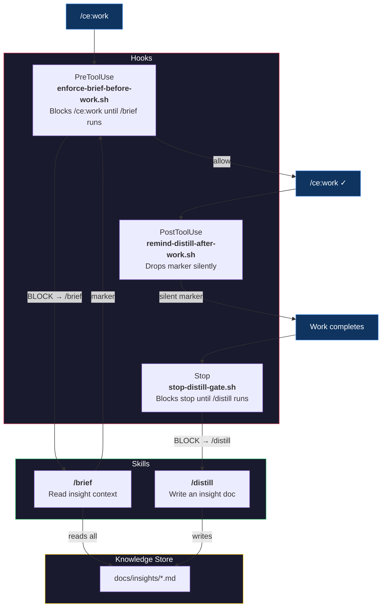
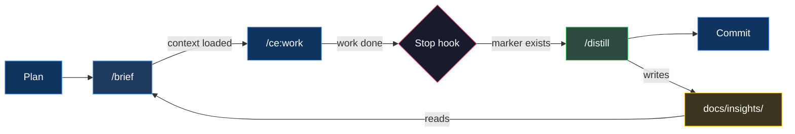

# Distill & Brief

**Status: COMPLETE** — deployed and enforcing.

### How We Stopped Losing What We Learned

---

> **The pitch:** Every engineering session produces hard-won knowledge. By the next session, it's gone.
>
> We built a system where AI agents *automatically* brief themselves before starting work and get *automatically* reminded to distill findings when work completes. Two skills, three hooks, zero human effort, minimum token burn.

---

## The Problem

AI coding agents have amnesia. Each session starts from zero.

When you spend 45 minutes discovering that an async callback silently drops valid data because of a stale request ID, that knowledge lives in the conversation. When the session ends, it evaporates. The next session hits the exact same wall.

```
Session 1: Debug for 45 min  -->  Find root cause  -->  Fix it  -->  Session ends
Session 2: Debug for 45 min  -->  Find root cause  -->  "...wait, didn't we do this before?"
```

Putting "remember to check past fixes" in instructions doesn't work. Humans forget to ask. Agents skip them, forget them, or deprioritize them under task pressure.

**We needed something stronger than instructions.**

---

## The Solution

Two directions. Two skills. Three hooks. One feedback loop.


### The Flow

1. **Agent starts a work session** with `/ce:work` — PreToolUse hook blocks it: *"Run `/brief` first."*
2. **`/brief`** reads every insight doc in `docs/insights/` and surfaces the full context. Marker created.
3. **Agent re-runs `/ce:work`** — hook sees the marker, consumes it, allows through. The agent works with full awareness of past root causes and gotchas.
4. **`/ce:work` loads** — PostToolUse silently drops a `.distill-needed` marker. No output, no interruption.
5. **Work happens.** The agent follows ce:work's instructions.
6. **Agent tries to stop** — Stop hook sees the marker: *"Run `/distill` to capture any non-obvious findings."*
7. **`/distill`** captures insights (or the agent confirms nothing to capture). Marker cleared. Agent stops.
8. **`/brief`** is also available on-demand — any time, any session, just ask.

---

## Architecture



---

## Why This Approach

| Approach | Verdict | Why |
|----------|---------|-----|
| **Agent instructions** ("check insights before work") | Rejected | Instructions are suggestions. Agents skip them under task pressure. |
| **Existing plugin skill** (ce:compound) | Rejected | Spins up 5 parallel subagents, produces 150+ line docs. Overkill for our 40-line format. |
| **Auto-triggering skills** (no hooks) | Rejected | Claude's own docs say it "tends to under-trigger." Unreliable for enforcement. |
| **Non-blocking hooks** (inject context via systemMessage) | Rejected | Platform bug — non-blocking hook output is silently discarded. Tested, filed issues, waited. Doesn't work. |
| **Blocking hooks + custom skills** | Selected | Blocking hooks deliver their message to Claude. Block `/ce:work`, redirect to `/brief`, allow on re-run. Deterministic enforcement. |

### Design Principles

Only blocking hooks work reliably on the current platform. Three hooks enforce the knowledge loop:

- **enforce-brief-before-work.sh** (PreToolUse) — blocks `/ce:work` until `/brief` runs. Uses a marker file (`/tmp/.brief-gate`). Also clears the distill marker when `/distill` runs.
- **remind-distill-after-work.sh** (PostToolUse) — silently drops a `.distill-needed` marker after `/ce:work` or `/ce:review` loads. No output (PostToolUse fires at skill load, too early for a reminder).
- **stop-distill-gate.sh** (Stop) — blocks Claude from stopping if the distill marker exists. This fires at the RIGHT moment — when work is actually done, not when the skill loads.

**Supporting hook:**

- **block-webfetch.sh** (PreToolUse) — blocks `WebFetch` (no timeout parameter) and redirects to `gemini-grounding` or `curl`. Unrelated to the knowledge loop.

**Skills:**

- **`/distill`** uses dynamic context injection to show existing insights before the agent writes, preventing duplicates.
- **`/brief`** reads the full insight docs on demand, for any session, at any time.

---

## What an Insight Doc Looks Like

Lean. Focused. Under 60 lines.

```markdown
---
title: Seeker frozen — async pathfinding callback invalidation
date: 2026-03-31
phase: 5a
modules: [game/ai/seeker-fsm, game/engine]
tags: [async, pathfinding, race-condition, FSM]
---

## Problem
Seeker AI stops moving after 2-3 path requests. Visually frozen in place.

## Root Cause
Async pathfinding callback fires after FSM state transition.
New state's path request overwrites `latestRequestId`, but the old
callback still references the stale ID. Guard check silently drops
the valid path.

## Fix
Added `pendingPath: boolean` to SeekerAIInternalState. Set on request,
cleared on callback or clearPath(). All 4 FSM states guard on it.

## Key Insight
Any async callback that touches shared state needs a generation counter
AND a pending flag. The counter alone creates a silent-drop window.

## Also Applies To
Any future async system (sound loading, network requests) that uses
request-ID-based supersession.
```

---

## The Bigger Picture



Plan. Brief. Execute. Stop hook catches you. Distill. Commit. Repeat. The briefing is enforced (PreToolUse block), the distill reminder fires at the right moment (Stop hook, not PostToolUse). The knowledge base grows. Rediscovery drops.

> *Currently implemented with the [compound-engineering](https://github.com/nichochar/compound-engineering) plugin for Claude Code. The pattern is tool-agnostic — any workflow with plan/execute/review steps can plug in.*

---

## Platform Note: Why Blocking Hooks

Non-blocking hooks (`exit 0` + stdout) are silently discarded by Claude Code — the model never sees the output. This is a confirmed platform bug. Filed as [anthropics/claude-code#42250](https://github.com/anthropics/claude-code/issues/42250).

Three key platform findings from empirical testing:

1. **Only error-path output reaches the model** — `{"decision":"block"}` and stderr (exit 2) deliver. All other formats silently dropped. Applies to PreToolUse, PostToolUse, and Stop.
2. **PreToolUse hooks don't fire on user slash commands** — only on Claude's programmatic Skill invocations. PostToolUse and Stop hooks fire in both cases.
3. **PostToolUse block delivers without undoing the tool result** — useful for silent side effects (marker files) paired with delivery at a later hook point.

We use PreToolUse to gate `/ce:work` behind `/brief` (Claude invocations), PostToolUse to silently drop a marker after ce:work loads, and a **Stop hook** to catch the agent when work is done and remind about `/distill`. The Stop hook is the timing breakthrough — it fires when the agent is finished, not when a skill loads.

---

## Appendix: Engineering the Skills

We ran both `/distill` and `/brief` through Anthropic's [Skill Creator](https://github.com/anthropics/skills) — the meta-skill that turns skill development from vibes into engineering.

### A/B Eval Results

Both skills were optimized through the Skill Creator's description optimizer — 5 iterations each, 20 queries, 3 runs per query, 0.4 holdout split.

**`/distill`** — 3 test cases, 6 parallel subagents (with-skill + baseline for each):

| Metric | /distill | No Skill | Delta |
|--------|---------|----------|-------|
| **Pass Rate** | 100% (18/18) | 33% (6/18) | **+67%** |
| **Avg Tokens** | 26.6K | 28.4K | -1.8K |
| **Avg Lines** | 49 | 101 | -52 |

**`/brief`** — 3 test cases, 6 parallel subagents:

| Metric | /brief | No Skill | Delta |
|--------|--------|----------|-------|
| **Avg Tokens** | 43.2K | 36.2K | +7K |
| **Avg Lines** | 83 | 83 | 0 |
| **Avg Words** | 857 | 792 | +65 |

`/brief` shows minimal quality delta because it's a **read skill** — it surfaces existing insight docs. Without the skill, Claude still finds and reads `docs/insights/`. The value of `/brief` is **convenience** (one command vs manual discovery) and **hook-enforced auto-injection** before `/ce:work` — the blocking hook ensures it always runs. `/distill` shows the large delta because it's a **write skill** — the template enforces structure that Claude doesn't produce on its own.

The skills don't make Claude smarter — they make Claude **consistent**. `/distill` proves this with half the length and perfect structure every time. `/brief` proves a different thing: that the real value of a read skill is in the delivery mechanism (hooks), not the formatting.

### What the Baseline Gets Wrong

Without the skill, Claude produces good documentation but with:
- Inconsistent structure (5-7 sections with varying names vs exactly 5 every time)
- No YAML frontmatter (2 of 3 baselines skipped it entirely)
- 2x the line count (88-115 lines vs 47-53)
- No sequential file numbering
- Key Insights that restate the fix instead of generalizing

### Windows Bug: `select.select()` on Pipes

While running the Skill Creator's description optimizer, we hit `WinError 10038` — every trigger test returned 0%. Root cause: `run_eval.py` uses Python's `select.select()` to read subprocess pipes. On Windows, `select.select()` only works with sockets, not pipes. Every query silently failed.

**The fix:** Replace `select.select()` with a threading-based reader — a background thread does blocking reads from the pipe and puts lines into a `queue.Queue`. The main loop pulls from the queue with a timeout. Same behavior, cross-platform.

```python
# Before (Unix-only):
ready, _, _ = select.select([process.stdout], [], [], 1.0)

# After (cross-platform):
line_queue: queue.Queue[str | None] = queue.Queue()
def _reader():
    for raw_line in process.stdout:
        line_queue.put(raw_line.decode("utf-8", errors="replace"))
    line_queue.put(None)  # sentinel
threading.Thread(target=_reader, daemon=True).start()
```

Anthropic merged this same fix on March 13, 2026 in `claude-plugins-official`. The `anthropic-agent-skills` plugin hasn't picked it up yet — we applied it locally.
