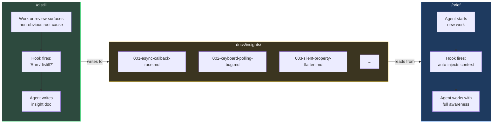
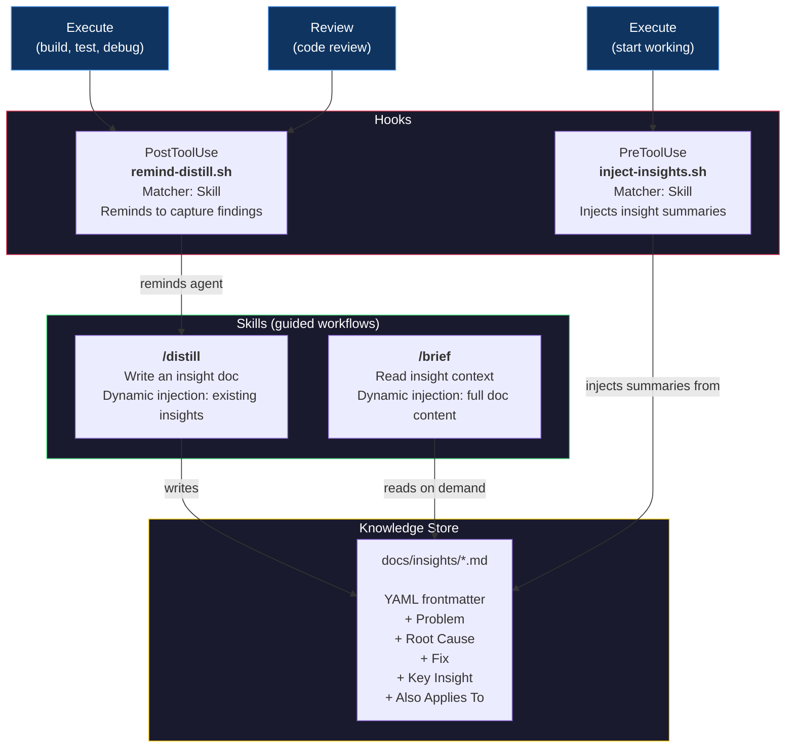
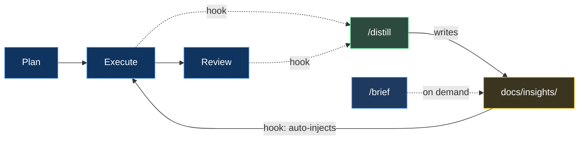

# Distill & Brief
### How We Stopped Losing What We Learned

---

> **The pitch:** Every engineering session produces hard-won knowledge. By the next session, it's gone.
>
> We built a system where AI agents *automatically* capture non-obvious fixes and *automatically* brief themselves before starting new work. Two skills, two hooks, zero human effort, minimum token burn.

---

## The Problem

AI coding agents have amnesia. Each session starts from zero.

When you spend 45 minutes discovering that an async callback silently drops valid data because of a stale request ID, that knowledge lives in the conversation. When the session ends, it evaporates. The next session hits the exact same wall.

```
Session 1: Debug for 45 min  -->  Find root cause  -->  Fix it  -->  Session ends
Session 2: Debug for 45 min  -->  Find root cause  -->  "...wait, didn't we do this before?"
```

Putting "remember to check past fixes" in instructions doesn't work. Humans forget to ask. Agents skip them, forget them, or deprioritize them under task pressure.

**We needed something stronger than instructions.**

---

## The Solution

Two directions. Two skills. Two hooks. One feedback loop.



### The Flow

1. **After executing work or completing a review**, a PostToolUse hook fires and asks: *"Did anything non-obvious come up? If so, run `/distill`."*
2. **`/distill`** shows the agent what's already documented, provides a template, and auto-numbers the next file. The agent writes a focused insight doc.
3. **Before the next work session**, a PreToolUse hook fires and injects summaries of every insight doc into the agent's context. No one has to remember. No one has to ask.
4. **`/brief`** is also available on-demand — any time, any session, just ask.

---

## Architecture



---

## Why This Approach

| Approach | Verdict | Why |
|----------|---------|-----|
| **Agent instructions** ("check insights before work") | Rejected | Instructions are suggestions. Agents skip them under task pressure. |
| **Existing plugin skill** (ce:compound) | Rejected | Spins up 5 parallel subagents, produces 150+ line docs. Overkill for our 40-line format. |
| **Auto-triggering skills** (no hooks) | Rejected | Claude's own docs say it "tends to under-trigger." Unreliable for enforcement. |
| **Hooks + custom skills** | Selected | Hooks fire deterministically. Skills handle the workflow. Knowledge compounds across sessions. |

### Design Principles

| Hook type | What it does | Role |
|-----------|-------------|------|
| **Blocking** | Rejects a tool call — tool literally fails | Enforcement | 
| **Injecting** | Adds information to context — no action required | Briefing |
| **Advisory** | Outputs a suggestion — agent chooses to act | Capture reminder |

- **inject-insights.sh** fires before `/ce:work` and injects insight summaries into context. Mechanical — no judgment needed.
- **remind-distill.sh** fires after `/ce:work` and `/ce:review` and reminds the agent to capture findings.
- **`/distill`** uses dynamic context injection to show existing insights before the agent writes, preventing duplicates.
- **`/brief`** reads the full insight docs on demand, for any session, at any time.

---

## What an Insight Doc Looks Like

Lean. Focused. Under 60 lines.

```markdown
---
title: Seeker frozen — async pathfinding callback invalidation
date: 2026-03-31
phase: 5a
modules: [game/ai/seeker-fsm, game/engine]
tags: [async, pathfinding, race-condition, FSM]
---

## Problem
Seeker AI stops moving after 2-3 path requests. Visually frozen in place.

## Root Cause
Async pathfinding callback fires after FSM state transition.
New state's path request overwrites `latestRequestId`, but the old
callback still references the stale ID. Guard check silently drops
the valid path.

## Fix
Added `pendingPath: boolean` to SeekerAIInternalState. Set on request,
cleared on callback or clearPath(). All 4 FSM states guard on it.

## Key Insight
Any async callback that touches shared state needs a generation counter
AND a pending flag. The counter alone creates a silent-drop window.

## Also Applies To
Any future async system (sound loading, network requests) that uses
request-ID-based supersession.
```

---

## The Bigger Picture



Plan. Execute. Review. Distill. Brief. Repeat. The knowledge base grows. Rediscovery drops. Each cycle makes the next one better.

> *Currently implemented with the [compound-engineering](https://github.com/nichochar/compound-engineering) plugin for Claude Code. The pattern is tool-agnostic — any workflow with plan/execute/review steps can plug in.*

---

## Known Issue: Non-Blocking Hook Output

**Both hooks fire correctly but their output does not reach the model.** This is a confirmed Claude Code platform bug affecting all non-blocking hook output — not specific to our implementation.

- **What works:** Blocking hooks (`exit 2` + stderr, or `{"decision":"block"}`) deliver output to Claude.
- **What doesn't:** Non-blocking hooks (`exit 0` + stdout in any JSON format) are silently discarded. The model never sees the output.
- **Impact:** `inject-insights.sh` fires but its insight summaries don't reach the agent. `remind-distill.sh` fires but its reminder doesn't reach the agent. Both skills (`/distill` and `/brief`) work perfectly when invoked manually.
- **Scope:** At least 7 GitHub issues filed on `anthropic/claude-code` and `anthropic/claude-plugins-official` (#19432, #18534, #25987, #24788, #20062, plus plugin-side issues). Anthropic's own Hookify plugin has the same bug — its warning rules don't reach the model.
- **Workaround:** CLAUDE.md instruction serves as a persistent backup: *"After every /ce:review or /ce:work synthesis, evaluate findings for /distill before moving on."*
- **Status:** Waiting on platform fix. Feature request #19909 exists for proper conversation lifecycle hooks.

When this bug is fixed, the hooks are ready — the scripts produce correct output, fire at the right time, and the JSON format matches documented specs.

---

## Appendix: Engineering the Skills

We ran `/distill` through Anthropic's [Skill Creator](https://github.com/anthropics/skills) — the meta-skill that turns skill development from vibes into engineering.

### A/B Eval Results

Both skills were optimized through the Skill Creator's description optimizer — 5 iterations each, 20 queries, 3 runs per query, 0.4 holdout split.

**`/distill`** — 3 test cases, 6 parallel subagents (with-skill + baseline for each):

| Metric | /distill | No Skill | Delta |
|--------|---------|----------|-------|
| **Pass Rate** | 100% (18/18) | 33% (6/18) | **+67%** |
| **Avg Tokens** | 26.6K | 28.4K | -1.8K |
| **Avg Lines** | 49 | 101 | -52 |

**`/brief`** — 3 test cases, 6 parallel subagents:

| Metric | /brief | No Skill | Delta |
|--------|--------|----------|-------|
| **Avg Tokens** | 43.2K | 36.2K | +7K |
| **Avg Lines** | 83 | 83 | 0 |
| **Avg Words** | 857 | 792 | +65 |

`/brief` shows minimal quality delta because it's a **read skill** — it surfaces existing insight docs. Without the skill, Claude still finds and reads `docs/insights/`. The value of `/brief` is **convenience** (one command vs manual discovery) and **hook-based auto-injection** before `/ce:work` (currently blocked by the platform bug documented below). `/distill` shows the large delta because it's a **write skill** — the template enforces structure that Claude doesn't produce on its own.

The skills don't make Claude smarter — they make Claude **consistent**. `/distill` proves this with half the length and perfect structure every time. `/brief` proves a different thing: that the real value of a read skill is in the delivery mechanism (hooks), not the formatting.

### What the Baseline Gets Wrong

Without the skill, Claude produces good documentation but with:
- Inconsistent structure (5-7 sections with varying names vs exactly 5 every time)
- No YAML frontmatter (2 of 3 baselines skipped it entirely)
- 2x the line count (88-115 lines vs 47-53)
- No sequential file numbering
- Key Insights that restate the fix instead of generalizing

### Windows Bug: `select.select()` on Pipes

While running the Skill Creator's description optimizer, we hit `WinError 10038` — every trigger test returned 0%. Root cause: `run_eval.py` uses Python's `select.select()` to read subprocess pipes. On Windows, `select.select()` only works with sockets, not pipes. Every query silently failed.

**The fix:** Replace `select.select()` with a threading-based reader — a background thread does blocking reads from the pipe and puts lines into a `queue.Queue`. The main loop pulls from the queue with a timeout. Same behavior, cross-platform.

```python
# Before (Unix-only):
ready, _, _ = select.select([process.stdout], [], [], 1.0)

# After (cross-platform):
line_queue: queue.Queue[str | None] = queue.Queue()
def _reader():
    for raw_line in process.stdout:
        line_queue.put(raw_line.decode("utf-8", errors="replace"))
    line_queue.put(None)  # sentinel
threading.Thread(target=_reader, daemon=True).start()
```

Anthropic merged this same fix on March 13, 2026 in `claude-plugins-official`. The `anthropic-agent-skills` plugin hasn't picked it up yet — we applied it locally.
