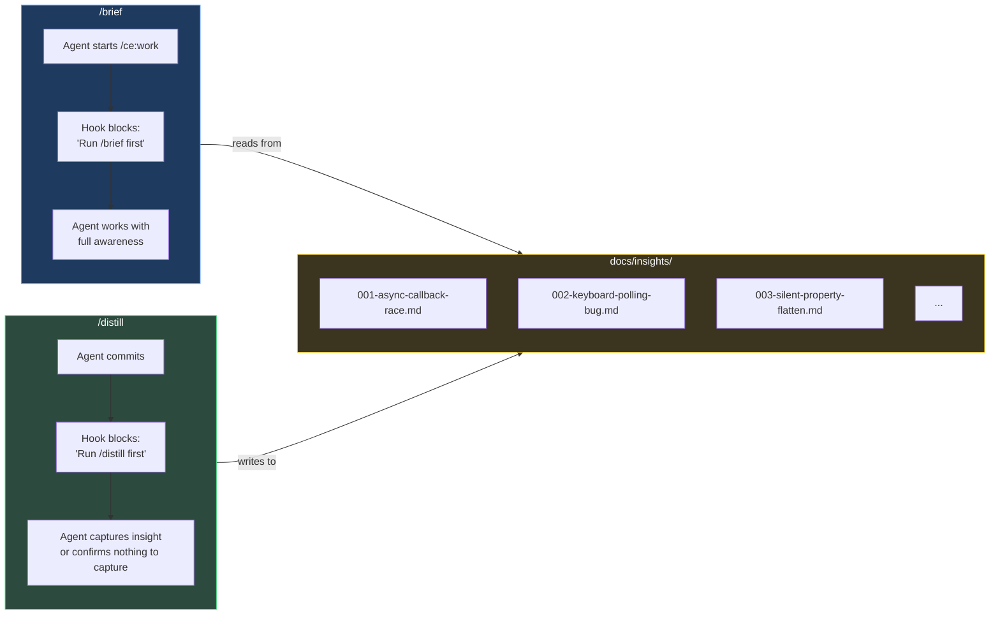
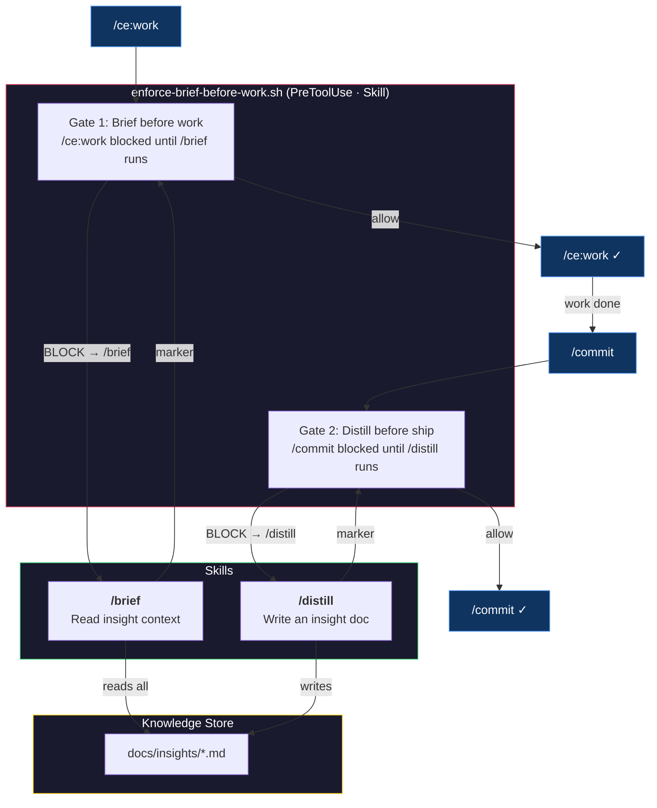
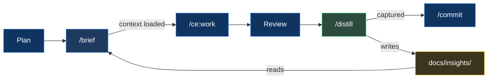

# Distill & Brief
### How We Stopped Losing What We Learned

---

> **The pitch:** Every engineering session produces hard-won knowledge. By the next session, it's gone.
>
> We built a system where AI agents *automatically* brief themselves before starting work and *automatically* distill findings before shipping. Two skills, one hook with two gates, zero human effort, minimum token burn.

---

## The Problem

AI coding agents have amnesia. Each session starts from zero.

When you spend 45 minutes discovering that an async callback silently drops valid data because of a stale request ID, that knowledge lives in the conversation. When the session ends, it evaporates. The next session hits the exact same wall.

```
Session 1: Debug for 45 min  -->  Find root cause  -->  Fix it  -->  Session ends
Session 2: Debug for 45 min  -->  Find root cause  -->  "...wait, didn't we do this before?"
```

Putting "remember to check past fixes" in instructions doesn't work. Humans forget to ask. Agents skip them, forget them, or deprioritize them under task pressure.

**We needed something stronger than instructions.**

---

## The Solution

Two directions. Two skills. One hook. One feedback loop.



### The Flow

1. **Agent starts a work session** with `/ce:work` — the hook blocks it: *"Run `/brief` first."*
2. **`/brief`** reads every insight doc in `docs/insights/` and surfaces the full context into the conversation. A marker file is created so the hook knows brief ran.
3. **Agent re-runs `/ce:work`** — hook sees the marker, consumes it, allows through. The agent works with full awareness of past root causes and gotchas.
4. **Agent finishes work and commits** — the hook blocks the commit: *"Run `/distill` before shipping."*
5. **`/distill`** captures any non-obvious findings (or the agent confirms nothing to capture). Marker created.
6. **Agent re-runs the commit** — hook sees the marker, consumes it, commit proceeds.
7. **`/brief`** is also available on-demand — any time, any session, just ask.

---

## Architecture



---

## Why This Approach

| Approach | Verdict | Why |
|----------|---------|-----|
| **Agent instructions** ("check insights before work") | Rejected | Instructions are suggestions. Agents skip them under task pressure. |
| **Existing plugin skill** (ce:compound) | Rejected | Spins up 5 parallel subagents, produces 150+ line docs. Overkill for our 40-line format. |
| **Auto-triggering skills** (no hooks) | Rejected | Claude's own docs say it "tends to under-trigger." Unreliable for enforcement. |
| **Non-blocking hooks** (inject context via systemMessage) | Rejected | Platform bug — non-blocking hook output is silently discarded. Tested, filed issues, waited. Doesn't work. |
| **Blocking hooks + custom skills** | Selected | Blocking hooks deliver their message to Claude. Block `/ce:work`, redirect to `/brief`, allow on re-run. Deterministic enforcement. |

### Design Principles

Only blocking hooks work reliably on the current platform. Each gate uses the same pattern: block the tool, redirect to a skill, skill creates a marker file (`touch`), tool re-runs and the marker lets it through (`rm`). No timestamps, no TTL — just file existence.

**One hook, two gates:**

- **Gate 1** (brief before work) — `/ce:work` blocked until `/brief` runs. Marker: `/tmp/.brief-gate`.
- **Gate 2** (distill before ship) — `/commit` blocked until `/distill` runs. Marker: `/tmp/.distill-gate`.

**Supporting hook:**

- **block-webfetch.sh** blocks `WebFetch` (no timeout parameter) and redirects to `gemini-grounding` or `curl`. Unrelated to the knowledge loop but same blocking pattern.

**Skills:**

- **`/distill`** uses dynamic context injection to show existing insights before the agent writes, preventing duplicates.
- **`/brief`** reads the full insight docs on demand, for any session, at any time.

---

## What an Insight Doc Looks Like

Lean. Focused. Under 60 lines.

```markdown
---
title: Seeker frozen — async pathfinding callback invalidation
date: 2026-03-31
phase: 5a
modules: [game/ai/seeker-fsm, game/engine]
tags: [async, pathfinding, race-condition, FSM]
---

## Problem
Seeker AI stops moving after 2-3 path requests. Visually frozen in place.

## Root Cause
Async pathfinding callback fires after FSM state transition.
New state's path request overwrites `latestRequestId`, but the old
callback still references the stale ID. Guard check silently drops
the valid path.

## Fix
Added `pendingPath: boolean` to SeekerAIInternalState. Set on request,
cleared on callback or clearPath(). All 4 FSM states guard on it.

## Key Insight
Any async callback that touches shared state needs a generation counter
AND a pending flag. The counter alone creates a silent-drop window.

## Also Applies To
Any future async system (sound loading, network requests) that uses
request-ID-based supersession.
```

---

## The Bigger Picture



Plan. Brief. Execute. Review. Distill. Commit. Repeat. Both gates are enforced by blocking hooks — the agent can't skip the briefing or the distill check.

> *Currently implemented with the [compound-engineering](https://github.com/nichochar/compound-engineering) plugin for Claude Code. The pattern is tool-agnostic — any workflow with plan/execute/review steps can plug in.*

---

## Platform Note: Why Blocking Hooks

Non-blocking hooks (`exit 0` + stdout) are silently discarded by Claude Code — the model never sees the output. This is a confirmed platform bug (7+ GitHub issues filed). We originally built `inject-insights.sh` (non-blocking, inject context) and `remind-distill.sh` (non-blocking, advisory). Both fired correctly but their output vanished.

**Blocking hooks** (`{"decision": "block"}`) DO deliver their message. So we switched to the WebFetch pattern: block the tool, tell Claude what to do instead, let it re-run. This turns a platform limitation into a feature — `/brief` runs as a full skill invocation with complete context, not a compressed summary injected via hook output.

---

## Appendix: Engineering the Skills

We ran `/distill` through Anthropic's [Skill Creator](https://github.com/anthropics/skills) — the meta-skill that turns skill development from vibes into engineering.

### A/B Eval Results

Both skills were optimized through the Skill Creator's description optimizer — 5 iterations each, 20 queries, 3 runs per query, 0.4 holdout split.

**`/distill`** — 3 test cases, 6 parallel subagents (with-skill + baseline for each):

| Metric | /distill | No Skill | Delta |
|--------|---------|----------|-------|
| **Pass Rate** | 100% (18/18) | 33% (6/18) | **+67%** |
| **Avg Tokens** | 26.6K | 28.4K | -1.8K |
| **Avg Lines** | 49 | 101 | -52 |

**`/brief`** — 3 test cases, 6 parallel subagents:

| Metric | /brief | No Skill | Delta |
|--------|--------|----------|-------|
| **Avg Tokens** | 43.2K | 36.2K | +7K |
| **Avg Lines** | 83 | 83 | 0 |
| **Avg Words** | 857 | 792 | +65 |

`/brief` shows minimal quality delta because it's a **read skill** — it surfaces existing insight docs. Without the skill, Claude still finds and reads `docs/insights/`. The value of `/brief` is **convenience** (one command vs manual discovery) and **hook-enforced auto-injection** before `/ce:work` — the blocking hook ensures it always runs. `/distill` shows the large delta because it's a **write skill** — the template enforces structure that Claude doesn't produce on its own.

The skills don't make Claude smarter — they make Claude **consistent**. `/distill` proves this with half the length and perfect structure every time. `/brief` proves a different thing: that the real value of a read skill is in the delivery mechanism (hooks), not the formatting.

### What the Baseline Gets Wrong

Without the skill, Claude produces good documentation but with:
- Inconsistent structure (5-7 sections with varying names vs exactly 5 every time)
- No YAML frontmatter (2 of 3 baselines skipped it entirely)
- 2x the line count (88-115 lines vs 47-53)
- No sequential file numbering
- Key Insights that restate the fix instead of generalizing

### Windows Bug: `select.select()` on Pipes

While running the Skill Creator's description optimizer, we hit `WinError 10038` — every trigger test returned 0%. Root cause: `run_eval.py` uses Python's `select.select()` to read subprocess pipes. On Windows, `select.select()` only works with sockets, not pipes. Every query silently failed.

**The fix:** Replace `select.select()` with a threading-based reader — a background thread does blocking reads from the pipe and puts lines into a `queue.Queue`. The main loop pulls from the queue with a timeout. Same behavior, cross-platform.

```python
# Before (Unix-only):
ready, _, _ = select.select([process.stdout], [], [], 1.0)

# After (cross-platform):
line_queue: queue.Queue[str | None] = queue.Queue()
def _reader():
    for raw_line in process.stdout:
        line_queue.put(raw_line.decode("utf-8", errors="replace"))
    line_queue.put(None)  # sentinel
threading.Thread(target=_reader, daemon=True).start()
```

Anthropic merged this same fix on March 13, 2026 in `claude-plugins-official`. The `anthropic-agent-skills` plugin hasn't picked it up yet — we applied it locally.
