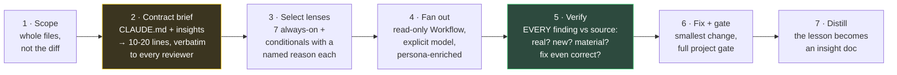
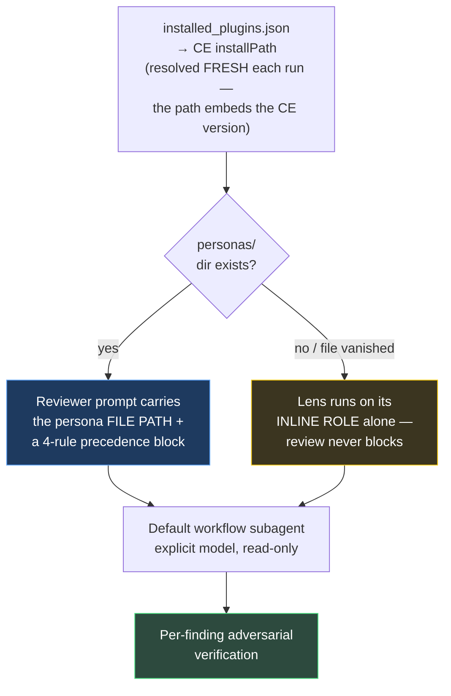

# Ultramode Code Review

**Status: DEPLOYED — flight-proven.** Installed at `~/.claude/skills/ultramode-code-review` (junction → this directory).

### A Code Review That Earns the Name

---

> **The pitch:** Most AI code review is a diff skim with confidence. This skill institutionalizes the opposite: read **whole files**, judge them against **this project's own** contracts, fan out specialized reviewer lenses, and — the part that makes it trustworthy — **adversarially verify every finding against source before acting on it.** Then fix what's real and distill the lesson so the next review starts smarter.

---

## The Problem

Four failure modes make ordinary review theater, and each one is load-bearing in this design:

1. **Diff-scoped reviews structurally miss interaction bugs.** A reviewer that only sees changed lines cannot catch a gap between new code and the unchanged code it talks to. The highest-value findings live in the cross-product nobody re-audits.
2. **Generic checklists produce noise.** Every codebase has deliberate choices (dense intent-comments, fail-loud guards, "wow over simplicity" in a UI layer). A reviewer that doesn't know them flags virtues as debt — and noisy reviews get ignored.
3. **A confident finding is a hypothesis, not a verdict.** Reviewers — agent or human — are confidently wrong often enough that folding findings on faith is dangerous.
4. **Convergence validates the finding, never the fix** (insight 001, learned on the maiden flight). N lenses that share an observation usually share the inference that produced its remedy — remedy-unanimity is one vote wearing N coats. Verification must judge the suggested fix as its own fresh hypothesis.

## The Cadence

Steps 2 and 5 are what separate this from a plausible-sounding review: the **brief** makes reviewers grade against the project instead of a generic checklist, and the **verify stage** means nothing is believed — or fixed — on a reviewer's word alone. Only **NEW × REAL × MATERIAL** earns a fix; everything else is advisory, and the false alarms get reported too (they're the review's integrity, not an embarrassment).

## The Reviewer Bench

**Seven lenses run on every review** — correctness, architecture/invariants, testing ("does it prove the right *value*?"), language idiom, simplicity + structural quality, api-contract, and **at least one adversary** whose job is to *construct* failure scenarios ("what wrong code passes the green suite?"). Conditionals — security, reliability, performance, data-migration, frontend-races, previous-comments, project-standards, agent-native — join only when the diff warrants, each with an announced one-line reason.

**Scrutiny scales with risk, never ceremony.** On a high-risk change the single adversary escalates to a diverse panel — one per failure-mode angle (boundary · temporal/state · numerical · invariant · caller-contract), each `adv-*` lens receiving its angle as an exclusive assignment — and the verify vote scales with it. N identical adversaries ≈ 1; N angles ≈ N.

## Where the Reviewers Live (the CE 3.14 story)

The lens definitions ride on the [compound-engineering](https://github.com/EveryInc/compound-engineering-plugin) plugin's reviewer personas — which, since CE 3.14, are **not spawnable agents**. CE deleted its `agents/` registry entirely; the old `agents/review/*.md` became persona prompt *documents* inside its ce-code-review skill. Passing any `compound-engineering:*` name as an `agentType` crashes every lens at launch — the failure that prompted this architecture (2026-07-09).

**Personas are enrichment, not a dependency.** Every lens has an inline role that works alone; the persona file — read by the subagent at runtime — adds CE's hunting techniques, anchored-confidence calibration, and ownership boundaries. The precedence block keeps CE's plumbing from fighting the review's contract:

1. **Output** — the review's structured schema wins over the persona's format (no CE-only fields, no artifact writes; `suggested_fix` + `why_it_matters` required on every finding).
2. **Scope** — holistic whole-file review overrides the persona's diff-scoped calibration.
3. **Confidence** — the persona's anchor rubric (0/25/50/75/100) *is* the schema's enum.
4. **Ownership** — "another reviewer owns this" applies only to lenses actually running; never defer a concrete finding to an absent owner.

## When CE Updates

The persona path embeds the plugin version (`…/compound-engineering/<version>/…`), so it rots on every update. The skill resolves it fresh each run; on a new CE version, the maintenance pass is:

1. Run the resolution snippet in `references/workflow-template.md` — it prints the new personas dir or `PERSONAS-UNAVAILABLE`.
2. `ls` the dir — CE renames personas across versions; null out vanished ones (the lens falls back to its inline role automatically).
3. If the roster shifted meaningfully, refresh the lens table in `SKILL.md` (roster as of 3.14.3 is documented there).
4. Worst case — CE restructures again entirely — the review still runs: every lens on inline roles. That's the design, not a degradation to apologize for.

## Flight Record

| | U13 review (2026-07-09) | Shakedown (2026-07-09, post-rewrite maiden flight) |
|---|---|---|
| Run | `wf_44cdf86d-b71` | `wf_53e05c8d-323` |
| Unit | The Back Nine U13 — re-entry gate, staleness clocks, tax sunset | Post-fold fixes — the echo whitespace budget + docs |
| Bench | 13 lenses incl. 3 conditionals + a **4-angle adversary panel** | 7 always-on lenses, single adversary |
| Agents | 44, zero crashes | 13, zero crashes |
| Funnel | 31 raw → 18 confirmed → **8 root defects fixed** · 9 advisories · 4 false alarms dropped | 6 raw → **0 confirmed** · 2 advisory roots filed · comment corrected |
| Headline | The senior-bonus sunset note asserted a re-pricing **the engine never performs** — a ratified spec premise refuted against source (insight 074) | 5 lenses converged on one finding AND one unanimous fix; **verification refuted the fix while confirming the finding** (insight 001) |

Both flights delivered the full loop: fix → project gate green (2,120 tests) → CI confirmed by explicit run id → distilled.

## Why This Approach

| Approach | Verdict | Why |
|----------|---------|-----|
| Built-in `/code-review` | Kept, for its job | A quick diff pass. Right tool for small changes; structurally can't see whole-unit interactions. |
| CE's `/ce-code-review` directly | Rejected as the cadence | Diff-scoped, own pipeline/output contract, CE-shaped autofix routing. Its *personas* are excellent — so this skill mines them instead. |
| Spawning CE reviewers as `agentType` | **Crashes** | CE ≥3.14 has no agent registry. This was the original design; its corpse is the landmine note in the template. |
| `/code-review ultra` (cloud) | Separate tool | Billed, user-triggered, GitHub-oriented. This skill is the local, run-anytime cadence. |
| **Persona-mining + inline-role fallback** | **Selected** | CE's depth when present, zero coupling when absent, and every finding verified before it's believed. |

## The Files

| File | Job |
|------|-----|
| `SKILL.md` | The law — the 7-step cadence, the lens roster, the calibration rules. What loads when the skill fires. |
| `references/workflow-template.md` | The ready-to-adapt Workflow script: schemas, persona precedence block, adversary-panel mechanism, resolution snippet. |
| `docs/insights/` | Lessons the flights paid for. `001` — lens convergence validates the finding, never the fix. |

## Upstream Credit

The reviewer personas this skill mines are the work of **[EveryInc/compound-engineering-plugin](https://github.com/EveryInc/compound-engineering-plugin)** (installed via the `every-marketplace`, CE ≥3.14). Their persona documents — the hunting techniques, the anchored-confidence rubric, the ownership boundaries — live at `<CE installPath>/skills/ce-code-review/references/personas/` and are read at review time, never copied into this repo. What's ours: the holistic cadence, the contract brief, the always-on adversary floor, the per-finding verify stage, and the enrichment-not-dependency architecture that keeps the review alive when CE restructures.

## Design Laws

- **Holistic beats diff-scoped** — read the whole unit; the bugs live in the seams.
- **Calibrate to the project** — the contract brief is mandatory; skipping it is the #1 cause of noisy reviews.
- **A finding is a hypothesis** — verify against source before touching anything.
- **Convergence validates the finding, never the fix** — verifiers judge `suggested_fix` as its own question.
- **Scrutiny scales with risk, never ceremony** — a small unit gets 7 lenses; a solver change gets a panel.
- **Personas are enrichment, not a dependency** — a vanished CE artifact degrades the review, never blocks it.
- **Explicit model on every spawn** — the fan-out never silently inherits the main loop's tier.
- **Report the false alarms** — what verification threw out is part of the review's integrity.
