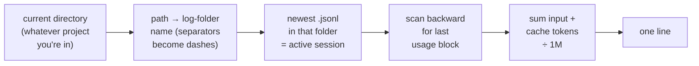

# /window

A one-line context-window check, built for the phone. Ask how full the window is, get a single line back — never the wall-of-text `/context` table you can't scroll on a phone.

## What You Type

Either form fires it:

- **`/window`** — the explicit command.
- **Plain words** — "how's the window?", "how much context left?", "are we running low?" (model-invocation is on, so natural phrasing triggers it too).

## What You Get Back

One line. Nothing else:

```
Context: 114,599 / 1M = 11.5% — plenty of room
```

The tail is a headroom read against the 70% wrap line (the point where it's worth starting a fresh terminal):

| Usage | Read |
|---|---|
| under 50% | `plenty of room` |
| 50–70% | `getting up there — N% to your 70% wrap line` |
| 70%+ | `past your 70% wrap line — worth starting a fresh terminal` |

## Why Not Just `/context`

`/context` dumps a ~300-line category table the instant it fires. On a phone you can't scroll past the first screen, and a summary-after-the-fact doesn't un-dump it. `/window` is the inversion: the parser runs on the PC, and **only the one line reaches the phone**.

The one thing `/window` can't do is the per-category breakdown — it's a total. If you actually want to know *what's* eating the window, that's the single case where `/context` earns its dump; type it yourself.

## How It Works Under the Hood

The skill's `!` exec runs `window.mjs`, which self-locates the current session with zero configuration — so it works in **any** project, not just this one.



The last assistant message's `usage` is what the API saw on input for the current turn — i.e. the live context size. It matches `/context` within ~2 points (the drift is a few messages of conversation between the two reads).

**Caveat:** it always grabs the *most-recently-modified* log in the current project's folder. In a live session that's the one you're sitting in (real-time). Run it in a project with no active session and you'll get a stale reading from the last one — which won't happen when you actually fire it mid-work.

## Installation

`SKILL.md` + `window.mjs` in this directory are the source of truth, junction-linked to `~/.claude/skills/window/` so Claude Code picks it up automatically — edits here go live with no sync step.

> **Windows install gotcha:** `ln -s` via git-bash **silently copies** instead of linking unless the shell is elevated (MSYS default — and it returns success, so you won't notice the stale copy). True symlinks need Developer Mode/admin. The no-elevation answer is a directory **junction**: `New-Item -ItemType Junction -Path <link> -Target <source>` in PowerShell. It points at the same folder, so edits propagate; it just shows as a plain `d` directory in `ls` rather than an `l` symlink.
