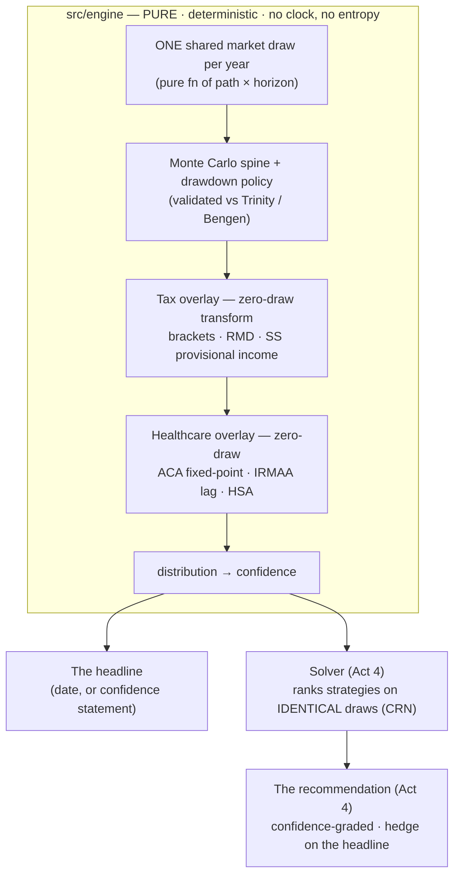

# The Back Nine

> **The fuck-off date — computed.**

A **personal** retirement and tax-strategy co-pilot for a married couple. It answers one question — *"Can we walk away, and how do we do it best?"* — as a calm, plain-language confidence statement, then recommends a confidence-graded strategy to get there.

The name is the metaphor: the **back nine** is the second half of the round. Every shot counts more, the scorecard is mostly written, and you're playing for the finish. This is the tool for those holes.

**It is never sold.** Briggsy's laptop plus a handful of financially-literate friends, betting real retirement money. Not a commercial product — and that *raises* the bar rather than lowering it. There is no regulatory net, no terms-of-service disclaimer to hide behind, no "consult a professional" escape hatch. Friends act on this answer with *less* protection than a commercial tool would give them, and they trust it *more*. So the entire load transfers onto two things: **honesty** and **engine validation**. Both get stricter.

**The cardinal rule: calm-but-wrong is the sin.** A confidently-stated wrong recommendation is worse than no tool at all. *"It's just for friends" never excuses it.*

---

## The thesis, in three beats

Built in order — this is the whole arc, beat by beat:

1. **Tell me where I stand.** *"Your essentials are safe in 10 of 10 futures; your full lifestyle holds in 7 of 10."* A distribution of futures, rendered as a number a human can feel — not a single false-precision dollar amount.
2. **Then: here's what we'd do about it.** A recommended, confidence-graded strategy over two coupled tax controls — withdrawal **sequencing** and Roth **conversion** — that funds your budget the tax-smartest way. The full reasoning is always one tap down, never forced on you.
3. **You stay the pilot.** Safety is the default floor. Above it, *you* pick the goal — leave more or pay less tax (a third, *live bigger now*, is specified but [not yet built](docs/backlog.md#the-third-goal--live-bigger-now-doesnt-exist)) — and every recommendation wears its own hedge on the headline.

*v1 limits, named rather than hidden: beyond the unbuilt third goal, the recommendation reaches only households where everyone has already retired, so a still-working household gets its date but no strategy yet. Both are open entries in [the register](docs/backlog.md): "The third goal — 'live bigger now' doesn't exist" and "Date-route recommend-second parity — the working household gets no strategy at all".*

### What it tells you first depends on where you are

- **Not yet retired?** The headline is **the fuck-off date**: two confidence-graded, work-optional dates (one that protects essentials, one that funds your full lifestyle), found by running the same engine against every possible quit date and seeing which ones hold. It models the home stretch into retirement — a bounded on-ramp, *not* a FIRE calculator. v1 projects your stated savings plan honestly; it doesn't pretend to optimize it.
- **Already retired?** The headline is the calm **confidence statement** — the plain-language reading of where the math says you stand.

One product, one engine, two voices.

---

## How it works

The Back Nine is a **local-first PWA**. No backend, no account, no cloud. Your financial picture is entered by hand, encrypted at rest in your browser (AES-GCM under a PBKDF2-hardened key), and never leaves the device. The survivor's backstop is **live**: the guided first-Save ceremony sets a daily passphrase plus a second, memorable **recovery passphrase** (either spouse's door back in) and walks you through a mandatory encrypted export — and the full return arc (unlock, forgot-passphrase recovery, restore-from-backup, view-only second tab, edit-and-re-save) ships with it.

The engine is the heart, and it is held to a deliberately severe standard.



A few of the contracts that make the answer trustworthy:

- **One shared market draw per year, common across every account bucket** (pre-tax / Roth / taxable / HSA) — buckets differ only in *tax treatment*, never in luck. That's a variance-reduction trick called Common Random Numbers (CRN), and it's what lets the solver rank candidate strategies on *identical* futures: the winner won because it was better, not because it drew a kinder market.
- **Every overlay reduces byte-identically to the validated *spine* when it's off** — the spine being the plain Monte-Carlo decumulation engine underneath. Turn off the four overlays (tax, healthcare, the earned-income bridge — salary netting the withdrawal down in the working years — and the accumulation phase, which counts as off only when it is absent, never merely zeroed) and it reproduces its reference cases from the classic withdrawal studies — Bengen's 4% rule, the Trinity Study — bit-for-bit on the same seed. The trustworthy core is never silently perturbed.
- **Golden numbers are derived independently, never by the engine's own formula.** A fixture the engine computes against itself proves the code *runs*, not that it's *right*. Trinity, Bengen, the tax math, and the ACA/IRMAA expected values are each derived by a separate path (hand / spreadsheet / published calculation).
- **No in-range default fallbacks.** A missing input is a loud sentinel that throws — never a plausible-looking `?? 0.04` that makes "we don't know" indistinguishable from "we measured." Inside a tax or ACA fixed-point, that ambiguity inverts answers.
- **Every dated tax/health figure lives in one canonical, year-keyed table** that the engine, the plan, and the tests all read. A number is never re-typed — a shape test (`src/engine/constants/__tests__/constants.shape.test.ts`) fails if a distinctive figure appears anywhere in `src/` outside that table. The ACA legislative entry re-verifies on every build — it can flip the entire pre-65 model, and a stale figure there is a quiet catastrophe.
- **A strict CSP ships via HTTP response headers** (`script-src 'self'`, no inline, no eval, `connect-src 'self'`), enforcement-tested in real Chromium — the in-session decrypted model is guarded against injected page scripts.

The recommendation layer is gated *structurally*: the solver cannot speak until a validation harness — an independent oracle that checks it actually found the optimum, stability checks that the ranking doesn't flip run-to-run, and grade calibration on seeds it never trained against — mints a pass-token the solver literally cannot run without. `solve(token, input)` takes that token as a required parameter, so a recommendation without it is a compile error, not a matter of discipline.

---

## Where the build is

The MVP is four acts. Each is a real milestone with its own plan, gates, and verification.

| Act | What it is | State |
|---|---|---|
| **1 — The Engine** | The deterministic engine + tax & healthcare overlays + accumulation projection + the date-search + the encrypted store | ✅ **Complete, reviewed, pinned** |
| **2 — Where You Stand** | The guided account-level intake → the headline that adapts to where you stand (the date, or the confidence statement) → confidence viz → first Save | ✅ **Complete** (2026-07-02) |
| **3 — The Levers You Hold** | The budget builder + manual sequencing & Roth controls + healthcare-cost screens + returning-user re-entry (your saved plan, re-derived not replayed) | ✅ **Complete** — U9–U13 shipped |
| **4 — The Recommended Route** | The validation harness → the solver → the recommendation surface | ✅ **Complete** (2026-07-27, U17 closed at S6) — per-unit status lives in [the roadmap's You-Are-Here table](docs/roadmap.md#the-you-are-here-table), which is the authority |

> ⚠️ **Do not re-type per-unit build status in this table.** Three of these four rows were false on 2026-08-01 — Act 2 read "In progress" and Act 3 "Planned" long after both completed, and Act 4 claimed only U14 had shipped — while a prose paragraph in *this same file* correctly described U15/U16/U17 work as shipped (that paragraph was itself a hand-typed copy of the roadmap's per-unit detail, and on 2026-09-06 it was folded into the pointer below for the same reason). Nothing gates this table (`verify:doc-stats` gates the test count, the register's open count, the insights index, every code citation and every insight's four required sections — not build status), so every hand-typed status here is a copy that rots silently. Point at the roadmap instead.

Act 1's engine is pinned against primary sources: every dated tax and healthcare figure carries an IRS / CMS / HHS / SSA / eCFR citation (and a directional-until-pinned flag where one isn't yet locked), and cohort mortality is re-derived 1:1 from the SSA 2024 Trustees-Report cohort life tables (Alternative 2) for the primary household's birth cohorts (male 1969, female 1972). Every household reads that one pair of curves today. Per-person birth-year keying is not built, so an older household's longevity is slightly overstated (conservative) and a younger one's slightly understated (optimistic). The guided intake delivers a **live, provisional Monte Carlo reading that sharpens as you answer each question**, proven end-to-end in real Chromium under the enforced CSP.

The engine and intake carry **3675 tests across 186 files**, all green, alongside lint, bundle-budget, ACA-freshness, state-tax-freshness, browser-CSP, and real-browser vertical-fit gates. Per-unit feature detail lives once in [the roadmap's You-Are-Here table](docs/roadmap.md#the-you-are-here-table) — this file never enumerates it.

---

## Stack

React 19 · TypeScript 5.9 (strict-plus) · Vite 8 · Vitest 4 · `fast-check` property tests · `motion@12` · `comlink` to run the Monte Carlo engine in a Web Worker, off the main thread · `idb` for the encrypted IndexedDB vault (WebCrypto is called from the main thread — the U4 KDF-location spike in `e2e/vault.spec.ts` measures the 600k-iteration derive not blocking it in Chromium, so no crypto worker was built) · `zxcvbn-ts` for the passphrase-strength floor. Self-hosted fonts (Fraunces + Source Sans 3). pnpm. No Prettier; ESLint enforces the layer boundaries and engine purity.

The codebase is layered with hard, lint-enforced import boundaries:

```text
engine · crypto · store · intake · budget · viz · ui · shared
```

`src/engine/` is **pure** — a deterministic function of `(params, seed)`. It reads no clock, no entropy, no environment; `Math.random`, `Date`, `crypto.getRandomValues`, `performance`, and `process` are all lint-banned inside it. The seed is injected by the caller.

---

## Running it

```bash
pnpm install
pnpm dev            # Vite dev server — the app IS the intake flow
```

Quality gates (all run in CI):

```bash
pnpm typecheck      # tsc --noEmit
pnpm test           # vitest run
pnpm lint           # ESLint — layer boundaries + engine purity
pnpm build          # typecheck + production build
pnpm verify:bundle  # initial-JS byte-budget sentinel (≤ 300 KiB entry)
pnpm verify:aca     # fails if the ACA enhanced-subsidy status is stale/unconfirmed
pnpm verify:state-tax  # fails if a priced state's {NC, PA, FL} tax record is stale/unconfirmed
pnpm verify:csp     # real-browser CSP enforcement walk in Chromium + the two @cross-browser vault arms again under WebKit (Playwright)
pnpm verify:fit     # real-Chromium vertical-fit + chart-text + phone intake-fold gates — the one-frame fit law + every band / ladder / TwoFutures word legible + the intake step's scroll-reset / editor-heading / nav-yield laws, on the dev server
pnpm verify:fit:rv  # real-Chromium RecommendationViz chart-text gate — the fourth chart on its own serialized solve harness (~6–8 min per arm)
pnpm verify:doc-stats  # the doc numbers with a single home (test count, register count, insights index) + every code citation resolves + every insight carries its four sections
```

---

## Privacy & license

Your data is entered manually, encrypted locally, and never transmitted — there is no server to transmit it to. This is a personal tool, **not for sale and not licensed for use**. It is published here as part of an AI-assisted engineering portfolio, not as a product or as financial advice.

---

## Documentation

The full index and reading map is [`docs/README.md`](docs/README.md). The three essentials:

- **[`docs/product.md`](docs/product.md)** — the *why* + *what*: the thesis, the cardinal rule, the requirements ledger.
- **[`docs/roadmap.md`](docs/roadmap.md)** — *where we are* + *what's next*: the four acts and the You-Are-Here status table.
- **[`docs/architecture.md`](docs/architecture.md)** — *what you must never break*: the load-bearing engine invariants.

Build conventions + landmines live in [`CLAUDE.md`](CLAUDE.md); the live work queue is [`TODO.md`](TODO.md).
