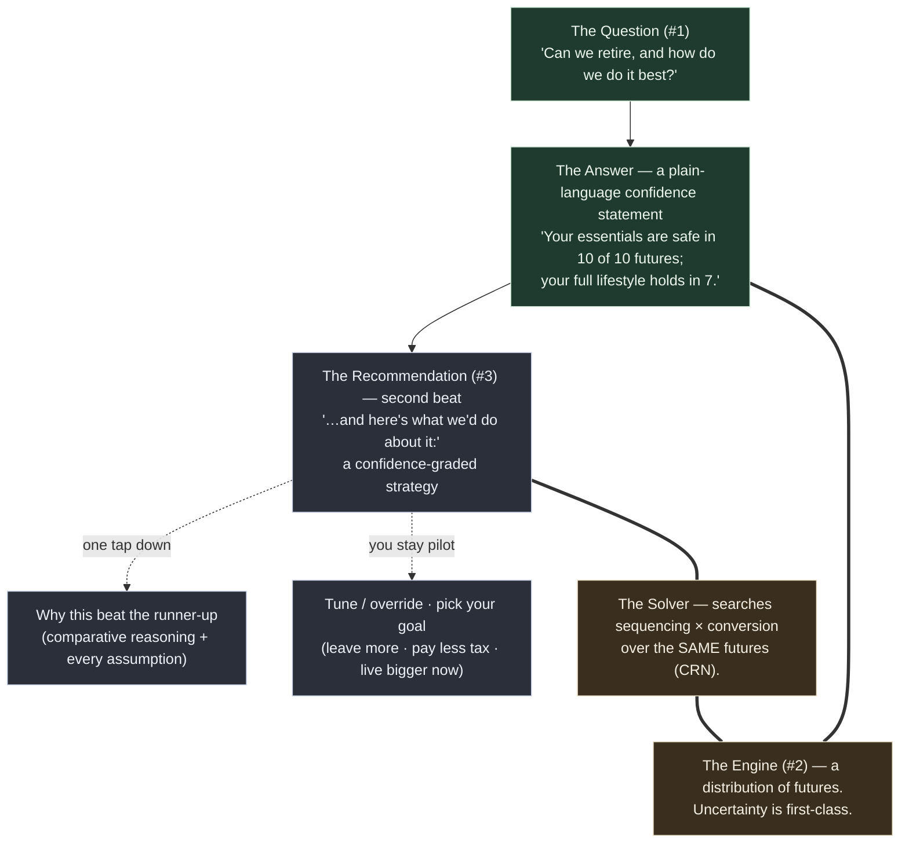

# The Back Nine — Requirements (v2: a personal tax-strategy co-pilot)

> **Thesis reset, 2026-06-04.** This doc was rewritten from its v1 commercial / single-Roth-lever / calculator-never-a-verdict framing to the direction locked in `../plans/direction-reset-2026-06-04.md`: a **personal tool** (Briggsy's laptop + a few friends, never sold) that **recommends** a confidence-graded strategy over a user-built budget. The regulatory guardrails relaxed to wording; **the load transferred to honesty + engine validation, which got stricter.** The v1 regulatory analysis is preserved as archive-as-rationale in `../research/foundation-findings-2026-06-03.md` §Strand 3, in case of future re-commercialization.

> **Foundational expansion, 2026-06-08 (Briggsy ATC; folded 2026-06-10).** The v2 thesis was **decumulation-only** — the engine started at a given `initialPortfolio` and drew down; while scoping U3·M5 (HSA) we verified against source that it modeled **zero contributions to any bucket**. This amendment extends the thesis to the **full projection (accumulation → decumulation)**: the pre-retirement saving phase is modeled, and the accumulation-side magic moment is **the fuck-off date** (the *work-optional* date), delivered as **two confidence-graded dates**. The expansion is **additive**: requirements **R26–R39** land in the new "Accumulation → the Fuck-Off Date" section below; the only edits to pre-existing text are the two superseded single-spend on-ramp claims — the Success-Criteria ~3-minute single-total-spend bar and R5's struck single-spend sentence, both per R35. The decumulation strategist remains the center of gravity — accumulation is a **bounded near-retirement on-ramp** in its service, not a FIRE calculator. Origin (6-persona reviewed): `the-fuck-off-date-requirements.md`. The re-plan carrying per-unit detail: `../plans/2026-06-08-001-feat-fuck-off-date-accumulation-plan.md`.

## Problem Frame

Retirement / wealth / tax planning is a domain everyone makes feel **hostile** — dense screens, intimidating setup, fifteen numbers where one would do. The incumbents don't lose on features; they lose on **consumability** (and on account-sync/data-plumbing breakage — the verified hardest incumbent failure, which our **manual-first, local-first** design sidesteps). That consumability thesis is evidence-verified (`../research/foundation-findings-2026-06-03.md` §Strand 1).

The Back Nine is built for **Briggsy and a handful of friends** — financially literate people betting **real retirement money** on the answer. It is **not for sale**, which is exactly what frees it to do the thing the commercial constraints forbade: not just *calculate*, but **recommend** — propose a tax-smart withdrawal + conversion strategy that funds your real budget and protects your spouse, and let you accept, tune, or override it. Because friends act on it with real dollars, the cardinal sin is **calm-but-wrong**: a confidently-stated wrong strategy is worse than no tool. **UX *and* correctness are the product**, not polish on top of it.

## The Product Model

The spine answers one question, then — **second beat** — proposes what to do about it, with the full reasoning one tap down. Safety is the default floor; above it, **you pick the goal**. Complexity is disclosed progressively; that restraint *is* the experience.

**face (#1) ← engine (#2) ← recommendation (#3):** the question is the face; the longevity+tax engine is the only thing that can answer it; the **solver** proposes the strategy that improves the answer. Same principle governs input and output: *answer first, recommendation second, precision/reasoning on demand.* The recommendation **never contradicts** the spine answer — they speak the same metric (see R21).

**The state-adaptive first answer (added 2026-06-08):** the magic moment **adapts to user state** (R29). A **not-yet-retired** household leads with **the fuck-off date** — *"when is work optional?"* — delivered as the **two confidence-graded dates** of R27/R28 (floor + lifestyle), computed by sweeping the household work-stop date-offset over the *same* confidence engine. An **already-retired** household keeps the spine confidence statement above as its lead, unchanged. Same calm voice (R11), **one intake flow for both states** (R35) — only the *lead answer* adapts, never the intake.

## Requirements

**The Confidence Spine (the first magic moment)**
- **R1.** The product answers one primary question — *"Can we retire, and how do we do it best?"* — as its central, first-class surface. Everything else is subordinate to it.
- **R2.** The answer is a **plain-language confidence statement** that leads with the verdict in human terms, framed for the household and honest about the survivor case. It **separates survival from lifestyle** where the budget supports it (*"essentials safe in 10 of 10; full lifestyle holds in 7 — in the other 3 you'd trim discretionary, not go hungry"*). Borderline/off-track answers use Kitces's **"probability of adjustment"** framing — never "failure" — expressed as the dollar move that keeps the plan safe. No histograms, no bare percentages-as-jargon, no dashboard on the primary surface. Meaning must never depend on color alone.
- **R3.** The engine models a **distribution of possible futures** (uncertainty is a primary input, not bolted on), not a single deterministic projection. The confidence statement is the humanized reading of that distribution.
- **R4.** After the verdict, all supporting detail — the range, the assumptions, the math, and the recommendation's reasoning — is reachable **on demand but never shown unsolicited** on the first surface.

**The On-Ramp (input)**
- **R5.** First contact is a **guided, one-question-at-a-time intake** (calm, advisor-style). ~~The **fast first answer runs on a single total spend figure**~~ *(superseded 2026-06-08 — see R35: the account-level guided setup is the on-ramp for both user states, the answer surfacing and sharpening during the flow; the spend figure survives as a collected input)*; the itemized budget (R20) is the *deepening*, not the on-ramp — the calm first answer is never gated behind a full budget. Never a wall of forms.
- **R6.** A **power-user escape hatch** lets a user set any assumption precisely at any point, without walking the guided path.
- **R7.** **Every assumption the flow makes on the user's behalf is visible and editable on demand** — *and this gains weight under recommend-second:* a recommended strategy must expose its inputs **and its reasoning** for the user to trust and approve it.
- **R8.** **Input mirrors output:** the user reaches a caveated answer quickly, then *sharpens*. Each piece of added precision **sharpens the confidence band** — it *narrows* on added precision and *shifts honestly* on a corrected value (it does not only ever narrow). Refinement is rewarding, never punished for honesty.

**The Budget (the spending model — NEW)**
- **R20.** Spending is expressed as an **itemized, categorized budget** the user builds: **essentials vs discretionary**, with **time-boxed line items** (e.g. travel for the first N years then stops; the pre-65 healthcare gap from retirement age to 65). Structurally, **essentials *are* the safety floor; discretionary *is* the surplus** the strategy optimizes the funding of (R21). The user expresses *what they want*; the solver finds the tax-smart way to *fund* it. Spending shape (front-loaded "go-go years" vs level) is **user-set, never solver-recommended** — the tool shows honest consequences, it does not tell you how to live.

**The Strategy Engine — recommend-second co-pilot (the differentiator)**
- **R9.** The product **proposes a recommended strategy** over **two coupled, solver-optimized controls** — **withdrawal sequencing** (which account funds each year's spending) and **Roth conversion** (amount + years) — to fund the budget the tax-smartest way. *(Supersedes v1 "exactly one Roth lever." Sequencing is the more universal control; the survivor's tax cliff remains the emotional headline story.)*
- **R10.** **Recommend-*second* flow:** (a) the spine confidence answer **first** (the magic moment, unchanged); (b) **then** *"here's what we'd do about it"* — a proposed, confidence-graded strategy; (c) the **comparative reasoning** one tap down; (d) the user **tunes / overrides / re-picks the goal**, both futures updating. *(Supersedes v1's "surface → two futures → tune"; agency flips from user-pulls-blind to system-proposes / user-approves.)*
- **R11.** The recommendation is **calm and invited into the second beat — never a nagging alert, badge, or engagement bait.** Calm is never traded for engagement (the consumability wedge survives the posture change).
- **R21.** The objective is **lexicographic.** **Tier 1 (always, the floor):** never drop below the survival floor — essentials covered across the futures, spoken in the spine's voice. **Tier 2 (the user chooses):** what to do with the surplus — *leave more · pay less tax · live bigger now.* **The objective metric is the same quantity as the headline metric**, so a recommendation can never recommend a move that worsens the hero number it just showed. When survival is a given (over-funded household), the headline honestly **pivots** to the chosen surplus metric (*"you're safe either way — this keeps more from the IRS / funds more travel"*).
- **R22.** Every recommendation **grades its own confidence** — *robust-across-all-futures ("just do it")* vs *coin-flip ("here's what it hinges on")* — and **the hedge rides on the headline**, never buried in tapped-away math. Depth-on-demand must not invert into certainty-on-top / caveats-hidden-below.
- **R23.** The recommendation's depth is **comparative** — *"why this strategy beat the runner-up,"* retaining and surfacing the runner-up — not a formula dump.

**Healthcare (income-dependent cost — NEW)**
- **R24.** The model accounts for **income-dependent healthcare across the Medicare line**: **pre-65 ACA marketplace cost** (a Premium Tax Credit that scales with MAGI — **2026 base case = the 400% FPL cliff is back**; enhanced subsidies expired 12/31/2025 and are unre-enacted as of 2026-06-04; expose "enhanced" as a scenario toggle and **re-verify at every build**); **post-65 IRMAA** (a Medicare surcharge on a **2-year MAGI lookback**, a *different* MAGI definition, hard per-person cliffs); and **HSA** as a fourth account bucket (covers out-of-pocket + 65+ Medicare premiums tax-free, **not** ACA premiums; Medicare enrollment ends HSA contributions). Healthcare **couples into the strategy objective** — a conversion that torches an ACA subsidy or trips an IRMAA cliff must be *seen*, not silently optimized over. Numbers live in `../research/foundation-findings-2026-06-03.md` §Strand 5 + `../research/pre65-healthcare-aca-hsa-2026-06-04.md` (directional until pinned).

**Voice & Honesty** *(the regulatory section is gone; honesty is what's left, and it's stricter)*
- **R12.** The product **does make recommendations** now — but **every recommendation is probabilistically framed and confidence-graded.** Certainty language stays banned (*"guaranteed / optimal / locks in / you will save"*). String-level enforcement **flips** from *"ban the imperative"* to **"require the hedge on the headline"** (a positive/require lint, not a ban-list — see the engine note on copyGuard). *(Supersedes v1's "never issues individualized directives.")*
- **R13.** An **optional** in-product honest-limits note (*"this is a model — validate big, irreversible moves with a pro"*) — kept on **honesty** grounds for friend-users, **no longer a regulatory Terms requirement.** No Terms/License, no RIA entity (commercial artifacts, removed).
- **R14.** Scary, complex truths are stated in **plain human language without being dumbed down** (*"9 of 10 versions of your future,"* not "85% Monte Carlo success").
- **R25 (the cardinal honesty requirement).** **Calm-but-wrong is the cardinal sin, and the bar RISES for a recommender** — a wrong recommended strategy costs real dollars. *"It's just for friends" must never soften validation*: friends risk identical real money with **less** protection and trust the tool **more**. The removal of the regulatory net is a **load transfer onto correctness + confidence-grading**, never a loosening.

**Trust & Data Safety** *(relaxed from positioning pillars to personal hygiene — re-justified on engineering grounds)*
- **R15.** No user-facing **marketing privacy claim** is required or made (personal tool, no audience to make it to). The underlying honesty — *don't misrepresent what the architecture does* — survives.
- **R16.** The financial picture is **encrypted at rest** and **local access is guarded** (a lock for a shared laptop) — basic hygiene for real financial PII, **independent of any marketing claim**. The crypto bar may be *reasonable* rather than maximalist (PBKDF2-600k is acceptable; the maximalist Argon2id justification is no longer load-bearing).
- **R17.** **Survivor recovery is load-bearing** — the product exists for the survivor case. A client-generated **recovery phrase + mandatory export** and the **two-person / shared-household** recovery posture stay; only the "trust-building ceremony" framing relaxes.
- **R18.** The user can **export and back up their own data** — for **durability** (no single point of total loss); the anti-vendor-lock-in framing is moot for a personal tool.
- **R19.** Manual-entry inputs are **sanity-checked**: impossible/incoherent inputs are caught calmly inline, never producing a silently broken or falsely confident answer.

**Accumulation → the Fuck-Off Date** *(added 2026-06-08 — the full-projection expansion; folded from `the-fuck-off-date-requirements.md` 2026-06-10 with the noted folding-time corrections. The re-plan carrying the per-unit engineering detail: `../plans/2026-06-08-001-feat-fuck-off-date-accumulation-plan.md`.)*

- **R26.** The tool answers **"when is work optional?"** — *the fuck-off date* is the product framing for this answer, **delivered as the two dates of R27** (never a single number). It is computed by **sweeping the household work-stop date-offset `Y`** (years from now) over the existing confidence engine — project accumulation to each candidate offset, decumulate from there, read the confidence — **not** a new engine. *(Folding-time correction: the origin phrased the sweep as over "retirement age" — the engine's per-person model **cannot express a household age**, so the axis is the household date-offset `Y`: each **still-working** person's `retirementAge` becomes `currentAge_i + Y`; an **already-retired** member keeps their entered retirement age **verbatim**, never un-retired into phantom income; an **all-retired household never enters the sweep** — it short-circuits to the spine-first answer, and the date-search rejects it at its own input gate.)* The search is **non-monotone-robust**: because healthcare turns on at the tested date (R33) and the ACA 400%-FPL cliff is a documented engine discontinuity (insight 013), a *later* work-stop date is **not** guaranteed safer. So the search **exhaustively evaluates every candidate offset across the bounded on-ramp window** (≤~11 offsets — cheap) and reports the earliest offset at which a date's condition holds **and keeps holding for every later in-window offset**, disclosing any non-monotone region — never a monotonicity-assuming bisection that could return a **false-earliest** date (the calm-but-wrong sin, R25).
- **R27.** The answer is **two dates**, from the locked lexicographic objective (R21), both judged at the **same confidence bar** — differing only in *which* budget: (a) the **floor date** — earliest offset *essentials* hold across the futures (the literal "don't HAVE to work" line); (b) the **lifestyle date** — earliest offset the *full* (essentials + discretionary) budget holds **at that same confidence bar**. *(Folding-time correction — the one-sided window-FLOOR semantic replaces the origin's "either date may already be in the past": the sweep evaluates `Y ≥ 0` only, so the engine produces **no evidence about the past**. For an over-funded household a floor-confirmed `Y == 0` date means **"work-optional AT today"** — fully evidenced, every later in-window offset evaluated — never a claim about when freedom *began*.)* In the degenerate single-total-spend budget the two dates coincide; the itemized budget (P3·U9) splits them. `floor ≤ lifestyle` is an *expected* property, **not** an engine assertion — the 100%-FPL PTC eligibility floor can legitimately invert it (less spending → lower MAGI → below the floor → PTC = 0 → discontinuously worse cost), which is correct, surprising-but-honest engine output that rides a disclosure.
- **R28.** Both dates are **confidence-graded, never hard lines.** They incorporate accumulation-phase (runway) market uncertainty, so the output expresses the date↔confidence tradeoff ("lifestyle-free in ~3 years at 8/10, or year 5 for 9/10"). A single deterministic date is a banned calm-but-wrong simplification (R25). The date is graded under the **recommended (or user-selected) draw-down strategy** and **re-grades whenever the user overrides** sequencing/conversion (symmetric with R10's both-futures-update) — a date silently assuming a draw-down the user won't follow would itself be calm-but-wrong.
- **R29.** The framing **adapts the magic moment to user state**: a not-yet-retired user leads with the date ("you're ~N years out / free today"); the existing spine confidence statement (R2, in its R10 recommend-second position) stays the lead for an already-retired user. Same calm voice (R11), pointed at the date. *("Fuck-off date" is the working/product name; the user-facing readout holds the calm advisor voice — confirm the in-product label at design time.)*
- **The no-date outcome (R25's honesty surface, extended).** For a borderline household, every in-window offset can fail the bar. The master records the first-class **"no work-optional date within the ~N-yr window"** outcome — never "never free," never silently the window-top offset, never a crash — surfaced as a defined answer in the calm voice with the per-offset picture available. Its sibling: a date confirmed only **at the window edge** (zero later offsets of keeps-holding evidence) is reported **with an explicit unconfirmed-tail disclosure** — folding it into "no date" would be pessimistic-false; crowning it silently would be unconfirmed-optimistic. Honesty in both directions; the pessimistic direction is *designed*, not accidental.
- **R30.** The tool models the **pre-retirement accumulation phase**: from current balances, it projects each account forward through continued **contributions + market growth** to the work-stop date under test, producing the retirement-onset balance + basis per bucket the existing decumulation engine consumes.
- **R31.** Contributions are **per-account, flat in real terms**, and **stop at the work-stop date under test** (stop working → stop contributing). **Employer match** on workplace accounts is captured (free money that materially moves the date; match is **pre-tax even on a Roth 401k** — the default rule; a Roth employer match is an optional plan feature, deferred). No raise/promotion curve in v1.
- **R32.** v1 **projects** the user's stated savings plan; it does **not optimize** accumulation. Solver controls stay **decumulation-only** (sequencing + conversion). Contribution-strategy optimization (e.g. traditional-vs-Roth allocation to pull the date in) is a **future version**. *Rationale: a **sequencing call** — v1 ships the decumulation solver first; the accumulation lever waits its turn. (Traditional-vs-Roth contribution allocation is genuinely a **tax optimization** the solver could own — like Roth conversion — not purely a user "saving shape" à la R20's spending shape; so the v2 promotion is deferred-for-sequencing, **not** an off-thesis exclusion. The amount/shape you save stays yours, R20-style; the tax-bucketing of it is solver-eligible.)*
- **R33.** **Healthcare modeling is OFF during accumulation** (working years = employer plan) and switches **ON at the work-stop date under test** — each candidate is "stop earned income *here* → ACA (pre-65) / IRMAA (post-65) costs begin *here*." *(Folding-time correction — the real mechanism, superseding the origin's "the existing overlays key off the tested retirement age": the engine's healthcare gate is the **biological-65 split + a per-year premium stream — there is no retirement boundary anywhere in the overlay**. Healthcare-on-at-the-tested-date is therefore the date-search **constructing per-candidate cost streams**: premium/SLCSP/out-of-pocket-medical streams zero for working years `[0, Y)` and the entered age-anchored values from `Y`; Medicare/IRMAA onset **per-person** `= max(65th sim-year, work-stop)` over the living set; plus a conservatively-high **working-year IRMAA-MAGI additive override** so the 2-year lagged read never finds a falsely-$0 working year. The streams ARE the gate — new caller-side work, not an existing engine knob.)*
- **R34.** Accumulation **inherits the engine invariants**: accumulation and decumulation **share ONE continuous absolute-year market-draw timeline** (a single `buildDraws` stream indexed from `currentAge` — **never** a separate pre-phase draw stream), so candidate offsets see **byte-identical** year-*t* returns in their overlapping years and the date-search ranks them on **identical futures** (CRN). A separate-stream handoff would silently turn the ranking from signal into luck — the same hazard as the forbidden per-bucket draw. Consequently the date's confidence is read off **one per-path future end-to-end** (runway draws *then* decumulation draws on the same path — no averaged-balance handoff), so **sequence-of-returns risk in the final working years** (a crash on the largest-ever balance) is honestly priced into the date, never smoothed away. **No accumulation-phase income-tax engine** (the destination *bucket* carries the tax character — pre-tax / Roth / taxable+basis). An **empty** accumulation phase (`Y == 0`) consumes **zero** extra draws and reduces **byte-identically** to today's decumulation-from-`initialPortfolio` behavior.
- **R35.** The first answer comes from a **complete ~5-minute guided, account-level setup** — *~5 minutes with account statements and a recent marketplace quote on hand* (the honest axis is data **availability**, not keystrokes; the sourcing-stall affordances belong to the intake surface): name, DOB, salary, SS estimate + claim age per person; then each **account** (type: IRA / 401k / brokerage / HSA), its **holdings**, current **value**, cost **basis** (taxable, per account — R37), and **annual contribution + employer match**. The same data feeds the withdrawal-sequencing strategy, so it is not accumulation-only overhead. **This supersedes the v2 single-total-spend on-ramp for BOTH user states — one intake flow** (the account data feeds the withdrawal-sequencing strategy that IS the already-retired user's product); only the **lead answer** is state-adaptive (R29), never a second intake. **The household retirement-spend figure survives the supersession as a collected input** — what is replaced is the flow *shape*, not the spend input (it remains the v1 degenerate budget on which R27's two dates coincide, replaced by the itemized budget only at P3·U9). The setup is a **single entry pass — never coarse-then-detailed re-entry**; the first answer **surfaces and sharpens during the flow** rather than gating behind a final "calculate." **The provisional/final distinction applies to BOTH lead answers**: the already-retired route's spine confidence statement renders in the same provisional form between input acceptance and account-set completion (a half-entered portfolio reads falsely off-track — the pessimistic mirror of the date route's trust hazard). *(The exact progressive UX is a P2 intake-design detail, not an engine one. For a never-sold personal tool, "right answer" outranks "fast answer.")*
- **R36.** Account **values are user-entered; no live price lookup** — consistent with the load-bearing no-runtime-external-fetch architecture (strict CSP `connect-src 'self'`, offline-first PWA, deterministic replay). A holding's ticker/CUSIP is a **label + asset-class hint**, never a live-price key.
- **R37.** Because the engine does **no asset-location** (one shared market draw), per-ticker holdings **collapse to a single household stock/bond/cash blend** for the math. Ticker entry still earns its keep: it auto-derives that blend (no "guess your allocation" question) and is the "it sees my real portfolio" trust moment. *(Folding-time correction — superseding the origin's "captures lot-level basis": taxable cost basis is captured **per taxable account, not per lot**. The engine consumes one aggregate `initialTaxableBasis`; per-lot is collectible-but-unused precision, deliberately not collected — this also resolves the origin's open question `[Affects R35/R37]`.)* Tickers map to an asset class via a **bundled common-instrument table** with **manual classification** for anything unrecognized (offline-safe).
- **R38.** *(HSA phase boundary.)* **HSA contributions** belong to the accumulation phase (R30–R34); **HSA spend** — the MAGI-invisible qualified-spend lever and the post-65 non-qualified laundering rule — stays in decumulation (the resumed U3·M5). Each lands in its own phase.
- **R39.** *(Data safety — inherits the master.)* Every R35 field — account / holding / value / basis, salary, DOB, SS estimate + claim age — **plus the fields the re-plan added: the pre-65 ACA cost inputs (SLCSP benchmark + enrolled-plan premium), the IRMAA-MAGI seed, the working-year income figure the conservative IRMAA-MAGI override is built from, the per-person work-status / retirement-stop-age field, and the per-year out-of-pocket-medical stream** — is financial PII (health-plan, employment, and income disclosures riding the same record) that **inherits the master's posture unchanged**: encrypted-at-rest + guarded local access (R16), survivor recovery (R17), export/backup (R18). The new fields extend the persisted `Scenario` schema **additively** (a `schemaVersion` bump owned by U4's migration ladder) and live **only inside the existing encrypted record** — never a separate or plaintext holdings store. *(Folding-time extension: the origin's enumeration predates the re-plan's added fields — the R35 field list is **not the closed PII set**; any later-added intake field joins this posture by default.)*

## Success Criteria
- A user reaches their **first answer in one short sitting** from the complete **~5-minute guided, account-level setup** (~5 minutes *with account statements and a recent marketplace quote on hand*), the answer **surfacing and sharpening during the flow** rather than gating behind a final "calculate" — never a wall of forms. *(Amended 2026-06-08, the one R35 master edit: supersedes the v2 "under ~3 minutes on a single total spend figure" bar. For a serious-money tool the wow is "it knows my real situation," not raw speed — and the same account data feeds the withdrawal-sequencing strategy. One intake flow for both user states; the household spend figure survives as a collected input — the flow shape is what changed.)*
- A not-yet-retired user reaches their **two confidence-graded fuck-off dates** in that same sitting; the dates honestly express the **date↔confidence tradeoff** (never a single hard date) — verifiable against the R25 honesty bar.
- With **no runway** (`Y == 0`), the tool reproduces today's decumulation answer **byte-identically** (the expansion is non-perturbing when accumulation is empty) — the reduce-to-spine analog for the new phase.
- The fuck-off date moves in the **intuitively-correct direction** as inputs change (more saved / higher contributions / lower spend → earlier date) — **scoped: a discontinuity-free sanity oracle, NOT a universal.** It holds only with healthcare OFF, or with MAGI pinned away from **all three** modeled discontinuities at every candidate offset (the 400%-FPL cliff, every IRMAA tier boundary, AND the 100%-FPL eligibility floor — the floor is the discontinuity where *less* spending → discontinuously *worse* cost). A cliff-straddling more-saved → equal-or-later date is **CORRECT engine output** — never to be "fixed" by forcing monotonicity, and never asserted property-based over arbitrary inputs (the non-monotone disclosure surface is offset-axis only; no input-axis disclosure mechanism is owed in v1).
- The primary surface shows **one answer, then one recommendation** — not a dashboard. (Calm test.)
- **Every assumption *and* the recommendation's reasoning** can be reached within one interaction from the answer. (Trust test.)
- A user watches a **recommended strategy visibly move the answer** (*"6 of 10 → 8 of 10"*) **and** sees it **correctly confidence-graded.** (Differentiation test.)
- **Correctness — now two-tier:** the engine's *number* is right (validated vs Trinity/Bengen golden cases) **and** the solver's *recommendation* is right — validated against an **optimality/ranking oracle** (known-best drawdown/conversion cases), **ranking-stability under CRN**, and **grade calibration** ("just do it" really is robust). A calm-but-wrong recommendation fails the bar worse than no tool. (Correctness test — R25.)
- **N=1 cold-read (Briggsy):** across the **survivor outcome states + the survivor readout** (the exact state set is pinned by the First-Answer / Controls re-plan — the pre-reset "six states" is not re-grounded in any live doc, and the reset's new healthcare/solver-grading dimensions may change it), an on-track answer lands as relief and a borderline answer as honest-and-calm; **and** the recommendation feels *earned* (not overconfident), the "coin-flip" grade feels honest (not wishy-washy or alarming), and the comparative reasoning lands as transparency, not a bait-and-switch. (The bar.)
- **Every recommendation carries its probabilistic hedge on the headline.** (Honesty test — replaces v1's "no individualized directive" regulatory test.)

## Scope Boundaries
- **No account aggregation / Plaid in MVP.** Manual-first; revisit only when "crazily hardened."
- **No budgeting / transaction tracking / spend categorization as a tracker.** (The budget builder R20 is forward-looking *planning* input, not back-looking expense tracking — Monarch's lane.)
- **The tax IN/OUT line (replaces "no tax beyond one lever"):** a tax/health effect is **IN iff withdrawal sequencing or a Roth conversion can move it.** **IN:** ordinary brackets, standard deduction, RMDs, SS-taxation, the survivor MFJ→single switch, **ACA-PTC (pre-65), IRMAA (post-65)**, cap-gains/qualified-dividend stacking from taxable withdrawals. **OUT-but-disclosed:** NIIT, state tax, ACA beyond the premium-credit. **Later (chapter two):** SS-claiming-age, a full continuous optimizer, a "die-with-zero" spend-down solver, asset-location.
- **Spending shape is user-set, not solver-optimized** (R20) — the solver optimizes *funding*, not how you live.
- **MVP solver search is bounded** — a handful of named drawdown policies × a conversion grid, not a full continuous optimizer.
- **No live net-worth / portfolio aggregation surface in MVP** — the confidence spine + the recommendation come first.

*Accumulation-side boundaries (added 2026-06-08):*
- **Not** a decades-out FIRE / "are you on track" savings calculator — bounded to a **near-retirement on-ramp** (protects the decumulation-strategy thesis; avoids commoditization).
- v1 does **not optimize** accumulation — no contribution-strategy recommendations; the solver's controls stay **decumulation-only** (sequencing + conversion; traditional-vs-Roth contribution allocation deferred to a future version, R32).
- **No live market data / price feeds** — account values are user-entered (R36; consistent with `connect-src 'self'` + offline-first + deterministic replay).
- **No accumulation-phase income-tax engine** and no working-years budget detail — only contributions + growth affect the end balance; tax character rides the **destination bucket** (R34). During the runway the household lives on salary: with the accumulation construct present, working-year portfolio withdrawals are **clamped to zero while a living worker remains** (the re-plan's §7 decision — never simultaneous save-and-draw double-counting).
- **No raise / promotion / career modeling** — flat-real contributions (R31).
- **The "retired-but-still-contributing" HSA-MAGI edge is bounded + disclosed, not modeled** — a decided one-directional (conservative) simplification with the 100%-FPL-floor carve-out named in the disclosure, never an unbounded omission (the re-plan's §6 decision: the empty-overlap invariant is the engine guard).

## Key Decisions
- **The product is the bar — no competitive lens.** The only competition is the quality bar itself; a personal tool has even less reason for a moat lens. This *raises* the bar on correctness and trust.
- **Personal tool, not commercial → a load transfer.** Reg BI / Investment Advisers Act constraints don't apply (no compensation, no holding-out). The reg guardrails (no-verdict, no-optimizer, categorical-only triggers, attorney-gate, "we can't see your money" claim) relax or drop; **the burden transfers to honesty + engine validation, which harden** (R25). §Strand 3 → archive-as-rationale.
- **Recommend-*second* co-pilot with a solver.** Spine answers first (the magic moment); the solver proposes a confidence-graded strategy as the second beat. Posture flips from user-pulls-levers to system-proposes / user-approves (R9–R11, R22–R23).
- **"Best" = a lexicographic objective** — safety floor first, then a user-chosen surplus goal; objective metric ≡ headline metric (R21).
- **Household = couple (locked).** Joint-and-survivor longevity, survivor Social Security, MFJ→single brackets; the survivor's tax cliff is the recommendation's headline story. The objective spans **both** spouses' lifetimes incl. survivor years.
- **Local-first / personal privacy hygiene** — encrypted-at-rest + survivor recovery are load-bearing engineering, not a positioning pillar (R15–R18).

*Accumulation-side decisions (added 2026-06-08; engineering detail lives in `../plans/2026-06-08-001-feat-fuck-off-date-accumulation-plan.md` §0–§7):*
- **Full projection, bounded on-ramp** — the user is mid-50s, ~0–10 yr runway; accumulation refines the start balance, decumulation stays the star. The fuck-off date = the **existing engine swept over the household date-offset `Y`** — reuse, not a new engine; two confidence-graded dates fall out of the lexicographic objective (R21).
- **ONE continuous absolute-year draw timeline (§1)** — the contribution inflow lands in existing working-year draw slots; never a separate pre-phase draw stream; the empty phase consumes zero extra draws. The reduce-to-spine OFF condition is **presence-keyed** (the accumulation construct *absent* from params — not "all contributions 0").
- **The signed inflow term, credited end-of-year (§2)** — a contributed dollar earns no growth in its arrival year (the **conservative** crediting convention — full-year crediting would overstate the onset balance → a falsely-early date); full-basis entry into the destination bucket; **employer match → pre-tax even on a Roth 401k**; its own reduce-to-spine golden.
- **The date-search is NOT the solver (§3)** — an exhaustive, non-monotone-robust sweep (insight 013) selecting on a **conservative quantized lower confidence bound** at the headline's own on-track bar (objective ≡ headline — no second metric); three first-class outcomes per track (confirmed date / window-edge-unconfirmed / no-date-in-window).
- **Per-account, not per-lot, basis (§4)** — the engine consumes one aggregate; per-lot is collectible-but-unused precision.
- **Ticker → one household blend; cash folds into the bond sleeve; TDFs static-snapshot (§5)** — the engine is 2-asset; blends carry issuer/EDGAR citations, directional-until-pinned.
- **Retired-but-contributing → disclose + the falsifiable empty-overlap invariant (§6)** — contributions and priced ACA years are mutually exclusive in time by construction; the conservative direction is an engine-enforced architectural property, never a vacuous test.
- **The working-year withdrawal clamp (§7)** — presence-gated on the accumulation construct, **death-aware** (fires only while a *living* worker remains; survivor draws resume the engine's existing conservative semantics): the savings phase funds living from salary, not the portfolio. Plain decumulation stays byte-identical by construction.
- **~5-min account-level setup *revises* the prior ~3-min single-figure success criterion** — for a serious money tool the wow is *"it knows my real situation,"* not raw speed; the same data is needed for the withdrawal-sequencing strategy anyway. *(The one master-requirement supersession — reflected in R5 and Success Criteria.)*
- **User-entered values / no live quotes** — consistent with the already-decided no-runtime-external-fetch architecture (CSP + offline-first + deterministic replay); auto-quotes would be a separate architecture decision with real offline/determinism costs.

## Technical Foundation (research-resolved 2026-06-03; solver layer added 2026-06-04)

**Engine — Monte Carlo, "probability of adjustment"** *(unchanged + now the solver's per-candidate evaluator; `../research/foundation-findings-2026-06-03.md` §Strand 4)*
- 1000+ path Monte Carlo; **log-drift μ = arithmetic − σ²/2** in the lognormal sim (don't overstate compounding — the #1 MC bug). Defaults user-overridable: ~3% inflation; **conservative** real returns (Pfau/Kitces ~3–3.5% real in high-CAPE); **SSA cohort life tables** with **joint-and-survivor longevity** (P = p_x + p_y − p_x·p_y), never a fixed to-age horizon.
- **Result framing follows Kitces** (never "probability of failure") — the off-track answer is the **dollar adjustment** that keeps the plan safe; needs the terminal-value distribution + depth-of-adjustment.
- **Single-control correctness contract (the floor):** Trinity (50/50/4%/30yr = **95%**; 100%-bond = **~70%** diagnostic) and Bengen **1966** SAFEMAX (**4.15%**, deterministic vs the exact Ibbotson dataset); the MC number is a *band* that runs more pessimistic than the historical oracle, never an equality.
- **The single-shared-market-draw / CRN rule is load-bearing and now *more* so** — all account buckets share **one** market draw per year (buckets differ only in tax treatment); the draw schedule is a pure function of path/horizon dimensions. The regulatory twin (no asset-location) relaxed; the **CRN twin survives** and is what lets the solver rank N candidate strategies on identical futures (signal, not luck). Per-bucket draws are forbidden (they break CRN). Asset-location, if ever wanted, must be a *deterministic per-bucket tilt on the one shared draw*, not a separate draw.

**The Solver — a NEW engine layer (added 2026-06-04)**
- A CRN-correct optimizer over the **existing tax-and-accounts overlay**: searches **named drawdown policies × a conversion grid** (MVP), scores each candidate on the **lexicographic objective** (a distributional statistic in the spine's metric), and emits a **confidence-graded recommendation + a retained runner-up**. It is a layer *on top of* the validated spine + overlay — it does not re-implement decumulation.
- **Optimizer's-curse defense (non-negotiable):** select the strategy on one seed-set, **report its graded confidence on an independent held-out seed-set** (argmax over many candidates on one seed overfits that seed's noise). **Deterministic selection** (quantized objective + lexicographic tie-break + a seeded sub-stream orthogonal to the simulation draws) so the recommendation is byte-identical across reproductions and re-entry.
- **Solver validation is net-new and gating** (grows §Strand 4): an **optimality/ranking oracle** (hand-computable known-best cases), **ranking-stability under CRN**, and **grade calibration** — built **before** the solver is allowed to speak (R25). The sole human gate (N=1 cold-read) can judge a grade's *tone* but **not** its *correctness*; the automated calibration oracle is the only backstop.
- **copyGuard reshapes** from a forbidden-verb **ban-list** (regulatory) to *also* a **require-the-hedge** lint (honesty) — a harder, positive-assertion lint shape; certainty-hygiene + catastrophe-lexicon + the catalog architecture survive.

**Form factor — Web, local-first PWA** *(mostly unchanged; `../research/foundation-findings-2026-06-03.md` §Strand 2)*
- A URL, no install. Engine client-side in a Web Worker. **TS engine for the MVP is pending a solver compute profile** — a bounded named-policy × grid search keeps 1k-path-per-candidate compute tractable, but **WASM may move from deferred fast-follow toward load-bearing** for solve responsiveness; the interaction is **solve-once-on-demand** (not live-drag) for the recommendation, with cooperative cancellation (request-epoch).
- Data encrypted at rest (WebCrypto AES-GCM-256; key from passphrase). **PBKDF2-600k is acceptable** (the maximalist Argon2id justification relaxed with the marketing claim). Re-derive key per session vs persist-behind-OS-lock is a `/ce:plan` decision; both keep "server holds only ciphertext" honest.
- **Recovery (R17/R18):** client-generated **recovery phrase + mandatory export at onboarding**; separate login-recovery from data-decryption; the phrase is the durability backstop against IndexedDB eviction. No password reset, by design.

## Dependencies / Assumptions
- **US** tax/retirement context (Roth, Social Security, federal brackets, ACA, Medicare/IRMAA).
- **Manual data entry** is sufficient for a credible first answer + recommendation.
- **Legislative volatility is a first-class assumption:** the enhanced-ACA-subsidy status is live, possibly-retroactive policy — model 2026 cliff-on as base, expose the toggle, **re-verify at every build** (R24).
- **Validation gates (grown, now solver-blocking):** SSA cohort tables; the exact Bengen/Ibbotson series; the §Strand-5 tax numbers pinned to IRS/CMS primaries; **the solver optimality oracle** — directional until cleared.

## Next Steps
- Direction ratified (`../plans/direction-reset-2026-06-04.md`).
- **→ `/ce:plan` for the 4-phase re-plan:** Foundation → First Answer → Controls (manual sequencing + conversion) → Solver & Recommendation. Cascade the §Strand 4 (solver validation) + §Strand 5 (sequencing + healthcare) growth.
