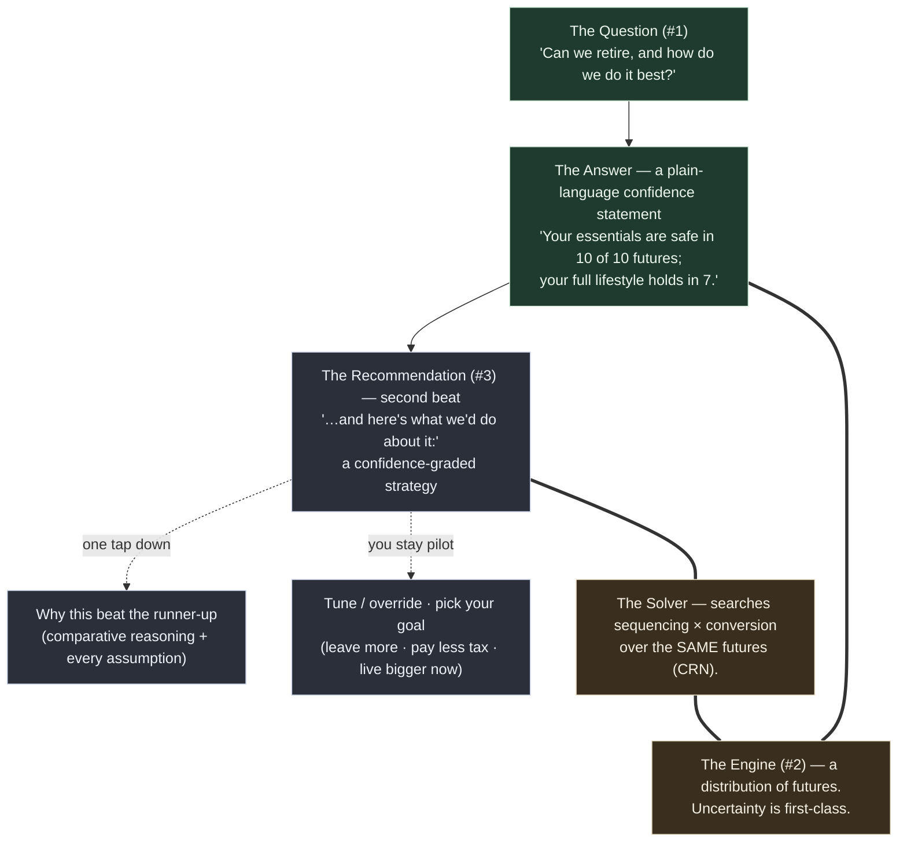

# The Back Nine — Requirements (v2: a personal tax-strategy co-pilot)

> **Thesis reset, 2026-06-04.** This doc was rewritten from its v1 commercial / single-Roth-lever / calculator-never-a-verdict framing to the direction locked in `../plans/direction-reset-2026-06-04.md`: a **personal tool** (Briggsy's laptop + a few friends, never sold) that **recommends** a confidence-graded strategy over a user-built budget. The regulatory guardrails relaxed to wording; **the load transferred to honesty + engine validation, which got stricter.** The v1 regulatory analysis is preserved as archive-as-rationale in `../research/foundation-findings-2026-06-03.md` §Strand 3, in case of future re-commercialization.

## Problem Frame

Retirement / wealth / tax planning is a domain everyone makes feel **hostile** — dense screens, intimidating setup, fifteen numbers where one would do. The incumbents don't lose on features; they lose on **consumability** (and on account-sync/data-plumbing breakage — the verified hardest incumbent failure, which our **manual-first, local-first** design sidesteps). That consumability thesis is evidence-verified (`../research/foundation-findings-2026-06-03.md` §Strand 1).

The Back Nine is built for **Briggsy and a handful of friends** — financially literate people betting **real retirement money** on the answer. It is **not for sale**, which is exactly what frees it to do the thing the commercial constraints forbade: not just *calculate*, but **recommend** — propose a tax-smart withdrawal + conversion strategy that funds your real budget and protects your spouse, and let you accept, tune, or override it. Because friends act on it with real dollars, the cardinal sin is **calm-but-wrong**: a confidently-stated wrong strategy is worse than no tool. **UX *and* correctness are the product**, not polish on top of it.

## The Product Model

The spine answers one question, then — **second beat** — proposes what to do about it, with the full reasoning one tap down. Safety is the default floor; above it, **you pick the goal**. Complexity is disclosed progressively; that restraint *is* the experience.

**face (#1) ← engine (#2) ← recommendation (#3):** the question is the face; the longevity+tax engine is the only thing that can answer it; the **solver** proposes the strategy that improves the answer. Same principle governs input and output: *answer first, recommendation second, precision/reasoning on demand.* The recommendation **never contradicts** the spine answer — they speak the same metric (see R21).

## Requirements

**The Confidence Spine (the first magic moment)**
- **R1.** The product answers one primary question — *"Can we retire, and how do we do it best?"* — as its central, first-class surface. Everything else is subordinate to it.
- **R2.** The answer is a **plain-language confidence statement** that leads with the verdict in human terms, framed for the household and honest about the survivor case. It **separates survival from lifestyle** where the budget supports it (*"essentials safe in 10 of 10; full lifestyle holds in 7 — in the other 3 you'd trim discretionary, not go hungry"*). Borderline/off-track answers use Kitces's **"probability of adjustment"** framing — never "failure" — expressed as the dollar move that keeps the plan safe. No histograms, no bare percentages-as-jargon, no dashboard on the primary surface. Meaning must never depend on color alone.
- **R3.** The engine models a **distribution of possible futures** (uncertainty is a primary input, not bolted on), not a single deterministic projection. The confidence statement is the humanized reading of that distribution.
- **R4.** After the verdict, all supporting detail — the range, the assumptions, the math, and the recommendation's reasoning — is reachable **on demand but never shown unsolicited** on the first surface.

**The On-Ramp (input)**
- **R5.** First contact is a **guided, one-question-at-a-time intake** (calm, advisor-style). The **fast first answer runs on a single total spend figure**; the itemized budget (R20) is the *deepening*, not the on-ramp — the calm first answer is never gated behind a full budget. Never a wall of forms.
- **R6.** A **power-user escape hatch** lets a user set any assumption precisely at any point, without walking the guided path.
- **R7.** **Every assumption the flow makes on the user's behalf is visible and editable on demand** — *and this gains weight under recommend-first:* a recommended strategy must expose its inputs **and its reasoning** for the user to trust and approve it.
- **R8.** **Input mirrors output:** the user reaches a caveated answer quickly, then *sharpens*. Each piece of added precision **sharpens the confidence band** — it *narrows* on added precision and *shifts honestly* on a corrected value (it does not only ever narrow). Refinement is rewarding, never punished for honesty.

**The Budget (the spending model — NEW)**
- **R20.** Spending is expressed as an **itemized, categorized budget** the user builds: **essentials vs discretionary**, with **time-boxed line items** (e.g. travel for the first N years then stops; the pre-65 healthcare gap from retirement age to 65). Structurally, **essentials *are* the safety floor; discretionary *is* the surplus** the strategy optimizes the funding of (R21). The user expresses *what they want*; the solver finds the tax-smart way to *fund* it. Spending shape (front-loaded "go-go years" vs level) is **user-set, never solver-recommended** — the tool shows honest consequences, it does not tell you how to live.

**The Strategy Engine — recommend-second co-pilot (the differentiator)**
- **R9.** The product **proposes a recommended strategy** over **two coupled, solver-optimized controls** — **withdrawal sequencing** (which account funds each year's spending) and **Roth conversion** (amount + years) — to fund the budget the tax-smartest way. *(Supersedes v1 "exactly one Roth lever." Sequencing is the more universal control; the survivor's tax cliff remains the emotional headline story.)*
- **R10.** **Recommend-*second* flow:** (a) the spine confidence answer **first** (the magic moment, unchanged); (b) **then** *"here's what we'd do about it"* — a proposed, confidence-graded strategy; (c) the **comparative reasoning** one tap down; (d) the user **tunes / overrides / re-picks the goal**, both futures updating. *(Supersedes v1's "surface → two futures → tune"; agency flips from user-pulls-blind to system-proposes / user-approves.)*
- **R11.** The recommendation is **calm and invited into the second beat — never a nagging alert, badge, or engagement bait.** Calm is never traded for engagement (the consumability wedge survives the posture change).
- **R21.** The objective is **lexicographic.** **Tier 1 (always, the floor):** never drop below the survival floor — essentials covered across the futures, spoken in the spine's voice. **Tier 2 (the user chooses):** what to do with the surplus — *leave more · pay less tax · live bigger now.* **The objective metric is the same quantity as the headline metric**, so a recommendation can never recommend a move that worsens the hero number it just showed. When survival is a given (over-funded household), the headline honestly **pivots** to the chosen surplus metric (*"you're safe either way — this keeps more from the IRS / funds more travel"*).
- **R22.** Every recommendation **grades its own confidence** — *robust-across-all-futures ("just do it")* vs *coin-flip ("here's what it hinges on")* — and **the hedge rides on the headline**, never buried in tapped-away math. Depth-on-demand must not invert into certainty-on-top / caveats-hidden-below.
- **R23.** The recommendation's depth is **comparative** — *"why this strategy beat the runner-up,"* retaining and surfacing the runner-up — not a formula dump.

**Healthcare (income-dependent cost — NEW)**
- **R24.** The model accounts for **income-dependent healthcare across the Medicare line**: **pre-65 ACA marketplace cost** (a Premium Tax Credit that scales with MAGI — **2026 base case = the 400% FPL cliff is back**; enhanced subsidies expired 12/31/2025 and are unre-enacted as of 2026-06-04; expose "enhanced" as a scenario toggle and **re-verify at every build**); **post-65 IRMAA** (a Medicare surcharge on a **2-year MAGI lookback**, a *different* MAGI definition, hard per-person cliffs); and **HSA** as a fourth account bucket (covers out-of-pocket + 65+ Medicare premiums tax-free, **not** ACA premiums; Medicare enrollment ends HSA contributions). Healthcare **couples into the strategy objective** — a conversion that torches an ACA subsidy or trips an IRMAA cliff must be *seen*, not silently optimized over. Numbers live in `../research/foundation-findings-2026-06-03.md` §Strand 5 + `../research/pre65-healthcare-aca-hsa-2026-06-04.md` (directional until pinned).

**Voice & Honesty** *(the regulatory section is gone; honesty is what's left, and it's stricter)*
- **R12.** The product **does make recommendations** now — but **every recommendation is probabilistically framed and confidence-graded.** Certainty language stays banned (*"guaranteed / optimal / locks in / you will save"*). String-level enforcement **flips** from *"ban the imperative"* to **"require the hedge on the headline"** (a positive/require lint, not a ban-list — see the engine note on copyGuard). *(Supersedes v1's "never issues individualized directives.")*
- **R13.** An **optional** in-product honest-limits note (*"this is a model — validate big, irreversible moves with a pro"*) — kept on **honesty** grounds for friend-users, **no longer a regulatory Terms requirement.** No Terms/License, no RIA entity (commercial artifacts, removed).
- **R14.** Scary, complex truths are stated in **plain human language without being dumbed down** (*"9 of 10 versions of your future,"* not "85% Monte Carlo success").
- **R25 (the cardinal honesty requirement).** **Calm-but-wrong is the cardinal sin, and the bar RISES for a recommender** — a wrong recommended strategy costs real dollars. *"It's just for friends" must never soften validation*: friends risk identical real money with **less** protection and trust the tool **more**. The removal of the regulatory net is a **load transfer onto correctness + confidence-grading**, never a loosening.

**Trust & Data Safety** *(relaxed from positioning pillars to personal hygiene — re-justified on engineering grounds)*
- **R15.** No user-facing **marketing privacy claim** is required or made (personal tool, no audience to make it to). The underlying honesty — *don't misrepresent what the architecture does* — survives.
- **R16.** The financial picture is **encrypted at rest** and **local access is guarded** (a lock for a shared laptop) — basic hygiene for real financial PII, **independent of any marketing claim**. The crypto bar may be *reasonable* rather than maximalist (PBKDF2-600k is acceptable; the maximalist Argon2id justification is no longer load-bearing).
- **R17.** **Survivor recovery is load-bearing** — the product exists for the survivor case. A client-generated **recovery phrase + mandatory export** and the **two-person / shared-household** recovery posture stay; only the "trust-building ceremony" framing relaxes.
- **R18.** The user can **export and back up their own data** — for **durability** (no single point of total loss); the anti-vendor-lock-in framing is moot for a personal tool.
- **R19.** Manual-entry inputs are **sanity-checked**: impossible/incoherent inputs are caught calmly inline, never producing a silently broken or falsely confident answer.

## Success Criteria
- A user reaches their **first confidence statement in one short sitting** on a single total spend figure (target: under ~3 minutes), never a wall of forms.
- The primary surface shows **one answer, then one recommendation** — not a dashboard. (Calm test.)
- **Every assumption *and* the recommendation's reasoning** can be reached within one interaction from the answer. (Trust test.)
- A user watches a **recommended strategy visibly move the answer** (*"6 of 10 → 8 of 10"*) **and** sees it **correctly confidence-graded.** (Differentiation test.)
- **Correctness — now two-tier:** the engine's *number* is right (validated vs Trinity/Bengen golden cases) **and** the solver's *recommendation* is right — validated against an **optimality/ranking oracle** (known-best drawdown/conversion cases), **ranking-stability under CRN**, and **grade calibration** ("just do it" really is robust). A calm-but-wrong recommendation fails the bar worse than no tool. (Correctness test — R25.)
- **N=1 cold-read (Briggsy):** across the **six survivor states + the survivor readout**, an on-track answer lands as relief and a borderline answer as honest-and-calm; **and** the recommendation feels *earned* (not overconfident), the "coin-flip" grade feels honest (not wishy-washy or alarming), and the comparative reasoning lands as transparency, not a bait-and-switch. (The bar.)
- **Every recommendation carries its probabilistic hedge on the headline.** (Honesty test — replaces v1's "no individualized directive" regulatory test.)

## Scope Boundaries
- **No account aggregation / Plaid in MVP.** Manual-first; revisit only when "crazily hardened."
- **No budgeting / transaction tracking / spend categorization as a tracker.** (The budget builder R20 is forward-looking *planning* input, not back-looking expense tracking — Monarch's lane.)
- **The tax IN/OUT line (replaces "no tax beyond one lever"):** a tax/health effect is **IN iff withdrawal sequencing or a Roth conversion can move it.** **IN:** ordinary brackets, standard deduction, RMDs, SS-taxation, the survivor MFJ→single switch, **ACA-PTC (pre-65), IRMAA (post-65)**, cap-gains/qualified-dividend stacking from taxable withdrawals. **OUT-but-disclosed:** NIIT, state tax, ACA beyond the premium-credit. **Later (chapter two):** SS-claiming-age, a full continuous optimizer, a "die-with-zero" spend-down solver, asset-location.
- **Spending shape is user-set, not solver-optimized** (R20) — the solver optimizes *funding*, not how you live.
- **MVP solver search is bounded** — a handful of named drawdown policies × a conversion grid, not a full continuous optimizer.
- **No live net-worth / portfolio aggregation surface in MVP** — the confidence spine + the recommendation come first.

## Key Decisions
- **The product is the bar — no competitive lens.** The only competition is the quality bar itself; a personal tool has even less reason for a moat lens. This *raises* the bar on correctness and trust.
- **Personal tool, not commercial → a load transfer.** Reg BI / Investment Advisers Act constraints don't apply (no compensation, no holding-out). The reg guardrails (no-verdict, no-optimizer, categorical-only triggers, attorney-gate, "we can't see your money" claim) relax or drop; **the burden transfers to honesty + engine validation, which harden** (R25). §Strand 3 → archive-as-rationale.
- **Recommend-*second* co-pilot with a solver.** Spine answers first (the magic moment); the solver proposes a confidence-graded strategy as the second beat. Posture flips from user-pulls-levers to system-proposes / user-approves (R9–R11, R22–R23).
- **"Best" = a lexicographic objective** — safety floor first, then a user-chosen surplus goal; objective metric ≡ headline metric (R21).
- **Household = couple (locked).** Joint-and-survivor longevity, survivor Social Security, MFJ→single brackets; the survivor's tax cliff is the recommendation's headline story. The objective spans **both** spouses' lifetimes incl. survivor years.
- **Local-first / personal privacy hygiene** — encrypted-at-rest + survivor recovery are load-bearing engineering, not a positioning pillar (R15–R18).

## Technical Foundation (research-resolved 2026-06-03; solver layer added 2026-06-04)

**Engine — Monte Carlo, "probability of adjustment"** *(unchanged + now the solver's per-candidate evaluator; `../research/foundation-findings-2026-06-03.md` §Strand 4)*
- 1000+ path Monte Carlo; **log-drift μ = arithmetic − σ²/2** in the lognormal sim (don't overstate compounding — the #1 MC bug). Defaults user-overridable: ~3% inflation; **conservative** real returns (Pfau/Kitces ~3–3.5% real in high-CAPE); **SSA cohort life tables** with **joint-and-survivor longevity** (P = p_x + p_y − p_x·p_y), never a fixed to-age horizon.
- **Result framing follows Kitces** (never "probability of failure") — the off-track answer is the **dollar adjustment** that keeps the plan safe; needs the terminal-value distribution + depth-of-adjustment.
- **Single-control correctness contract (the floor):** Trinity (50/50/4%/30yr = **95%**; 100%-bond = **~70%** diagnostic) and Bengen **1966** SAFEMAX (**4.15%**, deterministic vs the exact Ibbotson dataset); the MC number is a *band* that runs more pessimistic than the historical oracle, never an equality.
- **The single-shared-market-draw / CRN rule is load-bearing and now *more* so** — all account buckets share **one** market draw per year (buckets differ only in tax treatment); the draw schedule is a pure function of path/horizon dimensions. The regulatory twin (no asset-location) relaxed; the **CRN twin survives** and is what lets the solver rank N candidate strategies on identical futures (signal, not luck). Per-bucket draws are forbidden (they break CRN). Asset-location, if ever wanted, must be a *deterministic per-bucket tilt on the one shared draw*, not a separate draw.

**The Solver — a NEW engine layer (added 2026-06-04)**
- A CRN-correct optimizer over the **existing tax-and-accounts overlay**: searches **named drawdown policies × a conversion grid** (MVP), scores each candidate on the **lexicographic objective** (a distributional statistic in the spine's metric), and emits a **confidence-graded recommendation + a retained runner-up**. It is a layer *on top of* the validated spine + overlay — it does not re-implement decumulation.
- **Optimizer's-curse defense (non-negotiable):** select the strategy on one seed-set, **report its graded confidence on an independent held-out seed-set** (argmax over many candidates on one seed overfits that seed's noise). **Deterministic selection** (quantized objective + lexicographic tie-break + a seeded sub-stream orthogonal to the simulation draws) so the recommendation is byte-identical across reproductions and re-entry.
- **Solver validation is net-new and gating** (grows §Strand 4): an **optimality/ranking oracle** (hand-computable known-best cases), **ranking-stability under CRN**, and **grade calibration** — built **before** the solver is allowed to speak (R25). The sole human gate (N=1 cold-read) can judge a grade's *tone* but **not** its *correctness*; the automated calibration oracle is the only backstop.
- **copyGuard reshapes** from a forbidden-verb **ban-list** (regulatory) to *also* a **require-the-hedge** lint (honesty) — a harder, positive-assertion lint shape; certainty-hygiene + catastrophe-lexicon + the catalog architecture survive.

**Form factor — Web, local-first PWA** *(mostly unchanged; `../research/foundation-findings-2026-06-03.md` §Strand 2)*
- A URL, no install. Engine client-side in a Web Worker. **TS engine for the MVP is pending a solver compute profile** — a bounded named-policy × grid search keeps 1k-path-per-candidate compute tractable, but **WASM may move from deferred fast-follow toward load-bearing** for solve responsiveness; the interaction is **solve-once-on-demand** (not live-drag) for the recommendation, with cooperative cancellation (request-epoch).
- Data encrypted at rest (WebCrypto AES-GCM-256; key from passphrase). **PBKDF2-600k is acceptable** (the maximalist Argon2id justification relaxed with the marketing claim). Re-derive key per session vs persist-behind-OS-lock is a `/ce:plan` decision; both keep "server holds only ciphertext" honest.
- **Recovery (R17/R18):** client-generated **recovery phrase + mandatory export at onboarding**; separate login-recovery from data-decryption; the phrase is the durability backstop against IndexedDB eviction. No password reset, by design.

## Dependencies / Assumptions
- **US** tax/retirement context (Roth, Social Security, federal brackets, ACA, Medicare/IRMAA).
- **Manual data entry** is sufficient for a credible first answer + recommendation.
- **Legislative volatility is a first-class assumption:** the enhanced-ACA-subsidy status is live, possibly-retroactive policy — model 2026 cliff-on as base, expose the toggle, **re-verify at every build** (R24).
- **Validation gates (grown, now solver-blocking):** SSA cohort tables; the exact Bengen/Ibbotson series; the §Strand-5 tax numbers pinned to IRS/CMS primaries; **the solver optimality oracle** — directional until cleared.

## Next Steps
- Direction ratified (`../plans/direction-reset-2026-06-04.md`).
- **→ `/ce:plan` for the 4-phase re-plan:** Foundation → First Answer → Controls (manual sequencing + conversion) → Solver & Recommendation. Cascade the §Strand 4 (solver validation) + §Strand 5 (sequencing + healthcare) growth.
