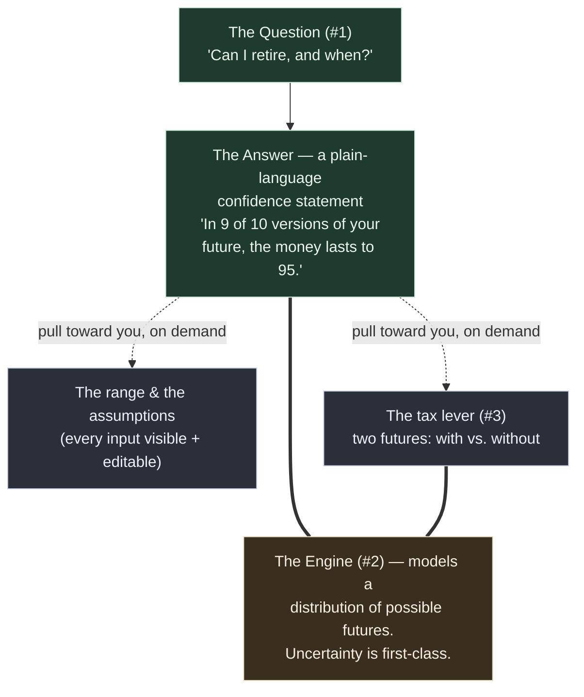

# The Back Nine — MVP Requirements: The Confidence Spine

## Problem Frame

Retirement / wealth / tax planning is a domain that everyone makes feel **hostile** — dense screens, intimidating setup, fifteen numbers where one would do. The incumbents do not lose on features; they lose on consumability. ProjectionLab has deep planning but a manual-entry wall. Boldin has planning plus balance-only aggregation, paywalled. Monarch has best-in-class connectivity but is a budgeting app, not a retirement planner. The unoccupied position: **planning-grade tax/withdrawal depth + low data-entry friction + a calm, legible experience**, for a financially-literate solo user, without forcing full transaction aggregation.

The Back Nine is built for Briggsy (user #1, financially literate) but at commercial-product altitude from day one. The bar is *"would a stranger trust this with their net worth."* **UX is not polish here — it is the product.** This document defines the first build: the *confidence spine* plus one differentiated tax lever.

## The Product Model

The product is one question on the surface, one engine underneath, and levers the user pulls toward themselves only when they want them. Complexity is disclosed progressively — that restraint *is* the experience.

**face (#1) ← engine (#2) ← lever (#3):** the question is the face; the longevity engine is the only thing that can actually answer it; the tax lever improves the answer. Same principle governs input and output: *answer first, precision/detail on demand.*

## Requirements

**The Confidence Spine (the magic moment)**
- R1. The product answers one primary question — *"Can I retire, and when?"* — as its central, first-class surface. Everything else is subordinate to it.
- R2. The answer is a **plain-language confidence statement** that leads with the verdict and bakes in honest odds in human terms (e.g., *"You can retire at 62 — in 9 of 10 versions of your future, the money lasts."*). For a couple it is framed for the household ("you both") and is honest about the survivor case. **Borderline/off-track answers follow Kitces's "probability of adjustment" framing — never "failure"** — expressed as the dollar move that keeps the plan safe (e.g., *"in 4 of 10 futures, you'd trim spending ~$600/month"*): honest, calm, actionable. No histograms, no bare percentages-as-jargon, no dashboard on the primary surface. The statement's meaning must not depend on color alone.
- R3. The engine models a **distribution of possible futures** (uncertainty is a primary modeling input, not bolted on), not a single deterministic projection. The confidence statement is the humanized reading of that distribution.
- R4. After the verdict, all supporting detail — the range, the assumptions, the underlying math — is reachable on demand but **never shown unsolicited** on the first surface.

**The On-Ramp (input)**
- R5. First contact is a **guided, one-question-at-a-time intake** (calm, advisor-style), collecting only the essentials needed for a first honest answer (target ~6–8 inputs for a single person; final count is pending the household-vs-single decision, since a couple adds a second income, age, and Social Security stream). Never a wall of forms.
- R6. A **power-user escape hatch** lets a user set any assumption precisely at any point, without walking the guided path.
- R7. **Every assumption the guided flow makes on the user's behalf is visible and editable on demand.** A literate user must be able to interrogate and override what drove the answer — this is what makes the calm answer credible rather than suspicious.
- R8. **Input mirrors output:** the user reaches a caveated answer quickly, then *sharpens*, and each piece of added precision **visibly tightens the confidence band** — making refinement rewarding rather than a chore.

**The Tax Lever (the MVP differentiator)**
- R9. The MVP includes **exactly one** tax lever: a **Roth-conversion what-if**. Harvesting, IRMAA, ACA cliffs, and bracket-management-at-large are explicitly later. The lever's headline story (couple model) is the **survivor's tax cliff**: converting while both spouses still file jointly defuses the bracket jump the survivor faces after the first death.
- R10. The lever follows a three-beat flow: **(a)** the product quietly *surfaces the opportunity*; **(b)** opening it shows **two futures — with vs. without** — making the gap visceral ("this buys you ~3 years"); **(c)** a control lets the user *tune* the strategy (amount / years) with both futures updating live.
- R11. Opportunity-surfacing is **quiet and invited, never a nagging alert or badge.** Calm is never traded for engagement.

**Voice & Regulatory Posture**
- R12. Copy presents **math and hypotheticals; it never issues individualized directives.** *"The math shows…"* / *"Here's what happens if…"* are allowed; *"You should…"* / *"We recommend…"* are prohibited. Enforced at the **string level**, not via a footer disclaimer.
- R13. The product carries an explicit *"informational and educational, not investment advice"* disclaimer (the verified Boldin-template posture). Any future human advice routes through a structurally separate RIA entity.
- R14. Scary, complex truths are stated in **plain human language without being dumbed down.** That is the product's voice (*"9 of 10 versions of your future"*, not "85% Monte Carlo success").

**Trust & Data Safety**
- R15. **The privacy promise is provable before it is spoken.** No user-facing copy may claim *"we can't see your money"* (or equivalent) until the shipped architecture demonstrably delivers it. Until proven, the product makes no such claim.
- R16. The user's complete financial picture is **protected at rest** (encryption-at-rest is a product-level requirement, not a planning afterthought), and **local access is guarded** (a lock for a shared device).
- R17. The product takes an **explicit, stated position on recovery.** If the design is end-to-end-encrypted, a lost key / forgotten password means unrecoverable data — that must be a deliberate, communicated choice, mitigated by user-controlled backup.
- R18. The user can **export and back up their own data** — no lock-in, no single point of total loss.
- R19. Manual-entry inputs are **sanity-checked**: impossible or incoherent inputs (retirement age before current age, spending beyond any plausible portfolio) are caught calmly inline, never producing a silently broken or falsely confident answer.

## Success Criteria
- A brand-new user reaches their **first confidence statement in one short sitting** (target: under ~3 minutes / ~8 inputs), never facing a wall of forms.
- The primary surface after onboarding shows **one answer, not a dashboard.** (Calm test.)
- **Every assumption** behind the answer can be reached and changed within one interaction from the answer. (Trust test.)
- A user can watch a **Roth-conversion what-if visibly move their confidence answer** inside the MVP. (Differentiation test.)
- **Correctness:** the engine's answer is *right*, not just calm — a defensible methodology a literate skeptic accepts, validated against known-good reference cases. A calm-but-wrong number fails the bar worse than no tool. (Correctness test.)
- **N=1 cold-read (Briggsy), across all three outcomes:** an *on-track* answer lands as relief; a *borderline / off-track* answer lands as honest and calm — neither sugarcoated nor catastrophized — and a stranger would still trust it with real numbers. (The bar.)
- **No string** in the product issues an individualized directive. (Regulatory test.)

## Scope Boundaries
- **No account aggregation / Plaid in MVP.** Manual-first; revisit only when "crazily hardened."
- **No budgeting, transaction tracking, or spending categorization.** That is Monarch's lane, not ours.
- **No individualized advice / "you should" directives, ever.**
- **No tax modeling beyond the single Roth-conversion lever** (no harvesting / IRMAA / ACA / full-return modeling in MVP).
- **No live net-worth / portfolio aggregation surface (#4) in MVP** — the confidence spine comes first.
- **Form factor and data-location are not decided here** — but they are no longer a deferred *detail*: they are build-critical research that runs *before* planning (see Next Steps), because the product's trust identity depends on the answer.

## Key Decisions
- **The product is the bar — no competitive lens.** We assume we're the only game in town; the only competition is the quality bar itself. Defensibility-against-incumbents is explicitly *not* a design driver. This *raises* the bar on correctness and trust (no incumbent to grade us on a curve), it does not lower it.
- **Wedge = "Can I retire, when?" (#1), driven by the longevity engine (#2), with the first tax lever (#3).** #1 is the question that keeps people up at night; #2 is literally the engine that answers it; #3 is the lever that improves the answer.
- **Magic moment = a probabilistic, humanized confidence statement.** A literate user distrusts deterministic certainty; honest odds in plain words build trust without reintroducing dread.
- **Master principle = calm by default, depth on demand.** Progressive disclosure is the entire architecture, input *and* output.
- **Household = couple (locked).** User #1's situation. The engine models joint longevity (money lasts to the *second* death), survivor Social Security, and married-filing-jointly brackets; the survivor's tax cliff is the Roth lever's headline story.
- **Privacy / local-first is the product's identity, not a detail.** *"We can't see your money, by design"* is load-bearing — elevated from deferred architecture to a positioning pillar, and gated by R15 (provable before spoken).
- **Regulatory posture = Boldin disclaimer template + a tool-behaving surfacing mechanic.** Baseline (verified, 3-0 in research): an explicit *"informational and educational — not legal, tax, or investment advice; validate any strategy with a licensed professional"* disclaimer, carried in **both** a Terms/License agreement **and** in-product (R13). The surfacing mechanic is designed to *earn* that posture, not lean on it — because a disclaimer shields words, not behavior: **(1) the trigger is categorical** (a general fact about couples filing jointly, not a personalized verdict about this user), **(2) the personalized analysis is user-initiated** (the two-futures math computes only when the user opens the lever — a calculator they reach for, not a push), and **(3) the payload is math/hypotheticals only** (R12). This is a **decided design posture, not a verified legal bright-line** — research verified the *disclaimer*, not the *surfacing mechanic*. Per R15 spirit: before this becomes load-bearing in a real Terms doc or a marketing claim, run a grounded investment-education-vs-advice verification pass.

## Technical Foundation (research-resolved 2026-06-03)

Both fronts the brainstorm deferred are now answered from cited sources via direct grounded search + primary docs. (The deep-research *workflow* failed three times — fetch/verifier crashes — so these decisions deliberately do **not** come from that broken pipeline.)

**Engine — Monte Carlo, framed as "probability of adjustment."**
- Monte Carlo simulation, 1000+ paths — what ProjectionLab and Boldin both use, and it produces the "X of 10 futures" language natively. Arithmetic-average growth (not compound) to avoid double-counting volatility. Optional historical-sequence cross-check.
- Defaults (all user-overridable per R6/R7): ~3% inflation; deliberately **conservative** real returns (don't overfit to favorable US history — Pfau); SSA cohort life tables for joint-and-survivor longevity.
- **Result framing follows Kitces:** never "probability of failure." The off-track/borderline answer is the **dollar adjustment** that keeps the plan safe (*"in 4 of 10 futures, you'd trim spending ~$600/month"*). This is the confidence-statement grammar and it resolves the off-track delivery problem.

**Form factor — Web, local-first PWA.**
- Frictionless on-ramp (a URL, no install) — serves the consumability wedge. The engine runs client-side in **WASM + Web Workers** (near-native; fast enough for live what-if recompute), so web costs nothing on correctness.
- Data lives in the browser, **encrypted at rest** (WebCrypto, non-extractable key in IndexedDB, key derived from the user's passphrase). *"Server holds only ciphertext"* is honestly deliverable. E2E cross-device sync (**Jazz** is the best-evidenced E2E engine; Evolu stays unverified) is a later add, not v1.
- **Honest caveat (per R15):** web re-serves the app code each visit, so the trust promise covers data at rest / in transit, not a malicious-code-update threat model. Disclose, don't hide. A **Tauri v2 desktop** wrapper (OS keychain + SQLCipher-encrypted SQLite; avoid the maybe-deprecated Stronghold plugin) is the future trust-maximalist upgrade — keep the core portable.
- **Recovery (R17/R18):** the universal E2E model — a client-generated **recovery phrase stored outside the app** + mandatory export. No password reset, by design, clearly communicated.

## Dependencies / Assumptions
- Assumes a **US** tax/retirement context (Roth, Social Security, federal brackets) for MVP.
- Assumes **manual data entry** is sufficient for a credible first answer (handover-locked).
- The competitive map and regulatory posture above are research-verified; the **voice-of-user UX-pain receipts and the local-first/E2E architecture front are still unverified** (the deep-research verifier crashed on those — unverified, not disproven).

## Outstanding Questions

### Resolved Before Planning
- **Household-vs-single → couple** (see Key Decisions).
- **Engine fidelity → Monte Carlo, "probability of adjustment" framing** (see Technical Foundation).
- **Form factor / data location → Web, local-first PWA, encrypted-at-rest** (see Technical Foundation).
- **Surfacing-mechanic regulatory posture → disclaimer + tool-behaving mechanic** (categorical trigger, user-initiated analysis, math-only payload). Decided design posture, not a verified bright-line — grounded education-vs-advice pass deferred until the posture is load-bearing in a real Terms doc or marketing claim (see Key Decisions).

*Nothing remains blocking. The doc is ready for `/ce:plan`.*

### Deferred to Planning
- [Affects R2][Design] The exact **on-screen wording and affordance** for each outcome state — the *framing* is decided (probability-of-adjustment-in-dollars; see Technical Foundation), but the precise copy and the next-action a bad-news answer offers are a design pass, without relying on color.
- [Affects R10][Design] How **"two futures"** is rendered legibly side-by-side without collapsing into a chart-heavy comparison.
- [Affects R1, R5][Design] The **cold-start / zero-data first screen** (what a brand-new user sees before any input), and the **returning-user re-entry view** (saved answer + staleness, not a re-run of intake).

## Next Steps
- All blocking questions resolved (household, engine, form factor — see Key Decisions + Technical Foundation).
- `-> /ce:plan` for structured implementation planning.
