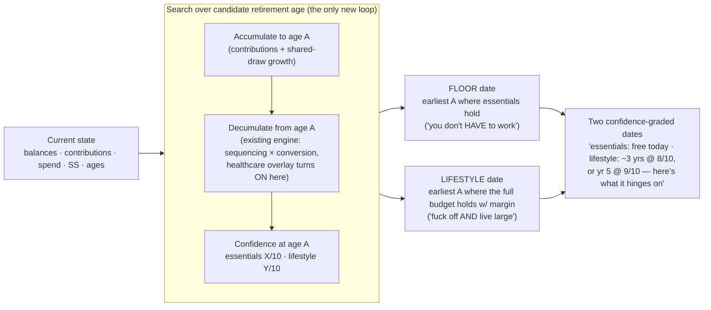

# The Fuck-Off Date — Full Projection (accumulation → decumulation)

> **Foundational expansion, 2026-06-08 (Briggsy ATC).** The master thesis (v2) was decumulation-only: the engine starts at a given `initialPortfolio` and draws down. While scoping U3·M5 (the HSA bucket) we found the engine models **zero contributions to any bucket** — `cashTermsForYear` (`src/engine/simulate.ts:99-136`) clamps `net = max(0, spending − earned − ss)` ("never a contribution back"); current balances grow only by market returns. This doc adds the **pre-retirement saving phase** and reframes the accumulation-side magic moment as **the fuck-off date** (the "work-optional" date). It **reopens** the master requirements (R9–R25) and the decumulation-shaped U0–U17 plan; re-planning will fold it in.

## Problem Frame

The Back Nine answers "can we retire, and how do we do it best?" — but only for a household that hands it a retirement-onset balance. Its real users (Briggsy + friends, **mid-50s, working by choice not necessity**) are asking a sharper, more emotional question first: **"When can I fuck off? When am I working because I *choose* to, not because I *have* to — am I 5 years out, 7, or there now?"**

Today the tool can't answer that, because it never models the years where you're still earning and still saving. It would understate a not-yet-retired user's nest egg (it ignores ongoing contributions) — calm-but-wrong in the pessimistic direction (R25). Closing this gap turns "tell me a retirement date and I'll grade it" into **"tell me your situation and I'll tell you the earliest date you're free."**

Crucially, this is **not** a generic "are you on track" savings calculator (a crowded, commoditized space). It is a **bounded on-ramp** for a near-retirement household, in service of the same novel thing — the recommend-second decumulation strategist. Accumulation is the runway that lets us *solve for the date*; the draw-down strategy stays the center of gravity.

## The Product — the Fuck-Off Date

It is **not a new engine.** It is the existing confidence engine run *backwards*: search the retirement age, and for each candidate, project the savings runway forward, decumulate from there, and read the confidence. The earliest age the floor holds is the answer. The locked lexicographic objective (R21) makes it **two** dates.

## Requirements

**The Product — the fuck-off date**
- **R26.** The tool answers **"when is work optional?"** — *the fuck-off date* is the product framing for this answer, **delivered as the two dates of R27** (never a single number). It is computed by **searching the retirement age** over the existing confidence engine (project accumulation to each candidate age → decumulate from there → read the confidence), **not** a new engine. The search is **non-monotone-robust**: because healthcare turns on at the tested age (R33) and the ACA 400%-FPL cliff is a documented engine discontinuity (insight 013), a *later* retirement age is **not** guaranteed safer. So the search **exhaustively evaluates every candidate age across the bounded on-ramp window** (≤~11 ages — cheap) and reports the earliest age at which a date's condition holds **and keeps holding for every later age**, disclosing any non-monotone region — never a monotonicity-assuming bisection that could return a **false-earliest** date (the calm-but-wrong sin, R25).
- **R27.** The answer is **two dates**, from the locked lexicographic objective (R21), both judged at the **same confidence bar** — differing only in *which* budget: (a) the **floor date** — earliest age *essentials* hold across the futures (the literal "don't HAVE to work" line); (b) the **lifestyle date** — earliest age the *full* (essentials + discretionary) budget holds **at that same confidence bar**. Either date may already be in the past for an over-funded household.
- **R28.** Both dates are **confidence-graded, never hard lines.** They incorporate accumulation-phase (runway) market uncertainty, so the output expresses the date↔confidence tradeoff ("lifestyle-free in ~3 years at 8/10, or year 5 for 9/10"). A single deterministic date is a banned calm-but-wrong simplification (R25). The date is graded under the **recommended (or user-selected) draw-down strategy** and **re-grades whenever the user overrides** sequencing/conversion (symmetric with R10's both-futures-update) — a date silently assuming a draw-down the user won't follow would itself be calm-but-wrong.
- **R29.** The framing **adapts the magic moment to user state**: a not-yet-retired user leads with the date ("you're ~N years out / free today"); the existing spine confidence statement (R2, in its R10 recommend-second position) stays the lead for an already-retired user. Same calm voice (R11), pointed at the date. *("Fuck-off date" is the working/product name; the user-facing readout holds the calm advisor voice — confirm the in-product label at design time.)*

**Projection model (accumulation → decumulation)**
- **R30.** The tool models the **pre-retirement accumulation phase**: from current balances, it projects each account forward through continued **contributions + market growth** to the retirement age under test, producing the retirement-onset balance + basis per bucket the existing decumulation engine consumes.
- **R31.** Contributions are **per-account, flat in real terms**, and **stop at the retirement age under test** (stop working → stop contributing). **Employer match** on workplace accounts is captured (free money that materially moves the date). No raise/promotion curve in v1.
- **R32.** v1 **projects** the user's stated savings plan; it does **not optimize** accumulation. Solver controls stay **decumulation-only** (sequencing + conversion). Contribution-strategy optimization (e.g. traditional-vs-Roth allocation to pull the date in) is a **future version**. *Rationale: a **sequencing call** — v1 ships the decumulation solver first; the accumulation lever waits its turn. (Note: traditional-vs-Roth contribution allocation is genuinely a **tax optimization** the solver could own — like Roth conversion — not purely a user "saving shape" à la R20's spending shape; so the v2 promotion is deferred-for-sequencing, **not** an off-thesis exclusion. The amount/shape you save stays yours, R20-style; the tax-bucketing of it is solver-eligible.)*
- **R33.** **Healthcare modeling is OFF during accumulation** (working years = employer plan) and switches **ON at the retirement age under test** — each candidate is "stop earned income *here* → ACA (pre-65) / IRMAA (post-65) costs begin *here*." The existing overlays are unchanged in character; they key off the tested retirement age.
- **R34.** Accumulation **inherits the engine invariants**: accumulation and decumulation **share ONE continuous absolute-year market-draw timeline** (a single `buildDraws` stream indexed from `currentAge` — **never** a separate pre-phase draw stream), so candidate ages see **byte-identical** year-*t* returns in their overlapping years and the date-search ranks them on **identical futures** (CRN). A separate-stream handoff would silently turn the ranking from signal into luck — the same hazard as the forbidden per-bucket draw. Consequently the date's confidence is read off **one per-path future end-to-end** (runway draws *then* decumulation draws on the same path — no averaged-balance handoff), so **sequence-of-returns risk in the final working years** (a crash on the largest-ever balance) is honestly priced into the date, never smoothed away. **No accumulation-phase income-tax engine** (the destination *bucket* carries the tax character — pre-tax / Roth / taxable+basis). An **empty** accumulation phase (`currentAge == retirementAge`) consumes **zero** extra draws and reduces **byte-identically** to today's decumulation-from-`initialPortfolio` behavior.

**Intake & data (the ~5-minute guided setup)**
- **R35.** The first answer comes from a **complete ~5-minute guided, account-level setup** (consciously revising the prior "~3-minute single-spend-figure" criterion — see Key Decisions): name, DOB, salary, SS estimate + claim age per person; then each **account** (type: IRA / 401k / brokerage / HSA), its **holdings**, current **value**, cost **basis** (taxable), and **annual contribution + employer match**. The same data feeds the withdrawal-sequencing strategy, so it is not accumulation-only overhead. The setup is a **single entry pass — never coarse-then-detailed re-entry**; the first answer **surfaces and sharpens during the flow** (so a quick gut-check is possible without a parallel data path), rather than gating behind a final "calculate." *(The exact progressive UX is a P2 intake-design detail, not an engine one — deferred. For a never-sold personal tool, "right answer" outranks "fast answer," so the ~5-min setup is acceptable; the surface-early principle preserves consumability without a second data path.)*
- **R36.** Account **values are user-entered; no live price lookup** — consistent with the load-bearing no-runtime-external-fetch architecture (strict CSP `connect-src 'self'`, offline-first PWA, deterministic replay). A holding's ticker/CUSIP is a **label + asset-class hint**, never a live-price key.
- **R37.** Because the engine does **no asset-location** (one shared market draw), per-ticker holdings **collapse to a single household stock/bond/cash blend** for the math. Ticker entry still earns its keep: it auto-derives that blend (no "guess your allocation" question), captures lot-level basis, and is the "it sees my real portfolio" trust moment. Tickers map to an asset class via a **bundled common-instrument table** with **manual classification** for anything unrecognized (offline-safe).
- **R38.** *(HSA phase boundary.)* **HSA contributions** belong to the accumulation phase (R30–R34); **HSA spend** — the MAGI-invisible qualified-spend lever and the post-65 non-qualified laundering rule — stays in decumulation (the paused U3·M5). Each lands in its own phase.
- **R39.** *(Data safety — inherits the master.)* Every R35 field — account / holding / value / basis, salary, DOB, SS estimate + claim age — is financial PII that **inherits the master's posture unchanged**: encrypted-at-rest + guarded local access (R16), survivor recovery (R17), export/backup (R18). The new fields extend the persisted `Scenario` schema **additively** (a `schemaVersion` bump owned by U4's migration ladder) and live **only inside the existing encrypted record** — never a separate or plaintext holdings store.

## Success Criteria
- A not-yet-retired user completes the guided setup in **~5 minutes** and reaches their **two confidence-graded fuck-off dates** in one sitting.
- The dates honestly express the **date↔confidence tradeoff** (never a single hard date) — verifiable against the R25 honesty bar.
- With **no runway** (`currentAge == retirementAge`), the tool reproduces today's decumulation answer **byte-identically** (the expansion is non-perturbing when accumulation is empty) — the reduce-to-spine analog for the new phase.
- The fuck-off date moves in the **intuitively-correct direction** as inputs change (more saved / higher contributions / lower spend → earlier date) — a sanity oracle for the search.

## Scope Boundaries
- **Not** a decades-out FIRE / "are you on track" savings calculator — bounded to a **near-retirement on-ramp** (protects the decumulation-strategy thesis; avoids commoditization).
- v1 does **not optimize** accumulation (no contribution-strategy recommendations; traditional-vs-Roth contribution allocation **deferred to a future version**).
- **No live market data / price feeds** — values are user-entered.
- **No accumulation-phase income-tax modeling** and no working-years budget detail — only contributions + growth affect the end balance; tax character rides the destination bucket.
- **No raise / promotion / career modeling** — flat-real contributions.
- The **"retired-but-still-contributing"** edge (an early retiree on an HDHP + ACA, still funding an HSA pre-Medicare): healthcare is off until the tested retirement age, which assumes contributions end when employment does. **This is NOT a free omission** — a pre-65 HSA contribution lowers ACA-MAGI, raising the PTC, and because the 400%-FPL cliff is a *step* (insight 013) the shift can **invert which candidate age is the earliest** (the master's "a disclosed omission can invert a ranking" landmine, R24). v1 must therefore either (a) model the HSA-contribution MAGI deduction in any pre-65 ACA year that overlaps employment, or (b) **prove** the omission is one-directional (can only push the date *later*, never earlier) and **bound + disclose** it — never leave it unbounded. *[Decide at planning.]*

## Key Decisions
- **Bounded on-ramp, not a FIRE calculator** — the user is mid-50s, ~0–10 yr runway; accumulation refines the start balance, decumulation stays the star.
- **The fuck-off date = the existing engine searched over retirement age** — reuse, not a new engine; falls out of the confidence spine + the lexicographic objective.
- **Two confidence-graded dates** (floor + lifestyle) — direct consequence of R21; the date is a distribution, not a line.
- **Project, not optimize (v1)** — symmetric with R20 (the saving shape is the user's).
- **~5-min account-level setup *revises* the prior ~3-min single-figure success criterion** — for a serious money tool the wow is *"it knows my real situation,"* not raw speed, and the same data is needed for the withdrawal-sequencing strategy anyway. *(This is the one master-requirement edit; it should be reflected back into the master Success Criteria.)*
- **User-entered values / no live quotes** — consistent with the already-decided no-runtime-external-fetch architecture (CSP + offline-first + deterministic replay); auto-quotes would be a separate architecture decision with real offline/determinism costs.

## Dependencies / Assumptions
- Builds on the **existing decumulation engine + tax/healthcare overlays** (unchanged in character; they key off the tested retirement age). Assumes the per-person age model (`currentAge`/`retirementAge`/claim age), the account buckets, and the CRN one-draw contract are the substrate the accumulation phase extends — verified present in `src/engine/simulate.ts` + `src/shared/model.ts`.
- **Reopens** the master requirements (`the-back-nine-requirements.md` v2) and the U0–U17 plan (`docs/plans/back-nine-mvp/`), both decumulation-shaped — re-planning folds this in (new units, likely between intake and the solver).
- **Unblocks / reshapes U3·M5 (HSA):** the HSA *spend* slice resumes in decumulation; HSA *contributions* land with this accumulation work (R38).

## Outstanding Questions

### Resolve Before Planning
- *(none — the product decisions are resolved.)*

### Deferred to Planning
- `[Affects R30/R34][Technical]` The **contribution-inflow mechanics** (R34 already mandates the continuous shared-draw timeline, so the separate-draw-stream option is off the table). Remaining: a **signed cash-flow / inflow term** in the per-year update — an inflow raises the authoritative total AND enters its bucket **at full basis** (like an RMD relocation) — with its **own reduce-to-spine golden** (`Σbuckets == total` after every contribution year). Pin **which bucket each contribution + employer match lands in** (match is **pre-tax even on a Roth 401k**). The decumulation-phase invariant ("buckets sum to `initialPortfolio`, total only goes down + grows") is reframed: during accumulation the total **grows** by contributions + returns; `initialPortfolio` is the accumulated balance **at the retirement boundary**. *(Verified real: `stepYear` (decumulation.ts) has no inflow term and `validateParams` (simulate.ts:235-239) hard-rejects buckets that don't sum to `initialPortfolio` — feasibility + adversarial converged.)*
- `[Affects R26][Technical]` The date-search **compute budget**: an outer exhaustive age-sweep (≤~11 ages, R26) wrapping the inner sequencing/conversion solver × N paths — confirm it stays in plain-TS or crosses the **WASM trigger**, and that accumulation extending the draw timeline doesn't change `maxHorizon`/draw dimensions for the empty case (which would break every existing CRN/reduce-to-spine golden).
- `[Affects R35/R37][Technical]` Does any v1 control consume **per-LOT** taxable basis, or only the **aggregate per-bucket** basis the engine models today (`initialTaxableBasis`, `src/shared/model.ts`)? If only aggregate, collect basis **per taxable account**, not per lot — per-lot is collectible-but-unused precision (scope-guardian).
- `[Affects R37][Needs research]` The **ticker → asset-class table**: which common instruments to bundle, the classification source (to pin under constants-discipline), and the manual-override UX for unrecognized holdings.
- `[Affects R31][Needs research]` 2026 **contribution limits + employer-match + SECURE 2.0 catch-up** figures for input sanity-checks (R19) — pinned under the constants discipline (directional-until-pinned).
- `[Affects R35][Design]` The **guided-setup intake UX** (a P2 UI surface) — progressive disclosure within the ~5 minutes; lands when UI work begins (load `/frontend-design` + `/emil-design-eng`).
- `[Affects R28]` *(Now specified in R34 — verification, not an open choice.)* Confirm in implementation that the date's confidence is read off **one per-path future end-to-end** (runway + decumulation on the same CRN path), so final-working-year sequence risk is priced in and not smoothed by an averaged-balance handoff (adversarial).

## Next Steps
✅ **Done (2026-06-10).** Re-planned (`../plans/2026-06-08-001-feat-fuck-off-date-accumulation-plan.md`, CLEAN) and **folded** into the master requirements (R26–R39, §"Accumulation → the Fuck-Off Date"), the roadmap, and the phase docs (Track A). U3·M5 (HSA spend) resumes as Track B1.
