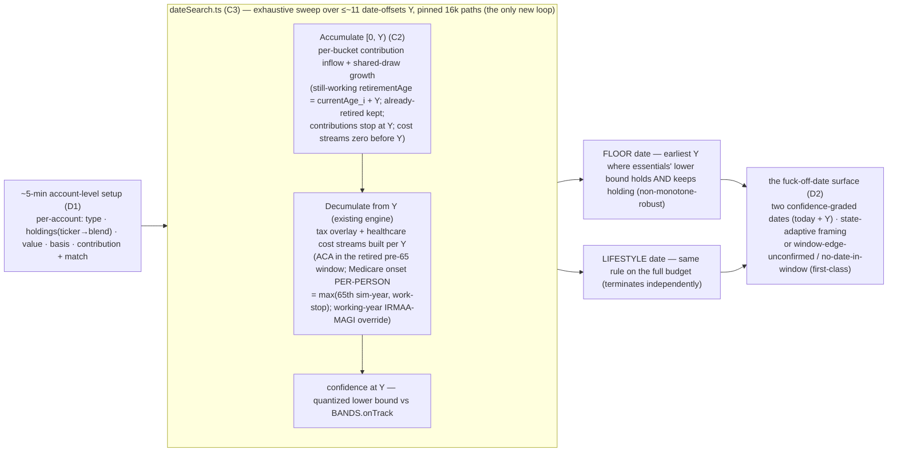
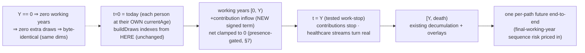

# The Fuck-Off Date — Full Projection (accumulation → decumulation)

> **This is a re-plan, not a greenfield plan.** It folds the ratified `the-fuck-off-date-requirements.md` (R26–R39) into the locked master plan set and sequences the new work against what is already SHIPPED (U0, U1, U2, U3·M1–M4) and PAUSED (U3·M5, HSA). It **amends** the U0–U17 roadmap — it does not renumber it (the shipped U0–U3 references are load-bearing across the codebase + insights). Paths are relative to `projects/the-back-nine/`.

---

## Overview

The master thesis (v2) was **decumulation-only**: the engine starts at a given `initialPortfolio` and draws down. While scoping U3·M5 (the HSA bucket) we found — and have now **verified against source** — that the engine models **zero contributions to any bucket**: `cashTermsForYear` (`src/engine/simulate.ts:99-137`) returns `net: Math.max(0, spending − earned − ss)` (the inline comment at `:143` reads *"never a contribution back"*), and `stepYear` (`src/engine/decumulation.ts:46-66`) computes `afterWithdrawal = totalValue(state) − netWithdrawal` — **subtraction only; there is no inflow path**.

This re-plan adds the **pre-retirement saving phase** and reframes the accumulation-side magic moment as **the fuck-off date** (the *work-optional* date). The product is **not a new engine** — it is the existing confidence engine run *backwards*: sweep the household work-stop **date-offset `Y`** over the existing decumulation engine, project the savings runway forward to each candidate offset, decumulate from there, and read the confidence; the earliest offset the floor holds (and keeps holding) is the answer, `today + Y`. The locked lexicographic objective (R21) makes it **two** confidence-graded dates.

It also **resumes U3·M5** on the decumulation side, reshaped per R38: HSA **spend** stays in decumulation (the paused milestone); HSA **contributions** fold into the new accumulation work.

## Problem Frame

The Back Nine answers *"can we retire, and how do we do it best?"* — but only for a household that hands it a retirement-onset balance. Its real users (Briggsy + friends, **mid-50s, working by choice not necessity**) ask a sharper question first: **"When can I fuck off — am I 5 years out, 7, or there now?"** Today the tool can't answer that, because it never models the years where you're still earning and still saving, so it would understate a not-yet-retired user's nest egg — **calm-but-wrong in the pessimistic direction** (R25). This is **not** a generic "are you on track" savings calculator (a commoditized space) — it is a **bounded on-ramp** for a near-retirement household in service of the same novel thing, the recommend-second decumulation strategist. Accumulation is the runway that lets us *solve for the date*; the draw-down strategy stays the center of gravity. (See origin: `docs/brainstorms/the-fuck-off-date-requirements.md`.)

## Requirements Trace

Every requirement maps to a track/unit. Numbers are from the origin doc (R26–R39). `MR` = the master requirements amendment.

| Req | Where |
|---|---|
| **R26** the fuck-off date = the existing engine swept over the household work-stop **date-offset `Y`** (years from now — never a household "age," which the per-person model can't express); **non-monotone-robust** exhaustive sweep, never a bisection | C3 (`dateSearch.ts`) |
| **R27** the answer is **two dates** (floor + lifestyle) from the lexicographic objective | C3 (engine) + D2 (surface); the two-track split rides P3·U9's degenerate-collapse |
| **R28** both dates **confidence-graded**, never hard lines; re-grade on strategy override | C3 + D2 |
| **R29** framing **adapts to user state** (date for not-yet-retired; spine confidence for already-retired) | D2 (state-adaptive first answer) |
| **R30** model the pre-retirement accumulation phase (contributions + growth → retirement-onset balance + basis) | C2 (accumulation projection) |
| **R31** contributions **per-account, flat-real, stop at the tested date**; employer **match** captured | C2 (engine) + D1 (intake) + C1 (limit constants) |
| **R32** v1 **projects**, does not optimize accumulation; solver stays decumulation-only | Scope Boundaries; C3 (date-search ≠ solver) |
| **R33** healthcare **OFF during accumulation, ON at the tested date** | C3 (`buildCandidateParams(Y)` constructs per-candidate cost streams — the engine has no retirement gate, §3b) + C2 |
| **R34** accumulation **inherits the engine invariants** — ONE continuous absolute-year draw timeline (CRN); one per-path future end-to-end; empty phase reduces byte-identically | C2 (the load-bearing engine contract) |
| **R35** the first answer comes from a **~5-min account-level guided setup**, surface-early, single entry pass | D1 (intake reshape) + MR (the one master Success-Criterion edit: ~3-min → ~5-min) |
| **R36** account **values user-entered; no live price lookup** | D1 + Scope Boundaries |
| **R37** per-ticker holdings **collapse to one household stock/bond/cash blend**; bundled ticker→asset-class table + manual classification | C1 (`tickerBlend.ts`) + D1 (entry + manual fallback) |
| **R38** HSA **contributions → accumulation**; HSA **spend → decumulation** (the paused U3·M5) | C2 (contributions) + B1 (U3·M5 spend) |
| **R39** new PII inherits encryption + the schema ladder (additive `schemaVersion` bump) | C2/D1 schema fields; consumed by P1·U4's migration ladder |

## Scope Boundaries

- **Not** a decades-out FIRE / "are you on track" calculator — bounded to a **near-retirement on-ramp** (protects the decumulation-strategy thesis; avoids commoditization).
- v1 does **not optimize** accumulation — no contribution-strategy recommendations; the solver's controls stay **decumulation-only** (sequencing + conversion).
- **No live market data / price feeds** — account values are user-entered (R36; consistent with `connect-src 'self'` + offline-first + deterministic replay).
- **No accumulation-phase income-tax engine** and no working-years budget detail — only contributions + growth affect the end balance; tax character rides the **destination bucket** (R34).
- **No raise / promotion / career modeling** — flat-real contributions (R31).
- **The "retired-but-still-contributing" HSA-MAGI edge is bounded + disclosed, not modeled** (see Key Decisions §6) — a decided one-directional simplification, never an unbounded omission.

### Deferred to Separate Tasks (future versions — named, not in this MVP)

- **Optimizing accumulation** — traditional-vs-Roth contribution allocation to pull the date in (a genuine *tax* optimization the solver could own, deferred for sequencing — not an off-thesis exclusion; R32).
- **A 3-asset cash sleeve** — v1 folds `cash` into the bond sleeve (the engine is 2-asset; a separate cash draw would break the 2-asset CRN contract).
- **Target-date-fund glide curves** — v1 ships a static-snapshot blend per TDF; the years-to-target glide approximation is the correctness upgrade (Key Decisions §5).
- **Roth employer match** (SECURE 2.0 §604, optional plan feature) — v1 routes all match to pre-tax (the default rule).
- **Per-person asymmetric retirement-date search** — v1 sweeps **one household date-offset `Y`** (the date is a household date: each still-working person's `retirementAge` becomes `currentAge_i + Y`; an already-retired person keeps their entered age — Key Decisions preamble); per-person retirement asymmetry stays an editable assumption applied on top.
- **`belowFloor` threading to the date-search result** — `solveAcaFundedGross` already surfaces a `belowFloor` flag, but nothing above the overlay consumes it; the per-track 100%-FPL-floor *disclosure* (the floor>lifestyle signature's user-facing explanation) needs it threaded up to the date-search result. Its first consumer is the U9-era cross-track surface — a NAMED deferred item per the as-we-go standing decision (v1 owes only the §3c assertion removal + result-shape mirrors + fixture scoping).

## Context & Research

### Relevant Code and Patterns (verified against source this session)

- **The cash-term seam** — `cashTermsForYear` (`src/engine/simulate.ts:99-137`) returns `{net, ss}`; `net` is clamped at 0 (*"never a contribution back"*, `:136`/`:143`). The accumulation inflow is a **new signed term** alongside this seam, not a change to the clamp's spending semantics.
- **The one per-year update** — `stepYear` / `runDecumulation` (`src/engine/decumulation.ts`) is contract #3 (the historical backtest + the MC spine both run through it). It is single-pool and **subtraction-only**; the accumulation inflow extends it with a signed flow.
- **The draw schedule** — `buildDraws(seed, paths, maxHorizon, peopleCount)` (`src/engine/simulate.ts:47-73`) is a pure function of **dimensions only**, allocated to `maxHorizon`, indexed by **absolute year from `currentAge` (t=0)**. The timeline **already spans currentAge→death** (the earned-income bridge already occupies the working years), so accumulation reuses existing year slots — it does **not** add a draw stream or change `maxHorizon` (R34's "one continuous timeline" is already the architecture; see Key Decisions §1).
- **The bucket model** — `OverlayParams.buckets {taxable, pretax, roth}` + a single aggregate `initialTaxableBasis` scalar (`src/shared/model.ts:177-245`); `validateParams` (`src/engine/simulate.ts:235-239`) enforces `Σbuckets == initialPortfolio`. Basis is **per-bucket aggregate, not per-lot** — this resolves the per-lot/per-account question (Key Decisions §4).
- **The schemaVersion-2 shape** — `ScenarioV2.accounts: PersonAccounts[]` (`src/shared/model.ts:400-434`) already carries per-person `{birthYear, taxable, taxableBasis, pretax, roth}`. Accumulation extends it **additively** with per-account contribution + employer-match fields (R39).
- **The M3/M4 healthcare gate is the biological-65 split + a per-year premium stream — NOT a retirement boundary (corrected after review).** The overlay prices ACA only when `pre65 = livingCount − count65 > 0` **AND** a finite-positive `enrolledPremium[t]` is supplied, and IRMAA only when `count65 > 0` (`src/engine/taxOverlay.ts:1082,1118-1131`; `simulate.ts:293-316`). There is **no retirement-age input** anywhere in the overlay. So R33's "healthcare ON at the tested date" is **new caller-side work**: the date-search must *construct* per-candidate cost streams (`enrolledPremium`/`slcsp` zero for working years, real from the tested date; plus the per-year working-year IRMAA-MAGI **override** and the per-person Medicare-onset signal — §3b; the `irmaaMagiSeed` covers ONLY `t < lookback` and structurally cannot reach later years) — the streams *are* the gate. (See Key Decision §3b; this was a load-bearing error in the first draft, flagged by 4 review lenses.)

### Institutional Learnings (read before executing)

- **DND/012 (externally-derived fixtures)** — the accumulation goldens (projected balance at age A) must be derived by **independent hand-math** (compound a flat-real contribution + a fixed return sequence by hand/spreadsheet), never via the engine's own formula. Same discipline as Trinity/Bengen/§36B.
- **insights 008/010 (NaN-first guards)** — every new input stream (per-bucket contributions, employer match, the ticker blend, the tested-age list) carries a `Number.isFinite`-FIRST R19 guard at **both** `validateParams` AND the overlay/date-search backstop (the standing as-we-go decision). A NaN sails through every relational guard.
- **insight 013 (a discontinuity breaks a root-finder's monotonicity)** — this is the **direct precedent** for R26's non-monotone-robust date-search: the ACA 400%-FPL cliff is a documented engine discontinuity, so a *later* work-stop date is **not** guaranteed safer. The date-search must be an **exhaustive** evaluation across the bounded offset window, never a monotonicity-assuming bisection that could return a **false-earliest** date.
- **insight 014 (a mid-sim state change moves a threshold — test the crossing year)** — the HSA `generalDrawableTotal` vs hsa-inclusive total split is dark at `hsa=0`; test the crossing, not just static positions.
- **burned/057,061,063 (one canonical constants table)** — the new contribution-limit + ticker-blend figures live in **one** year-keyed module each, read by engine/intake/tests; never re-typed. A shape test asserts every figure carries `{value, citation, directionalUntilPinned}`.
- **The reduce-to-spine golden invariant** — every overlay reduces **byte-identically (same seed)** to the Trinity/Bengen spine when OFF. The accumulation inflow gets its **own** OFF condition — the accumulation construct **ABSENT** from params, NOT merely "all contributions 0" (§7's working-year clamp changes working-year nets whenever the construct is present, so a zero-valued-but-constructed run is deliberately NOT byte-identical — §1) — and its own byte-identical test; the empty-phase (`Y == 0` — no working years) case consumes zero extra draws (§1).

### External References (researched this session — sources to pin under the constants discipline; figures are NOT inlined here)

- **2026 contribution / annual-additions limits** — IRS **Notice 2025-67** (published 2025-11-13): 401(k)/403(b) elective deferral + age-50 catch-up; IRA limit + the now-indexed IRA catch-up (SECURE 2.0 §108); the §415(c) annual-additions ceiling. **One notice covers four figures.**
- **2026 HSA limits + HDHP definitions** — IRS **Rev. Proc. 2025-19** (published 2025-05-01): HSA self-only/family limits, the **age-55 catch-up ($1,000, statutorily fixed — NOT indexed**, hard-code it), HDHP minimum-deductible + max-out-of-pocket. Per-person, per-account catch-up (matters for the couple).
- **SECURE 2.0 §109** — the 60–63 "super catch-up" (greater of $10k or 150% of the regular catch-up; the $10k floor indexed; an **optional** plan feature). Carried as `legalBasis` provenance on the catch-up constant.
- **Employer match (the bucket-routing fact)** — confirmed: employer matching contributions are **pre-tax (traditional) by default regardless of whether the employee defers Roth**; a Roth employer match (SECURE 2.0 §604) is *optional + taxable-in-year-made* — **deferred**. This validates R31's "match is pre-tax even on a Roth 401k."
- **SECURE 2.0 §603 (Roth-mandatory catch-up for high earners, effective 2026)** — **NOT modeled in v1**: the user enters their actual per-account contribution amounts, which already reflect whichever bucket their catch-up lands in, so the routing is captured at intake without an engine rule.
- **Ticker → asset-class** — bundled ~60–80-row category table keyed on the **issuer share-class family** (VTI == VTSAX → one row); citation = the issuer product-page allocation panel, with **SEC EDGAR N-PORT** as the independent (DND/012) backstop. Cash folds into the bond sleeve (v1). TDFs ship a static snapshot. Manual fallback = a 3-choice "mostly stocks / bonds / cash" picker + an advanced exact-% expander.

## Key Technical Decisions (the deferred-to-planning items, now resolved)

> **0. The candidate axis is a household DATE-OFFSET `Y` (years from now) — never a household "age."** The engine has **no household age**: every offset is per-person (`simulate.ts:339-344` — `retire = p.retirementAge − p.currentAge`, each person's OWN `currentAge`; `PersonInputs.currentAge` is the only `currentAge` anywhere in the model), so a scalar "household retirement age A" and every `A − currentAge` expression are **undefined for a different-age couple** — the core model. The sweep variable is `Y`, a sim-year offset, and the answer **is the date itself**: `today + Y` (calendar label `startCalendarYear + Y`). `buildCandidateParams(Y)` is a **pure per-candidate transform of the ORIGINAL entered params** (never mutated progressively across the sweep): each **still-working** person (entered `retirementAge > currentAge`) gets `retirementAge = currentAge_i + Y`, so every working person's retire offset equals `Y` exactly — `(currentAge_i + Y) − currentAge_i = Y`, they coincide **by construction** regardless of differing ages; an **already-retired** person (entered `retirementAge ≤ currentAge`; the boundary equality counts as retired) keeps their entered `retirementAge` **verbatim** — never un-retired into phantom income (the bridge at `simulate.ts:122` credits `earnedIncomeReal` for every `t < o.retire`, and nothing zeroes a retired person's entered income). All household boundaries — contribution-stop, ACA-on, the §7 clamp — key off the single sim-year `Y`; the per-person biological-65 split inside the retired window stays the existing overlay behavior (per-person Medicare onset is §3b). The empty phase ⇔ `Y == 0`. **An all-retired household never enters the sweep** (D2's per-person route predicate short-circuits it to the spine-first answer) — load-bearing for *correctness*, not just UX: a `Y > 0` candidate would zero a retiree's REAL ACA premium stream in `[0, Y)`, un-pricing healthcare they are actually paying. **The exclusion has an ENGINE-layer mirror, never caller-routing alone** (the project's two-layer standard): `dateSearch.ts` validates its own input domain first — `people.every(p => p.retirementAge <= p.currentAge)` ⇒ the defined input-failure rejection on the date-search result type (the indeterminate-class variant — the offset axis is undefined when no work-stop exists to search; never a `Y == 0` "work-optional today" crown, which would conflate already-retired with work-optional-confirmed — an off-track retiree is neither; never a candidate run), surfaced through `runDateSearch`'s calm-error-total grammar. (The guard lives in `dateSearch.ts`, NOT shared `validateParams` — an all-retired household is valid plain-decumulation input.) A **mixed** household (one retired, one still working) at `Y > 0` leaves the retired pre-65 spouse's ACA unpriced during `[0, Y)` — the household-level R33 reading (employer family coverage while anyone works). **Direction statement:** for a salary-funded household this is **neutral**, not optimistic — no working-year expense ever touches the portfolio under the §7 clamp, and the entered contributions are actuals that already reflect whatever premiums the household really pays; it becomes optimistic ONLY via §7's already-disclosed channel (a household that really draws from the portfolio while working), where the retired-spouse marketplace premium is the canonical concrete example (§7 names it in the disclosure copy, owned by D2). The retired 65+ spouse's Medicare is per-person and IS priced (§3b).

1. **ONE continuous absolute-year draw timeline — already the architecture (R34).** The engine timeline already starts at t=0 (today, each person at their own `currentAge`) and the bridge already occupies the working years. Accumulation adds a per-bucket **contribution inflow** into those existing working-year slots — it does **not** add a draw stream and does **not** change `maxHorizon`/draw dimensions (`buildDraws(seed, paths, maxHorizon, peopleCount)` is a pure function of dimensions only). Consequence: the empty phase (`Y == 0`, or the construct absent) consumes **zero extra draws**, and CRN across candidate offsets holds by the same argument the solver's K-candidate CRN holds (a tested `Y` moves *which* draws are consumed by which phase, never *how many* or their order). **This eliminates the requirements doc's scariest risk** (a separate pre-phase draw-stream handoff silently breaking the ranking) — it is structurally impossible because there has only ever been one stream. **Byte-identity is PRESENCE-keyed:** the reduce-to-spine OFF condition is "the accumulation construct is **absent** from params" — *not* "all contributions are 0." With the construct present, the §7 working-year clamp changes working-year nets even when every contribution is zero-valued, so a zero-valued-but-constructed run is deliberately **NOT** byte-identical to today and must never be asserted as such; `Y == 0` with the construct present has no working years (nothing clamped, no inflow years), so it **is** byte-identical.

2. **The signed cash-flow term + its own reduce-to-spine golden.** `stepYear` gains a per-year signed flow with a **pinned within-year pipeline** (contract #3 — ONE owner of the crediting convention, so the order can never drift): withdraw (`total − withdrawal`) → rebalance → grow → **credit the contribution END-OF-YEAR at face value** (`+ contribution` AFTER the return step — a contributed dollar earns NO growth in its arrival year). This is the **conservative** direction: real flat-real payroll contributions arrive across the year (~half a year of growth on average), so crediting them with *full*-year growth (the "mirror the start-of-year withdrawal" convention) would **overstate** the retirement-onset balance → an earlier reported date → the calm-but-wrong-**optimistic** sin (R25); crediting them end-of-year **understates** it → a later/safer date, never optimistic. (Pin this with a `stepYear` source comment mirroring `cashTermsForYear`'s documented conservative-direction comment at `simulate.ts:129-133`.) The spine signature **appends the contribution AFTER `stockWeight`** (never inserted before it — that would silently re-bind every existing call), and `StepResult` additionally exposes the **pre-credit growth-only total** so the overlay's bucket-scale can read it directly (below). The overlay path takes a **per-bucket** contribution stream: each lands in its destination bucket at **full basis** — a taxable contribution raises value *and* the running basis ledger; pretax/roth raise value only; **employer match → pretax even on a Roth 401k**. **Working-year withdrawals are clamped to zero (presence-gated, §7), so contributions and SPENDING-driven draws are TEMPORALLY DISJOINT** — a working year (`t < Y`) carries an inflow and a zero spending net; a retirement year (`t ≥ Y`) carries a draw and no inflow (contributions stop at `Y`, R31). **Scoped precisely:** no year carries both a contribution and a *spending-driven* draw — but overlay-FORCED flows (the 73/75+ still-working owner's RMD relocation, plus the tax gross-up on RMD / claimed-while-working SS / scheduled-conversion income — §3b's computed component) can still produce a working-year outflow; that is exactly the overlap year the §2c fold below is pinned safe for (it never depends on disjointness), and the RMD-age working-year companion test makes that overlap-safety falsifiable rather than asserted. **2c. The OVERLAY fold is AFTER the bucket-scale, at face value** (the round-2 "fold before the scale" was itself the regression): the overlay's `scale = totalValue(state)/afterWithdrawal` (`taxOverlay.ts:1192`) **IS the year's blended growth multiply** — `stepYear` advances the authoritative total by exactly that factor, and the overlay's `afterWithdrawal` equals `stepYear`'s in every non-depleted year (Σ==total reconciliation; a depleted year breaks before the scale runs). So a contribution folded BEFORE the scale either earns a full phantom arrival-year growth (`(destPost + C)×scale` — contradicting the pinned convention and golden (d), and breaking the existing `Σ finalBuckets ≈ terminalReal` reconciliation guard) or — folded into `totalBefore` — deflates the scale and **smears C proportionally across all buckets** (the asset-location violation golden (c) exists to catch). The correct fold: the scale is computed on the **contribution-EXCLUDED** portfolio (read `StepResult`'s growth-only total); AFTER the `:1222-1226` bucket reassignment, `buckets[dest] += C_dest` at face value; **when the per-person pretax ledger is active, ALSO credit the owner's slot** (`pretaxLedger[ownerIdx] += C_pretax_i`, living owners only — `buckets.pretax` is *defined* as the ledger sum under `perRmd`, the `:1205-1209` no-parallel-ledger-drift contract; an uncredited ledger desyncs next year's per-person RMD and the spousal rollover); `basis += C_taxable` **UNSCALED** (after-tax dollars are full basis, never growth-scaled), applied AFTER the `:1220` pro-rata basis reduction (whose denominator, `drawPool.taxable`, correctly excludes C); and **C never enters `drawPool`**, `allocateWithdrawal`, the RMD forced-excess base, or the basis pro-rata denominator — an end-of-year arrival is not drawable, convertible, or RMD-base in its arrival year. Σ-proof: `Σbuckets = afterWithdrawal×scale + C` = the post-step authoritative total with C credited end-of-year — exact. Reduce-to-spine: `C = 0` ⇒ `x ± 0` are exact IEEE no-ops ⇒ byte-identical. **Zero-balance starts are rejected, and mid-runway depletion is a DEFINED conservative outcome:** `validateParams` returns indeterminate for an accumulation construct with `initialPortfolio == 0` — `stepYear`'s depletion predicate (`afterWithdrawal ≤ 0`) would mark a $0-start run depleted at t=0 and the overlay's depleted branch would silently swallow every later contribution; the gate removes **the t=0 instance** of that state WITHOUT touching the spine's load-bearing depletion predicate. A small-but-nonzero start can still deplete MID-RUNWAY via the working-year overlay-forced flows named above (a forced tax bill exceeding the balance) — that is a **defined conservative per-path outcome** (the path forfeits all later contributions — pessimistic-only, never optimistic; `indeterminate` stays reserved for run-level input failure, and depletion is the engine's per-path grammar), pinned by a source comment at the depleted branch (mirroring the `simulate.ts:129-133` conservative-direction style) + a C2 test whose fixture genuinely depletes (start below the first year's forced tax bill, forced taxable income at t=0/1 — e.g. claimed-while-working SS or a scheduled working-year conversion); no v1 disclosure copy (the reachable household is near-degenerate — revisit beside the $0-start clause if it ever enters scope). **No accumulation-phase income-tax engine** — the destination bucket carries the tax character (R34). New goldens: (a) accumulation construct **absent** ⇒ byte-identical to the spine (presence-keyed, §1); (b) `Σbuckets == runningTotal` after **every** contribution year (the inflow analog of the decumulation sum invariant — the total now *grows*); (c) **a DESTINATION-bucket golden, asserted on the OVERLAY path** (`runTaxAwareDecumulation`) — after a contribution year the *named* destination bucket increased by exactly the contribution and the *other* buckets changed only by the shared growth factor; load-bearing because the overlay reconciles buckets by scaling to the authoritative post-step total, a smear passes golden (b) (the scale forces the sum), and the spine has no buckets — only the overlay path can falsify it. (d) **a direction golden, also on the OVERLAY path** — a contribution year with a positive return yields a retirement-onset balance **≤** the start-of-year-credited balance (proving the conservative convention shipped).

3. **The date-search is NOT the solver, but it is NOT bias-free either.** It is an outer **exhaustive** sweep over a bounded window of household date-offsets (`Y = 0..~10`, ≤~11 candidates, R26), each candidate running the existing `simulate` on the **same seed**. The earliest-`Y` decision is **non-monotone-robust** (insight 013): report the earliest offset at which a date's condition holds **and keeps holding for every later in-window offset**, disclosing any non-monotone region; **never a bisection** (the ACA cliff breaks "later = safer", which could return a structurally false-earliest date). **a) Per-candidate parameter construction is NEW work — "set the tested date" is not one knob.** Each candidate `Y` requires the `buildCandidateParams(Y)` transform (§0 — the single owner of per-candidate construction): per-person `retirementAge` overrides (still-working → `currentAge_i + Y`, already-retired kept verbatim — drives the earned-income bridge stop at `simulate.ts:122`); the per-bucket contribution streams truncated to `[0, Y)`; and the **healthcare cost streams** (next point). SS claim ages are held **as entered** (claim is not searched). The boundary-coincidence test **must use a different-`currentAge` couple** (e.g. 55/58 — the round-2 same-age fixture passed vacuously and could not catch the household-age break): for every candidate `Y`, every still-working person's `o.retire == Y`, contributions stop at `t = Y`, premiums start at `t = Y` — a planted off-by-one in any one fails. **b) "Healthcare ON at the tested date" is STREAM CONSTRUCTION, not an existing age-gate** (the plan's original "sets the M3/M4 age-gate boundary — not a new mechanism" was **false against source**, caught by review). The overlay's ACA gate keys off `pre65 = livingCount − count65 > 0` **AND** a finite-positive `enrolledPremium[t]` (`taxOverlay.ts:1118-1131`); IRMAA keys off biological 65 (`count65 > 0`). There is **no retirement boundary** in the engine. So `healthcareStreams.ts` builds `enrolledPremium[t]`/`slcsp[t]` = 0/absent for working years `[0, Y)` and the user-entered real values for the pre-65 retired window from `Y` to each member's 65th sim-year — and the same family carries the per-year **out-of-pocket-medical stream** (`oopMedical[t]` zero/absent in `[0, Y)`, entered values from `Y` — B1's HSA qualified-spend cap consumes it; the same household-level R33 reading and the same §0 disclosure channel as the premiums, so a candidate's working years can never drain the HSA for costs the salary actually pays). **Anchoring is decided:** the entered ACA + OOP inputs are **AGE-ANCHORED per-sim-year values** ("what coverage would cost at each age, were you retired then") and `healthcareStreams.ts` only **WINDOW-GATES** them per candidate — zero outside the retired window, **values never time-shifted** (two candidate windows price the same absolute sim-year at the same entered value; the IRMAA-MAGI seed is Y-INVARIANT — pre-sim actual returns that no `Y` can move). **Medicare/IRMAA onset is PER-PERSON, never a household scalar:** `onset_i = max(65 − currentAge_i, retireOffset_i)` in sim-year terms — for a still-working person `retireOffset_i = Y` (employer coverage past 65 delays Medicare enrollment — the *correct* real-world model, and the only off-switch for a member working past 65, since no premium stream gates IRMAA); for an already-retired person it collapses to their 65th sim-year. A household `max(65, A)` would zero a retired 66-yo spouse's **ENTIRE** Medicare cost (base Part B included — the pricing count gates both) for every working year → understated cost → falsely-early date. The **enrolled count intersects the LIVING set** — `medicareEnrolledCount(t) = |living ∩ {i : t ≥ onset_i}|`, computed as a **sibling field** exactly where `count65` is (resolveYear's living loop); a count over all entered persons would bill a dead spouse's Part B forever. `count65` is **never redefined**: it stays biological for the §63(f) age-65 deduction + OBBBA senior bonus (`deductionStack`) and the ACA `pre65` denominator; ONLY the IRMAA gate (`taxOverlay.ts:1082`) and the IRMAA pricing count (`:1095`) switch to the enrolled count. With no onset signal supplied, `onset_i` defaults to the 65th sim-year — **provably today's predicate verbatim** (`t ≥ 65 − currentAge_i ⇔ currentAge_i + t ≥ 65`), so the existing decumulation case is byte-identical by construction. **The working-year IRMAA-MAGI is an ADDITIVE OVERRIDE into history, not a seed:** the `irmaaMagiSeed` covers ONLY `t < lookback` (the read at `taxOverlay.ts:1083-1084` — `lag ≥ 0 ? irmaaMagiHistory[lag] : irmaaMagiSeed[t]` — never touches the seed at `t ≥ lookback`), so for a member crossing onset at `t ≥ lookback` (the common mid-50s case) the lagged read finds a clamped working year whose computed MAGI is ≈$0 → lowest tier → understated surcharge → falsely-early date, and the failure is **silent** (0 is finite; the fail-loud guard only catches undefined/NaN). `healthcareStreams.ts` therefore supplies a per-year **conservatively-high working-year IRMAA-MAGI override** (from entered working-year income), and the overlay records `irmaaMagiHistory[t] = override[t] + irmaaMagi(components)` — **ADDITIVE, never replacement** (a working-year Roth conversion, claimed-while-working SS, or a 73+ worker's RMD lands in the computed component; replacement would understate the sum, `max()` likewise; additive errs only conservative/later, and equals replacement in the common clamped working year whose computed MAGI is exactly 0) — as **ONE post-branch write covering both recording sites** (`:1144` ACA-priced + `:1153` else). The falsifiable test pins the override **above the tier-1 threshold** (below it a $0 surcharge is correct and the test proves nothing). The seed keeps covering `t < lookback` (genuinely pre-sim years — real tax-return MAGI); `validateParams`' seed-coverage loop (`simulate.ts:311-315`) **re-keys off the same per-person onset** (its local is literally named `medicareEnrolledThisYear` while computing biological 65) — else a candidate with a member 65+ but still working inside the first `lookback` years spuriously forces the WHOLE date-search indeterminate (a loud false rejection blocking the date — under the sweep's all-or-nothing rejection policy, §3 sweep bullet, a per-candidate rejection is never silently dropped). **This mechanism also closes a LATENT SHIPPED hole — ENFORCED at validateParams, never resting on caller discipline:** the existing earned-income bridge + healthcare-on + a member reaching Medicare within `lookback` years of a bridge year hits the identical ≈$0 lagged read in today's engine (no shipped test covers it). The override is therefore **REQUIRED of any caller whose params carry bridge years inside a lookback window** — `validateParams`' coverage requirement extends to the `t ≥ lookback` mirror (the exact pattern of the shipped `irmaaMagiSeed` guard: healthcareEnabled + any person with a bridge year inside the IRMAA lookback of any person's onset + no override coverage of those years ⇒ the defined indeterminate). **The overlay-backstop arm has a DECIDED vehicle — the bridge-year MASK** (the existing `:1088` seed throw cannot fire here: the lagged read returns a FINITE ≈$0 computed value, and the overlay's input surface carries no earned-income/retire-offset data — `netWithdrawals` arrives pre-collapsed, so "bridge year" is structurally inexpressible without it): a per-year boolean mask threaded into `taxInputs` inside the existing `healthcareEnabled` conditional spread, assembled PER-PATH beside `householdYears` in the `:411-429` loop (`bridge[t] = ∃i: t < retireOffset_i && t < deathOffset_i && earnedIncomeReal_i > 0` — the bridge's own dead-earner predicate shape; zero-draw, CRN-safe; absent ⇒ byte-identical, burned/062); the overlay's lagged read **throws when `lag ≥ 0 && mask[lag]` and the override lacks finite coverage of `lag`** — the true mirror of the `:1088` seed throw. **Honest limitation, recorded:** unlike the seed throw (whose trigger the overlay computes internally), this backstop is necessarily MASK-CONDITIONAL for direct callers — an omitted mask is byte-identity-indistinguishable from a no-bridge run, so the silent-≈$0 configuration is unreachable for **every simulate-path caller, plus any direct caller supplying the mask** (never "every caller" unconditionally). `healthcareStreams.ts` is the builder any such caller uses (it keys off `retireOffset_i` — `Y` in the sweep, the entered offset in plain decumulation). This cannot break a shipped test (none covers the configuration) and preserves absent-default byte-identity for every configuration without bridge-years-inside-lookback. **The hole has an ACA SIBLING, guarded by the same machinery:** a PRICED ACA year overlapping a bridge year computes ACA-MAGI **wage-blind** (`MagiComponents` has no wage component; `earnedIncomeReal` is netted away upstream) — wage-blind in BOTH directions, **optimistic in the subsidy band** (wages shrink the net withdrawal → computed MAGI ≈ withdrawals only → phantom near-max PTC → understated cost), conservative only below the 100%-FPL floor — so the year is **unpriceable, not one-directionally boundable**, and rejection beats disclosure: `validateParams` gains the sibling arm (healthcareEnabled + `∃t, ∃i: t < retireOffset_i && earnedIncomeReal_i > 0 &&` finite-positive `enrolledPremium[t]` ⇒ the defined indeterminate, beside the slcsp-coverage loop — run-level, the seed-guard conservatism), and the overlay reuses the SAME `bridgeMask`: `bridgeMask[t]` + the ACA price-gate firing at `t` ⇒ throw (the same mask-conditional limitation note). Unreachable in BOTH v1 routes by construction (the sweep zeroes premiums in `[0, Y)`; an all-retired household has no bridge years) — the guard protects direct callers and the deferred per-person-asymmetry feature, whose retired-on-ACA + working-spouse household is the canonical instance and which this arm is pinned as the first blocker on. **c) Selection-bias defense with a DESIGNED tolerance (the optimizer's-curse-LITE the original plan wrongly dismissed).** `survivalFraction(Y) = survivors/paths` is an MC point estimate with per-candidate standard error `SE ≈ √(p̂(1−p̂)/paths)`; selecting the **earliest** offset whose noisy estimate clears the bar is a threshold-crossing argmin that biases the date **earlier** (the lucky-noise candidate gets crowned — calm-but-wrong-optimistic). Because all candidates share one CRN seed, their errors are *positively correlated*, so "keeps holding" rubber-stamps rather than catches the false-early offset. **Defense (ships in P1, no seed-B needed):** select the earliest offset whose **conservative lower confidence bound** (`p̂ − z·SE`) clears the bar — with every term **pinned, not vibed**: **the bar = the headline's own on-track band edge** (`BANDS.onTrack = 0.85`, READ from `confidence.ts`, never re-typed) — the date is *defined* as "the earliest offset at which the headline statement reads on-track-or-better," keeping **objective ≡ headline** (no second metric; *recommendation led — redirect if you want a different bar*); **z = 1.645** (one-sided 95% — the haircut guards exactly one direction); **the lower bound is quantized to `SURVIVAL_GRID` (0.01) before the bar comparison** (mirroring `quantizeSurvival` — the cross-engine screenshot-reproduction idiom applies identically: a fuck-off date that flips across JS engines is the same hazard); and **`paths` is pinned so the haircut is sub-quantum at the bar**: `z·SE ≤ ½·SURVIVAL_GRID` ⇒ `paths ≥ z²·p(1−p)/0.005² ≈ 13,800` at the 0.85 bar → **date-search `paths` = 16,000**, uniform across all candidates (CRN). (Today's 2000-path headline config has `z·SE ≈ 1.3` grid quanta at z = 1.645 — undesigned; the finding was live.) Assert a **two-independent-seeds stability test** as plain DATE-EQUALITY on a **knife-edge-free fixture** — the true quantized lower bound at EVERY in-window offset sits comfortably inside a `SURVIVAL_GRID` cell (away from the bar-adjacent boundary; the statistical analog of the discontinuity-free scoping — near a cell edge two honest seeds can legitimately quantize apart, which is MC reality, not a defect), with the designed companion assertion that both seeds produce the IDENTICAL per-offset clear/fail vector (date-equality as a designed consequence, never luck). **No production component compares seeds or reconciles two dates** (the only seed-B production behavior is U14's future conservative-reading rule — grade-side, not date-side). When U14's held-out seed-B machinery lands, route the final *displayed* grade through it (symmetric with U14's conservative-reading rule); the date-search still needs **no full seed-B apparatus**. **One run, one statistic, one grade (cross-surface objective ≡ headline):** for a not-yet-retired household, the drill-down spine statement at the crowned `Y*` reads the date-search's **OWN** result — same run, same seed, same pinned 16k paths, params = `buildCandidateParams(Y*)` — rendering the SAME quantized-lower-bound grade that crowned the date; **never an independent recompute** at the headline config (2000 paths) or on the raw entered params (a different scenario — entered `retirementAge`s ≠ `currentAge_i + Y*`). If the point estimate is also surfaced, `p̂ ≥` the lower bound guarantees it reads equal-or-better, disclosed as the conservative margin — the damaging direction (a drill-down *worse* than the crowned date) is impossible by construction. The already-retired route keeps the existing 2000-path headline run untouched (it never enters the sweep). **The empty-window golden is a same-dimensions comparison:** the pinned 16k differs from the headline run's 2000 and `buildDraws` is dimensions-only, so the `Y == 0` byte-identity golden compares against a plain decumulation run **at the same 16k paths** — never across dims; the user-facing already-retired answer never enters the sweep at all (the D2 route predicate short-circuits to the existing headline run, untouched). **Outcome shape — three first-class outcomes per track, keyed off the CANDIDATE** (the candidate = the earliest `Y` whose quantized lower bound clears AND keeps clearing through the window top — equivalently the start of the longest clearing suffix; a candidate exists iff the top offset clears): (1) **confirmed date** — the candidate exists and is below the top (≥1 later offset of keeps-holding evidence by construction; any earlier-cleared-then-dipped offset below the candidate rides the existing non-monotone-region disclosure — no new machinery); (2) **window-edge date** — the candidate IS the window top (zero later offsets of evidence — the keeps-holding evidence is vacuous), **regardless of whether earlier offsets also cleared-then-dipped** (those additionally carry the non-monotone disclosure): reported as the date **with an explicit unconfirmed-tail disclosure** (folding it into "no date" would be pessimistic-FALSE; crowning it silently would be unconfirmed-optimistic — honesty in both directions); (3) **no-date-in-window** — no candidate (the top offset fails; e.g. nothing clears, or a curve holds early, dips, and never recovers in-window): a first-class result, "no work-optional date within the ~N-yr window" — never "never free," never silently the window-top offset, never a crash — surfacing the per-offset curve in the calm voice. **The window-FLOOR semantic (the over-funded case):** a confirmed date whose candidate is the floor (`Y == 0`) means **"work-optional AT today"** as a one-sided boundary-truncated reading — negative offsets are never evaluated and never need to be (the product question is "when can I fuck off"; "now" is fully evidenced, any claim about the *past* is out of evidence by design); the floor is NOT the epistemic mirror of the window edge — at `Y == 0` the keeps-holding evidence is *maximal* (every later in-window offset was evaluated), so no unconfirmed-tail-style disclosure attaches, and no new flag is needed (the crowned offset already identifies the floor). **Floor + lifestyle terminate INDEPENDENTLY**, and **floor ≤ lifestyle is an EXPECTED property, never an engine assertion**: it is asserted only on fixtures pinned away from ALL THREE modeled MAGI discontinuities — the **100%-FPL PTC eligibility floor** (the engine's ratified-conservative below-floor PTC=0; it exists in BOTH applicable-% regimes, so "enhanced ⇒ no cliff" never exempts it), the 400%-FPL cliff, and every IRMAA step. On real input the converse IS constructible: a smaller essentials-only spend → lower MAGI → **below the 100%-FPL floor → PTC forced to 0 → the full premium**, while the larger lifestyle spend stays subsidized — `floor > lifestyle` is the **100%-FPL-floor signature**, correct surprising-but-honest engine output that rides a disclosure, never a crash. The result SHAPE (model.ts) admits all mirror cases now ({floor: no-date, lifestyle: date}; floor > lifestyle); in v1's single-track degenerate budget the two are byte-identical so the behavioral cases are dark until P3·U9 splits the budget — the SHAPE lands now, the behavioral test rides U9 (insight 014). **Representation:** a discriminated variant on the NEW date-search result type — never `indeterminate` (that state is reserved for input failure; a no-date is a defined ANSWER on valid input), never a 7th `OutcomeState` (the enum is documented closed), persisted as a finite numeric sentinel (the `NEVER_DEPLETED = -1` precedent, DND/009). Compute = ≤~11× a single **16k-path** `simulate` (≈88× today's 2000-path headline run). **The compute is TWO-TIER (the during-entry refire posture, decided):** during-entry surface-early refires run the sweep at the **headline path count (2000)** — same seed, CRN-uniform candidates, same quantized-lower-bound rule (the coarser haircut errs later/conservative, the safe direction) — rendered strictly under D1's provisional/incompleteness string class; the **FINAL crowned date** (computed when the user marks the account set complete, and every post-completion/override re-grade) runs at the pinned 16k, and the designed-tolerance assertion scopes to the final-crown path ONLY (the provisional tier is a designed exemption, never an implementer workaround — the 16k pin itself is not tunable). The provisional→final transition rides D1's three-movement taxonomy (a final date earlier than the provisional one is the conservative margin releasing — a labeled provisional update, not bargaining). The **profile gate** (mirroring P4·U15's `profile.ts`) carries TWO budgets — the provisional-refire interactive budget at 2000 paths and the final-crown on-demand budget at 16k (the WASM threshold keys off the latter) — measured on a mid-tier device, threshold deferred to measurement.

4. **Per-account, not per-lot, basis.** The engine consumes a single aggregate `initialTaxableBasis` (verified). Collect basis **per taxable account** (summed to the per-person `PersonAccounts.taxableBasis`, summed to the aggregate). Per-lot basis is collectible-but-unused precision — **don't collect it** (scope-guardian).

5. **Ticker → one household blend; cash → bond; TDFs static.** Per-ticker holdings collapse to a single household stock-vs-(bond+cash) blend feeding the engine's one `stockWeight` (R37; the engine is 2-asset, so a separate cash sleeve is deferred). Target-date funds ship a **static-snapshot** blend per fund (disclosed "today's allocation, held constant"); the years-to-target glide curve is the named correctness upgrade. An unrecognized ticker routes to a manual 3-choice classifier (+ an advanced exact-% expander). All blends carry an issuer/EDGAR citation, directional-until-pinned. **The user-facing "today's allocation, held constant" TDF disclosure is owned by D1** (the ticker-hit screen + its test scenario); C1 carries only the snapshot data.

6. **The "retired-but-contributing" HSA-MAGI edge → disclose (the one-directional argument) + a falsifiable empty-overlap invariant, NOT a vacuous test.** By R31 (contributions stop at the tested date) + R33 (healthcare OFF until the tested date), the overlap window (retired + on ACA + still funding an HSA) is **structurally empty** in the v1 model — contributions occupy `[0, Y)`, ACA pricing occupies the retired pre-65 window from `Y`, **zero overlap**. The *direction* argument (a real such person's pre-65 HSA contribution would only **lower** ACA-MAGI → **weakly raise** PTC, monotone *including across the 400%-cliff step* — **with one carve-out: the 100%-FPL eligibility floor**, where lowering MAGI below the floor drops PTC to ZERO in the engine's model, so for a floor-adjacent household "may be slightly earlier" can invert; the D2 disclosure string carries the carve-out → weakly lower cost → an *earlier* real date; so omitting it can only push the *modeled* date **later** — the conservative direction, never the calm-but-wrong-optimistic sin R25) is **user-facing disclosure copy** ("if you keep funding an HSA after you stop full-time work, your real free-date may be slightly earlier"), **not** an engine test. **Why not a test:** since the overlap is empty in v1, "the date with the deduction omitted vs the date with it modeled" compares against a code path that doesn't exist and would touch zero priced years — `date == date`, vacuously true (worse than a DND/012 own-formula golden). **Replace it with a FALSIFIABLE structural invariant the engine can actually violate:** across the date-search, **no priced ACA year (`healthcareEnabled`, `enrolledPremium[t] > 0`, pre-65) ever carries a nonzero per-bucket contribution stream** — the contribution-stop boundary and the healthcare-on boundary are the *same* `Y` for every candidate (§6 invariant; it is the same coincidence `buildCandidateParams(Y)` enforces, §3a). A planted candidate where a contribution year overlaps a priced ACA year **fails** the invariant. This makes "conservative direction" an *architectural property the engine enforces* (contributions and ACA pricing are mutually exclusive in time), not a vacuous comparison. Modeling the pre-65 HSA-contribution MAGI deduction is a future enhancement (option (a) in the origin doc's Scope Boundary). **The user-facing disclosure string is owned by D2** (`copy.ts` + the copyGuard catalog scenario). *Recommendation led — redirect if you want option (a) modeled in v1.*

7. **Working-year portfolio withdrawals are clamped to zero — PRESENCE-GATED on the accumulation construct (the cash-flow-coherence fix).** `cashTermsForYear` (`simulate.ts:110-136`) computes `net = max(0, annualSpendingReal − earned − ss)` **every** year from `t=0` against the single **retirement** budget — so in a working year where the retirement spend exceeds salary + SS, the portfolio is silently **drawn down during accumulation** *while* a contribution is also being added: incoherent double-counting (you cannot both save and fund a spending gap from the same household cash), and it contradicts the Scope Boundary "only contributions + growth affect the end balance." **Fix:** when — and ONLY when — the accumulation construct is present on params, clamp the household net to **0** in year t **iff at least one LIVING person is still working** — `∃i: t < deathOffset_i && t < o.retire_i` — the exact predicate shape of this section's own contribution truncation and the bridge's dead-earner guard (there is no household age in the engine; under §0 every still-working person's offset IS `Y`, and an already-retired person's offset ≤ 0 never contributes to the predicate). **The clamp is DEATH-AWARE, implemented inside `cashTermsForYear`** (which already takes per-path `deathOffsets` — zero new plumbing, automatically per-path, CRN-safe zero-draw, never in `buildCandidateParams`): once the last living worker dies on a path, the clamp simply stops firing and the engine's EXISTING survivor cash semantics (survivor-ratio spending − the conservatively-gapped survivor SS) draw from the portfolio normally — a death-blind `t < Y` clamp would zero the surviving retiree's real draws for the rest of the runway, flipping the engine's deliberately-conservative survivor paths (`simulate.ts:110-112` survivor step-down, `:122` dead-earner bridge, `:129-134` survivor-SS understatement) **maximally optimistic on exactly the top-of-window candidates that decide the crowning** — the cardinal calm-but-wrong direction. While ANY living person works, the household stays clamped (the surviving worker's salary covers survivor-ratio spending — the same already-disclosed household-level lives-on-salary channel). The savings phase funds living from salary, not the portfolio. **The gate is presence-keyed, never value-derived:** a 1¢→0 contribution change must not flip the entire working-year draw regime (a behavior cliff keyed on an epsilon), and candidates must stay comparable across the sweep; absent ⇒ the byte-identical spine (burned/062's absent-⇒-default pattern). UNGATED, the clamp **breaks two shipped tests** — the still-working-bridge distribution test (`src/engine/__tests__/simulate.test.ts:182`: both arms become net=0 for the working years → byte-identical runs → the `.not.toBe` fails) and the dead-earner seam test (`:165-171`: a direct `netWithdrawalForYear` call expecting 50 gets 0) — and would violate the reduce-to-spine contract for every still-working plain-decumulation household (the shipped U1 bridge feature). Gated, a plain decumulation `simulate` is byte-identical by construction, and the `Y == 0` empty-phase golden is unaffected (no working years ⇒ nothing clamped). **Per-person death truncation:** person i contributes in year t iff `t < deathOffset_i && t < o.retire` — the SAME predicate shape as the bridge's dead-earner guard (`simulate.ts:119-122`), evaluated **per-path** (deathOffsets exist only inside the path loop; the assembly lives in the per-year loop at `:411-429`, `cashTermsForYear`-adjacent, which the `:398-403` comment already blesses as CRN-safe zero-draw work), **never in `buildCandidateParams`** (one transform per candidate cannot see per-path deaths) — else a dead spouse's phantom contributions overstate the nest egg (optimistic). The predicate form also defensively covers an already-retired person carrying stray entered contributions (offset ≤ 0 ⇒ empty window) with zero special-casing. **B×C consequence:** the overlay's per-bucket contribution amounts are therefore assembled **PER-PATH** (person-keyed streams → alive∧working filter → person→bucket aggregation in that same loop) and fed to §2c's after-the-scale fold — folding the two separately would resurrect the dead-spouse contribution at the overlay layer. **Direction disclosure:** the clamp only ever *removes* withdrawals → every path's balance is weakly higher → the date weakly earlier — with the death-aware predicate this is exact on the cash side even across sampled deaths for a household that lives on salary, **optimistic iff the real household draws from the portfolio while working** (the canonical concrete example of that channel: a mixed household paying the retired pre-65 spouse's marketplace premium out of savings — §0); the remaining DEATH-PATH residual is that healthcare streams are per-CANDIDATE, not per-path, so a survivor's pre-`Y` ACA premium/OOP stays unpriced in `[d, Y)` on death paths — disclosed through the same §0 channel/catalog scenario (D2-owned). Carry a §6-style one-directional disclosure (**the user-facing string is owned by D2**, `copy.ts` + copyGuard; the §0 mixed-household note rides the same catalog scenario) + a source comment at the clamp (mirroring the survivor-SS conservative-direction comment at `simulate.ts:129-133`) and update `netWithdrawalForYear`'s "never a contribution back" doc comment (`:140-143`). A C2 test asserts **no** portfolio withdrawal in any constructed-accumulation working year **with a living worker**, even when `annualSpendingReal > earned + ss`; the **death-mid-runway golden** (constructed `deathOffsets` at the seam — the `:165-171` direct-call pattern, no sampling constraint — or sampled-longevity with the runway past age 66) carries TWO arms: the contribution-truncation arm AND the **survivor-draw arm** — the sole living worker dies at `d < Y` ⇒ years `[d, Y)` carry `net = max(0, survivorSpending − survivorSS) > 0` on the spine path (a planted death-blind clamp fails).

## Open Questions

### Resolved During Planning

- *Contribution-inflow mechanics?* → §2 (signed per-bucket term, full-basis entry, match→pretax, within-year pipeline pinned with `stepYear` the single crediting owner, the overlay fold AFTER the bucket-scale + the per-person-ledger credit, the zero-balance-start reject, four new goldens incl. the overlay-path destination + direction pair).
- *Date-search compute budget / WASM trigger?* → §3 (exhaustive ≤~11-offset sweep at the PINNED 16k paths; profile gate restated at the pinned count; WASM threshold deferred to measurement; draw dims unchanged for the empty case, verified).
- *The date-search tolerance / the no-date case?* → §3c (bar = `BANDS.onTrack` read from `confidence.ts` [objective ≡ headline]; z = 1.645 one-sided; lower bound quantized to `SURVIVAL_GRID` pre-comparison; paths = 16,000 so the haircut is sub-quantum at the bar; three first-class outcomes — confirmed date / window-edge-unconfirmed / no-date-in-window; floor + lifestyle terminate independently).
- *Per-lot vs per-account basis?* → §4 (per-account; the engine consumes one aggregate).
- *Ticker→asset-class table?* → §5 + C1 (bundled category table, issuer/EDGAR citation, TDF static, manual fallback).
- *2026 contribution/HSA constants?* → C1 (Notice 2025-67 + Rev. Proc. 2025-19 + SECURE 2.0 §§108/109; figures pinned under constants discipline, not inlined).
- *The retired-but-contributing omission?* → §6 (the one-directional argument is disclosure copy; a falsifiable empty-overlap invariant — no priced ACA year carries a contribution — is the engine guard, not a vacuous date==date test).
- *One household age vs per-person search?* → one household **date-offset `Y`** in v1 (§0 — per-person `retirementAge` derived as `currentAge_i + Y` for the still-working; already-retired kept verbatim; Scope Boundaries).
- *Two dates from the first answer?* → coincident in the degenerate single-total-spend case; the budget two-track split (P3·U9) separates them — the date-search rides U9's existing degenerate-collapse, it does not rebuild the budget.

### Deferred to Implementation

- The exact **bounded offset-window** width (`Y = 0..~10`, ≤~11 candidates) — **ANSWER-BEARING, not a compute/UX knob**: under §3c the top offset is the keeps-holding evidence anchor, so a one-offset width change can flip outcome CLASSES (a curve clearing `Y = 0..k` and dipping only at the top flips between floor-confirmed "work-optional AT today" and no-date-in-window). The chosen width is pinned as a **named constant in the §3c "pinned, not vibed" family** (the same treatment as the 16k path pin; plan-provenance, not the external-citation register — it is a product-decided constant, not a sourced figure); any future width change re-runs the §3c honesty battery (the three-outcome tests incl. both window-edge arms + the dip-never-recovers case + the two-seed stability test) — never tuned against the profile budget or the cold-read alone (the cold-read judges *tone*, never correctness).
- The WASM **promotion threshold** + the mid-tier reference device (instrument-first, per the eye-in-loop discipline).
- The exact **bundled ticker list** (the ~60–80 rows) and per-fund TDF snapshots (a data-transcription task under the constants discipline; the *structure* is decided in C1).
- The **progressive intake UX** for the ~5-min account flow (a P2 design surface; load `/frontend-design` + `/emil-design-eng` when UI work begins — UI has not started).
- The in-product **label** for "fuck-off date" (the working/product name; the user-facing readout holds the calm advisor voice — confirm at design time, R29).

## High-Level Technical Design

> *Directional guidance for review, not implementation specification. The implementing agent treats it as context, not code to reproduce.*

**The fuck-off date = the existing engine swept over the household date-offset Y (one continuous draw timeline):**

**The one continuous absolute-year timeline (why CRN/reduce-to-spine survive):**

**The fold map (how R26–R39 lands in the U0–U17 structure — amend, don't renumber):**

| Existing | Amendment |
|---|---|
| Master requirements (R1–R25) | + R26–R39; the ~3-min Success Criterion → ~5-min account-level / surface-early (the one master edit) |
| Roadmap (U0–U17) | requirements trace + scope + key decisions + validation gates extended |
| P1 Foundation | + accumulation projection (C2), the date-search (C3), contribution + ticker constants (C1) |
| P2 First Answer (U5 intake, U7 surface) | reshaped: account-level setup (D1), state-adaptive date surface (D2) |
| P3·U9 budget | the two-date split rides U9's degenerate-collapse (note only) |
| U3·M5 (HSA) | resumes spend-only (B1); contributions move to C2 |

## Implementation Units

The work is four tracks. **Track A (doc reconciliation)** and **Track B (HSA spend)** are independent of each other and of the engine track and can start immediately and in parallel. **Track C (engine)** is the foundational pivot; **Track D (intake + surface)** consumes it. Suggested order: **A ∥ B1 → C1 → C2 → C3 → U4 → D1 → D2**. The **binding constraint is U4 before D1** (no PII reaches IndexedDB until U4's encrypted record + the schemaVersion-2 migration entry exist — R39); U4 itself has zero engine-track dependency (the roadmap marks it parallelizable with U1–U3), but placing it after C2/B1 lets its migration entry + persisted record types cover the final v2-with-accounts shape D1's first Save serializes.

---

### Track A — Source-of-truth reconciliation (decisions, not code)

- [ ] **A1: Fold R26–R39 into the master requirements**

**Goal:** The master requirements doc (`docs/brainstorms/the-back-nine-requirements.md`) becomes the single source of truth for the full accumulation→decumulation thesis.

**Requirements:** MR (all of R26–R39 made first-class master requirements).

**Dependencies:** None.

**Files:**
- Modify: `docs/brainstorms/the-back-nine-requirements.md`

**Approach:**
- Add an amendment banner (dated 2026-06-08) recording the decumulation-only → full-projection expansion, mirroring the v1→v2 reset banner.
- Append R26–R39 verbatim-in-intent under a new **"Accumulation → the Fuck-Off Date"** requirements section (the origin doc's text is already 6-persona document-reviewed; carry it, don't re-derive it).
- **The one master edit (R35):** reconcile the Success Criterion *"first confidence statement in one short sitting … under ~3 minutes … on a single total spend figure"* to the **~5-minute account-level guided setup, surfacing-early — "~5 minutes with account statements and a recent marketplace quote on hand"** (the hedge is load-bearing: the field list has grown past the origin's — ACA quote, OOP, working-year income, near-65 IRMAA seed — and the unexamined axis is data AVAILABILITY, not keystrokes; the sourcing-stall affordances are D1's) — for a serious-money tool the wow is *"it knows my real situation,"* and the same data feeds the withdrawal-sequencing strategy. State that the single-total-spend on-ramp is superseded by the account-level setup **for BOTH user states — one intake flow** (R35's single entry pass; the same account data feeds the withdrawal-sequencing strategy that IS the already-retired user's product); only the LEAD ANSWER is state-adaptive (date-first vs spine-first, R29), never a second intake. **The household retirement-spend figure SURVIVES the supersession as a collected input** — what is replaced is the flow *shape*, not the spend input (it remains the v1 degenerate budget R27's two tracks coincide on, replaced by the itemized budget only at P3·U9). The answer **surfaces and sharpens during** the flow rather than gating behind a final calculate — and **the provisional/final distinction applies to BOTH lead answers**: the already-retired route's spine confidence statement renders in the same provisional form between `validateParams` acceptance and account-set completion (a half-entered portfolio reads falsely off-track — the pessimistic mirror of the date route's trust hazard).
- Extend the Product Model section: the spine answer adapts to user state (date for not-yet-retired, confidence statement for already-retired — R29); the date is delivered as two confidence-graded dates (R27/R28).
- Extend Scope Boundaries + Key Decisions with the §1–§7 decisions above (accumulation IN; optimize-accumulation OUT; no live quotes; the working-year withdrawal clamp; the retired-but-contributing disclose+invariant).
- **Correct R33's inherited mechanism wording** when folding: the origin R33 says "the existing overlays … key off the tested retirement age" — but the engine's healthcare gate is the biological-65 split + a per-year premium stream, with **no** retirement boundary (§3b). Record the real mechanism in the master: healthcare-on-at-the-tested-date is the date-search **constructing per-candidate cost streams** (zero before `Y`, real from `Y`; Medicare onset **per-person** `= max(65th sim-year, work-stop)`; the working-year IRMAA-MAGI additive override), not an existing gate boundary — so a future reader of the master requirements doesn't re-inherit the mischaracterization.
- **Record the candidate axis in the master:** the search variable is the household **date-offset `Y`**, never a household age (the per-person model cannot express one — §0); already-retired members are never un-retired; all-retired households never enter the sweep.
- **Fold the no-date outcome into the master's honesty surface (R25):** for a borderline household every in-window offset can fail the bar — the master records the first-class **"no work-optional date within the ~N-yr window"** outcome (never "never free," never silently the window-top offset) and the window-edge unconfirmed-tail disclosure (§3c), so the pessimistic direction is designed, not accidental.
- **Correct R37's "captures lot-level basis" when folding** — the planning decision (§4) is per-ACCOUNT basis only (the engine consumes one aggregate `initialTaxableBasis`; per-lot is collectible-but-unused precision, don't collect it — this also resolves the origin doc's open question `[Affects R35/R37]`). The corrected R37 keeps the ticker-entry rationale (auto-derives the blend; the "it sees my real portfolio" trust moment) and states basis is captured **per taxable account, not per lot** — so a future reader of the master doesn't re-inherit the superseded claim.
- **Extend R39's PII enumeration when folding** (the origin enumeration predates fields this plan added): the list gains the pre-65 ACA cost inputs (SLCSP benchmark + enrolled-plan premium), the IRMAA-MAGI seed, the working-year income figure the conservative IRMAA-MAGI override is built from, the per-person work-status / retirement-stop-age field (all D1), and the per-year out-of-pocket-medical stream (B1-consumed, D1-collected) — health-plan, employment, and income disclosures that ride the same encrypted record, so a future master-requirements reader doesn't read the R35 field list as the closed PII set.
- **Correct R27's "may already be in the past" when folding** — the sweep evaluates `Y ≥ 0` only, so the engine produces no evidence about the past; the master records the one-sided window-FLOOR semantic instead (a floor-confirmed `Y == 0` date means "work-optional AT today," fully evidenced — §3c), the same inherited-wording correction pattern as R33.
- **Scope the origin's intuitive-direction Success Criterion when folding** — the origin's "more saved / higher contributions / lower spend → earlier date" sanity oracle holds only under **discontinuity-free conditions** (healthcare OFF, or MAGI pinned far from the 400%-FPL cliff, every IRMAA tier boundary, AND above the 100%-FPL eligibility floor at every candidate `Y` — mirroring C3's scoping; the floor is the discontinuity where LESS spending → discontinuously worse cost). Record in the master that input-axis monotonicity is NOT a universal: the same MAGI discontinuities that break the offset axis break it, and a cliff-straddling more-saved→equal-or-later date is CORRECT engine output — never to be "fixed" by forcing monotonicity, never a property-based assertion over arbitrary inputs (the §3c non-monotone disclosure is offset-axis only; no input-axis disclosure mechanism is owed in v1) — so a future reader doesn't re-inherit the unscoped universal.

**Execution note:** Documentation reconciliation — preserve every existing R1–R25 unchanged except the named R35 Success-Criterion edit; this is an *additive* extension, not a rewrite (the diary/drift anti-pattern: don't silently re-touch unrelated sections).

**Test scenarios:** `Test expectation: none — documentation reconciliation.` Verification is a cross-read: every R26–R39 appears in the master with its origin intent intact, and the ~3-min criterion is reconciled (not duplicated, not left contradictory).

**Verification:** A reader of the master requirements alone sees the full accumulation→decumulation thesis; no surviving sentence still claims a 3-minute single-total-spend on-ramp as the success bar, claims lot-level basis collection, claims a computable date "in the past," claims unscoped input-axis monotonicity (more-saved→earlier-date as a universal), or implies a per-state intake split; R26–R39 are traceable.

---

- [ ] **A2: Amend the roadmap**

**Goal:** The roadmap (`docs/plans/back-nine-mvp/roadmap.md`) reflects the new tracks/units, scope, decisions, and validation gates without renumbering the shipped U0–U17 references.

**Requirements:** MR.

**Dependencies:** A1.

**Files:**
- Modify: `docs/plans/back-nine-mvp/roadmap.md`

**Approach:**
- Extend the **Requirements Trace** table with R26–R39 → the tracks/units of this plan.
- Extend **Scope Boundaries**: accumulation IN; optimize-accumulation OUT (chapter-two); no live quotes (R36); the retired-but-contributing bound+disclose (§6); cash→bond + TDF-static (Deferred to Separate Tasks).
- Extend **Key Technical Decisions** with §1 (one continuous draw timeline), §2 (the signed inflow term + its golden), §3 (the date-search is not the solver; non-monotone-robust).
- Extend **Validation Gates**: the contribution-limit + ticker-blend constants are **directional-until-pinned** (Notice 2025-67 / Rev. Proc. 2025-19 / issuer-or-EDGAR), and the date-search carries the **non-monotone-robust** contract (insight 013) + the empty-phase byte-identity gate.
- Extend the **U13 index line**: the date surface joins the per-surface staleness map (the A3 phase-3 amendment carries the detail — fixture-vintage clocks for the new answer-relevant tables, the user-entered re-confirm class, the calendar-label re-presentation rule).
- Add the fold map (the table above) so a roadmap reader sees the amend-don't-renumber relationship.

**Execution note:** Point to this plan as the live home of the accumulation units (the roadmap stays the index; this plan carries the per-unit detail).

**Test scenarios:** `Test expectation: none — documentation.`

**Verification:** The roadmap's requirements trace covers R1–R39; the new decisions + gates are present; no shipped U-number is renumbered.

---

- [ ] **A3: Amend the affected phase docs**

**Goal:** The phase docs carry the new units at their correct altitude.

**Requirements:** MR.

**Dependencies:** A2.

**Files:**
- Modify: `docs/plans/back-nine-mvp/phase-1-foundation.md` (add C1/C2/C3 as Phase-1 engine units; note the new cross-cutting contract: the signed inflow on the one continuous timeline)
- Modify: `docs/plans/back-nine-mvp/phase-2-first-answer.md` (reshape U5 → the account-level setup D1; add the state-adaptive date surface D2; note the tax-blind-on-ramp design is superseded **for both user states — D1 is the single U5 reshape, the state-adaptive part is the D2 surface, never a second intake**; carry the corrected `memoryModel.ts` ownership — **D1 creates it as the U5 reshape**, U4's scope stays the persisted record + db/session/backup, never the in-memory orchestrator; supersede U5's "retirement age before current age" R19 error path with the status-conditional rule — `retirementAge ≤ currentAge` is the legitimate already-retired entry, the contradiction to catch is status-vs-age disagreement; carry the **both-lead-answers provisional decision** into the U7 reshape note — the spine-first statement renders provisionally during entry too)
- Modify: `docs/plans/back-nine-mvp/phase-3-controls.md` (note: the two-date split rides U9's degenerate-collapse — no new budget mechanism; **U9 follow-on**: when the itemized budget lands, the budget's medical line and `oopMedical[t]` must reconcile to ONE source — the cap-only containment premise (B1) must not silently double- or zero-count medical; **U13 EXTENSION — the date answer joins the per-surface staleness/re-entry machinery** (the most time-denominated answer in the product has no clock today): (1) fixture-vintage clocks per U13's contract #6 — the contribution-limit table vintage (answer-relevant: `intakeMap`'s per-runway-year step-down shapes the projected stream) + the ticker-blend/TDF static-snapshot vintage — both gating the DATE surface; (2) user-entered re-confirms ride U13's existing balance-drift confirm class, NEVER vintage clocks (the SS precedent): account values/contributions/salary join the "is this still your balance?" confirm, and the entered ACA quote gets an "is this still your marketplace quote?" plan-year re-confirm (marketplace premiums reprice annually); (3) **the date re-presentation rule**: re-presentation renders the wall-time-stable calendar label (`startCalendarYear + Y`, byte-identical under the saved vintage) and RE-DERIVES the relative "~N years out" framing from current wall-time — never a replayed relative string (the spine's re-derived-not-replayed rule mapped, not transliterated; the answer decays with pure time passage — ages advance against the saved t=0 anchor — so a sufficiently old save routes to recompute via U13's existing re-run rule, never re-presents as current); U17's inverted stale-rec rule is unchanged)

**Approach:** Land each new unit's Goal/Files/Approach/Test-scenarios/Verification (carried from Tracks C/D below) into its phase doc, preserving the existing units. Add the one new Phase-1 cross-cutting contract (the signed-inflow timeline) to the Phase-1 contracts preamble.

**Test scenarios:** `Test expectation: none — documentation.`

**Verification:** Each phase doc is internally consistent with this plan; the shipped units are untouched; the new units are dependency-ordered within their phase.

---

### Track B — Decumulation HSA spend (independent; resume first/parallel)

- [ ] **B1: U3·M5 — HSA 4th bucket (SPEND side), reshaped**

**Goal:** Extend the engine to a fourth account bucket — HSA **spend** behavior on the decumulation side — MAGI-invisible for qualified medical spend, ordinary-income (raising both MAGIs) for post-65 non-qualified spend, owner-age-keyed Medicare-premium privilege, the ACA-premium-not-qualified trap, Medicare-zeroes-contribution. **Spend-only** — HSA contributions belong to accumulation (C2).

**Requirements:** R24 (HSA fourth bucket), R38 (the spend/contribution phase split), R19 (engine numeric half), the correctness success criterion.

**Dependencies:** Shipped U3·M1–M4 (the healthcare overlay, the two MAGI calculators, the ACA fixed-point, the IRMAA lag). Independent of the accumulation track. *(The full M5 spend understanding-map — 6-reader verbatim contracts + integration points — is recoverable from run `wf_29e52525-1d0`.)*

**Files:**
- Modify: `src/engine/healthOverlay.ts` (HSA qualified-spend cap + the post-65 non-qualified income-inclusion path; the MAGI-invisibility rule)
- Modify: `src/engine/taxOverlay.ts` (the `hsa` bucket in the per-year ledger; `generalDrawableTotal` (taxable+pretax+roth) vs hsa-inclusive total split)
- Modify: `src/shared/model.ts` (`AccountBalances` + `PersonAccounts` gain `hsa`; an `OverlayParams` per-year out-of-pocket-medical stream the qualified spend is capped to; owner-age keying) under the schemaVersion-2 additive bump
- Modify: `src/engine/simulate.ts` (`validateParams` NaN-first R19 guards for the new HSA streams at BOTH layers; the bucket-sum invariant gains `hsa`)
- Test: `src/engine/__tests__/healthOverlay.test.ts`, `src/engine/__tests__/taxOverlay.test.ts`, `src/engine/__tests__/simulate.test.ts`

**Approach:**
- HSA spending is **MAGI-invisible to both calculators ONLY for qualified-medical withdrawals** — capped at the year's qualified-medical cost (a modeled out-of-pocket-medical stream + owner-65+ Medicare premiums). Covers out-of-pocket + (owner 65+) Medicare premiums tax-free — **NOT** ACA marketplace premiums (the trap). **`oopMedical[t]` is CAP-ONLY — pinned:** it sizes the HSA qualified-spend cap and **NEVER joins the overlay's funding need** (the `fundingNet` addend path is for PREMIUMS only) — which is what makes D1's "absent OOP is pessimistic-safe" derivable instead of assumed; the containment premise is recorded with it: **the household retirement-spend figure is DEFINED as including out-of-pocket medical** (already the shipped engine's implicit semantics — premiums are the only health cost priced on top).
- A **post-65 non-qualified withdrawal is ordinary income that RAISES both ACA-MAGI and IRMAA-MAGI** (the 20% penalty waived after 65, income inclusion is not) — the laundering negative test; HSA outflow is never a blanket MAGI-free source.
- The 65+ Medicare-premium privilege is keyed to the **HSA OWNER's age**, not the spouse's.
- HSA is **excluded from the general drawdown order** (`generalDrawableTotal = taxable + pretax + roth`); HSA outflow is qualified-medical-only. The hsa-inclusive total is a distinct quantity — **test the crossing** (insight 014: the split is dark at `hsa = 0`).
- **Reduce-to-spine:** `hsa = 0` (no HSA bucket) ⇒ byte-identical to the current overlay; an empty HSA stream is the byte-identical default (the M3/M4 as-we-go pattern).
- All new streams carry `Number.isFinite`-first R19 guards at `validateParams` AND the overlay backstop (the standing decision, insights 008/010).

**Execution note:** Test-first on the **reduce-to-spine** (`hsa=0` byte-identical) and **the laundering negative test** (post-65 non-qualified withdrawal raises both MAGIs), then the qualified-spend cap, then owner-age keying. Externally-derive every fixture (DND/012).

**Patterns to follow:** U2/U3's overlay shape (zero-draw cash-term transform); `burned/027` (pair every reduce-to-spine absence-assertion with a presence companion that an HSA spend actually moved a MAGI); `burned/062` (no in-range default for the OOP-medical stream); insight 014 (test the `hsa=0`→`hsa>0` crossing).

**Test scenarios:**
- Golden (reduce-to-spine): `hsa = 0` (or absent) ⇒ byte-identical to the current overlay distribution (same seed). Presence companion: with an HSA bucket + a qualified spend, the distribution differs and at least one path actually spent HSA MAGI-invisibly.
- Edge (qualified spend MAGI-invisible): a qualified-medical HSA withdrawal moves **neither** MAGI; it is capped at the year's qualified-medical cost (OOP + owner-65+ Medicare premiums).
- Edge (cap-only semantics, falsifiable): an OOP-bearing year's gross withdrawal need is **unchanged** vs the OOP-absent year at `hsa = 0` (the stream sizes the cap, never the funding need — a planted `fundingNet`-joined implementation fails).
- Error path (laundering negative test): a post-65 **non-qualified** HSA withdrawal raises **both** ACA-MAGI and IRMAA-MAGI (general spending cannot be routed MAGI-free through the HSA).
- Edge (owner-age keying): the owner-65+ Medicare-premium privilege does **not** apply when only the spouse is 65+.
- Edge (the ACA-premium trap): HSA cannot pay an ACA marketplace premium in the normal case.
- Edge (the total split, insight 014): a query of `generalDrawableTotal` vs the hsa-inclusive total diverges exactly when `hsa > 0`; planted `hsa = 0` shows them equal (the split is dark there).
- Edge (R19, NaN-first): a NaN/Infinity/negative OOP-medical stream or HSA balance returns the defined indeterminate output at `validateParams` AND throws at the overlay backstop; finiteness checked **before** any relational guard.
- Edge (constants single-source): every HSA-related figure routes through `src/engine/constants/`, marked directional.

**Verification:** The overlay reduces byte-identically to the pre-M5 overlay when `hsa = 0` (and demonstrably moves a MAGI when an HSA spend is qualified/non-qualified); the laundering negative test holds; owner-age keying + the ACA-premium trap are honored; every figure routes through the constants module. Typecheck · full suite · lint · `verify:aca` · `verify:bundle` green.

---

### Track C — Accumulation engine (the foundational pivot)

- [ ] **C1: Contribution + HSA-limit constants + the ticker→asset-class blend table**

**Goal:** Two new directional-until-pinned reference tables: the 2026 contribution/HSA limits (for intake R19 sanity ceilings) and the bundled ticker→`{stock,bond,cash}` blend table (for R37 auto-derivation of the household stock weight).

**Requirements:** R31 (contribution + match + limits), R37 (ticker→blend table + manual classification), R19 (intake sanity ceilings), R36 (no live lookup — bundled/offline).

**Dependencies:** Shipped U0 constants module + the `constants.shape.test` pattern.

**Files:**
- Create: `src/engine/constants/contributions.ts` (year-keyed: 401(k)/403(b) deferral + age-50 / age-55 / 60–63 catch-up tiers; IRA limit + indexed catch-up; HSA self-only/family + the fixed $1,000 age-55 catch-up; §415(c); HDHP min-deductible/max-OOP — each `{value, citation, directionalUntilPinned: true, legalBasis?}`)
- Create: `src/engine/reference/tickerBlend.ts` (the bundled category-keyed table → `{stock, bond, cash}` blend per issuer share-class family; TDF static snapshots; each row cited)
- Extend: `src/engine/constants/health.ts` (the **federal default age-rating curve** — the ACA 3:1 standard age curve D1's today's-quote→per-age-schedule escalator consumes (§3b entry shape); year-keyed, cited, `directionalUntilPinned` — the same discipline as every other health figure)
- Modify: `src/engine/constants/types.ts` (the new interfaces)
- Test: `src/engine/constants/__tests__/constants.shape.test.ts` (extend), `src/engine/reference/__tests__/tickerBlend.test.ts`

**Approach:**
- **Contribution limits are INPUT SANITY CEILINGS (R19) + the intake-side PER-RUNWAY-YEAR expansion rule, not engine math** — the user enters per-account contribution amounts; the engine adds the employer match (→ pretax). The R19 ceiling at ENTRY validates against the **current age's** applicable tier ("you can't contribute more than today's limit"). But flat-real is only the entry SHAPE — the model carries per-YEAR streams (C2), and an age-band ceiling can EXPIRE mid-runway (SECURE 2.0 §109's 60–63 super catch-up ends at 64): `intakeMap`'s expansion of the entered amount into the per-year stream therefore applies the age-band ceiling **per runway year** — the super amount carried for ages 60–63, stepped down to the age-50 tier at 64 — the exact analog of the ACA age-rating escalator (a flat projection of a today-legal super amount would compound legally-impossible contributions through 64+ → overstated balance → falsely-early date, the calm-but-wrong-optimistic sin); the conservative mirror (a 58-yo gaining 60–63 eligibility mid-runway) stays unmodeled — errs later/safe. So the constants feed the intake R19 layer + the intake expansion, never a per-year engine formula. Sources: **Notice 2025-67** (401k/IRA/§415c), **Rev. Proc. 2025-19** (HSA + HDHP), SECURE 2.0 **§109** as `legalBasis` on the catch-up tiers. The age-55 HSA catch-up is **statutorily fixed ($1,000), hard-coded — not a COLA figure**.
- **Reference numbers are NOT inlined in plan/tests** — every figure lives in the table with its citation; tests read the table; the shape test asserts each entry carries a citation + the directional marker (burned/057,061,063).
- **Ticker→blend:** category rows keyed on the issuer share-class family (VTI == VTSAX → one row). The `{stock, bond, cash}` blend collapses to the engine's `stockWeight = stock / (stock + bond + cash)` with **cash folded into the bond sleeve** (v1; the engine is 2-asset). TDFs ship a **static snapshot** per fund (disclosed "today's allocation"). Citation = the issuer product-page allocation panel, with SEC EDGAR N-PORT as the independent backstop (DND/012). Unrecognized tickers are handled at intake (D1's manual classifier) — the table is the lookup, not the fallback.

**Execution note:** This is a data-transcription unit under the constants discipline — pin nothing yet (everything `directionalUntilPinned: true`); the exact figures are transcribed from the named primaries at the P1-exit pin pass. Decide the **shapes** here, not the values.

**Patterns to follow:** `src/engine/constants/` existing tables (tax/health) — the `{value, citation, directionalUntilPinned}` shape + the year-keyed module + the shape test; `burned/057,061,063` (one canonical table, never re-typed); DND/012 (the issuer panel is the value; EDGAR N-PORT is the independent derivation path).

**Test scenarios:**
- Edge (shape): every `contributions.ts` and `tickerBlend.ts` entry carries a citation + the `directionalUntilPinned` marker; no figure is inlined outside the module (the single-source grep assertion, burned/063).
- Edge (ticker collapse): a 100/0/0 equity row → `stockWeight = 1.0`; a 60/40/0 balanced row → `0.6`; a 0/0/100 money-market row → `0.0` (cash folded into the bond sleeve); a TDF snapshot row → its pinned blend.
- Edge (share-class family): VTI and VTSAX resolve to the **same** blend row (keyed on family, not ticker).
- Edge (catch-up tiers): the age-band catch-up lookup (50 / 55 / 60–63) returns the right tier for a given age + account type; the age-55 HSA catch-up is the fixed $1,000, not a COLA figure.

**Verification:** Both tables are single-sourced, cited, and directional; the ticker collapse yields a correct `stockWeight`; the catch-up tiers resolve by age; the shape test catches a missing citation or an inlined number. Typecheck · suite · lint green.

---

- [ ] **C2: Accumulation projection — the signed per-bucket contribution-inflow term**

**Goal:** Extend the engine with the pre-retirement saving phase: a per-bucket **contribution inflow** (+ employer match → pretax; + HSA contributions per R38) in the working years on the **existing** draw stream, producing the retirement-onset balance + basis the existing decumulation consumes — reducing **byte-identically** to today when contributions are zero or the phase is empty.

**Requirements:** R30 (project the accumulation phase), R31 (per-account flat-real contributions + match, stop at the tested date), R33 (healthcare off during accumulation), R34 (inherit the engine invariants — one continuous timeline, one per-path future, empty-phase byte-identity), R38 (HSA contributions), R19 (engine numeric half), the correctness success criterion.

**Dependencies:** C1 (the contribution-limit constants for the intake ceilings; not strictly an engine dependency but co-landed), B1 (the `hsa` bucket must exist for HSA contributions). Shipped U1 (the cash-term seam + `stepYear`), U2 (the bucket ledger + basis).

**Files:**
- Modify: `src/engine/decumulation.ts` (`stepYear`/`runDecumulation` gain a signed flow; **append the contribution stream AFTER `stockWeight`** in the public signature — do NOT insert `contribution` before `stockWeight`, which would silently re-bind every existing call's `stockWeight` arg; an absent stream ⇒ zero inflow; **`stepYear` is the ONE crediting owner** (contract #3) — it credits the contribution end-of-year AFTER the return step, and `StepResult` additionally exposes the **pre-credit growth-only total** the overlay's bucket-scale reads)
- Modify: `src/engine/historical.ts` (the Trinity/Bengen backtest oracle also runs through `runDecumulation` — contract #3; its existing call site must stay byte-identical with the appended-and-absent contribution; **omitted from the first draft, caught by review**)
- Modify: `src/engine/taxOverlay.ts` (`runTaxAwareDecumulation` takes the per-bucket per-year contribution amounts — assembled **per-path** by the caller, §7; **the OVERLAY fold is AFTER the bucket-scale, at face value — §2c**: the scale is computed on the contribution-EXCLUDED portfolio (`StepResult`'s growth-only total), then after the `:1222-1226` reassignment `buckets[dest] += C_dest`; **when the per-person pretax ledger is active, also `pretaxLedger[ownerIdx] += C_pretax_i`** (living owners only — `buckets.pretax` is defined as the ledger sum, the no-parallel-ledger-drift contract); `basis += C_taxable` UNSCALED after the `:1220` pro-rata reduction; **C never enters `drawPool`**, `allocateWithdrawal`, the RMD forced-excess base, or the basis denominator; match → pretax; HSA contributions → the `hsa` bucket, zeroed **owner-ENROLLMENT-keyed**: `t ≥ onset_i` (§3b's per-person Medicare-onset signal, the OWNER's onset never the spouse's; absent-signal default = the owner's 65th sim-year, so C2 is implementable before C3 supplies the signal))
- Modify: `src/engine/simulate.ts` (`cashTermsForYear` clamps the household net to **0** iff the accumulation construct is present AND **at least one LIVING person is still working** — `∃i: t < deathOffset_i && t < o.retire_i`, the death-AWARE §7 predicate (a death-blind clamp flips survivor paths optimistic); the per-person death-truncated per-bucket contribution assembly in the per-year path loop (`:411-429`, CRN-safe zero-draw); `validateParams` NaN-first R19 guards for every new stream at both layers + the **zero-balance-start reject** (accumulation construct with `initialPortfolio == 0` ⇒ indeterminate, §2); the bucket-sum invariant is the year-0 invariant — unchanged)
- Modify: `src/shared/model.ts` (the **accumulation construct**: `OverlayParams` + `PersonAccounts` gain per-account `contributionReal` + `employerMatchReal` per-year streams, additive to schemaVersion-2; the contribution-stop boundary = the tested sim-year `Y`; construct ABSENT ⇒ the byte-identical spine)
- Test: `src/engine/__tests__/decumulation.test.ts`, `src/engine/__tests__/historical.test.ts` (assert the Trinity rolling-window rate is byte-identical post-signature-change), `src/engine/__tests__/taxOverlay.test.ts` (the destination + direction goldens live HERE — the smear/growth hazard is overlay-only), `src/engine/__tests__/simulate.test.ts`

**Approach:**
- **One continuous timeline (§1) — no new draw stream.** The contribution inflow occupies the existing working-year slots `[0, Y)`; `buildDraws`/`maxHorizon` are **unchanged**, so CRN across candidate offsets + the empty-phase byte-identity hold for free. Byte-identity is **presence-keyed** (§1): construct absent ⇒ byte-identical; zero-valued-but-constructed ⇒ deliberately NOT (the §7 clamp is live).
- **The signed term (§2) — contributions credited END-OF-YEAR, `stepYear` the ONE owner.** Spine path: `stepYear(state, rs, rb, withdrawal, stockWeight, contribution)` credits the contribution **after** the return step (no arrival-year growth — the conservative direction, §2) and exposes the pre-credit growth-only total on `StepResult`. Overlay path (**§2c — AFTER the bucket-scale, at face value**; the round-2 "before the scale" text was the regression): the scale reads the growth-only total; after the `:1222-1226` reassignment, `buckets[dest] += C_dest` (account type → bucket; the user-entered per-account amount already captures any §603 Roth-mandatory-catch-up routing) + the per-person pretax-ledger owner credit; a **taxable** contribution raises the running basis ledger at full value (after-tax dollars → basis = contribution; NOT growth-scaled), after the pro-rata reduction; C never enters `drawPool`/the RMD base/the basis denominator; **employer match → pretax even on a Roth 401k**.
- **Contributions and SPENDING-driven draws are temporally disjoint (§7, scoped), and the clamp is presence-gated.** Working years (`t < Y`, construct present) carry the inflow and a **clamped-zero spending net** (the household lives on salary); retirement years (`t ≥ Y`) carry a withdrawal + gross-up and no contribution. Overlay-FORCED flows (the 73/75+ still-working owner's RMD relocation + the tax gross-up on RMD / claimed-SS / scheduled-conversion income) can still produce a working-year outflow — the same-year contribution-vs-gross-up hazard is therefore prevented because the §2c fold is **overlap-safe and TESTED so** (the RMD-age companion below), not because overlap cannot occur. **The clamp itself is death-aware** (§7: it fires only while a LIVING worker remains on the path — once the last one dies, the existing survivor cash semantics draw normally); each person's contribution stream is death-truncated per-path by the same predicate shape (`t < deathOffset_i && t < o.retire`) and the per-bucket amounts are assembled per-path in the same loop (§7's B×C consequence).
- **No accumulation-phase income-tax engine** (R34) — contributions just enter the bucket; the destination bucket carries the tax character.
- **HSA contributions (R38)** → the `hsa` bucket; **Medicare ENROLLMENT zeroes the contribution** — person i's HSA contribution (and catch-up) zeroes for `t ≥ onset_i`, the §3b per-person onset, keyed to the OWNER never the spouse (mirroring the constants table's separation of `medicareZeroesContribution` from the owner-age premium privilege); absent-signal default = the owner's 65th sim-year (today's biological predicate — C2 ships against the default, C3's onset signal flows through automatically, no separate re-key step to skip); the 6-month Part A retro trap is disclosed, not modeled in v1 — **the user-facing string is owned by D1** (a calm intake note beside the HSA contribution question — an entry-time caveat on the entered amount; `copy.ts`-class, copyGuard-cataloged, the §5/§6/§7 ownership pattern).
- **Healthcare OFF during accumulation (R33) is delivered by the date-search's stream construction, NOT an engine gate (corrected, §3b).** C2's responsibility is only the contribution inflow + the working-year clamp; the per-candidate `enrolledPremium`/`slcsp` streams (zero in `[0, Y)`, real from `Y`), the per-person Medicare-onset signal, and the working-year IRMAA-MAGI additive override are built by `healthcareStreams.ts`/`buildCandidateParams(Y)` in C3. C2 does **not** assume the overlay's age-gate is "inert" in working years (for a mid-50s couple `pre65 > 0` is *true* every working year — healthcare stays off only because the streams are zero there).
- **The new goldens:** (a) **accumulation construct ABSENT ⇒ byte-identical** to the current spine/overlay distribution (same seed) — asserted on **both** the MC `simulate` path AND the historical `rollingSuccessRate` (Trinity) path — plus the explicit NEGATIVE companion: a **zero-valued-but-constructed** run with a still-working drawing household **differs** (the §7 clamp is live — proving the presence gate, not the value, owns byte-identity); (b) **`Σbuckets == runningTotal` after every contribution year** — the inflow invariant (the total now *grows*); (c) **the DESTINATION-bucket golden, on the OVERLAY path** (§2c) — the named bucket += exactly the contribution, other buckets change only by growth (the Σ golden cannot catch a proportional smear; the spine has no buckets); (d) **the direction golden, on the OVERLAY path** (§2d) — end-of-year crediting yields a retirement-onset balance ≤ the start-of-year-credited balance; (e) **empty phase** (`Y == 0` ⇒ no working years) consumes zero extra draws and is byte-identical.
- **The retired-but-contributing edge (§6) is a FALSIFIABLE empty-overlap invariant, not a vacuous date==date test** — no priced ACA year carries a nonzero contribution stream (a planted overlap fails); the one-directional argument is disclosure copy.
- **R19 NaN-first** on every new stream at `validateParams` AND the overlay backstop (insights 008/010); the intake ceiling check (against C1) is the semantic R19 half (D1).

**Execution note:** Test-first on the **byte-identity goldens** (construct-absent on BOTH the MC and the historical/Trinity path; the zero-valued-constructed NEGATIVE companion; empty-phase `Y == 0`) and the **presence-gated working-year clamp** (§7 — including that the two named shipped tests, `simulate.test.ts:182` + `:165-171`, stay green) before any projection math, then the **externally-derived** projection fixture (a flat-real contribution + a fixed return sequence compounded by hand, **crediting each contribution end-of-year with NO deposit-year growth** to match the pinned convention — an end-of-year-vs-start-of-year fixture mismatch is a *fixture* bug, never read as an engine determinism failure), then the destination-bucket + direction goldens on the overlay path + the per-person-ledger credit, then the death-mid-runway golden, then match→pretax + HSA-Medicare-zeroing + the §6 empty-overlap invariant.

**Patterns to follow:** U1's earned-income-bridge overlay shape (the inflow is its mirror — adds where the bridge nets down); U1/U2 CRN seam + the single-shared-draw rule; DND/012 (compound the expected projected balance by an independent path, never the engine's own formula); `burned/062` (no in-range default for an absent contribution stream — absent ⇒ zero-inflow, the byte-identical default; a NaN is rejected, not coalesced); `burned/027` (pair the contributions=0 absence-assertion with a presence companion that the inflow actually grew the total).

**Test scenarios:**
- Golden (construct-absent byte-identity, BOTH paths): the accumulation construct **absent** ⇒ byte-identical (same seed) to (a) the current MC `simulate` distribution AND (b) the historical `rollingSuccessRate` (Trinity rolling-window) rate — the signature change must not perturb the backtest oracle. Presence companion: with a nonzero contribution stream, the retirement-onset total is strictly higher and the terminal distribution differs.
- Edge (presence gate, the NEGATIVE companion — §1): a **zero-valued-but-constructed** run with a still-working household whose retirement spend exceeds salary + SS **differs** from the spine (the §7 clamp changed working-year nets) — proving byte-identity is presence-keyed, never value-derived; and the two shipped tests the ungated clamp would break (`simulate.test.ts:182` still-working-bridge `.not.toBe`; `:165-171` dead-earner seam expecting 50) stay green.
- Golden (Σbuckets invariant): after **every** contribution year, `taxable + pretax + roth + hsa == runningTotal` to float tolerance (the total *grows*).
- Golden (DESTINATION bucket, §2c, OVERLAY path): after a contribution year, the *named* destination bucket increased by **exactly** the contribution and the *other* buckets changed only by the shared growth factor — a planted proportional-smear (folding the inflow into the total but not its destination bucket) **fails** this even though it passes the Σ golden; a planted before-the-scale fold fails it too (phantom arrival-year growth breaks the exact-contribution delta).
- Edge (per-person ledger credit, §2c): with `pretaxLedger`/`perRmd` active, a pretax contribution credits the OWNER's ledger slot — `buckets.pretax === Σledger` holds after the contribution year, and next year's per-person RMD prices off the credited ledger (a planted aggregate-only credit desyncs and fails).
- Golden (direction, §2d, OVERLAY path): a contribution year with a positive return yields a retirement-onset balance **≤** the start-of-year-credited balance (proving the end-of-year/conservative convention shipped, not the optimistic mirror).
- Golden (empty phase): `Y == 0` ⇒ zero working years ⇒ zero extra draws consumed ⇒ byte-identical to decumulation-from-`initialPortfolio` (same dims).
- Edge (working-year zero-withdrawal clamp, §7 — fixture pinned BELOW RMD age, no working-year SS claim or scheduled conversion): in a constructed-accumulation case where `annualSpendingReal > earned + ss` in a working year, **no spending-driven** withdrawal occurs for any working year **with a living worker** (on the spine path, withdrawal == net == 0 — no contribute-and-draw double-count); the contribution alone grew the total (presence companion).
- Edge (the RMD-age overlap companion, §2/§13-scoping): an RMD-age (73/75+) still-working owner with a pretax balance, the construct present, and a live contribution stream — in a working year, `net == 0` yet the forced-RMD relocation runs (gross == the RMD's tax gross-up > 0) AND the same year's contribution credits its destination bucket exactly per §2c — converting "the fold is overlap-safe" from an asserted property into a falsifiable test.
- Edge (death-mid-runway, §7 — TWO arms): (a) a person dying mid-runway stops THEIR contributions + match from the death year (per-path truncation `t < deathOffset_i && t < o.retire`); a planted untruncated stream (the phantom dead-spouse contribution) **fails**; (b) the **survivor-draw arm**: the SOLE living worker dies at `d < Y` ⇒ years `[d, Y)` carry `net = max(0, survivorSpending − survivorSS) > 0` on the spine path (the clamp stopped firing — the surviving retiree's real draws resume); a planted death-blind `t < Y` clamp **fails**. Both seam-level with constructed `deathOffsets` (the `:165-171` pattern), or sampled-longevity with the runway past age 66.
- Happy path (externally-derived projection): a flat-real annual contribution into one bucket over N working years at a fixed return sequence reproduces a **hand-compounded** balance + basis at the work-stop date (DND/012; each contribution credited end-of-year, no deposit-year growth), within float tolerance.
- Edge (match→pretax): an employer match on a **Roth** 401(k) contribution lands in the **pretax** bucket, not roth (the confirmed default rule).
- Edge (taxable basis): a taxable-account contribution raises the running basis ledger by the contribution amount (after-tax dollars → full basis; not growth-scaled).
- Edge (HSA contribution + Medicare-ENROLLMENT zeroing): an HSA contribution lands in the `hsa` bucket and is **zeroed** from the OWNER's enrollment onset (`t ≥ onset_i`, absent-signal default = the owner's 65th sim-year) — keyed to the owner, never the spouse; a planted spouse-keyed or biological-only-when-signal-present arm fails.
- Edge (CRN across candidate offsets): two tested `Y` values under one shared seed consume normals **identical path-for-path** in their overlapping years — presence companion: at least one path's contribution-stop boundary actually shifted between the two.
- Edge (the §6 empty-overlap invariant): no priced ACA year (`enrolledPremium[t] > 0`, pre-65) carries a nonzero contribution stream; a planted candidate where a contribution year overlaps a priced ACA year **fails loud** (a falsifiable structural invariant, not a vacuous date==date).
- Edge (R19, NaN-first): a NaN/Infinity/negative contribution or match stream returns the defined indeterminate output at `validateParams` AND throws at the overlay backstop; finiteness **before** any relational guard.
- Edge (zero-balance start, §2): an accumulation construct with `initialPortfolio == 0` returns the defined indeterminate output at `validateParams` (calm "enter at least one account balance") — never a silent depleted-at-t=0 run that swallows every contribution.

**Verification:** The construct-absent and `Y == 0` cases reduce byte-identically to today on **both** the MC and the Trinity backtest paths, and the zero-valued-constructed negative companion proves the presence gate; the Σbuckets + destination-bucket + direction + ledger-credit goldens hold on the overlay path; constructed working years draw zero from the portfolio and a dead spouse's contributions truncate per-path; an externally-derived (end-of-year-credited) projection matches hand-math; match→pretax + HSA Medicare-zeroing + the §6 empty-overlap invariant hold; CRN holds across candidate offsets; every new stream is NaN-first-guarded at both layers and the zero-balance start is rejected. Typecheck · suite · lint · `verify:aca` · `verify:bundle` green.

---

- [ ] **C3: The date-search — exhaustive, non-monotone-robust sweep over the date-offset `Y` → two confidence-graded dates**

**Goal:** The new outer search: for each candidate household date-offset `Y`, build the Y-dependent parameters (per-person `retirementAge` overrides — still-working → `currentAge_i + Y`, already-retired kept verbatim; contributions truncated to `[0, Y)`; healthcare cost streams zero in `[0, Y)` and real from `Y`, with per-person Medicare onset + the working-year IRMAA-MAGI override), run the existing engine accumulate-then-decumulate at each candidate on one seed at the **pinned 16k paths**, and report the **floor** and **lifestyle** dates (`today + Y`) — each the earliest offset whose **quantized conservative lower confidence bound** clears the bar **and keeps clearing** — with the window-edge and no-date-in-window outcomes first-class (§3c), disclosing any non-monotone region. Floor and lifestyle terminate independently.

**Requirements:** R26 (the search; non-monotone-robust, exhaustive, never bisection), R27 (two dates), R28 (confidence-graded; re-grade on override), R32 (the date-search is not the solver), R33 (healthcare on at the tested date), R34 (one per-path future end-to-end), R25 (no false-earliest date — and no undesigned pessimistic miss).

**Dependencies:** C2 (the accumulation projection), shipped U1–U3 (the engine + overlays). For the **two-date** separation: P3·U9's two-track budget compilation (degenerate-collapse) — but C3 ships the engine + the single-track (single-total-spend) date first; the two-track split rides U9 (note the dependency, don't rebuild the budget).

**Files:**
- Create: `src/engine/dateSearch.ts` (the bounded exhaustive `Y` sweep at the pinned paths; the **`buildCandidateParams(Y)`** per-candidate transform — the single owner of Y-dependent param construction, a pure transform of the ORIGINAL entered params; the earliest-holds-and-keeps-holding rule read off the **quantized** lower confidence bound vs the `BANDS.onTrack` bar; the three-outcome result — confirmed / window-edge-unconfirmed / no-date-in-window; the non-monotone-region disclosure; independent floor/lifestyle termination)
- Create: `src/engine/healthcareStreams.ts` (the per-candidate cost-stream builder consumed by `buildCandidateParams`: `enrolledPremium`/`slcsp` zero in `[0, Y)` and the user-entered values in the retired pre-65 window; the **per-person Medicare-onset signal** `onset_i = max(65 − currentAge_i, retireOffset_i)`; the **working-year IRMAA-MAGI additive override** built conservatively-high from entered working-year income — the `irmaaMagiSeed` stays for `t < lookback` only, which is the ONLY window it can structurally reach)
- Create: `src/engine/dateSearchProfile.ts` (the compute-profile gate, mirroring P4·U15's `profile.ts`, measured at the PINNED 16k paths)
- Modify: `src/engine/taxOverlay.ts` (the per-person **enrolled count** as a SIBLING field beside `count65` in `resolveYear`'s living loop — `medicareEnrolledCount(t) = |living ∩ {i : t ≥ onset_i}|`, absent-signal default = biological 65, provably today's predicate; switch ONLY the IRMAA gate `:1082` + pricing count `:1095` to it — `count65` stays biological for the deduction stack `:1110` and ACA `pre65` `:1118`; the **additive override write** `irmaaMagiHistory[t] = override[t] + irmaaMagi(components)` as ONE post-branch write covering both recording sites `:1144`/`:1153`; the **masked lagged-read throw** — `lag ≥ 0 && bridgeMask[lag]` with no finite override coverage of `lag` ⇒ throw, the true `:1088` mirror (§3b; mask-conditional for direct callers, recorded) — **and the mask's ACA arm**: `bridgeMask[t]` + the `:1125-1131` ACA price-gate firing at `t` ⇒ throw (the wage-blind sibling, §3b; same mask-conditional note); update the conflated comments at `:1078` and `healthOverlay.ts:455`)
- Modify: `src/engine/simulate.ts` (**added by review** — re-key `validateParams`' `irmaaMagiSeed`-coverage loop `:311-315` off the same per-person onset, absent-signal default reproducing today's biological predicate verbatim; **extend the coverage requirement to the `t ≥ lookback` mirror** — healthcareEnabled + bridge years inside any person's IRMAA lookback + no working-year override coverage ⇒ indeterminate at `validateParams` AND a throw at the overlay backstop (the latent-hole enforcement, §3b); **add the date-route ACA coverage rule** — healthcareEnabled with a person pre-65 in the retired window of any in-window candidate requires finite `enrolledPremium`/`slcsp` coverage of those sim-years (absent streams currently pass as `?? []` with zero iterations — the rule closes the healthcare-blind-date path, D1); **add the wage-blind ACA sibling arm** — healthcareEnabled + a bridge year (`t < retireOffset_i`, `earnedIncomeReal_i > 0`) carrying finite-positive `enrolledPremium[t]` ⇒ the defined indeterminate (the year is unpriceable wage-blind, §3b); thread the onset + override streams **+ the per-path bridge-year mask** (assembled beside `householdYears` in the `:411-429` loop — §3b's overlay-arm vehicle) inside the existing `healthcareEnabled` conditional spread `:456-466` so the healthcare-off taxInputs stay byte-identical; NaN-first R19 guards for the new streams at both layers; update the equivalence-restating comments at `:303-304` + `:462-463`)
- Modify: `src/shared/model.ts` (the date-search input: the bounded offset window + the per-offset confidence result shape — two dates, each a discriminated variant {confirmed date | window-edge-unconfirmed | no-date-in-window} with its grade + lower-bound margin + the non-monotone-region flags, persisted as finite numeric sentinels [the `NEVER_DEPLETED = -1` precedent, DND/009 — never `Infinity`/`NaN`, never `indeterminate`, never a 7th `OutcomeState`]; the per-person Medicare-onset field; the working-year IRMAA-MAGI override stream)
- Modify: `src/engine/engineProtocol.ts` (**the worker seam — added by review**: a new `engineApi.runDateSearch(params, seed)` method, calm-error-total like `runEngine` — the worker never dies mid-sweep) + `src/engine/engine.worker.ts` (no change beyond the existing `Comlink.expose(engineApi)` re-export — noted for completeness, as phase-4 §103 does for the solve entry) + `src/engine/engineWire.ts` (a thin `DateSearchWire = result | calm-error` union with a compute-free unpack — the per-offset curve is ≤~11 points per track, so the shared-types result shape crosses by structured clone; the existing transferable machinery serves the 2000+-element headline buffers, not an 11-point curve; engineWire keeps its imports-only-`@shared` contract)
- Test: `src/engine/__tests__/dateSearch.test.ts`, `src/engine/__tests__/healthcareStreams.test.ts`

**Approach:**
- **The worker seam + dispatch posture (cited, not invented — added by review).** The sweep runs behind the EXISTING structural Comlink boundary (the engine never reaches the main bundle; `verify:bundle` guards the line): `engineApi.runDateSearch(params, seed)`, the thin `DateSearchWire` union, one long-lived worker. Dispatch rides **phase-2's cross-cutting contract #1f** — the monotonic request-epoch in `memoryModel.ts`, discard any result older than the latest committed epoch (the same machinery phase-4 §103 extends for the solve); D1's surface-early refires and D2's recompute dispatch cite it, never reinvent it. **Mid-sweep cooperative cancellation SHIPS in C3, with the cross-boundary transport DECIDED:** the epoch is a main-thread construct and the sweep loop is worker-side, so #1f's result-discard alone cannot stop it — (1) `runDateSearch` is **async and awaits a REAL macrotask yield between candidate runs** (message events are tasks — a synchronous candidate loop starves the worker's message queue and no cancel signal can ever land mid-sweep; the yield is load-bearing, not style); (2) the transport is a worker-side **`engineApi.setLatestEpoch(epoch)`** method `memoryModel` calls on lock/refire, writing a module-level latest-epoch in `engineProtocol.ts` (the designed unit-testable worker-shim seam) — `dateSearch.ts` itself stays PURE by taking an injected async `shouldContinue()` parameter (the same injected-dependency shape as the seed, so the engine-purity lint and a plain-environment lock test both hold). SharedArrayBuffer/Atomics polling is explicitly REJECTED (it requires cross-origin-isolation COOP/COEP headers — a `vercel.json` security-posture change out of scope). A lock or a newer request mid-sweep means **no further candidate is dispatched and the in-flight candidate's result is discarded unrendered**.
- **`buildCandidateParams(Y)` — the per-candidate transform (§0/§3a; the single owner of Y-dependent construction).** "Set the tested date" is **not one knob** — it derives, from one `Y`, against the ORIGINAL entered params (pure per candidate, never progressively mutated): (1) the **per-person** `retirementAge` overrides — each still-working person (entered `retirementAge > currentAge`) gets `currentAge_i + Y` ⇒ every working person's retire offset equals `Y` by construction; an already-retired person (entered `retirementAge ≤ currentAge`) keeps their entered age verbatim, never un-retired into phantom income (this drives the earned-income bridge stop at `simulate.ts:122`); (2) the per-account contribution/match streams truncated to `[0, Y)`; (3) the healthcare cost streams + onset + override (next bullet); SS claim ages are held **as entered** (claim is not searched). A test asserts all three boundaries coincide at `t = Y` **for a different-`currentAge` couple** (a planted off-by-one in any one — premiums starting early, contributions stopping late, the bridge offset off — fails; a same-age fixture passes vacuously and is banned).
- **Healthcare-on at the tested date = stream construction, not an engine gate (§3b; corrected).** `healthcareStreams.ts` builds `enrolledPremium[t]`/`slcsp[t]` = 0/absent for working years `[0, Y)` and the user-entered ACA values for the retired pre-65 window (the overlay prices ACA only where `enrolledPremium[t] > 0` AND pre-65 — there is no boundary to flip); the **per-person Medicare/IRMAA onset** `onset_i = max(65 − currentAge_i, retireOffset_i)` (employer coverage past 65 delays Medicare — the date-search supplies the onset signal; a work-stop past 65 suppresses the member's ENTIRE Medicare cost during the working-past-65 years, which no premium stream can do; an already-retired spouse's onset collapses to their 65th sim-year, so a retired 66-yo IS priced from t=0 — the household `max(65, A)` form wrongly zeroed them); the enrolled count intersects the **living** set (the `resolveYear` sibling field — a dead spouse is never billed); and the **working-year IRMAA-MAGI additive override** (§3b — the seed structurally covers only `t < lookback`; the override writes `override[t] + irmaaMagi(components)` into history for working years, conservatively-high from entered income → surcharge ≥ reality → date later/safe; **also supplied by the plain decumulation caller for bridge years inside a lookback window — closes the latent shipped hole**).
- **Bounded exhaustive sweep (R26), with the ALL-OR-NOTHING rejection policy.** `runDateSearch` first validates ALL in-window candidates' `buildCandidateParams(Y)` up-front (`validateParams` is cheap and draw-free) BEFORE dispatching any 16k-path run; **ANY candidate rejection ⇒ the run-level input-failure variant** on the date-search result type (the §0 all-retired precedent — same variant, same calm-error-total grammar, naming the offending input + the uncovered sim-years) — **never drop-and-continue** (an unevaluated offset voids the "earliest" claim and silently narrows the answer-bearing window; the seed requirement is genuinely candidate-dependent — a still-working 66-yo needs `irmaaMagiSeed[0..1]` only at `Y = 0/1` — so dropping the rejecting candidates would crown a false "confirmed earliest" from the survivors), and never a crown from the surviving offsets; this routes to D1's input-incomplete placeholder for free (a `validateParams` rejection IS input failure) and applies identically to the provisional (2000-path) and final (16k) tiers. Then, for each candidate `Y`: `simulate(buildCandidateParams(Y), seed)` on the **same seed at the pinned 16k paths**, read `survivalFraction` → the confidence for each track.
- **Non-monotone-robust earliest-date rule, read off a QUANTIZED LOWER confidence bound with a DESIGNED tolerance (R26; insight 013; §3c).** The floor date = the earliest `Y` where the essentials track's **conservative lower confidence bound** (`p̂ − z·SE`, `z = 1.645` one-sided, `SE = √(p̂(1−p̂)/paths)`), **quantized to `SURVIVAL_GRID` before the comparison** (the cross-engine idiom — a date must not flip across JS engines), clears **the bar = `BANDS.onTrack` read from `confidence.ts`** (the date is *defined* as "the earliest offset at which the headline reads on-track-or-better" — objective ≡ headline, no second metric) **and keeps clearing for every later in-window `Y`**; disclose any non-monotone region (a later offset that fails where an earlier held — the ACA-cliff signature). `paths` is pinned at 16,000 so `z·SE ≤ ½·SURVIVAL_GRID` at the bar — the haircut moves the quantized reading at most one grid cell, a designed bounded effect, never an undesigned sink (at 2000 paths the haircut is ≈1.3 quanta at z = 1.645 — undesigned). Reading off the lower bound is what stops a lucky-noise offset from being crowned a **false-earliest** date (the calm-but-wrong-optimistic sin, R25) — the "keeps holding" rule alone does NOT (shared-CRN correlated noise makes it rubber-stamp the false-early offset). **Never a bisection.** The lifestyle date = the same rule on the full track at the same bar, **terminating independently** (floor may exist while lifestyle doesn't — and the converse is constructible via the 100%-FPL floor: an EXPECTED property on discontinuity-free fixtures, never an engine assertion — §3c).
- **Three first-class outcomes per track, keyed off the CANDIDATE (§3c).** The candidate = the earliest `Y` whose quantized lower bound clears AND keeps clearing through the window top (it exists iff the top offset clears). (1) **Confirmed date** — the candidate exists below the top (≥1 later offset of evidence by construction; earlier cleared-then-dipped offsets ride the non-monotone disclosure); (2) **window-edge date** — the candidate IS the window top (zero later offsets of evidence), regardless of whether earlier offsets also cleared-then-dipped: reported WITH the unconfirmed-tail disclosure, never silently crowned, never folded into "no date" (that would be pessimistic-false); (3) **no-date-in-window** — no candidate (the top offset fails — e.g. nothing clears, or a dip never recovers in-window): a first-class result ("no work-optional date within the ~N-yr window" — never "never free," never the window-top offset, never a crash), surfacing the per-offset curve. The window-FLOOR confirmed case (`Y == 0`) reads "work-optional AT today" — one-sided, fully evidenced, no extra disclosure (§3c). Representation: a discriminated variant on the date-search result type; `indeterminate` stays reserved for input failure; the `OutcomeState` enum stays closed; persisted sentinels are finite numerics (DND/009).
- **Two dates, coincident in the degenerate case (R27).** With a single-total-spend (degenerate budget — no discretionary), the two tracks are byte-identical ⇒ the two dates **coincide** ⇒ rendered as one date (R29's "free today / ~N years out"). The budget split (P3·U9) separates them — C3 consumes whatever two tracks U9's `budgetToSpending` emits; in v1's first answer that's one track; the mixed outcome ({floor: date, lifestyle: no-date}) is dark until U9 — the SHAPE lands now, the behavioral test rides U9 (insight 014).
- **One per-path future end-to-end (R34).** Each candidate is graded on **one per-path future** (the runway draws *then* the decumulation draws on the same CRN path — no averaged-balance handoff), so final-working-year sequence-of-returns risk (a crash on the largest-ever balance) is honestly priced into the date.
- **Confidence-graded, re-grades on override (R28).** Each date carries the date↔confidence tradeoff ("lifestyle-free in ~3 years at 8/10, or year 5 for 9/10") — the lower-bound margin (§3c) *is* this tradeoff made explicit; the date is graded under the recommended (or user-selected) draw-down strategy and re-grades on a sequencing/conversion override (symmetric with R10). When U14's held-out seed-B machinery lands, route the **displayed** grade through it (symmetric with U14's "a grade that flips across independent draws is forced to the conservative reading") — the date-search itself still needs no seed-B apparatus, only the per-offset SE margin + the two-seed stability test.
- **The profile gate (§3).** A worst-case profile (longest horizon, most cliff anchors) measures ≤~11× a single **16k-path** `simulate` (≈88× today's 2000-path headline run) on a mid-tier device; if it exceeds the on-demand budget, WASM moves toward load-bearing — threshold deferred to measurement.
- **The already-retired short-circuit (§0).** A household where `people.every(p => p.retirementAge <= p.currentAge)` never enters the sweep (D2 routes it to the spine-first answer; a `Y > 0` candidate would zero a retiree's real ACA premiums). The engine-level `Y == 0` golden is a **same-dimensions** comparison (a `Y == 0` candidate vs a plain decumulation run at the SAME 16k paths — never across dims; `buildDraws` is dimensions-only).

**Execution note:** Test-first on the **`buildCandidateParams(Y)` coincidence with a different-`currentAge` couple** (all three Y-boundaries land together — a planted off-by-one in each fails; the same-age fixture is banned as vacuous), the **non-monotone-robust + quantized-lower-bound rule** (a cliff case where a later offset fails where an earlier held; a borderline curve where the point estimate would crown a false-early offset but the lower bound does not), and the **two-seed stability** test (date-equality on the knife-edge-free fixture + identical clear/fail vectors — §3c), then the per-person onset trio (work-past-65 / retired-spouse / absent-default byte-identity) + the override tests, then the three-outcome cases (both window-edge arms, no-date, the floor semantic), then the already-retired short-circuit + same-dims `Y == 0` golden, then the intuitive-direction sanity oracle on the cliff-free fixture + its cliff-straddling companion, then the lock/cancellation behavior, then the profile.

**Patterns to follow:** insight 013 (the cliff breaks later=safer — exhaustive, segment-aware, never assume monotonicity); P4·U15 `profile.ts` (the compute-profile gate shape); `burned/027` (presence companion: the sweep evaluated N offsets and at least one crossed an ACA cliff); the engine's CRN/reduce-to-spine discipline (every candidate on one seed at the pinned paths).

**Test scenarios:**
- Edge (`buildCandidateParams(Y)` coincidence, §3a — **different-`currentAge` couple**, e.g. 55/58): for every candidate Y, every still-working person's `o.retire == Y`, the contribution-stop lands at `t = Y`, and the healthcare-on window opens at `t = Y`; a planted off-by-one in any ONE (earned income running past Y while ACA prices at Y; contributions stopping a year late; premiums starting a year early; **an OOP-medical value leaking into a working year — HSA qualified spend firing at `t < Y`**, the §6 guard's missing sibling: no working year carries a nonzero HSA-qualified spend, mirroring "no priced ACA year carries a contribution") **fails loud** — no "retired-but-contributing" or "working-but-ACA-priced" year slips through. Presence companion: the four boundaries actually moved together when Y changed. (The round-2 same-age fixture passed vacuously — banned.)
- Edge (per-person mapping, §0): the same different-age couple with **different** entered `retirementAge`s, swept over Y — both still-working persons' `o.retire == Y` (the entered asymmetry is overridden for the projection, not silently retained) and the bridge zeroes for both at `t = Y`; an **already-retired** member keeps their entered offset ≤ 0 and earns **nothing** in `[0, Y)` (the phantom-income guard, keyed to `simulate.ts:122`).
- Edge (healthcare-stream construction, §3b): a working year `t < Y` with a pre-65 member prices **ZERO** ACA even though `pre65 > 0` (proving healthcare is off via the zeroed stream, not a gate); the mirror — a retired pre-65 year prices the user-entered ACA cost; two candidate offsets produce ACA-priced windows beginning at **different** absolute `t`.
- Edge (age-anchored value alignment, §3b): two candidate windows whose ACA-priced ranges OVERLAP price the **same absolute sim-year at the same entered value** — a planted shift-by-Y transform (values moved with the window instead of gated by it) fails (the companion to the window-position test).
- Edge (work-past-65 Medicare suppression, per-person onset): a member 65+ during a working year accrues **ZERO Medicare cost ENTIRELY** (base Part B + surcharge — the pricing count excludes them) while the deduction stack still receives biological `count65 ≥ 1` (assert via the tax delta — the split's signature); at/after their work-stop the cost prices off the override-fed history.
- Edge (the retired-spouse discriminator, per-person onset): a retired 66-yo spouse of a still-working earner **IS priced from t=0** (their onset = their 65th sim-year) — this test FAILS under the household `max(65, A)` design and is what proves the per-person predicate.
- Edge (absent-onset default byte-identity): with no onset signal, the enrolled count reproduces today's biological predicate verbatim — byte-identical distribution on the same seed, run under sampled longevity (so the living-set intersection is actually exercised; a dead 65+ spouse is never billed).
- Edge (the working-year override, ADDITIVE, above tier-1): a member crossing 65 at `t ≥ lookback` off working years prices the surcharge implied by an override **above the tier-1 threshold** (below it a $0 surcharge is correct and proves nothing); control arm — override absent → base-Part-B-only (the ≈$0-tier symptom, the regression guard); and additivity — a working year carrying a Roth conversion records `override + computed`, never just the override (a planted replacement-write fails).
- Edge (the latent shipped hole — TWO arms): (a) plain decumulation (no accumulation construct), bridge years + healthcare-on + a member reaching Medicare within `lookback` years of a bridge year, override supplied — the first post-onset bills price off real working income, never ≈$0; (b) the **companion**: the identical configuration WITHOUT the override is rejected at `validateParams` (indeterminate) AND — with the bridge-year mask supplied — throws at the overlay's masked lagged read (the `:1088` mirror; the mask is the decided overlay-arm vehicle, §3b) — never a silent lowest-tier read (converts "closes the latent shipped hole" from asserted to falsifiable); (c) the **ACA sibling**: a plain-decumulation params set with a bridge year carrying finite-positive `enrolledPremium[t]` is rejected at `validateParams` (and, mask supplied, throws at the ACA price-gate) — never silently priced off withdrawal-only wage-blind MAGI.
- Edge (selection-bias / quantized lower bound, §3c): a borderline confidence curve where the **point estimate** at offset Y clears the bar by luck but the **quantized lower bound** does not → the search reports a later offset, not Y; and the **two-independent-seeds** test asserts plain DATE-EQUALITY on the knife-edge-free fixture + the identical per-offset clear/fail vector on both seeds (§3c — no production seed-reconciliation exists; a knife-edge fixture that quantizes apart is a FIXTURE bug, never tuned-until-green and never an engine defect).
- Edge (the designed tolerance, §3c): at the pinned 16k paths, `z·SE` at the `BANDS.onTrack` bar ≤ ½·`SURVIVAL_GRID` (the arithmetic assertion — a paths regression below the tolerance fails loud); the bar is READ from `BANDS.onTrack`, never re-typed.
- Happy path (intuitive direction — the sanity oracle, on a **CLIFF-FREE fixture**): more saved / higher contributions / lower spend each move the date **earlier**; the opposite moves it later. Scoped: healthcare OFF, or MAGI pinned far from the 400%-FPL cliff, every IRMAA tier boundary, **and above the 100%-FPL eligibility floor** at every candidate `Y` (the "far from the cliff" instinct alone invites pinning fixture MAGI low — toward the floor, the third discontinuity) — input-axis monotonicity is NOT a universal (the same MAGI discontinuities that break the offset axis break it: more taxable savings can raise the realized-gain fraction across the cliff, the D6 ≈123% inversion; LESS spending can drop MAGI below the floor and lose the subsidy entirely); never a property-based assertion over arbitrary inputs.
- Edge (input-axis non-monotonicity is REAL behavior): a constructed cliff-straddling fixture (taxable-heavy, the basis fraction high enough that added contributions push the realized-gain fraction across 400% FPL at the crowned `Y`) where MORE saved yields an EQUAL-OR-LATER date — asserted as **correct engine output**, never "fixed" by forcing monotonicity (the §3c non-monotone disclosure is offset-axis and does not fire here; no new disclosure mechanism is owed in v1).
- Edge (HSA stays live while working past 65, §3b onset): with a supplied work-past-65 onset (`onset_i = Y` > the owner's 65th sim-year), the owner's HSA contribution stays live in `[65th sim-year, Y)` — a planted age-keyed-zeroing arm fails (the rule is otherwise a defensive no-op under `buildCandidateParams`, where contributions stop at `Y ≤ onset_i`).
- Edge (lock mid-sweep — the U4 contract extended with CANCEL semantics): a lock event mid-sweep dispatches NO further candidate run and renders nothing date-shaped post-lock; the in-flight candidate's result is discarded unrendered by the epoch guard. Writable in a plain (non-worker) environment against the decided mechanism: drive `dateSearch.ts`'s injected `shouldContinue()` directly (flip it after candidate k → exactly k+1 candidates ran), and `engineProtocol.ts`'s `setLatestEpoch` shim separately.
- Edge (non-monotone-robust, the load-bearing test): a constructed case where offset `Y`'s lower bound holds but `Y+1`'s fails (the ACA-cliff signature) — the search reports the earliest offset whose bound holds **and keeps holding** (not the false-earliest `Y`), and **discloses** the non-monotone region; a bisection would return `Y` and is proven wrong here.
- Edge (window-edge, §3c outcome 2 — TWO arms): (a) a curve where only the top offset clears → the window-edge variant WITH the unconfirmed-tail disclosure — never a silently-crowned confirmed date, never "no date"; (b) the **clears-dips-recovers-only-at-top** curve (e.g. the 55/58 couple: `Y=8` clears, `Y=9` fails at the ACA cliff, `Y=10` clears) → ALSO window-edge (the candidate IS the top), carrying BOTH the unconfirmed-tail AND the non-monotone-region disclosure — never confirmed, never no-date.
- Edge (no-date-in-window, §3c outcome 3): a curve where nothing clears (and the dip-never-recovers variant) → the first-class no-date result carrying the per-offset curve — never the window-top offset, never `indeterminate`, never a crash.
- Edge (independent termination): the result SHAPE admits {floor: date, lifestyle: no-date} AND the mirrors ({floor: no-date, lifestyle: date}; floor > lifestyle — the 100%-FPL-floor signature, §3c); `floor ≤ lifestyle` is asserted only on fixtures pinned away from all three MAGI discontinuities, never as an engine invariant; the behavioral mixed cases ride U9 (dark until the budget splits — insight 014).
- Edge (two dates coincide): a single-total-spend (degenerate budget) yields floor == lifestyle (one date); a two-track budget separates them with floor ≤ lifestyle.
- Edge (already-retired / empty window — TWO layers): (a) a household with `people.every(p => p.retirementAge <= p.currentAge)` never enters the sweep (the D2 route short-circuits); (b) the **engine-layer mirror**: driving `dateSearch.ts` DIRECTLY with the all-retired household (including the genuinely-retired stopped-in-the-past member, `retirementAge < currentAge`) returns the defined input-failure rejection with **zero candidate runs dispatched** (observable via the injected `shouldContinue`/run-counter seam) — never a `Y == 0` crown, never a candidate run (§0's correctness claim as an enforced contract, not caller discipline). The engine-level `Y == 0` golden compares same-dims (16k vs 16k) and is byte-identical (C2's empty-phase golden).
- Edge (per-candidate rejection — all-or-nothing): the still-working-66-yo fixture with NO `irmaaMagiSeed` (required only at `Y = 0/1`) ⇒ **zero candidate runs dispatched** (the same run-counter observable) and the run-level rejection names `seed[0]`/`seed[1]` — never a date crowned from the surviving `Y ≥ 2` offsets (a planted drop-and-continue fails).
- Edge (one per-path future): a constructed final-working-year crash lowers the date's confidence (sequence risk priced in) — a planted averaged-balance handoff (smoothing it away) fails the suite.
- Edge (over-funded / the window floor): an over-funded household crowns `Y == 0` as a CONFIRMED date with **maximal** keeps-holding evidence (every later in-window offset evaluated); the result never asserts a specific past date — negative offsets are never evaluated, the one-sided floor semantic (§3c).
- Edge (re-grade on override): changing the draw-down strategy re-grades both dates (R28).
- Edge (R19, NaN-first): a NaN in the offset window, the onset signal, the override stream, or a non-finite confidence returns the defined indeterminate output, never a crash; finiteness before any relational guard.
- Integration (profile): the worst-case profile measures ≤~11× a single 16k-path `simulate` across both regimes (pre-65 ACA + post-65 IRMAA) and reports whether the on-demand budget is exceeded (the WASM trigger).

**Verification:** The date-search reports the earliest-holds-and-keeps-holding date off the quantized lower bound at the pinned tolerance (never a false-earliest, never an undesigned haircut), handles all three outcomes first-class (confirmed / window-edge-unconfirmed / no-date-in-window), prices Medicare per-person (work-past-65 suppressed; the retired spouse priced; the dead never billed; working-year history override-fed additively), discloses non-monotone regions, coincides the two dates in the degenerate case with independent termination shapes, grades each date on one per-path future, short-circuits the already-retired household, and reports a measured profile at the pinned paths. Typecheck · suite · lint · `verify:aca` · `verify:bundle` green.

---

### Track D — Intake + surface (the magic-moment reshape) — UI; lands when P2 UI work begins

> **UI has not started** (it begins at P2·U5). When D1/D2's first React surface lands, load `/frontend-design` + `/emil-design-eng` (memory: design skills required for UI work). The engine tracks (B/C) are headless and land first.

- [ ] **D1: Account-level guided intake (~5-min) — reshape P2·U5**

**Goal:** Replace the single-total-spend on-ramp with the ~5-min account-level guided setup (R35), **one intake flow for both user states**: per person — name, DOB, **work-status (still working / already retired; if retired, the stop age)**, salary, SS estimate + claim age; the household preamble collects the **retirement-spend figure** (the v1 degenerate budget — it SURVIVES the on-ramp supersession; what is replaced is the flow *shape*) **BEFORE the account loop**; then each account — type (→ bucket), holdings (ticker → blend), value, basis, annual contribution + employer match — surfacing the date during the flow, single entry pass. Brings the schemaVersion-2 `PersonAccounts` (+ contribution/match additive fields) forward into intake.

**Requirements:** R35 (the ~5-min account-level setup, surface-early, single entry pass), R36 (user-entered values, no live lookup), R37 (ticker→blend + manual classification), R31 (per-account contribution + match entry), R19 (sanity ceilings via C1), R39 (PII inherits encryption + the schema ladder).

**Dependencies:** **Built P1·U4 (the encrypted record + the schemaVersion-2 migration entry — the BINDING order constraint: no PII reaches IndexedDB until U4 exists; `src/crypto/` is a `.gitkeep` and `src/store/` holds only `engineClient.ts` today)**, C1 (the ticker-blend table + the contribution-limit ceilings), the schemaVersion-2 shape (+ C2/B1's additive fields — already defined in `src/shared/model.ts`; what U4 owns is the persisted/encrypted record + the migration ladder, two distinct things). Reshapes P2·U5 (the intake flow — **U5 is unbuilt; D1 IS the U5 reshape**, so its primitives are built BY D1 to U5's planned design, not reused from shipped code). Shipped U0/U1.

**Files:**
- Reshape: `src/intake/flow.tsx`, `src/intake/questions.ts`, `src/intake/sanity.ts`, `src/intake/intakeMap.ts` (the account-level flow; the per-account → bucket mapping; the ticker→blend lookup + manual classifier; the contribution/match + R19 ceiling checks)
- Create: `src/intake/AccountEntry.tsx`, `src/intake/TickerClassifier.tsx` (the per-account screen + the manual 3-choice / advanced-% fallback)
- Create: `src/store/memoryModel.ts` (**the U5 reshape — built BY D1 to phase-2's U5 memoryModel design**, per phase-2-first-answer.md:28/:57: the single plaintext shape, now with the account-level fields; the surface-early recompute dispatches the **state-appropriate** run — the date-search for ≥1 still-working, the existing headline spine run for all-retired — riding phase-2 contract #1f's request-epoch. U4's `model.ts:12-13` scope is the persisted record types + the schemaVersion ladder — the db/session/backup layer, NOT this in-memory orchestrator; U4's file list does not grow)
- Modify: `src/shared/model.ts` (the additive contribution/match per-account fields on `PersonAccounts`; salary/DOB/work-status fields; **the per-account entered holdings (ticker) + the per-ticker manual-classification map** (the single-shape never-dropped-at-Save contract requires them in the persisted v2 shape); the pre-65 ACA cost inputs (SLCSP + enrolled premium), the per-year OOP-medical figure, the IRMAA-MAGI seed (`t < lookback`), and the working-year income figure the override is built from — `healthcareStreams.ts` **window-gates** the ACA/OOP values per candidate `Y` (never time-shifts them) and truncates the override window)
- Test: `src/intake/__tests__/flow.test.tsx`, `accountEntry.test.tsx`, `tickerClassifier.test.tsx`, `sanity.test.ts`

**Approach:**
- **Account-level, single entry pass (R35)** — the household preamble (the retirement-spend figure + per person: name, DOB → birthYear, work-status, salary, SS + claim age), then per account (type → {pretax, roth, taxable, hsa}; holdings → ticker→blend→`stockWeight`; value; basis [per-account, not per-lot — §4]; annual contribution + employer match). The spend figure lands **before the account loop** so `validateParams` acceptance — and the first provisional date — is reachable as soon as the first account lands. The answer **surfaces and sharpens during** the flow (a running date gut-check via the date-search recompute), never gated behind a final calculate — and never coarse-then-detailed re-entry.
- **The work-status question drives three load-bearing predicates (§0 classification, D2 routing, the §7 clamp).** *Retired branch:* collect the stop age → entered `retirementAge ≤ currentAge` (the §0 verbatim anchor; the R19 boundary rule is **status-conditional** — for a retired person the stop age must be ≤ currentAge, superseding U5's unconditional "retirement age before current age" error path; `validateParams` has no ≥currentAge floor by design); the now-inapplicable questions are skipped/zeroed (salary, per-account contributions/match, the §3b working-year income figure — a retired person's `earnedIncomeReal` is engine-inert since the bridge credits only `t < retire ≤ 0`). *Still-working branch:* D1 CONSTRUCTS the model `retirementAge` as a placeholder strictly > currentAge (a named convention, e.g. `currentAge + 1`, owned by `intakeMap.ts` — never user-asked, never user-visible): **the tool never asks a still-working user to guess their own retirement date — the date IS the product's answer** (an entered per-person plan re-enters via the Deferred per-person-asymmetry editable assumption). No `src/shared/model.ts` change (`PersonInputs.retirementAge` exists); the change lands in `questions.ts`/`flow.tsx`/`intakeMap.ts` + the memoryModel param mapping.
- **Ticker → blend (R37)** — autocomplete against C1's bundled table (issuer share-class family); on a hit, show the resolved blend — **for a TDF row, WITH the "today's allocation, held constant" disclosure label (§5; C1 carries only the snapshot data, the user-facing label is D1's)**; on a miss, the **manual 3-choice classifier** (mostly stocks / bonds / cash) + an advanced exact-% expander (sum-to-100). The household blend collapses to one `stockWeight` (cash→bond, §5). The per-ticker manual classification lives as a **ticker-keyed map inside the single in-memory plaintext shape** (memoryModel/intakeMap) and persists **ONLY at Save inside U4's encrypted record** per the R39 rule — "answered once" means reused across accounts WITHIN the flow (ticker-keyed, never account-entry-keyed), never an independent write outside the no-write-until-Save seam; editable override.
- **Contributions + match (R31)** — per-account flat-real amounts the user enters (capturing any §603 catch-up routing implicitly); employer match captured (→ pretax). R19 ceiling checks against C1's limits at the CURRENT age ("you can't contribute more than today's limit"), calm inline, reusing the U5 R19 grammar — and `intakeMap` applies C1's **per-runway-year step-down** when an age-band ceiling expires mid-runway (the 60–63 super catch-up → the age-50 tier at 64), with a calm disclosure naming the step-down year ("at 64 the catch-up limit drops to $X; your plan assumes that from then on").
- **Healthcare cost inputs for the post-work-stop window (the date-search consumes these — §3b).** Because the date is computed with healthcare ON from the tested date, intake also collects the **pre-65 ACA inputs** (the SLCSP benchmark + enrolled-plan premium — user-entered, no synthesis, the single biggest honesty lever), the **per-year out-of-pocket-medical figure** (B1's HSA qualified-spend cap consumes it), the **working-year income figure** the conservatively-high IRMAA-MAGI override is built from, and, when a member is at/near 65, the **two prior years' actual IRMAA-MAGI seed** (`t < lookback` only). **Entry shape (decided):** the ACA/OOP inputs are AGE-ANCHORED per-sim-year values (§3b) entered as a **today's-quote scalar PLUS a pinned age-rating escalator** that auto-fills the per-age schedule (the federal default age curve lives in `src/engine/constants/` under the citation discipline; an advanced expander allows per-age edits) — preserving the ~5-min entry while keeping values age-anchored; a flat held-constant scalar errs OPTIMISTIC under 3:1 age rating (the late-window 63–64 years are the most understated — the cardinal-sin direction, so it cannot ride a one-directional disclosure) and survives only as an explicit Briggsy-accepted residual with its own copyGuard-cataloged string. **The escalator's HOUSEHOLD-COMPOSITION rule (decided — the staggered Medicare exit):** the auto-fill **splits the household today's-quote scalar per member** by the federal age-curve ratio at today's ages, escalates each member's schedule along their OWN ages, and the flattened household per-year value at sim-year `t` **sums only the members ACA-ENROLLED at `t`** — enrolled ⇔ retired AND pre-65 (`t ∈ [Y, member's 65th sim-year)` in the date route; an already-retired member's window starts at 0) — explicitly DISTINCT from the §3b IRMAA onset predicate (a working-past-65 member contributes zero ACA years via the `[0, Y)` gate already; conflating the two would extend their ACA pricing past 65). For a 62/64 couple the sim-years between the two 65th birthdays price the younger's SOLO value — a couple-level scalar held flat through the staggered window misprices **direction-indeterminately** (bronze-vs-benchmark flips the sign), so by the wage-blind-ACA standard it is modeled, never disclosed. The step-down applies to `enrolledPremium` AND `slcsp` ONLY (the family SLCSP is itself a sum of member-level age-rated rates — per-member split + sum is the structurally correct model); **`oopMedical` does NOT step down** (a 65+ member's out-of-pocket continues and stays HSA-qualified under B1's cap-only semantics). The composition lives at D1's escalator/`intakeMap` flattening — the single per-age→per-year owner — NOT `healthcareStreams.ts` (whose §3b contract is WINDOW-GATE, never reshape values; the spine route consumes entered streams directly). `healthcareStreams.ts` **WINDOW-GATES** these per candidate `Y` (the ACA/OOP values zero outside the retired window, never time-shifted; the override window `[0, Y)` truncated/extended per `Y`; the IRMAA seed Y-INVARIANT — pre-sim actual returns). **Requiredness + flow position are DECIDED (mirroring the spend-figure treatment — a silently healthcare-blind date is never an open path):** for any date-route household, `buildCandidateParams` sets `healthcareEnabled = true` **unconditionally** — but forcing the toggle is NOT sufficient (today's `validateParams` treats absent streams as `?? []`, so the coverage loop runs zero iterations and an absent `enrolledPremium` PASSES while the overlay prices zero ACA), so C3's `validateParams` extension gains a **date-route coverage rule** (the `irmaaMagiSeed` coverage-loop pattern): any person pre-65 during the retired window of any in-window candidate ⇒ the age-anchored `enrolledPremium`/`slcsp` schedule must have finite coverage of those sim-years — missing ⇒ the defined indeterminate ⇒ D1's input-incomplete placeholder, **never a silent healthcare-off date, provisional OR final** (the 2000-path refires hit the same `validateParams`, and "marks the account set complete" implies validateParams-accepted at the forced toggle — a final date structurally cannot be crowned healthcare-blind). Per-stream requiredness by the conservative-direction rule: the **ACA schedule is REQUIRED** (absent coverage is optimistic — the cardinal direction); the **OOP stream MAY stay optional** (absent OOP only disables B1's HSA qualified-spend cap — pessimistic-safe **under B1's pinned CAP-ONLY semantics**, which rest on the recorded containment premise: the spend figure INCLUDES out-of-pocket medical; the OOP question's copy carries the contrast explicitly — "premiums are added on top by the tool; out-of-pocket costs should already be inside your spending figure — we use this only to size your HSA's tax-free draw" — a copyGuard-cataloged string with a planted-copy arm in the requiredness test, else the dedicated question invites the user to EXCLUDE medical from the spend figure and silently understate every retired year). Exception: no ACA inputs are required when no candidate produces a pre-65 retired year for any member (everyone 65+ at `Y = 0` — the per-person Medicare-onset machinery suffices; the all-retired household never enters the sweep, §0). **Flow position: the ACA/OOP/working-year-income questions land in the household preamble BEFORE the account loop** (the same first-acceptance-reachability rationale as the spend figure; the today's-quote + escalator entry shape makes this one scalar question) — with the same planted-ordering test. These were missing from the first draft's field list — caught by review.
- **The ACA-quote SOURCING STALL (the second design landmine for `/emil-design-eng` + `/frontend-design`).** The common still-working employer-covered household does not KNOW its SLCSP/marketplace premium — and the tool will not fetch or guess it (R36 / no-synthesis). The required preamble question must therefore never become the place the magic moment dies. Decided affordances: (a) a **calm pre-flight note at flow start** ("have a recent marketplace quote handy — healthcare.gov or the KFF calculator, your age + ZIP: the benchmark Silver figure and the premium of a plan you'd pick" — the same note naturally covers account statements/basis), the PRIMARY affordance; (b) a **continue-past path** — the unanswered ACA question never hard-blocks the preamble or the account loop; everything else stays enterable, and the answer surface holds the input-incomplete placeholder, which **names exactly which input is missing and why the tool won't synthesize it**. Both string classes join the copyGuard catalog. Park-and-resume is honestly **in-session only**: the no-write-until-Save seam means a closed tab loses the partial entry, and a cross-session park requires an explicit Save (U4) — which is why the pre-flight note is primary, not a fallback.
- **Surface-early is PROVISIONAL until the account set is complete (the trust hazard — design landmine for `/emil-design-eng` + `/frontend-design`).** The first-render threshold is **anchored to the engine contract, not a UI-side account list**: the date first renders at exactly `validateParams` acceptance — below it (no spend figure yet, the §2 zero-balance start) the surface shows a calm **input-incomplete placeholder**, which is §3c-consistent because a `validateParams` rejection IS input failure; no separate UI threshold that can drift from the engine. Between acceptance and the user marking the account set complete, ALL outcome classes render in **provisional** form, and the design distinguishes **three** movements: **confidence-band narrowing** (a virtue: same date, tighter grade), **the date value moving earlier** (a hazard: feels like the tool is bargaining — label provisional, never a delight tick), and **outcome-CLASS transitions** (no-date → window-edge → confirmed as accounts land — expected provisional updates, never alarms). A provisional no-date is tied to incompleteness ("not yet — with what you've entered so far"), a **distinct copyGuard-cataloged string class, never the final no-date copy**. The final date (or final no-date) is presented only against the complete set. **The same treatment covers the SPINE-FIRST route** (the already-retired household's confidence statement also surfaces mid-entry against a partially-entered — hence understated — portfolio; the taxonomy maps rather than transliterates): the same `validateParams`-acceptance render anchor and input-incomplete placeholder; band-narrowing renders as sharpening; **GRADE movement** (the spine analog of date movement — typically off-track→on-track as accounts land) renders as a labeled provisional update, never an alarm; a mid-entry off-track reading wears the incompleteness-tied string class, **never the final off-track copy**; the final grade renders only against the complete set.
- **Inverts the deferred-bucket-split decision** — the existing U5 plan deferred account buckets to P3 to protect a 3-min on-ramp; R35 brings them up-front. The first Save now serializes the v2-with-accounts shape directly (the schema boundary shifts; P1·U4's migration ladder owns the additive bump — R39).
- **PII safety (R39)** — every new field lives only inside **U4's encrypted record** (additive schemaVersion bump; the record does not exist until U4 builds it — hence the dependency), never a separate or plaintext holdings store.

**Execution note:** Build the focus-to-heading a11y primitive, the R19 message grammar, and the no-IndexedDB-write-until-Save seam **as designed for U5** (U5 is unbuilt — D1 IS the U5 reshape; there is nothing to reuse yet); D2 then reuses them. The no-write seam assertion runs against **U4's REAL store layer** (fake-indexeddb under vitest or a browser e2e against real IndexedDB) — against a stub it is vacuously green, the same vacuity failure the CSP e2e control arms exist to prevent. The account loop is variable-length (N accounts) — the progress thread stays unlabeled (no "step N of M" with a moving denominator).

**Patterns to follow:** P2·U5 (`memoryModel` single plaintext shape, R19 grammar, focus-to-heading, no-persistence-until-Save); `burned/062` (no in-range default — an unrecognized ticker is a manual classification, never a silent default blend); C1's ticker table (the lookup); `/frontend-design` + `/emil-design-eng` (when the React surface lands).

**Test scenarios:**
- Happy path: a per-person + multi-account setup completes in a single entry pass; the date surfaces and sharpens as accounts are added (no final-calculate gate); nothing persists to IndexedDB until an explicit Save.
- Edge (the spend-figure order, §preamble): the retirement-spend figure entered in the preamble ⇒ the provisional date renders during account entry at the first `validateParams`-accepting account — never only after the loop completes (a planted spend-question-after-the-loop ordering fails the surface-early happy path).
- Edge (healthcare requiredness — never a healthcare-blind date): a date-route household with a pre-65 member and NO ACA schedule coverage gets the input-incomplete placeholder (the forced `healthcareEnabled` + the date-route coverage rule ⇒ indeterminate) — never a provisional or final date priced healthcare-off; the ACA questions ride the preamble (the same planted-ordering arm); an everyone-65+-at-`Y=0` household needs no ACA inputs; an absent OOP stream still dates (pessimistic-safe). **The sourcing-stall arm:** a missing ACA answer leaves the preamble + account loop **fully navigable** and the placeholder names the missing input (a planted hard-blocking preamble question fails).
- Edge (work-status drives the routing): a salary-0 still-working person routes the household **date-first** (status is asked, never inferred from salary); an all-retired household routes **spine-first** with entered stop ages preserved verbatim (a retired entry with `retirementAge ≤ currentAge` is never R19-rejected — the status-conditional boundary rule); a mixed household routes date-first; a still-working person's constructed placeholder `retirementAge` never reaches the sweep's classification as an entered value.
- Edge (spine-route provisional): a half-entered all-retired household renders the **provisional-labeled** spine grade with the incompleteness-tied copy class — never the final off-track copy (a planted unlabeled final-copy render fails); the final grade renders only against the complete set.
- Edge (ticker hit): a known ticker resolves to its blend → `stockWeight`; VTI and VTSAX resolve identically (share-class family); a TDF hit renders the "today's allocation, held constant" disclosure label (§5) — a planted unlabeled TDF render fails.
- Edge (the staggered Medicare exit, escalator composition): a 62/64 couple's flattened schedule prices the sim-years between the two 65th birthdays at the **younger member's SOLO value** on BOTH `enrolledPremium` and `slcsp` (a planted un-stepped couple-level schedule fails); companion: `oopMedical` is NOT stepped in the same window.
- Edge (ticker miss → manual): an unrecognized ticker routes to the 3-choice classifier; the advanced expander enforces sum-to-100; the classification persists keyed to the ticker (answered once).
- Edge (per-account basis): basis is collected per taxable account and summed to the per-person `taxableBasis` (not per-lot).
- Error path (R19 ceiling): a contribution above the C1 limit for that account/age is caught calmly inline; a plausible contribution passes; the boundary case passes.
- Edge (the catch-up expiry step-down): a 61-yo entering the legal 60–63 super-catch-up maximum with a runway past 64 → the per-year stream carries the entered amount for ages 61–63 and the stepped-down age-50-tier amount from 64 (a planted flat projection fails); the same entry with every candidate `Y ≤ 3` is unchanged; the step-down disclosure names the year.
- Edge (account type → bucket): each account type maps to the correct bucket; an HSA account maps to the `hsa` bucket; employer match is captured as a pretax inflow.
- Edge (surface-early): below `validateParams` acceptance the surface is the input-incomplete placeholder; at acceptance the date renders **provisional** and re-renders as each account lands — never a blank until a final calculate; a partial-set no-date renders the incompleteness-tied provisional copy ("not yet — with what you've entered so far"), and the **final** no-date copy renders only against the complete set; outcome-class transitions (no-date → window-edge → confirmed) render as expected provisional updates.
- Integration (no-persistence seam): the no-IndexedDB-write assertion holds across the **FULL intake flow** — the household preamble (per-person DOB/salary/work-status, the spend figure, the ACA/OOP/working-year-income inputs) AND the account loop — until an explicit Save, including an explicit **preamble-only checkpoint** (per-person fields entered, zero accounts ⇒ zero writes) — asserted against **U4's real store** (fake-indexeddb/e2e), never a stub (vacuity guard).
- Integration (single plaintext shape): an account field captured on screen is never dropped at Save (the single-shape contract; a planted drop fails loud).

**Verification:** A not-yet-retired user completes the ~5-min account-level setup in one sitting — **with account statements and a recent marketplace quote on hand** (the pre-flight note; the sourcing-stall affordances hold when they aren't) — and watches their date surface and sharpen; ticker entry auto-derives the household stock weight (with a manual fallback); contributions/match are captured with R19 ceilings; per-account basis is collected; nothing hits disk until Save (preamble included); the new PII rides the encrypted record. (N=1 cold-read of the flow is a P2 exit condition when the UI lands.)

---

- [ ] **D2: The fuck-off-date surface — state-adaptive first answer, two confidence-graded dates**

**Goal:** The not-yet-retired magic moment: lead with the date (two confidence-graded dates, coincident until the budget splits them), expressing the date↔confidence tradeoff in the calm advisor voice; for an already-retired user, the existing spine confidence statement stays the lead (R29).

**Requirements:** R26 (the product framing), R27 (two dates), R28 (confidence-graded; the date↔confidence tradeoff; re-grade on override), R29 (state-adaptive framing; same calm voice), R11 (calm, never a nagging alert), R12 (probabilistic framing; the hedge on the headline).

**Dependencies:** C3 (the date-search), D1 (the account-level setup — which transitively gates D2 behind U4), **planned P2·U6/U7 landed-by-then** (the viz primitives + the confidence-statement surface + copyGuard + the outcome-state set + the X-of-10 display contract — U6/U7 are NOT shipped; UI is unstarted, and D2 consumes them in the build order, never as pre-existing code).

**Files:**
- Create: `src/ui/FuckOffDate.tsx` (the date surface — the working name; the in-product label is a design-time decision), `src/ui/DateConfidenceReadout.tsx` (the date↔confidence tradeoff)
- Modify: `src/ui/ConfidenceStatement.tsx` (route on user state: date-first for not-yet-retired, spine-first for already-retired), `src/ui/copy.ts` (the date strings **+ the simplification-disclosure strings — §7 lives-on-salary, §6 HSA retired-but-contributing, §0 mixed-household ACA note, the provisional/incompleteness class for BOTH routes (date AND the spine-first mid-entry grade) — + the outcome-class disclosure strings: the unconfirmed-tail AND the non-monotone-region disclosure** (the offset-axis "an earlier date cleared but does not stay safe — later is not safer here" education, rendered whenever the result's non-monotone-region flags are set — the C3 result carries the flags, never recomputed UI-side) — all routed through the catalog + copyGuard), `src/store/memoryModel.ts` (dispatch the date-search recompute via phase-2 contract #1f's request-epoch — cite it, never reinvent it)
- Test: `src/ui/__tests__/fuckOffDate.test.tsx`, `dateConfidenceReadout.test.tsx`, `ConfidenceStatement.test.tsx`

**Approach:**
- **State-adaptive framing (R29) — the routing predicate is PER-PERSON: already-retired ⇔ `people.every(p => p.retirementAge <= p.currentAge)`.** Each person's `retirementAge` pairs with their OWN `currentAge` — there is no household-level `currentAge` anywhere in the model, so any `max(retirementAge) ≤ currentAge` form is undefined (and wrong under any scalar choice: retirementAge 70/currentAge 72 + retirementAge 60/currentAge 58 satisfies the max() form yet one earner is still working). The per-person form is exactly the engine's semantics: every retire offset ≤ 0 ⇔ the bridge (`simulate.ts:122`, `t < o.retire`) never credits income. (A knife-edge `==` equality also mis-routes a genuinely-retired household who stopped in the *past* — `retirementAge < currentAge` is a legitimate negative offset per `simulate.ts:190-194`.) An already-retired household leads with the **existing spine confidence statement** (unchanged in content and recommend-second position — its ENTRY-TIME rendering rides D1's provisional treatment, since it now surfaces mid-entry against a partially-entered portfolio) **and never enters the Y-sweep** (§0 — a `Y > 0` candidate would zero a retiree's real ACA premiums). Otherwise (≥1 person still working) → lead with the **date** ("you're ~N years out / free today"). This is distinct from two other conditions the old equality wrongly overloaded: the **empty-phase byte-identity golden** is a property of the date-search *candidate* `Y == 0` (C2/C3), and the **date-window floor** is the earliest candidate `Y == 0` — neither is the UI routing test. Same calm advisor voice (R11); the in-product label for "fuck-off date" is confirmed at design time.
- **The window-edge and no-date outcomes render first-class (§3c).** "No work-optional date within the ~N-yr window" is a designed answer in the calm voice (never "never free," never a blank, never the window-top date presented as confirmed), with the per-offset confidence curve as the on-demand detail (the U7 band-on-demand pattern); the window-edge date renders WITH its unconfirmed-tail disclosure — **and any result whose non-monotone-region flags are set (confirmed OR window-edge) additionally renders the non-monotone-region disclosure** (the C3 result carries the flags; D2 owns the string). Distinguish the **three** trust-shaped movements during entry (D1's provisional design): band-narrowing renders as sharpening; a date-value shift renders as a provisional update, never a bargaining tick; an outcome-CLASS transition (no-date → window-edge → confirmed) renders as an expected provisional update, never an alarm — the provisional no-date is the incompleteness-tied string class, never the final no-date copy.
- **Two confidence-graded dates (R27/R28).** Render the floor + lifestyle dates; **coincident → one date** in the degenerate single-total-spend case (ride U9's collapse), separating as the budget splits. Express the **date↔confidence tradeoff** ("lifestyle-free in ~3 years at 8/10, or year 5 for 9/10") — never a single deterministic date (a banned calm-but-wrong simplification, R25/R28). The window-floor confirmed case (`Y == 0`, the over-funded household) renders **"free today / you're already there"** — never "already past" (the sweep produces no evidence about the past, §3c); the string rides the copyGuard catalog. **The drill-down grade IS the crowning grade (§3c, one run / one statistic / one grade):** the not-yet-retired drill-down spine statement at the crowned `Y*` renders the date-search's own quantized-lower-bound result — never an independent recompute at the headline config or on raw entered params.
- **The hedge on the headline (R12).** The date wears its probabilistic hedge by construction (the existing `require-the-hedge` lint when it lands in P3·U10; in the interim the copyGuard ban-list + slot discipline apply). The date is a distribution, not a line.
- **Re-grade on override (R28).** A sequencing/conversion override re-runs the date-search and re-grades both dates (symmetric with R10's both-futures-update).
- **Reuse, don't reinvent.** The X-of-10 display contract, the non-color signal grammar, the outcome-state vocabulary, and the disclosure affordance are inherited from P2·U6/U7 (the date readout is a new *composition* of existing primitives, not a new viz language).

**Execution note:** Reuse the P2·U7 verdict-first / band-on-demand pattern (the date is the verdict; the per-offset confidence curve is the on-demand "range"). N=1 cold-read of the date framing (calm, earned, honest about the tradeoff) is a P2 exit condition.

**Patterns to follow:** P2·U7 (verdict-first, copyGuard catalog, outcome-state set, the magic-moment motion — static headline, no count-up on the date/confidence); P2·U6 (the X-of-10 display contract, non-color signal grammar); P2·U5 (the recompute orchestration).

**Test scenarios:**
- Happy path (not-yet-retired): the date leads ("~N years out") with the date↔confidence tradeoff; the spine confidence is reachable one level down.
- Edge (already-retired, the genuinely-retired case): a household with `people.every(p => p.retirementAge <= p.currentAge)` — **including** a true retiree who stopped at 62 and is now 68 (`retirementAge 62 < currentAge 68`) — leads with the existing spine confidence statement, unchanged (R29); the date surface is not forced and the sweep never runs. Counterexample arm: the mixed couple (70/72 retired + 60/58 working) routes **date-first** (the `max()` form would mis-route it spine-first — the per-person pairing is the test's point).
- Edge (no-date-in-window): a borderline household renders the first-class "no work-optional date within the ~N-yr window" answer with the per-offset curve on demand — never "never free," never a blank, never a crash (copyGuard covers the new strings).
- Edge (window-edge date): a window-edge variant (the candidate IS the window top — whether or not earlier offsets cleared-then-dipped) renders the date WITH its unconfirmed-tail disclosure — never as a confirmed date; the cleared-then-dipped arm renders **BOTH** the unconfirmed-tail AND the non-monotone-region disclosure (the D2 mirror of C3's two-arm window-edge test).
- Edge (non-monotone disclosure on a confirmed date): a confirmed date whose result carries an earlier cleared-then-dipped offset renders the non-monotone-region disclosure alongside the date — never silently the date alone; the no-flags control arm renders neither outcome-class disclosure (the enumeration doesn't force them onto every readout); both strings pass the copyGuard catalog + ban-list.
- Error path (the disclosure catalog): the three conditional simplification-disclosure strings render with stated conditionality — the §7 lives-on-salary disclosure with ANY constructed-accumulation date answer (the always-on one); the §6 HSA retired-but-contributing disclosure when the household carries HSA contributions; the §0 mixed-household ACA note only for a mixed retired/working household at `Y > 0` — and all pass the copyGuard catalog + ban-list (conditionality stated so the enumeration doesn't force all three onto every readout).
- Edge (two dates → one): a single-total-spend renders one date; a two-track budget renders floor + lifestyle (floor ≤ lifestyle).
- Edge (over-funded / window floor): a floor-confirmed `Y == 0` result renders "free today / you're already there" — never "already past" (no past evidence exists) and never a false clamp disclaimer; the string passes the copyGuard catalog.
- Edge (drill-down grade agreement, §3c): the drill-down spine grade at the crowned `Y*` **equals** the date's crowning grade (same run, same quantized lower bound) — a planted independent 2000-path recompute fails; if the point estimate is surfaced it reads equal-or-better, labeled as the conservative margin.
- Edge (the tradeoff, not a line): the readout expresses the date↔confidence tradeoff (a distribution), never a single deterministic date (R28).
- Edge (re-grade on override): an override re-grades both dates and updates the readout (R28).
- Error path (copyGuard): every date string passes the catalog enumeration + the ban-list + slot discipline; a planted certainty verb / un-hedged headline fails.
- Edge (color-independence + a11y): the date + its confidence read in grayscale (word + magnitude + non-color signal) and are queryable in the a11y tree (the reader is color blind).

**Verification:** A not-yet-retired user leads with their two confidence-graded dates (coincident until the budget splits) in the calm advisor voice, expressing the date↔confidence tradeoff; an already-retired user keeps the existing spine-first answer; the date wears its hedge and reads without hue. (The N=1 cold-read of the date framing is a P2 exit condition when the UI lands.)

## System-Wide Impact

- **Interaction graph:** the one continuous draw timeline (C2) is consumed by the date-search (C3), which drives the date surface (D2); the account-level intake (D1) feeds both. The shipped overlays (U2/U3) are reused unchanged in character — accumulation adds an inflow on the same seam; healthcare-on-at-the-tested-date is delivered by C3's per-candidate **stream construction** (`healthcareStreams.ts`), NOT an engine gate (the overlay has no retirement boundary — §3b), plus two small overlay additions: the **per-person enrolled count** (a `resolveYear` sibling field; IRMAA gate + pricing count only) and the **additive working-year IRMAA-MAGI override write**.
- **Error propagation:** every new input stream (contributions, match, OOP-medical, the offset window, the Medicare-onset signal, the working-year MAGI override, the ticker blend) is NaN-first-guarded at `validateParams` AND the overlay/date-search backstop (insights 008/010); a bad input returns the defined indeterminate output, never a mid-path throw; the **no-date-in-window answer is NOT `indeterminate`** (it is a defined result on valid input — §3c).
- **State lifecycle risks:** the schemaVersion-2 shape gains additive fields (account contributions/match, HSA bucket, OOP-medical) — P1·U4's migration ladder owns the bump (R39); the account-level setup shifts the v1→v2 boundary forward (the first Save serializes v2-with-accounts directly). **U4's lock contract extends to the sweep with CANCEL semantics** (a lock mid-date-search discards the in-flight candidate's result, dispatches NO further candidate run — at ≈88× headline compute the sweep is cancelled, never allowed to finish crossing decrypted params into the worker post-lock — and renders nothing date-shaped post-lock; the vehicle is phase-2 contract #1f's request-epoch, which the lock invalidates, carried ACROSS the boundary by C3's decided transport — the worker-side `setLatestEpoch` shim + the awaited macrotask yield between candidates that lets the message land). The sweep consumes only the **in-memory** model (never a persisted plaintext); the worker's structured-clone copy is bounded to the single in-flight candidate run whose result is discarded unrendered — the same accepted residual as U4's existing single-run contract.
- **API surface parity:** the accumulation inflow lands on the **same** per-year update function the spine + overlays + (future) solver drive — order-of-operations can never drift; whatever the date-search evaluates, the solver later searches over the same engine.
- **Unchanged invariants:** the spine's Trinity/Bengen golden numbers are **never** perturbed — the accumulation inflow reduces byte-identically when the construct is ABSENT (asserted on **both** the MC and the historical/Trinity backtest paths; presence-keyed, §1), and the empty phase (`Y == 0`) is byte-identical for free (one continuous timeline, no extra draws, same dims). The shipped U0–U3-M4 contracts (CRN, reduce-to-spine, the M3/M4 healthcare contracts, the JLLS divisor, the per-person pre-tax split) are untouched; the overlay *additions* — the per-person enrolled count (absent-signal default = biological 65, **provably today's predicate verbatim**) and the override write (absent stream ⇒ byte-identical history) — are inert when unsupplied. `maxHorizon`/draw dimensions are **unchanged** (the load-bearing guard against breaking every existing CRN/reduce-to-spine golden).

## Risks & Dependencies

| Risk | Mitigation |
|------|------------|
| **A separate pre-phase draw stream breaks CRN / the ranking** | **Structurally impossible** — there has only ever been one stream indexed from t=0; accumulation reuses existing working-year slots (§1). Asserted by the empty-phase + CRN-across-offsets goldens. |
| **The accumulation inflow perturbs a Trinity/Bengen golden** | The construct-ABSENT reduce-to-spine golden asserted on **both** the MC `simulate` AND the historical `rollingSuccessRate` (Trinity) path (C2 includes `historical.ts` in scope) + the empty-phase byte-identity + `maxHorizon` unchanged; append the contribution arg AFTER `stockWeight` so no existing call re-binds. |
| **The contribution inflow smears across buckets OR earns phantom arrival-year growth** (the overlay scale-by-fraction forces Σ==total regardless; the scale IS the year's growth multiply) | Fold the inflow **AFTER the bucket-scale at face value** (§2c — the scale reads `StepResult`'s contribution-excluded growth-only total; the round-2 "before the scale" instruction was itself the regression); credit the per-person pretax ledger alongside; an OVERLAY-path **destination-bucket** golden (named bucket += exactly the contribution) catches the smear the Σ golden cannot, and the direction golden catches the phantom growth (§2c/§2d). |
| **The contribution timing biases the date optimistically** (full arrival-year growth overstates the nest egg) | Credit contributions **end-of-year** in `stepYear` — the ONE crediting owner (no arrival-year growth → conservative/later/safe, §2); a direction golden proves it shipped; the DND/012 fixture compounds to match. |
| **A mid-runway death biases the date optimistically — TWO channels** (a dead spouse's phantom contributions overstate the nest egg; a death-blind clamp zeroes the surviving retiree's REAL draws for the rest of the runway, flipping the deliberately-conservative survivor paths optimistic on exactly the crowning-decisive top candidates) | Per-person per-path death truncation of contributions (`t < deathOffset_i && t < o.retire`) AND the death-AWARE clamp (fires only while a living worker remains — §7), both the bridge's dead-earner predicate shape, both inside the existing per-path seam; the per-bucket overlay amounts are assembled per-path (the B×C consequence); the death-mid-runway golden carries a falsifiable arm per channel (planted untruncated stream; planted death-blind clamp). |
| **The date-search returns a false-earliest date** — TWO causes | (a) *structural* (the ACA cliff breaks later=safer): exhaustive non-monotone-robust earliest-holds-**and-keeps-holding** rule, never a bisection (insight 013); (b) *sampling bias* (picking the earliest offset clearing a noisy MC threshold): read the date off the **quantized conservative lower confidence bound** at the **pinned designed tolerance** (z = 1.645, paths = 16,000 ⇒ haircut ≤ ½·`SURVIVAL_GRID` at the `BANDS.onTrack` bar), + a two-seed stability test (§3c). The "keeps holding" rule fixes (a) only — (b) needs the lower bound. |
| **The date-search fails PESSIMISTICALLY** (an undesigned haircut sinks every in-window offset; the no-date case undefined → silently the window-top offset or a crash — R25's other half, the gap the feature exists to close) | The tolerance is DESIGNED (the pinned z/paths make the haircut sub-quantum at the bar — never an unbounded-by-design sink); the **no-date-in-window** and **window-edge-unconfirmed** outcomes are first-class results with calm copy + the per-offset curve (§3c); floor + lifestyle terminate independently. |
| **A `floor > lifestyle` inversion trips a hard-coded ordering assertion** (the 100%-FPL eligibility floor: a smaller essentials spend → MAGI below the floor → PTC=0 → full premium, while the larger lifestyle spend stays subsidized — dark in v1's degenerate budget, detonating when U9 splits the tracks) | `floor ≤ lifestyle` is an EXPECTED property asserted only on discontinuity-free fixtures, NEVER an engine invariant (§3c); the result shape admits the mirror cases now; the inversion is correct disclosed output (the floor signature), with `belowFloor` threading a named deferred item for the U9-era disclosure surface. |
| **Healthcare priced during accumulation / un-priced after the tested date** (the engine has no retirement gate) | `healthcareStreams.ts` builds per-candidate streams: ACA cost zero in `[0,Y)`, real in the retired pre-65 window; **per-person** Medicare/IRMAA onset `= max(65th sim-year, work-stop)` over the LIVING set (work-past-65 suppression; the retired 66-yo spouse stays priced; the dead never billed); the **additive working-year IRMAA-MAGI override** into history (the seed structurally covers only `t < lookback`; also closes the latent shipped bridge-year hole). `buildCandidateParams(Y)` keeps the three Y-boundaries coincident (a planted off-by-one fails; different-age-couple fixture) (§3a/§3b). |
| **A NaN in a new input stream silently understates the answer** | `Number.isFinite`-FIRST R19 guards at BOTH `validateParams` and the overlay/date-search backstop (insights 008/010), the standing as-we-go decision. |
| **The retired-but-contributing HSA-MAGI edge** | The overlap is **structurally empty** in v1 (contributions stop at `Y`, ACA starts at `Y`); the one-directional argument is **disclosure copy**, and a **falsifiable empty-overlap invariant** (no priced ACA year carries a contribution) is the engine guard — not a vacuous date==date test (§6). |
| **A golden computed via the engine's own formula proves typing, not correctness** | Externally-derive every accumulation/HSA fixture by hand-math (DND/012). |
| **Stat drift across the doc surfaces** | Reference numbers live only in `src/engine/constants/`, directional-until-pinned, cited; the plan/roadmap/tests point, never restate (burned/057,061,063); the shape test enforces it. |
| **The date-search compute exceeds the on-demand budget** | A worst-case profile gate (mirroring U15's `profile.ts`) measures ≤~11× a single **16k-path** `simulate` (the pinned tolerance count — ≈88× today's 2000-path headline run); WASM promotion deferred to measurement. |
| **The ~5-min on-ramp reshape is a bigger UX change than the engine work** | D1/D2 reuse the P2·U5/U6/U7 primitives (single plaintext shape, R19 grammar, X-of-10, non-color signal, copyGuard); the N=1 cold-read of the date framing gates P2; UI starts only when P2 UI work begins. |
| **TDF blends drift / the bundled table goes stale** | Static-snapshot per fund, dated + cited (issuer panel / EDGAR), directional-until-pinned; the glide-curve upgrade is named (Deferred); staleness is gated by **the U13 fixture-vintage clocks the A3 amendment adds** (the ticker-blend/TDF snapshot vintage gating the date surface) + the P1-exit pin pass. |
| **A staggered Medicare exit misprices the household ACA quote** (a couple-level scalar held flat through the years between the two 65th birthdays — direction-INDETERMINATE: bronze-vs-benchmark flips the sign, so it cannot ride a disclosure) | The escalator's household-composition rule (D1): per-member split by the federal age-curve ratio → per-member escalation → per-year sum over ACA-ENROLLED members only; `enrolledPremium` + `slcsp` step down, `oopMedical` does not; the planted un-stepped-schedule test fails (modeled, never disclosed — the wage-blind-ACA standard). |

## Documentation / Operational Notes

- **The doc cascade (Track A) is the first deliverable** — the master requirements + roadmap + phase docs must reflect R26–R39 before the engine work claims to be "in plan." This plan is the live home of the per-unit detail; the roadmap stays the index.
- **Constants pinning** — the contribution + ticker-blend + age-rating tables are directional-until-pinned; they join the P1-exit pin pass (Notice 2025-67 / Rev. Proc. 2025-19 / issuer-or-EDGAR / the federal age curve). The solver token (U14) already requires `directionalUntilPinned === false` on rec-relevant figures — and the contribution limits are **no longer intake-only**: once `intakeMap`'s per-runway-year step-down shapes the projected stream (C1), their values are ANSWER-relevant and join the P1-exit pin pass on that footing.
- **Stats single-source** — when the test counts / unit counts change, update the TODO + the roadmap + this plan in one pass (the stats-live-in-many-places rule).
- **No `/schedule` obligation** — this plan creates no dated flag/gate/experiment with a future ramp; nothing to schedule.

## Sources & References

- **Origin (the ratified requirements):** [docs/brainstorms/the-fuck-off-date-requirements.md](docs/brainstorms/the-fuck-off-date-requirements.md) (R26–R39, 6-persona document-reviewed).
- **North-star:** [docs/plans/direction-reset-2026-06-04.md](docs/plans/direction-reset-2026-06-04.md).
- **Master requirements (v2):** [docs/brainstorms/the-back-nine-requirements.md](docs/brainstorms/the-back-nine-requirements.md).
- **The roadmap + phase docs being amended:** `docs/plans/back-nine-mvp/{roadmap,phase-1-foundation,phase-2-first-answer,phase-3-controls,phase-4-solver-recommendation}.md`.
- **Verified engine source (this session):** `src/engine/simulate.ts` (`cashTermsForYear`, `buildDraws`, `validateParams`), `src/engine/decumulation.ts` (`stepYear`), `src/shared/model.ts` (`OverlayParams`, `PersonAccounts`, `ScenarioV2`).
- **Institutional learnings:** `docs/insights/008,010` (NaN-first), `013` (a discontinuity breaks a root-finder's monotonicity — the date-search precedent), `014` (test the crossing year); `archive/do-not-disturb/012` (externally-derived fixtures); `burned/057,061,063` (one canonical constants table), `burned/027` (presence companions), `burned/062` (no in-range default).
- **External (sources to pin, figures not inlined):** IRS Notice 2025-67 (2026 401k/IRA/§415c); IRS Rev. Proc. 2025-19 (2026 HSA + HDHP); SECURE 2.0 Act §§108/109/603/604; issuer fund product-page allocation panels + SEC EDGAR N-PORT (ticker → blend). *(Researched 2026-06-08 via gemini-grounding; all six contribution items confirmed published; transcribe values from the primaries at the pin pass.)*
- **The paused HSA-spend understanding-map:** run `wf_29e52525-1d0` (recoverable from the session subagents/workflows transcript dir).
