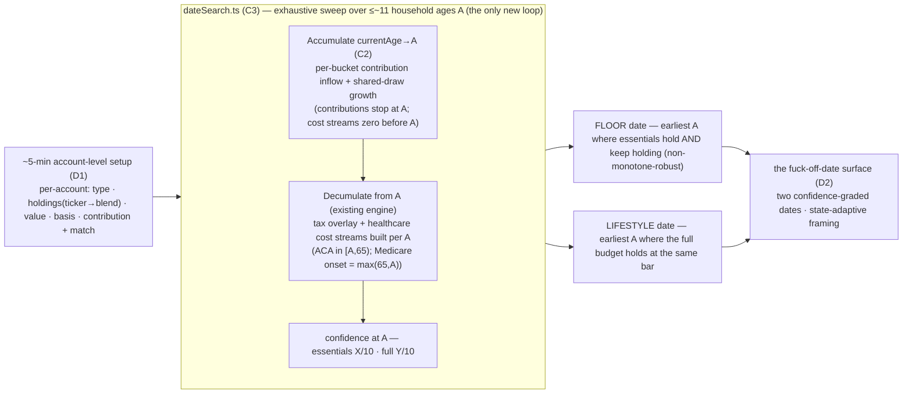
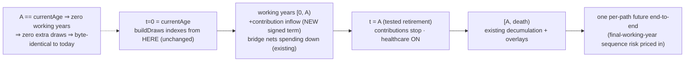

# The Fuck-Off Date — Full Projection (accumulation → decumulation)

> **This is a re-plan, not a greenfield plan.** It folds the ratified `the-fuck-off-date-requirements.md` (R26–R39) into the locked master plan set and sequences the new work against what is already SHIPPED (U0, U1, U2, U3·M1–M4) and PAUSED (U3·M5, HSA). It **amends** the U0–U17 roadmap — it does not renumber it (the shipped U0–U3 references are load-bearing across the codebase + insights). Paths are relative to `projects/the-back-nine/`.

## ⚠ STATUS — Round-3 (doc-review) fold PENDING before `ce:work`

This plan has had **two review rounds** (an adversarial pass → folded 15 findings; then a 6-lens document-review on the folded doc). The doc-review raised **25 confirmed findings (several P1)** consolidating to the **7 root issues** below — **two of which are regressions the round-2 fold itself introduced** (B, and the per-person form of A). **Round-3 must fold these BEFORE `ce:work`, and it should be a coherent REWRITE of the affected engine-contract sections (§2/§3/§6/§7, C2/C3 boundary algebra + the IRMAA/Medicare plumbing, D1/D2 routing, the U4 sequencing) — NOT more surgical patches** (patching is what introduced the round-2 regressions). The roots **interact** (A's date-offset model reshapes C/D/E), so fold them together, then re-run the doc-review to confirm clean and delete this section. Full per-finding evidence (with line cites) is in the workflow outputs `wf_0feee122-3bf` (round 1) + `wf_f8c188a6-eee` (round 2).

**A — The search variable is a household DATE-OFFSET `Y` (years-from-now), NOT an age `A`.** *[systemic — §3a/§3b/§7/C2/C3/D2]* The engine offsets are **per-person** (`simulate.ts:339-341`: `retire = p.retirementAge − p.currentAge`, each person's OWN `currentAge`), so the scalar `A − currentAge` is undefined for a different-age couple — the core model. **Fix:** sweep `Y` (a sim-year offset = the date itself; the answer is `today + Y`). For each *still-working* person set `retirementAge = currentAge_i + Y` ⇒ every working person's retire offset equals `Y` (they coincide by construction); an *already-retired* person keeps their entered `retirementAge` (never un-retired into phantom income). All household boundaries (contribution-stop, ACA-on, withdrawal-clamp) key off the single `Y`; the per-person 65-split inside the retired window stays the existing overlay behavior. Route predicate (D2): already-retired ⇔ `people.every(p => p.retirementAge <= p.currentAge)` (per-person pairing), NOT `max(retirementAge) <= currentAge`. Empty phase ⇔ `Y == 0`. `buildCandidateParams(Y)` is the single owner; the coincidence test uses a **different-age** couple.

**B — [P1, round-2 regression] Fold the overlay contribution AFTER the bucket-scale, at face value.** *[§2c/C2 — `taxOverlay.ts:1190-1226`]* The scale `scale = totalValue(state)/afterWithdrawal` (:1192) **IS the year's growth multiply**. My round-2 "fold before the scale" gives the contribution arrival-year growth (optimistic) or breaks Σ. **Fix:** compute `scale` on the contribution-EXCLUDED portfolio (pure `1+r`), then AFTER :1222-1226 set `dest = destPost*scale + C` (face value, no growth), add `C` to the authoritative total post-step (so Σ==total holds), `basis += C` UNSCALED for a taxable contribution; do NOT fold `C` into `drawPool`. Run goldens (c) destination-bucket + (d) direction on the **OVERLAY** path (`runTaxAwareDecumulation`/`taxOverlay.test.ts`), not just the spine (the smear/growth hazard is overlay-only).

**C — [P1] §7 clamp: gate on accumulation-active + truncate at per-person death + disclose its direction.** *[§7/C2 — `simulate.ts:99-137`, test `:182`]* (1) The clamp `net=0` for working years is orthogonal to contributions and **breaks the existing still-working-bridge test** (`simulate.test.ts:182`). Gate it on "an accumulation run was constructed" — a plain decumulation `simulate` stays byte-identical; reframe the reduce-to-spine condition as "no accumulation phase active," NOT "contributions=0." (2) Truncate each per-person contribution+match at `min(Y, deathOffset_i)` (mirror the bridge's dead-earner guard at `:122`) — place it **per-path** (cashTermsForYear-adjacent, where `deathOffsets` are in scope), NOT in `buildCandidateParams`; else a dead spouse's phantom contribution overstates the nest egg (optimistic). Add a death-mid-runway golden (needs `Y` large enough that a sampled death ≥ age 66 lands in-window). (3) The clamp is itself optimistic if a household draws while working — add a §6-style direction disclosure + a `cashTermsForYear` source comment.

**D — [P1] IRMAA working-year MAGI history is ≈$0 → understated post-onset surcharge (optimistic).** *[§3b/C3 — `taxOverlay.ts:1083-1084,1145-1153`]* The `irmaaMagiSeed` only covers `t < lookback`; for a member crossing 65 at `t ≥ lookback` (the common case) the lagged source `irmaaMagiHistory[t−lookback]` is a clamped working year recorded ≈$0 → lowest tier → understated cost → falsely-early date. **Fix:** `healthcareStreams`/`buildCandidateParams` supplies a per-year conservatively-high working-year IRMAA-MAGI **override**; the overlay writes that into `irmaaMagiHistory[t]` for working years (instead of `irmaaMagi(~0)`). Add a falsifiable test (member crosses 65 at `t≥lookback` off a working source → surcharge priced off the high MAGI, never ≈$0). Correct the §3b claim that the `t<lookback` seed covers post-onset years — it cannot.

**E — [P1] Medicare onset must be a PER-PERSON, SEPARATE predicate (not `count65`); add `simulate.ts` to C3.** *[§3b/C3 — `taxOverlay.ts:1082,1095,1110→350-353,1118`; `simulate.ts:311-315`]* (1) Onset is **per-person** `onset_i = max(person i's 65th sim-year, person i's work-stop)` — for the still-working it's `Y`, for the already-retired it's their 65th birthday. A single household `max(65,A)` wrongly suppresses a retired 66-yo spouse's IRMAA (optimistic). (2) `count65` is **overloaded** across 4 sites: IRMAA gate (:1082), IRMAA pricing-COUNT (:1095), deduction stack (:1110→`deductionStack`/`seniorBonusFor` :350-353 — the §63(f) age-65 deduction + OBBBA senior bonus, biological), ACA `pre65` (:1118). Introduce a **separate** `medicareEnrolled(i,t)` used ONLY at the IRMAA gate + pricing count; `count65` STAYS biological for the deduction + ACA. Do NOT redefine `count65` in `resolveYear`. (3) Add `src/engine/simulate.ts` to C3's Files and re-key the `validateParams` `irmaaMagiSeed`-coverage loop (:311-315) off the same per-person onset — else a work-past-65 candidate is forced **indeterminate** (silently dropped from the sweep → a wrong date). Tests: work-past-65 member prices ZERO IRMAA yet KEEPS the age-65 deduction; the retired-spouse-of-a-working-earner IS priced from 65; A≤65 stays byte-identical.

**F — [P1, security] U4 (crypto + encrypted store + schema ladder) must be BUILT and sequenced BEFORE D1.** *[D1 deps + suggested order]* `src/crypto/` and `src/store/` (beyond `engineClient.ts`) are **empty** — U4 is unbuilt — yet D1 introduces/persists all the new financial PII and treats `memoryModel.ts`/the no-write seam as pre-existing. **Fix:** add "built U4" to D1's Dependencies; insert U4 into the order (`… → C3 → U4 → D1 → D2`); state **no PII reaches IndexedDB until U4's encrypted record + the schemaVersion-2 migration entry exist**; the no-write seam test runs against U4's real store, not a stub.

**G — [P2] The lower-bound date selection has an unbounded PESSIMISTIC failure + an undefined no-date case.** *[§3c/C3]* For a borderline household the `p̂ − z·SE` haircut can sink EVERY in-window age below the bar → no date / silently the latest age — pessimistic (R25's other half, the exact gap the feature exists to close). **Fix:** (a) pin the date-search `paths` + `z` as a **designed tolerance** (choose `paths` so `z·SE` at the bar ≤ ~½ a band-quantum; reconcile with the ≤11× profile gate); (b) define the no-age-clears outcome honestly — a first-class **"no work-optional date within the ~N-yr window"** result (NOT the window-top age, NOT "never free," NOT a crash), surfacing the per-age curve in the calm voice; (c) floor + lifestyle terminate **independently** (floor may exist while lifestyle doesn't). Also resolves the "keeps-holding undefined when a dip never recovers in-window" deepen item.

**Deepen (fold alongside):** D1 surface-early — the in-progress date marching **earlier** as accounts are added is a *trust* hazard; label it provisional until a complete account set, and distinguish "confidence-band narrowing" (a virtue) from "the date value moving earlier" (a hazard) — a D1/D2 design landmine for `/emil-design-eng` + `/frontend-design`.

---

## Overview

The master thesis (v2) was **decumulation-only**: the engine starts at a given `initialPortfolio` and draws down. While scoping U3·M5 (the HSA bucket) we found — and have now **verified against source** — that the engine models **zero contributions to any bucket**: `cashTermsForYear` (`src/engine/simulate.ts:99-137`) returns `net: Math.max(0, spending − earned − ss)` (the inline comment at `:143` reads *"never a contribution back"*), and `stepYear` (`src/engine/decumulation.ts:46-66`) computes `afterWithdrawal = totalValue(state) − netWithdrawal` — **subtraction only; there is no inflow path**.

This re-plan adds the **pre-retirement saving phase** and reframes the accumulation-side magic moment as **the fuck-off date** (the *work-optional* date). The product is **not a new engine** — it is the existing confidence engine run *backwards*: search the household retirement age over the existing decumulation engine, project the savings runway forward to each candidate age, decumulate from there, and read the confidence; the earliest age the floor holds is the answer. The locked lexicographic objective (R21) makes it **two** confidence-graded dates.

It also **resumes U3·M5** on the decumulation side, reshaped per R38: HSA **spend** stays in decumulation (the paused milestone); HSA **contributions** fold into the new accumulation work.

## Problem Frame

The Back Nine answers *"can we retire, and how do we do it best?"* — but only for a household that hands it a retirement-onset balance. Its real users (Briggsy + friends, **mid-50s, working by choice not necessity**) ask a sharper question first: **"When can I fuck off — am I 5 years out, 7, or there now?"** Today the tool can't answer that, because it never models the years where you're still earning and still saving, so it would understate a not-yet-retired user's nest egg — **calm-but-wrong in the pessimistic direction** (R25). This is **not** a generic "are you on track" savings calculator (a commoditized space) — it is a **bounded on-ramp** for a near-retirement household in service of the same novel thing, the recommend-second decumulation strategist. Accumulation is the runway that lets us *solve for the date*; the draw-down strategy stays the center of gravity. (See origin: `docs/brainstorms/the-fuck-off-date-requirements.md`.)

## Requirements Trace

Every requirement maps to a track/unit. Numbers are from the origin doc (R26–R39). `MR` = the master requirements amendment.

| Req | Where |
|---|---|
| **R26** the fuck-off date = the existing engine searched over retirement age; **non-monotone-robust** exhaustive sweep, never a bisection | C3 (`dateSearch.ts`) |
| **R27** the answer is **two dates** (floor + lifestyle) from the lexicographic objective | C3 (engine) + D2 (surface); the two-track split rides P3·U9's degenerate-collapse |
| **R28** both dates **confidence-graded**, never hard lines; re-grade on strategy override | C3 + D2 |
| **R29** framing **adapts to user state** (date for not-yet-retired; spine confidence for already-retired) | D2 (state-adaptive first answer) |
| **R30** model the pre-retirement accumulation phase (contributions + growth → retirement-onset balance + basis) | C2 (accumulation projection) |
| **R31** contributions **per-account, flat-real, stop at the tested age**; employer **match** captured | C2 (engine) + D1 (intake) + C1 (limit constants) |
| **R32** v1 **projects**, does not optimize accumulation; solver stays decumulation-only | Scope Boundaries; C3 (date-search ≠ solver) |
| **R33** healthcare **OFF during accumulation, ON at the tested age** | C3 (`buildCandidateParams(A)` constructs per-candidate cost streams — the engine has no retirement gate, §3b) + C2 |
| **R34** accumulation **inherits the engine invariants** — ONE continuous absolute-year draw timeline (CRN); one per-path future end-to-end; empty phase reduces byte-identically | C2 (the load-bearing engine contract) |
| **R35** the first answer comes from a **~5-min account-level guided setup**, surface-early, single entry pass | D1 (intake reshape) + MR (the one master Success-Criterion edit: ~3-min → ~5-min) |
| **R36** account **values user-entered; no live price lookup** | D1 + Scope Boundaries |
| **R37** per-ticker holdings **collapse to one household stock/bond/cash blend**; bundled ticker→asset-class table + manual classification | C1 (`tickerBlend.ts`) + D1 (entry + manual fallback) |
| **R38** HSA **contributions → accumulation**; HSA **spend → decumulation** (the paused U3·M5) | C2 (contributions) + B1 (U3·M5 spend) |
| **R39** new PII inherits encryption + the schema ladder (additive `schemaVersion` bump) | C2/D1 schema fields; consumed by P1·U4's migration ladder |

## Scope Boundaries

- **Not** a decades-out FIRE / "are you on track" calculator — bounded to a **near-retirement on-ramp** (protects the decumulation-strategy thesis; avoids commoditization).
- v1 does **not optimize** accumulation — no contribution-strategy recommendations; the solver's controls stay **decumulation-only** (sequencing + conversion).
- **No live market data / price feeds** — account values are user-entered (R36; consistent with `connect-src 'self'` + offline-first + deterministic replay).
- **No accumulation-phase income-tax engine** and no working-years budget detail — only contributions + growth affect the end balance; tax character rides the **destination bucket** (R34).
- **No raise / promotion / career modeling** — flat-real contributions (R31).
- **The "retired-but-still-contributing" HSA-MAGI edge is bounded + disclosed, not modeled** (see Key Decisions §6) — a decided one-directional simplification, never an unbounded omission.

### Deferred to Separate Tasks (future versions — named, not in this MVP)

- **Optimizing accumulation** — traditional-vs-Roth contribution allocation to pull the date in (a genuine *tax* optimization the solver could own, deferred for sequencing — not an off-thesis exclusion; R32).
- **A 3-asset cash sleeve** — v1 folds `cash` into the bond sleeve (the engine is 2-asset; a separate cash draw would break the 2-asset CRN contract).
- **Target-date-fund glide curves** — v1 ships a static-snapshot blend per TDF; the years-to-target glide approximation is the correctness upgrade (Key Decisions §5).
- **Roth employer match** (SECURE 2.0 §604, optional plan feature) — v1 routes all match to pre-tax (the default rule).
- **Per-person asymmetric retirement-age search** — v1 searches **one household work-stop age** (the date is a household date); per-person retirement asymmetry stays an editable assumption applied on top.

## Context & Research

### Relevant Code and Patterns (verified against source this session)

- **The cash-term seam** — `cashTermsForYear` (`src/engine/simulate.ts:99-137`) returns `{net, ss}`; `net` is clamped at 0 (*"never a contribution back"*, `:136`/`:143`). The accumulation inflow is a **new signed term** alongside this seam, not a change to the clamp's spending semantics.
- **The one per-year update** — `stepYear` / `runDecumulation` (`src/engine/decumulation.ts`) is contract #3 (the historical backtest + the MC spine both run through it). It is single-pool and **subtraction-only**; the accumulation inflow extends it with a signed flow.
- **The draw schedule** — `buildDraws(seed, paths, maxHorizon, peopleCount)` (`src/engine/simulate.ts:47-73`) is a pure function of **dimensions only**, allocated to `maxHorizon`, indexed by **absolute year from `currentAge` (t=0)**. The timeline **already spans currentAge→death** (the earned-income bridge already occupies the working years), so accumulation reuses existing year slots — it does **not** add a draw stream or change `maxHorizon` (R34's "one continuous timeline" is already the architecture; see Key Decisions §1).
- **The bucket model** — `OverlayParams.buckets {taxable, pretax, roth}` + a single aggregate `initialTaxableBasis` scalar (`src/shared/model.ts:177-245`); `validateParams` (`src/engine/simulate.ts:235-239`) enforces `Σbuckets == initialPortfolio`. Basis is **per-bucket aggregate, not per-lot** — this resolves the per-lot/per-account question (Key Decisions §4).
- **The schemaVersion-2 shape** — `ScenarioV2.accounts: PersonAccounts[]` (`src/shared/model.ts:400-434`) already carries per-person `{birthYear, taxable, taxableBasis, pretax, roth}`. Accumulation extends it **additively** with per-account contribution + employer-match fields (R39).
- **The M3/M4 healthcare gate is the biological-65 split + a per-year premium stream — NOT a retirement boundary (corrected after review).** The overlay prices ACA only when `pre65 = livingCount − count65 > 0` **AND** a finite-positive `enrolledPremium[t]` is supplied, and IRMAA only when `count65 > 0` (`src/engine/taxOverlay.ts:1082,1118-1131`; `simulate.ts:293-316`). There is **no retirement-age input** anywhere in the overlay. So R33's "healthcare ON at the tested age" is **new caller-side work**: the date-search must *construct* per-candidate cost streams (`enrolledPremium`/`slcsp`/`irmaaMagiSeed` zero for working years, real from the tested age) — the streams *are* the gate. (See Key Decision §3b; this was a load-bearing error in the first draft, flagged by 4 review lenses.)

### Institutional Learnings (read before executing)

- **DND/012 (externally-derived fixtures)** — the accumulation goldens (projected balance at age A) must be derived by **independent hand-math** (compound a flat-real contribution + a fixed return sequence by hand/spreadsheet), never via the engine's own formula. Same discipline as Trinity/Bengen/§36B.
- **insights 008/010 (NaN-first guards)** — every new input stream (per-bucket contributions, employer match, the ticker blend, the tested-age list) carries a `Number.isFinite`-FIRST R19 guard at **both** `validateParams` AND the overlay/date-search backstop (the standing as-we-go decision). A NaN sails through every relational guard.
- **insight 013 (a discontinuity breaks a root-finder's monotonicity)** — this is the **direct precedent** for R26's non-monotone-robust date-search: the ACA 400%-FPL cliff is a documented engine discontinuity, so a *later* retirement age is **not** guaranteed safer. The date-search must be an **exhaustive** evaluation across the bounded age window, never a monotonicity-assuming bisection that could return a **false-earliest** date.
- **insight 014 (a mid-sim state change moves a threshold — test the crossing year)** — the HSA `generalDrawableTotal` vs hsa-inclusive total split is dark at `hsa=0`; test the crossing, not just static positions.
- **burned/057,061,063 (one canonical constants table)** — the new contribution-limit + ticker-blend figures live in **one** year-keyed module each, read by engine/intake/tests; never re-typed. A shape test asserts every figure carries `{value, citation, directionalUntilPinned}`.
- **The reduce-to-spine golden invariant** — every overlay reduces **byte-identically (same seed)** to the Trinity/Bengen spine when OFF. The accumulation inflow gets its **own** OFF condition (all contributions 0) and its own byte-identical test; the empty-phase (no working years — date-search candidate `A == currentAge`, or a household already at its work-stop) case is byte-identical *for free* (no extra draws — §1).

### External References (researched this session — sources to pin under the constants discipline; figures are NOT inlined here)

- **2026 contribution / annual-additions limits** — IRS **Notice 2025-67** (published 2025-11-13): 401(k)/403(b) elective deferral + age-50 catch-up; IRA limit + the now-indexed IRA catch-up (SECURE 2.0 §108); the §415(c) annual-additions ceiling. **One notice covers four figures.**
- **2026 HSA limits + HDHP definitions** — IRS **Rev. Proc. 2025-19** (published 2025-05-01): HSA self-only/family limits, the **age-55 catch-up ($1,000, statutorily fixed — NOT indexed**, hard-code it), HDHP minimum-deductible + max-out-of-pocket. Per-person, per-account catch-up (matters for the couple).
- **SECURE 2.0 §109** — the 60–63 "super catch-up" (greater of $10k or 150% of the regular catch-up; the $10k floor indexed; an **optional** plan feature). Carried as `legalBasis` provenance on the catch-up constant.
- **Employer match (the bucket-routing fact)** — confirmed: employer matching contributions are **pre-tax (traditional) by default regardless of whether the employee defers Roth**; a Roth employer match (SECURE 2.0 §604) is *optional + taxable-in-year-made* — **deferred**. This validates R31's "match is pre-tax even on a Roth 401k."
- **SECURE 2.0 §603 (Roth-mandatory catch-up for high earners, effective 2026)** — **NOT modeled in v1**: the user enters their actual per-account contribution amounts, which already reflect whichever bucket their catch-up lands in, so the routing is captured at intake without an engine rule.
- **Ticker → asset-class** — bundled ~60–80-row category table keyed on the **issuer share-class family** (VTI == VTSAX → one row); citation = the issuer product-page allocation panel, with **SEC EDGAR N-PORT** as the independent (DND/012) backstop. Cash folds into the bond sleeve (v1). TDFs ship a static snapshot. Manual fallback = a 3-choice "mostly stocks / bonds / cash" picker + an advanced exact-% expander.

## Key Technical Decisions (the deferred-to-planning items, now resolved)

1. **ONE continuous absolute-year draw timeline — already the architecture (R34).** The engine timeline already starts at `currentAge` (t=0) and the bridge already occupies the working years. Accumulation adds a per-bucket **contribution inflow** into those existing working-year slots — it does **not** add a draw stream and does **not** change `maxHorizon`/draw dimensions. Consequence: the empty phase (`currentAge == retirementAge`, or all contributions 0) is **byte-identical to today's decumulation-from-`initialPortfolio`** *for free*, and CRN across candidate retirement ages holds by the same argument the solver's K-candidate CRN holds (a tested age moves *which* draws are consumed by which phase, never *how many* or their order). **This eliminates the requirements doc's scariest risk** (a separate pre-phase draw-stream handoff silently breaking the ranking) — it is structurally impossible because there has only ever been one stream.

2. **The signed cash-flow term + its own reduce-to-spine golden.** `stepYear` gains a per-year signed flow: spine path `afterFlow = total − withdrawal + contribution`; overlay path takes a **per-bucket** contribution stream (each lands in its destination bucket at **full basis** — a taxable contribution raises value *and* the running basis ledger; pretax/roth raise value only; **employer match → pretax even on a Roth 401k**). **Working-year withdrawals are clamped to zero, so contributions and withdrawals are TEMPORALLY DISJOINT** (§7 below) — a working year (`t < A−currentAge`) carries an inflow and no draw; a retirement year (`t ≥ A−currentAge`) carries a draw and no inflow (contributions stop at A, R31). No year ever does both, which keeps the within-year accounting clean. **Within-year order is PINNED (contract #3): a contribution is credited END-OF-YEAR — AFTER the return step (`afterReturns + contribution`), so a contributed dollar earns NO growth in its arrival year.** This is the **conservative** direction: real flat-real payroll contributions arrive across the year (~half a year of growth on average), so crediting them with *full*-year growth (the "mirror the start-of-year withdrawal" convention) would **overstate** the retirement-onset balance → an earlier reported date → the calm-but-wrong-**optimistic** sin (R25); crediting them end-of-year **understates** it → a later/safer date, never optimistic. (Pin this with a `stepYear` source comment mirroring `cashTermsForYear`'s documented conservative-direction comment at `simulate.ts:129-133`.) **No accumulation-phase income-tax engine** — the destination bucket carries the tax character (R34). New goldens: (a) all contributions 0 ⇒ byte-identical to the spine; (b) `Σbuckets == runningTotal` after **every** contribution year (the inflow analog of the decumulation sum invariant — the total now *grows*); (c) **a DESTINATION-bucket golden** — after a contribution year the *named* destination bucket increased by exactly the contribution and the *other* buckets changed only by the shared growth factor. Golden (c) is load-bearing because the overlay reconciles buckets by **scaling each to the authoritative post-step total** (`taxOverlay.ts:1190-1226`); a contribution folded into the total but not its destination bucket would be **smeared proportionally across all buckets** (an asset-location violation) — and golden (b)'s `Σ==total` check **passes** under that smear (the scale forces the sum), so it cannot catch it. (d) **a direction golden** — a contribution year with a positive return yields a retirement-onset balance **≤** the start-of-year-credited balance (proving the conservative convention shipped).

3. **The date-search is NOT the solver, but it is NOT bias-free either.** It is an outer **exhaustive** sweep over a bounded household-retirement-age window (≤~11 ages, R26), each candidate running the existing `simulate` on the **same seed**. The earliest-age decision is **non-monotone-robust** (insight 013): report the earliest age at which a date's condition holds **and keeps holding for every later in-window age**, disclosing any non-monotone region; **never a bisection** (the ACA cliff breaks "later = safer", which could return a structurally false-earliest date). **a) Per-candidate parameter construction is NEW work — "set the tested age = A" is not one knob.** Each candidate `A` requires a `buildCandidateParams(A)` transform that derives, from one `A`: both persons' `retirementAge = A` (drives the earned-income bridge stop at `simulate.ts:122`); the per-bucket contribution streams truncated to `[0, A−currentAge)`; and the **healthcare cost streams** (next point). The transform is the single owner of per-candidate construction (a `buildCandidateParams` helper, tested so all three boundaries coincide at `A−currentAge` — a planted off-by-one in any one fails). **b) "Healthcare ON at A" is STREAM CONSTRUCTION, not an existing age-gate** (the plan's original "sets the M3/M4 age-gate boundary to A — not a new mechanism" was **false against source**, caught by review). The overlay's ACA gate keys off `pre65 = livingCount − count65 > 0` **AND** a finite-positive `enrolledPremium[t]` (`taxOverlay.ts:1118-1131`); IRMAA keys off biological 65 (`count65 > 0`). There is **no retirement boundary** in the engine. So `buildCandidateParams(A)` must build `enrolledPremium[t]`/`slcsp[t]` = 0/absent for working years `[0, A−currentAge)` and the user-entered real values for the pre-65 retired window `[A, 65)`; and **Medicare/IRMAA onset = max(65, A)** (employer coverage past 65 delays Medicare enrollment — the *correct* real-world model, and the only off-switch for a member working past 65 since no premium stream gates IRMAA), which requires a **new Medicare-onset signal** the date-search supplies to the overlay (the existing decumulation case `A ≤ 65` is unaffected — onset stays 65). The `irmaaMagiSeed` for the first post-onset Medicare years (whose 2-yr-lagged MAGI falls in un-modeled working years) is **seeded conservatively-high** from the entered working-year income → modeled surcharge ≥ reality → date pushed later/safe. **c) Selection-bias defense (the optimizer's-curse-LITE the original plan wrongly dismissed).** `survivalFraction(A) = survivors/paths` is an MC point estimate with per-age standard error ≈ `√(p̂(1−p̂)/paths)`; selecting the **earliest** age whose noisy estimate clears the bar is a threshold-crossing argmin that biases the date **earlier** (the lucky-noise age gets crowned — calm-but-wrong-optimistic). Because all ages share one CRN seed, their errors are *positively correlated*, so "keeps holding" rubber-stamps rather than catches the false-early age. **Defense (ships in P1, no seed-B needed):** select the earliest age whose **conservative lower confidence bound** (`p̂ − z·SE`, not the point estimate) clears the bar, and assert a two-independent-seeds stability test (the luckier seed must not report an earlier date). When U14's held-out seed-B machinery lands, route the final *displayed* grade through it (symmetric with U14's "a grade that flips across independent draws is forced to the conservative reading"). It still needs **no full seed-B apparatus** — just the per-age SE margin. Compute = ≤11× a single `simulate`; a **profile gate** (mirroring P4·U15's `profile.ts`) measures it on a mid-tier device and defers the WASM threshold to measurement.

4. **Per-account, not per-lot, basis.** The engine consumes a single aggregate `initialTaxableBasis` (verified). Collect basis **per taxable account** (summed to the per-person `PersonAccounts.taxableBasis`, summed to the aggregate). Per-lot basis is collectible-but-unused precision — **don't collect it** (scope-guardian).

5. **Ticker → one household blend; cash → bond; TDFs static.** Per-ticker holdings collapse to a single household stock-vs-(bond+cash) blend feeding the engine's one `stockWeight` (R37; the engine is 2-asset, so a separate cash sleeve is deferred). Target-date funds ship a **static-snapshot** blend per fund (disclosed "today's allocation, held constant"); the years-to-target glide curve is the named correctness upgrade. An unrecognized ticker routes to a manual 3-choice classifier (+ an advanced exact-% expander). All blends carry an issuer/EDGAR citation, directional-until-pinned.

6. **The "retired-but-contributing" HSA-MAGI edge → disclose (the one-directional argument) + a falsifiable empty-overlap invariant, NOT a vacuous test.** By R31 (contributions stop at the tested retirement age) + R33 (healthcare OFF until the tested age), the overlap window (retired + on ACA + still funding an HSA) is **structurally empty** in the v1 model — contributions occupy `[0, A)`, ACA pricing occupies `[A, 65)`, **zero overlap**. The *direction* argument (a real such person's pre-65 HSA contribution would only **lower** ACA-MAGI → **weakly raise** PTC, monotone *including across the cliff step* → weakly lower cost → an *earlier* real date; so omitting it can only push the *modeled* date **later** — the conservative direction, never the calm-but-wrong-optimistic sin R25) is **user-facing disclosure copy** ("if you keep funding an HSA after you stop full-time work, your real free-date may be slightly earlier"), **not** an engine test. **Why not a test:** since the overlap is empty in v1, "the date with the deduction omitted vs the date with it modeled" compares against a code path that doesn't exist and would touch zero priced years — `date == date`, vacuously true (worse than a DND/012 own-formula golden). **Replace it with a FALSIFIABLE structural invariant the engine can actually violate:** across the date-search, **no priced ACA year (`healthcareEnabled`, `enrolledPremium[t] > 0`, pre-65) ever carries a nonzero per-bucket contribution stream** — the contribution-stop boundary and the healthcare-on boundary are the *same* `A` for every candidate (§6 invariant; it is the same coincidence `buildCandidateParams(A)` enforces, §3a). A planted candidate where a contribution year overlaps a priced ACA year **fails** the invariant. This makes "conservative direction" an *architectural property the engine enforces* (contributions and ACA pricing are mutually exclusive in time), not a vacuous comparison. Modeling the pre-65 HSA-contribution MAGI deduction is a future enhancement (option (a) in the origin doc's Scope Boundary). *Recommendation led — redirect if you want option (a) modeled in v1.*

7. **Working-year portfolio withdrawals are clamped to zero (the cash-flow-coherence fix).** `cashTermsForYear` (`simulate.ts:110-136`) computes `net = max(0, annualSpendingReal − earned − ss)` **every** year from `t=0` against the single **retirement** budget — so in a working year where the retirement spend exceeds salary + SS, the portfolio is silently **drawn down during accumulation** *while* a contribution is also being added: incoherent double-counting (you cannot both save and fund a spending gap from the same household cash), and it contradicts the Scope Boundary "only contributions + growth affect the end balance." **Fix:** clamp the portfolio withdrawal to **0** for every year before the household work-stop age `A` (`net = 0` for `t < A−currentAge`) — the savings phase funds living from salary, not the portfolio. This is what makes the contribution/withdrawal **temporal disjointness** of §2 hold, leaves the empty-phase reduce-to-spine golden unaffected (`A == currentAge` ⇒ no working years ⇒ nothing clamped), and avoids adding a working-years budget input (which v1 deliberately omits). A C2 test asserts **no** portfolio withdrawal in any year `t < A−currentAge`, even when `annualSpendingReal > earned + ss`.

## Open Questions

### Resolved During Planning

- *Contribution-inflow mechanics?* → §2 (signed per-bucket term, full-basis entry, match→pretax, within-year timing pinned, two new goldens).
- *Date-search compute budget / WASM trigger?* → §3 (exhaustive ≤11-age sweep; profile gate; WASM threshold deferred to measurement; draw dims unchanged for the empty case, verified).
- *Per-lot vs per-account basis?* → §4 (per-account; the engine consumes one aggregate).
- *Ticker→asset-class table?* → §5 + C1 (bundled category table, issuer/EDGAR citation, TDF static, manual fallback).
- *2026 contribution/HSA constants?* → C1 (Notice 2025-67 + Rev. Proc. 2025-19 + SECURE 2.0 §§108/109; figures pinned under constants discipline, not inlined).
- *The retired-but-contributing omission?* → §6 (the one-directional argument is disclosure copy; a falsifiable empty-overlap invariant — no priced ACA year carries a contribution — is the engine guard, not a vacuous date==date test).
- *One household age vs per-person search?* → one household work-stop age in v1 (Scope Boundaries).
- *Two dates from the first answer?* → coincident in the degenerate single-total-spend case; the budget two-track split (P3·U9) separates them — the date-search rides U9's existing degenerate-collapse, it does not rebuild the budget.

### Deferred to Implementation

- The exact **bounded age-window** width (≤~11; tune against the profile + the cold-read).
- The WASM **promotion threshold** + the mid-tier reference device (instrument-first, per the eye-in-loop discipline).
- The exact **bundled ticker list** (the ~60–80 rows) and per-fund TDF snapshots (a data-transcription task under the constants discipline; the *structure* is decided in C1).
- The **progressive intake UX** for the ~5-min account flow (a P2 design surface; load `/frontend-design` + `/emil-design-eng` when UI work begins — UI has not started).
- The in-product **label** for "fuck-off date" (the working/product name; the user-facing readout holds the calm advisor voice — confirm at design time, R29).

## High-Level Technical Design

> *Directional guidance for review, not implementation specification. The implementing agent treats it as context, not code to reproduce.*

**The fuck-off date = the existing engine searched over retirement age (one continuous draw timeline):**

**The one continuous absolute-year timeline (why CRN/reduce-to-spine survive):**

**The fold map (how R26–R39 lands in the U0–U17 structure — amend, don't renumber):**

| Existing | Amendment |
|---|---|
| Master requirements (R1–R25) | + R26–R39; the ~3-min Success Criterion → ~5-min account-level / surface-early (the one master edit) |
| Roadmap (U0–U17) | requirements trace + scope + key decisions + validation gates extended |
| P1 Foundation | + accumulation projection (C2), the date-search (C3), contribution + ticker constants (C1) |
| P2 First Answer (U5 intake, U7 surface) | reshaped: account-level setup (D1), state-adaptive date surface (D2) |
| P3·U9 budget | the two-date split rides U9's degenerate-collapse (note only) |
| U3·M5 (HSA) | resumes spend-only (B1); contributions move to C2 |

## Implementation Units

The work is four tracks. **Track A (doc reconciliation)** and **Track B (HSA spend)** are independent of each other and of the engine track and can start immediately and in parallel. **Track C (engine)** is the foundational pivot; **Track D (intake + surface)** consumes it. Suggested order: **A ∥ B1 → C1 → C2 → C3 → D1 → D2**.

---

### Track A — Source-of-truth reconciliation (decisions, not code)

- [ ] **A1: Fold R26–R39 into the master requirements**

**Goal:** The master requirements doc (`docs/brainstorms/the-back-nine-requirements.md`) becomes the single source of truth for the full accumulation→decumulation thesis.

**Requirements:** MR (all of R26–R39 made first-class master requirements).

**Dependencies:** None.

**Files:**
- Modify: `docs/brainstorms/the-back-nine-requirements.md`

**Approach:**
- Add an amendment banner (dated 2026-06-08) recording the decumulation-only → full-projection expansion, mirroring the v1→v2 reset banner.
- Append R26–R39 verbatim-in-intent under a new **"Accumulation → the Fuck-Off Date"** requirements section (the origin doc's text is already 6-persona document-reviewed; carry it, don't re-derive it).
- **The one master edit (R35):** reconcile the Success Criterion *"first confidence statement in one short sitting … under ~3 minutes … on a single total spend figure"* to the **~5-minute account-level guided setup, surfacing-early** — for a serious-money tool the wow is *"it knows my real situation,"* and the same data feeds the withdrawal-sequencing strategy. State that the single-total-spend on-ramp is superseded by the account-level setup for the not-yet-retired flow, and the answer **surfaces and sharpens during** the flow rather than gating behind a final calculate.
- Extend the Product Model section: the spine answer adapts to user state (date for not-yet-retired, confidence statement for already-retired — R29); the date is delivered as two confidence-graded dates (R27/R28).
- Extend Scope Boundaries + Key Decisions with the §1–§7 decisions above (accumulation IN; optimize-accumulation OUT; no live quotes; the working-year withdrawal clamp; the retired-but-contributing disclose+invariant).
- **Correct R33's inherited mechanism wording** when folding: the origin R33 says "the existing overlays … key off the tested retirement age" — but the engine's healthcare gate is the biological-65 split + a per-year premium stream, with **no** retirement boundary (§3b). Record the real mechanism in the master: healthcare-on-at-A is the date-search **constructing per-candidate cost streams** (zero before A, real from A; Medicare onset = `max(65, A)`), not an existing gate boundary — so a future reader of the master requirements doesn't re-inherit the mischaracterization.

**Execution note:** Documentation reconciliation — preserve every existing R1–R25 unchanged except the named R35 Success-Criterion edit; this is an *additive* extension, not a rewrite (the diary/drift anti-pattern: don't silently re-touch unrelated sections).

**Test scenarios:** `Test expectation: none — documentation reconciliation.` Verification is a cross-read: every R26–R39 appears in the master with its origin intent intact, and the ~3-min criterion is reconciled (not duplicated, not left contradictory).

**Verification:** A reader of the master requirements alone sees the full accumulation→decumulation thesis; no surviving sentence still claims a 3-minute single-total-spend on-ramp as the success bar; R26–R39 are traceable.

---

- [ ] **A2: Amend the roadmap**

**Goal:** The roadmap (`docs/plans/back-nine-mvp/roadmap.md`) reflects the new tracks/units, scope, decisions, and validation gates without renumbering the shipped U0–U17 references.

**Requirements:** MR.

**Dependencies:** A1.

**Files:**
- Modify: `docs/plans/back-nine-mvp/roadmap.md`

**Approach:**
- Extend the **Requirements Trace** table with R26–R39 → the tracks/units of this plan.
- Extend **Scope Boundaries**: accumulation IN; optimize-accumulation OUT (chapter-two); no live quotes (R36); the retired-but-contributing bound+disclose (§6); cash→bond + TDF-static (Deferred to Separate Tasks).
- Extend **Key Technical Decisions** with §1 (one continuous draw timeline), §2 (the signed inflow term + its golden), §3 (the date-search is not the solver; non-monotone-robust).
- Extend **Validation Gates**: the contribution-limit + ticker-blend constants are **directional-until-pinned** (Notice 2025-67 / Rev. Proc. 2025-19 / issuer-or-EDGAR), and the date-search carries the **non-monotone-robust** contract (insight 013) + the empty-phase byte-identity gate.
- Add the fold map (the table above) so a roadmap reader sees the amend-don't-renumber relationship.

**Execution note:** Point to this plan as the live home of the accumulation units (the roadmap stays the index; this plan carries the per-unit detail).

**Test scenarios:** `Test expectation: none — documentation.`

**Verification:** The roadmap's requirements trace covers R1–R39; the new decisions + gates are present; no shipped U-number is renumbered.

---

- [ ] **A3: Amend the affected phase docs**

**Goal:** The phase docs carry the new units at their correct altitude.

**Requirements:** MR.

**Dependencies:** A2.

**Files:**
- Modify: `docs/plans/back-nine-mvp/phase-1-foundation.md` (add C1/C2/C3 as Phase-1 engine units; note the new cross-cutting contract: the signed inflow on the one continuous timeline)
- Modify: `docs/plans/back-nine-mvp/phase-2-first-answer.md` (reshape U5 → the account-level setup D1; add the state-adaptive date surface D2; note the tax-blind-on-ramp design is superseded for the not-yet-retired flow)
- Modify: `docs/plans/back-nine-mvp/phase-3-controls.md` (note: the two-date split rides U9's degenerate-collapse — no new budget mechanism)

**Approach:** Land each new unit's Goal/Files/Approach/Test-scenarios/Verification (carried from Tracks C/D below) into its phase doc, preserving the existing units. Add the one new Phase-1 cross-cutting contract (the signed-inflow timeline) to the Phase-1 contracts preamble.

**Test scenarios:** `Test expectation: none — documentation.`

**Verification:** Each phase doc is internally consistent with this plan; the shipped units are untouched; the new units are dependency-ordered within their phase.

---

### Track B — Decumulation HSA spend (independent; resume first/parallel)

- [ ] **B1: U3·M5 — HSA 4th bucket (SPEND side), reshaped**

**Goal:** Extend the engine to a fourth account bucket — HSA **spend** behavior on the decumulation side — MAGI-invisible for qualified medical spend, ordinary-income (raising both MAGIs) for post-65 non-qualified spend, owner-age-keyed Medicare-premium privilege, the ACA-premium-not-qualified trap, Medicare-zeroes-contribution. **Spend-only** — HSA contributions belong to accumulation (C2).

**Requirements:** R24 (HSA fourth bucket), R38 (the spend/contribution phase split), R19 (engine numeric half), the correctness success criterion.

**Dependencies:** Shipped U3·M1–M4 (the healthcare overlay, the two MAGI calculators, the ACA fixed-point, the IRMAA lag). Independent of the accumulation track. *(The full M5 spend understanding-map — 6-reader verbatim contracts + integration points — is recoverable from run `wf_29e52525-1d0`.)*

**Files:**
- Modify: `src/engine/healthOverlay.ts` (HSA qualified-spend cap + the post-65 non-qualified income-inclusion path; the MAGI-invisibility rule)
- Modify: `src/engine/taxOverlay.ts` (the `hsa` bucket in the per-year ledger; `generalDrawableTotal` (taxable+pretax+roth) vs hsa-inclusive total split)
- Modify: `src/shared/model.ts` (`AccountBalances` + `PersonAccounts` gain `hsa`; an `OverlayParams` per-year out-of-pocket-medical stream the qualified spend is capped to; owner-age keying) under the schemaVersion-2 additive bump
- Modify: `src/engine/simulate.ts` (`validateParams` NaN-first R19 guards for the new HSA streams at BOTH layers; the bucket-sum invariant gains `hsa`)
- Test: `src/engine/__tests__/healthOverlay.test.ts`, `src/engine/__tests__/taxOverlay.test.ts`, `src/engine/__tests__/simulate.test.ts`

**Approach:**
- HSA spending is **MAGI-invisible to both calculators ONLY for qualified-medical withdrawals** — capped at the year's qualified-medical cost (a modeled out-of-pocket-medical stream + owner-65+ Medicare premiums). Covers out-of-pocket + (owner 65+) Medicare premiums tax-free — **NOT** ACA marketplace premiums (the trap).
- A **post-65 non-qualified withdrawal is ordinary income that RAISES both ACA-MAGI and IRMAA-MAGI** (the 20% penalty waived after 65, income inclusion is not) — the laundering negative test; HSA outflow is never a blanket MAGI-free source.
- The 65+ Medicare-premium privilege is keyed to the **HSA OWNER's age**, not the spouse's.
- HSA is **excluded from the general drawdown order** (`generalDrawableTotal = taxable + pretax + roth`); HSA outflow is qualified-medical-only. The hsa-inclusive total is a distinct quantity — **test the crossing** (insight 014: the split is dark at `hsa = 0`).
- **Reduce-to-spine:** `hsa = 0` (no HSA bucket) ⇒ byte-identical to the current overlay; an empty HSA stream is the byte-identical default (the M3/M4 as-we-go pattern).
- All new streams carry `Number.isFinite`-first R19 guards at `validateParams` AND the overlay backstop (the standing decision, insights 008/010).

**Execution note:** Test-first on the **reduce-to-spine** (`hsa=0` byte-identical) and **the laundering negative test** (post-65 non-qualified withdrawal raises both MAGIs), then the qualified-spend cap, then owner-age keying. Externally-derive every fixture (DND/012).

**Patterns to follow:** U2/U3's overlay shape (zero-draw cash-term transform); `burned/027` (pair every reduce-to-spine absence-assertion with a presence companion that an HSA spend actually moved a MAGI); `burned/062` (no in-range default for the OOP-medical stream); insight 014 (test the `hsa=0`→`hsa>0` crossing).

**Test scenarios:**
- Golden (reduce-to-spine): `hsa = 0` (or absent) ⇒ byte-identical to the current overlay distribution (same seed). Presence companion: with an HSA bucket + a qualified spend, the distribution differs and at least one path actually spent HSA MAGI-invisibly.
- Edge (qualified spend MAGI-invisible): a qualified-medical HSA withdrawal moves **neither** MAGI; it is capped at the year's qualified-medical cost (OOP + owner-65+ Medicare premiums).
- Error path (laundering negative test): a post-65 **non-qualified** HSA withdrawal raises **both** ACA-MAGI and IRMAA-MAGI (general spending cannot be routed MAGI-free through the HSA).
- Edge (owner-age keying): the owner-65+ Medicare-premium privilege does **not** apply when only the spouse is 65+.
- Edge (the ACA-premium trap): HSA cannot pay an ACA marketplace premium in the normal case.
- Edge (the total split, insight 014): a query of `generalDrawableTotal` vs the hsa-inclusive total diverges exactly when `hsa > 0`; planted `hsa = 0` shows them equal (the split is dark there).
- Edge (R19, NaN-first): a NaN/Infinity/negative OOP-medical stream or HSA balance returns the defined indeterminate output at `validateParams` AND throws at the overlay backstop; finiteness checked **before** any relational guard.
- Edge (constants single-source): every HSA-related figure routes through `src/engine/constants/`, marked directional.

**Verification:** The overlay reduces byte-identically to the pre-M5 overlay when `hsa = 0` (and demonstrably moves a MAGI when an HSA spend is qualified/non-qualified); the laundering negative test holds; owner-age keying + the ACA-premium trap are honored; every figure routes through the constants module. Typecheck · full suite · lint · `verify:aca` · `verify:bundle` green.

---

### Track C — Accumulation engine (the foundational pivot)

- [ ] **C1: Contribution + HSA-limit constants + the ticker→asset-class blend table**

**Goal:** Two new directional-until-pinned reference tables: the 2026 contribution/HSA limits (for intake R19 sanity ceilings) and the bundled ticker→`{stock,bond,cash}` blend table (for R37 auto-derivation of the household stock weight).

**Requirements:** R31 (contribution + match + limits), R37 (ticker→blend table + manual classification), R19 (intake sanity ceilings), R36 (no live lookup — bundled/offline).

**Dependencies:** Shipped U0 constants module + the `constants.shape.test` pattern.

**Files:**
- Create: `src/engine/constants/contributions.ts` (year-keyed: 401(k)/403(b) deferral + age-50 / age-55 / 60–63 catch-up tiers; IRA limit + indexed catch-up; HSA self-only/family + the fixed $1,000 age-55 catch-up; §415(c); HDHP min-deductible/max-OOP — each `{value, citation, directionalUntilPinned: true, legalBasis?}`)
- Create: `src/engine/reference/tickerBlend.ts` (the bundled category-keyed table → `{stock, bond, cash}` blend per issuer share-class family; TDF static snapshots; each row cited)
- Modify: `src/engine/constants/types.ts` (the new interfaces)
- Test: `src/engine/constants/__tests__/constants.shape.test.ts` (extend), `src/engine/reference/__tests__/tickerBlend.test.ts`

**Approach:**
- **Contribution limits are INPUT SANITY CEILINGS (R19), not engine math** — the user enters per-account contribution amounts; the engine adds the employer match (→ pretax). So the constants feed the intake R19 layer ("you can't contribute $50k to an IRA"), not a per-year engine formula. Sources: **Notice 2025-67** (401k/IRA/§415c), **Rev. Proc. 2025-19** (HSA + HDHP), SECURE 2.0 **§109** as `legalBasis` on the catch-up tiers. The age-55 HSA catch-up is **statutorily fixed ($1,000), hard-coded — not a COLA figure**.
- **Reference numbers are NOT inlined in plan/tests** — every figure lives in the table with its citation; tests read the table; the shape test asserts each entry carries a citation + the directional marker (burned/057,061,063).
- **Ticker→blend:** category rows keyed on the issuer share-class family (VTI == VTSAX → one row). The `{stock, bond, cash}` blend collapses to the engine's `stockWeight = stock / (stock + bond + cash)` with **cash folded into the bond sleeve** (v1; the engine is 2-asset). TDFs ship a **static snapshot** per fund (disclosed "today's allocation"). Citation = the issuer product-page allocation panel, with SEC EDGAR N-PORT as the independent backstop (DND/012). Unrecognized tickers are handled at intake (D1's manual classifier) — the table is the lookup, not the fallback.

**Execution note:** This is a data-transcription unit under the constants discipline — pin nothing yet (everything `directionalUntilPinned: true`); the exact figures are transcribed from the named primaries at the P1-exit pin pass. Decide the **shapes** here, not the values.

**Patterns to follow:** `src/engine/constants/` existing tables (tax/health) — the `{value, citation, directionalUntilPinned}` shape + the year-keyed module + the shape test; `burned/057,061,063` (one canonical table, never re-typed); DND/012 (the issuer panel is the value; EDGAR N-PORT is the independent derivation path).

**Test scenarios:**
- Edge (shape): every `contributions.ts` and `tickerBlend.ts` entry carries a citation + the `directionalUntilPinned` marker; no figure is inlined outside the module (the single-source grep assertion, burned/063).
- Edge (ticker collapse): a 100/0/0 equity row → `stockWeight = 1.0`; a 60/40/0 balanced row → `0.6`; a 0/0/100 money-market row → `0.0` (cash folded into the bond sleeve); a TDF snapshot row → its pinned blend.
- Edge (share-class family): VTI and VTSAX resolve to the **same** blend row (keyed on family, not ticker).
- Edge (catch-up tiers): the age-band catch-up lookup (50 / 55 / 60–63) returns the right tier for a given age + account type; the age-55 HSA catch-up is the fixed $1,000, not a COLA figure.

**Verification:** Both tables are single-sourced, cited, and directional; the ticker collapse yields a correct `stockWeight`; the catch-up tiers resolve by age; the shape test catches a missing citation or an inlined number. Typecheck · suite · lint green.

---

- [ ] **C2: Accumulation projection — the signed per-bucket contribution-inflow term**

**Goal:** Extend the engine with the pre-retirement saving phase: a per-bucket **contribution inflow** (+ employer match → pretax; + HSA contributions per R38) in the working years on the **existing** draw stream, producing the retirement-onset balance + basis the existing decumulation consumes — reducing **byte-identically** to today when contributions are zero or the phase is empty.

**Requirements:** R30 (project the accumulation phase), R31 (per-account flat-real contributions + match, stop at the tested age), R33 (healthcare off during accumulation), R34 (inherit the engine invariants — one continuous timeline, one per-path future, empty-phase byte-identity), R38 (HSA contributions), R19 (engine numeric half), the correctness success criterion.

**Dependencies:** C1 (the contribution-limit constants for the intake ceilings; not strictly an engine dependency but co-landed), B1 (the `hsa` bucket must exist for HSA contributions). Shipped U1 (the cash-term seam + `stepYear`), U2 (the bucket ledger + basis).

**Files:**
- Modify: `src/engine/decumulation.ts` (`stepYear`/`runDecumulation` gain a signed flow; **append the contribution stream AFTER `stockWeight`** in the public signature — do NOT insert `contribution` before `stockWeight`, which would silently re-bind every existing call's `stockWeight` arg; an absent stream ⇒ zero inflow)
- Modify: `src/engine/historical.ts` (the Trinity/Bengen backtest oracle also runs through `runDecumulation` — contract #3; its existing call site must stay byte-identical with the appended-and-absent contribution; **omitted from the first draft, caught by review**)
- Modify: `src/engine/taxOverlay.ts` (`runTaxAwareDecumulation` takes a per-bucket per-year contribution stream; **pin the OVERLAY within-year sequence**: fold each contribution into `buckets` (its destination), the derived `drawPool`, AND the running `basis` ledger **before** the bucket-scale step at `taxOverlay.ts:1190-1226` — else the inflow is *smeared proportionally* across all buckets by the scale (asset-location violation); match → pretax; a taxable contribution raises basis at full value, NOT growth-scaled; HSA contributions → the `hsa` bucket, zeroed once the owner is Medicare-enrolled)
- Modify: `src/engine/simulate.ts` (`cashTermsForYear` clamps the portfolio withdrawal to **0** for working years `t < A−currentAge` — §7; thread the contribution streams; `validateParams` NaN-first R19 guards for every new stream at both layers; the bucket-sum invariant is the year-0 invariant — unchanged)
- Modify: `src/shared/model.ts` (`OverlayParams` + `PersonAccounts` gain per-account `contributionReal` + `employerMatchReal` per-year streams, additive to schemaVersion-2; the contribution-stop age = the tested work-stop age A)
- Test: `src/engine/__tests__/decumulation.test.ts`, `src/engine/__tests__/historical.test.ts` (assert the Trinity rolling-window rate is byte-identical post-signature-change), `src/engine/__tests__/taxOverlay.test.ts`, `src/engine/__tests__/simulate.test.ts`

**Approach:**
- **One continuous timeline (§1) — no new draw stream.** The contribution inflow occupies the existing working-year slots `[0, testedRetireOffset)`; `buildDraws`/`maxHorizon` are **unchanged**, so CRN across candidate ages + the empty-phase byte-identity hold for free.
- **The signed term (§2) — contributions credited END-OF-YEAR.** Spine path: `stepYear(state, rs, rb, withdrawal, stockWeight, contribution)` credits the contribution **after** the return step (no arrival-year growth — the conservative direction, §2). Overlay path: a per-bucket contribution stream — each lands in its destination bucket (account type → bucket; the user-entered per-account amount already captures any §603 Roth-mandatory-catch-up routing), folded into `buckets`/`drawPool`/`basis` **before the bucket-scale** so it lands in its named bucket, not smeared (§2 golden (c)); a **taxable** contribution raises the running basis ledger at full value (after-tax dollars → basis = contribution; NOT growth-scaled); **employer match → pretax even on a Roth 401k**.
- **Contributions and withdrawals are temporally disjoint (§7).** Working years (`t < A−currentAge`) carry the inflow and a **clamped-zero** portfolio withdrawal (the household lives on salary); retirement years (`t ≥ A−currentAge`) carry a withdrawal + gross-up and no contribution. No year does both — so there is no same-year contribution-vs-gross-up basis-ordering hazard.
- **No accumulation-phase income-tax engine** (R34) — contributions just enter the bucket; the destination bucket carries the tax character.
- **HSA contributions (R38)** → the `hsa` bucket; **Medicare enrollment zeroes the contribution** (owner-age-keyed; the 6-month Part A retro trap is disclosed, not modeled in v1).
- **Healthcare OFF during accumulation (R33) is delivered by the date-search's stream construction, NOT an engine gate (corrected, §3b).** C2's responsibility is only the contribution inflow + the working-year clamp; the per-candidate `enrolledPremium`/`slcsp`/`irmaaMagiSeed` streams (zero in `[0, A)`, real from A; Medicare onset = `max(65, A)`) are built by `buildCandidateParams(A)` in C3. C2 does **not** assume the overlay's age-gate is "inert" in working years (for a mid-50s couple `pre65 > 0` is *true* every working year — healthcare stays off only because the streams are zero there).
- **The new goldens:** (a) **contributions = 0 ⇒ byte-identical** to the current spine/overlay distribution (same seed) — asserted on **both** the MC `simulate` path AND the historical `rollingSuccessRate` (Trinity) path; (b) **`Σbuckets == runningTotal` after every contribution year** — the inflow invariant (the total now *grows*); (c) **the DESTINATION-bucket golden** (§2c) — the named bucket += exactly the contribution, other buckets change only by growth (the Σ golden cannot catch a proportional smear); (d) **the direction golden** (§2d) — end-of-year crediting yields a retirement-onset balance ≤ the start-of-year-credited balance; (e) **empty phase** (`A == currentAge` ⇒ no working years) consumes zero extra draws and is byte-identical.
- **The retired-but-contributing edge (§6) is a FALSIFIABLE empty-overlap invariant, not a vacuous date==date test** — no priced ACA year carries a nonzero contribution stream (a planted overlap fails); the one-directional argument is disclosure copy.
- **R19 NaN-first** on every new stream at `validateParams` AND the overlay backstop (insights 008/010); the intake ceiling check (against C1) is the semantic R19 half (D1).

**Execution note:** Test-first on the **byte-identity goldens** (contributions=0 on BOTH the MC and the historical/Trinity path; empty-phase) and the **working-year zero-withdrawal clamp** (§7) before any projection math, then the **externally-derived** projection fixture (a flat-real contribution + a fixed return sequence compounded by hand, **crediting each contribution end-of-year with NO deposit-year growth** to match the pinned convention — an end-of-year-vs-start-of-year fixture mismatch is a *fixture* bug, never read as an engine determinism failure), then the destination-bucket + direction goldens, then match→pretax + HSA-Medicare-zeroing + the §6 empty-overlap invariant.

**Patterns to follow:** U1's earned-income-bridge overlay shape (the inflow is its mirror — adds where the bridge nets down); U1/U2 CRN seam + the single-shared-draw rule; DND/012 (compound the expected projected balance by an independent path, never the engine's own formula); `burned/062` (no in-range default for an absent contribution stream — absent ⇒ zero-inflow, the byte-identical default; a NaN is rejected, not coalesced); `burned/027` (pair the contributions=0 absence-assertion with a presence companion that the inflow actually grew the total).

**Test scenarios:**
- Golden (contributions=0 byte-identity, BOTH paths): all contribution + match streams 0 (or absent) ⇒ byte-identical (same seed) to (a) the current MC `simulate` distribution AND (b) the historical `rollingSuccessRate` (Trinity rolling-window) rate — the signature change must not perturb the backtest oracle. Presence companion: with a nonzero contribution stream, the retirement-onset total is strictly higher and the terminal distribution differs.
- Golden (Σbuckets invariant): after **every** contribution year, `taxable + pretax + roth + hsa == runningTotal` to float tolerance (the total *grows*).
- Golden (DESTINATION bucket, §2c): after a contribution year, the *named* destination bucket increased by **exactly** the contribution and the *other* buckets changed only by the shared growth factor — a planted proportional-smear (folding the inflow into the total but not its destination bucket) **fails** this even though it passes the Σ golden.
- Golden (direction, §2d): a contribution year with a positive return yields a retirement-onset balance **≤** the start-of-year-credited balance (proving the end-of-year/conservative convention shipped, not the optimistic mirror).
- Golden (empty phase): `A == currentAge` ⇒ zero working years ⇒ zero extra draws consumed ⇒ byte-identical to decumulation-from-`initialPortfolio`.
- Edge (working-year zero-withdrawal clamp, §7): in a constructed case where `annualSpendingReal > earned + ss` in a working year, **no** portfolio withdrawal occurs for any `t < A−currentAge` (no contribute-and-draw double-count); the contribution alone grew the total (presence companion).
- Happy path (externally-derived projection): a flat-real annual contribution into one bucket over N working years at a fixed return sequence reproduces a **hand-compounded** balance + basis at the work-stop age (DND/012; each contribution credited end-of-year, no deposit-year growth), within float tolerance.
- Edge (match→pretax): an employer match on a **Roth** 401(k) contribution lands in the **pretax** bucket, not roth (the confirmed default rule).
- Edge (taxable basis): a taxable-account contribution raises the running basis ledger by the contribution amount (after-tax dollars → full basis; not growth-scaled).
- Edge (HSA contribution + Medicare zeroing): an HSA contribution lands in the `hsa` bucket and is **zeroed** once the owner is Medicare-enrolled (owner-age-keyed).
- Edge (CRN across candidate ages): two tested work-stop ages under one shared seed consume normals **identical path-for-path** in their overlapping years — presence companion: at least one path's contribution-stop boundary actually shifted between the two.
- Edge (the §6 empty-overlap invariant): no priced ACA year (`enrolledPremium[t] > 0`, pre-65) carries a nonzero contribution stream; a planted candidate where a contribution year overlaps a priced ACA year **fails loud** (a falsifiable structural invariant, not a vacuous date==date).
- Edge (R19, NaN-first): a NaN/Infinity/negative contribution or match stream returns the defined indeterminate output at `validateParams` AND throws at the overlay backstop; finiteness **before** any relational guard.

**Verification:** Contributions=0 and the empty phase reduce byte-identically to today on **both** the MC and the Trinity backtest paths; the Σbuckets + destination-bucket + direction goldens hold; working years draw zero from the portfolio; an externally-derived (end-of-year-credited) projection matches hand-math; match→pretax + HSA Medicare-zeroing + the §6 empty-overlap invariant hold; CRN holds across candidate ages; every new stream is NaN-first-guarded at both layers. Typecheck · suite · lint · `verify:aca` · `verify:bundle` green.

---

- [ ] **C3: The date-search — exhaustive, non-monotone-robust age sweep → two confidence-graded dates**

**Goal:** The new outer search: for each candidate household work-stop age `A`, build the A-dependent parameters (both persons' `retirementAge = A`, contributions truncated to `[0, A)`, healthcare cost streams zero in `[0, A)` and real from A), run the existing engine accumulate-then-decumulate at each candidate on one seed, and report the **floor** and **lifestyle** dates — the earliest age each condition holds **and keeps holding** — read off a **conservative lower confidence bound** (not the noisy point estimate), disclosing any non-monotone region.

**Requirements:** R26 (the search; non-monotone-robust, exhaustive, never bisection), R27 (two dates), R28 (confidence-graded; re-grade on override), R32 (the date-search is not the solver), R33 (healthcare on at the tested age), R34 (one per-path future end-to-end), R25 (no false-earliest date).

**Dependencies:** C2 (the accumulation projection), shipped U1–U3 (the engine + overlays). For the **two-date** separation: P3·U9's two-track budget compilation (degenerate-collapse) — but C3 ships the engine + the single-track (single-total-spend) date first; the two-track split rides U9 (note the dependency, don't rebuild the budget).

**Files:**
- Create: `src/engine/dateSearch.ts` (the bounded exhaustive age sweep; the **`buildCandidateParams(A)`** per-candidate transform — the single owner of A-dependent param construction; the earliest-holds-and-keeps-holding rule read off the lower confidence bound; the non-monotone-region disclosure; the two-date result)
- Create: `src/engine/healthcareStreams.ts` (the per-candidate cost-stream builder consumed by `buildCandidateParams`: `enrolledPremium`/`slcsp` zero in `[0, A)` and the user-entered values in `[A, 65)`; `irmaaMagiSeed` for the first post-onset Medicare years seeded conservatively-high from working-year income; **Medicare/IRMAA onset = `max(65, A)`** — a new onset signal for the work-past-65 case)
- Create: `src/engine/dateSearchProfile.ts` (the compute-profile gate, mirroring P4·U15's `profile.ts`)
- Modify: `src/engine/taxOverlay.ts` (accept the **Medicare-onset** signal so IRMAA is suppressed for a member working past 65 — the existing `A ≤ 65` decumulation case is unaffected: onset stays 65)
- Modify: `src/shared/model.ts` (the date-search input: the bounded age window + the per-age confidence result shape — two dates, each with its grade + lower-bound margin + the non-monotone-region flags; the Medicare-onset field)
- Test: `src/engine/__tests__/dateSearch.test.ts`, `src/engine/__tests__/healthcareStreams.test.ts`

**Approach:**
- **`buildCandidateParams(A)` — the per-candidate transform (§3a; the single owner of A-dependent construction).** "Set the tested age = A" is **not one knob** — it derives, from one `A`: (1) **both** persons' `retirementAge = A` (overriding any entered per-person asymmetry — v1 searches one household work-stop age; this drives the earned-income bridge stop at `simulate.ts:122`); (2) the per-account contribution/match streams truncated to `[0, A−currentAge)`; (3) the healthcare cost streams (next bullet); SS claim ages are held **as entered** (claim is not searched). A test asserts all three boundaries coincide at `A−currentAge` (a planted off-by-one in any one — premiums starting early, contributions stopping late, the bridge offset off — fails).
- **Healthcare-on at A = stream construction, not an engine gate (§3b; corrected).** `healthcareStreams.ts` builds `enrolledPremium[t]`/`slcsp[t]` = 0/absent for working years `[0, A−currentAge)` and the user-entered ACA values for the pre-65 retired window `[A, 65)` (the overlay prices ACA only where `enrolledPremium[t] > 0` AND pre-65 — there is no boundary to flip); **Medicare/IRMAA onset = `max(65, A)`** (employer coverage past 65 delays Medicare — the date-search supplies the onset signal; a work-stop past 65 suppresses IRMAA during the working-past-65 years, which no premium stream can do); and `irmaaMagiSeed` for the first post-onset Medicare years (whose 2-yr-lagged MAGI falls in un-modeled working years) seeded **conservatively-high** from entered working-year income → surcharge ≥ reality → date later/safe.
- **Bounded exhaustive sweep (R26).** For each candidate `A` in the bounded window (≤~11 ages): `simulate(buildCandidateParams(A), seed)` on the **same seed**, read `survivalFraction` → the confidence for each track.
- **Non-monotone-robust earliest-date rule, read off a LOWER confidence bound (R26; insight 013; the selection-bias fix §3c).** The floor date = the earliest `A` where the essentials track's **conservative lower confidence bound** (`p̂ − z·SE`, `SE ≈ √(p̂(1−p̂)/paths)`) — **not** the noisy point estimate — clears the bar **and keeps clearing for every later in-window `A`**; disclose any non-monotone region (a later age that fails where an earlier held — the ACA-cliff signature). Reading off the lower bound is what stops a lucky-noise age from being crowned a **false-earliest** date (the calm-but-wrong-optimistic sin, R25) — the "keeps holding" rule alone does NOT (shared-CRN correlated noise makes it rubber-stamp the false-early age). **Never a bisection.** The lifestyle date = the same rule on the full track, at the same bar.
- **Two dates, coincident in the degenerate case (R27).** With a single-total-spend (degenerate budget — no discretionary), the two tracks are byte-identical ⇒ the two dates **coincide** ⇒ rendered as one date (R29's "free today / ~N years out"). The budget split (P3·U9) separates them — C3 consumes whatever two tracks U9's `budgetToSpending` emits; in v1's first answer that's one track.
- **One per-path future end-to-end (R34).** Each candidate is graded on **one per-path future** (the runway draws *then* the decumulation draws on the same CRN path — no averaged-balance handoff), so final-working-year sequence-of-returns risk (a crash on the largest-ever balance) is honestly priced into the date.
- **Confidence-graded, re-grades on override (R28).** Each date carries the date↔confidence tradeoff ("lifestyle-free in ~3 years at 8/10, or year 5 for 9/10") — the lower-bound margin (§3c) *is* this tradeoff made explicit; the date is graded under the recommended (or user-selected) draw-down strategy and re-grades on a sequencing/conversion override (symmetric with R10). When U14's held-out seed-B machinery lands, route the **displayed** grade through it (symmetric with U14's "a grade that flips across independent draws is forced to the conservative reading") — the date-search itself still needs no seed-B apparatus, only the per-age SE margin.
- **The profile gate (§3).** A worst-case profile (longest horizon, most cliff anchors) measures ≤11× a single `simulate` on a mid-tier device; if it exceeds the on-demand budget, WASM moves toward load-bearing — threshold deferred to measurement.

**Execution note:** Test-first on the **`buildCandidateParams(A)` coincidence** (all three A-boundaries land together — a planted off-by-one in each fails), the **non-monotone-robust + lower-bound rule** (a cliff case where a later age fails where an earlier held; a borderline curve where the point estimate would crown a false-early age but the lower bound does not), and the **two-seed stability** test (the luckier seed must not report an earlier date), then the empty-window / already-retired case, then the intuitive-direction sanity oracle, then the profile.

**Patterns to follow:** insight 013 (the cliff breaks later=safer — exhaustive, segment-aware, never assume monotonicity); P4·U15 `profile.ts` (the compute-profile gate shape); `burned/027` (presence companion: the sweep evaluated N ages and at least one crossed an ACA cliff); the engine's CRN/reduce-to-spine discipline (every candidate on one seed).

**Test scenarios:**
- Edge (`buildCandidateParams(A)` coincidence, §3a): for every candidate A, the bridge offset, the contribution-stop, and the healthcare-on window all land at `A−currentAge`; a planted off-by-one in any ONE (earned income running past A while ACA prices at A; contributions stopping a year late; premiums starting a year early) **fails loud** — no "retired-but-contributing" or "working-but-ACA-priced" year slips through. Presence companion: the three boundaries actually moved together when A changed.
- Edge (healthcare-stream construction, §3b): a working year `t < A−currentAge` with a pre-65 member prices **ZERO** ACA even though `pre65 > 0` (proving healthcare is off via the zeroed stream, not a gate); the mirror — a year `A ≤ t < 65` prices the user-entered ACA cost; two candidate ages produce ACA-priced windows beginning at **different** absolute `t`.
- Edge (working-past-65 IRMAA suppression): a candidate `A > 65` with a member 65+ during a working year `t < A−currentAge` accrues **ZERO** IRMAA (Medicare onset = `max(65, A)`); at/after A the surcharge prices, seeded conservatively from working-year income.
- Edge (selection-bias / lower bound, §3c): a borderline confidence curve where the **point estimate** at age A clears the bar by luck but the **lower bound** does not → the search reports a later age, not A; and a **two-independent-seeds** run must NOT report an earlier date on the luckier seed (the date is stable or the conservative/later date is reported).
- Edge (per-person mapping, §3a): a two-person household with **different** entered `retirementAge`s, swept over A, produces per-candidate offsets where **both** `o.retire == A − currentAge` (the entered asymmetry is overridden for the projection, not silently retained), and the earned-income bridge zeroes for both at A.
- Happy path (intuitive direction — the sanity oracle): more saved / higher contributions / lower spend each move the date **earlier**; the opposite moves it later (a monotone sanity check on the *inputs*, distinct from the non-monotone *age* axis).
- Edge (non-monotone-robust, the load-bearing test): a constructed case where age `A`'s lower bound holds but `A+1`'s fails (the ACA-cliff signature) — the search reports the earliest age whose lower bound holds **and keeps holding** (not the false-earliest `A`), and **discloses** the non-monotone region; a bisection would return `A` and is proven wrong here.
- Edge (two dates coincide): a single-total-spend (degenerate budget) yields floor == lifestyle (one date); a two-track budget separates them with floor ≤ lifestyle.
- Edge (already-retired / empty window): a household with `max(retirementAge) ≤ currentAge` ⇒ the earliest candidate `A == currentAge`, the date is "today" (free now), and the result reduces to today's single decumulation confidence (byte-identical — C2's empty-phase golden).
- Edge (one per-path future): a constructed final-working-year crash lowers the date's confidence (sequence risk priced in) — a planted averaged-balance handoff (smoothing it away) fails the suite.
- Edge (over-funded): either date may already be in the past for an over-funded household (R27) — rendered honestly, not clamped to "today" falsely.
- Edge (re-grade on override): changing the draw-down strategy re-grades both dates (R28).
- Edge (R19, NaN-first): a NaN in the age window or a non-finite confidence returns the defined indeterminate output, never a crash.
- Integration (profile): the worst-case profile measures ≤11× a single `simulate` across both regimes (pre-65 ACA + post-65 IRMAA) and reports whether the on-demand budget is exceeded (the WASM trigger).

**Verification:** The date-search reports the earliest-holds-and-keeps-holding date (never a false-earliest), discloses non-monotone regions, coincides the two dates in the degenerate case and separates them on a two-track budget, grades each date on one per-path future, reduces to today's answer when the phase is empty, and reports a measured profile. Typecheck · suite · lint · `verify:aca` · `verify:bundle` green.

---

### Track D — Intake + surface (the magic-moment reshape) — UI; lands when P2 UI work begins

> **UI has not started** (it begins at P2·U5). When D1/D2's first React surface lands, load `/frontend-design` + `/emil-design-eng` (memory: design skills required for UI work). The engine tracks (B/C) are headless and land first.

- [ ] **D1: Account-level guided intake (~5-min) — reshape P2·U5**

**Goal:** Replace the single-total-spend on-ramp with the ~5-min account-level guided setup (R35): per person — name, DOB, salary, SS estimate + claim age; then each account — type (→ bucket), holdings (ticker → blend), value, basis, annual contribution + employer match — surfacing the date during the flow, single entry pass. Brings the schemaVersion-2 `PersonAccounts` (+ contribution/match additive fields) forward into intake.

**Requirements:** R35 (the ~5-min account-level setup, surface-early, single entry pass), R36 (user-entered values, no live lookup), R37 (ticker→blend + manual classification), R31 (per-account contribution + match entry), R19 (sanity ceilings via C1), R39 (PII inherits encryption + the schema ladder).

**Dependencies:** C1 (the ticker-blend table + the contribution-limit ceilings), the schemaVersion-2 shape (+ C2/B1's additive fields). Reshapes P2·U5 (`memoryModel`, the intake flow). Shipped U0/U1.

**Files:**
- Reshape: `src/intake/flow.tsx`, `src/intake/questions.ts`, `src/intake/sanity.ts`, `src/intake/intakeMap.ts` (the account-level flow; the per-account → bucket mapping; the ticker→blend lookup + manual classifier; the contribution/match + R19 ceiling checks)
- Create: `src/intake/AccountEntry.tsx`, `src/intake/TickerClassifier.tsx` (the per-account screen + the manual 3-choice / advanced-% fallback)
- Modify: `src/store/memoryModel.ts` (the single plaintext shape gains the account-level fields; surface-early recompute fires the date-search as accounts land)
- Modify: `src/shared/model.ts` (the additive contribution/match per-account fields on `PersonAccounts`; salary/DOB fields; the pre-65 ACA cost inputs (SLCSP + enrolled premium) + the IRMAA-MAGI seed the date-search shifts per candidate)
- Test: `src/intake/__tests__/flow.test.tsx`, `accountEntry.test.tsx`, `tickerClassifier.test.tsx`, `sanity.test.ts`

**Approach:**
- **Account-level, single entry pass (R35)** — per person (name, DOB → birthYear, salary, SS + claim age), then per account (type → {pretax, roth, taxable, hsa}; holdings → ticker→blend→`stockWeight`; value; basis [per-account, not per-lot — §4]; annual contribution + employer match). The answer **surfaces and sharpens during** the flow (a running date gut-check via the date-search recompute), never gated behind a final calculate — and never coarse-then-detailed re-entry.
- **Ticker → blend (R37)** — autocomplete against C1's bundled table (issuer share-class family); on a hit, show the resolved blend; on a miss, the **manual 3-choice classifier** (mostly stocks / bonds / cash) + an advanced exact-% expander (sum-to-100). The household blend collapses to one `stockWeight` (cash→bond, §5). Persist the classification keyed to the ticker (answer once; editable override).
- **Contributions + match (R31)** — per-account flat-real amounts the user enters (capturing any §603 catch-up routing implicitly); employer match captured (→ pretax). R19 ceiling checks against C1's limits ("you can't contribute more than the IRA limit"), calm inline, reusing the U5 R19 grammar.
- **Healthcare cost inputs for the post-work-stop window (the date-search consumes these — §3b).** Because the date is computed with healthcare ON from the tested age, intake also collects the **pre-65 ACA inputs** (the SLCSP benchmark + enrolled-plan premium — user-entered, no synthesis, the single biggest honesty lever) and, when a member is at/near 65, the **two prior years' actual IRMAA-MAGI seed**. `healthcareStreams.ts` shifts these per candidate age A (zero before A, real from A). These were missing from the first draft's field list (the date-search would otherwise have no cost streams to shift) — caught by review.
- **Inverts the deferred-bucket-split decision** — the existing U5 plan deferred account buckets to P3 to protect a 3-min on-ramp; R35 brings them up-front. The first Save now serializes the v2-with-accounts shape directly (the schema boundary shifts; P1·U4's migration ladder owns the additive bump — R39).
- **PII safety (R39)** — every new field lives only inside the existing encrypted record (additive schemaVersion bump), never a separate or plaintext holdings store.

**Execution note:** Reuse U5's focus-to-heading a11y primitive + the R19 message grammar + the no-IndexedDB-write-until-Save seam; do not re-own them. The account loop is variable-length (N accounts) — the progress thread stays unlabeled (no "step N of M" with a moving denominator).

**Patterns to follow:** P2·U5 (`memoryModel` single plaintext shape, R19 grammar, focus-to-heading, no-persistence-until-Save); `burned/062` (no in-range default — an unrecognized ticker is a manual classification, never a silent default blend); C1's ticker table (the lookup); `/frontend-design` + `/emil-design-eng` (when the React surface lands).

**Test scenarios:**
- Happy path: a per-person + multi-account setup completes in a single entry pass; the date surfaces and sharpens as accounts are added (no final-calculate gate); nothing persists to IndexedDB until an explicit Save.
- Edge (ticker hit): a known ticker resolves to its blend → `stockWeight`; VTI and VTSAX resolve identically (share-class family).
- Edge (ticker miss → manual): an unrecognized ticker routes to the 3-choice classifier; the advanced expander enforces sum-to-100; the classification persists keyed to the ticker (answered once).
- Edge (per-account basis): basis is collected per taxable account and summed to the per-person `taxableBasis` (not per-lot).
- Error path (R19 ceiling): a contribution above the C1 limit for that account/age is caught calmly inline; a plausible contribution passes; the boundary case passes.
- Edge (account type → bucket): each account type maps to the correct bucket; an HSA account maps to the `hsa` bucket; employer match is captured as a pretax inflow.
- Edge (surface-early): with the minimum viable account set, the date renders (indeterminate → a date) and re-renders as each account lands — never a blank until a final calculate.
- Integration (no-persistence seam): the no-IndexedDB-write assertion holds across the full account flow until an explicit Save (the U5 seam, extended to the account loop).
- Integration (single plaintext shape): an account field captured on screen is never dropped at Save (the single-shape contract; a planted drop fails loud).

**Verification:** A not-yet-retired user completes the ~5-min account-level setup in one sitting and watches their date surface and sharpen; ticker entry auto-derives the household stock weight (with a manual fallback); contributions/match are captured with R19 ceilings; per-account basis is collected; nothing hits disk until Save; the new PII rides the encrypted record. (N=1 cold-read of the flow is a P2 exit condition when the UI lands.)

---

- [ ] **D2: The fuck-off-date surface — state-adaptive first answer, two confidence-graded dates**

**Goal:** The not-yet-retired magic moment: lead with the date (two confidence-graded dates, coincident until the budget splits them), expressing the date↔confidence tradeoff in the calm advisor voice; for an already-retired user, the existing spine confidence statement stays the lead (R29).

**Requirements:** R26 (the product framing), R27 (two dates), R28 (confidence-graded; the date↔confidence tradeoff; re-grade on override), R29 (state-adaptive framing; same calm voice), R11 (calm, never a nagging alert), R12 (probabilistic framing; the hedge on the headline).

**Dependencies:** C3 (the date-search), D1 (the account-level setup), shipped P2·U6/U7 (the viz primitives + the confidence-statement surface + copyGuard + the outcome-state set + the X-of-10 display contract).

**Files:**
- Create: `src/ui/FuckOffDate.tsx` (the date surface — the working name; the in-product label is a design-time decision), `src/ui/DateConfidenceReadout.tsx` (the date↔confidence tradeoff)
- Modify: `src/ui/ConfidenceStatement.tsx` (route on user state: date-first for not-yet-retired, spine-first for already-retired), `src/ui/copy.ts` (the date strings — routed through the catalog + copyGuard), `src/store/memoryModel.ts` (dispatch the date-search recompute)
- Test: `src/ui/__tests__/fuckOffDate.test.tsx`, `dateConfidenceReadout.test.tsx`, `ConfidenceStatement.test.tsx`

**Approach:**
- **State-adaptive framing (R29) — the routing predicate is NOT `currentAge == retirementAge`** (that knife-edge equality mis-routes a genuinely-retired household, who stopped working in the *past* so `retirementAge < currentAge`; `simulate.ts:190-194` documents the negative offset as legitimate — caught by review). **Already-retired ⇔ `max(p.retirementAge for p in people) ≤ currentAge`** (every earner has stopped); such a household leads with the **existing spine confidence statement** (unchanged — the R10 recommend-second position). Otherwise (at least one person still working) → lead with the **date** ("you're ~N years out / free today"). This is distinct from two other conditions the same equality was wrongly overloading: the **empty-phase byte-identity golden** is a property of the date-search *candidate* `A == currentAge` (C2/C3), and the **date-window floor** is the earliest candidate = currentAge — neither is the UI routing test. Same calm advisor voice (R11); the in-product label for "fuck-off date" is confirmed at design time.
- **Two confidence-graded dates (R27/R28).** Render the floor + lifestyle dates; **coincident → one date** in the degenerate single-total-spend case (ride U9's collapse), separating as the budget splits. Express the **date↔confidence tradeoff** ("lifestyle-free in ~3 years at 8/10, or year 5 for 9/10") — never a single deterministic date (a banned calm-but-wrong simplification, R25/R28). Either date may already be in the past for an over-funded household.
- **The hedge on the headline (R12).** The date wears its probabilistic hedge by construction (the existing `require-the-hedge` lint when it lands in P3·U10; in the interim the copyGuard ban-list + slot discipline apply). The date is a distribution, not a line.
- **Re-grade on override (R28).** A sequencing/conversion override re-runs the date-search and re-grades both dates (symmetric with R10's both-futures-update).
- **Reuse, don't reinvent.** The X-of-10 display contract, the non-color signal grammar, the outcome-state vocabulary, and the disclosure affordance are inherited from P2·U6/U7 (the date readout is a new *composition* of existing primitives, not a new viz language).

**Execution note:** Reuse the P2·U7 verdict-first / band-on-demand pattern (the date is the verdict; the per-age confidence curve is the on-demand "range"). N=1 cold-read of the date framing (calm, earned, honest about the tradeoff) is a P2 exit condition.

**Patterns to follow:** P2·U7 (verdict-first, copyGuard catalog, outcome-state set, the magic-moment motion — static headline, no count-up on the date/confidence); P2·U6 (the X-of-10 display contract, non-color signal grammar); P2·U5 (the recompute orchestration).

**Test scenarios:**
- Happy path (not-yet-retired): the date leads ("~N years out") with the date↔confidence tradeoff; the spine confidence is reachable one level down.
- Edge (already-retired, the genuinely-retired case): a household with `max(retirementAge) ≤ currentAge` — **including** a true retiree who stopped at 62 and is now 68 (`retirementAge 62 < currentAge 68`) — leads with the existing spine confidence statement, unchanged (R29); the date surface is not forced. (A `retirementAge < currentAge` household must NOT be mis-routed to the date-first branch — the original `==` predicate would have.)
- Edge (two dates → one): a single-total-spend renders one date; a two-track budget renders floor + lifestyle (floor ≤ lifestyle).
- Edge (over-funded): a date in the past renders as "free today / already past" honestly, not clamped.
- Edge (the tradeoff, not a line): the readout expresses the date↔confidence tradeoff (a distribution), never a single deterministic date (R28).
- Edge (re-grade on override): an override re-grades both dates and updates the readout (R28).
- Error path (copyGuard): every date string passes the catalog enumeration + the ban-list + slot discipline; a planted certainty verb / un-hedged headline fails.
- Edge (color-independence + a11y): the date + its confidence read in grayscale (word + magnitude + non-color signal) and are queryable in the a11y tree (the reader is color blind).

**Verification:** A not-yet-retired user leads with their two confidence-graded dates (coincident until the budget splits) in the calm advisor voice, expressing the date↔confidence tradeoff; an already-retired user keeps the existing spine-first answer; the date wears its hedge and reads without hue. (The N=1 cold-read of the date framing is a P2 exit condition when the UI lands.)

## System-Wide Impact

- **Interaction graph:** the one continuous draw timeline (C2) is consumed by the date-search (C3), which drives the date surface (D2); the account-level intake (D1) feeds both. The shipped overlays (U2/U3) are reused unchanged in character — accumulation adds an inflow on the same seam; healthcare-on-at-A is delivered by C3's per-candidate **stream construction** (`healthcareStreams.ts`), NOT an engine gate (the overlay has no retirement boundary — §3b), plus a small overlay addition for the Medicare-onset signal (work-past-65).
- **Error propagation:** every new input stream (contributions, match, OOP-medical, the age window, the ticker blend) is NaN-first-guarded at `validateParams` AND the overlay/date-search backstop (insights 008/010); a bad input returns the defined indeterminate output, never a mid-path throw.
- **State lifecycle risks:** the schemaVersion-2 shape gains additive fields (account contributions/match, HSA bucket, OOP-medical) — P1·U4's migration ladder owns the bump (R39); the account-level setup shifts the v1→v2 boundary forward (the first Save serializes v2-with-accounts directly).
- **API surface parity:** the accumulation inflow lands on the **same** per-year update function the spine + overlays + (future) solver drive — order-of-operations can never drift; whatever the date-search evaluates, the solver later searches over the same engine.
- **Unchanged invariants:** the spine's Trinity/Bengen golden numbers are **never** perturbed — the accumulation inflow reduces byte-identically when contributions are 0 (asserted on **both** the MC and the historical/Trinity backtest paths), and the empty phase (date-search candidate `A == currentAge`) is byte-identical for free (one continuous timeline, no extra draws). The shipped U0–U3-M4 contracts (CRN, reduce-to-spine, the M3/M4 healthcare contracts, the JLLS divisor, the per-person pre-tax split) are untouched; the one overlay *addition* is the Medicare-onset signal, inert when onset = 65. `maxHorizon`/draw dimensions are **unchanged** (the load-bearing guard against breaking every existing CRN/reduce-to-spine golden).

## Risks & Dependencies

| Risk | Mitigation |
|------|------------|
| **A separate pre-phase draw stream breaks CRN / the ranking** | **Structurally impossible** — there has only ever been one stream indexed from `currentAge`; accumulation reuses existing working-year slots (§1). Asserted by the empty-phase + CRN-across-ages goldens. |
| **The accumulation inflow perturbs a Trinity/Bengen golden** | The contributions=0 reduce-to-spine golden asserted on **both** the MC `simulate` AND the historical `rollingSuccessRate` (Trinity) path (C2 includes `historical.ts` in scope) + the empty-phase byte-identity + `maxHorizon` unchanged; append the contribution arg AFTER `stockWeight` so no existing call re-binds. |
| **The contribution inflow smears across buckets** (the overlay scale-by-fraction forces Σ==total regardless) | Fold the inflow into its destination bucket + basis **before** the scale step (`taxOverlay.ts:1190-1226`); a **destination-bucket** golden (named bucket += exactly the contribution) catches the smear the Σ golden cannot (§2c). |
| **The contribution timing biases the date optimistically** (full arrival-year growth overstates the nest egg) | Credit contributions **end-of-year** (no arrival-year growth → conservative/later/safe, §2); a direction golden proves it shipped; the DND/012 fixture compounds to match. |
| **The date-search returns a false-earliest date** — TWO causes | (a) *structural* (the ACA cliff breaks later=safer): exhaustive non-monotone-robust earliest-holds-**and-keeps-holding** rule, never a bisection (insight 013); (b) *sampling bias* (picking the earliest age clearing a noisy MC threshold): read the date off the **conservative lower confidence bound**, not the point estimate, + a two-seed stability test (§3c). The "keeps holding" rule fixes (a) only — (b) needs the lower bound. |
| **Healthcare priced during accumulation / un-priced after A** (the engine has no retirement gate) | `healthcareStreams.ts` builds per-candidate streams: ACA cost zero in `[0,A)`, real in `[A,65)`; Medicare/IRMAA onset = `max(65,A)` (work-past-65 suppression); `irmaaMagiSeed` seeded conservatively-high. `buildCandidateParams(A)` keeps the three A-boundaries coincident (a planted off-by-one fails) (§3a/§3b). |
| **A NaN in a new input stream silently understates the answer** | `Number.isFinite`-FIRST R19 guards at BOTH `validateParams` and the overlay/date-search backstop (insights 008/010), the standing as-we-go decision. |
| **The retired-but-contributing HSA-MAGI edge** | The overlap is **structurally empty** in v1 (contributions stop at A, ACA starts at A); the one-directional argument is **disclosure copy**, and a **falsifiable empty-overlap invariant** (no priced ACA year carries a contribution) is the engine guard — not a vacuous date==date test (§6). |
| **A golden computed via the engine's own formula proves typing, not correctness** | Externally-derive every accumulation/HSA fixture by hand-math (DND/012). |
| **Stat drift across the doc surfaces** | Reference numbers live only in `src/engine/constants/`, directional-until-pinned, cited; the plan/roadmap/tests point, never restate (burned/057,061,063); the shape test enforces it. |
| **The date-search compute exceeds the on-demand budget** | A worst-case profile gate (mirroring U15's `profile.ts`) measures ≤11× a single `simulate`; WASM promotion deferred to measurement. |
| **The ~5-min on-ramp reshape is a bigger UX change than the engine work** | D1/D2 reuse the P2·U5/U6/U7 primitives (single plaintext shape, R19 grammar, X-of-10, non-color signal, copyGuard); the N=1 cold-read of the date framing gates P2; UI starts only when P2 UI work begins. |
| **TDF blends drift / the bundled table goes stale** | Static-snapshot per fund, dated + cited (issuer panel / EDGAR), directional-until-pinned; the glide-curve upgrade is named (Deferred); the constants-vintage gate covers it. |

## Documentation / Operational Notes

- **The doc cascade (Track A) is the first deliverable** — the master requirements + roadmap + phase docs must reflect R26–R39 before the engine work claims to be "in plan." This plan is the live home of the per-unit detail; the roadmap stays the index.
- **Constants pinning** — the contribution + ticker-blend tables are directional-until-pinned; they join the P1-exit pin pass (Notice 2025-67 / Rev. Proc. 2025-19 / issuer-or-EDGAR). The solver token (U14) already requires `directionalUntilPinned === false` on rec-relevant figures — the contribution limits are intake-only (R19 ceilings), not rec-relevant, so they don't gate the solver, but they still pin under the discipline.
- **Stats single-source** — when the test counts / unit counts change, update the TODO + the roadmap + this plan in one pass (the stats-live-in-many-places rule).
- **No `/schedule` obligation** — this plan creates no dated flag/gate/experiment with a future ramp; nothing to schedule.

## Sources & References

- **Origin (the ratified requirements):** [docs/brainstorms/the-fuck-off-date-requirements.md](docs/brainstorms/the-fuck-off-date-requirements.md) (R26–R39, 6-persona document-reviewed).
- **North-star:** [docs/plans/direction-reset-2026-06-04.md](docs/plans/direction-reset-2026-06-04.md).
- **Master requirements (v2):** [docs/brainstorms/the-back-nine-requirements.md](docs/brainstorms/the-back-nine-requirements.md).
- **The roadmap + phase docs being amended:** `docs/plans/back-nine-mvp/{roadmap,phase-1-foundation,phase-2-first-answer,phase-3-controls,phase-4-solver-recommendation}.md`.
- **Verified engine source (this session):** `src/engine/simulate.ts` (`cashTermsForYear`, `buildDraws`, `validateParams`), `src/engine/decumulation.ts` (`stepYear`), `src/shared/model.ts` (`OverlayParams`, `PersonAccounts`, `ScenarioV2`).
- **Institutional learnings:** `docs/insights/008,010` (NaN-first), `013` (a discontinuity breaks a root-finder's monotonicity — the date-search precedent), `014` (test the crossing year); `archive/do-not-disturb/012` (externally-derived fixtures); `burned/057,061,063` (one canonical constants table), `burned/027` (presence companions), `burned/062` (no in-range default).
- **External (sources to pin, figures not inlined):** IRS Notice 2025-67 (2026 401k/IRA/§415c); IRS Rev. Proc. 2025-19 (2026 HSA + HDHP); SECURE 2.0 Act §§108/109/603/604; issuer fund product-page allocation panels + SEC EDGAR N-PORT (ticker → blend). *(Researched 2026-06-08 via gemini-grounding; all six contribution items confirmed published; transcribe values from the primaries at the pin pass.)*
- **The paused HSA-spend understanding-map:** run `wf_29e52525-1d0` (recoverable from the session subagents/workflows transcript dir).
