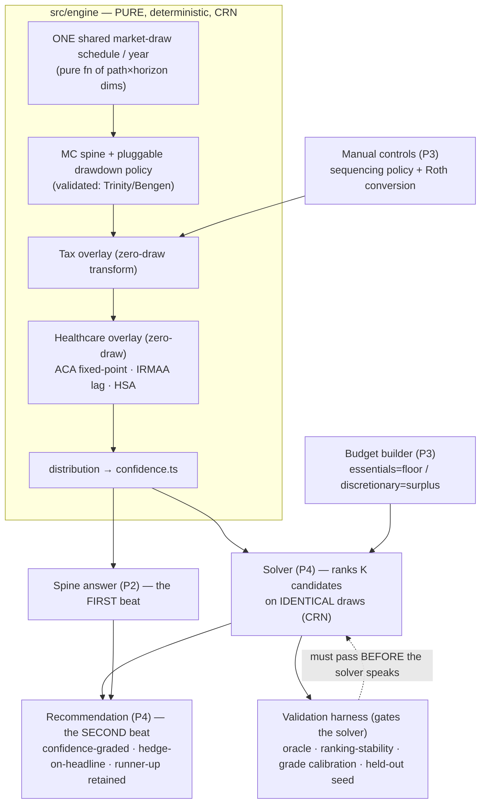
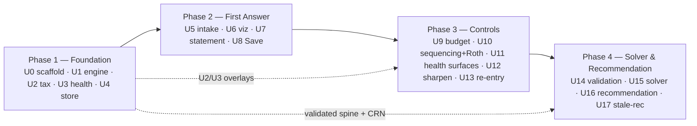

# The Back Nine MVP — Recommend-Second Co-Pilot — Roadmap

> **Sources of truth:** the **north-star** `docs/plans/direction-reset-2026-06-04.md` (the *why*, ratified) + **requirements v2** `docs/brainstorms/the-back-nine-requirements.md` (the locked *what/how*). Verified technical foundation + all reference numbers/citations: `docs/research/foundation-findings-2026-06-03.md` (`findings §StrandN`) + `docs/research/pre65-healthcare-aca-hsa-2026-06-04.md` (healthcare). **Engine validation numbers, crypto params, and every tax/health constant live in those research docs only — this plan points to them, never re-states them** (avoid stat-drift; learnings `burned/057,061,063`).
>
> **Paths are relative to `projects/the-back-nine/`.**

## Overview

The Back Nine is a **personal** (never-sold) retirement / tax-strategy co-pilot for a married couple. It answers one question — *"Can we retire, and how do we do it best?"* — as a calm, plain-language confidence statement (the first magic moment), then, as the immediate **second beat**, **recommends** a confidence-graded strategy over **two coupled tax controls** (withdrawal **sequencing** + Roth **conversion**) that funds a **user-built budget** toward a **user-chosen goal**, the full reasoning one tap down. Safety is the default floor; the user picks the goal above it.

This roadmap restructures the superseded v1 plan (`mvp-confidence-spine`, removed from the tree 2026-06-06 — in git history) into **four phases**. The 2026-06-04 thesis reset moved the product from a commercial single-Roth-lever calculator to a personal recommend-second solver; the regulatory guardrails relaxed to wording and **the load transferred onto honesty + engine validation, which harden** (R25). The deterministic engine, the tax-and-accounts overlay, and the encrypted store **survive** from the prior plan (≈80% reusable); the **budget builder**, **withdrawal-sequencing as a second control**, the **income-aware healthcare overlay**, and the **entire solver + recommendation layer** are net-new.

> **Amendment — the full projection, 2026-06-08 (folded 2026-06-10).** The thesis expanded from decumulation-only to **accumulation → decumulation** (master requirements **R26–R39**; north-star banner 2026-06-08): the pre-retirement saving phase is modeled, and a **not-yet-retired** household's first magic moment is **the fuck-off date** — two confidence-graded work-optional dates, computed by sweeping the household work-stop date-offset `Y` over the *existing* engine (never a new engine). The amendment **extends this roadmap without renumbering** the shipped U0–U17 (those references are load-bearing across the codebase + insights). The new units live as **tracks** in `docs/plans/2026-06-08-001-feat-fuck-off-date-accumulation-plan.md` — **the live home of their per-unit detail** (this roadmap stays the index): **C1** (contribution/ticker constants) · **C2** (accumulation projection) · **C3** (the date-search) land at Phase-1 engine altitude; **D1** (account-level setup, the U5 reshape) · **D2** (the state-adaptive date surface) land at Phase-2; **B1** resumes U3·M5 (HSA spend). The fold map:
>
> | Existing | Amendment |
> |---|---|
> | Master requirements (R1–R25) | + R26–R39; the ~3-min Success Criterion → ~5-min account-level / surface-early (the one master edit) |
> | This roadmap (U0–U17) | requirements trace + scope + key decisions + validation gates extended (below) |
> | P1 Foundation | + accumulation projection (C2), the date-search (C3), contribution + ticker constants (C1) |
> | P2 First Answer (U5 intake, U7 surface) | reshaped: account-level setup (D1), state-adaptive date surface (D2) |
> | P3·U9 budget | the two-date split rides U9's degenerate-collapse (note only) |
> | P3·U13 staleness | the date answer joins the per-surface staleness map |
> | U3·M5 (HSA) | resumes spend-only (B1); contributions move to C2 |

## Problem Frame

Retirement/wealth/tax planning is a domain everyone makes feel **hostile** (verified: `findings §Strand 1` — the best-sourced cross-product finding is *"different tools give wildly different answers → users distrust any single number"*). Incumbents lose on **consumability** and on **account-sync/data-plumbing breakage** — both of which a **manual-first, local-first** design sidesteps. Because this is a personal tool acted on by friends with real retirement money, the cardinal sin is **calm-but-wrong**: a confidently-stated wrong *recommendation* is worse than no tool, and the honesty bar **rises** for a recommender. UX *and* correctness are the product. The only competition is the quality bar itself.

## Requirements Trace

Every requirement maps to a phase/unit. Numbers are v2-as-amended (`docs/brainstorms/the-back-nine-requirements.md` — R26–R39 added 2026-06-08). `SC#` = the Success Criteria list there. C1–C3/D1–D2/B1 unit detail lives in `docs/plans/2026-06-08-001-feat-fuck-off-date-accumulation-plan.md`.

| Req | Where |
|---|---|
| **R1** primary question is the face | P2·U7 |
| **R2** plain-language confidence statement, survival-vs-lifestyle separation, no color-alone | P2·U7 (single metric), P3·U9 (the two-tier essentials/lifestyle reading) |
| **R3** distribution of futures | P1·U1 |
| **R4** detail on demand, never unsolicited | P2·U7, P3·U10–U12, P4·U16 |
| **R5** guided one-question intake *(the single-total-spend on-ramp superseded 2026-06-08 by R35's account-level setup — one flow, both user states)* | P2·U5 → D1 (the U5 reshape) |
| **R6** power-user escape hatch | P3·U12 |
| **R7** every assumption (and every recommendation input/reasoning) visible+editable | P3·U12, P4·U16 |
| **R8** input mirrors output; refinement *sharpens* (narrows on precision, shifts on a correction) | P2·U5, P3·U12 |
| **R9** propose a strategy over two coupled solver-optimized controls (sequencing + conversion) | substrate P1·U1–U2; manual P3·U10; solver P4·U15 |
| **R10** recommend-*second* flow (spine first, then strategy, comparative reasoning on demand, user tunes/overrides) | P4·U16 |
| **R11** calm, invited; never a nagging alert | P3·U10, P4·U16 |
| **R12** recommends, but every recommendation probabilistically framed; certainty banned; hedge required | copyGuard P2·U7, extended P3·U10 + P4·U16 |
| **R13** optional honest-limits note (honesty grounds, not a Terms requirement) | P1·U0 (static), P4·U16 |
| **R14** plain not dumbed-down | P2·U7, P4·U16 |
| **R15** no marketing privacy claim; honesty-about-architecture survives | P1·U4 |
| **R16** encrypted at rest + local access guarded (PBKDF2-600k acceptable) | P1·U4 |
| **R17** survivor recovery load-bearing (phrase + mandatory export, two-person posture) | P1·U4, P2·U8, P3·U13 |
| **R18** export/back-up for durability | P1·U4, P2·U8 |
| **R19** manual inputs sanity-checked, never falsely confident | engine half P1·U1; intake half P2·U5; control surfaces P3·U10; budget P3·U9 |
| **R20** itemized, time-boxed budget (essentials=floor / discretionary=surplus) | P3·U9 |
| **R21** lexicographic objective (survival floor → user-chosen surplus goal; objective metric ≡ headline metric) | P4·U15 (objective), P4·U16 (headline pivot) |
| **R22** every recommendation grades its own confidence; hedge rides the headline | P4·U14 (calibration), P4·U16 (render) |
| **R23** comparative depth (why this beat the runner-up; retain the runner-up) | P4·U15–U16 |
| **R24** income-dependent healthcare across the Medicare line (ACA-PTC / IRMAA / HSA) | overlay P1·U3; surfaces P3·U11 |
| **R25** cardinal honesty: calm-but-wrong is the sin; the bar rises for a recommender; "just for friends" never softens validation | validation P4·U14; copyGuard everywhere; N=1 cold-reads |
| **SC** correctness two-tier (engine number right + recommendation right vs an optimality/ranking oracle, ranking-stability, grade calibration) | P1·U1 (number), P4·U14 (recommendation) |
| **R26** the fuck-off date = the existing engine swept over the household work-stop **date-offset `Y`** (never a household "age"); **non-monotone-robust** exhaustive sweep, never a bisection | C3 (`dateSearch.ts`) |
| **R27** the answer is **two dates** (floor + lifestyle) from the lexicographic objective; one-sided window-floor semantic | C3 (engine) + D2 (surface); the two-track split rides P3·U9's degenerate-collapse |
| **R28** both dates **confidence-graded**, never hard lines; re-grade on strategy override | C3 + D2 |
| **R29** framing **adapts to user state** (date for not-yet-retired; spine confidence for already-retired) | D2 (state-adaptive first answer) |
| **R30** model the pre-retirement accumulation phase (contributions + growth → retirement-onset balance + basis) | C2 (accumulation projection) |
| **R31** contributions **per-account, flat-real, stop at the tested date**; employer **match** captured (pre-tax even on a Roth 401k) | C2 (engine) + D1 (intake) + C1 (limit constants) |
| **R32** v1 **projects**, does not optimize accumulation; solver stays decumulation-only | Scope Boundaries; C3 (date-search ≠ solver) |
| **R33** healthcare **OFF during accumulation, ON at the tested date** — per-candidate cost-stream construction (the engine has no retirement gate) | C3 (`buildCandidateParams(Y)`) + C2 |
| **R34** accumulation **inherits the engine invariants** — ONE continuous absolute-year draw timeline (CRN); one per-path future end-to-end; empty phase reduces byte-identically | C2 (the load-bearing engine contract) |
| **R35** the first answer from a **~5-min account-level guided setup**, surface-early, single entry pass, both user states | D1 (intake reshape) + the master Success-Criterion edit (done 2026-06-10) |
| **R36** account **values user-entered; no live price lookup** | D1 + Scope Boundaries |
| **R37** per-ticker holdings **collapse to one household blend**; bundled ticker→asset-class table + manual classification; basis per account, not per lot | C1 (`tickerBlend.ts`) + D1 (entry + manual fallback) |
| **R38** HSA **contributions → accumulation**; HSA **spend → decumulation** (the resumed U3·M5) | C2 (contributions) + B1 (U3·M5 spend) |
| **R39** new PII inherits encryption + the schema ladder (additive `schemaVersion` bump) | C2/D1 schema fields; consumed by P1·U4's migration ladder |

## Scope Boundaries

- **No account aggregation / Plaid in MVP.** Manual-first; revisit only when "crazily hardened."
- **No transaction tracking / spend categorization as a tracker.** The budget builder (R20) is forward-looking *planning* input, not back-looking expense tracking.
- **The tax/health IN/OUT line:** a tax/health effect is **IN iff withdrawal sequencing or a conversion can move it.** IN: ordinary brackets, standard deduction, RMDs, SS-taxation, MFJ→single, **ACA-PTC (pre-65), IRMAA (post-65)**, cap-gains/qualified-dividend stacking, **and — for a *leave-more* goal — a first-order §1014 / IRD heir-tax adjustment** (the death-time basis step-up *does* move with the lever — sequencing/conversion changes which account is preserved into the estate: taxable stepped up, inherited pre-tax fully taxable to heirs as IRD, Roth tax-free — and a disclosed omission can *invert* the after-tax ranking, so by the IN/OUT line's own falsifiable test it belongs **IN**, modeled into the after-tax-to-heirs objective with the **assumed heir bracket** as a disclosed, editable assumption; P4 contract #4/#7 / U16). **OUT-but-disclosed:** NIIT, state tax (neither moves with the lever — they only blunt a delta, never invert a ranking). **A separate held-fixed lever-*sensitive* assumption is disclosed, not modeled: SS claim age** — it is *not* a solver-optimized control in MVP (deferred to chapter two), yet changing it would move provisional-income taxation, ACA-MAGI, and IRMAA-MAGI, so a held-fixed claim age that could invert the ranking is **disclosed adjacent to the recommendation delta** (P4·U16), never silently assumed away. (Full scope + the falsifiable line: `findings §Strand 5` banner.)
- **Spending shape is user-set, never solver-recommended** — the solver optimizes *funding*, not how you live.
- **Bounded solver search** — named drawdown policies × a conversion grid, not a full continuous optimizer.
- **No live net-worth / portfolio-aggregation surface in MVP.**

*Accumulation-side boundaries (added 2026-06-08):*
- **Accumulation is IN — as a bounded near-retirement on-ramp**, never a decades-out FIRE / "are you on track" calculator (protects the decumulation-strategy thesis; avoids commoditization).
- **v1 projects, does not optimize, accumulation** — no contribution-strategy recommendations; the solver's controls stay decumulation-only (R32; traditional-vs-Roth contribution allocation → chapter two below).
- **No live market data / price feeds** — account values are user-entered (R36; consistent with `connect-src 'self'` + offline-first + deterministic replay).
- **No accumulation-phase income-tax engine**, no working-years budget detail, no raise/promotion modeling — flat-real contributions; tax character rides the destination bucket (R31/R34). With the accumulation construct present, working-year portfolio withdrawals are **clamped to zero while a living worker remains** (plan §7 — never simultaneous save-and-draw).
- **The "retired-but-still-contributing" HSA-MAGI edge is bounded + disclosed, not modeled** (plan §6 — the one-directional conservative argument with the 100%-FPL-floor carve-out; the falsifiable empty-overlap invariant is the engine guard).

### Deferred to Separate Tasks (chapter two — named, not in MVP)
- **SS-claiming-age** as a solver-optimized control (heavy; big for the survivor benefit) — future phase.
- A full **continuous** optimizer; a **"die-with-zero"** spend-down solver (needs a disclosed life-value model) — i.e. a solver that tells the user *how much **more** they could sustainably spend*. The MVP *live bigger now* goal is the lighter, in-scope statistic — the **confidence that the user's already-chosen front-loaded discretionary shape holds** (the solver funds it tax-smartly; it never raises a spend amount, contract #8a). Raising the spend amount itself is this deferred solver.
- **Asset-location** — modelable later only as a *deterministic per-bucket tilt on the one shared draw* (must never become a separate per-bucket draw — that breaks CRN).
- **E2E cross-device sync** (post-MVP; the encrypted-export pair is the MVP durability backstop).
- **Optimizing accumulation** — traditional-vs-Roth contribution allocation to pull the date in (a genuine *tax* optimization the solver could own; deferred-for-sequencing, not an off-thesis exclusion — R32).
- **A 3-asset cash sleeve** — v1 folds `cash` into the bond sleeve (the engine is 2-asset; a separate cash draw would break the 2-asset CRN contract).
- **Target-date-fund glide curves** — v1 ships a **static-snapshot** blend per TDF (disclosed "today's allocation, held constant"); the years-to-target glide is the named correctness upgrade.
- **Roth employer match** (SECURE 2.0 §604, optional plan feature) — v1 routes all match to pre-tax (the default rule).
- **Per-person asymmetric retirement-date search** — v1 sweeps one household date-offset `Y`; per-person asymmetry stays an editable assumption applied on top.
- **`belowFloor` threading to the date-search result** — the per-track 100%-FPL-floor disclosure's flag (the floor>lifestyle signature's user-facing explanation), first consumed by the U9-era cross-track surface; v1 owes only the §3c assertion removal + result-shape mirrors + fixture scoping (detail in the accumulation plan).

## Context & Research

### Relevant Code and Patterns
- **Greenfield, docs-only** — no code exists yet; this is a true greenfield scaffold in a convention-based monorepo with **no workspace tooling** (each `projects/*` is self-contained).
- **Mirror `projects/burned`** (the house gold standard): `pnpm@10.30.3`, TS `~5.9.3` with the strict-plus tsconfig (`noUncheckedIndexedAccess`, `noFallthroughCasesInSwitch`, `noImplicitOverride`), Vite 8 (rolldown convention), Vitest 4 (`globals:false`), flat ESLint 10, **no Prettier**. Co-locate `*.test.ts`; property tests `*.pbt.test.ts` via `fast-check`/`@fast-check/vitest`.
- **Vendor `mulberry32`** from `projects/burned/src/server/rng.ts` (the `|0`/`Math.imul` cross-engine-deterministic PRNG) into `src/engine/`; **inject it, never call globally**; **ban `Math.random`** via ESLint (and extend the engine-purity ban to `crypto.getRandomValues`/`Date`/`performance.now` inside `src/engine/**`). **U1 spike (reframed):** mulberry32's 2^32 period is **adequate by ~4–5 orders of magnitude** at MC trial counts (≤~10^6 draws/solve under CRN candidate-reuse, vs the ~4.3e9 period) — "period too small" is *not* the risk. The spike must instead decide (a) **seed decorrelation** for the held-out A/B seed-sets (derive `seedB` from `seedA` via SplitMix/hash, never consecutive integers, or the held-out defense is hollow) and (b) **positional CRN** (a counter-based `draw(seed,stream,path,year)` makes CRN structural rather than consumption-order discipline — but Phase-1 contract #1's pre-allocated absolute-year-indexed matrix already gives this, so a counter-based swap is *optional*, not required).
- **Worker + IndexedDB + WebCrypto-AES-GCM are net-new to the monorepo** — zero prior art. Build them as the new house reference; consider `idb` for IndexedDB and `comlink` for the worker boundary.

### Institutional Learnings (the transferable discipline — no domain prior art exists)
- **Externally-derived golden fixtures** (`archive/do-not-disturb/012`): a golden value the test computes via the engine's own formula proves typing, not correctness. Derive Trinity/Bengen, tax-math, and ACA/IRMAA expected numbers by an **independent** path (hand/spreadsheet/published calc). The solver **optimality oracle** is this discipline applied to the recommendation.
- **No in-range default fallbacks** (`burned/062`): a `?? 0.04` / `?? 22%` default that overlaps a plausible real value makes a missing input indistinguishable from a measurement — fatal inside the SS-tax and ACA fixed-points. Use out-of-range sentinels or fail loud.
- **Absence-tests need presence companions** (`burned/027`): "no path breached the floor" passes vacuously if the sim ran zero paths. Pair every invariant/CRN absence-assertion with "the sim ran N paths and at least one stressed the condition."
- **JSON-persisted sentinels** (`archive/do-not-disturb/009`): `Infinity`/`NaN` silently become `null` through `JSON.stringify`/IndexedDB. Decide the "never depleted" serialization **before** the schema locks.
- **Validate-before-mutate is a class** (`burned/021`): the solver/controls must validate a move's legality (RMD met? bracket headroom real? ACA cliff respected?) **before** mutating plan state, or stage→commit reversibly.
- **One canonical constants table** (`burned/057,061,063`): every dated tax/health constant lives in **one** year-keyed module that plan, engine, tests, *and* the copyGuard allowlist all read — never re-typed. The require-the-hedge lint must not hand-duplicate the phrase list it checks.
- React discipline for the UI: notify-once after all store slices written (`burned/017`); eager module-level worker handle, never in render (`ai-journey-stats/003`); memoize callbacks into effect-bearing children (`ai-journey-stats/007`); focus-safe enter with opacity not autoAlpha (`ai-journey-stats/006`).

### External References
- `findings §Strand 1–5` (verified, seam-swept clean 2026-06-04) — UX thesis, local-first architecture, the §Strand 3 regulatory rationale (now archive-as-rationale), the engine validation contract (Trinity/Bengen/MC band, log-drift, cohort joint-survivor longevity), and the tax reference (§Strand 5: 2026 brackets, RMD birth-year schedule, SS provisional-income, OBBBA legal basis).
- `docs/research/pre65-healthcare-aca-hsa-2026-06-04.md` — ACA-PTC (400% FPL cliff base + enhanced toggle), IRMAA (2-yr lag, separate MAGI), HSA (4th bucket). Directional until pinned to IRS/CMS primaries.

## Key Technical Decisions

- **Layered engine: validated spine → deterministic overlays → solver-on-top.** The Monte Carlo spine (decumulation + longevity) is validated against Trinity/Bengen. The tax-and-accounts overlay and the healthcare overlay are **deterministic per-year cash-term transforms** that **consume zero random draws** and **reduce byte-identically to the spine when off** (the golden cases are never perturbed). The solver is a layer **on top** of the validated spine + overlays — it ranks candidate strategies, it **does not re-implement decumulation**.
- **The single-shared-market-draw / CRN rule is load-bearing and now *more* so.** All account buckets (pre-tax / Roth / taxable / **HSA**) share **one** market-return draw per year — buckets differ only in tax treatment, never in return assumption. This is what lets the solver rank K candidate strategies on **identical** futures (signal, not luck), and it **structurally forecloses asset-location**. Per-bucket draws are forbidden. The draw schedule is a pure function of path/horizon dimensions only.
- **Withdrawal sequencing is a first-class engine parameter** — a pluggable per-year drawdown **policy** (`proportional` / `taxable-first` / `pre-tax-first` / `bracket-fill`) that decides which bucket funds each year's net withdrawal. It is the substrate both the manual control (P3·U10) and the solver (P4·U15) drive.
- **Death-order is a conditional FILTER on the path population** (the sub-population where the chosen spouse dies first) — same seed, same draws, no re-draw. This forces a hard P1 longevity requirement: **per-path, per-spouse death years with survivor identity retained per path** (the closed-form mixture alone does not retain it).
- **The solver objective ≡ the headline, and the optimizer's curse is defended in TWO layers.** The lexicographic objective is **Tier-1 survival floor → a Tier-2 surplus goal**, each Tier-2 goal a concrete distributional statistic the headline renders directly (pay-less-tax = lifetime tax; **leave-more = after-tax-to-heirs** — the §1014/IRD adjustment modeled in at a disclosed assumed heir bracket, never the gross figure; live-bigger-now = the held-out confidence the user's chosen discretionary shape holds) — so the quantity argmaxed *is* the quantity shown (R21). The curse is defended **twice**: the **held-out seed-set B** makes the *grade* honest, and **selection-stage skeptical shrinkage of the seed-A scores toward the conventional-ordering prior** makes the *pick* honest (the held-out grade alone cannot stop a curse-biased near-tie pick; a near-tie defaults to the conventional pick unless its advantage survives shrinkage). The validation harness **gates** the solver *structurally, at type level*: the "oracle-cleared" result is an **opaque token the harness alone can mint**, taken as a required parameter by the solve-as-recommendation entry, withheld until every check passes **and** every rec-relevant primary is pinned (`directionalUntilPinned === false`) and ε is calibrated — so the solver cannot recommend on directional fixtures or skip validation (a compile error, not a discipline check).
- **Income fixed-points are per-year, bounded, zero-draw, CRN-safe.** SS provisional-income taxation and the **pre-65 ACA cost** are each a per-year fixed-point (cost depends on MAGI which depends on the strategy). **Two distinct MAGI calculators** (ACA-MAGI ≠ IRMAA-MAGI). IRMAA is a **2-year-lagged** surcharge.
- **Honesty load-transfer → copyGuard reshapes.** The reg ban-list (no-verdict / categorical-only / attorney-gate) relaxes to wording; copyGuard gains a **require-the-hedge** lint — a *positive/require* assertion that every control readout and the recommendation headline wears its probabilistic hedge — in addition to the surviving certainty-hygiene + catastrophe-lexicon checks. *"It's just for friends" never softens validation.*
- **One canonical, year-keyed constants module** (`src/engine/constants/`) cites `findings §Strand 5` + the healthcare doc, marks every figure **directional-until-pinned**, and is the single source plan/engine/tests/copyGuard-allowlist all read.
- **Doc structure:** this roadmap + four phase docs in `docs/plans/back-nine-mvp/`; the superseded v1 `mvp-confidence-spine` plan was removed from the tree 2026-06-06 (in git history). Reference numbers never inlined here.

*Accumulation-side decisions (added 2026-06-08; full engineering detail = the accumulation plan's §0–§7):*
- **ONE continuous absolute-year draw timeline — already the architecture (plan §1, R34).** The engine timeline starts at t=0 (today) and the earned-income bridge already occupies the working years; accumulation adds a per-bucket **contribution inflow** into those existing slots — never a separate pre-phase draw stream, no `maxHorizon`/dimension change. The empty phase (`Y == 0`) consumes zero extra draws. **Byte-identity is PRESENCE-keyed:** the reduce-to-spine OFF condition is "the accumulation construct *absent* from params," not "all contributions 0" (the §7 working-year clamp changes nets whenever the construct is present).
- **The signed inflow term + its own goldens (plan §2).** `stepYear` gains a per-year signed flow with a pinned within-year pipeline: withdraw → rebalance → grow → **credit the contribution end-of-year at face value** (a contributed dollar earns no growth in its arrival year — the *conservative* convention; full-year crediting would overstate the onset balance → a falsely-early date, the calm-but-wrong-optimistic sin). Per-bucket destination at **full basis**; match → pre-tax; the overlay fold is **after the bucket-scale, at face value**, with the per-person-ledger credit. New goldens include construct-absent byte-identity, the per-year `Σbuckets == runningTotal` inflow invariant, and the overlay-path **destination-bucket + direction** pair.
- **The date-search is NOT the solver — and NOT bias-free (plan §3).** An outer **exhaustive** sweep over a bounded window of household date-offsets (≤~11 candidates, pinned width), each candidate = the existing `simulate` on the same seed (CRN). **Non-monotone-robust** (insight 013): earliest offset that clears **and keeps clearing** through the window, never a bisection. Selection is on a **conservative quantized lower confidence bound** (`p̂ − z·SE`, z = 1.645, quantized to `SURVIVAL_GRID`) against the headline's own `BANDS.onTrack` bar (**objective ≡ headline** — no second metric), at a pinned per-candidate path count (16k final / 2000 provisional two-tier). **Three first-class outcomes per track:** confirmed date / window-edge-unconfirmed (explicit tail disclosure) / **no-date-in-window** (a defined answer, never "never free," never a crash). Healthcare-on-at-the-tested-date is per-candidate **cost-stream construction** (`buildCandidateParams(Y)`), per-person Medicare onset, and the additive working-year IRMAA-MAGI override — the engine has no retirement gate (R33).

## Open Questions

### Resolved During Planning
- **Engine language: TypeScript for the MVP.** The solver interaction is **solve-once-on-demand** (not live-drag), with cooperative cancellation (request-epoch). The first solver release ships **both controls as co-equal axes** (sequencing × the cliff-anchored conversion grid). P4·U15 carries an explicit **compute-profile measurement gate** run on a deliberately compute-worst-case scenario (longest horizon, most cliff anchors, both seed-sets + the held-out B-family): named-policies × conversion-grid × 1k paths × (SS + ACA fixed-points + IRMAA lag); if an on-demand solve exceeds the budget on a mid-tier phone, **WASM moves from fast-follow to load-bearing.** The trigger is measured, not guessed; the WASM port itself is deferred — but the MVP **does not block on it**: a bounded in-MVP **fallback ladder** (coarse-then-refine candidate pruning with cliff anchoring spent only around survivors, a candidate-count ceiling, and a degraded-but-honest reduced-path interactive solve with a full-precision confirm) keeps the recommendation beat shippable at full held-out-path fidelity without the WASM port. **Determinism scope:** byte-identical reproduction is a *same-JS-engine* guarantee (TS transcendental math is not bit-identical across browser engines), so the user-facing `X of 10` is **quantized to a coarse grid before the band-edge decision** (P1·U1) — robust to a last-ULP `Math.exp` difference across Chrome/Safari — and the selection + held-out grade for one solve always run on the same engine instance; a true cross-engine bit-identical promise is the other concrete trigger that would promote WASM to load-bearing.
- **Lexicographic "survival-equivalent" band.** Tier-1 metric = the survival-floor statistic (essentials covered every year across futures, in the spine's `X of 10` metric). "Survival-equivalent" = candidates whose Tier-1 scores fall within a **selection tie-tolerance computed on the A-side, keyed to the CRN-shrunk variance of their pairwise difference** (a pre-specified/theoretical SE, or computed A-side) — **NEVER an ε-band measured on the held-out seed-set B** (deciding equivalence on B re-contaminates the held-out, the bug the two-role ε split forbids — P4 contract #2). The held-out seed-set B carries **only** the displayed band + the grade. The optimizer's curse is defended by the **two layers** of the Key Technical Decision above — A-side skeptical shrinkage toward the conventional prior (the *pick*) plus B's independent held-out *grade* — not by moving the tie decision onto B. Among survival-equivalent candidates, rank by the chosen Tier-2 surplus goal. The exact ε is **calibrated against the optimality oracle** (P4·U14) — a gate, not a free constant: the oracle-cleared token is withheld until it is calibrated.
- **Passphrase-strength floor (pinned at plan level — a security-grade decision, not a UX knob).** A hard **min-entropy gate at passphrase-set** (P2·U8 + P1·U4): `zxcvbn-ts` **score ≥ 3 AND an independent minimum length ≥ 12 characters** (both must clear), with calm inline feedback and **no weak-passphrase bypass.** PBKDF2-600k is not memory-hard (GPU brute-force ~10⁸–10⁹/sec against an extracted blob), so it is the *only* at-rest defense and a weak passphrase voids the whole story — hence the threshold is pinned here, never left to an implementer doing no threat-model arithmetic. The estimator's dictionary/language packs are **mandatory** (core ships none — a pack-less estimator over-rates weak passphrases), and a CI test asserts a known-weak common password is rejected **only** with the packs loaded (a pack-less run is a caught false green). PBKDF2-600k is the current OWASP **FIPS-path** floor (correct, not raised); **Argon2id is OWASP's preferred memory-hard primitive** and is WASM-feasible (`hash-wasm`) — if the engine ships WASM for the solver, the KDF is re-evaluated at that checkpoint (adopt Argon2id-WASM for new passphrases with a schemaVersion bump + re-wrap prompt for existing vaults), so the WASM decision does not silently strand the weaker KDF.
- **Survivor outcome-state set (kills the SC6 dangling reference).** Engine-owned, single-sourced in `src/shared/model.ts`: `on-track / borderline / off-track / indeterminate / over-funded / already-failing` for the single-metric first answer. The budget split (P3·U9) adds a **two-tier lexicographic reading** (an essentials-floor verdict + a lifestyle-surplus verdict) applied to the *same* states — **not** a hardcoded 7th state. This roadmap is the live home of the set (the pre-reset "six states" lived only in superseded docs).
- **Solver search space (D4):** `{proportional, taxable-first, pre-tax-first, bracket-fill}` drawdown policies × a conversion grid `{amount × years}`. Manual control = user picks a policy/custom order + conversion (P3·U10); solver searches the cross-product (P4·U15).

### Deferred to Implementation
- mulberry32 **seed decorrelation** (seedB derived from seedA, not consecutive) **+ positional CRN** (counter-based draw optional — the absolute-year-indexed matrix already provides it); the 2^32 period is adequate, not the constraint (U1 spike, reframed). The spike must **pin the exact construction** (e.g. SplitMix64 over a 64-bit reinterpretation of `seedA` → take the high 32 bits, *or* `SHA-256(seedA) mod 2³²` — pin one) with a **statistical-decorrelation acceptance bar** (not merely "reject `seedA + 1`"), and define the deterministic **B-family expansion** `seedB[0..m-1]` of `m` well-separated streams the Unit-14 grade-stability check consumes (all re-derivable from the single persisted `seedB`, so the grade reproduces byte-identically on re-entry).
- Exact ε for the survival-equivalent band (U14 oracle calibration — a gate, not a free constant: the oracle-cleared token is withheld until ε is calibrated); exact named-policy set tuning if the four prove insufficient. *(The passphrase-strength threshold is no longer deferred — pinned above at `zxcvbn-ts` score ≥ 3 ∧ length ≥ 12.)*
- The precise "never depleted" persisted sentinel (decide before the schema locks — not Infinity/NaN).
- Concrete motion curves/durations, font faces, and copy strings (eye-in-loop + N=1 cold-read at implementation).

## Output Structure

    projects/the-back-nine/
    ├── src/
    │   ├── engine/                 # PURE: no DOM, no clock, no entropy (ESLint-enforced)
    │   │   ├── rng.ts              # vendored mulberry32 + stateless Box-Muller
    │   │   ├── longevity.ts        # cohort joint-survivor; retains per-path survivor identity
    │   │   ├── simulate.ts         # MC spine + pluggable drawdown-policy + overlays
    │   │   ├── sequencing.ts       # named drawdown policies (the second control's substrate)
    │   │   ├── taxOverlay.ts       # brackets/RMD/SS-tax/MFJ→single (zero-draw transform)
    │   │   ├── healthOverlay.ts    # ACA fixed-point + IRMAA lag + HSA bucket (zero-draw)
    │   │   ├── historical.ts       # deterministic backtest oracle
    │   │   ├── confidence.ts       # distribution → X-of-10 + dollar + outcome-state (pure)
    │   │   ├── solver/             # P4: candidate search, lexicographic objective, grading
    │   │   ├── validation/         # P4: optimality oracle, ranking-stability, grade calibration
    │   │   ├── constants/          # ONE year-keyed tax/health table (directional-until-pinned)
    │   │   ├── reference/          # COMMITTED golden fixtures (Trinity/Bengen/tax/ACA/IRMAA)
    │   │   └── engine.worker.ts    # Comlink worker boundary
    │   ├── crypto/                 # kdf (PBKDF2-600k) · cipher (AES-GCM) · recoveryPhrase
    │   ├── store/                  # db (idb) · session · memoryModel (orchestrator) · backup · staleness
    │   ├── intake/                 # progressive on-ramp · sanity · intakeMap
    │   ├── budget/                 # P3: itemized time-boxed budget builder
    │   ├── viz/                    # colorblind-safe band + two-series + recommendation viz
    │   ├── ui/                     # confidence statement · controls · recommendation · copy + copyGuard
    │   └── shared/                 # model.ts (single plaintext shape + outcome-state enum)
    ├── public/                     # PWA manifest, self-hosted fonts
    └── docs/plans/back-nine-mvp/   # this roadmap + 4 phase docs

## High-Level Technical Design

> *Directional guidance for review, not implementation specification. The implementing agent treats it as context, not code to reproduce.*

**Layered architecture (the "solver-on-top" principle):**

**Phase dependency graph:**

## The Phase Map

Each phase has its own doc with per-unit goals, files, approach, test scenarios, and verification. Phase 3 is a **shippable cold-read milestone** on its own (two working manual controls + the budget, before the solver exists). The full dependency DAG is in each phase doc.

### Phase 1 — Foundation (U0–U4) → `phase-1-foundation.md`
The two hardest surfaces (correctness + trust) plus the overlays both controls stand on. Nothing user-facing ships.
- **U0** Scaffold, conventions, PWA shell, CI (burned toolchain; engine-purity lint; strict CSP).
- **U1** MC engine core + validation contract (determinism, CRN, joint-survivor longevity retaining survivor identity, Trinity/Bengen externally-derived fixtures, **sequencing as a pluggable policy**).
- **U2** Tax-and-accounts overlay (buckets, ordinary tax, RMD birth-year, SS provisional-income fixed-point, MFJ→single; reduces-to-spine when off).
- **U3** Healthcare overlay (ACA-MAGI + IRMAA-MAGI calculators; ACA pre-65 fixed-point + cliff/enhanced toggle; IRMAA 2-yr lag; HSA 4th bucket; reduces-to-spine when off).
- **U4** Encrypted store + key lifecycle + recovery/export (PBKDF2-600k, AES-GCM, DK hierarchy, recovery phrase, schemaVersion). *Parallelizable with U1–U3; its migration entry must cover the v2-with-accounts shape before D1's first Save (U4 before D1).*
- *(Amendment 2026-06-08 — Phase-1 engine altitude; detail in the accumulation plan:)* **C1** contribution-limit + ticker-blend constants (Notice 2025-67 / Rev. Proc. 2025-19 / issuer-or-EDGAR; directional-until-pinned) · **C2** the accumulation projection (signed inflow on the one continuous timeline; presence-keyed reduce-to-spine) · **C3** the date-search (`dateSearch.ts` — exhaustive, non-monotone-robust, quantized-lower-bound selection).

### Phase 2 — First Answer (U5–U8) → `phase-2-first-answer.md`
The magic moment end-to-end. *(Amended 2026-06-08: the on-ramp is the **~5-min account-level setup** — the single-total-spend on-ramp is superseded for both user states; the household spend figure survives as a collected input, and the itemized budget stays the P3 deepening.)*
- **U5** Guided progressive on-ramp + in-memory orchestrator + R19 sanity. *(Reshaped → **D1** account-level setup, surface-early, single entry pass; + **D2** the state-adaptive first answer — date-first for not-yet-retired, spine-first for already-retired. Detail in the accumulation plan, Track D.)*
- **U6** Colorblind-safe viz primitives (confidence band + two-series encoding).
- **U7** Confidence statement surface + outcome-state system + survivor readout (copyGuard born here).
- **U8** First-Save flow + recovery-phrase display + mandatory export + **passphrase-strength gate**.

### Phase 3 — Controls (U9–U13) → `phase-3-controls.md`
The budget + both manual controls + healthcare surfaces. A shippable cold-read milestone before the solver.
- **U9** Budget builder (itemized, time-boxed, essentials/discretionary; the two-tier lexicographic headline reading).
- **U10** Manual withdrawal-sequencing control + Roth-conversion lever (both drive the U2 overlay; require-the-hedge lint introduced).
- **U11** Healthcare surfaces (ACA cliff + enhanced toggle + re-verify gate; IRMAA cliffs; HSA entry) over the U3 overlay.
- **U12** Sharpen loop + assumption editing + escape hatch.
- **U13** Returning-user re-entry + per-surface staleness (incl. tax + healthcare vintages + budget line items). *(Amended 2026-06-08: the **date answer joins the per-surface staleness map** — fixture-vintage clocks for the contribution-limit + ticker-blend tables, user-entered re-confirms riding the balance-drift confirm class, and the calendar-label re-presentation rule with "~N years out" re-derived, never replayed. Detail in phase-3's U13 extension.)*

### Phase 4 — Solver & Recommendation (U14–U17) → `phase-4-solver-recommendation.md`
The new layer. **Validation is built and passing before the solver is allowed to recommend.**
- **U14** Solver **validation harness** (optimality/ranking oracle, ranking-stability-under-CRN, grade calibration, held-out-seed reporting) — **gates U15**.
- **U15** Solver core (named-policies × conversion-grid search on identical CRN draws; lexicographic objective; deterministic byte-identical selection; the WASM measurement gate).
- **U16** Recommendation surface (recommend-second; confidence-grading; comparative transparency with the runner-up retained; objective ≡ headline; the 10/10→surplus pivot; hedge-on-headline lint).
- **U17** Stale-saved-recommendation handling (a saved rec is an executed action → re-solve under current fixtures; staleness reads *"the action we recommended may no longer be advised"*).

## System-Wide Impact

- **Interaction graph:** the determinism/CRN spine is consumed by the spine answer (P2), every manual control (P3), and the solver (P4). The overlays (U2/U3) are shared by the controls and the solver. The copy catalog + copyGuard span every user-facing surface.
- **Error propagation:** the engine returns a calm tri-state (`pending` | `resolved-distribution` | `calm-error`); no `NaN`/`Infinity` escapes a percentile; the worker stays alive/reusable; a worker-construction failure falls back to a main-thread run.
- **State lifecycle risks:** first-save atomicity (one IndexedDB transaction — a partial vault strands the survivor); the v1→v2→v3 schema migration (P3 buckets/budget, P4 solver seeds/goal/saved-rec); model-only re-encrypt under the existing DK; session-only sticky-rounding fields re-seated on re-entry.
- **API surface parity:** the two controls (sequencing + conversion) share the overlay; whatever a control can express, the solver searches.
- **Unchanged invariants:** the spine's Trinity/Bengen golden numbers are **never** perturbed by any overlay or control (every overlay reduces byte-identically to the spine when off); the saved spine headline is reproducible byte-identically under its persisted seed.

## Risks & Dependencies

| Risk | Mitigation |
|------|------------|
| **Optimizer's curse** — argmax over many candidates on one seed overfits its noise | Held-out-seed grading (honest *grade*) **+ selection-stage shrinkage toward the conventional-ordering prior (honest *pick*)** + the **optimality oracle built before the solver** (U14 gates U15 via a harness-minted token); deterministic selection |
| **Objective ≠ headline metric** — recommending a move that worsens the hero number | Lexicographic objective with **objective metric ≡ headline metric** (R21); each Tier-2 goal a named statistic (leave-more = **after-tax-to-heirs**, not gross); the 10/10→surplus pivot gated on A∧B agreement |
| **A disclosed omission inverts a ranking** (not just blunts a delta) | ACA-PTC + IRMAA are **IN** (U3); the lever-sensitive **§1014/heir-tax is IN** the leave-more after-tax objective (U15/U16); only lever-inert NIIT/state stay disclosed-adjacent; the held-fixed **SS-claim-age** is disclosed adjacent to the delta |
| **Stale saved recommendation = a real executed action** | U17 re-solves under current fixtures (a saved rec is minted only by an explicit commit gesture); staleness reads "the action may no longer be advised," not "your number drifted" |
| **Tax/health-blind delta is sign-inverted** (conversion looks always-worse) | Overlays + the reduce-to-spine golden invariant; both arms at identical fidelity |
| **Cross-engine float non-determinism** — a last-ULP `Math.exp` delta flips the screenshotted `X of 10` across Chrome/Safari | TS byte-identity scoped to *same-engine*; the displayed `X of 10` **quantized before the band-edge decision** (P1·U1); selection + held-out grade run on one engine instance; a concrete WASM-promotion trigger |
| **ACA legislative volatility** (enhanced subsidies expired 12/31/2025, unre-enacted) | Model the 400% FPL cliff as the 2026 base; "enhanced" = a scenario toggle; **re-verify the legislative status at every build** |
| **Solver compute exceeds the on-demand budget** (both axes co-equal) | TS baseline + the U15 measurement gate that promotes WASM from fast-follow to load-bearing **+ a WASM-independent in-MVP fallback ladder** (coarse-then-refine prune, candidate ceiling, degraded-but-honest reduced-path solve) so the beat ships regardless |
| **CRN broken by per-bucket draws / death-order re-draw** | One shared draw/year (structural); death-order = a conditional filter; explicit CRN tests across the MFJ→single transition |
| **Calm-but-wrong on real money** | The honesty bar rises for a recommender; N=1 cold-reads judge *tone*, the automated oracle judges *correctness* |

## Validation Gates (solver-blocking — block calling a fixture/recommendation "golden")

These extend the engine exit gates to the recommendation. Until each clears, the dependent fixture is **directional** (marked so in code) and no downstream surface may treat it as golden.

- **SSA cohort survivor curves** confirmed against the real `table4c7.html` (bot-blocks automated fetch → manual fetch + committed snapshot) — load-bearing for the survivor differentiator and every Roth/solver survivor headline.
- **Engine datasets pinned:** Bengen's Ibbotson intermediate-government series; a true long-term-corporate series for Trinity (cFIREsim-open is Shiller=government → directional, not exact).
- **§Strand-5 + healthcare numbers pinned to primaries:** 2026 Rev. Proc. (brackets/std-ded), Pub. 590-B (Uniform Lifetime Table), Pub. 915 (SS-tax), **Pub. 969 (HSA), §36B/Pub. 974 (ACA-PTC), CMS (IRMAA brackets + 2026 Part B)**.
- **The enhanced-ACA-subsidy legislative status re-verified at EVERY build** — live, possibly-retroactive policy.
- **The solver optimality oracle** (hand-computable known-best drawdown/conversion cases — five of them, including the **after-tax leave-more** inversion and the **no-change** case) exists and passes **before the solver is allowed to recommend** (U14 gates U15). The gate is the **harness-minted "oracle-cleared" token** taken as a required parameter by the solve-as-recommendation entry, withheld until the oracle, ranking-stability, grade calibration (with the named-driver probe + the deterministic B-family), the held-out-seed defense, **and** the structural clauses — every rec-relevant §Strand-5/healthcare primary pinned (`directionalUntilPinned === false`) **and** ε calibrated — all pass; skipping validation or recommending on directional fixtures is a *compile* error. The N=1 cold-read judges *tone*, not *correctness*.
- **The survivor-spending ratio** (the ~75% default that scales the survivor's spending and so rides the Tier-1 survival floor) is **grounded to a citable retirement-research range** (e.g. Blanchett survivor-spending literature), source-stamped like every other constant, and its **dangerous direction documented** (too-low understates survivor need — the unsafe direction for the survivor product); it stays editable but is no longer an un-sourced silent default under the hero metric (P1·U1).
- *(Added 2026-06-08.)* **The 2026 contribution-limit constants are directional-until-pinned** against IRS **Notice 2025-67** (401k/IRA/catch-up + §415(c)) and **Rev. Proc. 2025-19** (HSA limits + HDHP definitions), with SECURE 2.0 §§108/109 carried as `legalBasis` provenance (C1). Same discipline as every §Strand-5 figure.
- *(Added 2026-06-08.)* **The ticker→asset-class blend table is directional-until-pinned** against the **issuer product-page allocation panel, with SEC EDGAR N-PORT as the independent backstop** (DND/012); TDF static snapshots disclosed as "today's allocation, held constant" (C1).
- *(Added 2026-06-08.)* **The date-search carries the non-monotone-robust contract** (insight 013 — exhaustive sweep, keeps-holding rule, never a bisection; a planted monotonicity-assuming selector must fail) **and the empty-phase byte-identity gate** (`Y == 0` / construct-absent reduces byte-identically to plain decumulation at the same path dimensions) before any date is surfaced (C2/C3).

## Sources & References

- **North-star:** `docs/plans/direction-reset-2026-06-04.md` (ratified 2026-06-04).
- **Origin requirements:** `docs/brainstorms/the-back-nine-requirements.md` (v2).
- **Verified foundation + reference numbers:** `docs/research/foundation-findings-2026-06-03.md` (`§Strand 1–5`).
- **Healthcare grounding:** `docs/research/pre65-healthcare-aca-hsa-2026-06-04.md`.
- **Superseded prior plan (≈80% mined into this plan; removed from the tree 2026-06-06, in git history):** `docs/plans/mvp-confidence-spine/` (roadmap + phase-1/2/3).
- **House conventions + reusable patterns:** `projects/burned/` (toolchain, `src/server/rng.ts`, the `docs/insights/` learnings cited above).
