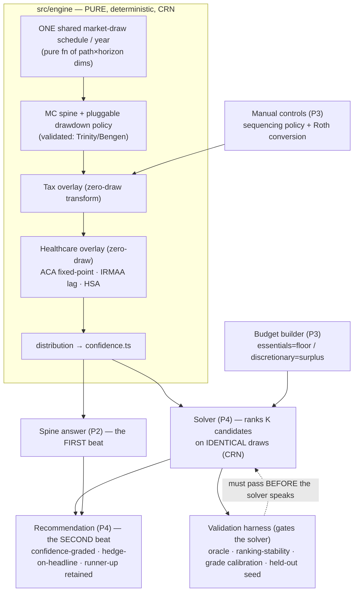
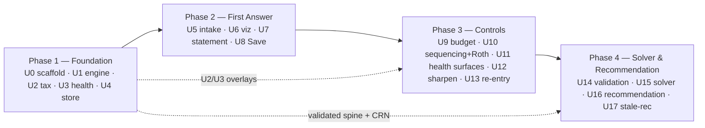

# The Back Nine MVP — Recommend-Second Co-Pilot — Roadmap

> **Sources of truth:** the **north-star** `docs/plans/direction-reset-2026-06-04.md` (the *why*, ratified) + **requirements v2** `docs/brainstorms/the-back-nine-requirements.md` (the locked *what/how*). Verified technical foundation + all reference numbers/citations: `docs/research/foundation-findings-2026-06-03.md` (`findings §StrandN`) + `docs/research/pre65-healthcare-aca-hsa-2026-06-04.md` (healthcare). **Engine validation numbers, crypto params, and every tax/health constant live in those research docs only — this plan points to them, never re-states them** (avoid stat-drift; learnings `burned/057,061,063`).
>
> **Paths are relative to `projects/the-back-nine/`.**

## Overview

The Back Nine is a **personal** (never-sold) retirement / tax-strategy co-pilot for a married couple. It answers one question — *"Can we retire, and how do we do it best?"* — as a calm, plain-language confidence statement (the first magic moment), then, as the immediate **second beat**, **recommends** a confidence-graded strategy over **two coupled tax controls** (withdrawal **sequencing** + Roth **conversion**) that funds a **user-built budget** toward a **user-chosen goal**, the full reasoning one tap down. Safety is the default floor; the user picks the goal above it.

This roadmap restructures the superseded `docs/plans/mvp-confidence-spine/` plan into **four phases**. The 2026-06-04 thesis reset moved the product from a commercial single-Roth-lever calculator to a personal recommend-second solver; the regulatory guardrails relaxed to wording and **the load transferred onto honesty + engine validation, which harden** (R25). The deterministic engine, the tax-and-accounts overlay, and the encrypted store **survive** from the prior plan (≈80% reusable); the **budget builder**, **withdrawal-sequencing as a second control**, the **income-aware healthcare overlay**, and the **entire solver + recommendation layer** are net-new.

## Problem Frame

Retirement/wealth/tax planning is a domain everyone makes feel **hostile** (verified: `findings §Strand 1` — the best-sourced cross-product finding is *"different tools give wildly different answers → users distrust any single number"*). Incumbents lose on **consumability** and on **account-sync/data-plumbing breakage** — both of which a **manual-first, local-first** design sidesteps. Because this is a personal tool acted on by friends with real retirement money, the cardinal sin is **calm-but-wrong**: a confidently-stated wrong *recommendation* is worse than no tool, and the honesty bar **rises** for a recommender. UX *and* correctness are the product. The only competition is the quality bar itself.

## Requirements Trace

Every requirement maps to a phase/unit. Numbers are v2 (`docs/brainstorms/the-back-nine-requirements.md`). `SC#` = the Success Criteria list there.

| Req | Where |
|---|---|
| **R1** primary question is the face | P2·U7 |
| **R2** plain-language confidence statement, survival-vs-lifestyle separation, no color-alone | P2·U7 (single metric), P3·U9 (the two-tier essentials/lifestyle reading) |
| **R3** distribution of futures | P1·U1 |
| **R4** detail on demand, never unsolicited | P2·U7, P3·U10–U12, P4·U16 |
| **R5** guided one-question intake on a single total-spend figure | P2·U5 |
| **R6** power-user escape hatch | P3·U12 |
| **R7** every assumption (and every recommendation input/reasoning) visible+editable | P3·U12, P4·U16 |
| **R8** input mirrors output; refinement *sharpens* (narrows on precision, shifts on a correction) | P2·U5, P3·U12 |
| **R9** propose a strategy over two coupled solver-optimized controls (sequencing + conversion) | substrate P1·U1–U2; manual P3·U10; solver P4·U15 |
| **R10** recommend-*second* flow (spine first, then strategy, comparative reasoning on demand, user tunes/overrides) | P4·U16 |
| **R11** calm, invited; never a nagging alert | P3·U10, P4·U16 |
| **R12** recommends, but every recommendation probabilistically framed; certainty banned; hedge required | copyGuard P2·U7, extended P3·U10 + P4·U16 |
| **R13** optional honest-limits note (honesty grounds, not a Terms requirement) | P1·U0 (static), P4·U16 |
| **R14** plain not dumbed-down | P2·U7, P4·U16 |
| **R15** no marketing privacy claim; honesty-about-architecture survives | P1·U4 |
| **R16** encrypted at rest + local access guarded (PBKDF2-600k acceptable) | P1·U4 |
| **R17** survivor recovery load-bearing (phrase + mandatory export, two-person posture) | P1·U4, P2·U8, P3·U13 |
| **R18** export/back-up for durability | P1·U4, P2·U8 |
| **R19** manual inputs sanity-checked, never falsely confident | engine half P1·U1; intake half P2·U5; control surfaces P3·U10; budget P3·U9 |
| **R20** itemized, time-boxed budget (essentials=floor / discretionary=surplus) | P3·U9 |
| **R21** lexicographic objective (survival floor → user-chosen surplus goal; objective metric ≡ headline metric) | P4·U15 (objective), P4·U16 (headline pivot) |
| **R22** every recommendation grades its own confidence; hedge rides the headline | P4·U14 (calibration), P4·U16 (render) |
| **R23** comparative depth (why this beat the runner-up; retain the runner-up) | P4·U15–U16 |
| **R24** income-dependent healthcare across the Medicare line (ACA-PTC / IRMAA / HSA) | overlay P1·U3; surfaces P3·U11 |
| **R25** cardinal honesty: calm-but-wrong is the sin; the bar rises for a recommender; "just for friends" never softens validation | validation P4·U14; copyGuard everywhere; N=1 cold-reads |
| **SC** correctness two-tier (engine number right + recommendation right vs an optimality/ranking oracle, ranking-stability, grade calibration) | P1·U1 (number), P4·U14 (recommendation) |

## Scope Boundaries

- **No account aggregation / Plaid in MVP.** Manual-first; revisit only when "crazily hardened."
- **No transaction tracking / spend categorization as a tracker.** The budget builder (R20) is forward-looking *planning* input, not back-looking expense tracking.
- **The tax/health IN/OUT line:** a tax/health effect is **IN iff withdrawal sequencing or a conversion can move it.** IN: ordinary brackets, standard deduction, RMDs, SS-taxation, MFJ→single, **ACA-PTC (pre-65), IRMAA (post-65)**, cap-gains/qualified-dividend stacking. **OUT-but-disclosed:** NIIT, state tax. (Full scope + the falsifiable line: `findings §Strand 5` banner.)
- **Spending shape is user-set, never solver-recommended** — the solver optimizes *funding*, not how you live.
- **Bounded solver search** — named drawdown policies × a conversion grid, not a full continuous optimizer.
- **No live net-worth / portfolio-aggregation surface in MVP.**

### Deferred to Separate Tasks (chapter two — named, not in MVP)
- **SS-claiming-age** as a solver-optimized control (heavy; big for the survivor benefit) — future phase.
- A full **continuous** optimizer; a **"die-with-zero"** spend-down solver (needs a disclosed life-value model).
- **Asset-location** — modelable later only as a *deterministic per-bucket tilt on the one shared draw* (must never become a separate per-bucket draw — that breaks CRN).
- **E2E cross-device sync** (post-MVP; the encrypted-export pair is the MVP durability backstop).

## Context & Research

### Relevant Code and Patterns
- **Greenfield, docs-only** — no code exists yet; this is a true greenfield scaffold in a convention-based monorepo with **no workspace tooling** (each `projects/*` is self-contained).
- **Mirror `projects/burned`** (the house gold standard): `pnpm@10.30.3`, TS `~5.9.3` with the strict-plus tsconfig (`noUncheckedIndexedAccess`, `noFallthroughCasesInSwitch`, `noImplicitOverride`), Vite 8 (rolldown convention), Vitest 4 (`globals:false`), flat ESLint 10, **no Prettier**. Co-locate `*.test.ts`; property tests `*.pbt.test.ts` via `fast-check`/`@fast-check/vitest`.
- **Vendor `mulberry32`** from `projects/burned/src/server/rng.ts` (the `|0`/`Math.imul` cross-engine-deterministic PRNG) into `src/engine/`; **inject it, never call globally**; **ban `Math.random`** via ESLint (and extend the engine-purity ban to `crypto.getRandomValues`/`Date`/`performance.now` inside `src/engine/**`). Flag for U1: confirm mulberry32's 32-bit period is adequate at MC trial counts vs a counter-based generator.
- **Worker + IndexedDB + WebCrypto-AES-GCM are net-new to the monorepo** — zero prior art. Build them as the new house reference; consider `idb` for IndexedDB and `comlink` for the worker boundary.

### Institutional Learnings (the transferable discipline — no domain prior art exists)
- **Externally-derived golden fixtures** (`archive/do-not-disturb/012`): a golden value the test computes via the engine's own formula proves typing, not correctness. Derive Trinity/Bengen, tax-math, and ACA/IRMAA expected numbers by an **independent** path (hand/spreadsheet/published calc). The solver **optimality oracle** is this discipline applied to the recommendation.
- **No in-range default fallbacks** (`burned/062`): a `?? 0.04` / `?? 22%` default that overlaps a plausible real value makes a missing input indistinguishable from a measurement — fatal inside the SS-tax and ACA fixed-points. Use out-of-range sentinels or fail loud.
- **Absence-tests need presence companions** (`burned/027`): "no path breached the floor" passes vacuously if the sim ran zero paths. Pair every invariant/CRN absence-assertion with "the sim ran N paths and at least one stressed the condition."
- **JSON-persisted sentinels** (`archive/do-not-disturb/009`): `Infinity`/`NaN` silently become `null` through `JSON.stringify`/IndexedDB. Decide the "never depleted" serialization **before** the schema locks.
- **Validate-before-mutate is a class** (`burned/021`): the solver/controls must validate a move's legality (RMD met? bracket headroom real? ACA cliff respected?) **before** mutating plan state, or stage→commit reversibly.
- **One canonical constants table** (`burned/057,061,063`): every dated tax/health constant lives in **one** year-keyed module that plan, engine, tests, *and* the copyGuard allowlist all read — never re-typed. The require-the-hedge lint must not hand-duplicate the phrase list it checks.
- React discipline for the UI: notify-once after all store slices written (`burned/017`); eager module-level worker handle, never in render (`ai-journey-stats/003`); memoize callbacks into effect-bearing children (`ai-journey-stats/007`); focus-safe enter with opacity not autoAlpha (`ai-journey-stats/006`).

### External References
- `findings §Strand 1–5` (verified, seam-swept clean 2026-06-04) — UX thesis, local-first architecture, the §Strand 3 regulatory rationale (now archive-as-rationale), the engine validation contract (Trinity/Bengen/MC band, log-drift, cohort joint-survivor longevity), and the tax reference (§Strand 5: 2026 brackets, RMD birth-year schedule, SS provisional-income, OBBBA legal basis).
- `docs/research/pre65-healthcare-aca-hsa-2026-06-04.md` — ACA-PTC (400% FPL cliff base + enhanced toggle), IRMAA (2-yr lag, separate MAGI), HSA (4th bucket). Directional until pinned to IRS/CMS primaries.

## Key Technical Decisions

- **Layered engine: validated spine → deterministic overlays → solver-on-top.** The Monte Carlo spine (decumulation + longevity) is validated against Trinity/Bengen. The tax-and-accounts overlay and the healthcare overlay are **deterministic per-year cash-term transforms** that **consume zero random draws** and **reduce byte-identically to the spine when off** (the golden cases are never perturbed). The solver is a layer **on top** of the validated spine + overlays — it ranks candidate strategies, it **does not re-implement decumulation**.
- **The single-shared-market-draw / CRN rule is load-bearing and now *more* so.** All account buckets (pre-tax / Roth / taxable / **HSA**) share **one** market-return draw per year — buckets differ only in tax treatment, never in return assumption. This is what lets the solver rank K candidate strategies on **identical** futures (signal, not luck), and it **structurally forecloses asset-location**. Per-bucket draws are forbidden. The draw schedule is a pure function of path/horizon dimensions only.
- **Withdrawal sequencing is a first-class engine parameter** — a pluggable per-year drawdown **policy** (`proportional` / `taxable-first` / `pre-tax-first` / `bracket-fill`) that decides which bucket funds each year's net withdrawal. It is the substrate both the manual control (P3·U10) and the solver (P4·U15) drive.
- **Death-order is a conditional FILTER on the path population** (the sub-population where the chosen spouse dies first) — same seed, same draws, no re-draw. This forces a hard P1 longevity requirement: **per-path, per-spouse death years with survivor identity retained per path** (the closed-form mixture alone does not retain it).
- **Income fixed-points are per-year, bounded, zero-draw, CRN-safe.** SS provisional-income taxation and the **pre-65 ACA cost** are each a per-year fixed-point (cost depends on MAGI which depends on the strategy). **Two distinct MAGI calculators** (ACA-MAGI ≠ IRMAA-MAGI). IRMAA is a **2-year-lagged** surcharge.
- **Honesty load-transfer → copyGuard reshapes.** The reg ban-list (no-verdict / categorical-only / attorney-gate) relaxes to wording; copyGuard gains a **require-the-hedge** lint — a *positive/require* assertion that every control readout and the recommendation headline wears its probabilistic hedge — in addition to the surviving certainty-hygiene + catastrophe-lexicon checks. *"It's just for friends" never softens validation.*
- **One canonical, year-keyed constants module** (`src/engine/constants/`) cites `findings §Strand 5` + the healthcare doc, marks every figure **directional-until-pinned**, and is the single source plan/engine/tests/copyGuard-allowlist all read.
- **Doc structure:** this roadmap + four phase docs in `docs/plans/back-nine-mvp/`; the superseded `docs/plans/mvp-confidence-spine/` stays as history. Reference numbers never inlined here.

## Open Questions

### Resolved During Planning
- **Engine language: TypeScript for the MVP.** The solver interaction is **solve-once-on-demand** (not live-drag), with cooperative cancellation (request-epoch). P4·U15 carries an explicit **compute-profile measurement gate**: named-policies × conversion-grid × 1k paths × (SS + ACA fixed-points + IRMAA lag); if an on-demand solve exceeds the budget on a mid-tier phone, **WASM moves from fast-follow to load-bearing.** The trigger is measured, not guessed; the WASM port itself is deferred.
- **Lexicographic "survival-equivalent" band.** Tier-1 metric = the survival-floor statistic (essentials covered every year across futures, in the spine's `X of 10` metric). "Survival-equivalent" = candidates whose Tier-1 score is within an **ε-band of the max on the HELD-OUT seed-set** (ties decided on the selection seed's noise *is* the optimizer's curse). Among survival-equivalent candidates, rank by the chosen Tier-2 surplus goal. The exact ε is **calibrated against the optimality oracle** (P4·U14) — structure decided, the constant deferred to that calibration unit.
- **Passphrase-strength floor.** A hard **min-entropy gate at passphrase-set** (P2·U8 + P1·U4) using a real strength estimator (e.g. `zxcvbn-ts`) with a minimum-score threshold and calm inline feedback — PBKDF2-600k is the *only* brute-force defense, so a weak passphrase voids the at-rest story; **no weak-passphrase bypass.** Exact threshold/library-pin deferred to implementation.
- **Survivor outcome-state set (kills the SC6 dangling reference).** Engine-owned, single-sourced in `src/shared/model.ts`: `on-track / borderline / off-track / indeterminate / over-funded / already-failing` for the single-metric first answer. The budget split (P3·U9) adds a **two-tier lexicographic reading** (an essentials-floor verdict + a lifestyle-surplus verdict) applied to the *same* states — **not** a hardcoded 7th state. This roadmap is the live home of the set (the pre-reset "six states" lived only in superseded docs).
- **Solver search space (D4):** `{proportional, taxable-first, pre-tax-first, bracket-fill}` drawdown policies × a conversion grid `{amount × years}`. Manual control = user picks a policy/custom order + conversion (P3·U10); solver searches the cross-product (P4·U15).

### Deferred to Implementation
- mulberry32 32-bit period vs a counter-based PRNG at MC trial counts (U1 spike).
- Exact ε for the survival-equivalent band (U14 oracle calibration); exact passphrase-strength threshold (U8); exact named-policy set tuning if the four prove insufficient.
- The precise "never depleted" persisted sentinel (decide before the schema locks — not Infinity/NaN).
- Concrete motion curves/durations, font faces, and copy strings (eye-in-loop + N=1 cold-read at implementation).

## Output Structure

    projects/the-back-nine/
    ├── src/
    │   ├── engine/                 # PURE: no DOM, no clock, no entropy (ESLint-enforced)
    │   │   ├── rng.ts              # vendored mulberry32 + stateless Box-Muller
    │   │   ├── longevity.ts        # cohort joint-survivor; retains per-path survivor identity
    │   │   ├── simulate.ts         # MC spine + pluggable drawdown-policy + overlays
    │   │   ├── sequencing.ts       # named drawdown policies (the second control's substrate)
    │   │   ├── taxOverlay.ts       # brackets/RMD/SS-tax/MFJ→single (zero-draw transform)
    │   │   ├── healthOverlay.ts    # ACA fixed-point + IRMAA lag + HSA bucket (zero-draw)
    │   │   ├── historical.ts       # deterministic backtest oracle
    │   │   ├── confidence.ts       # distribution → X-of-10 + dollar + outcome-state (pure)
    │   │   ├── solver/             # P4: candidate search, lexicographic objective, grading
    │   │   ├── validation/         # P4: optimality oracle, ranking-stability, grade calibration
    │   │   ├── constants/          # ONE year-keyed tax/health table (directional-until-pinned)
    │   │   ├── reference/          # COMMITTED golden fixtures (Trinity/Bengen/tax/ACA/IRMAA)
    │   │   └── engine.worker.ts    # Comlink worker boundary
    │   ├── crypto/                 # kdf (PBKDF2-600k) · cipher (AES-GCM) · recoveryPhrase
    │   ├── store/                  # db (idb) · session · memoryModel (orchestrator) · backup · staleness
    │   ├── intake/                 # progressive on-ramp · sanity · intakeMap
    │   ├── budget/                 # P3: itemized time-boxed budget builder
    │   ├── viz/                    # colorblind-safe band + two-series + recommendation viz
    │   ├── ui/                     # confidence statement · controls · recommendation · copy + copyGuard
    │   └── shared/                 # model.ts (single plaintext shape + outcome-state enum)
    ├── public/                     # PWA manifest, self-hosted fonts
    └── docs/plans/back-nine-mvp/   # this roadmap + 4 phase docs

## High-Level Technical Design

> *Directional guidance for review, not implementation specification. The implementing agent treats it as context, not code to reproduce.*

**Layered architecture (the "solver-on-top" principle):**

**Phase dependency graph:**

## The Phase Map

Each phase has its own doc with per-unit goals, files, approach, test scenarios, and verification. Phase 3 is a **shippable cold-read milestone** on its own (two working manual controls + the budget, before the solver exists). The full dependency DAG is in each phase doc.

### Phase 1 — Foundation (U0–U4) → `phase-1-foundation.md`
The two hardest surfaces (correctness + trust) plus the overlays both controls stand on. Nothing user-facing ships.
- **U0** Scaffold, conventions, PWA shell, CI (burned toolchain; engine-purity lint; strict CSP).
- **U1** MC engine core + validation contract (determinism, CRN, joint-survivor longevity retaining survivor identity, Trinity/Bengen externally-derived fixtures, **sequencing as a pluggable policy**).
- **U2** Tax-and-accounts overlay (buckets, ordinary tax, RMD birth-year, SS provisional-income fixed-point, MFJ→single; reduces-to-spine when off).
- **U3** Healthcare overlay (ACA-MAGI + IRMAA-MAGI calculators; ACA pre-65 fixed-point + cliff/enhanced toggle; IRMAA 2-yr lag; HSA 4th bucket; reduces-to-spine when off).
- **U4** Encrypted store + key lifecycle + recovery/export (PBKDF2-600k, AES-GCM, DK hierarchy, recovery phrase, schemaVersion). *Parallelizable with U1–U3.*

### Phase 2 — First Answer (U5–U8) → `phase-2-first-answer.md`
The magic moment end-to-end on a **single total-spend** figure (the budget is the P3 deepening).
- **U5** Guided progressive on-ramp + in-memory orchestrator + R19 sanity.
- **U6** Colorblind-safe viz primitives (confidence band + two-series encoding).
- **U7** Confidence statement surface + outcome-state system + survivor readout (copyGuard born here).
- **U8** First-Save flow + recovery-phrase display + mandatory export + **passphrase-strength gate**.

### Phase 3 — Controls (U9–U13) → `phase-3-controls.md`
The budget + both manual controls + healthcare surfaces. A shippable cold-read milestone before the solver.
- **U9** Budget builder (itemized, time-boxed, essentials/discretionary; the two-tier lexicographic headline reading).
- **U10** Manual withdrawal-sequencing control + Roth-conversion lever (both drive the U2 overlay; require-the-hedge lint introduced).
- **U11** Healthcare surfaces (ACA cliff + enhanced toggle + re-verify gate; IRMAA cliffs; HSA entry) over the U3 overlay.
- **U12** Sharpen loop + assumption editing + escape hatch.
- **U13** Returning-user re-entry + per-surface staleness (incl. tax + healthcare vintages + budget line items).

### Phase 4 — Solver & Recommendation (U14–U17) → `phase-4-solver-recommendation.md`
The new layer. **Validation is built and passing before the solver is allowed to recommend.**
- **U14** Solver **validation harness** (optimality/ranking oracle, ranking-stability-under-CRN, grade calibration, held-out-seed reporting) — **gates U15**.
- **U15** Solver core (named-policies × conversion-grid search on identical CRN draws; lexicographic objective; deterministic byte-identical selection; the WASM measurement gate).
- **U16** Recommendation surface (recommend-second; confidence-grading; comparative transparency with the runner-up retained; objective ≡ headline; the 10/10→surplus pivot; hedge-on-headline lint).
- **U17** Stale-saved-recommendation handling (a saved rec is an executed action → re-solve under current fixtures; staleness reads *"the action we recommended may no longer be advised"*).

## System-Wide Impact

- **Interaction graph:** the determinism/CRN spine is consumed by the spine answer (P2), every manual control (P3), and the solver (P4). The overlays (U2/U3) are shared by the controls and the solver. The copy catalog + copyGuard span every user-facing surface.
- **Error propagation:** the engine returns a calm tri-state (`pending` | `resolved-distribution` | `calm-error`); no `NaN`/`Infinity` escapes a percentile; the worker stays alive/reusable; a worker-construction failure falls back to a main-thread run.
- **State lifecycle risks:** first-save atomicity (one IndexedDB transaction — a partial vault strands the survivor); the v1→v2→v3 schema migration (P3 buckets/budget, P4 solver seeds/goal/saved-rec); model-only re-encrypt under the existing DK; session-only sticky-rounding fields re-seated on re-entry.
- **API surface parity:** the two controls (sequencing + conversion) share the overlay; whatever a control can express, the solver searches.
- **Unchanged invariants:** the spine's Trinity/Bengen golden numbers are **never** perturbed by any overlay or control (every overlay reduces byte-identically to the spine when off); the saved spine headline is reproducible byte-identically under its persisted seed.

## Risks & Dependencies

| Risk | Mitigation |
|------|------------|
| **Optimizer's curse** — argmax over many candidates on one seed overfits its noise | Held-out-seed grading + the **optimality oracle built before the solver** (U14 gates U15); deterministic selection |
| **Objective ≠ headline metric** — recommending a move that worsens the hero number | Lexicographic objective with **objective metric ≡ headline metric** (R21); the 10/10→surplus pivot |
| **A disclosed omission inverts a ranking** (not just blunts a delta) | ACA-PTC + IRMAA are **IN** (U3); omissions disclosed adjacent to the delta |
| **Stale saved recommendation = a real executed action** | U17 re-solves under current fixtures; staleness reads "the action may no longer be advised," not "your number drifted" |
| **Tax/health-blind delta is sign-inverted** (conversion looks always-worse) | Overlays + the reduce-to-spine golden invariant; both arms at identical fidelity |
| **ACA legislative volatility** (enhanced subsidies expired 12/31/2025, unre-enacted) | Model the 400% FPL cliff as the 2026 base; "enhanced" = a scenario toggle; **re-verify the legislative status at every build** |
| **Solver compute exceeds the on-demand budget** | TS baseline + the U15 measurement gate that promotes WASM from fast-follow to load-bearing |
| **CRN broken by per-bucket draws / death-order re-draw** | One shared draw/year (structural); death-order = a conditional filter; explicit CRN tests across the MFJ→single transition |
| **Calm-but-wrong on real money** | The honesty bar rises for a recommender; N=1 cold-reads judge *tone*, the automated oracle judges *correctness* |

## Validation Gates (solver-blocking — block calling a fixture/recommendation "golden")

These extend the engine exit gates to the recommendation. Until each clears, the dependent fixture is **directional** (marked so in code) and no downstream surface may treat it as golden.

- **SSA cohort survivor curves** confirmed against the real `table4c7.html` (bot-blocks automated fetch → manual fetch + committed snapshot) — load-bearing for the survivor differentiator and every Roth/solver survivor headline.
- **Engine datasets pinned:** Bengen's Ibbotson intermediate-government series; a true long-term-corporate series for Trinity (cFIREsim-open is Shiller=government → directional, not exact).
- **§Strand-5 + healthcare numbers pinned to primaries:** 2026 Rev. Proc. (brackets/std-ded), Pub. 590-B (Uniform Lifetime Table), Pub. 915 (SS-tax), **Pub. 969 (HSA), §36B/Pub. 974 (ACA-PTC), CMS (IRMAA brackets + 2026 Part B)**.
- **The enhanced-ACA-subsidy legislative status re-verified at EVERY build** — live, possibly-retroactive policy.
- **The solver optimality oracle** (a hand-computable known-best drawdown/conversion case) exists and passes **before the solver is allowed to recommend** (U14 gates U15). The N=1 cold-read judges *tone*, not *correctness*.

## Sources & References

- **North-star:** `docs/plans/direction-reset-2026-06-04.md` (ratified 2026-06-04).
- **Origin requirements:** `docs/brainstorms/the-back-nine-requirements.md` (v2).
- **Verified foundation + reference numbers:** `docs/research/foundation-findings-2026-06-03.md` (`§Strand 1–5`).
- **Healthcare grounding:** `docs/research/pre65-healthcare-aca-hsa-2026-06-04.md`.
- **Superseded prior plan (history, ≈80% mined):** `docs/plans/mvp-confidence-spine/` (roadmap + phase-1/2/3).
- **House conventions + reusable patterns:** `projects/burned/` (toolchain, `src/server/rng.ts`, the `docs/insights/` learnings cited above).
