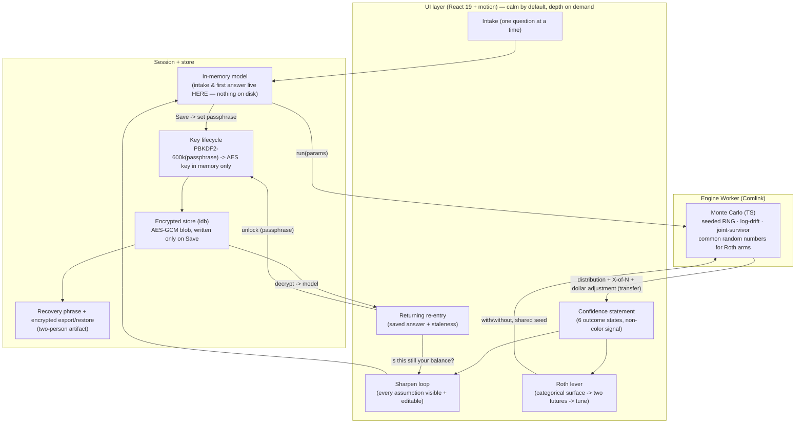

# The Back Nine MVP — Confidence Spine — Roadmap

> *Parent document for the MVP build. It carries the research, the cross-cutting decisions, and the phase breakdown. The three phase files inherit their quality bar, requirements trace, and technical decisions from this document. When a phase file disagrees with the roadmap, the roadmap wins unless the roadmap is demonstrably wrong — in which case we update the roadmap.*
>
> **Paths are relative to `projects/the-back-nine/`.** Two source documents are authoritative:
> - Product decisions: `docs/brainstorms/the-back-nine-requirements.md` (locked, 7-persona reviewed) — `(origin: …)`.
> - Verified technical foundation + all reference numbers/citations: `docs/research/foundation-findings-2026-06-03.md` — `(findings §StrandN)`. **Engine validation numbers and crypto params live there only — this plan points to them, never re-states them (avoid stat-drift).**

## Mission

Build the MVP of The Back Nine: a **confidence spine** (one-question on-ramp → a client-side Monte Carlo engine → a plain-language confidence statement) plus **exactly one** differentiated tax lever (a Roth-conversion what-if). For a **married couple**. Local-first, encrypted at rest, no backend, no account aggregation. The bet is **consumability** — incumbents have the math and lose on feeling hostile. The master principle — *calm by default, depth on demand* — is the architecture, not a coat of paint. The bar: *"would a stranger trust this with their net worth."*

## Problem Frame

Retirement planning is a domain everyone makes feel hostile (verified: findings §Strand 1 — the best-sourced cross-product finding is *"different tools give wildly different answers → users distrust any single number and want confidence, not another opaque figure"*). The unoccupied position is **planning-grade depth + low data-entry friction + a calm, legible experience** for a financially-literate couple, without forcing transaction aggregation. The product is the bar — no competitive lens; the only competition is the quality bar itself.

## Requirements Trace

Every requirement from the origin doc maps to a phase below (R-numbers are the origin doc's).

| Requirement | Where |
|---|---|
| R1–R4 — one question → plain-language probabilistic confidence statement, depth on demand | Phase 1 (Unit 1), Phase 2 (Unit 5) |
| R5–R8 — guided intake; escape hatch; every assumption visible+editable; refinement tightens the band | Phase 2 (Unit 3), Phase 3 (Unit 6) |
| R9–R11 — exactly one Roth lever; surface→two-futures→tune; quiet/invited | Phase 3 (Unit 7) |
| R12–R14 — math/hypotheticals never directives; educational disclaimer; plain not dumbed-down | Phase 1 (Unit 0 disclaimer), Phase 2 (Unit 5), Phase 3 (Unit 7) — string-level |
| R15–R18 — privacy provable before spoken; encrypted at rest + lock; recovery posture; export/backup | Phase 1 (Unit 2) |
| R19 — manual entry sanity-checked, never silently broken/falsely confident | Phase 2 (Unit 3) |
| Success criteria — first answer in one sitting; one answer not a dashboard; assumptions reachable in one interaction; Roth what-if visibly moves the answer; correctness vs reference cases; N=1 cold-read; no directive strings | Phases 1–3 |

## Scope Boundaries

- **No account aggregation / Plaid** — manual-first (origin).
- **No budgeting / transaction tracking / categorization** — Monarch's lane.
- **No individualized advice / "you should" directives, ever.**
- **No tax modeling beyond the single Roth-conversion lever.**
- **No live net-worth / portfolio aggregation surface (#4).**
- **No cross-device E2E sync** — single-device, local-first.

### Deferred to Separate Tasks

- **WASM engine + Argon2id-WASM** — proven fast-follow if profiling demands headroom or we want cross-browser bit-identical floats. MVP engine is TypeScript; correctness is identical because outputs are rounded with hysteresis. (findings §Strand 2, §Strand 4)
- **E2E cross-device sync** (Evolu-leaning if/when added; **not Jazz** — alpha, foundation risk) — post-MVP. (findings §Strand 2)
- **Tauri v2 desktop wrapper** (OS keychain via `keyring` crate + SQLCipher) — future trust-maximalist upgrade; keep the core portable.
- **"Remember me on this device"** (WebAuthn/biometric unlock) — immediate fast-follow; v1 is passphrase-each-session.
- **Unmarried-couple modeling** — MVP assumes married.
- **Attorney review of exact Roth-lever copy + the no-securities/no-asset-location boundary** — before any real Terms doc / marketing claim goes load-bearing. (findings §Strand 3)

## Context & Research

### Relevant Code and Patterns

- **`projects/burned/src/server/rng.ts`** — `mulberry32(seed)` + a documented CSPRNG-vs-seeded split. **Reuse** for engine determinism (the `|0` coercions are load-bearing). Layer Box-Muller on top (does not exist yet).
- **`projects/burned/`** — convention gold-standard: spec-as-contract, ESLint layer import boundaries, `Math.random()` banned (mandates `crypto.getRandomValues()`), Vite 8 notes, strict tsconfig (`noUncheckedIndexedAccess`), bundle budget. Model `the-back-nine/CLAUDE.md` on `projects/burned/CLAUDE.md`. **This plan dir itself follows burned's `roadmap.md + phase-N-*.md` convention.**
- **`projects/undercover-mob-boss/vite.config.ts`** — the only `vite-plugin-pwa` (1.2.0) setup in the monorepo.
- **`projects/ai-journey-stats/` + `.github/workflows/verify-ai-journey-stats.yml`** — closest static-PWA analog; clone the path-scoped, build-only CI (Node 22, pnpm 10, `--frozen-lockfile`). Deploy via Vercel git integration.
- Convergent stack baseline (adopt verbatim): **React 19.2.4, TypeScript ~5.9.3 strict, Vite 8, Vitest 4, pnpm 10.30.3, `motion` v12 (not `framer-motion`), Playwright**.

### Institutional Learnings

- **WASM/crypto/Worker/Monte-Carlo are all greenfield in this monorepo** — no sibling code; the findings doc is the spec. `/distill` the first non-obvious gotcha in each area.
- **CVD discipline** (`burned/docs/insights/051`, `010`): hue intuition is wrong under CVD transforms; run a `culori` oklab probe over every critical pair (0.10 floor), separate by **luminance not hue**. Briggsy is color blind.
- **React 19 `use(promise)` must be created eagerly at module load** (`ai-journey-stats/003`).
- **Unstable callbacks make modal/effect cleanup a state corruptor** (`ai-journey-stats/007`) — `useCallback` slider/drawer handlers, test under mid-open re-render.
- **`position: fixed` trapped by `contain`/`transform`/`filter` ancestors** (`burned/013`) — portal overlays/sheets to `document.body`.
- **CSS `@layer`: unlayered styles silently beat layered** (`burned/012`) — make layer-wrapping structural.
- **Windows-vs-CI silent divergence** (`burned/055`, `070`) — green-on-Windows proves nothing about Linux/CI; determinism gates must fail loud + self-test against a planted positive.

### External References

All external best-practice research is **already verified** in `docs/research/foundation-findings-2026-06-03.md` (today's adversarial workflow); integration mechanics confirmed against MDN (SubtleCrypto, Storage API), OWASP, Comlink, vite-plugin-pwa, and the SEC/IAA primaries. Do not re-research; reconcile against these.

## Key Technical Decisions

- **Engine in TypeScript for the MVP** (Briggsy's call, 2026-06-03). Reverses the findings-doc Rust→WASM lean: even plain JS clears 1k paths sub-second, and WASM's only correctness edge (cross-browser bit-identical floats) is moot because outputs are **rounded with hysteresis**. TS is just as correct (same seeded RNG + Box-Muller + log-drift, same Trinity/Bengen validation) and removes the WASM toolchain from the MVP. WASM = proven fast-follow.
- **No WASM toolchain in the MVP ⇒ PBKDF2-HMAC-SHA256 @ 600k (WebCrypto-native)** for key derivation. AES-GCM-256, 12-byte fresh IV per encryption, 16-byte salt. (findings §Strand 2)
- **Unlock = passphrase, re-entered each session; key held in memory only, never persisted** (Briggsy's call, 2026-06-03). Strongest "we can't see your money," zero platform dependency, simplest to build. **No username** — in a no-server model a username authenticates nothing; the passphrase is a key-derivation secret, not a login, and there is no password reset by design (R17). Email-as-username returns only with E2E sync (post-MVP, Bitwarden-style). "Remember this device" = fast-follow.
- **Onboarding = magic-moment-first** (decided in planning; gates R15/R16). Intake + first confidence statement run **in memory; nothing touches disk** until the user chooses to save and sets a passphrase. Preserves the <3-min calm on-ramp; guarantees no cleartext financial data ever hits IndexedDB. Crash mid-intake loses ~3 min (resume = post-MVP). *(Extends the origin doc.)*
- **Household credential is shared; recovery phrase + export are a two-person artifact** (decided in planning). The product exists for the survivor case — a single-owner credential that locks the surviving spouse out fails the bar. *(Extends the origin doc.)*
- **Married couple is a stated MVP precondition** (decided in planning). *(Makes explicit what "couple (locked)" implied.)*
- **Engine determinism + variance reduction is a correctness requirement:** a deterministic seeded RNG keyed per saved scenario (identical inputs → identical headline), **common random numbers across the Roth with/without arms** (the "buys you ~N years" delta must not jitter), and **rounding hysteresis** (small input changes move the headline monotonically). (findings §Strand 4)
- **The model is honest about the survivor phase** (extends origin): survivor-SS step-down (keep the larger benefit), survivor-spending ratio (default ~75%, editable), two-regime horizon (joint → survivor to second death), death-order as an editable hypothetical (R12), surfaced as an editable assumption (R7).
- **Six outcome states, not three** (extends origin): on-track, borderline, off-track, **indeterminate/not-enough-data** (the *expected first answer*), **over-funded**, **already-retired-and-failing**; plus a **10/10-honesty rule** (never show a bald 100%). Each carries copy + next-action + a non-color signal.
- **Color is never the only signal** (R2; Claude owns color decisions): verdict **word** + distinct **shape/icon** + **dollar magnitude** are the load-bearing fast-scan signals; color is redundant reinforcement. Viz distinguishes series by line style + end-labels + texture/luminance, never hue.
- **Recovery + export + restore are one mechanism** (extends origin): in a no-sync MVP the phrase alone recovers nothing — the **encrypted export file + phrase are a pair**. Export = encrypted blob; restore = import file + phrase → set new passphrase. Onboarding copy states the pairing.
- **Regulatory posture enforced at the string level** (findings §Strand 3): the quiet Roth surface names **no personalized dollar figure** (categorical only); personalization appears only after user-initiated open; a lint rejects forbidden verbs ("you should", "we recommend", "you will save", "guaranteed", "optimal"). Calculator, never a verdict; never names securities, asset classes, or asset *location*.

## Open Questions

### Resolved During Planning
- Engine language → TypeScript (Briggsy). Unlock → passphrase each session, memory-only key (Briggsy). KDF → PBKDF2-600k. Onboarding → magic-moment-first. Survivor access → shared credential + two-person recovery. Marital status → married precondition. Seed-stability / CRN / rounding hysteresis → required. Outcome set → six states + 10/10 rule.

### Deferred to Implementation
- Exact intake question wording/order (Phase 2 copy pass — framing decided, strings not).
- Final per-state confidence-statement copy (Phase 2 — N=1 cold-read with Briggsy is the gate).
- Survivor-spending default + whether death-order is user-pickable vs probability-weighted (Phase 1/3 — start editable ~75% + explicit hypothetical; revisit after cold-read).
- `culori` oklab probe thresholds for the chosen palette (Phase 2 — run the probe, pick by table).
- Concrete bundle-budget number (Phase 1 — set against first real build; burned's "<100 KB gz initial" is the reference).

## Output Structure

    projects/the-back-nine/
    ├── package.json                # React 19.2 + TS 5.9 + Vite 8 + Vitest 4 + motion v12, pnpm
    ├── vite.config.ts              # + vite-plugin-pwa (prompt mode)
    ├── tsconfig.json               # strict + noUncheckedIndexedAccess (clone burned)
    ├── eslint.config.ts            # layer import boundaries; ban Math.random in src/engine
    ├── CLAUDE.md                   # contract = requirements.md; conventions; bundle budget
    ├── public/                     # manifest.webmanifest, icons, offline shell assets
    ├── src/
    │   ├── engine/                 # Monte Carlo — pure, deterministic, runs in a Worker
    │   │   ├── rng.ts              # mulberry32 (port) + Box-Muller normal
    │   │   ├── longevity.ts        # cohort tables + joint-and-survivor (P=px+py−px·py)
    │   │   ├── simulate.ts         # paths, log-drift μ=arith−σ²/2, survivor phase
    │   │   ├── confidence.ts       # distribution → "X of N" + dollar-adjustment + state
    │   │   ├── roth.ts             # with/without arms, common random numbers
    │   │   ├── engine.worker.ts    # Comlink-exposed engine API
    │   │   └── reference/          # Trinity/Bengen golden-case fixtures + validation tests
    │   ├── crypto/                 # WebCrypto wrappers (PBKDF2, AES-GCM), recovery phrase
    │   ├── store/                  # idb persistence, session lifecycle, export/restore
    │   ├── intake/                 # guided one-question flow + R19 sanity checks
    │   ├── viz/                    # colorblind-safe SVG primitives (band, two-futures)
    │   ├── ui/                     # confidence statement, outcome states, sharpen loop, Roth lever, re-entry
    │   ├── shared/                 # types, money/format utils, the model schema
    │   └── main.tsx
    └── docs/                       # (existing) brainstorms, research, plans

## High-Level Technical Design

> *This illustrates the intended approach and is directional guidance for review, not implementation specification. The implementing agent should treat it as context, not code to reproduce.*

The load-bearing seam: **intake and the first answer never touch disk** (magic-moment-first); persistence begins only when the user saves and sets a passphrase. The engine is a pure, deterministic function behind a Worker; the same seed always reproduces the same headline.

## System-Wide Impact

- **Interaction graph:** the **seeded-RNG determinism contract** spans Units 1, 6, 7 — any recompute (sharpen edit, Roth tune) must reuse the scenario seed or the headline jitters. The **copyGuard** (R12) spans Units 5 and 7.
- **Error propagation:** wrong-passphrase, failed-decrypt, and impossible-input all surface as *calm inline* states, never stack traces or silently-wrong answers (R19, the bar).
- **State lifecycle risks:** the **in-memory → encrypted-persistence boundary** (Units 2/3) is the critical seam — persisting intake data before the passphrase exists breaks R16; a PWA auto-reload mid-write (Unit 0's `prompt`-not-`autoUpdate` decision) could tear a write.
- **API surface parity:** the **non-color signal** must be consistent across the confidence statement (Unit 5), viz (Unit 4), and Roth lever (Unit 7).
- **Integration coverage:** save→reload→unlock and export→wipe→restore (Unit 2) are cross-layer guarantees mocks won't prove — exercise end-to-end (Playwright).
- **Unchanged invariants:** no backend, no network calls with user financial data, no telemetry of model contents — the local-first invariant is load-bearing for R15 and must not be quietly broken.

## Risks & Dependencies

| Risk | Mitigation |
|------|------------|
| Monte Carlo noise makes the headline jitter across re-runs / slider drags → trust collapses | Deterministic seeded RNG keyed per scenario; common random numbers across Roth arms; rounding hysteresis (Unit 1, enforced in 6/7) |
| A correctness bug yields a calm-but-wrong number (worse than no tool) | Trinity/Bengen golden-case validation, fail-loud + self-tested vs a planted wrong number (Unit 1); N=1 cold-read gate |
| Intake data hits disk in the clear before the key exists | Magic-moment-first: in-memory until explicit Save + passphrase (Units 2/3); integration test asserts no IndexedDB write during intake |
| Surviving spouse locked out of the survivor's own finances | Shared household credential; recovery phrase + export are a two-person artifact (Unit 2) |
| Regulatory drift: a personalized verdict or asset-location phrasing crosses the IAA line | Calculator-never-verdict; categorical surface names no dollar figure; string-level copyGuard; no securities/asset-location (Units 5/7); attorney review before any Terms/marketing (deferred) |
| PWA `autoUpdate` reloads a tab mid-encrypt-write, tearing an IndexedDB write | `prompt` mode + update toast, not `autoUpdate` (Unit 0) |
| "We can't see your money" claimed before it's provable (R15) | Copy gated on Unit 2's evidence (no key/plaintext in the store) — provable before spoken |
| Color-blind reviewer (the N=1) can't fast-scan outcomes | Non-color signal is the primary channel; grayscale tests + oklab probe (Units 4/5) |
| Greenfield crypto/Worker/MC with zero monorepo precedent | findings doc is the spec; `/distill` each first gotcha; lean on `burned/rng.ts` + verified integration mechanics |

## Alternative Approaches Considered

- **Rust→WASM engine + Argon2id-WASM now** (findings-doc maximalist) — rejected for MVP: equal correctness on rounded outputs, far more build complexity (wasm-pack+Vite integration, two-worker dance, clean-clone-tsc landmine). Kept as a proven fast-follow.
- **Persist the key behind device biometric/OS lock (WebAuthn)** — deferred: uneven desktop support + a persisted key is "convenience, not the boundary"; v1 is passphrase-each-session. "Remember this device" = immediate fast-follow.
- **A charting library (Recharts/visx)** — rejected: heavier bundle + dashboard-y look that fights the calm wedge; hand-rolled SVG + `motion` gives total control at ~0 marginal cost.
- **Username/password** — rejected: in a no-server model a username authenticates nothing and a login UI would imply a password-reset that can't exist (breaking "we can't see your money"). Email-as-username returns only with E2E sync.

## Sources & References

- **Origin document:** [docs/brainstorms/the-back-nine-requirements.md](../../brainstorms/the-back-nine-requirements.md)
- **Verified technical foundation:** [docs/research/foundation-findings-2026-06-03.md](../../research/foundation-findings-2026-06-03.md)
- Charter: [HANDOVER.md](../../../HANDOVER.md)
- Reuse: `projects/burned/src/server/rng.ts`, `projects/burned/CLAUDE.md`, `projects/undercover-mob-boss/vite.config.ts`, `.github/workflows/verify-ai-journey-stats.yml`
