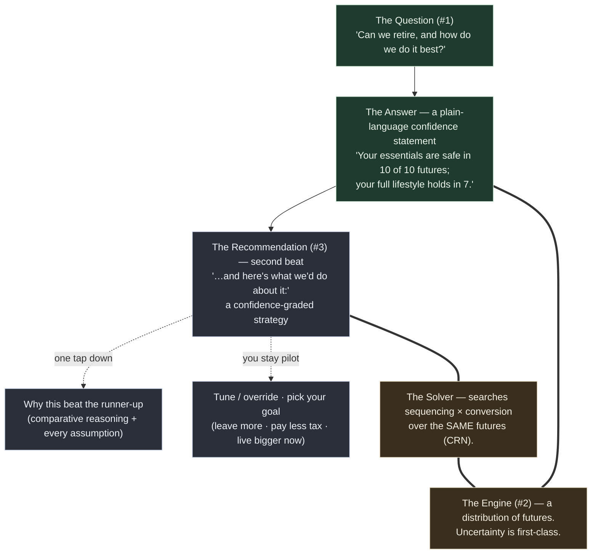

# The Back Nine — Product

A **personal** retirement / tax-strategy co-pilot for one married couple and a handful of friends. Never sold. This doc is the single home for the *why* and the *what*: the thesis, the product model, the locked decisions, the lever set, the carried landmines, and the full requirements ledger (R1–R40).

Precedence runs through two docs: **this one carries the *why* and the *what*; [docs/roadmap.md](roadmap.md) carries the *status*.** Because the tool is personal — never sold, no compensation, no holding-out — there is no regulatory net to lean on; the binding constraint is **honesty + engine validation**, and that constraint is *stricter* for it, not looser.

## 1. What this is

The thesis, in three sentences:

1. Tell me where I stand — *"your essentials are safe in 10 of 10 futures; your full lifestyle holds in 7"* (the spine — still the first magic moment).
2. Then, *"and here's what we'd do about it"* — a recommended, **confidence-graded** strategy (sequence withdrawals + convert) that funds your budget the tax-smartest way, with the full reasoning **one tap down**.
3. You stay the pilot: safety is the default floor, but **you pick the goal** above it (leave more · pay less tax · live bigger now), and every recommendation wears its own hedge on the headline.

**The wedge.** Across the incumbents a financially-literate household actually uses — ProjectionLab, Boldin, Monarch, Empower, Fidelity/Vanguard — the dominant failure is **consumability and data plumbing, not capability.** The tools can compute; they can't *be believed*. Run the same household through several and you get wildly different answers, which breeds distrust of any single number. People don't want another opaque number — they want **permission and confidence.** The Back Nine's answer is to be **manual-first and local-first** (which also sidesteps the hardest incumbent failure, account-aggregation plumbing) and to spend its honesty budget on making the answer *trustworthy and readable* rather than precise-looking. *(The corpus that grounds this is FIRE-skewed, so the consumability pain is likely understated, not overstated — the claim stays falsifiable.)*

## 2. The cardinal rule

**Calm-but-wrong is the cardinal sin, and the bar RISES for a recommender** — a wrong recommended strategy costs real dollars. *"It's just for friends" must never soften validation*: friends risk identical real money with **less** protection and trust the tool **more**. The removal of the regulatory net is a **load transfer onto correctness + confidence-grading**, never a loosening.

This is not a tone preference. It is the governing constraint on every engine decision, every disclosure, and the voice itself. A confidently-stated wrong strategy is worse than no tool at all.

## 3. The product model

The spine answers one question, then — **second beat** — proposes what to do about it, with the full reasoning one tap down. Safety is the default floor; above it, **you pick the goal**. Complexity is disclosed progressively; that restraint *is* the experience.

**face (#1) ← engine (#2) ← recommendation (#3):** the question is the face; the longevity+tax engine is the only thing that can answer it; the **solver** proposes the strategy that improves the answer. Same principle governs input and output: *answer first, recommendation second, precision/reasoning on demand.* The recommendation **never contradicts** the spine answer — they speak the same metric (see R21).

**The state-adaptive first answer.** The magic moment **adapts to user state** (R29) — one intake flow, only the *lead answer* changes:

- A **not-yet-retired** household leads with **the fuck-off date** — *"when is work optional?"* — delivered as **two confidence-graded dates** (floor + lifestyle, R27/R28), computed by sweeping the household work-stop date-offset over the *same* confidence engine.
- An **already-retired** household keeps the calm spine confidence statement as its lead.

Same calm voice (R11), one intake flow for both states (R35) — never a second intake.

> **Accumulation is a bounded on-ramp, not a FIRE calculator.** The pre-retirement accumulation phase exists in service of the decumulation strategist, which remains the center of gravity. Modeling **zero** contributions to a still-working household's accounts would understate its nest egg — calm-but-wrong in the *pessimistic* direction — so the engine projects each account forward through continued contributions + market growth (R30). This is **not a new engine**: the fuck-off date is the *existing* confidence engine **swept over the household work-stop date-offset** (R26). The accumulation phase is bounded to a near-retirement on-ramp (the search window is ≤~11 offsets), and v1 **projects** the user's stated savings plan — it does not optimize it (R32).

## 4. Locked product decisions

| # | Decision | Resolution |
|---|----------|-----------|
| **D1** | What does "best" mean? | **Lexicographic.** Tier 1 = never drop below the survival floor (essentials always covered — the spine's voice, honors R2/Kitces). Tier 2 = a **user-chosen** goal among the surplus: *leave more · pay less tax · live bigger now.* The objective metric is the **same quantity as the headline** so a recommendation can never contradict the magic moment. |
| **D2** | Recommend-first or -second? | **Recommend-*second*.** Spine answer stays the first magic moment; the recommendation is the immediate next beat, math one tap down (depth-on-demand). Protects the calm on-ramp + keeps Phase 2 reusable. |
| **D3** | Phase shape? | **Four phases:** Foundation → First Answer → **Controls** (manual sequencing + Roth, a shippable cold-read milestone) → **Solver & Recommendation.** |
| **D4** | Solver search space (MVP)? | **Named drawdown policies × a conversion grid** (proportional / taxable-first / pre-tax-first / bracket-fill), not full continuous optimization. Bounds compute (TS stays viable, WASM stays a fast-follow), keeps the comparative story legible, shrinks optimizer's-curse exposure. |
| **D5** | Confidence + curse defense? | **Held-out reporting seed** (select on seed-set A, grade on B) **+ an optimality oracle built *before* the solver.** Non-negotiable — this is the raised honesty bar made concrete. |
| **D6** | Tax scope? | **ACA-PTC (pre-65) and IRMAA (post-65) come IN** — they are income-dependent, so a sequencing/conversion change moves them, and an omitted cliff *inverts which strategy wins* (not just its size). NIIT / state stay **OUT-but-disclosed**. Falsifiable line: **IN iff sequencing or conversion can move it.** |
| **—** | Regulatory frame | **Relaxes to wording.** As a personal, non-commercial tool, The Back Nine meets neither the relationship nor the compensation prong of Reg BI / the Investment Advisers Act, so no advice-regulation constraint binds: the reg guardrails (no-verdict, no-optimizer, categorical-only triggers, attorney-gate, "we can't see your money" *claim*) drop or relax. **The load transfers to honesty + validation, which get stricter** — "it's just for friends" never softens validation. The early-stage guardrails and the supporting analysis (the IAA §202(a)(11) Prong-A reading that a Roth what-if naming no securities is likely not "advice about securities," countered by SEC Reg BI / IA-5249 — defensible, not airtight) are **recorded as rationale** so a future re-commercialization can re-instate them deliberately rather than over-rely on that defense. |

## 5. The lever set

**MVP — solver-optimized** (there's an objectively right answer once the goal is fixed):
- **Withdrawal sequencing** — which bucket funds each year's net withdrawal.
- **Roth conversion** — amount + years.

**MVP — user-set** (no "right" answer; a tool must never *recommend* a lifestyle — it shows honest consequences):
- **The budget** — itemized, with **time-boxed line items** (travel runs yrs 1–20 then stops; the healthcare gap runs retirement→65). Essentials vs discretionary.
- **The goal** — the Tier-2 pick (leave more / pay less tax / live bigger now), including a **go-go-years spending shape**.

**Chapter two (named, deferred):** SS-claiming-age (heavy, solver-optimizable, big for the survivor benefit); a full **continuous** optimizer; a **"die with zero"** spend-down solver (needs a disclosed life-value model); **asset-location** (modelable later as a *deterministic per-bucket tilt on the one shared draw* — capability without breaking CRN); **contribution-strategy optimization** (traditional-vs-Roth allocation to pull the date in — deferred-for-sequencing, not off-thesis; R32).

## 6. Carried landmines

These come from the adversarial assessment and **must survive** every re-plan. They are the failure shapes a recommender can fall into without noticing.

- **Objective ≡ headline metric**, or the product recommends a move that worsens its own hero number. *(D1 lexicographic resolves it.)* Watch the R2/Kitces "never maximize" tension — the floor-first framing is the reconciliation.
- **Optimizer's curse rendered as confidence** — argmax over many candidates on one seed overfits that seed's noise. *Held-out seed + optimality oracle before the solver.* Compounded by directional-until-pinned fixtures deciding the near-ties.
- **A disclosed omission inverts a ranking** (not just blunts a delta) → why ACA/IRMAA come IN (D6).
- **A stale saved recommendation is a real, executed action** — Unit 9's "re-present under saved vintage" rule may need to **invert to re-solve under current fixtures** for a recommendation; staleness must read *"the action we recommended may no longer be advised,"* not *"your number drifted."*
- **"Require the hedge on the headline" is a copyGuard lint shape** (a positive/require assertion, not a ban-list) — build it mechanically or hedge-burial drifts in silently.
- **The 10/10 clamp eats the solver's signal** for over-funded households — when survival is a given, honestly **switch the headline to the tax/wealth/lifestyle metric** ("you're safe either way; this keeps more from the IRS"). The lexicographic Tier-2 *is* this pivot.
- **Spending/lifestyle is never solver-recommended** — only user-set with honest consequences. The solver optimizes *funding*, not how you live.

## 7. Requirements ledger (R1–R40)

The locked contract. Terse by design — this is a reference, not prose. Numbers are immutable.

**The Confidence Spine (the first magic moment)**
- **R1.** The product answers one primary question — *"Can we retire, and how do we do it best?"* — as its central, first-class surface. Everything else is subordinate to it.
- **R2.** The answer is a **plain-language confidence statement** that leads with the verdict in human terms, framed for the household and honest about the survivor case. It **separates survival from lifestyle** where the budget supports it (*"essentials safe in 10 of 10; full lifestyle holds in 7 — in the other 3 you'd trim discretionary, not go hungry"*). Borderline/off-track answers use Kitces's **"probability of adjustment"** framing — never "failure" — expressed as the dollar move that keeps the plan safe. No histograms, no bare percentages-as-jargon, no dashboard on the primary surface. Meaning must never depend on color alone.
- **R3.** The engine models a **distribution of possible futures** (uncertainty is a primary input, not bolted on), not a single deterministic projection. The confidence statement is the humanized reading of that distribution. "Success" as a `$1`-remaining binary hides magnitude, so the engine reports **terminal-value percentiles + depth-of-failure**, not just pass/fail — that distribution is what feeds R2's "probability of adjustment" dollar-grammar. *(Engine-output contract: [docs/architecture.md](architecture.md) §7.)*
- **R4.** After the verdict, all supporting detail — the range, the assumptions, the math, and the recommendation's reasoning — is reachable **on demand but never shown unsolicited** on the first surface.

**The On-Ramp (input)**
- **R5.** First contact is a **guided, one-question-at-a-time intake** (calm, advisor-style). The account-level guided setup (R35) is the on-ramp for both user states, the answer surfacing and sharpening during the flow; the itemized budget (R20) is the *deepening*, not the on-ramp — the calm first answer is never gated behind a full budget. Never a wall of forms.
- **R6.** A **power-user escape hatch** lets a user set any assumption precisely at any point, without walking the guided path.
- **R7.** **Every assumption the flow makes on the user's behalf is visible and editable on demand** — *and this gains weight under recommend-second:* a recommended strategy must expose its inputs **and its reasoning** for the user to trust and approve it.
- **R8.** **Input mirrors output:** the user reaches a caveated answer quickly, then *sharpens*. Each piece of added precision **sharpens the confidence band** — it *narrows* on added precision and *shifts honestly* on a corrected value (it does not only ever narrow). Refinement is rewarding, never punished for honesty.

**The Strategy Engine — recommend-second co-pilot (the differentiator)**
- **R9.** The product **proposes a recommended strategy** over **two coupled, solver-optimized controls** — **withdrawal sequencing** (which account funds each year's spending) and **Roth conversion** (amount + years) — to fund the budget the tax-smartest way. Sequencing is the more universal control; the survivor's tax cliff is the emotional headline story.
- **R10.** **Recommend-*second* flow:** (a) the spine confidence answer **first** (the magic moment); (b) **then** *"here's what we'd do about it"* — a proposed, confidence-graded strategy; (c) the **comparative reasoning** one tap down; (d) the user **tunes / overrides / re-picks the goal**, both futures updating. The agency model is **system-proposes / user-approves**.
- **R11.** The recommendation is **calm and invited into the second beat — never a nagging alert, badge, or engagement bait.** Calm is never traded for engagement (the consumability wedge survives the posture change).

**The Budget (the spending model)**
- **R20.** Spending is expressed as an **itemized, categorized budget** the user builds: **essentials vs discretionary**, with **time-boxed line items** (e.g. travel for the first N years then stops; the pre-65 healthcare gap from retirement age to 65). Structurally, **essentials *are* the safety floor; discretionary *is* the surplus** the strategy optimizes the funding of (R21). The user expresses *what they want*; the solver finds the tax-smart way to *fund* it. Spending shape (front-loaded "go-go years" vs level) is **user-set, never solver-recommended** — the tool shows honest consequences, it does not tell you how to live.

**The objective & confidence grading**
- **R21.** The objective is **lexicographic.** **Tier 1 (always, the floor):** never drop below the survival floor — essentials covered across the futures, spoken in the spine's voice. **Tier 2 (the user chooses):** what to do with the surplus — *leave more · pay less tax · live bigger now.* **The objective metric is the same quantity as the headline metric**, so a recommendation can never recommend a move that worsens the hero number it just showed. When survival is a given (over-funded household), the headline honestly **pivots** to the chosen surplus metric (*"you're safe either way — this keeps more from the IRS / funds more travel"*).
- **R22.** Every recommendation **grades its own confidence** — *robust-across-all-futures ("just do it")* vs *coin-flip ("here's what it hinges on")* — and **the hedge rides on the headline**, never buried in tapped-away math. Depth-on-demand must not invert into certainty-on-top / caveats-hidden-below.
- **R23.** The recommendation's depth is **comparative** — *"why this strategy beat the runner-up,"* retaining and surfacing the runner-up — not a formula dump.

**Healthcare (income-dependent cost)**
- **R24.** The model accounts for **income-dependent healthcare across the Medicare line**: **pre-65 ACA marketplace cost** (a Premium Tax Credit that scales with MAGI — **2026 base case = the 400% FPL cliff is back**; enhanced subsidies expired 12/31/2025 and are unre-enacted as of 2026-06-04; expose "enhanced" as a scenario toggle and **re-verify at every build**); **post-65 IRMAA** (a Medicare surcharge on a **2-year MAGI lookback**, a *different* MAGI definition, hard per-person cliffs); and **HSA** as a fourth account bucket (covers out-of-pocket + 65+ Medicare premiums tax-free, **not** ACA premiums; Medicare enrollment ends HSA contributions). Healthcare **couples into the strategy objective** — a conversion that torches an ACA subsidy or trips an IRMAA cliff must be *seen*, not silently optimized over. The engine maintains **two distinct MAGI calculators** (ACA-MAGI = AGI + tax-exempt + non-taxable SS + excluded foreign; IRMAA-MAGI = AGI + tax-exempt, **no** SS add-back), and funding from qualified Roth / return-of-basis / cash / HSA spend counts toward **neither** — so the funding-source order materially changes the feedback-loop strength. Dated tax provisions carry a sunset marker so an answer computed under a provision (e.g. the Senior Bonus Deduction, tax years 2025–2028) shows a calm note when viewed in or after the sunset year. Numbers + the two-MAGI mechanics live in [docs/research/engine-validation-and-tax.md](research/engine-validation-and-tax.md) + [docs/research/pre65-healthcare.md](research/pre65-healthcare.md) and [docs/architecture.md](architecture.md) §7.2 (directional until pinned).

**Voice & Honesty**
- **R12.** The product **does make recommendations** — but **every recommendation is probabilistically framed and confidence-graded.** Certainty language stays banned (*"guaranteed / optimal / locks in / you will save"*). String-level enforcement is **"require the hedge on the headline"** (a positive/require lint, not just a ban-list — see the copyGuard note in [docs/architecture.md](architecture.md)).
- **R13.** An **optional** in-product honest-limits note (*"this is a model — validate big, irreversible moves with a pro"*) — kept on **honesty** grounds for friend-users. There is no Terms/License and no RIA entity.
- **R14.** Scary, complex truths are stated in **plain human language without being dumbed down** (*"9 of 10 versions of your future,"* not "85% Monte Carlo success").
- **R25 (the cardinal honesty requirement).** Calm-but-wrong is the cardinal sin and the bar rises for a recommender; "it's just for friends" never softens validation, and removing the regulatory net is a load transfer onto correctness + confidence-grading. *(Full canonical statement: §2.)*

**Trust & Data Safety** *(personal hygiene, justified on engineering grounds)*
- **R15.** No user-facing **marketing privacy claim** is required or made (personal tool, no audience to make it to). The underlying honesty — *don't misrepresent what the architecture does* — survives.
- **R16.** The financial picture is **encrypted at rest** and **local access is guarded** (a lock for a shared laptop) — basic hygiene for real financial PII, **independent of any marketing claim**. The crypto bar may be *reasonable* rather than maximalist (PBKDF2-600k is acceptable; the maximalist Argon2id justification is no longer load-bearing).
- **R17.** **Survivor recovery is load-bearing** — the product exists for the survivor case. A client-generated **recovery phrase + mandatory export** and the **two-person / shared-household** recovery posture hold; the framing is durability, not a trust-building ceremony.
- **R18.** The user can **export and back up their own data** — for **durability** (no single point of total loss).
- **R19.** Manual-entry inputs are **sanity-checked**: impossible/incoherent inputs are caught calmly inline, never producing a silently broken or falsely confident answer. Degenerate-but-coherent inputs return an honest extreme or the defined indeterminate state, never a crash (a `$0` portfolio with positive spending is the honest "0 of N"; an accumulation construct with `initialPortfolio == 0` is rejected as indeterminate) — a two-layer gate (each overlay throw has a `validateParams` mirror); the numeric mechanics are canonical in [docs/architecture.md](architecture.md) §6.

**Accumulation → the fuck-off date**
- **R26.** The tool answers **"when is work optional?"** — *the fuck-off date* is the product framing for this answer, **delivered as the two dates of R27** (never a single number). It is computed by **sweeping the household work-stop date-offset `Y`** (years from now) over the existing confidence engine — project accumulation to each candidate offset, decumulate from there, read the confidence — **not** a new engine. The axis is the household date-offset `Y` because the engine's per-person model cannot express a household age: each **still-working** person's `retirementAge` becomes `currentAge_i + Y`; an **already-retired** member keeps their entered retirement age **verbatim** (never un-retired into phantom income); an **all-retired household never enters the sweep** — it short-circuits to the spine-first answer. The search is **non-monotone-robust**: because healthcare turns on at the tested date (R33) and the ACA 400%-FPL cliff is a documented engine discontinuity, a *later* work-stop date is **not** guaranteed safer. So the search **exhaustively evaluates every candidate offset across the bounded on-ramp window** (≤~11 offsets — cheap) and reports the earliest offset at which a date's condition holds **and keeps holding for every later in-window offset**, disclosing any non-monotone region — never a monotonicity-assuming bisection that could return a **false-earliest** date (the calm-but-wrong sin, R25).
- **R27.** The answer is **two dates**, from the locked lexicographic objective (R21), both judged at the **same confidence bar** — differing only in *which* budget: (a) the **floor date** — earliest offset *essentials* hold across the futures (the literal "don't HAVE to work" line); (b) the **lifestyle date** — earliest offset the *full* (essentials + discretionary) budget holds **at that same confidence bar**. The sweep evaluates `Y ≥ 0` only, so the engine produces **no evidence about the past**: for an over-funded household a floor-confirmed `Y == 0` date means **"work-optional AT today"** (fully evidenced, every later in-window offset evaluated) — never a claim about when freedom *began*. In the degenerate single-total-spend budget the two dates coincide; the itemized budget splits them. `floor ≤ lifestyle` is an *expected* property, **not** an engine assertion — the 100%-FPL PTC eligibility floor can legitimately invert it (less spending → lower MAGI → below the floor → PTC = 0 → discontinuously worse cost), which is correct, surprising-but-honest engine output that rides a disclosure.
- **R28.** Both dates are **confidence-graded, never hard lines.** They incorporate accumulation-phase (runway) market uncertainty, so the output expresses the date↔confidence tradeoff ("lifestyle-free in ~3 years at 8/10, or year 5 for 9/10"). A single deterministic date is a banned calm-but-wrong simplification (R25). The date is graded under the **recommended (or user-selected) draw-down strategy** and **re-grades whenever the user overrides** sequencing/conversion (symmetric with R10's both-futures-update) — a date silently assuming a draw-down the user won't follow would itself be calm-but-wrong.
- **R29.** The framing **adapts the magic moment to user state**: a not-yet-retired user leads with the date ("you're ~N years out / free today"); the existing spine confidence statement (R2, in its R10 recommend-second position) stays the lead for an already-retired user. Same calm voice (R11), pointed at the date. *("Fuck-off date" is the working/product name; the user-facing readout holds the calm advisor voice — confirm the in-product label at design time.)*
- **The no-date outcome (R25's honesty surface, extended).** For a borderline household, every in-window offset can fail the bar. The master records the first-class **"no work-optional date within the ~N-yr window"** outcome — never "never free," never silently the window-top offset, never a crash — surfaced as a defined answer in the calm voice with the per-offset picture available. Its sibling: a date confirmed only **at the window edge** (zero later offsets of keeps-holding evidence) is reported **with an explicit unconfirmed-tail disclosure** — folding it into "no date" would be pessimistic-false; crowning it silently would be unconfirmed-optimistic. Honesty in both directions; the pessimistic direction is *designed*, not accidental.
- **R30.** The tool models the **pre-retirement accumulation phase**: from current balances, it projects each account forward through continued **contributions + market growth** to the work-stop date under test, producing the retirement-onset balance + basis per bucket the existing decumulation engine consumes.
- **R31.** Contributions are **per-account, flat in real terms**, and **stop at the work-stop date under test** (stop working → stop contributing). **Employer match** on workplace accounts is captured (free money that materially moves the date; match is **pre-tax even on a Roth 401k** — the default rule; a Roth employer match is an optional plan feature, deferred). No raise/promotion curve in v1.
- **R32.** v1 **projects** the user's stated savings plan; it does **not optimize** accumulation. Solver controls stay **decumulation-only** (sequencing + conversion). Contribution-strategy optimization (e.g. traditional-vs-Roth allocation to pull the date in) is a **future version** — a **sequencing call** (the decumulation solver ships first), not an off-thesis exclusion: traditional-vs-Roth contribution allocation is genuinely a **tax optimization** the solver could own, deferred-for-sequencing. The amount/shape you save stays yours (R20-style); the tax-bucketing of it is solver-eligible later.
- **R33.** **Healthcare modeling is OFF during accumulation** (working years = employer plan) and switches **ON at the work-stop date under test** — each candidate is "stop earned income *here* → ACA (pre-65) / IRMAA (post-65) costs begin *here*." The engine's healthcare gate is the **biological-65 split + a per-year premium stream — there is no retirement boundary anywhere in the overlay**. Healthcare-on-at-the-tested-date is therefore the date-search **constructing per-candidate cost streams**: premium/SLCSP/out-of-pocket-medical streams zero for working years `[0, Y)` and the entered age-anchored values from `Y`; Medicare/IRMAA onset **per-person** `= max(65th sim-year, work-stop)` over the living set; plus a conservatively-high **working-year IRMAA-MAGI additive override** so the 2-year lagged read never finds a falsely-$0 working year. The streams ARE the gate — caller-side work, not an engine knob.
- **R34.** Accumulation **inherits the engine invariants**: accumulation and decumulation **share ONE continuous absolute-year market-draw timeline** (a single `buildDraws` stream indexed from `currentAge` — **never** a separate pre-phase draw stream), so candidate offsets see **byte-identical** year-*t* returns in their overlapping years and the date-search ranks them on **identical futures** (CRN). A separate-stream handoff would silently turn the ranking from signal into luck — the same hazard as the forbidden per-bucket draw. Consequently the date's confidence is read off **one per-path future end-to-end** (runway draws *then* decumulation draws on the same path — no averaged-balance handoff), so **sequence-of-returns risk in the final working years** (a crash on the largest-ever balance) is honestly priced into the date, never smoothed away. **No accumulation-phase income-tax engine** (the destination *bucket* carries the tax character — pre-tax / Roth / taxable+basis). An **empty** accumulation phase (`Y == 0`) consumes **zero** extra draws and reduces **byte-identically** to today's decumulation-from-`initialPortfolio` behavior.
- **R35.** The first answer comes from a **complete ~5-minute guided, account-level setup** — *~5 minutes with account statements and a recent marketplace quote on hand* (the honest axis is data **availability**, not keystrokes): name, DOB, salary, SS estimate + claim age per person; then each **account** (type: IRA / 401k / brokerage / HSA), its **holdings**, current **value**, cost **basis** (taxable, per account — R37), and **annual contribution + employer match**. **This is ONE intake flow for both user states** — the account data feeds the withdrawal-sequencing strategy that IS the already-retired user's product; only the **lead answer** is state-adaptive (R29), never a second intake. The household **retirement-spend figure** is a collected input (it remains the v1 degenerate budget on which R27's two dates coincide; the itemized budget arrives at the Controls act). The setup is a **single entry pass — never coarse-then-detailed re-entry**; the first answer **surfaces and sharpens during the flow** rather than gating behind a final "calculate." **The provisional/final distinction applies to BOTH lead answers**: the already-retired route's spine confidence statement renders in the same provisional form between input acceptance and account-set completion (a half-entered portfolio reads falsely off-track — the pessimistic mirror of the date route's trust hazard).
- **R36.** Account **values are user-entered; no live price lookup** — consistent with the load-bearing no-runtime-external-fetch architecture (strict CSP `connect-src 'self'`, offline-first PWA, deterministic replay). A holding's ticker/CUSIP is a **label + asset-class hint**, never a live-price key.
- **R37.** Because the engine does **no asset-location** (one shared market draw), per-ticker holdings **collapse to a single household stock/bond/cash blend** for the math. Ticker entry still earns its keep: it auto-derives that blend (no "guess your allocation" question) and is the "it sees my real portfolio" trust moment. Taxable cost basis is captured **per taxable account, not per lot** — the engine consumes one aggregate `initialTaxableBasis`; per-lot is collectible-but-unused precision, deliberately not collected. Tickers map to an asset class via a **bundled common-instrument table** with **manual classification** for anything unrecognized (offline-safe).
- **R38.** *(HSA phase boundary.)* **HSA contributions** belong to the accumulation phase (R30–R34); **HSA spend** — the MAGI-invisible qualified-spend lever and the post-65 non-qualified laundering rule — stays in decumulation. Each lands in its own phase.
- **R39.** *(Data safety — inherits the master.)* Every R35 field — account / holding / value / basis, salary, DOB, SS estimate + claim age — **plus the pre-65 ACA cost inputs (SLCSP benchmark + enrolled-plan premium), the IRMAA-MAGI seed, the working-year income figure the conservative IRMAA-MAGI override is built from, the per-person work-status / retirement-stop-age field, and the per-year out-of-pocket-medical stream** — is financial PII (health-plan, employment, and income disclosures riding the same record) that **inherits the master's posture unchanged**: encrypted-at-rest + guarded local access (R16), survivor recovery (R17), export/backup (R18). The new fields extend the persisted `Scenario` schema **additively** (a `schemaVersion` bump owned by the store's migration ladder) and live **only inside the existing encrypted record** — never a separate or plaintext holdings store. The R35 field list is **not the closed PII set**; any later-added intake field joins this posture by default.

**Other income in retirement (R40)**
- **R40.** Model a generic **per-person ongoing non-earned income stream** — type ∈ {pension, rental, alimony, annuity, **other**} — that keeps paying after work stops. The engine knows `earnedIncomeReal` (which *stops at retirement*) and Social Security, and has **no concept of ongoing non-earned income** — for a household that has one, that gap is the difference between a defensibly-conservative answer and a confidently-wrong-optimistic one. Sub-requirements:
  - **R40.1** Generic per-person stream; the type seeds defaults only.
  - **R40.2** Each stream carries: gross `annualRealToday`, `startAge`, optional `endAge`, a COLA mode ∈ {real-flat, nominal-flat, fixed-pct} (+ `colaPct`), a `taxableFraction` ∈ [0,1] (default 1), and a `survivorPct` ∈ [0,1].
  - **R40.3** Compile each stream to pre-deflated real-$ per-year vectors; the engine is a dumb consumer; survivor-% is pre-applied as a second variant at compile time.
  - **R40.4** The taxable portion enters ordinary income such that SS-§86 provisional, ACA-MAGI, and IRMAA-MAGI all move **consistently in one atomic change**, including the already-receiving × working-year IRMAA reconciliation. *(The two MAGI calculators are distinct — R24.)*
  - **R40.5** Survivor continuation is realized at the owner's **sampled death** in the path loop, selecting the pre-weighted survivor variant, locked at the death offset, never ramped.
  - **R40.6** Reduce-to-spine byte-identity: a household with no streams is byte-identical (same seed) to the current Trinity/Bengen spine.
  - **R40.7** Intake is opt-in off the 5-minute guided path; the **no-safe-default fields** surface on the guided path regardless of the collapsed advanced tier: the **survivor-% prompt for any continuing stream** (pension/annuity/rental/other — alimony is `survivorPct = 0` by law) and the **alimony post-2018 agreement-date**.
  - **R40.8** Ship the **"other"** catch-all stream alongside the four named types.
  - **R40.9** R40 is a **first-class entry in this ledger** — the per-person other-income stream is part of the contract, not an appendix.
  - **R40.10** All correctness goldens are **externally derived**; intake/restore validation is **finiteness-first** then range; engine-consumed figures obey the constants discipline; user-facing display-hint figures live in `referenceData.ts`, never `@engine/constants`.

  The **test-drivers** are real friends: one with rental income; one whose wife draws a **teacher's pension** — the single most dangerous number in the app (whether it *survives* her death and at what %, and whether it *keeps up with inflation*, is the whole widow's picture). Every survivor / COLA / basis simplification **rounds conservative or discloses its direction** — an undisclosed optimistic simplification is still the sin. The 9 key technical decisions behind R40 are recorded in [docs/decisions/other-income-r40.md](decisions/other-income-r40.md); the intake + engine build steps in [docs/plans/2-first-answer.md](plans/2-first-answer.md).

### Success criteria (where they belong)

- A user reaches their **first answer in one short sitting** from the complete ~5-minute account-level setup, the answer **surfacing and sharpening during the flow** rather than gating behind a final "calculate" — never a wall of forms.
- A not-yet-retired user reaches their **two confidence-graded fuck-off dates** in that same sitting; the dates honestly express the **date↔confidence tradeoff** (never a single hard date) — verifiable against the R25 honesty bar.
- With **no runway** (`Y == 0`), the tool reproduces today's decumulation answer **byte-identically** — the reduce-to-spine analog for the new phase.
- The fuck-off date moves in the **intuitively-correct direction** as inputs change (more saved / higher contributions / lower spend → earlier date) — **scoped: a discontinuity-free sanity oracle, NOT a universal.** It holds only with healthcare OFF, or with MAGI pinned away from **all three** modeled discontinuities at every candidate offset (the 400%-FPL cliff, every IRMAA tier boundary, AND the 100%-FPL eligibility floor). A cliff-straddling more-saved → equal-or-later date is **CORRECT engine output** — never to be "fixed" by forcing monotonicity.
- The primary surface shows **one answer, then one recommendation** — not a dashboard. (Calm test.)
- **Every assumption *and* the recommendation's reasoning** can be reached within one interaction from the answer. (Trust test.)
- A user watches a **recommended strategy visibly move the answer** (*"6 of 10 → 8 of 10"*) **and** sees it **correctly confidence-graded.** (Differentiation test.)
- **Correctness — two-tier:** the engine's *number* is right (validated vs Trinity/Bengen golden cases) **and** the solver's *recommendation* is right — validated against an **optimality/ranking oracle**, **ranking-stability under CRN**, and **grade calibration**. A calm-but-wrong recommendation fails the bar worse than no tool. (Correctness test — R25.)
- **N=1 cold-read (Briggsy):** across the survivor outcome states + the survivor readout, an on-track answer lands as relief and a borderline answer as honest-and-calm; **and** the recommendation feels *earned* (not overconfident), the "coin-flip" grade feels honest, and the comparative reasoning lands as transparency, not a bait-and-switch. (The bar.)
- **Every recommendation carries its probabilistic hedge on the headline.** (Honesty test.)

### Scope boundaries (the lines this product does not cross)

- **No account aggregation / Plaid in MVP.** Manual-first; revisit only when "crazily hardened."
- **No budgeting / transaction tracking / spend categorization as a tracker.** The budget builder (R20) is forward-looking *planning* input, not back-looking expense tracking.
- **The tax IN/OUT line:** a tax/health effect is **IN iff withdrawal sequencing or a Roth conversion can move it.** **IN:** ordinary brackets, standard deduction, RMDs, SS-taxation, the survivor MFJ→single switch, **ACA-PTC (pre-65), IRMAA (post-65)**, cap-gains/qualified-dividend stacking from taxable withdrawals. **OUT-but-disclosed:** NIIT (3.8%), state tax, ACA beyond the premium-credit. **Later (chapter two):** SS-claiming-age, a full continuous optimizer, a "die-with-zero" spend-down solver, asset-location.
- **Spending shape is user-set, not solver-optimized** (R20) — the solver optimizes *funding*, not how you live.
- **MVP solver search is bounded** — a handful of named drawdown policies × a conversion grid, not a full continuous optimizer.
- **No live net-worth / portfolio aggregation surface in MVP.**
- *Accumulation-side:* **Not** a decades-out FIRE / "are you on track" calculator — bounded to a near-retirement on-ramp. v1 does **not optimize** accumulation. **No live market data / price feeds** (R36). **No accumulation-phase income-tax engine** — during the runway the household lives on salary; working-year portfolio withdrawals are **clamped to zero while a living worker remains** (never simultaneous save-and-draw double-counting). **No raise / promotion / career modeling** — flat-real contributions (R31). The **"retired-but-still-contributing" HSA-MAGI edge is bounded + disclosed, not modeled** (a conservative one-directional simplification, the empty-overlap invariant is the engine guard).
- *R40 income-side:* **Not a FIRE lever, and not a general income ledger** — the "other" catch-all inherits the identity fence ("a real driver receives it and the answer depends on it" or it doesn't ship); dividends/1099/crypto are out unless a driver has one. OUT-but-disclosed (each with its direction named): rental sale events (optimistic), net-rental real-rise (optimistic, and it **compounds at the ACA cliff**), annuity/pension basis-recovery (optimistic-opt-in), alimony payer-death termination (optimistic), compounding-only COLA (optimistic side), survivor-specific end gate (forward landmine), NIIT, state-level alimony decoupling, annuity LIFO.
