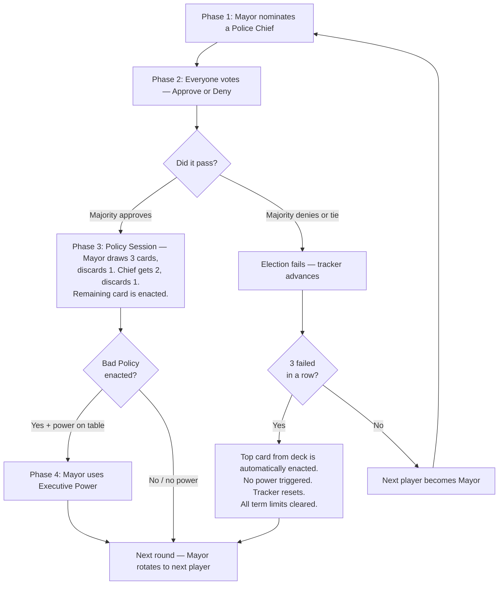

# Undercover Mob Boss — How to Play

*A social deduction game for 5–10 players. Same room. Phones out.*

---

## 30-Second Version

- **Two teams.** Citizens (good) vs. the Mob (bad). Roles are secret. Citizens don't know who anyone is.
- **Each round:** A Mayor nominates a Police Chief. Everyone votes. If it passes, the pair secretly enact a policy — good or bad.
- **The deck is rigged.** 11 bad cards, 6 good. Bad policy will happen. The question is *who let it happen.*
- **Citizens win** by enacting 5 Good Policies or executing the Mob Boss.
- **Mob wins** by enacting 6 Bad Policies or sneaking the Mob Boss into the Police Chief seat (after 3+ bad policies).
- **Lying is the game.** Accuse. Defend. Bluff. Trust no one.

---

## The Story

Millbrook City is corrupt. The mob has planted operatives inside city government. They sit at the same table as honest citizens. They vote on policy. They run for office. Nobody knows who's who.

The citizens must expose the mob before it seizes control. The mob must keep their cover and quietly take over. And somewhere among them is the Mob Boss — the most dangerous undercover operative of all.

---

## Roles

### Citizens (Good Guys)
Honest people trying to keep Millbrook City clean. They don't know who anyone else is. They win by:
- Getting **5 Good Policies** enacted, OR
- Finding and **executing the Mob Boss** (the Mayor can eliminate a player — see Executive Powers)

### Mob Soldiers (Bad Guys)
Undercover operatives who know each other's identities. They also know who the Mob Boss is. They work together to get bad policy enacted and protect the Mob Boss. They win by:
- Getting **6 Bad Policies** enacted, OR
- Getting the **Mob Boss elected as Police Chief** after 3 Bad Policies have been enacted (see How the Game Ends)

### Mob Boss
The most dangerous player in the game. The Mob Boss plays for the mob. However, their knowledge depends on the size of the game:
- **5–6 players:** The Mob Boss and Mob Soldiers know each other. Full team coordination from the start.
- **7–10 players:** The Mob Soldiers know who the Mob Boss is. But the **Mob Boss does NOT know who the Soldiers are.** The Boss must figure out their own team while staying hidden.

In all cases, the Citizens don't know who anyone is.

### Role Distribution

| Players | Citizens | Mob Soldiers | Mob Boss |
| --- | --- | --- | --- |
| 5 | 3 | 1 | 1 |
| 6 | 4 | 1 | 1 |
| 7 | 4 | 2 | 1 |
| 8 | 5 | 2 | 1 |
| 9 | 5 | 3 | 1 |
| 10 | 6 | 3 | 1 |

---

## Setup

1. **One person hosts the game** on a tablet or laptop. This is the shared screen everyone can see.
2. **Players join on their phones** using one of two methods:
   - **Scan the QR code** shown on the host screen. Enter your name and tap Join.
   - **Type the URL** with the room code. The host screen shows a 4-letter code.
3. Once 5–10 players have joined, the host taps **Start Game**.
4. The game secretly assigns roles based on player count (see table above).
5. **The game picks the first Mayor at random.** From then on, the Mayor role moves automatically to the next player in the list each round.
6. **Each player checks their phone privately.** Your screen shows:
   - Your role (Citizen, Mob Soldier, or Mob Boss)
   - If you're a Mob Soldier: who the other soldiers are and who the Mob Boss is
   - If you're the Mob Boss in a 5–6 player game: who your soldiers are
   - If you're the Mob Boss in a 7–10 player game: **nothing** — you're on your own
7. Tap your card to reveal your role. Then tap again to seal it (hide it). The game begins when everyone has sealed their cards.

---

## The Policy Track

The shared screen shows the city. It includes two policy tracks:

- **Good Policy track** — 5 slots. Fill all 5 and Citizens win.
- **Bad Policy track** — 6 slots. Fill all 6 and the Mob wins.

The Policy Deck contains: **6 Good Policies** and **11 Bad Policies**.

Yes — the deck is stacked against the city. That's the point.

> **Deck Reshuffle:** When the Policy Deck runs low, the discard pile is shuffled back in. The narrator will announce when a reshuffle happens.

---

## A Round of Play

Each round follows this flow:

### Phase 1: Nomination

The current **Mayor** nominates a **Police Chief** from the other players still in the game. The Mayor cannot nominate themselves.

**Term limits** restrict who can be nominated:
- The most recently **elected** Police Chief is always term-limited.
- In games with **6+ players still alive**, the most recently **elected** Mayor is also term-limited.
- In games with **5 players still alive**, only the previous Chief is term-limited.
- Term limits only change after **successful** elections — failed elections don't update them.
- If term limits would eliminate every eligible player, they are waived.

The Mayor picks on their phone. The nomination appears on the shared screen. Table talk, accusations, and debate are encouraged.

### Phase 2: Election

Every player still in the game votes on their phone — **Approve** or **Deny** — at the same time. Votes are revealed all at once on the shared screen.

- **Majority Approve** (more than half of all votes) — the Police Chief takes office. Move to Phase 3.
- **Majority Deny or Tie** — the election fails. The Election Tracker advances one step, and the next player becomes Mayor.

> **Three Failed Elections:** If three elections fail in a row, the top card from the Policy Deck is automatically enacted — no vote, no debate, no player choice. No executive power is triggered. The tracker resets and all term limits are cleared. This prevents the mob from stalling forever.

### Phase 3: Policy Session

The Mayor and Police Chief work together in secret — on their phones only. **No talking to each other during the session.**

1. The Mayor draws **3 Policy cards** (shown only on their phone).
2. The Mayor discards **1 card secretly** and passes the remaining 2 to the Police Chief.
3. The Police Chief discards **1 card secretly** and enacts the remaining card.

The enacted policy is revealed on the shared screen. The discards are never shown.

> Nobody else sees what cards were drawn. Both the Mayor and Police Chief are free to lie about what they saw. This is where the social deduction begins.

#### Veto Power (unlocked after 5 Bad Policies)

Once 5 Bad Policies have been enacted, the Police Chief gains the option to propose a veto — discarding both cards instead of enacting one. The Mayor then decides:

- **Mayor accepts:** Both cards discarded. No policy enacted. Election Tracker advances one step.
- **Mayor rejects:** The Chief must enact one of the two cards as normal.
- The Chief may only propose a veto **once per policy session**.

> Veto is a double-edged sword. It prevents a bad outcome but wastes a round and moves the tracker closer to an automatic enactment.

### Phase 4: Executive Power (Bad Policy only)

When certain Bad Policies are enacted, the **Mayor** gains a special one-time power that must be used immediately.

| Bad Policies Enacted | 5–6 Players | 7–8 Players | 9–10 Players |
| --- | --- | --- | --- |
| 1st | — | — | **Investigation** |
| 2nd | — | **Investigation** | **Investigation** |
| 3rd | **Policy Peek** | **Special Nomination** | **Special Nomination** |
| 4th | **Execution** | **Execution** | **Execution** |
| 5th | **Execution** | **Execution** | **Execution** |

**Policy Peek**
- The Mayor secretly views the top 3 cards of the policy deck
- The card order does not change
- The Mayor may share what they saw — or lie about it

**Investigation**
- The Mayor picks any other player to investigate
- The Mayor secretly learns whether that player is **Mob** or **Citizen**
- The Mob Boss shows as "Mob" — investigation cannot distinguish Boss from Soldier
- The Mayor may share the result — or lie about it
- The Mayor cannot investigate themselves
- No player may be investigated more than once per game

**Special Nomination**
- The Mayor picks any other player to be the next Mayor
- Even term-limited players are eligible
- After this round, normal rotation resumes where it left off

**Execution**
- The Mayor eliminates a player from the game
- The Mayor cannot execute themselves
- The eliminated player's role is **not revealed** — the table must work out whether they lost a friend or foe
- Eliminated players become spectators
- If the Mob Boss is executed, **Citizens win immediately**

---

## How the Game Ends

### Citizens Win If:
- **5 Good Policies** are enacted, OR
- The **Mob Boss is executed** at any point during the game

### Mob Wins If:
- **6 Bad Policies** are enacted, OR
- The **Mob Boss is elected Police Chief** after 3 or more Bad Policies have been enacted

Once 3+ Bad Policies are on the board, every election becomes dangerous. If the Mob Boss is nominated as Police Chief and the vote passes — **the mob wins instantly.**

But here's the flip side: if someone *is* elected Police Chief and the game continues, everyone at the table now knows **for certain** that player is NOT the Mob Boss. Use that information.

---

## Example Round

> **Round 3.** Sal is Mayor. He nominates Vince as Police Chief. The table debates — Vince has been quiet, which makes some people nervous. Everyone votes on their phones. Results flash on the big screen: 4 Approve, 2 Deny. Vince is in.
>
> Sal draws 3 cards on his phone: 2 Bad, 1 Good. He discards a Bad card and passes 1 Bad + 1 Good to Vince. Vince looks at his 2 cards, discards the Bad one, and enacts the **Good Policy.** The city breathes.
>
> But then Sal tells the table: *"I drew three bad cards. Vince got two bad cards. I don't know how a good policy came out."* Vince fires back: *"He's lying — he gave me one of each and I played the good one."*
>
> Someone is lying. The table erupts. That's the game.

---

## Table Talk

**Everything is allowed.** Lie, bluff, accuse, make deals, promise things you won't keep.

**The only restrictions:**
- You cannot show your phone screen to another player
- Once a vote begins, discussion stops until results are revealed

---

## Tips

**If you're a Citizen:**
- Watch voting patterns. Consistent approval of suspicious candidates is a tell.
- Pay attention to who defends whom after a bad policy is enacted.
- When a Police Chief blames the Mayor for a bad policy (or vice versa) — one of them is probably lying.

**If you're a Mob Soldier:**
- You don't need to enact bad policy every session. Sometimes enacting good policy builds trust.
- Protect the Mob Boss at all costs. If suspicion lands on them, redirect it.

**If you're the Mob Boss:**
- Play like a Citizen. Vote like a Citizen. Talk like a Citizen.
- Let your soldiers do the dirty work.
- Bide your time.

---

## Your Phone

During the game, your phone handles everything:
- **Lobby:** Join the game, see other players
- **Role reveal:** Tap to see your secret role, tap again to seal it
- **Nomination:** If you're Mayor, pick a Police Chief
- **Voting:** Tap Approve or Deny
- **Policy Session:** If you're Mayor or Police Chief, draw and discard cards
- **Executive Powers:** If you're Mayor, use your power

The host screen shows everything public — nominations, vote results, enacted policies, and the narrator.

---

## The Narrator

The game's narrator speaks at key moments — role reveals, election results, policy enactments, power plays, and game over.

*Don't skip it. That's half the experience.*

---

## Key Terms

Quick reference for terms used in these rules:

| Term | Meaning |
| --- | --- |
| **Social deduction** | A game where players have hidden roles and must figure out who's who through conversation and observation |
| **Role** | Your secret allegiance: Citizen, Mob Soldier, or Mob Boss |
| **Position** | Your elected office: Mayor or Police Chief. Separate from your role |
| **Mayor** | Nominates a Police Chief each round. Rotates automatically |
| **Police Chief** | Nominated by the Mayor, approved by vote. Works with the Mayor to enact policy |
| **Enacted** | A policy card placed on a track. Permanent |
| **Sealed** | Your role card is hidden after you've viewed it |
| **Term-limited** | A player from the last elected government who can't be nominated as Police Chief next round |
| **Election Tracker** | Counts consecutive failed elections. At 3, a policy is auto-enacted |

---

*Version 4.0 — TL;DR added, round flow diagram, worked example, forward references fixed, executive powers bullet-ified, "Your Phone" section, key terms moved to reference table*
