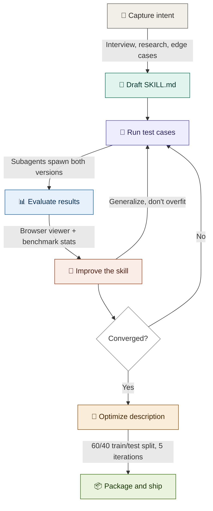

# The Skill Creator: A Practitioner's Guide to Engineering Agent Skills

**Version:** 1.1 | **Last Updated:** 2026-04-16 | **Author:** Claude (with Briggsy)
**Part of:** [Skills 2.0 — Reference Collection](README.md). Companions: [Claude Skills 2.0 — User Guide](Claude_Skills_2.0_User_Guide.md), [Skills, Agents, and Subagents — Oh My!](Skills_Agents_and_Subagents_Oh_My.md).

---

> Anyone can write a SKILL.md file. That's the easy part. The hard part — the part that separates a prompt file from a production-grade agent capability — is knowing whether it actually works.

**What's in this doc.** The engineering discipline for shipping skills that survive realistic use. The Skill Creator meta-skill (what it is, what's in the box). The 7-phase development loop, walked through end-to-end on a worked PR review example. Phase-by-phase mechanics: capture intent, draft, test, evaluate, improve, optimize description, package. The governance angle — how to gate skill deployment behind evals, the same way you gate code behind tests. Environment compatibility matrix. Best practices and pitfalls. The strategic framing: why "build skills, not agents" is more than a slogan once you can engineer them.

**Who it's for.** Anyone shipping skills that need to work reliably — solo developers building a PR reviewer, team leads standardizing deployment workflows, enterprise architects packaging institutional knowledge. If the skill matters enough to exist, it matters enough to test.

**How long it'll take.** ~30 minutes for the first read. The worked example (§4–§11) threads a single PR review skill through every phase, so you can read it linearly or jump to a specific phase as reference.

**What to read next.** [Skills, Agents, and Subagents — Oh My!](Skills_Agents_and_Subagents_Oh_My.md) for the architectural framing of where skills sit relative to agents and subagents, or the [Claude Skills 2.0 User Guide](Claude_Skills_2.0_User_Guide.md) for the full anatomy / runtime / distribution treatment. The [hub README](README.md) frames the whole collection.

---

## Executive Summary

**What is the Skill Creator?** A meta-skill — a skill that creates, tests, and iterates on other skills. It ships as a Claude Code plugin (`/skill-creator`) and is also available in Claude.ai and Cowork with reduced capabilities. It's among the most-used skill development tools in the ecosystem (Anthropic doesn't publish per-plugin install counts, so absolute rankings aren't verifiable, but it's first-party, ships in the official `anthropics/skills` marketplace, and is the canonical reference for skill engineering discipline).

**Why does it matter?** Before the Skill Creator, skill development was vibes-based: write a SKILL.md, try it a few times, ship it, hope for the best. There was no way to systematically measure whether a skill improved Claude's output, no A/B baseline to compare against, and no framework for iterating based on evidence. The Skill Creator makes skill development a proper engineering discipline — with test cases, assertions, grading agents, blind comparisons, benchmarks, and a description optimizer that uses train/test splits to prevent overfitting.

**Who is this for?** Anyone building skills that need to work reliably — whether you're a solo developer creating a PR review skill, a team lead standardizing deployment workflows, or an enterprise architect packaging institutional knowledge. If the skill matters enough to exist, it matters enough to test.

**The thesis:** The game-changer isn't that you can build skills. It's that you can **engineer** them — systematically test, measure, and iterate until they're production-grade. This is what turns AI agent capabilities from art into engineering.

---

## Table of Contents

1. [Why Engineering Skills Matters](#1-why-engineering-skills-matters)
2. [What's Inside the Box](#2-whats-inside-the-box)
3. [The Core Loop](#3-the-core-loop)
4. [Worked Example: Building a PR Review Skill](#4-worked-example-building-a-pr-review-skill)
5. [Phase 1: Capture Intent](#5-phase-1-capture-intent)
6. [Phase 2: Draft the Skill](#6-phase-2-draft-the-skill)
7. [Phase 3: Test Cases & Execution](#7-phase-3-test-cases--execution)
8. [Phase 4: Evaluate](#8-phase-4-evaluate)
9. [Phase 5: Improve](#9-phase-5-improve)
10. [Phase 6: Optimize the Description](#10-phase-6-optimize-the-description)
11. [Phase 7: Package & Ship](#11-phase-7-package--ship)
12. [The Governance Angle: "Show Me Your Tests"](#12-the-governance-angle-show-me-your-tests)
13. [Environment Reference](#13-environment-reference)
14. [How It Compares to Community Tools](#14-how-it-compares-to-community-tools)
15. [Best Practices & Pitfalls](#15-best-practices--pitfalls)
16. [The Bigger Picture: Skills, Not Agents](#16-the-bigger-picture-skills-not-agents)

---

## 1. Why Engineering Skills Matters

Here's a scenario that plays out thousands of times a day: someone writes a SKILL.md file, tries it a couple times, says "looks good," and ships it. Three weeks later, a teammate uses it on a slightly different input and it produces garbage. Or the model updates and the skill's carefully tuned phrasing stops working. Or someone else on the team writes a similar skill that conflicts with it.

This is the **vibes-based approach** to skill development. It works for personal experiments. It does not work for anything that matters.

The Skill Creator exists to replace vibes with evidence. Specifically, it answers three questions that vibes cannot:

**"Is this skill actually better than no skill?"** — A/B testing runs the same prompt with and without the skill, producing a direct comparison. You'd be surprised how often a skill makes things *worse* by overconstraining Claude.

**"Does it work across different inputs?"** — Running 2-3 realistic test prompts (not cherry-picked easy cases) reveals whether the skill generalizes or only works on the exact example you had in mind.

**"Does the right user input actually trigger it?"** — The description optimizer generates 20 realistic queries (both should-trigger and should-not-trigger), runs them through Claude's matching logic, and iterates the description until trigger accuracy hits 90%+.

The analogy to software engineering is exact: you wouldn't ship code without tests. You shouldn't ship skills without evals.

---

## 2. What's Inside the Box

The Skill Creator is a single meta-skill with a substantial toolbox. Here's what you're actually getting:

### The Core Components

| Component | What It Does |
|-----------|-------------|
| **Intent Capture** | Interviews you about what the skill should do, when it should trigger, expected outputs |
| **SKILL.md Generator** | Drafts the skill based on your answers, following Anthropic's writing guide |
| **Test Runner** | Spawns parallel subagents — one with the skill, one without — on each test case |
| **Grader Agent** | Evaluates each assertion against outputs, produces pass/fail with evidence |
| **Comparator Agent** | Blind A/B comparison — judges two versions without knowing which is which |
| **Analyzer Agent** | Surfaces patterns: non-discriminating assertions, flaky evals, time/token tradeoffs |
| **Eval Viewer** | HTML app for reviewing outputs side-by-side with feedback textboxes |
| **Benchmark Aggregator** | Produces pass_rate, timing, and token stats with mean ± stddev |
| **Description Optimizer** | 60/40 train/test split, up to 5 iterations, anti-overfitting by design |
| **Packager** | Creates distributable `.skill` ZIP files with validation |

### The File Structure

The Skill Creator itself demonstrates what a well-structured skill looks like:

```
skill-creator/
├── SKILL.md                        # 486 lines of instructions
├── agents/                         # Subagent playbooks
│   ├── grader.md                   # How to evaluate assertions
│   ├── comparator.md               # How to do blind A/B
│   └── analyzer.md                 # How to analyze why one won
├── eval-viewer/
│   ├── generate_review.py          # Launches the HTML reviewer
│   └── viewer.html                 # The review interface
├── scripts/
│   ├── aggregate_benchmark.py      # Stats aggregation
│   ├── run_eval.py                 # Single eval run
│   ├── run_loop.py                 # Description optimization loop
│   ├── improve_description.py      # Description rewriting
│   ├── package_skill.py            # .skill file creator
│   ├── quick_validate.py           # Skill validation
│   └── generate_report.py          # Report generation
├── references/
│   └── schemas.md                  # JSON schemas for all data files
└── assets/
    └── eval_review.html            # Template for trigger eval review
```

---

## 3. The Core Loop

This is the heartbeat of the Skill Creator. Every skill development session follows this cycle:

```
Capture Intent → Draft → Test → Evaluate → Improve → [Repeat] → Optimize Description → Package
```

The key insight: **the loop is designed for speed, not perfection.** You don't write a perfect skill on the first try. You write a draft, test it, see what's wrong, fix it, test again. Each iteration takes minutes, not hours. The Skill Creator handles the mechanical work (spawning subagents, grading assertions, launching the viewer) so you can focus on the creative work (understanding what went wrong and how to fix it).

Why iteration-based development works for skills (rather than try-once-and-ship): skills load progressively into Claude's context, and what the skill body actually says materially shapes Claude's behavior on the matched task. See [UG §2 — Progressive Disclosure](Claude_Skills_2.0_User_Guide.md#2-core-concepts) for the loading mechanic. The "iterate fast" loop below is what lets you tune that loaded body until it consistently produces what you want, rather than what you hoped it would.

### The development loop — visual map



**What each phase does:**

| Phase | Action | Key Detail |
|-------|--------|------------|
| **Capture intent** | Interview about what the skill does, when it triggers, expected outputs | Can extract from existing conversation history |
| **Draft SKILL.md** | Generate first version with frontmatter + instructions | Descriptions should be "pushy" — Claude under-triggers by default |
| **Run test cases** | Spawn parallel subagents: with-skill AND baseline (no-skill) | All runs launch simultaneously, not sequentially |
| **Evaluate results** | Grade assertions + launch browser viewer for human review | Grader agent handles programmatic checks; you handle subjective quality |
| **Improve the skill** | Revise based on feedback, read transcripts, bundle repeated scripts | Generalize from feedback — don't overfit to test cases |
| **Optimize description** | Automated train/test loop refines trigger accuracy | Selects best description by test score to prevent overfitting |
| **Package and ship** | Validate + ZIP into `.skill` file for distribution | Commit evals alongside the skill in version control |

**When to stop iterating:**

- The user (you) says they're happy with the outputs
- All feedback fields come back empty (everything looks good)
- You're not making meaningful progress between iterations

Most skills converge in 2-3 iterations. If you're on iteration 5 and still fighting the same issue, the problem is usually in the skill's fundamental approach, not in tweaking wording.

---

## 4. Worked Example: Building a PR Review Skill

Let's build a real skill end-to-end. We'll create a PR review skill that Claude can run in a forked subagent — reviewing pull requests for correctness, security, performance, and testing.

This example threads through every phase that follows. Each section shows exactly what happens, what commands run, and what the output looks like.

**Why this example?** PR review hits the sweet spot: it has objectively verifiable outputs (did it find the real bug?), it benefits from `context: fork` (PR diffs can be massive), it's useful to every developer, and it's complex enough to need iteration.

---

## 5. Phase 1: Capture Intent

Start a Claude Code session and invoke:

```
/skill-creator
```

Or simply describe what you want:

```
I want to build a skill that reviews pull requests for code quality,
security issues, and correctness. It should run in a forked context
so it doesn't pollute my main conversation.
```

The Skill Creator will interview you. Key questions it asks:

1. **What should this skill enable Claude to do?** → Review PRs with specific focus areas
2. **When should it trigger?** → Only when I invoke it manually (PR review has side effects — posting comments — so we don't want Claude auto-triggering)
3. **What's the expected output format?** → Structured findings with file/line references
4. **Should we set up test cases?** → Yes — PR review has objectively verifiable outputs

**Pro tip:** If you've already been doing PR reviews in conversation and have a workflow you like, say "turn this into a skill" — the Skill Creator will extract the pattern from your conversation history.

---

## 6. Phase 2: Draft the Skill

Based on your answers, the Skill Creator generates a first draft:

```markdown
---
name: review-pr
description: "Review a pull request for code quality, security,
  and correctness. Use when the user asks to review a PR, check
  a pull request, or evaluate changes before merging."
disable-model-invocation: true
context: fork
agent: general-purpose
allowed-tools: Bash(gh *), Read, Grep, Glob
---

Review the current pull request:

## Pull request data
- Diff: !`gh pr diff`
- Description: !`gh pr view`
- Changed files: !`gh pr diff --name-only`

## Review checklist
1. **Correctness**: Does the code do what the PR description says?
2. **Security**: Any injection, auth, or data exposure risks?
3. **Performance**: N+1 queries, unnecessary allocations, slow paths?
4. **Testing**: Are changes covered by tests?
5. **Style**: Does it follow the project's conventions?

Provide specific file and line references for every finding.
Categorize each finding as: critical, warning, or suggestion.
```

**What to notice in this draft:**

- `disable-model-invocation: true` — You control when reviews happen
- `context: fork` — PR analysis runs in its own context, keeping your conversation clean
- `allowed-tools` — Scoped to read-only operations plus `gh` CLI
- `` !`gh pr diff` `` — Dynamic injection pulls live PR data before Claude sees the prompt
- The instructions explain WHY each review dimension matters, not just WHAT to check

---

## 7. Phase 3: Test Cases & Execution

The Skill Creator generates 2-3 realistic test prompts. For our PR review skill:

```json
{
  "skill_name": "review-pr",
  "evals": [
    {
      "id": 1,
      "prompt": "Review this PR — it adds user authentication with JWT tokens",
      "expected_output": "Security-focused review with findings about token handling"
    },
    {
      "id": 2,
      "prompt": "/review-pr",
      "expected_output": "Comprehensive review covering all checklist items"
    },
    {
      "id": 3,
      "prompt": "Quick review of these changes before I merge",
      "expected_output": "Prioritized findings with clear merge/no-merge recommendation"
    }
  ]
}
```

### What Happens Next (In Claude Code)

The Skill Creator spawns **6 subagents simultaneously** — 2 per test case:

- **With-skill run** → Uses the review-pr skill on the test prompt
- **Baseline run** → Same prompt, no skill, just raw Claude

All 6 run in parallel. While they execute, the Skill Creator drafts assertions:

```json
{
  "assertions": [
    {"text": "Includes specific file references", "type": "quality"},
    {"text": "Categorizes findings (critical/warning/suggestion)", "type": "format"},
    {"text": "Covers security dimensions", "type": "quality"},
    {"text": "Does not suggest changes outside the PR diff", "type": "quality"}
  ]
}
```

### Timing Capture

As each subagent completes, timing data is captured immediately:

```json
{
  "total_tokens": 84852,
  "duration_ms": 23332,
  "total_duration_seconds": 23.3
}
```

This is the only moment to capture this data — it comes through the task notification and isn't stored elsewhere.

---

## 8. Phase 4: Evaluate

Once all runs complete, three things happen in sequence:

### Step 1: Grade

A **Grader agent** evaluates each assertion against each output. For assertions that can be checked programmatically (e.g., "includes file references"), it writes and runs a script. For subjective checks, it uses judgment. Results go to `grading.json`:

```json
{
  "expectations": [
    {"text": "Includes specific file references", "passed": true, "evidence": "Found 7 file:line references"},
    {"text": "Categorizes findings", "passed": false, "evidence": "Used 'issue' and 'note' instead of the required categories"}
  ]
}
```

### Step 2: Aggregate

The benchmark aggregator produces stats:

```bash
python -m scripts.aggregate_benchmark review-pr-workspace/iteration-1 --skill-name review-pr
```

Output: `benchmark.json` and `benchmark.md` with pass_rate, time, and tokens for each configuration, with mean ± stddev and the delta.

### Step 3: Launch the Viewer

```bash
nohup python eval-viewer/generate_review.py \
  review-pr-workspace/iteration-1 \
  --skill-name "review-pr" \
  --benchmark review-pr-workspace/iteration-1/benchmark.json \
  > /dev/null 2>&1 &
```

This opens a browser-based review interface with two tabs:

**Outputs tab** — Shows one test case at a time:
- The prompt that was given
- The skill's output (rendered inline)
- Formal grades (pass/fail with evidence)
- A feedback textbox (auto-saves as you type)
- Navigation via prev/next or arrow keys

**Benchmark tab** — Stats summary:
- Pass rates per configuration
- Timing comparison (skill vs. baseline)
- Token usage comparison
- Per-eval breakdowns
- Analyst observations (non-discriminating assertions, high-variance evals, tradeoffs)

When you're done reviewing, click "Submit All Reviews" → saves `feedback.json`.

---

## 9. Phase 5: Improve

The Skill Creator reads your feedback and improves the skill. This is the heart of the loop, and the part where most of the value is created.

### How the Skill Creator Thinks About Improvements

Anthropic's guidance here is worth internalizing — it applies to all skill development, not just when using the Skill Creator:

**Generalize from the feedback.** You're iterating on a few test cases because it's fast, but the skill needs to work across millions of invocations. If a fix only helps *this specific test case*, it's overfitting. Instead of adding rigid constraints, try explaining the *reasoning* behind what you want.

**Keep the prompt lean.** Read the transcripts from the test runs, not just the final outputs. If the skill is making Claude waste time on unproductive steps, cut those instructions. Less is often more.

**Explain the why.** If you find yourself writing `ALWAYS` and `NEVER` in caps, that's a yellow flag. Reframe with reasoning: "Use ISO date format because it sorts correctly and avoids US/EU ambiguity" is more effective than "ALWAYS USE ISO DATES."

**Look for repeated work.** If all 3 test runs independently wrote the same helper script, that script should be bundled in `scripts/`. Write it once, reference it from the skill.

### The Iteration

After improvements:

1. Rerun all test cases → new `iteration-2/` directory
2. Launch the viewer with `--previous-workspace iteration-1` (shows side-by-side)
3. Review again
4. Repeat until converged

**For our PR review skill**, imagine iteration 1 feedback was: "It's not using the categorization scheme I asked for — it says 'issue' and 'note' instead of 'critical', 'warning', 'suggestion'."

The Skill Creator would update the instructions to include an explicit example of the expected output format, re-run the tests, and verify the categorization now matches.

---

## 10. Phase 6: Optimize the Description

Once the skill's *behavior* is solid, it's time to optimize the *trigger*. The description field is how Claude decides whether to load the skill, and getting it right is surprisingly hard.

### Step 1: Generate 20 Eval Queries

The optimizer creates a mix of should-trigger and should-not-trigger queries:

**Should-trigger (8-10):** Different phrasings, casual and formal, with typos and abbreviations. The good ones are realistic:

```
"hey can you look over this PR before I merge? its the auth refactor"
```

**Should-not-trigger (8-10):** Near-misses that share keywords but shouldn't activate:

```
"write a code review checklist for our team wiki"
```

The key: negative cases should be genuinely tricky. "Write a fibonacci function" as a negative test for a PR review skill is too easy — it doesn't test anything.

### Step 2: You Review the Eval Set

An HTML interface lets you edit queries, toggle should-trigger, add/remove entries.

### Step 3: The Optimization Loop

```bash
python -m scripts.run_loop \
  --eval-set eval_set.json \
  --skill-path ./review-pr/ \
  --model claude-sonnet-4-6 \
  --max-iterations 5 \
  --verbose
```

This is fully automated:
- Splits the eval set into **60% train / 40% held-out test**
- Evaluates the current description (running each query 3× for reliability)
- Proposes improved descriptions based on failures
- Re-evaluates on both train and test
- Iterates up to 5 times
- Selects the best description by **test score** (not train score) to prevent overfitting

### Step 4: Apply the Result

The optimizer outputs `best_description`. Update your SKILL.md frontmatter. The Skill Creator shows you before/after and reports the trigger accuracy scores.

---

## 11. Phase 7: Package & Ship

```bash
python -m scripts.package_skill ./review-pr/
```

This validates the skill (checks for SKILL.md, valid frontmatter, etc.), then creates `review-pr.skill` — a ZIP file you can:

- Upload to Claude.ai via Customize > Skills
- Commit to `.claude/skills/` in your repo
- Share with your team
- Distribute as a plugin

---

## 12. The Governance Angle: "Show Me Your Tests"

This is where the Skill Creator goes from "cool dev tool" to "enterprise-grade governance mechanism." The shift is subtle but profound.

### The PR Review Gate for Skills

Just as you wouldn't merge code without tests, you shouldn't deploy skills without evals. Here's a lightweight governance model:

```
Developer creates/modifies a skill
    ↓
Developer runs Skill Creator evals
    ↓
Eval results go into the PR:
  - benchmark.json (pass rates, timing)
  - evals/evals.json (test cases + assertions)
  - iteration-N/ directory (outputs for review)
    ↓
Reviewer checks:
  ✓ Test cases are realistic
  ✓ Pass rate meets threshold (e.g., >80%)
  ✓ No regression from previous version
  ✓ Description triggers correctly
    ↓
Merge
```

**This costs almost nothing to implement.** The evals directory is already generated by the Skill Creator. Just commit it alongside the skill and add a checklist item to your PR template.

### What Reviewers Look For

**Test case quality:** Are the prompts realistic? Do they include edge cases? Are the should-not-trigger cases genuinely tricky?

**Pass rate:** Does the skill meet the team's threshold? For critical workflows (deploy, security review), you might want 90%+. For preference skills (writing style), 70% might be fine.

**Regression check:** If this is an update, compare benchmark.json to the previous version. Did pass rate go up? Did token usage go down? Any assertions that used to pass and now fail?

**Description accuracy:** Is the trigger rate reasonable? Are there false positives that could interfere with other skills?

### The Enterprise Scale Problem

Right now, Claude.ai doesn't support centralized admin management of custom skill *testing*. Enterprise teams can provision skills org-wide, but there's no built-in mechanism to enforce "all skills must have evals."

The pragmatic solution is process-based: add skill evals to your Git workflow. The Skill Creator generates all the artifacts you need — `evals.json`, `benchmark.json`, iteration directories with outputs. Making "show me your tests" a PR requirement is the governance layer that the tooling doesn't yet enforce automatically.

### The Maturity Model

| Level | Practice | Tooling |
|-------|----------|---------|
| **0: Vibes** | Write skill, try it, ship it | None |
| **1: Spot checks** | Run a few test cases manually | Skill Creator (basic) |
| **2: Structured evals** | Formal test cases with assertions, A/B vs. baseline | Skill Creator (full loop) |
| **3: Gated deployment** | Evals in PR, pass rate threshold, regression checks | Skill Creator + Git workflow |
| **4: Continuous monitoring** | Track skill performance in production, auto-alert on degradation | Skill Creator + external tooling (Tessl, Promptfoo) |

Most teams should aim for Level 2-3. Level 4 is for organizations with dozens of production skills and dedicated AI engineering teams.

---

## 13. Environment Reference

The Skill Creator works across environments, but with different capabilities:

| Feature | Claude Code | Claude.ai | Cowork |
|---------|:-----------:|:---------:|:------:|
| Full core loop | Yes | Yes | Yes |
| Parallel subagents | Yes | No (sequential) | Yes |
| Baseline A/B comparison | Yes | No (skip baselines) | Yes |
| Browser-based eval viewer | Yes | No (inline results) | Static HTML |
| Quantitative benchmarks | Yes | No (qualitative only) | Yes |
| Blind comparison | Yes | No | Yes |
| Description optimization | Yes | No (requires `claude -p`) | Yes |
| Packaging | Yes | Yes | Yes |

**Claude Code** is the recommended environment for production skill development. You get the full toolbox: parallel subagents, A/B testing, the browser viewer, benchmarks, and the description optimizer.

**Claude.ai** is useful for quick iterations and skill authoring, but the lack of subagents means tests run sequentially, baselines aren't possible, and the eval viewer can't launch. Results are presented inline in the conversation instead. Still better than vibes.

**Cowork** has full subagent support but no display — use `--static <output_path>` for the viewer. Feedback downloads as `feedback.json` when the user clicks "Submit All Reviews."

---

## 14. How It Compares to Community Tools

The Skill Creator isn't the only game in town. A vibrant community ecosystem has emerged:

| Tool | Strength | Gap |
|------|----------|-----|
| **Anthropic Skill Creator** | Full lifecycle: create + test + iterate + optimize. First-party. | No CI/CD integration, no cross-model testing |
| **Claude Code Skill Factory** (alirezarezvani) | Factory templates with 10 commands and 5 agents. Great for rapid generation. | No eval framework, no A/B testing |
| **Agent Skill Creator** (FrancyJGLisboa) | Converts workflows to skills for 14+ platforms. Auto-format conversion. | Focus on creation, not iteration |
| **skills.sh** (Vercel) | The "npm for skills" — discovery and installation. Widely adopted in the community. | Distribution only, not development |
| **Skilz CLI** (Hightower) | Python-native, commit pinning, YAML registries. | Package management, not skill engineering |
| **Tessl** | Cloud-scale: cross-model eval, version pinning, public quality scores. | Enterprise pricing, external dependency |

**The sweet spot:** Use the Skill Creator for development and iteration, skills.sh or Skilz for distribution, and Tessl if you need cross-model testing or enterprise governance.

Microsoft's adoption validates the entire ecosystem — their [microsoft/skills](https://github.com/microsoft/skills) and [microsoft/skills-for-fabric](https://github.com/microsoft/skills-for-fabric) repos collectively ship 200+ skills following the Agent Skills spec. The full architectural treatment of why Microsoft's pattern reinforces "build skills, not agents" lives in [SAS §4 — The Microsoft Echo](Skills_Agents_and_Subagents_Oh_My.md#the-microsoft-echo).

---

## 15. Best Practices & Pitfalls

### DO

- **Start with a real failure.** Find a task where Claude struggles without help. Build the skill to fix *that specific failure*, then generalize. Skills built from "I think this would be useful" underperform skills built from "Claude failed here and here's how I fixed it."
- **Keep test prompts realistic.** Casual, messy, with typos and abbreviations — like real users. Not polished, clean examples.
- **Write assertions that discriminate.** An assertion that passes regardless of whether the skill is active tells you nothing. Good assertions fail on the baseline and pass with the skill.
- **Read the transcripts, not just the outputs.** If Claude is wasting tokens on unproductive steps, cut those instructions from the skill.
- **Bundle scripts that keep getting reinvented.** If every test run independently writes the same helper, put it in `scripts/`.
- **Commit your evals alongside your skill.** They're your tests. Treat them like code.
- **Use the description optimizer last.** Get the behavior right first, then optimize the trigger.

### DON'T

- **Don't skip the baseline.** The A/B comparison is how you know the skill actually helps. Without it, you're measuring the skill against nothing.
- **Don't overfit to your test cases.** If a fix only helps one specific test prompt, it's probably making the skill more brittle, not more robust.
- **Don't force quantitative assertions on subjective skills.** Writing style, design quality, tone — these need human review, not pass/fail assertions. The Skill Creator supports qualitative-only evaluation.
- **Don't make descriptions too broad.** A description that triggers on everything is as useless as one that triggers on nothing. Include explicit "Do NOT use for..." boundaries.
- **Don't write your own eval viewer HTML.** Use `generate_review.py`. It's designed for this and handles the edge cases.
- **Don't skip the human review step.** The Skill Creator explicitly prioritizes getting outputs in front of you before making its own corrections. Trust the process.

---

## 16. The Bigger Picture: Skills, Not Agents

At the AI Engineering Code Summit in November 2025, Anthropic's Barry Zhang and Mahesh Murag delivered a talk titled **"Don't Build Agents, Build Skills Instead."** Their argument: the future of AI isn't more agents — it's one universal agent powered by a library of domain-specific skills.

The Skill Creator is the practical expression of that thesis. It doesn't help you build agents. It helps you build **the things agents are made of.** For the full architectural treatment of why this thesis is load-bearing — including the Microsoft validation, the four architectural implications, and what it means for primitive selection (skill vs. subagent definition vs. Agent SDK) — see [SAS §4 — The Unification Thesis](Skills_Agents_and_Subagents_Oh_My.md#4-the-unification-thesis-dont-build-agents-build-skills-instead).

The industry is paying attention. Gartner predicts 40% of enterprise apps will feature task-specific AI agents by end of 2026. 80% of Fortune 500 companies already have active AI agents in production. The skills standard isn't a niche developer tool — it's becoming the substrate.

But here's the gap: most organizations are still at Level 0 on the maturity model — vibes-based skill development with no testing, no baselines, no governance. The Skill Creator is the bridge from Level 0 to Level 2-3, where skills are tested, compared, and gated before deployment.

Anthropic put it plainly in the Skill Creator's own source code: **"This task is pretty important (we are trying to create billions a year in economic value here!) and your thinking time is not the blocker."**

The skills standard is here. The platforms have adopted it. The tooling exists to engineer skills properly. The organizations that invest in skill development discipline now — treating skills like software, with tests, reviews, and governance — will have a compounding advantage over those who keep winging it.

Build skills, not agents. And test them before you ship them.

---

## Appendix A: Quick Command Reference

### Invoking the Skill Creator

```bash
# In Claude Code
/skill-creator

# Or just describe what you want
"I want to build a skill for X"
"Improve this existing skill at ./my-skill/"
"Run evals on my skill"
```

### Key Scripts

```bash
# Aggregate benchmarks
python -m scripts.aggregate_benchmark <workspace>/iteration-N --skill-name <name>

# Launch eval viewer
python eval-viewer/generate_review.py <workspace>/iteration-N \
  --skill-name "name" \
  --benchmark <workspace>/iteration-N/benchmark.json

# With previous iteration comparison
python eval-viewer/generate_review.py <workspace>/iteration-N \
  --previous-workspace <workspace>/iteration-<N-1> \
  --skill-name "name"

# Static viewer (headless environments)
python eval-viewer/generate_review.py <workspace>/iteration-N \
  --static /tmp/review.html

# Run description optimizer
python -m scripts.run_loop \
  --eval-set eval_set.json \
  --skill-path ./my-skill/ \
  --model claude-sonnet-4-6 \
  --max-iterations 5

# Package skill
python -m scripts.package_skill ./my-skill/

# Validate skill
python -m scripts.quick_validate ./my-skill/
```

### Workspace Structure

```
my-skill-workspace/
├── iteration-1/
│   ├── auth-jwt-review/
│   │   ├── with_skill/
│   │   │   ├── outputs/
│   │   │   ├── grading.json
│   │   │   └── timing.json
│   │   ├── without_skill/
│   │   │   ├── outputs/
│   │   │   ├── grading.json
│   │   │   └── timing.json
│   │   └── eval_metadata.json
│   ├── benchmark.json
│   ├── benchmark.md
│   └── feedback.json
├── iteration-2/
│   └── ...
└── skill-snapshot/          # Baseline snapshot (if improving existing)
```

## Appendix B: Further Resources

- **Skill Creator Plugin:** [claude.com/plugins/skill-creator](https://claude.com/plugins/skill-creator)
- **Source Code:** [github.com/anthropics/skills/tree/main/skills/skill-creator](https://github.com/anthropics/skills/tree/main/skills/skill-creator)
- **Agent Skills Spec:** [agentskills.io/specification](https://agentskills.io/specification)
- **Skills 2.0 User Guide:** See companion doc `Claude_Skills_2.0_User_Guide.md`
- **Microsoft Skills:** [github.com/microsoft/skills](https://github.com/microsoft/skills) (200+ skills across Azure SDKs, Azure services, and Microsoft Foundry, verified 2026-04 via direct enumeration of the marketplace's 8 plugins)
- **"Don't Build Agents, Build Skills Instead":** Barry Zhang & Mahesh Murag, AI Engineering Code Summit, Nov 2025
- **Tessl (Cloud-Scale Eval):** [tessl.io](https://tessl.io)

---

*Built from primary source analysis of Anthropic's skill-creator SKILL.md (486 lines), the complete agents/, scripts/, and references/ directories, the agentskills.io specification, Microsoft's skills and skills-for-fabric repositories (verified by direct enumeration via the GitHub API), community tooling repositories, and cross-referenced against industry analysis from Gartner, Forrester, and practitioner coverage. Reflects the ecosystem as of 2026-04-16. v1.1 normalized the intro pattern, softened the Skill Creator install-count claim from "77,000+" to "among the most-used skill development tools" (Anthropic doesn't publish per-plugin install counts, so the specific number couldn't be primary-source verified), softened the skills.sh install-count claim for the same reason, updated the Microsoft skill count from 134 to verified 200+ figure with primary-source links, deduplicated the Microsoft "agents on top of skills" mention (the canonical thesis treatment lives in [SAS §4](Skills_Agents_and_Subagents_Oh_My.md#4-the-unification-thesis-dont-build-agents-build-skills-instead)), and added cross-links to UG §2 (progressive disclosure as the prerequisite for understanding why iteration-based skill development works) and SAS §4 (the architectural thesis the engineering discipline serves).*
