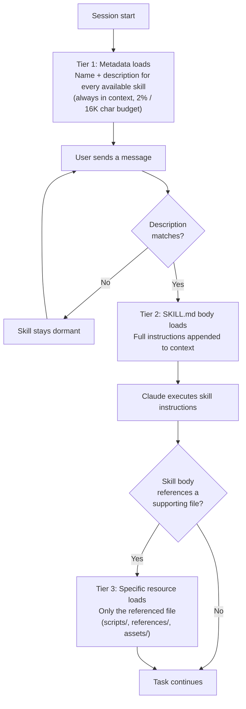
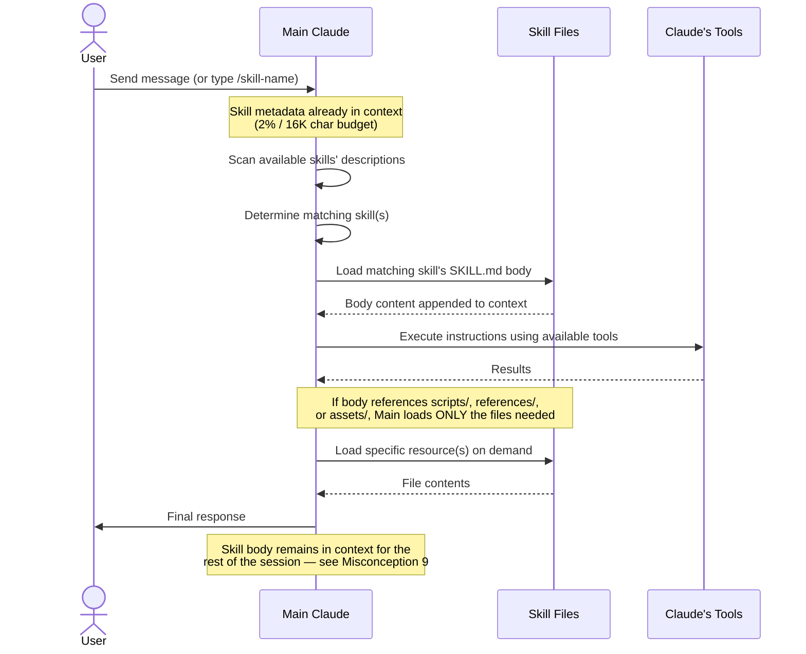
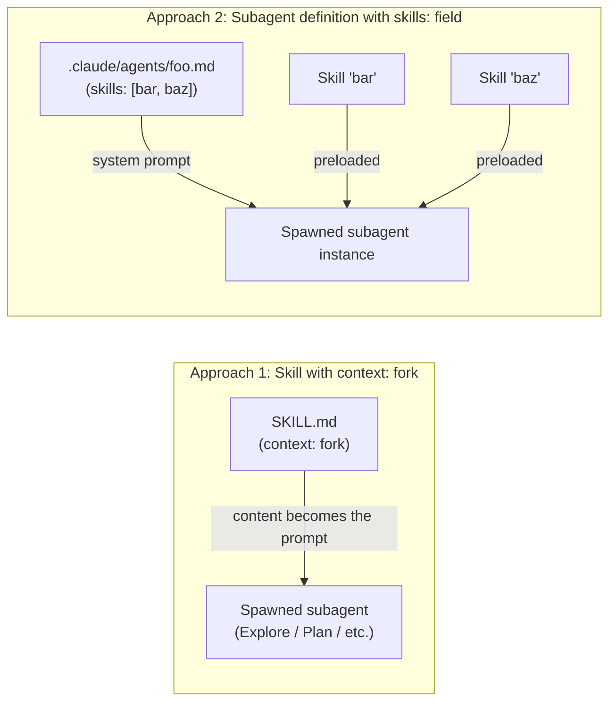

# Claude Skills 2.0: The Definitive User Guide

**Version:** 2.2 | **Last Updated:** 2026-04-16 | **Author:** Claude (with Briggsy)
**Part of:** [Skills 2.0 — Reference Collection](../README.md). Companions: [Skills, Agents, and Subagents — Oh My!](Skills_Agents_and_Subagents_Oh_My.md), [Skill Creator Practitioner's Guide](Skill_Creator_Practitioners_Guide.md).

---

> The industry is converging on a vision that would have sounded absurd 18 months ago: a single general-purpose agent runtime that loads different skill libraries on demand. Skills are the mechanism that makes this possible — the "apps" in a new "operating system."

**What's in this doc.** The complete user-facing treatment of Skills 2.0: what they are, how they're built, how they work at runtime, how they're distributed, and how they cross platforms. Anatomy. Frontmatter reference. Cross-platform compatibility matrix. Worked examples. Best practices. Security. Troubleshooting. The "complete manual" for the skills ecosystem.

**Who it's for.** Solo devs building a PR reviewer, enterprise admins provisioning workflows for 10,000 employees, and everyone in between. If you're working with skills in any capacity, this is the reference.

**How long it'll take.** ~45 minutes for the first read; the doc is structured so you can read it linearly or treat it as reference. Reference-heavy sections (frontmatter table, cross-platform matrix, cheat sheet) are wrapped in collapsibles so casual readers aren't buried in tables.

**What to read next.** [Skills, Agents, and Subagents — Oh My!](Skills_Agents_and_Subagents_Oh_My.md) for the architecture and decision framework, or the [Skill Creator Practitioner's Guide](Skill_Creator_Practitioners_Guide.md) for engineering rigor. The [hub README](../README.md) frames the whole collection.

---

## Executive Summary

**What are Skills?** Skills are folders containing instructions, scripts, and resources that teach Claude (and other AI agents) how to perform specialized tasks consistently and reliably. Think of them as "installable expertise" — packaged knowledge that an AI agent can load on-demand. In Claude Code, skills also serve as slash commands: the skill's `name` becomes `/name`.

**Why do they matter?** Without Skills, every conversation starts from zero. Claude doesn't know your company's brand guidelines, your team's deployment process, or how to generate a perfectly formatted PowerPoint. Skills solve this by packaging domain expertise into reusable, shareable, version-controlled bundles that any compatible agent can consume.

**What changed in 2.0?** The October 2025 launch introduced Agent Skills as a first-class feature. The December 2025 update was the real game-changer: Anthropic published the Agent Skills specification as an **open standard** at [agentskills.io](https://agentskills.io), added organization-wide management for Team/Enterprise plans, launched a partner Skills directory (Notion, Figma, Atlassian, Canva, etc.), and enabled a quick-create flow in the Claude.ai UI. In January 2026, Claude Code **merged slash commands into the skills system** — one unified system instead of two.

**Cross-platform portability is real.** A skill authored for Claude Code works unchanged in OpenAI Codex, OpenCode, Cursor, GitHub Copilot, VS Code, Gemini CLI, Windsurf, and 30+ other platforms (see the [agentskills.io Client Showcase](https://agentskills.io/clients) for the current adopter list). The spec is filesystem-based, not API-based — any agent that can read a directory and parse Markdown can use a skill.

**The bottom line:** Skills 2.0 isn't just a feature update — it's Anthropic's bid to define how the entire industry packages and distributes AI agent capabilities. For developers, skills are programmable agents with subagent execution, dynamic injection, and lifecycle hooks. For knowledge workers, they're the engine behind Claude.ai's file creation and partner integrations. For the industry, they're an open standard that 30+ platforms have already adopted (see the [agentskills.io Client Showcase](https://agentskills.io/clients) for the current adopter list). Whether you're a solo dev building a PR reviewer or an enterprise admin provisioning workflows for 10,000 employees, Skills are how you stop repeating yourself and start compounding your expertise.

---

## Table of Contents

1. [The Problem Skills Solve](#1-the-problem-skills-solve)
2. [Core Concepts](#2-core-concepts)
3. [Anatomy of a Skill](#3-anatomy-of-a-skill)
4. [How Skills Work at Runtime](#4-how-skills-work-at-runtime)
5. [Types of Skills](#5-types-of-skills)
6. [Using Skills in Claude.ai](#6-using-skills-in-claudeai)
7. [Using Skills in Claude Code](#7-using-skills-in-claude-code)
8. [Building Your Own Skills](#8-building-your-own-skills)
9. [Complete Frontmatter Reference](#9-complete-frontmatter-reference)
10. [Advanced Patterns](#10-advanced-patterns)
11. [The Skill Creator (Meta-Skill)](#11-the-skill-creator-meta-skill)
12. [Real-World Examples](#12-real-world-examples)
13. [Cross-Platform Compatibility](#13-cross-platform-compatibility)
14. [Skill Distribution & Package Management](#14-skill-distribution--package-management)
15. [Best Practices & Pitfalls](#15-best-practices--pitfalls)
16. [Security Considerations](#16-security-considerations)
17. [Troubleshooting](#17-troubleshooting)
18. [The Bigger Picture](#18-the-bigger-picture)
19. [Quick Reference & Cheat Sheet](#19-quick-reference--cheat-sheet)
20. [Appendix A: Further Resources](#appendix-a-further-resources)

> **Glossary:** the canonical glossary for this collection lives in the [hub README](../README.md#glossary).

---

## 1. The Problem Skills Solve

Every AI agent — Claude, Codex, Copilot, whatever — starts every conversation with no memory of your specific context. It doesn't know:

- Your company's brand colors, fonts, or voice guidelines
- How your team structures deployment pipelines
- The specific XML schema your Word docs need to follow
- Your organization's compliance requirements for data handling
- How to generate a PowerPoint that doesn't look like it was made by a robot in 2003

This creates three major pain points:

**Repetition Waste.** You explain the same workflows, formats, and constraints in every conversation. Multiply that by every person on your team, every day. That's real money evaporating.

**Inconsistency.** Person A describes the brand guidelines one way, Person B describes them differently, and Person C forgets half of them. The AI produces three different outputs for what should be the same task.

**Knowledge Silos.** Your best engineer figured out the perfect prompting sequence to get Claude to generate compliant API documentation. That knowledge lives in their chat history and nowhere else. When they leave, it walks out the door.

Skills solve all three by turning workflows and expertise into **portable, version-controlled, shareable packages** that any compatible agent loads automatically when relevant.

---

## 2. Core Concepts

### Progressive Disclosure

This is the key architectural insight. Skills don't dump everything into the AI's context window at once. They use a three-tier loading system:

| Level | What Loads | When | Size Target |
|-------|-----------|------|-------------|
| **Metadata** | Name + description only | Always in context | ~100 words |
| **SKILL.md body** | Full instructions | When skill triggers | < 500 lines |
| **Bundled resources** | Scripts, references, assets | Only when needed | Unlimited |

This matters because context windows are finite and precious. A skill with 50 pages of reference material doesn't bloat every conversation — Claude reads only the description, decides if it's relevant, loads the instructions if so, and then reaches for specific reference files only when a particular sub-task demands them.



Key nuance: **once Tier 2 loads, it stays in context for the rest of the session** — context is append-only. See [SAS §7 Misconception 9](Skills_Agents_and_Subagents_Oh_My.md#misconception-9-skills-are-unloaded-from-context-when-their-task-completes) for the corrective on what progressive disclosure does *not* do (it doesn't unload anything post-task).

**Context budget note:** In Claude Code, skill descriptions are loaded into context so Claude knows what's available. The budget scales dynamically at **2% of the context window**, with a fallback of **16,000 characters**. If you have many skills, some may be excluded. Run `/context` to check for warnings. Override with the `SLASH_COMMAND_TOOL_CHAR_BUDGET` environment variable.

### Triggering

Skills trigger based on their `description` field in the YAML frontmatter. When you send a message, Claude scans available skills' descriptions to determine which ones are relevant. If your message is about creating a PowerPoint, and there's a skill with "Use this skill any time a .pptx file is involved," Claude will load that skill.

Important nuance: **Claude tends to "under-trigger" rather than over-trigger.** It won't load a skill for simple tasks it can handle natively. The description needs to be somewhat "pushy" — explicitly listing trigger scenarios — to ensure reliable activation. For the systematic methodology of tuning descriptions to maximize trigger reliability — including auto-generated eval queries and an iterative description-optimization loop — see [SCG §10 — Optimize the Description](Skill_Creator_Practitioners_Guide.md#10-phase-6-optimize-the-description).

### Skills = Slash Commands (Unified System)

As of **January 24, 2026 (Claude Code v2.1.3)**, slash commands and skills are the same thing. A file at `.claude/commands/deploy.md` and a skill at `.claude/skills/deploy/SKILL.md` both create `/deploy` and work the same way. Your existing `.claude/commands/` files keep working — no migration required.

Skills are the recommended path going forward because they support additional features: a directory for supporting files, frontmatter for invocation control, subagent execution, and automatic loading when relevant.

If a skill and a command share the same name, **the skill takes precedence**.

### Skill vs. Prompt vs. System Instruction

| Feature | System Prompt | Custom Instructions | Skill |
|---------|--------------|-------------------|-------|
| Always in context | Yes | Yes | No (on-demand) |
| Task-specific | Usually no | Sometimes | Yes |
| Includes scripts/assets | No | No | Yes |
| Shareable/portable | Manual copy | Manual copy | `.skill` file |
| Cross-platform | No | No | Yes (open standard) |
| Version-controlled | Not typically | Not typically | Yes (Git-friendly) |
| Invocable as /command | No | No | Yes |

---

## 3. Anatomy of a Skill

### Minimum Viable Skill

At its simplest, a skill is a folder with one file:

```
my-skill/
└── SKILL.md
```

The `SKILL.md` must contain YAML frontmatter with at least a `description` (recommended):

```markdown
---
name: my-skill
description: What this skill does and when to trigger it.
---

# My Skill

Instructions for the agent go here.
```

If `name` is omitted, the directory name is used. If `description` is omitted, the first paragraph of markdown content is used. But you should always write an explicit description.

### Full Skill Structure

A production skill typically looks like this:

```
skill-name/
├── SKILL.md              # Required: Main instructions + frontmatter
├── LICENSE.txt            # Recommended: License terms
├── scripts/               # Optional: Executable code
│   ├── extract.py
│   └── validate.sh
├── references/            # Optional: Detailed docs loaded on demand
│   ├── api-guide.md
│   ├── schema-reference.md
│   └── edge-cases.md
└── assets/                # Optional: Templates, images, fonts
    ├── template.docx
    └── logo.png
```

Reference supporting files from SKILL.md so Claude knows what each file contains and when to load it:

```markdown
## Additional resources
- For complete API details, see [reference.md](reference.md)
- For usage examples, see [examples.md](examples.md)
```

### Real Example: Anthropic's DOCX Skill Description

Here's how Anthropic wrote the description for their Word document skill — notice how aggressively specific it is about trigger scenarios:

> "Use this skill whenever the user wants to create, read, edit, or manipulate Word documents (.docx files). Triggers include: any mention of 'Word doc', 'word document', '.docx', or requests to produce professional documents with formatting like tables of contents, headings, page numbers, or letterheads. Also use when extracting or reorganizing content from .docx files, inserting or replacing images in documents, performing find-and-replace in Word files, working with tracked changes or comments, or converting content into a polished Word document. If the user asks for a 'report', 'memo', 'letter', 'template', or similar deliverable as a Word or .docx file, use this skill. Do NOT use for PDFs, spreadsheets, Google Docs, or general coding tasks unrelated to document generation."

That's a masterclass in description writing. It covers: positive triggers, file type mentions, task types, output formats, AND negative boundaries.

---

## 4. How Skills Work at Runtime

Here's the actual sequence of events when you ask Claude to do something:



Critical to keep straight: control never leaves Main Claude. The "skill" doesn't run anything itself — Main Claude reads the skill's instructions and uses its own tools to act on them. For the same mechanics framed as dispatch paths (and the parallel fan-out pattern), see [SAS §6 — How Invocation Actually Works](Skills_Agents_and_Subagents_Oh_My.md#6-how-invocation-actually-works).

### Invocation Paths

There are two ways a skill gets invoked:

**Automatic (model-invoked):** Claude reads the description, decides it's relevant, and loads the skill. This is the default behavior. The user doesn't need to do anything.

**Manual (user-invoked):** You type `/skill-name` (with optional arguments). This directly loads the skill regardless of description matching.

Both paths can be controlled via frontmatter. See [Section 9: Frontmatter Reference](#9-complete-frontmatter-reference). For two additional invocation paths that show up in orchestrator/subagent compositions (called-by-another-skill, preloaded-via-subagent), see [SAS §6 — Skill Invocation Paths](Skills_Agents_and_Subagents_Oh_My.md#skill-invocation-paths).

### What "Loading" Actually Means

When Claude "loads" a skill, it's reading the SKILL.md file and incorporating those instructions into its working context for the current task. In Claude.ai, skills have access to a Linux compute environment — skills can include Python scripts, Node.js programs, bash commands, and other executable code.

In Claude Code, skills can additionally spawn subagents, fork contexts, inject dynamic shell output, and restrict tool access.

### When Skills DON'T Trigger

Skills are designed for tasks that benefit from specialized knowledge. They typically won't trigger for:

- Simple questions Claude can handle natively ("What's the capital of France?")
- Basic one-step tasks that don't need specialized instructions
- Conversations that don't match any skill's description
- Skills with `disable-model-invocation: true` (manual only)

---

## 5. Types of Skills

### Capability Uplift Skills

These extend what the agent can do. They fill genuine gaps in the model's abilities.

**Examples:**
- **docx** — Teaches Claude the intricacies of generating valid Word documents using docx-js, including XML schema compliance, table width calculations, tracked changes
- **pptx** — Enables creation and editing of PowerPoint presentations with PptxGenJS
- **xlsx** — Spreadsheet creation with formulas, charts, conditional formatting
- **pdf** — PDF manipulation: merge, split, fill forms, OCR, extract text

**Important characteristic:** These skills have a natural "retirement date." As models get better and natively learn to produce these file types, the capability uplift skills become less necessary.

### Workflow/Preference Skills

These encode *how* to do things according to your specific standards.

**Examples:**
- **brand-guidelines** — Your company's colors, fonts, tone of voice
- **internal-comms** — Templates for 3P updates, newsletters, incident reports
- **deployment-checklist** — Your team's specific CI/CD steps
- **code-review-standards** — Your org's coding standards, naming conventions, PR requirements

**Important characteristic:** These don't become obsolete as models improve. Your brand guidelines are YOUR brand guidelines regardless of how smart the model gets.

### Reference Content vs. Task Content

The official docs draw a useful distinction between two content types within skills (the choice between them is one input into the broader primitive-selection question — see [SAS §5 — Decision Framework](Skills_Agents_and_Subagents_Oh_My.md#5-decision-framework-when-to-reach-for-each-primitive) for the full taxonomy):

**Reference content** adds knowledge Claude applies to your current work — conventions, patterns, style guides, domain knowledge. This content runs inline so Claude can use it alongside your conversation context.

```yaml
---
name: api-conventions
description: API design patterns for this codebase
---
When writing API endpoints:
- Use RESTful naming conventions
- Return consistent error formats
- Include request validation
```

**Task content** gives Claude step-by-step instructions for a specific action, like deployments, commits, or code generation. These are often actions you want to invoke directly with `/skill-name` rather than letting Claude decide when to run them. Add `disable-model-invocation: true` to prevent automatic triggering.

```yaml
---
name: deploy
description: Deploy the application to production
context: fork
disable-model-invocation: true
---
Deploy the application:
1. Run the test suite
2. Build the application
3. Push to the deployment target
```

---

## 6. Using Skills in Claude.ai

### Anthropic-Managed Skills (Built-in)

Claude.ai comes with several pre-built skills maintained by Anthropic:

| Skill | What It Does |
|-------|-------------|
| **docx** | Create, read, edit Word documents with professional formatting |
| **xlsx** | Generate spreadsheets with formulas, charts, conditional formatting |
| **pptx** | Create/edit PowerPoint presentations with design quality |
| **pdf** | Read, merge, split, fill, OCR PDF files |
| **frontend-design** | Production-grade web interfaces that avoid "AI slop" aesthetics |
| **product-self-knowledge** | Accurate info about Anthropic products (routes to correct docs) |

These trigger automatically when your request matches. Ask Claude to "create a PowerPoint about Q3 results" and the pptx skill loads without you doing anything.

### Partner Skills Directory

As of December 2025, Claude.ai includes a directory of partner-built skills from companies including Notion, Figma, Atlassian, Canva, Cloudflare, Stripe, and Zapier. These are accessible from the Skills section in Claude.ai and work with corresponding MCP connectors.

### Custom Skills in Claude.ai

You can upload your own skills:

1. **Create your skill folder** with a SKILL.md file (and any supporting files)
2. **Package it** into a `.skill` file (which is just a ZIP archive)
3. **Upload** via the Claude.ai Tools sidebar
4. **Enable/disable** skills as needed

For Team and Enterprise plans, organization Owners can provision skills for all users, ensuring consistent deployment across the organization.

### Quick-Create Flow

Claude.ai supports a "quick-create" flow where you describe what you want, and Claude builds the skill for you. Accessible from the Tools sidebar.

---

## 7. Using Skills in Claude Code

Claude Code is where skills reach their full potential. The terminal environment provides invocation control, subagent execution, dynamic context injection, hooks integration, and the full `/slash-command` system.

### Bundled Skills

Bundled skills ship with Claude Code and are available in every session. Unlike built-in commands (which execute fixed logic), bundled skills are **prompt-based** — they give Claude a detailed playbook and let it orchestrate the work using its tools, including spawning parallel agents.

The set ships and evolves with Claude Code releases. The table below shows representative examples; for the canonical current set, run `claude /help` or check Anthropic's release notes. As of 2026-04, the set includes (but is not limited to):

| Skill | What It Does |
|-------|-------------|
| `/simplify` | Reviews recently changed files for code reuse, quality, and efficiency issues, then fixes them. Spawns **three review agents in parallel** (reuse, quality, efficiency), aggregates findings, and applies fixes. Pass optional text to focus: `/simplify focus on memory efficiency` |
| `/batch <instruction>` | Orchestrates **large-scale changes across a codebase in parallel**. Researches the codebase, decomposes work into 5-30 independent units, presents a plan for approval. Once approved, spawns one background agent per unit, each in an isolated git worktree. Each agent implements, tests, and opens a PR. Requires git. Example: `/batch migrate src/ from Solid to React` |
| `/debug [description]` | Troubleshoots your current Claude Code session by reading the session debug log. Optionally describe the issue to focus the analysis. |
| `/loop [interval] <prompt>` | Runs a prompt repeatedly on an interval. Claude schedules a recurring cron task. Example: `/loop 5m check if the deploy finished` |
| `/claude-api` | Loads Claude API reference for your project's language (Python, TypeScript, Java, Go, Ruby, C#, PHP, cURL) and Agent SDK reference. Also **activates automatically** when code imports `anthropic`, `@anthropic-ai/sdk`, or `claude_agent_sdk`. |
| `/update-config`, `/keybindings-help`, `/brief`, `/distill`, `/schedule`, and others | Recent releases have added skills for harness configuration, knowledge capture, and scheduling. The full current list is in `claude /help`. |

### Where Skills Live in Claude Code

Where you store a skill determines who can use it:

| Location | Path | Applies To | Priority |
|----------|------|-----------|----------|
| **Enterprise** | Managed settings | All users in org | Highest |
| **Personal** | `~/.claude/skills/<skill-name>/SKILL.md` | All your projects | High |
| **Project** | `.claude/skills/<skill-name>/SKILL.md` | This project only | Normal |
| **Plugin** | `<plugin>/skills/<skill-name>/SKILL.md` | Where plugin is enabled | Namespaced |

**Priority:** When skills share the same name across levels, higher-priority locations win: enterprise > personal > project. Plugin skills use a `plugin-name:skill-name` namespace, so they cannot conflict with other levels.

```mermaid
flowchart TD
    Conflict["Skill name 'deploy' exists at multiple levels"]
    Conflict --> Ent{Enterprise<br/>(managed settings)?}
    Ent -->|Yes| EntWins["Enterprise version wins<br/>(highest priority)"]
    Ent -->|No| User{Personal<br/>~/.claude/skills/deploy/?}
    User -->|Yes| UserWins[Personal version wins]
    User -->|No| Project{Project<br/>.claude/skills/deploy/?}
    Project -->|Yes| ProjectWins[Project version wins]
    Project -->|No| Plugin{Plugin skill?}
    Plugin -->|Yes| PluginNamespace["Plugin skills are namespaced<br/>(plugin-name:deploy)<br/>— no conflict possible"]
    Plugin -->|No| NoSkill[No skill found]
```

### Automatic Discovery

Claude Code automatically discovers skills from **nested `.claude/skills/` directories**. If you're editing a file in `packages/frontend/`, Claude Code also looks for skills in `packages/frontend/.claude/skills/`. This supports monorepo setups where packages have their own skills.

Skills defined in `.claude/skills/` within directories added via `--add-dir` are loaded automatically with **live change detection** — you can edit them during a session without restarting.

### How Claude Actually Scans Skills

The most common skill-debugging question is "why didn't my skill load?" The answer almost always traces back to the scan order and the metadata budget. Here's what actually happens:

**Scan order at session start:**

1. **Enterprise** (managed settings) — checked first, highest precedence on name collisions
2. **Personal** — `~/.claude/skills/<name>/SKILL.md` and `~/.claude/commands/<name>.md`
3. **Project** — `.claude/skills/<name>/SKILL.md` and `.claude/commands/<name>.md` from the working directory and any nested directories
4. **Plugins enabled in this project** — namespaced as `<plugin>:<skill>`, so no conflict with the above
5. **Directories added via `--add-dir`** — same `.claude/skills/` convention, with live reload on changes

What "in context" means for skill metadata: Claude Code injects each discovered skill's `name` + `description` into the system prompt at session start, under a tool list called `SlashCommandTool`. This is what Claude reads to decide whether to auto-trigger a skill. The body of SKILL.md is **not** in context until the skill triggers; only metadata sits there persistently.

**Budget allocation when total exceeds the cap:** The metadata budget is **2% of the context window** with a **fallback of 16,000 characters** (override: `SLASH_COMMAND_TOOL_CHAR_BUDGET`). When the total metadata across all discovered skills exceeds the budget, Claude Code drops skills from the list — typically lower-priority and longer-description ones first. Run `/context` mid-session; it surfaces a warning when skills have been excluded due to budget.

**Why your skill didn't load:**

| Symptom | Likely cause |
|---------|-------------|
| Skill exists but `/skill-name` says "not found" | Name collision with a higher-priority skill at another level — check enterprise / personal first |
| Skill exists, doesn't auto-trigger | Description doesn't match user phrasing closely enough; Claude under-triggers by default. Make the description "pushier" with explicit trigger scenarios |
| Skill exists, doesn't appear in `/context` | Excluded due to metadata budget — too many skills, or descriptions too long |
| Skill exists, used to work, suddenly doesn't | Claude Code restart needed — only `--add-dir` skills hot-reload; user/project skills load at session start |

### Legacy Commands Compatibility

Your existing `.claude/commands/` files still work and support the same frontmatter. Skills are recommended going forward since they support additional features (supporting files, invocation control, subagents). The precedence rule is covered in [§2 — Skills = Slash Commands](#2-core-concepts).

---

## 8. Building Your Own Skills

### Step-by-Step: Your First Custom Skill

Let's build a real skill — a "meeting notes formatter" that standardizes how your team documents meetings.

**Step 1: Create the directory**

```bash
mkdir -p ~/.claude/skills/meeting-notes
```

**Step 2: Write the SKILL.md**

```markdown
---
name: meeting-notes
description: "Format and structure meeting notes into a consistent
  template. Use this skill when the user mentions 'meeting notes',
  'meeting summary', 'standup notes', 'retro notes', or asks to
  format/structure notes from a meeting. Also trigger when the user
  provides raw meeting content and wants it organized."
---

# Meeting Notes Formatter

Transform raw meeting notes into a structured, consistent format
that makes action items trackable and decisions findable.

## Instructions

When formatting meeting notes:

1. Extract and organize content into these sections:
   - **Attendees** — Who was present
   - **Key Decisions** — What was decided (not discussed, DECIDED)
   - **Action Items** — WHO does WHAT by WHEN
   - **Discussion Summary** — Brief narrative of main topics
   - **Parking Lot** — Items deferred for future discussion

2. For action items, include:
   - Owner (a specific person, never "the team")
   - Due date (if none given, flag as "TBD — needs date")
   - Clear deliverable (not vague like "look into X")

3. Keep the summary tight. If the meeting was 60 minutes,
   the summary should be readable in 2 minutes.
```

**Step 3: Test it**

Let Claude invoke it automatically:
```
Format these meeting notes: [paste your raw notes]
```

Or invoke it directly:
```
/meeting-notes [paste notes here]
```

### Writing Great Descriptions

The description is the make-or-break element:

**Bad:**
```yaml
description: Formats meeting notes.
```

**Good:**
```yaml
description: "Format and structure meeting notes into a consistent
  template with action items, decisions, and summaries. Use when the
  user mentions 'meeting notes', 'meeting summary', 'standup notes',
  'retro notes', 'action items from meeting', or provides raw/messy
  notes from any kind of meeting and wants them organized. Do NOT use
  for general document formatting, email writing, or non-meeting content."
```

### Writing Effective Instructions

Key principles from Anthropic's own skill-writing guide:

1. **Use imperative form.** "Extract action items" not "You should extract action items."
2. **Explain the WHY, not just the WHAT.** If models understand *why* you want something, they handle edge cases better than with rigid commands.
3. **Avoid heavy-handed MUSTs.** "Use ISO date format because it sorts correctly and avoids US/EU ambiguity" beats "ALWAYS USE ISO DATES."
4. **Include examples.** One concrete example is worth paragraphs of abstract instruction.
5. **Keep SKILL.md under 500 lines.** Move detail to `references/` files.

When you're ready to ship a skill that survives realistic use — not just the happy-path test — the [Skill Creator Practitioner's Guide](Skill_Creator_Practitioners_Guide.md) covers the engineering discipline: eval frameworks, A/B testing against the no-skill baseline, automated description optimization, the governance model for team-shipped skills, and the maturity model for moving from "vibes-based" to "production-ready."

---

## 9. Complete Frontmatter Reference

All fields are optional. Only `description` is recommended. The frontmatter fields control how a skill is invoked, what tools it can use, and what runtime behavior it gets — they're the wiring layer between your SKILL.md content and the runtime mechanics covered in [SAS §6 — How Invocation Actually Works](Skills_Agents_and_Subagents_Oh_My.md#6-how-invocation-actually-works).

```yaml
---
name: my-skill
description: What this skill does and when to use it
argument-hint: [issue-number]
disable-model-invocation: true
user-invocable: false
allowed-tools: Read, Grep, Glob
model: claude-sonnet-4-6
context: fork
agent: Explore
hooks:
  # Hook configuration scoped to this skill
---
```

<details>
<summary><strong>▶ Full field-by-field reference (10 frontmatter fields)</strong></summary>

| Field | Required | Description |
|-------|----------|-------------|
| `name` | No | Display name and `/slash-command`. If omitted, uses directory name. Lowercase letters, numbers, hyphens only (max 64 chars). |
| `description` | Recommended | What the skill does and when to use it. Claude uses this to decide when to auto-load. If omitted, uses first paragraph of markdown. |
| `argument-hint` | No | Hint shown during autocomplete. Example: `[issue-number]` or `[filename] [format]`. |
| `disable-model-invocation` | No | `true` = prevent Claude from auto-loading. For workflows with side effects (deploy, commit). Default: `false`. |
| `user-invocable` | No | `false` = hide from `/` menu. For background knowledge. Default: `true`. |
| `allowed-tools` | No | Tools Claude can use **without asking permission** when skill is active. Example: `Read, Grep, Glob` or `Bash(python *)`. |
| `model` | No | Model to use when this skill is active. |
| `context` | No | `fork` = run in isolated subagent context. |
| `agent` | No | Subagent type when `context: fork`. Options: `Explore`, `Plan`, `general-purpose`, or custom from `.claude/agents/`. |
| `hooks` | No | Hooks scoped to this skill's lifecycle. Different from top-level hooks configured in `settings.json` — see [§10 — Hooks and Skills](#hooks-and-skills) for the distinction. |

</details>

### Invocation Control Matrix

| Frontmatter | You Can Invoke | Claude Can Invoke | Context Loading |
|-------------|:--------------:|:-----------------:|------------------------|
| *(default)* | Yes | Yes | Description always in context; full skill loads on invoke |
| `disable-model-invocation: true` | Yes | No | Description **not** in context (intended); loads only when you invoke |
| `user-invocable: false` | No | Yes | Description always in context; loads when Claude invokes |

**Key insight:** `disable-model-invocation: true` is intended to completely remove the skill from Claude's awareness — Claude won't auto-trigger it because the description isn't supposed to enter context. `user-invocable: false` just hides it from the `/` menu but Claude can still see and invoke it.

> **Implementation caveat (verified 2026-04-16):** The intended behavior of `disable-model-invocation: true` is description-not-in-context. There's a known bug reported against Claude Code v2.1.71 where descriptions were still loaded into the system-reminder skill list even when this flag was set, consuming budget. If you're sizing context budget tightly, run `/context` after a session start to confirm the description was actually excluded for your version.

### String Substitutions

| Variable | Description |
|----------|-------------|
| `$ARGUMENTS` | All arguments passed when invoking. If not present in content, arguments appended as `ARGUMENTS: <value>`. |
| `$ARGUMENTS[N]` | Specific argument by 0-based index. `$ARGUMENTS[0]` = first argument. |
| `$N` | Shorthand for `$ARGUMENTS[N]`. `$0` = first, `$1` = second, etc. |
| `${CLAUDE_SESSION_ID}` | Current session ID. For logging or session-specific files. |
| `${CLAUDE_SKILL_DIR}` | Directory containing the skill's SKILL.md. For referencing bundled scripts regardless of working directory. |

**Example: Parameterized migration skill**

```yaml
---
name: migrate-component
description: Migrate a component from one framework to another
---
Migrate the $0 component from $1 to $2.
Preserve all existing behavior and tests.
```

`/migrate-component SearchBar React Vue` → replaces `$0` with `SearchBar`, `$1` with `React`, `$2` with `Vue`.

---

## 10. Advanced Patterns

### Dynamic Context Injection

The `!` backtick syntax runs shell commands **before** the skill content is sent to Claude. The command output replaces the placeholder.

```yaml
---
name: pr-summary
description: Summarize changes in a pull request
context: fork
agent: Explore
allowed-tools: Bash(gh *)
---

## Pull request context

- PR diff: !`gh pr diff`
- PR comments: !`gh pr view --comments`
- Changed files: !`gh pr diff --name-only`

## Your task

Summarize this pull request...
```

This is **preprocessing**, not something Claude executes. Claude only sees the final rendered output with actual data.

### Running Skills in a Subagent

Add `context: fork` to run a skill in isolation — no access to conversation history.

```yaml
---
name: deep-research
description: Research a topic thoroughly
context: fork
agent: Explore
---

Research $ARGUMENTS thoroughly:
1. Find relevant files using Glob and Grep
2. Read and analyze the code
3. Summarize findings with specific file references
```

**Agent types:** Claude Code ships with five built-in subagent types — `Explore` (read-only codebase exploration), `Plan` (planning mode), `general-purpose` (full capabilities), `statusline-setup`, and `Claude Code Guide`. You can also point at any custom subagent from `.claude/agents/`. Full descriptions of each built-in type and their default tool permissions are in [SAS §2.3 — Built-in subagent types](Skills_Agents_and_Subagents_Oh_My.md#23-subagent-instance-the-runtime-spawn).

**Important:** `context: fork` only makes sense for skills with explicit tasks. Reference-only content without a task produces no meaningful subagent output.

**Skill tool limitation (verified via [issue #17283](https://github.com/anthropics/claude-code/issues/17283)):** When a skill is invoked via the Skill tool *directly* — rather than triggered by description matching — the `context: fork` and `agent:` frontmatter fields are currently ignored, and the skill runs in main Claude's context instead of a spawned subagent. If you depend on isolation, trigger the skill via description matching or `/skill-name` rather than via direct Skill tool invocation. See [SAS §6 — `context: fork` Mechanics](Skills_Agents_and_Subagents_Oh_My.md#context-fork-mechanics) for the full mechanics, version notes, and edge cases.

For the decision criteria (when to reach for `context: fork` vs a full subagent definition vs the Agent SDK), see [SAS §5 — Decision Framework](Skills_Agents_and_Subagents_Oh_My.md#5-decision-framework-when-to-reach-for-each-primitive). For the corrective on what `context: fork` does NOT do (it doesn't enable parallelism, and skill content doesn't get unloaded after the subagent returns), see [SAS §7 Misconceptions 3 and 9](Skills_Agents_and_Subagents_Oh_My.md#misconception-3-context-fork-enables-parallel-execution).

### Skills + Subagents: Two Directions

There are two ways to combine skills with subagents — they differ in where the SKILL.md content lands and what else gets loaded with it:

| Approach | System Prompt | Task | Also Loads |
|----------|--------------|------|-----------|
| Skill with `context: fork` | From agent type | SKILL.md content | Nothing else by default — see verification note below |
| Subagent with `skills:` field | Subagent's markdown body | Claude's delegation message | Preloaded skills listed in the field |

> **Verification (2026-04-16):** Subagents — including those spawned by `context: fork` — do *not* automatically load project-level CLAUDE.md or user-level `~/.claude/CLAUDE.md`. This was clarified in [issue #29423](https://github.com/anthropics/claude-code/issues/29423) (Feb 2026). If your skill or subagent depends on CLAUDE.md content, either pass it in via the skill body, embed it in the subagent's system prompt, or use the `skills:` field to preload a skill that includes the relevant context. Earlier versions of this doc claimed CLAUDE.md was auto-loaded into forked contexts; that claim was wrong and has been removed.



The choice between the two: **Approach 1** is the lightweight option — one frontmatter flag on a single skill file, no separate definition needed. Use it when the playbook IS the subagent's job. **Approach 2** is the reusable pattern — the subagent definition is plumbing, the skill(s) hold the substance, and the same definition can pair with different skills for different runs. See [SAS §3 — Worker/Playbook Mental Model](Skills_Agents_and_Subagents_Oh_My.md#3-what-a-skill-actually-is-and-isnt) for the underlying conceptual model.

### Subagent Memory and Skills

Long-running specialist subagents often need persistent state across spawn/return cycles. The subagent definition's `memory` frontmatter field enables a per-subagent `MEMORY.md` file:

```yaml
---
name: pr-reviewer
description: Reviews pull requests against team standards
skills: [code-review-checklist, security-review]
memory: true
---
You are a PR reviewer. Use your MEMORY.md to track recurring issues
you've seen across PRs in this project.
```

When `memory: true`:

- A persistent `MEMORY.md` file is associated with this subagent definition
- The first 200 lines of MEMORY.md are injected into the subagent's context at spawn
- The subagent can read/write/curate the file across spawns using its normal Read/Write tools
- The file persists across sessions, so the subagent accumulates knowledge over time

**Interaction with `skills:` preload:** The two are independent and complementary. `skills:` injects skill bodies (instructions) at spawn; `memory:` injects accumulated state. A subagent can have both — preloaded skills give it the playbook, MEMORY.md gives it the institutional history of how the playbook has played out before.

**Project-level memory directory.** Beyond per-subagent memory, Claude Code supports a project-level `memory/` convention — typically at `.claude/projects/<project-id>/memory/MEMORY.md` — that the main Claude session uses for cross-session knowledge. This is a separate primitive from subagent `memory:` and is not directly accessible to spawned subagents. For the canonical treatment of either memory primitive, see Anthropic's documentation; this section covers the skills-memory interaction only.

### Restricting Tool Access

```yaml
---
name: safe-reader
description: Read files without making changes
allowed-tools: Read, Grep, Glob
---
```

When active, Claude uses those tools **without permission prompts**. All other tools follow normal permission flow.

### Permission Rules for Skills

Control which skills Claude can invoke:

```bash
# Deny all skills
Skill

# Allow only specific skills
Skill(commit)
Skill(review-pr *)

# Deny specific skills
Skill(deploy *)
```

Syntax: `Skill(name)` for exact match, `Skill(name *)` for prefix match with arguments.

### Hooks and Skills

A common request: "I want my skill to run when X happens." Skills don't fire on events — they're playbooks that load when triggered by description matching or explicit invocation. For event-driven behavior, you reach for **hooks**: shell commands that Claude Code runs automatically at specific lifecycle events.

**Hook events** (canonical list per [Anthropic's hooks docs](https://code.claude.com/docs/en/hooks)):

| Event | When It Fires |
|-------|---------------|
| `PreToolUse` | Before any tool call. Can block the call or modify input. |
| `PostToolUse` | After a tool call succeeds. Useful for logging, side effects. |
| `Stop` | When Claude stops generating in the main loop. |
| `SubagentStop` | When a spawned subagent finishes. |
| `SessionStart` / `SessionEnd` | At the boundaries of a Claude Code session. |
| `UserPromptSubmit` | When the user submits a message — fires before Claude sees it. |
| `PreCompact` | Before auto-compaction runs. |
| `Notification` | When Claude Code surfaces a notification (e.g., needs input while idle). |

**Two places hooks are configured:**

1. **Globally in `settings.json`** — applies across all sessions and all skills. Use this for repo-wide automation (e.g., a `PreToolUse` hook that audits every Bash invocation, regardless of which skill triggered it).
2. **Scoped to a single skill via the `hooks:` frontmatter field** — fires only while that skill is active. Use this when the automation is specific to that skill's lifecycle (e.g., a deploy skill that posts to Slack on `Stop`).

**Hook vs skill — when to reach for which:**

- The thing you want to happen is **deterministic and tied to an event** → hook. Hooks always fire on their event; agents don't get to decide.
- The thing you want is **a body of instructions Claude consults when relevant** → skill. Skills are loaded into context and Claude follows them; the agent decides when.
- The thing you want is **deterministic side effects DURING a skill's execution** → both. A skill triggers on description match; its `hooks:` frontmatter wires up the side effects.

For the architectural framing of why hooks are a separate primitive (not skills, not agents), see [SAS §2 — The Adjacent Confusions](Skills_Agents_and_Subagents_Oh_My.md#the-adjacent-confusions).

### Skills and MCP: When to Use Each, How They Compose

Skills package instructions. **MCP** (Model Context Protocol) packages tools. They're distinct primitives that compose well — and choosing between them is rarely either/or.

**The core distinction:**

| | Skills | MCP servers |
|---|--------|-------------|
| What it provides | Instructions, knowledge, workflows | Callable tools (functions with typed inputs/outputs) |
| Where it lives | Files (SKILL.md) loaded into agent context | Separate processes the agent connects to over a protocol |
| What's portable | The Markdown content — works across 30+ platforms | The tool implementation — works with any MCP-aware agent |
| When to reach for it | "I want the agent to know how to do X" | "I want the agent to be able to call X" |

**They compose:** A skill can instruct Claude to call MCP tools that are configured in the agent's environment. The skill doesn't ship with the MCP server — it just tells Claude *how to use* one that's already wired up. This is the typical pattern for partner skills: the skill is the playbook, the MCP server is the connector to the external system (Notion, Figma, Atlassian, etc.).

**MCP server preloaded for a specific subagent:** Subagent definitions support an `mcpServers:` frontmatter field that scopes MCP server access to that subagent. The pattern:

```yaml
---
name: jira-investigator
description: Investigates issues in our Jira board
skills: [jira-investigation-playbook]
mcpServers:
  jira: { command: "node", args: ["~/mcp-servers/jira/server.js"] }
---
You are a Jira investigation specialist. Use the jira MCP server to
fetch issue details, then apply the playbook from your preloaded skill.
```

This lets a specialist subagent reach an external tool its parent doesn't have — useful for sandboxing or for giving narrow specialists access to systems the main session shouldn't touch directly.

**When to use which:**

- **The capability is procedural** ("how to write a good PR description") → skill.
- **The capability is a callable function** ("get the diff for PR #N") → MCP tool.
- **The capability needs both** ("read the PR diff via MCP, then format the review per our standards") → both: an MCP server provides the data, a skill provides the format.

For the corrective on common conflations (MCP servers are not agents, despite both being "things the agent talks to"), see [SAS §7 Misconception 6](Skills_Agents_and_Subagents_Oh_My.md#misconception-6-mcp-servers-are-agents).

### Enabling Extended Thinking

Include the word "ultrathink" anywhere in your skill content.

### Visual Output Pattern

Bundle scripts that generate interactive HTML. Use `${CLAUDE_SKILL_DIR}` to reference them:

```yaml
---
name: codebase-visualizer
description: Generate an interactive visualization of your codebase.
allowed-tools: Bash(python *)
---

Run the visualization script:
python ${CLAUDE_SKILL_DIR}/scripts/visualize.py .
```

Works for dependency graphs, test coverage, API docs, database schemas — anything visual.

---

## 11. The Skill Creator (Meta-Skill)

A skill for creating other skills, built around a 9-phase iterative loop (capture intent → draft → test → eval → improve → optimize description → package). It's the most-installed skill tool in the Claude Code ecosystem and what makes skill development a proper engineering discipline rather than a vibes-based exercise.

For the full treatment — the core loop in detail, eval framework, A/B testing methodology, description optimization, governance model, and the where-it-works matrix — see the [**Skill Creator Practitioner's Guide**](Skill_Creator_Practitioners_Guide.md). Engineering rigor for shipping skills that survive realistic use lives there.

---

## 12. Real-World Examples

A handful of complete skills, drawn from real patterns. Two of the most common examples — the **deploy** workflow and the **PR summary** — already appear in context elsewhere in this guide:

- **Deploy** (task content, manual-only, forked subagent) — see [§5 — Reference Content vs. Task Content](#5-types-of-skills) for the canonical version. The example lives where it teaches the concept, not in a standalone gallery.
- **PR Summary with dynamic context injection** — see [§10 — Dynamic Context Injection](#10-advanced-patterns) for the canonical version, where it illustrates the `!` backtick syntax in its natural context.
- **Meeting Notes Formatter** (your first skill, walk-through) — see [§8 — Building Your Own Skills](#8-building-your-own-skills) for the step-by-step build.

The four examples below are unique to this section — patterns not covered elsewhere in the guide.

### Example 1: Brand Guidelines (Reference Content — Claude-Only Background Knowledge)

```yaml
---
name: brand-guidelines
description: Applies official brand colors and typography to artifacts.
  Use when brand colors, style guidelines, or company design standards apply.
---

### Colors
- Dark: #141413 — Primary text, dark backgrounds
- Light: #faf9f5 — Light backgrounds
- Orange: #d97757 — Primary accent
- Blue: #6a9bcc — Secondary accent

### Typography
- Headings: Poppins (Arial fallback)
- Body: Lora (Georgia fallback)
```

### Example 2: Fix GitHub Issue (Parameterized)

```yaml
---
name: fix-issue
description: Fix a GitHub issue
disable-model-invocation: true
argument-hint: [issue-number]
---

Fix GitHub issue $ARGUMENTS following our coding standards.
1. Read the issue description
2. Implement the fix
3. Write tests
4. Create a commit
```

Usage: `/fix-issue 123`

### Example 3: Legacy System Context (Claude-Only, Hidden from Menu)

```yaml
---
name: legacy-system-context
description: Explains how the legacy billing system works.
  Use when working on billing code or payment processing.
user-invocable: false
---

# Legacy Billing System
The billing system uses a two-phase commit pattern...
[detailed system documentation]
```

Invisible to users — Claude loads it automatically when relevant.

### Example 4: Internal Communications Router

```yaml
---
name: internal-comms
description: Write internal communications using company formats.
  Use for status reports, 3P updates, newsletters, FAQs, incident reports.
---

1. Identify the communication type
2. Load the appropriate guideline:
   - `examples/3p-updates.md` for Progress/Plans/Problems
   - `examples/company-newsletter.md` for newsletters
   - `examples/faq-answers.md` for FAQs
   - `examples/general-comms.md` for everything else
3. Follow the format instructions in that file
```

---

## 13. Cross-Platform Compatibility

### The Open Standard

In December 2025, Anthropic published the Agent Skills specification as an **open standard** at [agentskills.io](https://agentskills.io). Licensed under Apache 2.0 (code) and CC-BY-4.0 (docs).

A skill is a folder with a SKILL.md file. Filesystem-based, not API-based. Any agent that reads directories and parses Markdown can consume a skill.

Why portability matters as a strategic argument (rather than just a feature) — see [SAS §4 — The Unification Thesis](Skills_Agents_and_Subagents_Oh_My.md#4-the-unification-thesis-dont-build-agents-build-skills-instead). The short version: skills compose, agent definitions don't, and a single open standard reachable by every major platform is what makes "build skills, not agents" a viable strategy.

<details>
<summary><strong>▶ Platform compatibility matrix (11 platforms with skill paths and notes)</strong></summary>

| Platform | Support | Skill Location | Notes |
|----------|---------|----------------|-------|
| **Claude Code** | Native (originator) | `~/.claude/skills/`, `.claude/skills/` | Full support including all advanced features |
| **Claude.ai** | Native | Upload via UI, org provisioning | Linux sandbox execution |
| **OpenAI Codex** | Native | `.agents/skills/`, `~/.codex/skills/` | Optional `agents/openai.yaml` for UI metadata |
| **OpenCode** | Native | `~/.config/opencode/skills/` | Built-in support |
| **Cursor** | Native | `.cursor/skills/`, configurable | cursor.com/docs/context/skills |
| **GitHub Copilot** | Native | `.github/skills/` | VS Code, CLI, coding agent |
| **VS Code** | Native | `.github/skills/`, configurable | Chat and agent mode |
| **Gemini CLI** | Native | `~/.gemini/skills/` | Google's CLI agent |
| **Windsurf** | Adapted | Converts SKILL.md → .md rules | Format conversion |
| **Goose** | Native | `~/.config/goose/skills/` | Open source framework |
| **Amp** | Native | Standard paths | Full support |

For the current full adopter list (~30+ platforms), see the [agentskills.io Client Showcase](https://agentskills.io/clients).

</details>

<details>
<summary><strong>▶ Feature comparison: Claude Code vs. Codex vs. OpenCode (10 feature dimensions)</strong></summary>

| Feature | Claude Code | Codex | OpenCode |
|---------|------------|-------|----------|
| Skill format | SKILL.md (originated here) | SKILL.md (adopted) | SKILL.md (adopted) |
| Script execution | Full | Full | Full |
| Progressive disclosure | Yes | Yes | Yes |
| Auto-detection | Yes | Yes | Yes |
| Hot reload | Yes | Restart needed | Varies |
| Invocation control | `disable-model-invocation`, `user-invocable` | `allow_implicit_invocation` (openai.yaml) | Varies |
| Subagent execution | `context: fork`, agent types | Not in spec | No |
| Dynamic context injection | `!` backtick syntax | Not in spec | No |
| Hooks integration | Yes | No | No |
| String substitutions | Full set (`$ARGUMENTS`, `$N`, `${CLAUDE_SESSION_ID}`, `${CLAUDE_SKILL_DIR}`) | `$ARGUMENTS` | Basic |

</details>

**Key takeaway:** The core SKILL.md format is universal. Claude Code's extensions are additive — they don't break compatibility. A skill using advanced Claude Code features will work on other platforms but won't use those specific features.

---

## 14. Skill Distribution & Package Management

### .skill Files

A `.skill` file is a ZIP archive. Standard distribution format:

```bash
# Using skill-creator's packaging script
python -m scripts.package_skill path/to/my-skill/

# Or ZIP it yourself
zip -r my-skill.skill my-skill/ -x "*.pyc" "__pycache__/*" "node_modules/*"
```

### Distribution Scopes

| Scope | Method | Audience |
|-------|--------|---------|
| **Project** | Commit `.claude/skills/` to version control | Team members |
| **Plugin** | Create `skills/` in your plugin | Where enabled |
| **Managed** | Deploy via managed settings | Org-wide (Team/Enterprise) |
| **Community** | GitHub repo, skills.sh, registries | Public |

### Plugins: Bundling Skills with Subagents, Hooks, Commands, and MCP

A **plugin** is a distribution bundle that packages multiple Claude Code primitives together as a single installable unit. Plugins can contain skills, subagent definitions, hooks, slash commands, and MCP server configurations — anything you'd normally drop into `.claude/`. They're how you ship a coherent capability set to your team rather than asking everyone to copy a half-dozen files into the right directories.

**Manifest structure.** Every plugin has a `marketplace.json` manifest at the root that declares its components:

```json
{
  "name": "my-team-tools",
  "owner": { "name": "my-team", "url": "https://github.com/my-team" },
  "metadata": {
    "description": "Standardized review and deployment skills for our team",
    "version": "1.0.0"
  },
  "plugins": [
    {
      "name": "review-suite",
      "source": "./.github/plugins/review-suite",
      "description": "PR review skills with multi-agent fan-out",
      "version": "1.0.0",
      "skills": ["./skills/"],
      "agents": ["./agents/security-reviewer.md", "./agents/perf-reviewer.md"],
      "commands": ["./commands/"],
      "category": "review"
    }
  ]
}
```

Each entry in `plugins[]` is a sub-bundle pointing at a directory tree containing the listed component types. The component arrays (`skills`, `agents`, `commands`, etc.) point at directories the runtime should load when the plugin is enabled.

**Layout convention** (`.claude/plugins/<plugin-name>/` or installed via marketplace):

```
my-team-tools/
├── marketplace.json
├── README.md
└── .github/plugins/review-suite/
    ├── skills/
    │   ├── review-pr/
    │   │   └── SKILL.md
    │   └── deploy/
    │       └── SKILL.md
    ├── agents/
    │   ├── security-reviewer.md
    │   └── perf-reviewer.md
    ├── commands/
    │   └── ship.md
    └── hooks/
        └── pre-commit.sh
```

**Skill namespacing.** When a plugin ships skills, those skills are namespaced as `<plugin-name>:<skill-name>`. So a plugin named `review-suite` shipping a `review-pr` skill exposes it as `/review-suite:review-pr`. This namespacing means plugin skills can't conflict with project, personal, or enterprise skills at the same name — they live in their own keyspace.

**Marketplace.** Plugins published to a marketplace are discoverable via the `/plugin marketplace` command in Claude Code. Marketplaces are essentially curated lists of `marketplace.json` manifests pointing at git repositories.

**Real-world example.** [microsoft/skills](https://github.com/microsoft/skills) is itself structured as a plugin marketplace — its `.claude-plugin/marketplace.json` lists 8 plugins (azure-sdk-dotnet, azure-sdk-java, azure-sdk-python, azure-sdk-rust, azure-sdk-typescript, azure-skills, deep-wiki, microsoft-foundry), each containing their own skills, agents, and commands. Total: 200+ skills shipped as one installable bundle.

**When to reach for a plugin (vs. just committing a `.claude/skills/` directory):**

- You want to ship to multiple repos / multiple teams without copy-paste
- You want to bundle skills *with* their supporting subagent definitions, hooks, or MCP servers
- You want versioning semantics — installs at v1.0.0, can be upgraded to v1.1.0 cleanly
- You want discoverability via a marketplace

For a single team's repo with a handful of project-local skills, a plain `.claude/skills/` directory is simpler. Plugins are for the case where the bundle has an audience beyond the immediate repo.

### skills.sh (Community Package Manager)

```bash
npx skills add some-org/some-repo
npx skills add some-org/some-repo --skill specific-skill-name
```

### Community Repositories

- **[github.com/anthropics/skills](https://github.com/anthropics/skills)** — Official Anthropic
- **[github.com/openai/skills](https://github.com/openai/skills)** — Official OpenAI
- **[github.com/microsoft/skills](https://github.com/microsoft/skills)** — Microsoft (200+ skills across Azure SDKs, Azure services, Microsoft Foundry, plus Microsoft Fabric in [microsoft/skills-for-fabric](https://github.com/microsoft/skills-for-fabric))
- **[github.com/VoltAgent/awesome-agent-skills](https://github.com/VoltAgent/awesome-agent-skills)** — 500+ community skills
- **[claude-plugins.dev/skills](https://claude-plugins.dev/skills)** — Auto-indexed discovery

---

## 15. Best Practices & Pitfalls

This section is design-focused — what makes a skill *well-shaped* for triggering and use. For the engineering-discipline complement (testing, evaluation, governance, the maturity model for shipping skills reliably), see [SCG §15 — Best Practices & Pitfalls](Skill_Creator_Practitioners_Guide.md#15-best-practices--pitfalls).

### DO

- **Write descriptions like trigger conditions.** List specific keywords, file types, scenarios.
- **Include negative triggers.** "Do NOT use for X, Y, Z"
- **Explain the why.** Reasoning beats rigid commands.
- **Keep SKILL.md under 500 lines.** Offload to `references/`.
- **Bundle reusable scripts.** Don't reinvent the wheel each invocation.
- **Test with realistic prompts.** Casual, messy, with typos.
- **Version skills in Git.** They're code.
- **Use `disable-model-invocation: true`** for side-effect workflows.
- **Use `context: fork`** for heavy isolated tasks.

### DON'T

- **Don't write vague descriptions.** "Helps with documents" triggers nothing reliably.
- **Don't overuse MUST/NEVER/ALWAYS.** Use reasoning instead.
- **Don't nest references deeply.** One level deep from SKILL.md.
- **Don't create skills for things Claude handles natively.**
- **Don't include secrets in skills.** No API keys, passwords, credentials.
- **Don't use `context: fork` for reference-only skills.** No task = no useful output.

---

## 16. Security Considerations

### Trust Model

- **Anthropic-managed** (docx, xlsx, etc.) — vetted
- **Bundled** (/simplify, /batch, etc.) — ships with Claude Code
- **Partner** (Notion, Figma, etc.) — named partners
- **Community** — **not audited**, review before installing
- **Custom** — you built it

### Risks

- **Prompt injection** — manipulating agent behavior
- **Tool poisoning** — harmful scripts
- **Data exfiltration** — sending data externally
- **Hidden payloads** — obfuscated code

### Mitigations

1. **Review code before installing** from unknown sources
2. **Prefer trusted repositories**
3. **Use org provisioning** to control available skills
4. **Audit `scripts/` directories**
5. **Pin versions** rather than auto-updating
6. **Use `allowed-tools`** to restrict access
7. **Use permission rules** to allow/deny specific skills
8. **Block specific skills from a subagent** using the `disallowedTools: Skill(skill-name)` syntax in subagent definition frontmatter. The `skills:` field controls preloading at spawn but does *not* prevent runtime discovery — for hard access restrictions (e.g., preventing a `general-purpose` subagent from invoking a sensitive deploy skill at runtime), use `disallowedTools:`. See [SAS §2.2](Skills_Agents_and_Subagents_Oh_My.md#22-subagent-definition-the-static-artifact) for the field reference and [SAS §7 Misconception 1](Skills_Agents_and_Subagents_Oh_My.md#misconception-1-subagents-inherit-skills-from-their-parent) for the underlying reason this distinction matters.

---

## 17. Troubleshooting

For the underlying mechanics — scan order, what "in context" means for skill metadata, and how budget allocation decides which skills get loaded — see [§7 — How Claude Actually Scans Skills](#how-claude-actually-scans-skills). This section is the symptom-to-fix lookup; that section is the conceptual model.

### Skill Not Triggering

- Check description includes natural keywords
- Ask "What skills are available?" to verify it's loaded
- Check if `disable-model-invocation: true` is set (use `/name` directly)
- Rephrase your request to match description
- Invoke directly with `/skill-name`

### Skill Triggers Too Often

- Make description more specific with boundaries
- Add `disable-model-invocation: true` for manual-only

### Claude Doesn't See All Your Skills

Character budget: **2% of context window** (fallback: 16K chars). Too many skills = some excluded.

- Run `/context` to check for warnings
- Set `SLASH_COMMAND_TOOL_CHAR_BUDGET` to override
- Consolidate related skills or shorten descriptions

### Skill/Command Name Conflict

If a skill and a command share the same name, the skill takes precedence. Check both directories.

---

## 18. The Bigger Picture

Most coverage of Skills 2.0 focuses on the Claude Code developer experience — and rightfully so, the `context: fork`, dynamic injection, and bundled skills are genuinely impressive engineering. But that's one chapter of a much larger story. To really understand what's happening here, you need to zoom out.

### The Evolution

The progression tells you where this is headed:

| Era | What You Got | What It Meant |
|-----|-------------|---------------|
| **CLAUDE.md** | Project-level instructions | Claude remembers your project's rules |
| **Commands** | Slash-invocable workflows | Reusable prompts with a trigger |
| **Skills 1.0** | Directories with supporting files | Instructions + scripts + references |
| **Skills 2.0** | Subagents, injection, hooks, permissions, evaluation | Full agent programs |

Each step moves further from "custom prompts" toward "programmable agents." Claude Code is no longer a tool you talk to — it's a platform you program. But that's still only the developer story.

### The Full Picture: Beyond Claude Code

Skills 2.0 operates across three surfaces simultaneously, and most people only see one:

**For developers (Claude Code):** Subagent execution, dynamic context injection, lifecycle hooks, permission controls, the `/batch` and `/simplify` bundled skills. This is the "agent programs" story that gets the most attention.

**For knowledge workers (Claude.ai):** Anthropic-managed skills power the file creation features (docx, xlsx, pptx, pdf) that non-developers use every day. Partner skills from Notion, Figma, Atlassian, and Canva extend Claude into workplace tools. The quick-create flow means anyone can describe what they want and Claude builds a skill for them — no coding required. Enterprise admins provision skills org-wide so every employee gets consistent, approved workflows.

**For the industry (agentskills.io):** The open standard means skills aren't locked to any single vendor. A skill written for Claude Code works in OpenAI Codex, Cursor, GitHub Copilot, VS Code, Gemini CLI, and 30+ other platforms. The same SKILL.md format, the same progressive disclosure architecture, the same filesystem-based portability.

This three-surface strategy is what separates Skills 2.0 from a feature update. It's infrastructure.

### The MCP Playbook, Again

Anthropic pulled this exact move before. They created the Model Context Protocol (MCP) as an open standard for agent-to-tool communication, got the industry to adopt it, and it became the de facto standard practically overnight. MCP is now maintained by the Linux Foundation.

Agent Skills is the same playbook: build the infrastructure, open-source it, let competitors adopt it, and then compete on execution. The strategic calculus is transparent — if skills become standard, Claude doesn't need to be the only AI that uses them. It just needs to be the best at using them. Anthropic trades proprietary lock-in for ecosystem dominance.

Within weeks of publication, Microsoft, OpenAI, GitHub, Cursor, Google (Gemini), and dozens of others adopted the spec. That speed of adoption doesn't happen by accident — it happens because the format is dead simple (a folder with a Markdown file), the value prop is obvious, and the alternative is every vendor reinventing their own incompatible system.

### Planning Your Skill Investments

The two-category taxonomy from [§5](#5-types-of-skills) — capability uplift vs. workflow/preference — has direct implications for where to invest your team's time. The strategic insight, briefly: **capability uplift skills retire as models improve; workflow/preference skills compound as your organization grows.** Let Anthropic carry the capability skills (they'll keep them current and eventually retire them); invest your own engineering effort in the workflow/preference skills that capture institutional knowledge no model upgrade will ever produce.

### The Endgame

We opened this guide with the vision: one agent runtime, many skill libraries. That's not hype — it's the architectural direction every major platform is building toward. The architectural argument for the convergence (and what it implies for primitive selection — when to reach for a skill vs. a subagent definition vs. the Agent SDK) lives in [SAS §4 — Architectural Implications](Skills_Agents_and_Subagents_Oh_My.md#architectural-implications). But we're not fully there yet.

Platform-specific extensions (Claude Code's `context: fork`, Codex's `agents/openai.yaml`) mean not every skill is truly identical across platforms. The core SKILL.md format is universal, but the advanced features — subagent execution, dynamic injection, lifecycle hooks — are still Claude Code advantages that others haven't matched. That gap is narrowing with every release.

What's clear right now: the foundational infrastructure is in place, the standard is adopted, and the ecosystem is growing faster than anyone predicted. The organizations that start packaging their institutional knowledge into skills today will have a compounding advantage over those that wait.

The tools are here. The standard is here. The question is what you build with them.

---

## 19. Quick Reference & Cheat Sheet

<details>
<summary><strong>▶ Cheat sheet: minimum template, file paths across 6 platforms, invocation control matrix, open-standard links</strong></summary>

### Minimum Skill Template

```markdown
---
name: my-skill
description: "What it does. When to trigger. When NOT to trigger."
---

# My Skill

[Clear, imperative instructions with examples]
```

### Key File Paths

| Platform | User Skills | Project Skills |
|----------|-----------|---------------|
| Claude Code | `~/.claude/skills/` | `.claude/skills/` |
| Codex | `~/.codex/skills/` | `.agents/skills/` |
| OpenCode | `~/.config/opencode/skills/` | `.agents/skills/` |
| GitHub Copilot / VS Code | Configurable | `.github/skills/` |
| Cursor | Configurable | `.cursor/skills/` |
| Gemini CLI | `~/.gemini/skills/` | `.agents/skills/` |

### Invocation Control Cheat Sheet

| Want... | Set... |
|---------|--------|
| Only I can trigger it | `disable-model-invocation: true` |
| Only Claude can trigger it | `user-invocable: false` |
| Run in isolation | `context: fork` |
| Use specific agent type | `agent: Explore` / `Plan` / `general-purpose` |
| Restrict tools | `allowed-tools: Read, Grep, Glob` |
| Accept arguments | `$ARGUMENTS`, `$0`, `$1` in content |
| Show argument hint | `argument-hint: [issue-number]` |
| Inject shell output | `!` backtick syntax |
| Enable deep thinking | Include "ultrathink" in content |

### The Open Standard

- **Spec:** [agentskills.io/specification](https://agentskills.io/specification)
- **GitHub:** [github.com/agentskills/agentskills](https://github.com/agentskills/agentskills)
- **License:** Apache 2.0 (code), CC-BY-4.0 (docs)

</details>

---

## Appendix A: Further Resources

> **Glossary:** the canonical glossary for this collection lives in the [hub README](../README.md#glossary).


- **Official Docs (Claude Code):** [code.claude.com/docs/en/skills](https://code.claude.com/docs/en/skills)
- **Claude.ai Skills Help:** [support.claude.com/en/articles/12512176-what-are-skills](https://support.claude.com/en/articles/12512176-what-are-skills)
- **Agent Skills Spec:** [agentskills.io/specification](https://agentskills.io/specification)
- **Anthropic Skills Repo:** [github.com/anthropics/skills](https://github.com/anthropics/skills)
- **Community Index:** [github.com/VoltAgent/awesome-agent-skills](https://github.com/VoltAgent/awesome-agent-skills)
- **Discovery Registry:** [claude-plugins.dev/skills](https://claude-plugins.dev/skills)
- **Codex Skills:** [developers.openai.com/codex/skills](https://developers.openai.com/codex/skills)
- **VS Code Skills:** [code.visualstudio.com/docs/copilot/customization/agent-skills](https://code.visualstudio.com/docs/copilot/customization/agent-skills)
- **Cursor Skills:** [cursor.com/docs/context/skills](https://cursor.com/docs/context/skills)

---

*Built from primary source analysis of actual skill files on the Claude.ai system, official Claude Code documentation at code.claude.com, the agentskills.io specification, the microsoft/skills marketplace (verified via direct GitHub API enumeration of plugins and skills), and cross-referenced against documentation from all major platforms. Reflects ecosystem state as of 2026-04-16. v2.2 normalized the intro pattern, added four Mermaid diagrams (progressive disclosure flow in §2, runtime sequence in §4, storage precedence in §7, skills+subagents two-directions in §10), wrapped reference-heavy content (full frontmatter table in §9, platform compatibility matrix and feature comparison in §13, cheat sheet in §19) in collapsibles, added gap-fill subsections for skill scanning (§7), hooks/skills interaction (§10), skills/MCP composition (§10), subagent memory and skills (§10), and plugin packaging (§14), shrunk §11 to a stub pointing to SCG, trimmed §12 to keep only unique examples (deploy and PR-summary now live in their canonical homes in §5 and §10), corrected the CLAUDE.md-loads-into-forked-context claim in §10 (issue [#29423](https://github.com/anthropics/claude-code/issues/29423) verified that subagents do not auto-load CLAUDE.md), softened the `disable-model-invocation` claim in §9 with a note about the v2.1.71 implementation bug, updated Microsoft skill count to verified 200+ figure with primary-source link, anchored the "30+ platforms" claim to the agentskills.io Client Showcase, and consolidated the glossary into the [hub README](../README.md#glossary).*
