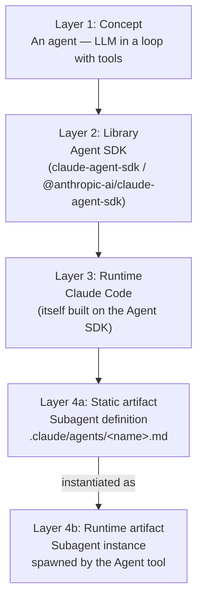
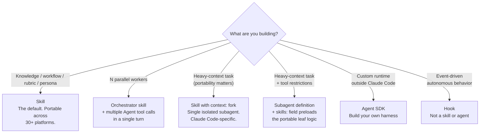
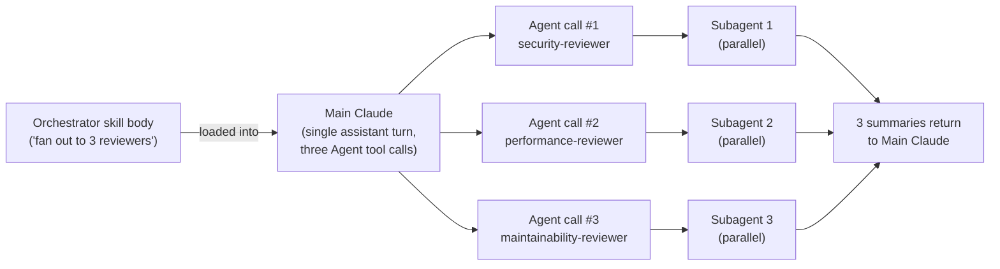

# Skills, Agents, and Subagents, Oh My!
## A Terminology & Architecture Clarification

**Version:** 1.2 | **Last Updated:** 2026-04-16 | **Author:** Claude (with Briggsy)
**Part of:** [Skills 2.0 — Reference Collection](../README.md). Companions: [Claude Skills 2.0 — User Guide](Claude_Skills_2.0_User_Guide.md), [Skill Creator Practitioner's Guide](Skill_Creator_Practitioners_Guide.md).

---

> "Agent" is the most overloaded word in AI right now. Collapsing the four distinct meanings leads to architectural choices that don't survive contact with reality.

**What's in this doc.** The four meanings of "agent" pulled apart. What skills actually are (and aren't). The unification thesis ("don't build agents, build skills instead"). A decision framework for picking the right primitive. Runtime mechanics of invocation. Corrections for the misconceptions that cost teams the most time.

**Who it's for.** Anyone who has ever squinted at "create an agent" instructions, written `.claude/agents/foo.md` while meaning to write a skill, or tried to reason about how an orchestrator skill fans out work and found the mechanics murky.

**How long it'll take.** ~20 minutes for the first read. After that, the doc functions as reference — §2, §5, and §7 are the bookmark candidates.

**What to read next.** The [Skills 2.0 User Guide](Claude_Skills_2.0_User_Guide.md) for the full ecosystem treatment, or the [Skill Creator Practitioner's Guide](Skill_Creator_Practitioners_Guide.md) for engineering discipline. The [hub README](../README.md) frames the whole collection.

---

## Executive Summary

**The word "agent" is doing four jobs.** In the Claude Code ecosystem, it refers to (1) the general AI concept of an LLM-in-a-loop, (2) a subagent *definition file* (`.claude/agents/<name>.md`), (3) a subagent *running instance* spawned via the Agent tool at runtime, and (4) the Claude Agent SDK (`claude-agent-sdk`). These are different layers. Treating them as one thing produces confused architecture.

**Skills are not a kind of agent.** A skill is a packaged, loadable set of instructions and resources — closer to a library than a runner. Skills don't execute on their own; they get loaded into an agent's context when triggered. The agent is the worker; the skill is the playbook the worker consults.

**Anthropic's thesis: build skills, not agents.** At the AI Engineering Code Summit (November 2025), Barry Zhang and Mahesh Murag argued for one universal agent runtime powered by a library of domain-specific skills, rather than many specialized agents. Microsoft's skills ecosystem documents the same pattern: "Agents are built on top of skills." This thesis has direct architectural consequences: reach for skills first, drop to subagent definitions only when you need runtime isolation, and reach for the Agent SDK only when you're building outside Claude Code.

**The decision framework:** If it's a rubric, workflow, or persona → skill. If it's a persona that needs its own context window → skill with `context: fork`, or a subagent definition that preloads the skill. If it's N independent analyses in parallel → an orchestrator skill that instructs main Claude to spawn N subagent instances. If it's a custom agent outside Claude Code → Agent SDK.

**The three most expensive misconceptions:** (1) subagents do NOT inherit skills from the parent session — they need an explicit `skills:` field in their definition, (2) skills do NOT spawn subagents directly — the skill's body is instructions *to main Claude*, which then uses the Agent tool, (3) `context: fork` creates ONE isolated subagent, not parallel execution.

---

## Table of Contents

1. [Why This Doc Exists](#1-why-this-doc-exists)
2. [The Four Meanings of "Agent"](#2-the-four-meanings-of-agent)
3. [What a Skill Actually Is (And Isn't)](#3-what-a-skill-actually-is-and-isnt)
4. [The Unification Thesis: "Don't Build Agents, Build Skills Instead"](#4-the-unification-thesis-dont-build-agents-build-skills-instead)
5. [Decision Framework: When to Reach for Each Primitive](#5-decision-framework-when-to-reach-for-each-primitive)
6. [How Invocation Actually Works](#6-how-invocation-actually-works)
7. [Common Misconceptions & Corrections](#7-common-misconceptions--corrections)
8. [Survival Guide: Reading Anthropic's Docs](#8-survival-guide-reading-anthropics-docs)
9. [Appendix A: Sources](#appendix-a-sources)

> **Glossary:** the canonical glossary for this collection lives in the [hub README](../README.md#glossary).

---

## 1. Why This Doc Exists

Here is a real exchange that plays out constantly in Claude Code communities:

> **Person A:** "Build an agent that reviews PRs."
> **Person B:** "OK — do you mean a `.claude/agents/pr-reviewer.md` file? Or a skill with `context: fork`? Or a standalone program using the Agent SDK? Or something else?"
> **Person A:** "...yes?"

The problem isn't that Person A is being sloppy. The problem is that the word "agent" has been asked to do four different jobs in the same sentence — and Anthropic's own documentation uses the word freely across all four meanings without always flagging which one is in play.

This matters because the four meanings live at different layers of the stack, and architectural decisions depend on knowing which one you're reaching for:

- **If you think "agent" means a definition file, but the speaker meant the SDK**, you'll build the wrong thing.
- **If you think subagents inherit skills from their parent, but they don't**, your orchestration pattern will silently fail — the subagent will have no idea the skill exists.
- **If you think a skill with `context: fork` spawns parallel workers, but it spawns one**, your "parallel review" design will run serially.
- **If you conflate the concept-of-agent with the Claude Code artifact called an agent**, you'll assume things are automatic that actually require explicit wiring.

This doc fixes the terminology problem at its root. Once the four meanings are separated, the downstream architectural questions become much easier to reason about. Skills vs. subagents stops being a confused debate and becomes a straightforward choice between primitives with different properties.

---

## 2. The Four Meanings of "Agent"

Here are the four things the word "agent" refers to, in the order you're most likely to encounter them.

### 2.1 Agent (The Concept)

**Definition:** A system where an LLM dynamically directs its own processes and tool usage, maintaining control over how it accomplishes a task. The canonical Anthropic framing, from their December 2024 essay [Building Effective Agents](https://www.anthropic.com/news/building-effective-ai-agents):

> "Agents are systems where LLMs dynamically direct their own processes and tool usage, maintaining control over how they accomplish tasks."

**In practice:** An LLM in a loop, with tools, working memory, and some environment it observes and acts upon. This is the *conceptual* layer. It doesn't specify any particular implementation — an agent in this sense could be Claude Code itself, a custom Python script using the Agent SDK, an OpenAI Assistants API deployment, or a hand-rolled loop calling Anthropic's API directly.

**What to remember:** When a blog post, research paper, or industry analyst says "the rise of agents," this is almost always the meaning. It's a *category of system*, not a specific artifact you can point at in a directory.

### 2.2 Subagent Definition (The Static Artifact)

**Definition:** A Markdown file at `.claude/agents/<name>.md` (project-level) or `~/.claude/agents/<name>.md` (user-level), containing YAML frontmatter plus a system prompt body. This is a *configuration file*, not a running process. Nothing executes until something spawns an instance of it.

**Frontmatter fields (verified against Anthropic docs):**

| Field | Purpose |
|-------|---------|
| `name` | Identifier. Referenced by the Agent tool's `subagent_type` parameter. |
| `description` | Routing text. Main Claude reads this to decide when to delegate automatically. Phrases like "use proactively" or "use PROACTIVELY" encourage auto-invocation. |
| `tools` | Comma-separated list of tools available to the instance. If omitted, inherits all tools from the parent. **Subagents cannot spawn other subagents** — do not list `Agent` or `Task` here. |
| `disallowedTools` | Removes specific tools from the inherited or explicit tool set. Evaluated *after* `tools`. Use `Skill(skill-name)` syntax to block a specific skill from being invoked by this subagent — relevant because `skills:` only controls injection, not access (see Section 7, Misconception 1). |
| `model` | `sonnet`, `opus`, `haiku`, or a full model ID. Defaults to parent's model. |
| `skills` | List of skills to preload into the instance's context when it spawns. **Critical field** — see misconceptions section. |
| `permissionMode` | One of `acceptEdits`, `bypassPermissions`, `plan`, `default`, `auto`. Controls how permission prompts are handled during the subagent's execution. |
| `hooks` | Lifecycle hooks scoped to this subagent (`PreToolUse`, `PostToolUse`, `Stop`, etc.). Fire when the subagent is spawned via the Agent tool; do *not* fire when the subagent is run as the main session via `--agent`. |
| `mcpServers` | MCP server configurations scoped to this subagent. Allows a specialist to reach an external tool its parent cannot. |
| `memory` | Enables a persistent `MEMORY.md` file for this subagent. First 200 lines injected at startup; the subagent can read/write/curate it across sessions. |
| `effort` | Override effort level: `low`, `medium`, `high`, `max`. Opus 4.6 only. |
| `color` | UI label color for this subagent in the Claude Code interface. |
| `background` | Whether the subagent runs in the background by default. |
| `isolation` | Process isolation control. Valid value includes `worktree`, which runs the subagent in a temporary git worktree. |
| `initialPrompt` | Text auto-submitted as the first user turn when this subagent runs as the main session via `--agent`. |
| `maxTurns` | Caps the subagent's autonomous turn count. |

For the complete, current reference — including fields added in future Claude Code releases — see [the official Claude Code subagents docs](https://code.claude.com/docs/en/sub-agents).

**System prompt:** The markdown body after the frontmatter becomes the subagent's system prompt. This is where you write the persona, the review rubric, the style guide, the output contract.

**What to remember:** Think of this like a class definition or a template. It's inert until instantiated. The file exists to be referenced by name when something else decides to spawn an instance.

### 2.3 Subagent Instance (The Runtime Spawn)

**Definition:** A child Claude process, created at runtime, with its own isolated context window. Spawned by main Claude's use of the **Agent tool** (renamed from `Task` in Claude Code 2.1.63; both names still work as aliases).

**Key properties:**

- **Isolated context.** The instance cannot see the parent conversation. It receives only the prompt main Claude passes plus whatever its definition preloads.
- **Own tool permissions.** Governed by the definition's `tools:` field.
- **Returns a single summary.** When the instance finishes, it returns one message back to the parent. Main Claude then incorporates that summary into the ongoing conversation.
- **Cannot recursively spawn.** An instance cannot call the Agent tool itself. All fan-out must be orchestrated by the top-level Claude.

**Invocation parameters:**

```
Agent({
  subagent_type: "pr-reviewer",      # Which definition to instantiate
  prompt: "Review the diff in PR 42", # The task
  description: "Review PR 42"         # Short label for the operation
})
```

**What to remember:** This is the thing that actually *runs*. It's ephemeral — it exists for the duration of one task and is discarded. Think of the definition as a blueprint and the instance as a building constructed from that blueprint, which gets demolished as soon as the occupants move out.

**Built-in subagent types.** Claude Code ships with five built-in types. When you call the Agent tool without pointing at a custom definition, you're reaching for one of these:

| Built-in | Model | Tools | Purpose |
|----------|-------|-------|---------|
| `Explore` | Haiku | Read-only (Read, Glob, Grep) | Fast read-only codebase search and analysis. The default target for `context: fork` skills doing exploration. |
| `Plan` | Inherits parent | Read-only | Codebase research during plan mode. Read-only by design — prevents infinite nesting since subagents can't spawn. |
| `general-purpose` | Inherits parent | All tools | Multi-step exploration plus action. The default fallback when you need write access. |
| `statusline-setup` | Sonnet | Limited | Used by the `/statusline` configuration flow. |
| `Claude Code Guide` | Haiku | Limited | Answers questions about Claude Code itself — features, hooks, settings, IDE integrations. |

Custom subagent definitions in `.claude/agents/` extend this set. Reference any of them — built-in or custom — by name via the `subagent_type` parameter.

### 2.4 Agent SDK (The Library)

**Definition:** `claude-agent-sdk` (Python) and `@anthropic-ai/claude-agent-sdk` (TypeScript). A software library for building your own agent harnesses — outside of Claude Code, outside of Claude.ai.

**History:** Renamed from "Claude Code SDK" in September 2025. The rename signaled a shift in positioning: the library is for building *any* agent, not just extensions to Claude Code. The underlying code is largely what powers Claude Code itself — Anthropic made the runtime available as a dependency you can import.

**Use cases:**

- A CLI tool that embeds an agent as a feature (not the whole product).
- A backend service that runs agent workflows on a schedule.
- A custom chat interface built on top of Anthropic's API with your own tool definitions.
- A research harness for running experiments on agent behavior.

**What to remember:** The Agent SDK is the *foundation* layer. It's what you reach for when Claude Code doesn't fit your deployment model and you need to build a runtime yourself. If you're working inside Claude Code, you almost never need it — Claude Code *is* an agent built on this stack.

### Quick Reference Table

| Meaning | Layer | Artifact Type | Example |
|---------|-------|---------------|---------|
| **Concept** | Abstract | N/A | "This product is an AI agent for sales research" |
| **Subagent definition** | Config | `.claude/agents/<name>.md` | `.claude/agents/security-reviewer.md` |
| **Subagent instance** | Runtime | Ephemeral child process | What the Agent tool spawns |
| **Agent SDK** | Library | Installable package | `pip install claude-agent-sdk` |

### How the Four Layers Stack

The table above is ordinal. The diagram below shows the *layering* — these aren't four flavors of the same thing; they're different layers in a stack, with each upper layer plugging into the one beneath it.



When someone says "build an agent," ask which layer they mean. The answer determines the next ten architectural decisions.

### The Adjacent Confusions

Five more terms you'll encounter that are NOT agents but often get lumped in:

- **MCP servers** (Model Context Protocol). These are *tool providers*, not agents. An MCP server exposes tools over a standard protocol so agents can call them. MCP is to agents what HTTP is to browsers — the connective layer.
- **"ChatGPT Agent" / "Claude Agents" (product names).** Sometimes Anthropic or OpenAI brands a consumer-facing feature as "Agent." These are products, not primitives.
- **Agent Teams** (Claude Code 2.1.32+, experimental). A peer-to-peer messaging layer where multiple subagents can communicate with each other directly, rather than fanning out hub-and-spoke from main Claude. This is a separate feature toggled via `CLAUDE_CODE_EXPERIMENTAL_AGENT_TEAMS` and shouldn't be confused with the default subagent model.
- **Hooks.** Event-driven automations (`PreToolUse`, `PostToolUse`, `Stop`, `SessionStart`, and others) that fire on Claude Code lifecycle events. Hooks are not agents, not skills, and not subagents — they're a separate mechanism for *deterministic* side effects at predefined moments. Use a hook when you need guaranteed execution on an event rather than letting an agent decide whether to act.
- **Plugins.** Distribution bundles that can contain skills, subagent definitions, hooks, commands, and MCP servers packaged as a single installable unit. A plugin is a *packaging* primitive, not an *architectural* one. "Should this be a plugin?" is a distribution question, not a design question.

---

## 3. What a Skill Actually Is (And Isn't)

A skill is a **folder** containing a `SKILL.md` file plus optional supporting resources (scripts, references, assets). It's a packaged, loadable set of instructions that *an agent* can pull into context on demand.

The Skills 2.0 User Guide covers the [full anatomy](Claude_Skills_2.0_User_Guide.md#3-anatomy-of-a-skill), [runtime mechanics](Claude_Skills_2.0_User_Guide.md#4-how-skills-work-at-runtime), and [complete frontmatter reference](Claude_Skills_2.0_User_Guide.md#9-complete-frontmatter-reference). The point worth hammering here is what a skill *is not*.

### A Skill Is Not An Agent

A skill has no runtime. It doesn't execute. It doesn't spawn. It doesn't loop. It sits in a directory as Markdown and YAML until an agent decides to load it.

When you "invoke" a skill, what actually happens is:

1. Some agent (main Claude, a subagent instance, another compatible platform's runtime) matches the skill's `description` against a user request — or the user types `/skill-name` explicitly.
2. That agent reads the skill's `SKILL.md` into its own context window.
3. That agent follows the skill's instructions *using its own tools*.
4. The skill content stays in context for the rest of the session. Skills do not auto-unload when their task completes — context is append-only. (See Section 7, Misconception 9 for the full mechanics, including how auto-compaction interacts with invoked skills.)

At no point does the skill itself *do* anything. It's a playbook. The agent is what works from the playbook.

### The Worker/Playbook Mental Model

| Role | Claude Code Term |
|------|------------------|
| The worker | Agent (any of meanings 2.2 / 2.3 / 2.4) |
| The playbook the worker consults | Skill |
| A specialized worker's job description | Subagent definition (`.claude/agents/*.md`) |
| That specialized worker showing up to do a job | Subagent instance (spawned via Agent tool) |
| The factory that builds custom workers from scratch | Agent SDK |

This model holds up across every question you might ask:

- *Can a skill call another skill?* Only in the sense that one playbook can instruct the worker to open another playbook. The worker (main Claude) is what does the opening.
- *Can a skill spawn a subagent?* Only in the sense that the playbook can instruct the worker to dispatch a specialist. The worker makes the Agent tool call.
- *Can a subagent instance load a skill?* Only if its job description (the `.claude/agents/*.md` file) includes the skill in its `skills:` field — or if the specific platform it runs on has its own mechanism. Skills do not walk themselves into a subagent's context.

### Why This Matters Architecturally

Collapsing skills and agents into one mental category causes bad decisions. Two common failure modes:

**Failure mode 1: Treating a skill like an agent.** You write a skill and expect it to "run in the background" or "watch for events." It won't. Skills have no runtime. If you need event-driven behavior, you need hooks (a Claude Code mechanism) or an actual agent process (Agent SDK), not a skill.

**Failure mode 2: Treating an agent like a skill.** You write a `.claude/agents/foo.md` file when the content is really a rubric. Now you've put your portable IP (the rubric itself) inside a Claude-Code-specific artifact that can't travel to Codex, Cursor, or any other platform that speaks the Skills spec. The skill-vs-agent choice has *portability consequences*, and those flow from the fundamental difference between a playbook (skill) and a worker (agent).

### Slash Commands Are Skills Too

As of Claude Code 2.1.3 (2026-01-24), custom slash commands and skills are the same primitive — see [UG §2 — Skills = Slash Commands](Claude_Skills_2.0_User_Guide.md#2-core-concepts) for the full unification treatment, including precedence rules and frontmatter feature parity. The architectural point worth carrying into this doc: skills and commands are interchangeable at the file-system level, so everything said here about skills applies equally to anything created via either convention.

---

## 4. The Unification Thesis: "Don't Build Agents, Build Skills Instead"

At the AI Engineering Code Summit on **November 21, 2025**, Anthropic's Barry Zhang and Mahesh Murag delivered a talk titled **"Don't Build Agents, Build Skills Instead."** The title is deliberately provocative. The argument underneath is pragmatic.

### The Core Claim

Instead of building many specialized agents (a coding agent, a research agent, a customer service agent, a data analysis agent), you should build **one general-purpose agent runtime** and give it a library of **domain-specific skills** it can load on demand.

Reasons this works in practice:

- **Skills compose.** Two skills can coexist in the same agent without fighting for control. Two specialized agents can't — they each assume they're in charge.
- **Skills are portable.** The Skills 2.0 spec is filesystem-based. A SKILL.md written for Claude Code works unchanged in Codex, Cursor, Copilot, Gemini CLI, and 30+ other platforms (see the [agentskills.io Client Showcase](https://agentskills.io/clients) for the current adopter list). Agent definitions don't travel like that.
- **Skills are testable.** The Skill Creator (see the Practitioner's Guide) makes skill development a proper engineering discipline with evals, A/B comparison, and description optimization. Agent definitions don't have equivalent tooling.
- **The agent runtime is getting better fast.** Betting on "one great runtime + many skills" lets you ride improvements to the runtime. Betting on many specialized agents means maintaining many specialized runtimes.

Anthropic's own [October 2025 announcement of Agent Skills](https://www.anthropic.com/news/claude-skills) frames this the same way: skills are how agents acquire capabilities, not a separate category of thing.

### The Microsoft Echo

Microsoft's public skills ecosystem spans multiple repositories — over 200 skills across [microsoft/skills](https://github.com/microsoft/skills) (Azure SDKs for Python, Java, .NET, TypeScript, and Rust, plus Azure services and Microsoft Foundry — 201 skills as of 2026-04), [microsoft/skills-for-fabric](https://github.com/microsoft/skills-for-fabric) (10 skills covering Microsoft Fabric workloads), [MicrosoftDocs/Agent-Skills](https://github.com/MicrosoftDocs/Agent-Skills), and [dotnet/skills](https://github.com/dotnet/skills) — all built on the [Agent Skills open standard](https://agentskills.io). The `skills-for-fabric` README makes the thesis explicit:

> "Agents are built *on top of* skills."

This isn't a random observation. It's the same thesis, validated by a second large organization that had every incentive to invent their own competing abstraction and chose not to.

### Architectural Implications

The thesis isn't just a slogan. It translates into concrete defaults:

1. **When in doubt, make it a skill.** The bar for "should this be a skill?" is low. The bar for "should this be a subagent definition or an SDK-based agent?" should be high.
2. **Put IP in skills, not agent definitions.** Rubrics, style guides, workflows, personas — these are your long-lived IP. They belong in portable skill files, not in Claude-Code-specific agent definitions.
3. **Use subagent definitions as thin wrappers.** If you need a subagent for runtime reasons (context isolation, tool restrictions), let its definition preload a skill via the `skills:` field. The definition becomes plumbing; the skill holds the substance.
4. **Reach for the Agent SDK only when you leave the runtime.** If you're inside Claude Code, Claude.ai, or any other skills-compatible platform, you almost never need the SDK. Reach for it when you need to build your own deployment.

The thesis is architecturally load-bearing. It's the reason to care about the skill-vs-agent distinction in the first place.

<details>
<summary><strong>▶ Further reading: the unification thesis from two more angles</strong></summary>

- [UG §18 — The Bigger Picture](Claude_Skills_2.0_User_Guide.md#18-the-bigger-picture) — same thesis from a strategic, "where the industry is converging" framing.
- [SCG §16 — The Bigger Picture: Skills, Not Agents](Skill_Creator_Practitioners_Guide.md#16-the-bigger-picture-skills-not-agents) — same thesis from an engineering-discipline framing, explaining why "vibes-based skill development" doesn't compose into reliable agent behavior.
- [Anthropic's October 2025 announcement](https://www.anthropic.com/news/claude-skills) — the Zhang/Lazuka/Murag essay that previewed the talk.

</details>

---

## 5. Decision Framework: When to Reach for Each Primitive

Given the four meanings of "agent" plus skills, here's how to decide what to build.

### The Default: Skill

Most things you're tempted to call an "agent" are actually skills. The test is simple:

> **If the thing is primarily a body of instructions, knowledge, or workflow that some agent should consult — it's a skill.**

Examples that are skills:
- A code review rubric
- A deployment checklist
- A style guide
- A persona ("write like Hemingway")
- A template-driven workflow (meeting notes, incident reports)
- A lens applied to a diff (security review, performance review)

### When to Add `context: fork`

Add `context: fork` to a skill's frontmatter when *both* of these are true:

1. The skill will consume significant context (large diffs, long documents, heavy research).
2. You don't want that context to pollute the main conversation.

`context: fork` causes the skill's body to run inside a single spawned subagent instance. The main conversation never sees the intermediate work — only the final summary comes back.

**Trade-off:** `context: fork` is Claude Code-specific. If portability matters, skip it and use a subagent definition wrapper instead (see next section).

### When to Write a Subagent Definition

Reach for `.claude/agents/<name>.md` when any of these apply:

- You need **parallel fan-out** — multiple instances running concurrently. The Agent tool requires a `subagent_type` to spawn, so you need at least a generic or custom definition to target.
- You need **tool restrictions** — limiting what a specialist can touch. The `tools:` field in the definition caps the blast radius.
- You need **portability of the leaf logic** — put the rubric in a skill, have the subagent definition preload it via `skills:`. Now the skill travels to other platforms while the definition stays as Claude-Code-specific plumbing.
- You need **reusable personas** — the same specialist called from many different orchestrators.

### When to Reach for the Agent SDK

Reach for `claude-agent-sdk` only when you're building outside Claude Code / Claude.ai. Specifically:

- A CLI tool that embeds an agent as one feature among others.
- A backend service running agent workflows on a schedule or trigger.
- A custom chat interface with your own tool definitions.
- A research harness for experimenting with agent behavior.

If you're already inside Claude Code, you almost certainly don't need the SDK. Claude Code is itself built on it.

### The Decision Table

| Need | Reach For | Why |
|------|-----------|-----|
| Workflow, rubric, or knowledge to apply | **Skill** | Portable, testable, loadable on demand |
| Heavy-context task that shouldn't pollute the main chat | **Skill with `context: fork`** | One-file isolation; Claude Code-specific |
| Persona that runs isolated AND stays portable | **Skill + subagent definition that preloads it** | Leaf is portable; wrapper is plumbing |
| N independent analyses in parallel | **Orchestrator skill instructing main Claude to spawn N subagents** | Parallelism requires the Agent tool |
| Tool restrictions on a specialist | **Subagent definition with explicit `tools:`** | Limits blast radius |
| Custom runtime outside Claude Code | **Agent SDK** | You need your own harness |
| Autonomous behavior without explicit invocation | **Hooks** (see [Anthropic's hooks docs](https://code.claude.com/docs/en/hooks)) | Skills/agents don't fire on events; hooks do |

### The Decision Tree

The table is two-dimensional. The diagram below captures the *precedence* of questions — what to ask first when you're choosing a primitive.



### Anti-Patterns

- **Writing `.claude/agents/foo.md` when the content is really a rubric.** The rubric should be a skill. The agent definition, if needed at all, should be a thin wrapper.
- **Reaching for the Agent SDK when a skill would do.** If you're inside Claude Code, a skill is almost always the right answer.
- **Assuming subagents inherit skills.** They don't. See Section 7.
- **Using `context: fork` to achieve parallelism.** It doesn't. It produces one isolated subagent. For parallel fan-out, you need an orchestrator skill that instructs main Claude to make multiple Agent tool calls.

---

## 6. How Invocation Actually Works

Mental model clarity requires understanding the actual runtime mechanics. Here's what happens when each primitive is invoked. The [User Guide §4 — How Skills Work at Runtime](Claude_Skills_2.0_User_Guide.md#4-how-skills-work-at-runtime) covers the seven-step main-Claude sequence in detail; this section focuses on the dispatch mechanics — *what gets invoked how* — rather than the per-step sequence.

### Skill Invocation Paths

There are four ways a skill enters an agent's context:

**Path 1: User types `/skill-name`.** The slash command triggers the skill directly, bypassing description matching. Arguments (if any) are passed via `$ARGUMENTS`, `$0`, `$1`, etc.

**Path 2: Auto-trigger via description.** The agent reads available skills' `description` metadata on every turn. If a user message matches a description, the agent loads that skill. This is why descriptions need to be specific and "pushy."

**Path 3: Called by another skill's body.** A skill's body can contain instructions like "invoke `/other-skill` on the diff." Critically, **this is instructions to main Claude, not a direct skill-to-skill call**. Main Claude reads the instruction, decides to invoke `/other-skill`, and loads it. Skills don't call each other directly; they instruct the agent to make the call.

**Path 4: Preloaded via a subagent definition.** If a `.claude/agents/<name>.md` file has `skills: [foo, bar]` in its frontmatter, an instance spawned from that definition will have skills `foo` and `bar` loaded into its context from the moment it starts. No explicit invocation needed.

### Subagent Invocation

Subagents are invoked exclusively through the Agent tool. The mechanics:

1. Main Claude decides to delegate (either because a skill's instructions told it to, or because a user request matched a subagent's `description` routing text).
2. Main Claude calls the Agent tool:
   ```
   Agent({
     subagent_type: "security-reviewer",
     prompt: "Review the auth middleware changes in the current diff",
     description: "Security review of auth changes"
   })
   ```
3. The runtime creates a child Claude process, applies the subagent definition (system prompt, tools, preloaded skills), and starts it with the provided prompt.
4. The child runs autonomously with its isolated context window. Main Claude is blocked waiting (unless `run_in_background: true`).
5. When the child finishes, it returns one message summarizing its work.
6. Main Claude incorporates that summary into its own context and continues.

The child cannot:
- See the parent conversation.
- Call the Agent tool itself (no recursive spawning).
- Load arbitrary skills at runtime (only what its definition preloaded).

### Parallel Fan-Out

Parallelism happens one way: **main Claude makes multiple Agent tool calls in the same message.** When multiple tool calls are emitted in a single assistant turn, the runtime executes them concurrently.

```
# Single message, three Agent calls → three parallel subagents
Agent({ subagent_type: "security-reviewer", ... })
Agent({ subagent_type: "performance-reviewer", ... })
Agent({ subagent_type: "maintainability-reviewer", ... })
```

An orchestrator skill's body instructs main Claude to emit multiple Agent calls in a single turn. The skill is not spawning anything — it's telling the agent what tool calls to make. This is how `/simplify` and `/batch` achieve their fan-out.



Note who's doing the spawning. The skill is a passive playbook. Main Claude is the dispatcher. The runtime is what actually executes the tool calls in parallel. If you've internalized that distinction, [Misconception 3](#misconception-3-context-fork-enables-parallel-execution) reads as obvious — and most parallelism design errors disappear.

### `context: fork` Mechanics

`context: fork` on a skill frontmatter changes the invocation path. Instead of loading the skill into main Claude's context, the runtime:

1. Spawns a subagent instance (of the type specified by the `agent:` field — `Explore`, `Plan`, `general-purpose`, or a custom definition).
2. Runs the skill's body *inside that subagent*.
3. Returns the subagent's summary to main Claude.

This is effectively a shorthand for "skill + subagent wrapper" — one frontmatter block instead of two files. It's single-subagent isolation, not parallelism. Parallelism still requires an orchestrator with multiple Agent tool calls.

**Version note.** `context: fork` shipped in Claude Code 2.1. Skills running on older Claude Code versions don't have access to it and will silently run inline. One known limitation: when a skill is invoked via the Skill tool directly (rather than triggered by description matching), `context: fork` and `agent:` frontmatter fields are currently ignored and the skill runs in main Claude's context instead of a spawned subagent. Track `anthropics/claude-code#17283` for the open feature request to have the Skill tool honor these fields.

### Dynamic Context Injection

The backtick-bang syntax (`` !`command` ``) in a skill body runs the shell command **before** the skill content is sent to the agent. The command output replaces the placeholder. This is preprocessing at skill-load time, not at agent-execution time — the agent only ever sees the rendered output, not the template.

```yaml
---
name: pr-context
description: Prepare PR context for review
---
PR diff: !`gh pr diff`
```

When this skill loads, the runtime executes `gh pr diff`, substitutes the output, and the agent sees the expanded text.

---

## 7. Common Misconceptions & Corrections

These are the misconceptions that cost the most time when they're wrong.

### Misconception 1: "Subagents inherit skills from their parent."

**FALSE.** A spawned subagent instance starts with a clean context. It does not inherit the skills the parent had loaded into its working context.

**What's actually true:** Subagent definitions have a `skills:` field in their frontmatter. Skills listed there are preloaded into the instance's context when it spawns. For reliable access, declare skills in the definition.

**Important nuance:** The `skills:` field is a *startup injection mechanism*, not an *access restriction*. Subagents with filesystem access (notably the built-in `general-purpose` subagent) can still discover and invoke project skills at runtime by scanning `.claude/skills/` directories using their normal Read/Glob/Grep tools. If you need to actually *prevent* a subagent from invoking a particular skill, use `disallowedTools: Skill(skill-name)` rather than relying on its absence from `skills:`. See `anthropics/claude-code#32910` for the reproduction and discussion.

**Why this matters:** If you design an orchestration where main Claude spawns generic `general-purpose` subagents and tells them to "invoke `/leaf-skill`," the runtime-discovery path means the subagent may actually find the skill via filesystem scan — but relying on that behavior is fragile, and subagents with restricted tool sets won't have it. For reliable preloading, declare the skill via `skills:`. For security boundaries, use `disallowedTools:`. Don't conflate the two.

### Misconception 2: "Skills can spawn subagents directly."

**FALSE.** A skill has no runtime. It cannot spawn anything.

**What's actually true:** A skill's body is instructions that the main agent reads and follows. If the skill body says "spawn three subagents in parallel," the main agent is the one making the Agent tool calls. The skill is a script the agent follows; the agent is the one holding the tools.

**Why this matters:** Designs that assume skills have autonomous execution will fail. The skill can only influence behavior by shaping the agent's prompt.

### Misconception 3: "`context: fork` enables parallel execution."

**FALSE.** `context: fork` creates ONE isolated subagent running the skill's body. It is single-subagent isolation, not parallelism.

**What's actually true:** For parallel execution, you need an orchestrator skill whose body instructs main Claude to emit multiple Agent tool calls in a single turn. Each tool call spawns one subagent; the runtime handles concurrency.

### Misconception 4: "The Task tool and the Agent tool are different tools."

**FALSE.** They're the same tool. The Agent tool was renamed from Task in Claude Code 2.1.63. Both names continue to work as aliases. Older documentation and examples using `Task(...)` still function identically.

### Misconception 5: "Subagent definitions and the Agent SDK are the same thing."

**FALSE.** They live at different layers entirely.

**What's actually true:** A subagent definition is a config file used by Claude Code's built-in runtime to parameterize child processes. The Agent SDK is a separate library for building your own agent runtime from scratch. You use subagent definitions *inside* Claude Code. You use the Agent SDK *outside* Claude Code.

### Misconception 6: "MCP servers are agents."

**FALSE.** MCP servers are tool providers. They expose tools over the Model Context Protocol so agents can call them. MCP is the connective layer between agents and external systems — it's to agents what HTTP is to browsers.

### Misconception 7: "One skill can call another skill directly."

**AMBIGUOUS — needs precision.** A skill's body can contain instructions like "now invoke `/other-skill`," but the invocation is performed by the main agent reading the instruction, not by the skill reaching into another skill. The indirection goes through the agent.

**Why this matters:** You can't assume data flows directly between skills. Whatever one skill "passes" to another has to go through the agent's context — which means it has to be written explicitly as text the agent can see and pass along.

### Misconception 8: "Anthropic's documentation distinguishes consistently between subagent-the-file and subagent-the-instance."

**FALSE — but this one isn't your fault.** Anthropic's own documentation uses "subagent" to mean both the definition file and the running instance, often in the same paragraph. There's no canonical glossary that pins the terms down. This is why your doc (this one) can actually improve on the official sources.

### Misconception 9: "Skills are unloaded from context when their task completes."

**FALSE — and this one is expensive when it's wrong.** LLM context windows are append-only within a session. Once a skill's body loads into an agent's context, it stays there alongside everything else in the conversation history. There is no mechanism that selectively removes a skill when a "task" ends — because there's no runtime boundary that marks a task as ended.

**What's actually true:** Skills persist in context for the remainder of the session, contributing to token count growth. Four things affect skill presence in context:

1. **`context: fork`** — the skill ran inside a spawned subagent whose context was discarded when the subagent returned its summary. Only the summary reaches main Claude. This is the one case that approximates "unloading" — and it's opt-in per skill.
2. **Auto-compaction** — when the context window fills, Claude Code's auto-compaction kicks in. Per Anthropic's skills documentation, invoked skills are carried forward within a shared **25,000-token budget**. If you've invoked many skills in one session, older ones can be dropped entirely from the re-attached set after compaction.
3. **Manual `/clear`** — wipes the session.
4. **Session end** — everything is discarded.

**Why this matters:** "Progressive disclosure" means *deferred loading* — see [UG §2 — Core Concepts](Claude_Skills_2.0_User_Guide.md#2-core-concepts) for the full three-tier mechanic (frontmatter always in context; body loads when triggered; supporting files load when referenced). It does not mean *post-task unloading*. Treating skills as if they free context when they finish produces session-degradation patterns that are hard to diagnose after the fact — because the bloat isn't any single skill, it's the accumulated weight of everything invoked across the session. For evidence and workarounds, see GitHub issues `anthropics/claude-code#14882` and `anthropics/claude-code#45091` (an open feature request for a `clear: true` skill frontmatter field, the very existence of which proves no such mechanism ships today).

---

## 8. Survival Guide: Reading Anthropic's Docs

Anthropic's own documentation uses these terms inconsistently. "Subagent" means both the definition file and the running instance — sometimes in the same paragraph. "Agent" appears across all four meanings without always flagging which one is in play. Older docs still reference renamed concepts. This is the survival metadata for navigating those docs without getting lost.

**Term patterns to watch for:**

- **"Subagent" appearing in the same paragraph as both "file" and "spawn"** almost certainly means both the definition AND the instance simultaneously. Read both meanings into the sentence; don't force a single interpretation.
- **"Agent" standing alone** almost always means the concept (LLM-in-a-loop). When docs mean the tool or a specific artifact, they usually say so explicitly — "the Agent tool," "an agent definition," "the Agent SDK."
- **"Agent definition"** means the `.claude/agents/<name>.md` file. A static config artifact.
- **"Agent instance" or "spawned subagent"** means the runtime child process. Ephemeral.

**Renames to be aware of:**

- **"Claude Code SDK"** in older docs = **"Claude Agent SDK"** today. Renamed September 2025 to reflect that the library is for building any agent, not just Claude Code extensions.
- **"Task tool"** in older docs and examples = **"Agent tool"** today. Renamed in Claude Code 2.1.63. Both names still work as aliases, but new material should use "Agent tool."

**Default assumption:** When in doubt, assume the doc author knew which meaning they intended — your job is to figure out which of the four layers (concept, definition, instance, SDK) the sentence is actually talking about. The four-meanings taxonomy in Section 2 is the decoder ring; keep it open in another tab while reading anything agent-related.

---

## Appendix A: Sources

**Primary Anthropic sources:**

- [Building Effective Agents](https://www.anthropic.com/news/building-effective-ai-agents) — Dec 2024. Canonical definition of "agent (concept)."
- [Equipping agents for the real world with Agent Skills](https://www.anthropic.com/news/claude-skills) — Oct 2025. Zhang, Lazuka, Murag. Companion reading to the Zhang/Murag talk.
- [Claude Code Subagents documentation](https://docs.anthropic.com/claude/docs/subagents) — frontmatter fields, invocation mechanics.
- [Claude Code Skills documentation](https://docs.anthropic.com/claude/docs/skills) — skill structure and triggering.
- [Agent Skills API reference](https://docs.anthropic.com/claude/reference/agent-skills)
- [Agent SDK overview](https://docs.anthropic.com/claude/docs/agent-sdk-overview)

**The "Don't Build Agents" talk:**

- **Title:** *Don't Build Agents, Build Skills Instead*
- **Speakers:** Barry Zhang & Mahesh Murag (Members of Technical Staff, Anthropic)
- **Event:** AI Engineering Code Summit, November 20–21, 2025 (talk delivered Nov 21)
- **Video:** Published on the AI Engineer YouTube channel
- **Summit repo:** `The-Focus-AI/2025-11-20-ai-engineering-code-summit`

**Ecosystem validation:**

- [microsoft/skills-for-fabric](https://github.com/microsoft/skills-for-fabric) — README contains the "Agents are built *on top of* skills" thesis.
- [microsoft/skills](https://github.com/microsoft/skills) — 200+ skills across Azure SDKs (Python, Java, .NET, TypeScript, Rust), Azure services, and Microsoft Foundry, following the Agent Skills spec. (201 skills as of 2026-04, verified via direct enumeration of the eight plugins under `.github/plugins/`.)
- [MicrosoftDocs/Agent-Skills](https://github.com/MicrosoftDocs/Agent-Skills) — curated Azure Agent Skills collection.
- [dotnet/skills](https://github.com/dotnet/skills) — .NET Agent Skills.
- [Agent Skills Specification](https://agentskills.io/specification) — open standard, Apache 2.0 (code) / CC-BY-4.0 (docs).

**Companion documents in this research collection:**

- [Claude Skills 2.0: The Definitive User Guide](Claude_Skills_2.0_User_Guide.md) — full skill anatomy, frontmatter, triggering, cross-platform compatibility.
- [The Skill Creator: A Practitioner's Guide](Skill_Creator_Practitioners_Guide.md) — engineering discipline for skill development: evals, A/B testing, description optimization.

---

*Built from primary source analysis of Anthropic's subagent and skills documentation, the agentskills.io specification, the Claude Agent SDK documentation, Microsoft's skills ecosystem (verified by direct enumeration of the `microsoft/skills` and `microsoft/skills-for-fabric` repos via the GitHub API), the Zhang/Murag AI Engineering Code Summit talk, and cross-verification against the companion Skills 2.0 User Guide and Skill Creator Practitioner's Guide. Reflects the ecosystem as of 2026-04-16. Corrections to common misconceptions verified against Anthropic's official docs and specific GitHub issues (`anthropics/claude-code#14882`, `#17283`, `#32910`, `#45091`) rather than community folklore. v1.1 applied an adversarial review pass with the reviewer's own citations independently re-verified before merge. v1.2 normalized the intro pattern, added Mermaid diagrams for the four-meanings layered architecture (§2), the decision tree (§5), and parallel fan-out (§6), updated the Microsoft skill count from "~130" to the verified 200+ figure, added the agentskills.io Client Showcase as primary source for the "30+ platforms" claim, and consolidated the glossary into the [hub README](../README.md#glossary).*
