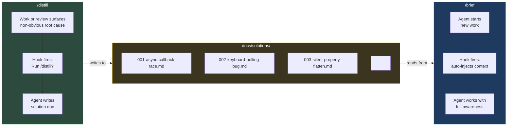
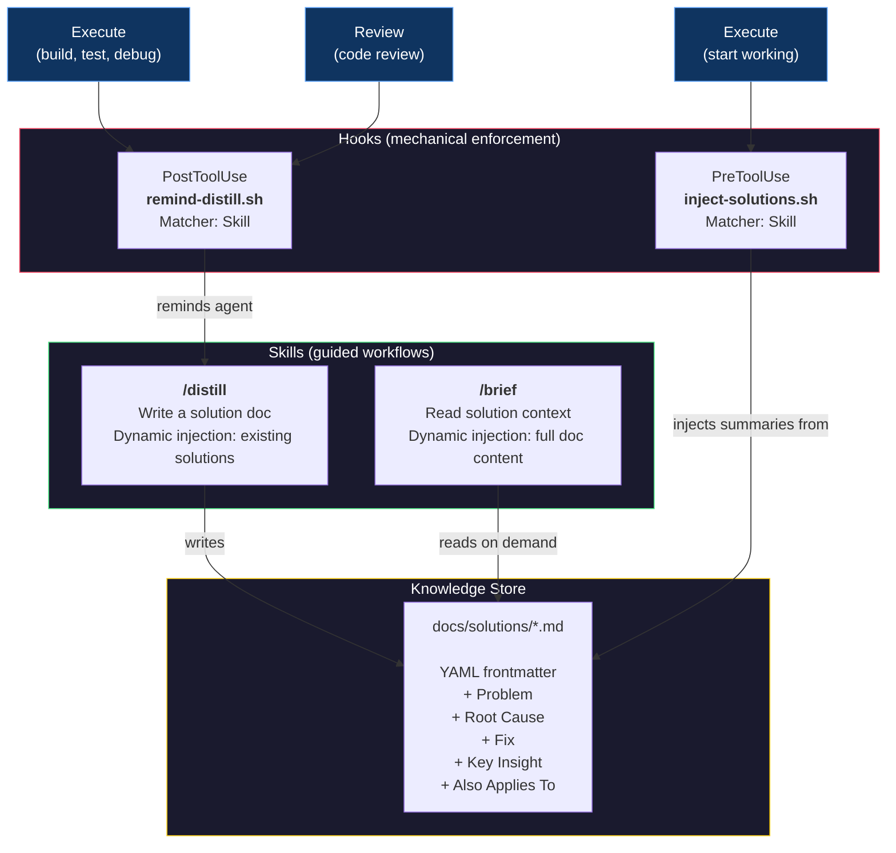
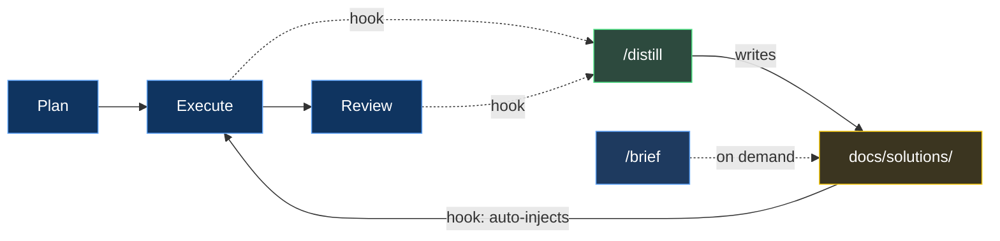

# Distill & Brief
### How We Stopped Losing What We Learned

---

> **The pitch:** Every engineering session produces hard-won knowledge. By the next session, it's gone.
>
> We built a system where AI agents *automatically* capture non-obvious fixes and *automatically* brief themselves before starting new work. Two skills, two hooks, zero human effort, minimum token burn.

---

## The Problem

AI coding agents have amnesia. Each session starts from zero.

When you spend 45 minutes discovering that an async callback silently drops valid data because of a stale request ID, that knowledge lives in the conversation. When the session ends, it evaporates. The next session hits the exact same wall.

```
Session 1: Debug for 45 min  -->  Find root cause  -->  Fix it  -->  Session ends
Session 2: Debug for 45 min  -->  Find root cause  -->  "...wait, didn't we do this before?"
```

Putting "remember to check past fixes" in instructions doesn't work. Humans forget to ask. Agents skip them, forget them, or deprioritize them under task pressure.

**We needed mechanical enforcement.**

---

## The Solution

Two directions. Two skills. Two hooks. One feedback loop.



### The Flow in Plain English

1. **After executing work or completing a review**, a hook automatically asks: *"Did anything non-obvious come up? If so, run `/distill`."*
2. **`/distill`** shows the agent what's already documented, provides a template, and auto-numbers the next file. The agent writes a focused solution doc — or says "nothing to capture" and moves on.
3. **Before the next work session**, a hook automatically injects summaries of every solution doc into the agent's context. No one has to remember. No one has to ask.
4. **`/brief`** is also available on-demand — any time, any session, just ask.

---

## Architecture



---

## Why This Approach

We considered several alternatives. Here's why we landed here.

| Approach | Verdict | Why |
|----------|---------|-----|
| **Agent instructions** ("check solutions before work") | Rejected | Instructions are suggestions. Agents skip them under task pressure. |
| **Existing plugin skill** (ce:compound) | Rejected | Spins up 5 parallel subagents, produces 150+ line docs. Overkill for our 40-line format. |
| **Auto-triggering skills** (no hooks) | Rejected | Claude's own docs say it "tends to under-trigger." Unreliable for enforcement. |
| **Hooks + custom skills** | Selected | Hooks fire deterministically. Skills handle the workflow. Best of both. |

### Design Principles

**Hooks enforce WHEN.** They fire on every relevant skill invocation. Not optional. Not skippable.

**Skills handle HOW.** The `/distill` skill uses dynamic context injection (`!` backtick syntax) to preprocess existing solutions before the agent sees the prompt. This means the agent automatically sees what's already documented — preventing duplicates without anyone checking.

**Instructions describe WHAT.** Three lines in our project config. What the folders are, what the skills do. No behavioral instructions. The behavior is mechanical.

---

## What a Solution Doc Looks Like

Lean. Focused. Under 60 lines.

```markdown
---
title: Seeker frozen — async pathfinding callback invalidation
date: 2026-03-31
phase: 5a
modules: [game/ai/seeker-fsm, game/engine]
tags: [async, pathfinding, race-condition, FSM]
---

## Problem
Seeker AI stops moving after 2-3 path requests. Visually frozen in place.

## Root Cause
Async pathfinding callback fires after FSM state transition.
New state's path request overwrites `latestRequestId`, but the old
callback still references the stale ID. Guard check silently drops
the valid path.

## Fix
Added `pendingPath: boolean` to SeekerAIInternalState. Set on request,
cleared on callback or clearPath(). All 4 FSM states guard on it.

## Key Insight
Any async callback that touches shared state needs a generation counter
AND a pending flag. The counter alone creates a silent-drop window.

## Also Applies To
Any future async system (sound loading, network requests) that uses
request-ID-based supersession.
```

---

## The Bigger Picture

This is one piece of a larger development workflow:



Plan. Execute. Review. Distill. Brief. Repeat.

Both execute and review feed the knowledge store — via hooks, not hope. The next session starts with everything the last session learned. Each cycle makes the next one better. The knowledge base grows. Rediscovery drops to zero. Velocity increases.

> *Currently implemented with the [compound-engineering](https://github.com/nichochar/compound-engineering) plugin for Claude Code. The pattern is tool-agnostic — any workflow with plan/execute/review steps can plug in.*

---

**Humans forget. Instructions are hopes. Hooks are guarantees.**

---

*Built by Briggsy & Claude Code, powered by Skills 2.0, and a refusal to accept that AI sessions have to start from zero.*

---

## Appendix: Engineering the Skills

We didn't just write these skills and ship them. We ran `/distill` through Anthropic's [Skill Creator](https://github.com/anthropics/skills) — the meta-skill that turns skill development from vibes into engineering.

### A/B Eval Results

3 test cases, 6 parallel subagents (with-skill + baseline for each):

| Metric | /distill | No Skill | Delta |
|--------|---------|----------|-------|
| **Pass Rate** | 100% (18/18) | 33% (6/18) | **+67%** |
| **Avg Tokens** | 26.6K | 28.4K | -1.8K |
| **Avg Lines** | 49 | 101 | -52 |

The skill doesn't make Claude smarter — it makes Claude **consistent**. Same quality content, half the length, perfect structure every time.

### What the Baseline Gets Wrong

Without the skill, Claude produces good documentation but with:
- Inconsistent structure (5-7 sections with varying names vs exactly 5 every time)
- No YAML frontmatter (2 of 3 baselines skipped it entirely)
- 2x the line count (88-115 lines vs 47-53)
- No sequential file numbering
- Key Insights that restate the fix instead of generalizing

### Windows Bug: `select.select()` on Pipes

While running the Skill Creator's description optimizer, we hit `WinError 10038` — every trigger test returned 0%. Root cause: `run_eval.py` uses Python's `select.select()` to read subprocess pipes. On Windows, `select.select()` only works with sockets, not pipes. Every query silently failed.

**The fix:** Replace `select.select()` with a threading-based reader — a background thread does blocking reads from the pipe and puts lines into a `queue.Queue`. The main loop pulls from the queue with a timeout. Same behavior, cross-platform.

```python
# Before (Unix-only):
ready, _, _ = select.select([process.stdout], [], [], 1.0)

# After (cross-platform):
line_queue: queue.Queue[str | None] = queue.Queue()
def _reader():
    for raw_line in process.stdout:
        line_queue.put(raw_line.decode("utf-8", errors="replace"))
    line_queue.put(None)  # sentinel
threading.Thread(target=_reader, daemon=True).start()
```

Anthropic merged this same fix on March 13, 2026 in `claude-plugins-official` ([`fix(run_eval): replace select.select with threading for Windows pipe compatibility`](https://github.com/anthropics/claude-plugins-official)). The `anthropic-agent-skills` plugin hasn't picked it up yet — we applied it locally.
