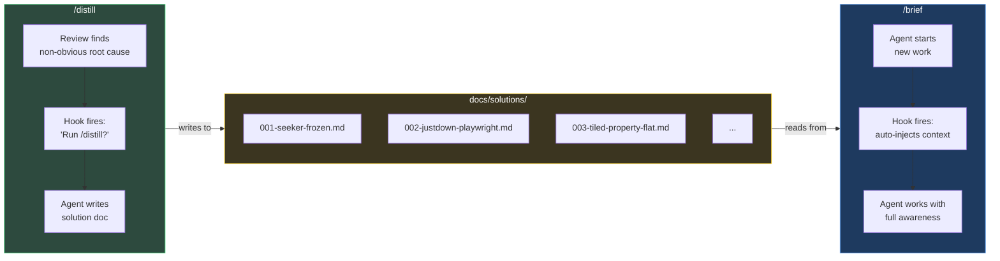
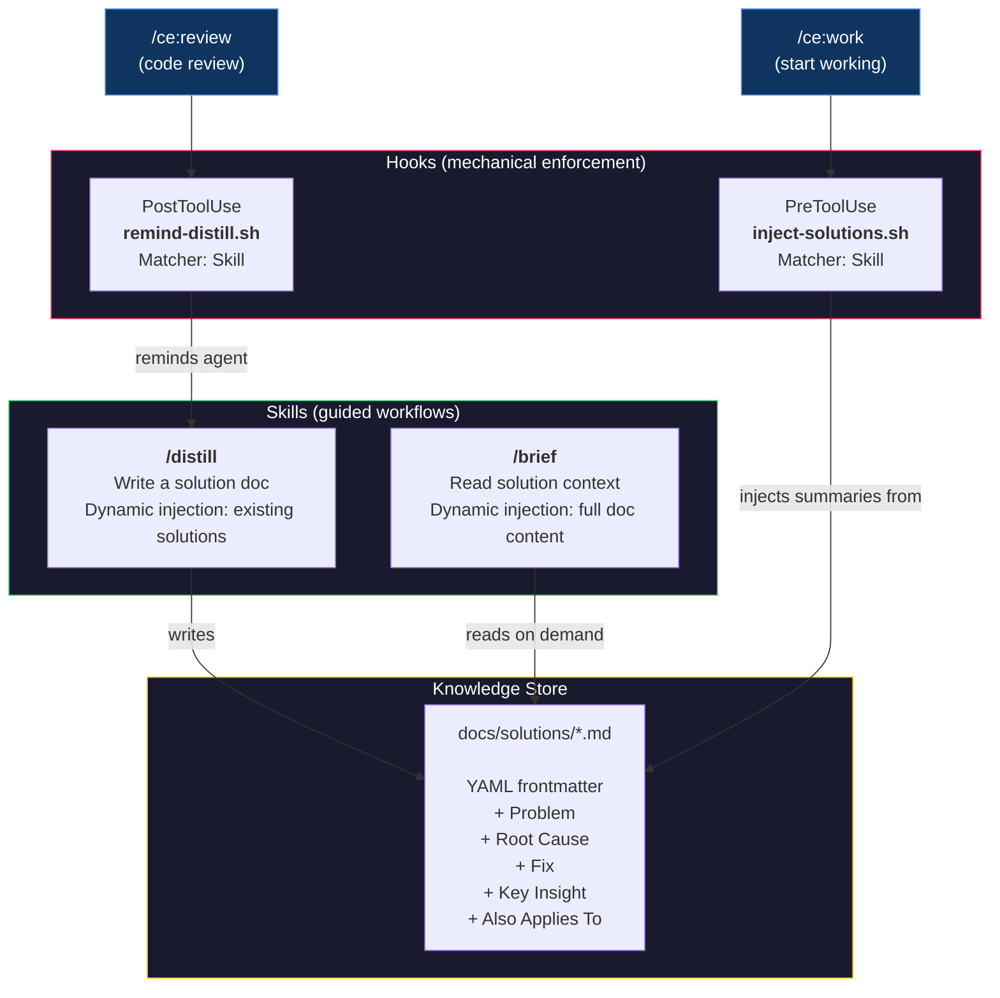
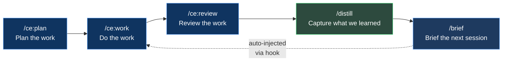

# Distill & Brief
### How We Stopped Losing What We Learned

---

> **The pitch:** Every debugging session produces hard-won knowledge. By the next session, it's gone. We built a system where AI agents *automatically* capture non-obvious fixes and *automatically* brief themselves before starting new work. Two skills, two hooks, zero human effort.

---

## The Problem

AI coding agents have amnesia. Each session starts from zero.

When you spend 45 minutes discovering that Phaser silently flattens Tiled object properties from arrays to Records, that knowledge lives in the conversation. When the session ends, it evaporates. The next session hits the exact same wall.

```
Session 1: Debug for 45 min  -->  Find root cause  -->  Fix it  -->  Session ends
Session 2: Debug for 45 min  -->  Find root cause  -->  "...wait, didn't we do this before?"
```

Putting "remember to check past fixes" in instructions doesn't work. Instructions are hopes. Agents skip them, forget them, or deprioritize them under task pressure.

**We needed mechanical enforcement.**

---

## The Solution

Two directions. Two skills. Two hooks. One feedback loop.



### The Flow in Plain English

1. **After a code review**, a hook automatically asks: *"Did anything non-obvious come up? If so, run `/distill`."*
2. **`/distill`** shows the agent what's already documented, provides a template, and auto-numbers the next file. The agent writes a focused solution doc.
3. **Before the next work session**, a hook automatically injects summaries of every solution doc into the agent's context. No one has to remember. No one has to ask.
4. **`/brief`** is also available on-demand — any time, any session, just ask.

---

## Architecture



---

## Why This Approach

We considered several alternatives. Here's why we landed here.

| Approach | Verdict | Why |
|----------|---------|-----|
| **CLAUDE.md instructions** ("check solutions before work") | Rejected | Instructions are suggestions. Agents skip them under task pressure. |
| **ce:compound** (existing plugin skill) | Rejected | Spins up 5 parallel subagents, produces 150+ line docs. Overkill for our 40-line format. |
| **Auto-triggering skills** (no hooks) | Rejected | Claude's own docs say it "tends to under-trigger." Unreliable for enforcement. |
| **Hooks + custom skills** | Selected | Hooks fire deterministically. Skills handle the workflow. Best of both. |

### Design Principles

**Hooks enforce WHEN.** They fire on every relevant skill invocation. Not optional. Not skippable. The pre-work hook has fired on every `/ce:work` since installation with zero misses.

**Skills handle HOW.** The `/distill` skill uses dynamic context injection (`!` backtick syntax) to preprocess existing solutions before the agent sees the prompt. This means the agent automatically sees what's already documented — preventing duplicates without anyone checking.

**CLAUDE.md describes WHAT.** Three lines. What the folders are, what the skills do. No behavioral instructions. The behavior is mechanical.

---

## What a Solution Doc Looks Like

Lean. Focused. Under 60 lines.

```markdown
---
title: Seeker frozen — async pathfinding callback invalidation
date: 2026-03-31
phase: 5a
modules: [game/ai/seeker-fsm, game/engine]
tags: [async, pathfinding, race-condition, FSM]
---

## Problem
Seeker AI stops moving after 2-3 path requests. Visually frozen in place.

## Root Cause
Async pathfinding callback fires after FSM state transition.
New state's path request overwrites `latestRequestId`, but the old
callback still references the stale ID. Guard check (`reqId !== latestRequestId`)
silently drops the valid path.

## Fix
Added `pendingPath: boolean` to SeekerAIInternalState. Set on request,
cleared on callback or clearPath(). All 4 FSM states guard on it.

## Key Insight
Any async callback that touches shared state needs a generation counter
AND a pending flag. The counter alone creates a silent-drop window.

## Also Applies To
Any future async system (sound loading, network requests) that uses
request-ID-based supersession.
```

---

## The Numbers

| Metric | Value |
|--------|-------|
| Solution docs captured | 5 (and growing) |
| Avg doc length | 45 lines |
| Time to write (via /distill) | ~2 min |
| Time saved per rediscovery avoided | 20-45 min |
| Hook scripts | 2 (inject-solutions.sh, remind-distill.sh) |
| Custom skills | 2 (/distill, /brief) |
| Lines added to CLAUDE.md | 4 |
| Human effort per session | Zero |

---

## The Bigger Picture

This is one piece of a larger workflow we're building:



Plan. Work. Review. Distill. Brief. Repeat.

Each cycle makes the next one better. The agents don't just complete tasks — they *compound their expertise* across sessions. The knowledge base grows. The rediscovery drops to zero. The velocity increases.

**Instructions are hopes. Hooks are guarantees.**

That's the whole idea.

---

*Built with Claude Code, Skills 2.0, and a refusal to accept that AI sessions have to start from zero.*
